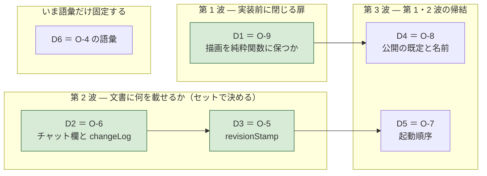

# Agent Interface の未決 5 件（＋ 実測で決着 5 件・決定 3 件）

- 日付: 2026-08-02
- **`handover/OPEN-ITEMS-ja.md` とは別物である。** あちらは MS Project の実機でしか
  分からない 3 件。本書は**この領域の未決**である。合流させない。
- 各件に **「決め方」** を書いた。決め方が書けないものは未決ですらない。

---

## 0. 実測で決着した 5 件（2026-08-02）

**測定環境は 2 系統ある。どの決着がどちらで測られたかを混ぜないこと。**

| 系統 | 環境 | 再現方法 | 測った決着 |
|---|---|---|---|
| **人が操作** | Microsoft Edge 151（Chromium 151）/ Windows 11 / **`file://` で直接開いた本物のページ** | `ai-cowork-trial/file-protocol-probe.html` をダブルクリック | 決着-1 / 決着-2 / 決着-3 |
| **外部から自動操作** | Playwright の Chromium 1228（本リポジトリの devDependencies に既存） | `node ai-cowork-trial/file-protocol-automation-probe.mjs` | 決着-4 / 決着-5 |

Edge の `navigator.userAgent` 実測値:
`Mozilla/5.0 (Windows NT 10.0; Win64; x64) AppleWebKit/537.36 (KHTML, like Gecko) Chrome/151.0.0.0 Safari/537.36 Edg/151.0.0.0`。

> ⚠️ **素の Chrome では未測定である。** Edge も Playwright の Chromium もエンジンは Chromium だが、
> **推測を断定で書かない**（`handover/README.md` §0-3）。
> 対応ブラウザの確定は `handover/NEXT-STEPS-ja.md` 1-1 の仕事である。
> **なお `fetch` の遮断（決着-2）だけは 2 系統の両方で同じ結果が出ている。**

### 決着-1. **`file://` でもファイル保存の仕組みは使える**（旧 O-1）

| 測ったこと | 実測値 |
|---|---|
| `window.isSecureContext` | **`true`** — `file://` は secure context である |
| `typeof window.showSaveFilePicker` | **`function`** |
| `typeof window.showOpenFilePicker` | **`function`** |
| `typeof window.showDirectoryPicker` | **`function`** |
| 実際に呼んだ結果（利用者がキャンセル） | **`AbortError: The user aborted a request.`** |

**`AbortError` は「ダイアログが開いて、利用者が閉じた」ことを意味する。**
オリジンで拒否されているなら `SecurityError` / `NotAllowedError` が返り、`AbortError` にはならない。
**したがって保存ダイアログは `file://` でも開く。**

**追測（2 回目）で、書き戻しまで通した。**

| 測ったこと | 実測値 |
|---|---|
| `showSaveFilePicker()` → `createWritable()` → `write()` → `close()` | **成功** |
| **同じハンドルへの 2 回目の書き込み** | **成功。ダイアログは出なかった**（利用者が画面で確認） |
| 同一セッション内の `queryPermission({mode:'readwrite'})` | **尋ねる前から `granted`** |
| ハンドルを IndexedDB に保存 → **ページをリロード** → 取り出す | **ハンドルは残っていた**（`name` も一致） |
| リロード直後の権限 | **`prompt` に戻る** |
| `requestPermission()` → 書き込み | **`granted` → 書き込み成功** |
| 復帰ダイアログの選択肢 | 「この時間を許可する」「アクセスするたびに確認する」「許可しない」。**「常に許可」は無い** |
| `showOpenFilePicker()` → 読む → 書き戻す | **129 バイト読取 → 196 バイト書戻し、成功** |
| ディスク側の確認 | **ファイルは 1 本だけ。同じパスに上書きされていた。` (1)` は作られていない** |

**何が決まったか**: 往復は **「同じファイルへ上書き保存」で実際に閉じる。**
AI がファイルを書き、人間が GRS で開いて編集し、**同じパスへ保存し直し**、AI が読み直す。
`agent-interface-spec-ja.md` §5-4。

> **同じ「ファイルを書き出す」でも、経路が違えば挙動が正反対だった。**
> ダウンロード（決着-3）は上書きされず ` (1)` が増える。
> 保存の仕組みは**同じ場所を上書きする**。**「編集中のファイル」を持つなら後者しかない。**

> **代償が 1 つある**: リロードのたびに権限が `prompt` に戻り、**利用者の 1 クリックが要る。**
> `file://` の復帰ダイアログに「常に許可」の選択肢が無いため、**この 1 クリックは省けない。**
> 起動のたびに「編集中のファイルへのアクセスを復帰しますか」を出す設計になる。

### 決着-2. **`file://` から隣のファイルは取得できない**（要求 A-13 の前提）

| 測ったこと | 実測値 |
|---|---|
| `fetch('./file-protocol-probe-data.json')` | **`BLOCKED -> TypeError: Failed to fetch`** |
| 同じファイルへの `XMLHttpRequest` | **`BLOCKED -> network error`** |
| `location.search` の読み取り | **可能**（値は空。クエリを付けずに開いたため） |

**何が決まったか**: **URL パラメータで文書を読ませる方式は `file://` では成立しない。**
パラメータ自体は読めるが、そこに書かれたファイルを取りに行けない。
**`file://` で文書を投入する経路は、起動時注入（`A-13`）だけである。**

これで要求 A-13 は「文献／未実測」から **実測** に変わった。

### 決着-3. **ダウンロードの保存先は制御できない。名前は尊重される。衝突は ` (n)`**（旧 O-3）

同じ名前 `grs-file-probe.json` で 2 回書き出し、ディスクを確認した結果:

| 実測 | 値 |
|---|---|
| 保存先 | **既定のダウンロードフォルダ。保存場所は聞かれなかった** |
| 1 回目のファイル名 | `grs-file-probe.json`（**要求した名前がそのまま**） |
| 2 回目のファイル名 | **`grs-file-probe (1).json`**（**上書きされず、` (1)` が付く**） |
| 中身 | 2 つとも別の内容で正しく保存されていた |

**何が決まったか**:

1. **保存先ディレクトリはアプリから制御できない。** 「ここへ保存して」と指示する設計にしない。
2. **ファイル名は尊重される。** 決定的な名前（例: 文書 id ＋ `revision`）を付ければ、
   AI 側は**名前だけで目的のファイルを特定できる**。
3. **上書きされない。** 同名を出し続けると ` (1)` ` (2)` … と増える。
   **「最新のものを読む」処理は、名前の一致ではなく更新時刻で選ぶ必要がある。**
   これは決着-1 の「同じファイルへ上書き保存」を選ぶ理由でもある。

---

### 決着-4. **`file://` のページは外から操作できる**（旧 O-2 の主要部）

**測定方法**: Playwright（Chromium 1228。本リポジトリの devDependencies に既にあるもの）で
`file://` のページを開き、外部プロセスから中の関数を呼んだ。
再現は `node ai-cowork-trial/file-protocol-automation-probe.mjs`。

| 測ったこと | 実測値 |
|---|---|
| `file://` への遷移 | **成功** |
| ページ内から見た `location.protocol` / `origin` | **`file:` / `file://`** — スナップショットではなく**本物の file オリジン** |
| 外部から DOM を読む | **成功** |
| **外部からページ内の関数を呼ぶ** | **成功。** `applyCommands({commands:[…]})` 相当が `{accepted:true, revision:1}` を返した |
| **その呼び出しが画面を変えたか** | **変わった**（`applied 2 command(s) at revision 1`） |
| `file://` のページのスクリーンショット | **取得できた** |
| 兄弟ファイルの `fetch`（決着-2 の別エンジンでの再確認） | **`BLOCKED TypeError: Failed to fetch`** — Edge と同じ |

**何が決まったか**: **AI は `file://` のまま GRS を起動し、API を呼び、画面を確認できる。**
サーバも拡張も要らない。当初の目的「日程の確認・検討・JSON 作成・書き出し」は、
**この経路だけで全部できる**。

> ⚠️ **区別すること。** これは **AI が自分のブラウザで開いた GRS** を操作した測定である。
> **人間が開いている画面**に外から入れるかは別問題で、まだ測れていない（下の O-2 残件）。
> ただし**ライブ共同編集はどのみちサーバを前提とする**（`A-16`）ので、残件の重みは下がった。

### 決着-5. **注入時のエスケープ規約は、無いと本当に壊れる**（`A-13` の裏取り）

同じ payload を**エスケープ有り／無し**で注入し、両方を `file://` で読み込んで比較した（対照実験）。
payload には日程データに普通に現れる文字を入れてある —
タスク名の中の `</script>`、`<b>bold</b>`、`&`、そして日本語。

| | エスケープ **有り** | エスケープ **無し** |
|---|---|---|
| 起動時に読めたか | **読めた** | **読めない** |
| 往復の同一性 | **完全一致** | — |
| 非 ASCII | **そのまま生存** | — |
| 失敗の中身 | — | `Unterminated string in JSON at position 76` |
| **ページ本文への漏れ** | 無し | **`bold` が本文に出た** |

**何が決まったか**: 規約は経験則ではなく**必須**である。しかも失敗の仕方が悪い。
`</script>` が早期にタグを閉じ、**残りが HTML として解釈されて本文に出る。**

> ⚠️ **これはセキュリティの話でもある。** 注入は実質 HTML のテンプレート処理なので、
> **タスク名に markup を入れた文書を渡されると、生成した `.html` に混入する。**
> `user-order.md` 62（信頼できない入力・`innerHTML` 直挿し禁止）と同じ土俵に載る。
> `agent-interface-spec-ja.md` §6。

---

## 0-2. 決める順（**依存と不可逆性で並べた**）

**並べ方の基準は 3 つ。** ① 実装が始まると**閉じてしまう扉**か ② 波及の広さ ③ 依存の向き。
結果は次期の実開発ステップ順（`handover/NEXT-STEPS-ja.md`）とほぼ一致した。**逆らわない。**

| 順 | 決めること | ステップ | なぜこの順か | 決めると何が書けるようになるか |
|:--:|---|:--:|---|---|
| ~~**D1**~~ | ~~**O-9** 描画を純粋関数に保つか~~ **→ 決定-1 で決着（§0-3）** | 3 | — | **確定**: 描画は純粋関数・成果物は単一 `.html` のみ |
| ~~**D2**~~ | ~~**O-6** チャット欄を MVP に入れるか~~ **→ 決定-2 で決着（§0-3）** | 1 | — | **確定**: チャット欄は入れる・保存は `changeLog` だけ |
| ~~**D3**~~ | ~~**O-5** `revisionStamp` を保存するか~~ **→ 決定-3 で決着（§0-3）** | 5 | — | **確定**: 3 キーを保存・`agentApiVersion` は入れない |
| **D4** | **O-8** 既定で公開するか・公開点の名前 | 3 | **D1 の結果で形が決まる**（モジュールの輸出か、ページ上の 1 点か） | `security-design.md` の脅威モデルに 1 行 |
| **D5** | **O-7** 起動順序とクラッシュ復旧の衝突 | 3 | **D3 が決まると**「復旧したものと投入されたものの見分け方」が決まる | `NEXT-STEPS` 3-5 localStorage のキー設計 |
| **D6** | **O-4 の語彙だけ** — 「競合の解消」と「取込マージ」を別語にする | 1 | **本体は延期してよいが、語だけは今分ける。** 前プロジェクトのバグ根因は**語彙の重複**であった（`handover/06-background/refactor-gui-data-separation-ja.md`）。**機能を作る前に語を分けるのは安い** | — |

### 延期してよい（2 件）

| 項目 | いつ決めるか | 延期してよい理由 |
|---|---|---|
| **O-4 本体**（自動マージを持つか） | 多人数編集を実装するとき | **2 者なら「拒否して読み直させる」で足りることを実測済み**（6 回発火・壊れた状態 0 件） |
| **O-10**（エージェントの寿命と追いつき） | サーバを立てるとき | サーバが無ければ保持すべきキューも無い |

### 決定ではなく測定（1 件）

| 項目 | いつ | 何もゲートしないと言える理由 |
|---|---|---|
| **O-2 残件**（人間が開いている画面に外から入れるか） | 拡張が繋がったとき。**5 分** | ライブ共同編集はどのみちサーバ前提（`A-16`）。ファイル経由の往復は決着-1、AI 単独の操作は決着-4 で成立済み |

> **D1 だけ性質が違う。** 他の 7 件は「決め直せる」が、D1 は**決めそこねると選択肢が消える**。
> 逆に言えば **D1 以外は、迷ったら先に進んでよい。**

---

## 0-3. 決定した項目

### 決定-1（旧 O-9 ＝ D1）. **描画は純粋関数に保つ。成果物は当面 単一 `.html` だけ**

- **決定日**: 2026-08-02 ／ **決めた人**: ユーザー

| 決めたこと | 内容 |
|---|---|
| **描画** | **DOM 非依存の純粋関数に保つ。** `document` に触らず、SVG 文字列を返す |
| **成果物** | **当面は単一 `.html` だけ。** ライブラリ／CLI は出さない |
| **将来** | 必要になった日に足す。**純粋性さえ保てば後から足せる** |

**理由（ユーザー判断）**: **純粋関数のほうが作りやすい。意図しない競合が起こらないから。**

補強となる材料が 3 つある。

1. **決着-4 で CLI の必要性が下がった。** AI は `file://` のまま GRS を起動し、API を呼び、
   画面を確認できることを実測した。「ブラウザ抜きで」の動機がかなり消えている。
2. **既存の決定と同じ方向を向いている。** Undo は**不変更新スナップショット**が前提
   （`handover/07-plan-actual/handover-plan-actual-decisions-ja.md` §8）であり、純粋な描画と整合する。
   **CLI を作らなくても元が取れる。**
3. **成果物は後から増やせるが、純粋性は後から取り戻せない。**
   閉じる扉だけ開けておいて、荷物は増やさない。

> **この決定が縛るもの**: `handover/NEXT-STEPS-ja.md` **3-3 モジュール構成** と **3-4 技術スタック**。
> 描画層が `document` に触れない構成にすること。**レビューの観点として残す。**

### 決定-2（旧 O-6 ＝ D2）. **画面上で AI と会話する。保存するのは「変更の理由」だけ**

- **決定日**: 2026-08-02 ／ **決めた人**: ユーザー

| 決めたこと | 内容 |
|---|---|
| **チャット欄** | **MVP に入れる。** 日程表を見ながら AI に言葉で指示する |
| **保存対象** | **会話は保存しない。**「どの `revision` で・誰が・なぜ変えたか」＝ `changeLog` だけ保存する |
| **上限** | **設けない。** 変更 1 回につき 1 件なので**変更回数で自然に有界** |
| **同梱の承諾** | **`changeLog` は文書に保存され、日程表を渡すと一緒に渡る。** ユーザーが明示的に承諾済み |

**狙い（ユーザー提示のユースケース）**: 日付をドラッグする代わりに**言葉で日程を動かす**。

> 「もっと検証の期間を長くして」
> 「設計と検証は途中から並行にできるでしょ？」

**保存対象を絞った理由（ユーザー判断）**: **トライアルの将棋の会話は要らない。**
実際に 42 通を見返すと、残す価値があったのは「**なぜその手を指したか**」と
「**前の発言は間違いだった**」の 2 種類だけで、感想と雑談には無かった。

**この絞り込みで 3 つ同時に片づいた。**

1. **プライバシーの懸念がほぼ消えた。** 残るのは日程についての記述だけで、
   雑談や人物評が同梱されない。`CLAUDE.md` の条件付きプロセス（法規調査の無効理由が
   「サーバー送信なしのローカルツール」であること）を揺らさずに済む見込み。
2. **文書が肥大しない。** 上限の設計そのものが不要になった。
3. **価値の中心は残る。** 「なぜこの日程になったか」と「前の判断は間違いだった」は
   どちらも変更に紐づくので保存される。

**失うもの**: **何も変更しなかったときの発言は残らない**（「この日程は間に合いません」とだけ言って
何も動かさなかった場合など）。**日程表に残す価値が薄いと判断して受け入れた。**

> **この決定が縛るもの**: `handover/NEXT-STEPS-ja.md` **2-1 視覚モック**（チャット面が乗る）／
> **2-5 通知**（`Toast` との住み分け）／**5-1 JSON Schema**（`changeLog` を含める）。
> 命名は `note` / `notes` を避けること（`Task.notes` と衝突するため）。
### 決定-3（旧 O-5 ＝ D3）. **`revisionStamp` は保存する。`agentApiVersion` は入れない**

- **決定日**: 2026-08-02 ／ **決めた人**: ユーザー

| 決めたこと | 内容 |
|---|---|
| **保存する** | `revision` / `lastEditedBy` / `updatedAt` の **3 つ** |
| **保存しない** | **`agentApiVersion`**。書いた側の都合であって日程表の情報ではない |

**決定-2 で半分決まっていた。** `changeLog` の各項目が `revision` を持つので、
**版番号が文書に保存されること自体は確定済み**だった。残っていたのは「いまの版はいくつか」だけである。

**保存する理由**: 決着-1 で**ファイルが往復の運び手**になった。AI が書いたファイルに人間が上書き保存し、
AI が読み直す。このとき版が乗っていないと、**AI は「自分が書いたままか、人が直した後か」を
中身の全比較でしか判定できない。**

**`agentApiVersion` を外す理由**: 入れると**版が上がるたびに全ファイルの diff が出る**。
読み込む側は自分の版で解釈すればよく、書いた側の版は要らない。

**代償（決定論性）**: 「同じ日程 → 常に同じ JSON」が崩れ、中身が同じでも版が違えば diff が出る。
ただし **`updatedAt` を入れる時点でどのみち発生する**ノイズであり、`revision` の 1 行で悪化しない。
決定論性が本当に要る往復無損失の検査（`user-order.md` 56）は MSPDI の話であり、
**`revisionStamp` は MSPDI へ書き出さない**と既に決めている。

> **この決定が縛るもの**: `handover/NEXT-STEPS-ja.md` **5-1 JSON Schema**（3 キーを含める）／
> **2-6 初期テンプレート**（新規文書の初期値をどうするか）。
---

## A. まだ実測できていない（1 件・重みは下がった）

### O-2（残件）. **人間が開いている** `file://` のページに外から入れるか

| | |
|---|---|
| **決着-4 との違い** | 決着-4 は**AI が自分で開いたブラウザ**での測定。こちらは**人間が見ている画面そのもの**に外部から入れるか |
| **なぜ要るか** | 入れるなら、`file://` のままでも「人間の画面を AI が直接いじる」ライブ共同編集ができる |
| **なぜ重みが下がったか** | ① **ライブ共同編集はどのみちサーバを前提とする**（`A-16`） ② ファイル経由の往復は決着-1 で成立済み ③ AI 単独の操作は決着-4 で成立済み |
| **なぜ測れていないか** | ブラウザ拡張が本セッション中ずっと未接続だった |
| **決め方** | 拡張の「ファイル URL へのアクセスを許可」を有効にし、`file://` のページで関数を呼べるか試す |
| **どこで** | 実開発ステップ 1（対象環境の定義）と同時。**開発を止める理由にはならない** |

---

## B. 設計で決めること（4 件）

### O-4. 競合の解消方針

| | |
|---|---|
| **今どこまで** | 「後勝ちを禁止し、拒否して読み直させる」だけ実装・実測（**6 回発火**） |
| **決めること** | 自動マージを持つか。持つなら**どの粒度で**（タスク単位 / フィールド単位） |
| **注意** | `user-order.md` 61 の**取込マージ**（「上書き / 別のものとして取り込む / 取込をやめる」）とは**別物**。**名前を衝突させないこと** |
| **どこで** | 多人数編集を実装するとき（`user-order.md` 65-1）。**2 者なら現状で足りる** |

### O-7. 起動順序とクラッシュ復旧の衝突

| | |
|---|---|
| **争点** | 注入された文書がある状態で起動したとき、**localStorage の復旧確認を出すのか、黙って注入を優先するのか** |
| **既存** | `user-order.md` 60（自動保存とクラッシュ復旧）／`handover/05-security-a11y/security-design.md` §5（**破損時はサイレントに破棄せず通知**） |
| **決め方** | 「注入は明示的な意思」と見るなら注入優先＋復旧は通知のみ。安全側なら常に確認を出す |
| **どこで** | 実開発ステップ 3（アーキ設計）— localStorage のキー設計と同時 |

### O-8. GRS Agent API を既定で公開するか

| | |
|---|---|
| **争点** | 単一 `.html` をオフラインで開く限り同一ページに他人のコードは無い。しかし**既定で公開する**と、将来サーバ配信したときに前提が変わる |
| **決めること** | ① 既定で公開 / 明示的に有効化したときだけ公開 / ビルド種別で分ける ② **公開点の名前**（初稿の `window.grScheduler` は置き場所を名前に埋め込んでいたため撤回済み ＝ `agent-interface-spec-ja.md` §0） |
| **どこで** | 実開発ステップ 3（アーキ設計）。**`handover/05-security-a11y/security-design.md` の脅威モデルに 1 行足すこと** |

### O-10. エージェント側の寿命と追いつき

| | |
|---|---|
| **今どこまで** | トライアルの待機プロセスは**セッションが終わると一緒に死んだ**（実際に 1 回失われた） |
| **争点** | AI が落ちて復帰したとき、取りこぼしなく追いつけるか。**`sinceRevision` の設計上そうなるはずだが未検証** |
| **決めること** | 変更の履歴をどこまで保持するか（サーバ側キューの深さ）。`revision` だけで足りるか、変更の内容も要るか |
| **どこで** | サーバを立てるとき（`user-order.md` 65-1） |

---

## 数

| 区分 | 件数 |
|---|:--:|
| **実測で決着** | **5** |
| **決定済み** | **3**（D1・D2・D3） |
| A まだ実測できていない | 1 |
| B 設計で決める | 4 |
| **未決の合計** | **5** |
