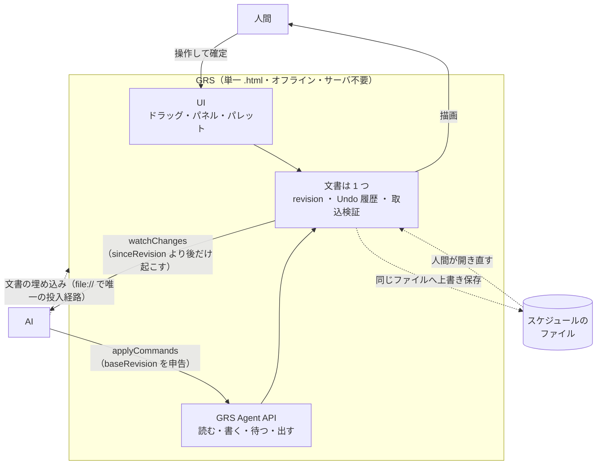

# Agent Interface — handover 組込み用ドラフト一式

- 日付: 2026-08-02
- 由来: 本フォルダ（`ai-cowork-trial/`）で実施した **人間と AI の共同編集トライアル 2 本**
  （最小版 ＝ ○×ゲーム / 実寸版 ＝ 将棋）
- 目的: **GRS に「機械向けインターフェース」を持たせるための要求・仕様・サンプル・根拠**を、
  `handover/` の書式に合わせて用意する。

---

## 0. この一式の身分（先に読む）

> **これは決定ではない。** `handover/` で `authority` を持つ 4 文書のいずれも上書きしない。
> **5 つ目の正を作らない**（`handover/README.md` §`authority`）。

| このドラフト | handover へ入れたあとの想定 |
|---|---|
| `ai-cowork-trial-findings-ja.md` | `type: Reference`（事実の記録）。**そのまま入る** |
| `agent-interface-requirements-ja.md` | 次期が採否を判断してから `Decision Record` に格上げ。**今は `Working Note` / `draft`** |
| `agent-interface-spec-ja.md` | 同上 |
| `agent-interface-samples-ja.md` | 採否が決まった時点で `Reference` |
| `OPEN-ITEMS-ja.md` | `handover/OPEN-ITEMS-ja.md` に**合流させず別建て**（あちらは MS Project 実機の 3 件専用） |
| `MERGE-PLAN-ja.md` | **handover には入れない。** 組込み作業が終わったら破棄する |

**番号 `A-1` 〜 `A-18` はこのドラフト内だけの通し番号である。**
次期は自分の体系で振り直すこと（`handover/README.md` §0-4）。

---

## 1. 読む順

| 順 | ファイル | 何が書いてあるか | 性質 |
|:--:|---|---|---|
| **1** | **`ai-cowork-trial-findings-ja.md`** | **トライアルで実際に起きたこと**。測った数字・踏んだ不具合・AI が自分の誤りを訂正した全数 | **事実**。要求の根拠はここ |
| 2 | `agent-interface-requirements-ja.md` | 要求 18 件。各件に「どの実測から来たか」を併記 | **提案**。決定ではない |
| 3 | `agent-interface-spec-ja.md` | API 契約の具体形（関数・エンベロープ・コマンド・エラー・監視・起動時投入） | **提案**。決定ではない |
| 4 | `agent-interface-samples-ja.md` | 動く実例。`handover/02-data-model/handover-data-model-entry-ja.md` の JSON 実例に**エンベロープを足した形** | 参考 |
| — | `OPEN-ITEMS-ja.md` | **未決 3 件**（＋ **実測で決着 7 件**・**決定 4 件**） | 未決 |
| — | `MERGE-PLAN-ja.md` | どのフォルダへ入れ、どの既存文書に 1 行足すか。検査コマンド付き | 作業用 |
| — | `samples/*.json` | 機械可読の実例 2 本 | 参考 |

---

## 2. 一行で言うと

**GRS は「人間が UI で編集する」のと同じことを、AI が API で行えること。**
そのために文書へ `revision` を持たせ、書き込みを楽観ロックし、変更を revision スコープで通知する。

**図の要点は 1 つだけ** — **口は 2 つあるが、文書は 1 つである。**
UI からの変更も API からの変更も**同じ `revision` を進め、同じ Undo 履歴に積まれ、同じ検証を通る**。
AI 専用の裏口を作らない、というのがこの一式の中心にある主張である（`A-1` / `A-4` / `A-7`）。

破線は `file://` のときの経路である。**実線の 3 本と破線の 3 本は、いずれも実測で成立を確認した**
（`OPEN-ITEMS-ja.md` 決着-1 〜 決着-7）。**人間が開いている画面にエージェントが入ることも実測済み**
（決着-7）。サーバが要るのは**多人数**の編集だけである（`A-16` / `user-order.md` 65-1）。

> **`api` は既定では存在しない。** 人間が画面で有効にしたとき、
> またはエージェントが起動時にフラグを立てたときだけ現れる（決定-4）。

トライアルはこれが**実際に必要になること**を、作って動かして確かめた記録である。
将棋 61 手と会話 42 通を、**開発チャットを一度も経由せずに**回している。

---

## 3. handover の既存決定との関係

**新しく決めているのは「機械向けのインターフェース」だけで、中身の設計は既存の正に従う。**

| このドラフトが触れる領域 | 既存の正 | 関係 |
|---|---|---|
| Undo の方式 | `07-plan-actual/handover-plan-actual-decisions-ja.md` §8（不変更新スナップショット） | **そのまま使う**。API 専用の Undo を作らない |
| データ構造 | `02-data-model/grs-native-erd-ja.md` | **変えない**。トップレベルに任意のエンベロープを 1 つ足す提案のみ |
| 設定値 | `02-data-model/grs-document-settings-ja.md` | **触らない**。エンベロープは `documentSettings` に入れない |
| 命名 | `03-ui-naming/handover-ui-parts-ja.md` §1-2 | **従う**（JSON プロパティは camelCase、略語を識別子に入れない） |
| 取込の検証 | `05-security-a11y/security-design.md` / `user-order.md` 62 | **API 経由でも同じ検証を通す**（A-7） |
| 共同編集 | `user-order.md` 65-1（将来拡張） | **その前提部品**として位置づける |
| アーキ（ストア・モジュール構成・技術スタック） | `09-architecture/handover-architecture-entry-ja.md` §2・§4 | **意図的な空白を埋めない。** 決めるのは次期のステップ 3 |

---

## 4. 中立性

`handover/README.md` §0-5 に従い、**特定の業種・特定の製品に依存する記述を入れていない。**
例外は `MS Project` / `MSPDI` のみ（交換フォーマットの相手先＝機能要求そのもの）。

トライアルの題材（○×・将棋）は**共同編集の検証用の題材であって、GRS の機能ではない**。
本文で題材に触れるのは、**そこで何が測れたか**を示すときだけに限っている。
