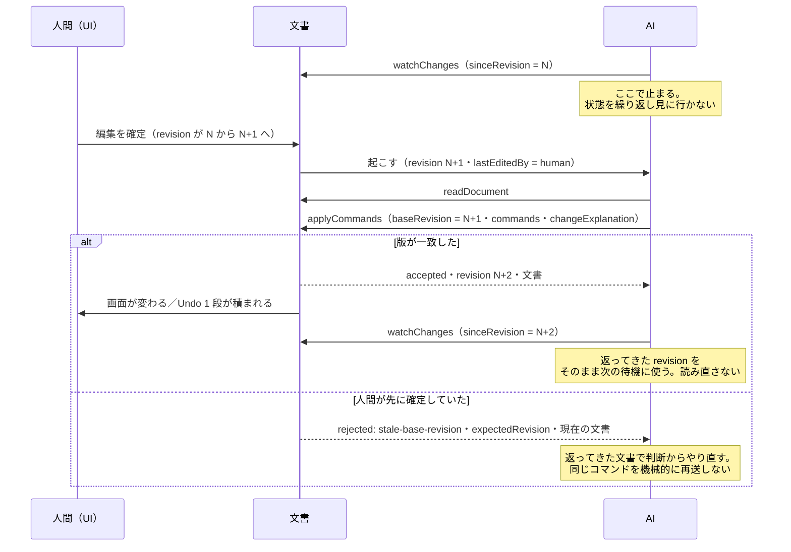

# Agent Interface 仕様（ドラフト）

- 日付: 2026-08-02
- 対応する要求: `agent-interface-requirements-ja.md`
- **これは提案である。決定ではない。**
- **記法は `handover/03-ui-naming/handover-ui-parts-ja.md` §1-2 に従う**
  （型 PascalCase / 関数・JSON プロパティ camelCase / 文字列判別値 kebab-case / 略語を識別子に入れない）。

---

## 0. 名前

| 面 | 名前 | 備考 |
|---|---|---|
| **インターフェースの呼び名** | **GRS Agent API** | 散文ではこう呼ぶ |
| 型 | `GrSchedulerAgentApi` | §1 |
| 文書のトップレベル | `revisionStamp` / `changeLog` | §2 |
| 版数 | `agentApiVersion` | semver |
| **ページ上のどこに出すか** | **未決** | 実装時に決める（`OPEN-ITEMS-ja.md` O-8） |

> **公開点の名前を契約の名前にしない。**
> 初稿では `window.grScheduler` と書いていたが、これは 2 つの意味で誤りだった。
>
> 1. **`window` はブラウザ実装の置き場所であって、インターフェースの名前ではない。**
>    同じ契約はライブラリ・CLI・将来のサーバからも呼ばれる（`A-15` / `A-16`）。
>    置き場所を名前に埋め込むと、**置き場所が増えた瞬間に名前が嘘になる。**
> 2. **そもそも既定で公開するかが未決**である（`OPEN-ITEMS-ja.md` O-8）。
>    未決のものを名前として確定させてはならない。
>
> **契約は `GrSchedulerAgentApi`。どこに何という名前で置くかは、実装時に O-8 と一緒に決める。**

> `grs` のような略語を識別子にしない（`handover-ui-parts-ja.md` §1-2「略語は識別子に入れない」）。
> **`Api` は残した** — `Lod` と違い camelCase に落ちても語として読めるため（同節が禁じているのは
> 「落ちた瞬間に意味が消える」略語である。同書は `UI` を語として使っている）。
> **ただし最終判断は命名の正（`handover-ui-parts-ja.md`）が持つ。**
> **散文では GRS と書いてよい。**

---

## 1. 関数

```ts
/** GRS Agent API。人間向け UI と同じ文書・同じ履歴・同じ検証を通る。 */
interface GrSchedulerAgentApi {
  /** 契約の版。呼ぶ側は最初にこれを読む。major が違えば呼ばない。 */
  readonly agentApiVersion: string;
  /** 文書スキーマの版（既存の schemaVersion と同じ値）。 */
  readonly schemaVersion: string;

  // --- 読む（副作用なし・不変コピーを返す）
  readDocument(): GrSchedulerDocument;
  readRevision(): number;
  readSelectedTaskUids(): number[];
  readViewState(): ViewState;

  // --- 書く（UI と同じ履歴を通る。1 回の呼び出し = Undo 1 段）
  applyCommands(request: ApplyRequest): ApplyOutcome;
  loadDocument(request: LoadRequest): ApplyOutcome;

  // --- 履歴（コマンドではない。履歴そのものを動かすため）
  undo(steps?: number): ApplyOutcome;
  redo(steps?: number): ApplyOutcome;

  // --- 出す（保存ダイアログを出さずに値を返す）
  exportJson(): string;
  exportMspdi(): string;
  exportSvg(): string;
  exportPng(): Promise<Blob>;

  // --- 見せる（人間に「ここを見て」と促す）
  setViewState(request: ViewStateRequest): ApplyOutcome;
  focusTask(taskUid: number): ApplyOutcome;

  // --- 待つ
  watchChanges(request: WatchRequest): StopWatching;
}

type StopWatching = () => void;
```

**`undo` / `redo` をコマンドにしない理由**: コマンドは「文書をどう変えるか」を表す。
履歴を動かす操作をその中に混ぜると、**原子的な一括適用（`A-5`）の巻き戻し対象に履歴操作が入る**。
別の関数に分ける。

---

## 2. 文書に足すもの

**既存の構造（`handover/02-data-model/grs-native-erd-ja.md`）は変えない。**
トップレベルに 2 つ足すだけである。

```jsonc
{
  "schemaVersion": "grs-1",

  "revisionStamp": {
    "revision": 104,
    "lastEditedBy": "agent",
    "updatedAt": "2026-08-02T13:24:51.117Z"
  },

  "changeLog": [
    {
      "revision": 12,
      "editedBy": "agent",
      "explanation": "検証は設計の終了より前に始められないため、完了を 2027-01-15 へ移した。デッドラインは意図して動かしていない",
      "changedAt": "2026-08-02T13:24:51.117Z"
    }
  ],

  "project": { },
  "documentSettings": { },
  "tasks": [ ]
}
```

### 2-1. `revisionStamp`

| プロパティ | 型 | 意味 |
|---|---|---|
| `revision` | integer | **あらゆる確定で 1 増える。** 減らない。飛ばさない |
| `lastEditedBy` | `"human"` \| `"agent"` | **最後に確定させたのは誰か。** 監視の判定に使う（`A-11`） |
| `updatedAt` | ISO 8601 | 最後の確定時刻 |

**保存する**（`OPEN-ITEMS-ja.md` 決定-3）。`file://` ではファイルが往復の運び手になるので
（決着-1）、**版が乗っていないと「自分が書いたままか、人が直した後か」を中身の全比較でしか判定できない。**

> ⚠️ **`agentApiVersion` は入れない。** 書いた側の都合であって日程表の情報ではない。
> 入れると**版が上がるたびに全ファイルの diff が出る**。読み込む側は自分の版で解釈すればよい。

> ⚠️ **`documentSettings` に入れてはならない。**
> `documentSettings` は「同じ JSON から同じ絵を得るためのもの」であり
> （`handover/02-data-model/grs-document-settings-ja.md` §2）、**`revisionStamp` は絵に影響しない**。
> 混ぜると「全項目を常に書き出す」規約の対象が濁る。

> ⚠️ **MSPDI へは書き出さない。** MSPDI 側に対応する概念がなく、
> Carry（`grs-native-erd-ja.md` §5.5d）へ載せる意味もない。**往復の対象外とする。**

### 2-2. `changeLog` — **会話は保存しない。変更の理由だけ保存する**

**2 つを分ける**（`OPEN-ITEMS-ja.md` 決定-2）。

| | 何か | 保存 |
|---|---|---|
| **チャット欄** | 画面上での人間と AI の実行時のやり取り。指示・確認・雑談 | **しない**（実行時のみ） |
| **`changeLog`** | どの `revision` で・誰が・**なぜ**変えたか | **する** |

| プロパティ | 型 | 意味 |
|---|---|---|
| `revision` | integer | **どの版で変えたか。** `revisionStamp.revision` と同じ体系 |
| `editedBy` | `"human"` | `"agent"` | 誰の変更か |
| `explanation` | string | **何を・なぜ変えたか。** 表示は必ずテキストとして行う（`innerHTML` 直挿し禁止 ＝ `user-order.md` 62） |
| `changedAt` | ISO 8601 | 変更時刻 |

**規則**:

- **変更を伴わない発言は残らない。** `changeLog` の項目は、実際に文書が変わった `revision` にしか付かない。
- **人間の UI 操作には通常 `explanation` が付かない。** 付けたいときだけ付く。したがって項目は疎である。
- **`note` / `notes` という語を使わない。** `Task.notes` が既にあり、
  **語彙の重複は前プロジェクトのバグ根因**である（`handover/06-background/refactor-gui-data-separation-ja.md`）。

> **なぜ会話を丸ごと保存しないか**（ユーザー判断 2026-08-02）:
> トライアルの会話 42 通を見返すと、残す価値があったのは「**なぜその手を指したか**」と
> 「**前の発言は間違いだった**」の 2 種類だけで、感想と雑談には無かった。
> 会話を丸ごと保存すると、**価値の薄いものが日程表に同梱され、プライバシーの懸念だけが残る。**
>
> **効果が 3 つある。** ① 変更 1 回につき 1 件なので**変更回数で自然に有界**（上限の設計が要らない）
> ② 残るのは日程についての記述だけなので**プライバシーの懸念がほぼ消える**
> ③ 「なぜこの日程になったか」と「前の判断は間違いだった」は**変更に紐づくので保存される**
>
> **失うもの**: **何も変更しなかったときの発言は残らない。** 意図して受け入れた代償である。

---

## 3. 書き込みの契約

```ts
interface ApplyRequest {
  /** 呼ぶ側が読んだ版。食い違えば拒否される。人間の UI 操作では省略してよい。 */
  baseRevision?: number;
  /** 誰の変更か。既定は 'agent'。 */
  editedBy?: 'human' | 'agent';
  /** 原子的に適用する。1 つでも拒否されたら全部戻す。 */
  commands: GrSchedulerCommand[];
  /** 同じ往復で「なぜ変えたか」も残す（A-18 粒度）。changeLog へ 1 件積まれる。 */
  changeExplanation?: string;
}

interface ApplyOutcome {
  accepted: boolean;
  /** 適用後（拒否時は現在）の版。呼ぶ側はこれを次の sinceRevision に使う。 */
  revision: number;
  /** 拒否理由。accepted === true のときは無い。 */
  rejectionReason?: RejectionReason;
  /** 拒否が staleBaseRevision のとき、GRS が期待した版。 */
  expectedRevision?: number;
  /** 常に現在の文書（不変コピー）。拒否時も返す — 読み直しの往復を省くため。 */
  document: GrSchedulerDocument;
}

type RejectionReason =
  | 'stale-base-revision'   // baseRevision が現在と違う
  | 'unknown-command'       // 知らない commandName
  | 'invalid-argument'      // 引数の型・値域
  | 'validation-rejected'   // 取込検証で弾いた（user-order.md 62）
  | 'document-locked'       // 読取専用／権限（user-order.md 65-2）
  | 'gesture-in-progress';  // 人間がドラッグ中
```

**拒否のときも文書を返す**のが要点である。トライアルでは拒否 6 回のすべてで、
**返ってきた文書をそのまま使って再送**できた。**読み直しの往復が要らない。**

### 3-1. コマンド

判別は `commandName`（`type` のような無意味な語を使わない）。

```jsonc
{ "commandName": "create-task",
  "wbsParentUid": 1, "wbsOrder": 2, "name": "検証", "start": "...", "finish": "...", "milestone": false }

{ "commandName": "update-task",
  "taskUid": 3, "start": "2026-06-01T09:00:00", "finish": "2026-10-15T17:00:00" }

{ "commandName": "delete-task", "taskUid": 3 }

{ "commandName": "assign-task-to-group",   "taskUid": 3, "groupId": "grp-a", "stackOrder": null }
{ "commandName": "remove-task-from-group", "taskUid": 3, "groupId": "grp-a" }

{ "commandName": "create-task-group", "groupId": "grp-b", "parentId": null,
  "derivedFromTaskUid": 5, "order": 1 }
{ "commandName": "update-task-group", "groupId": "grp-b", "label": "製品B", "collapsed": true }
{ "commandName": "delete-task-group", "groupId": "grp-b" }

{ "commandName": "create-dependency",
  "predecessorUid": 2, "successorUid": 3, "linkType": 1, "lag": 0, "lagFormat": 7 }
{ "commandName": "delete-dependency", "predecessorUid": 2, "successorUid": 3 }

{ "commandName": "update-task-visual",
  "taskUid": 3, "shapeKind": "chevron", "fillColor": "#6aa84f" }

{ "commandName": "update-document-settings",
  "changedSettings": { "assigneeVisible": true, "zoomX": 1.5 } }
```

**規則**:

- コマンド名は kebab-case の文字列判別値（`handover-ui-parts-ja.md` §1-2）。
- 引数のプロパティ名は **`grs-native-erd-ja.md` の属性名と語幹を一致させる**。新語を作らない。
- **一覧はこれで確定ではない。** 実開発で UI の操作割当
  （`handover/03-ui-naming/handover-ui-detail-spec-ja.md` §5）と**1 対 1**に整える。

### 3-2. 適用の順序

1. `baseRevision` を照合。違えば **`stale-base-revision`** で全部拒否。
2. 現在の文書のスナップショットを取る。
3. コマンドを順に検証・適用。**1 つでも失敗したらスナップショットへ戻して拒否。**
4. 全部通ったら Undo 履歴へ **1 段**として積む。
5. `revision` を 1 増やし、`lastEditedBy` と `updatedAt` を書く。
6. `changeExplanation` があれば `changeLog` へ 1 件足す（**同じ `revision` に紐づけて**）。
7. 監視中の購読者へ通知する。

> **6 が同じ `revision` に入るのは意図である。** 「この変更を、この理由で確定した」を 1 つの版として残す。
> トライアルでは会話を別の書き込みにしていたため、`revision` が会話のぶんだけ余分に進んだ
> （104 のうち **42 が会話**）。**GRS では 1 変更 1 版になる。**

---

## 4. 監視

### 4-0. 1 往復の全体像



**この図が言っているのは 3 つである。**

1. **AI を動かすのは push ではなく「止まって待つ呼び出し」**である（`A-10`）。
2. **右の分岐は珍しくない。** トライアルでは 1 セッションで **6 回**通った（`A-3`）。
3. **呼び出しは 3 回で 1 往復**（起床 → 読む → 書く＋喋る）。
   `applyCommands` が新しい `revision` を返すので、待機を張り直すために読み直さない（`A-18`）。

### 4-1. 契約

```ts
interface WatchRequest {
  /** これ以下の版では絶対に呼ばない。必須。 */
  sinceRevision: number;
  /** 自分の変更で起きないようにする。既定は 'agent'。 */
  self?: 'human' | 'agent';
  onChange: (outcome: { revision: number; document: GrSchedulerDocument }) => void;
}
```

**起こす条件**（`A-10` / `A-11`）:

```
revision > sinceRevision  かつ  lastEditedBy !== self
```

> ⚠️ **`sinceRevision` を省略可能にしてはならない。**
> 省略できる設計にすると、**処理済みの状態で即座に起きて、監視を張り直すたびに空振りする**。
> トライアルで実際にビジーループを踏み、必須化して直した（`ai-cowork-trial-findings-ja.md` §3-1）。

**プロセス外（将来の CLI／サーバ）でも意味は同じ**である。
「`sinceRevision` より後に、自分以外が確定するまで返らない」呼び出しを 1 つ用意する。

---

## 5. 起動時の投入

### 5-1. 単一 `.html` への注入（`file://` で唯一成立する経路）

ビルド成果物の `.html` は、**空の入れ口を最初から持つ**。

```html
<script type="application/json" id="grs-boot-document">null</script>
```

**注入する側の規約**:

| # | 規約 | 理由 |
|:--:|---|---|
| 1 | 入れ口は**ちょうど 1 つ**。複数あれば起動を中止して通知する | 曖昧さを残さない |
| 2 | 文字列中の `<` を `\u003c` へ置き換える | **対照実験で確認済み。** 省くと `</script>` がタグを早期に閉じ、**JSON は解析不能になり、残りが HTML として本文に出る**（`OPEN-ITEMS-ja.md` 決着-5） |
| 3 | 解析に失敗したら**無視して空で起動し、通知する**（黙って捨てない） | `security-design.md` §5 と同じ姿勢 |
| 4 | 投入された文書も**信頼できない入力として検証する** | `user-order.md` 62。**注入経路は検証の抜け道にしない** |

> ⚠️ **規約 2 はセキュリティ対策である。** 注入は実質 HTML のテンプレート処理なので、
> **タスク名に markup を仕込んだ文書を渡されると、生成した `.html` に混入する。**
> 「壊れるから」ではなく「**注入されるから**」エスケープする。§6 に再掲。

### 5-2. URL パラメータ（`http(s)` のときだけ）

```
grs.html?documentPath=./schedule.json
```

| # | 規約 |
|:--:|---|
| 1 | **`file://` では機能しない（実測）。** パラメータは読めるが、**取得が拒否される** — 兄弟ファイルへの `fetch` は `TypeError: Failed to fetch`、`XMLHttpRequest` は network error（`OPEN-ITEMS-ja.md` 決着-2）。**UI で理由を通知する** |
| 2 | **同一オリジンの相対パスのみ**。スキーム付き・`//` 始まり・上位ディレクトリへの脱出は拒否 |
| 3 | 取得したものは §5-1 の 4 と同じ検証を通す |

### 5-4. 保存の往復（`file://` でも成立する — 実測）

**`file://` でもファイル保存の仕組み（File System Access API）は使える。**
`isSecureContext` は `true`、`showSaveFilePicker` / `showOpenFilePicker` / `showDirectoryPicker` は
いずれも関数として存在し、実際に呼ぶと**保存ダイアログが開く**
（`OPEN-ITEMS-ja.md` 決着-1。Edge 151 で実測）。

したがって往復は **1 本のパスで閉じられる**。

```
AI がファイルを書く  ->  人間が GRS で開く（開くときにハンドルを得る）
                    ->  人間が編集して保存（同じハンドルへ上書き）
                    ->  AI が同じパスを読み直す
```

**実測で確かめた挙動**（Edge 151 / `file://`。全数は `OPEN-ITEMS-ja.md` 決着-1）:

| 挙動 | 実測 |
|---|---|
| ハンドルを取り、書き込む | **成功** |
| **同じハンドルへの 2 回目以降の書き込み** | **成功。ダイアログは出ない** — 人間の Ctrl+S 相当が邪魔されない |
| ハンドルをリロードまたぎで保持（IndexedDB） | **残る** |
| リロード直後の権限 | **`prompt` に戻る。1 クリックで `granted`** |
| 開いた既存ファイルへの書き戻し | **成功**（読取 → 変更 → 同じファイルへ書き込み） |
| ディスク上の結果 | **同じパスに上書き。` (1)` は作られない** |

**規約**:

| # | 規約 | 理由 |
|:--:|---|---|
| 1 | 開いたときのハンドルを保持し、保存は**同じハンドルへ上書き**する | 2 回目以降はダイアログが出ない（実測）。保存のたびに場所を選ばせない |
| 2 | ハンドルを保持し、**リロードをまたいで復帰させる** | ハンドルは残る（実測）。「編集中のファイル」を覚えていられる |
| 3 | 起動時に**「編集中のファイルへのアクセスを復帰しますか」を出す** | **権限は `prompt` に戻り、1 クリックが必要。省けない** — `file://` の復帰ダイアログに「常に許可」が無い（実測） |
| 4 | ハンドルが無い場合の書き出しは**決定的なファイル名**にする（例: 文書 id ＋ `revision`） | 名前は尊重されるので、**AI は名前で特定できる** |
| 5 | **保存先ディレクトリを指定しようとしない** | 制御できない（決着-3） |
| 6 | **「編集中のファイル」をダウンロードで実現しない** | ダウンロードは上書きされず ` (1)` ` (2)` と増える（決着-3）。**同じ「書き出す」でも経路で挙動が正反対である** |

### 5-3. 起動順序（**未決**）

素直に書けば次の順になるが、**既存のクラッシュ復旧と衝突しうる**。

```
注入された文書 → URL パラメータ → localStorage の自動保存 → 初期テンプレート
```

> ⚠️ `user-order.md` 60 は localStorage への自動保存と**クラッシュ復旧**を要求し、
> `security-design.md` §5 は「破損時はサイレントに破棄せず**復旧確認で通知する**」としている。
> **投入された文書がある場合に復旧確認を出すのか、黙って投入を優先するのかは決まっていない。**
> `OPEN-ITEMS-ja.md` O-7。

---

## 6. 防御（`A-7`）

**API は UI の防御を迂回しない。** 実装時に次を通ることを確認する。

| 防御 | 迂回されると何が起きるか | 既存の正 |
|---|---|---|
| 取込データの厳格な検証 | 注入・URL・`loadDocument` が**検証の抜け道**になる | `user-order.md` 62 / `05-security-a11y/security-design.md` §3 |
| `innerHTML` 直挿しの禁止 | `changeLog` の `explanation` と `Task.notes` が**注入点**になる | 同 |
| XXE の無効化 | MSPDI 取込が外部実体を読む | 同 |
| 透かしのパスワード照合 | 透かしを API で外せる。**生パスワードを保存しない**規約も併せて守る | `user-order.md` 62 |
| 編集権限（将来） | 参照専用の `TaskGroup` を API で書き換えられる | `user-order.md` 65-2 |

> **GRS Agent API を既定で公開するかどうか**は未決である（`OPEN-ITEMS-ja.md` O-8）。
> 単一 `.html` をオフラインで開く限り同一ページに他人のコードは無いが、
> **「既定で出す」か「明示的に有効化したときだけ出す」か**は決めておく。

---

## 7. 将来の機械連携（`A-16`）

**サーバを立てたときの窓口は、§1 の関数と 1 対 1 にする。**

| §1 の関数 | 将来の窓口（名前は 1 対 1 にする） |
|---|---|
| `readDocument` / `readRevision` | 文書の取得 |
| `applyCommands` | 変更の適用 |
| `loadDocument` | 文書の差し替え |
| `watchChanges` | 変更の待受（長い待ち受けとして実装） |
| `exportSvg` / `exportMspdi` / `exportJson` / `exportPng` | 各形式の書き出し |

**名前を変えないこと。** 変えた瞬間、対応表を維持する仕事が発生し、やがてずれる。

> 多人数編集（`user-order.md` 65-1）では、`A-3` の楽観ロックと `A-10` の revision スコープ監視が
> **そのまま土台になる**。2 者で成立した規約を人数だけ増やす形である。
> **ただし競合の解消方針（後勝ち禁止のみ／自動マージ）は未決**（`OPEN-ITEMS-ja.md` O-4）。
