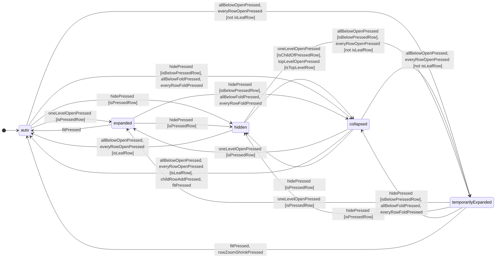

# CR-570 — すべて開く入口は次に縦を縮めるまで全階層を描く —— 行の木の状態を 1 つの欄 `treeState` の 5 つの値にまとめる

> 起草の状態: 書き直した（2026-09-26）。利用者の裁定 `JDG-595` 〜 `JDG-599`（逐語は 0.1 節）を受け、行ごとの 3 つの真偽（`AT-56` `isCollapsed`・`AT-57` `isHidden`・`AT-142` `isKeptOpen`）と画面全体の「表示量の一時開放」を、`TaskGroup` の 1 つの欄 `treeState` の 5 つの値にまとめる設計へ全面的に書き直した。旧の設計の文は本書に残さない —— 何が死んだかは 3 節の対応表だけが持つ。
> ⛔ 旧の設計の波 1（`0d49e737`）は捨てる。枝 `cr-570-apply` にだけあり、`refactor` へは一度も着地していない。調整役の決定（2026-09-26）で、起草のコミット `e3b6d50c`・`e5b72fd3`・`6f04f6b8` と本書の書き直しだけを `refactor` へ摘み取り、`0d49e737` はこの枝に置いていく ⇒ 当てる仕事は `refactor` の先端から始め、`git revert` は要らない（3.0 節）。
> 読んだ木: 「今の仕様」「今のコード」は、`0d49e737` の親（`e3b6d50c`。仕様とコードは `9d8ed382` と同じ）を `git archive` でスクラッチへ写した木で測った。ワークツリーの HEAD は `6f04f6b8`（波 1 を含む）であり、検査はそちらで回した（13 節）。⛔ 当てる前に `refactor` の先端で測り直すこと。
> ID の帯: 調整役から `CR-570`・`JDG-590` 〜 `JDG-599`・`DFC-983` 〜 `DFC-989` を受けた。表・図・行・列の新しい番号はどれも仮である（2 節）—— 調整役がコミットの前に詰める。
> ⭐ 11 節の問い 2 つは答えを受けた（2026-09-26）。問い 1 は案 B（`JDG-600`）—— 段 0 の畳みは文書の値（`documentSettings` の鍵 `levelZeroTreeState`、`S-418`）であり、行の値と同じ取り消しの段に入る。問い 2 は読み替えを作らない（`JDG-601`）—— 古い `GRS JSON` の 3 つの真偽を読み替える表・`RK-*`・6.1 節の文は入れず、`FR-018` の「`isKeptOpen` を持たない版」の段は代わりを置かずに消す。本書の本文はこの 2 つを計画として書く（旧の案 A と読み替えの文は残さない）。
> 当てた木: 波 1 は `refactor` の `70be9db6` に当てた（2026-09-26）。仮の番号は 2 節のとおり同じ日にその木で測り直した。
> 当てる順: 段 8 の性能の測定（RISK-001）の前、`CR-569` の後。すべて開く入口が描く行の数が変わる（`sample-large-erp-program.ja.xml` の全体表示で 1 行 → すべての行）ので、測ってから当てると測り直しになる。⛔ `src/framework/single-html-shell/frame-loop.ts` を触るほかの CR と同じ波に入れない。
>
> 閉じるもの: `DFC-983`（すべて開く入口が、倍率で描かれていない行を開かない）と、12 節の仮の 2 行（`DFC-984`・`DFC-985`）。利用者の裁定 `JDG-590` 〜 `JDG-601`。

---

## 0. ⛔ 立ちどまって答える 3 つ

### 0.1 利用者の逐語と、それが決めること

| 裁定 | 逐語（`docs/development-records/rulings.md` から写した） | 決めること | 本書での扱い |
|---|---|---|---|
| `JDG-590` | 「[vv]で押下した場合でもいったんは全階層を開く。 [v]で開いたタスクはそのあと縮小しても表示継続だろ？ [vv] は縮小したら折りたたむ。」 | [vv] は押した範囲のすべての段を、いまの倍率のまま描く。[v] で開いた行は縮めても開いたまま。[vv] で開いた分は縮めると倍率の絵へ戻る | 生きている（`temporarilyExpanded` と `expanded`）。⚠️ 同じ行の着地先の読み「画面だけの状態であり、文書に保存せず、取り消しの段も作らない」は `JDG-598` が覆した |
| `JDG-591` | 「細部 1〜3 も推奨どおり。 ただし、Fixすると[v]も[vv]も、縮小時も開くモードを解除するのは既存の仕様通りね。」（「Fix」は全体表示） | 縦を縮めた最初の刻みで終わる。横のズーム・拡大・スクロールでは終わらない。[vv] のあいだに [v] を押せば、縮めても残る。全体表示は [v] の分も [vv] の分も捨てる。頭の [vv] は倍率で隠れた行があれば押せる | 生きている（表 A の A1・A22・A23、14.6 節の構え） |
| `JDG-592` | 「問い1 : 推奨通り ii」 | [vv] は [v] で開いた行に触れない | 生きている —— 「[vv] は `expanded` の行を変えない」として持ち越す（`JDG-596` の調整役の読み）。表 A の A4・A5・A14 |
| `JDG-593` | 「問い2 : 推奨どおり終える」 | 縦の倍率が縮める側の端（`ZE-2`）でも、縮める入力は [vv] の分を終える | 生きている（A23）。⚠️ 同じ行の着地先の読み「文書に何も書かない（`ZE-4`）」は `JDG-598` が覆した —— 端でも `temporarilyExpanded` を `auto` へ戻す書き込みが起きる |
| `JDG-594` | 「vで開いて^や^^で閉じた時も消えるし、そのあとvvで開いても消えっぱなしだろ？ 網羅的に仕様書を書け。 状態遷移表、状態図がいいか？」 | [^]・[^^] は [v] の開きも消す。そのあと [vv] で開いても [v] の開きは戻らない。入口ごと・状態ごとに網羅した状態遷移表と状態図で書く | 生きている（14 節の表 A・表 B・図） |
| `JDG-595` | 「② Fit で戻す とせよ。」 | 全体表示は段 0 の畳み（当時の `S-211`。`JDG-600` の後は `S-418`）も戻す | 生きている（表 B の B5） |
| `JDG-596` | 「[vv]を押して保存すると、次同じファイルを開けたときの結果が変わるんだよね？ FocedUnFoled/FocedFoled/TemporaryUnFoled/Autoとかにするのはどう？」「5つの値にまとめてよい。」 | 行ごとの 3 つの真偽と画面全体の一時開放を廃し、1 行 1 つの欄の 5 つの値にまとめる。全体表示は隠した行を除くすべてを自動へ戻す | 本書の骨格（3 節・14 節） |
| `JDG-597` | 「collapsedの逆はexpand だろ？ 値の名前は再考しろ。」「treeStateでよい。」 | 欄は `treeState`。値は `auto`・`collapsed`・`expanded`・`temporarilyExpanded`・`hidden` | 名はこのまま使う（2 節・14.1 節） |
| `JDG-598` | 「temporarilyExpanded　を未保存とせず、保存とすればよいのでは？ つまり5つの状態のどれでも保存。 そっちの方がシンプルかと。」「当然 Ctrl + z の対象。」 | 5 つの値はどれも `GRS JSON` に保存する。値が変われば、何が起こしたか（入口・全体表示・縮める入力）によらず未保存の編集（`FR-100`）であり、取り消しの 1 段である。縮めても `temporarilyExpanded` の行が 1 つも無いときは段を積まない | 表 A の全行、4.8 節（`FR-031`・`UN-14`・`UN-17`・`ZE-4`） |
| `JDG-599` | 「問1/問2について葉、推奨通り」 | 行の木の状態機械は `docs/spec/_source/state-machines.json` の原稿に置き、表と状態図を生成する。表 T-051 の `HF-2`・`HF-3`・`HF-10`・`HF-11`・`HF-13` と表 T-254 の本文は、規則を 1 行ずつ書き並べず、生成した表を指す | 4.12 節（領域 `rowTree`）、4.4 節（`HF-*` の文）、決定 13（表 T-254 を退かせる） |
| `JDG-600` | 「B: 保存する (Recommended)」 | 11 節の問い 1 は案 B —— 段 0 の畳みは文書の値にする。`documentSettings` に鍵を 1 つ（`levelZeroTreeState`、値 `auto` ／ `collapsed`）、`S-211` と `levelZeroFoldStateMachine` を退かせ、行の値と同じ取り消しの段に入る。置き換えでは開いた文書の値になる | 3.2 節、4.13 節、表 B（14.4 節）、決定 12・22・23 |
| `JDG-601` | 「まってー。 読み替えの仕様は検討無用。 まだGRSは運用を開始してない。」 | 11 節の問い 2 —— 古い `GRS JSON`（3 つの真偽を持つ文書）の読み替えを作らない。`FR-018` の「`isKeptOpen` を持たない版」の段とコードの `FIRST_SCHEMA_VERSION_WITH_KEPT_OPEN_MARK` は代わりを置かずに消す。見本・起動テンプレート・案内の骨組みは新しい形へ書き直す | 3.4 節、決定 18 |

⚠️ 覆った読みは 2 つである: `JDG-590` の「保存しない・取り消しの段を作らない」と、`JDG-593` の「文書に何も書かない」。どちらも `JDG-598` が上書きした。⇒ 旧の設計の置き場（表 T-206 の `S-351`、表 T-280 の `lodSuspensionStateMachine`）は要らなくなった。

### 0.2 調べた結果（`DFC-983` の詳細。`3457e412` の写しで測った旧版の記録の要約）

- 深い行を隠しているのは人の畳みではなく、グループ LOD（`FR-018`、表 T-005a の `L-3`）である —— `src/entity/layout-engine/schedule-layout/schedule-layout.ts` が `groupDepthLimit`（`group-level-of-detail.ts`）より深い行を落とす。
- 頭の [vv] の翻訳（`row-tree-entrances.ts` の `commandFromRowExpanderOpenAll`）は、畳み・隠し・印・段 0 の畳みのどれも無いと `RS-31` を返し、倍率は動かさないので、倍率で落ちた行は押しても出ない。
- 実測（1920 × 1080、`sample-large-erp-program.ja.xml`、`CR-569` の前）: 開いた直後の全体表示の絵は 1 行。頭の [vv] は `RS-31` を返して 1 行のまま。根の行の [vv] は 13 行（文書の行は 38）。
- ⭐ 本書の変更の後は、頭の [vv] は倍率を動かさずに 38 行すべてを描き、縦を 1 刻み縮めると全体表示の段の絵へ戻る（9 節の実物確認）。

### ① この変更は `CH-` / `GL-` のどれを前へ進めるか

`GL-002`（`CH-2`、縮めても全体を 1 枚で俯瞰させる）—— 全体表示で俯瞰したあと、[vv] の 1 手でいまの倍率のまま中身をすべて見られ、縮めれば俯瞰の絵へ戻る。
`GL-006`（初見で使える）—— 「すべて開く」を押して何も起きない入口が無くなる。⭐ 状態が 1 行 1 つの値になるので、「畳んでいるのに開いたままの印がある」「隠しているのに畳んでいない」という、画面から読めない組み合わせが作れなくなる。

### ② レビュー観点のどの条項を当て、何が出たか

- `R1.3`（矛盾が無い、唯一の正）—— 値を書き換える規則は、生成する状態遷移表（表 T-328）の 1 か所に置き、`HF-*` と `FR-018` はそれを指すだけにする。描くかの規則は 表 T-329 の 1 か所。表 T-254 は表 T-328 と同じことを言う 2 つ目の表になるので退かせる（決定 13）。
- `R1.1`（抜けが無い）—— 旧の 8 つの組み合わせのうち、入口が作らない 3 つ（畳み＋印、隠し＋印、隠し＋畳まない）が文書に現れたときの意味が、どこにも無かった。1 つの値にまとめると組み合わせそのものが消える。古い文書は読み替えない（`JDG-601`、3.4 節）。
- `R1.2`（検証できる）—— 表 A の升は「いまの値 × 出来事 × 押した行との関係 → 先の値」で言い切り、状態機械の契約試験（表 T-250 の `SD-3` の形）で確かめられる。
- `R2`（命名）—— 欄と値の名は `JDG-597` のまま。状態機械は `treeStateMachine`（何を追うかの名詞句 ＋ `StateMachine`、コードの現在値の名は `treeState` —— 欄の名と一致する）。ガードは `is` で始める（`isPressedRow` ほか）。
- `R4`（状態機械）—— 状態 5 つ、出来事 10。どの升も「→ 先 [ガード]」で言い切り、表に無い組は変化なし。

### ③ 利用者に問わずに決めたこと

| # | 決めたこと | 導き | 代償 |
|---|---|---|---|
| 決定 1 | 欄 `treeState` は新しい列 `AT-153`（仮）とし、`AT-56`・`AT-57`・`AT-142` は退かせる。番号を使い回さない | 1 つの番号は 1 つの意味（規則「One prefix, one meaning」）。`AT-56` は真偽の畳みを指してきた | 仕様の中の `AT-56`・`AT-57` を名指す 6 か所を書き換える（3.1 節） |
| 決定 2 | `expanded` と `temporarilyExpanded` が描かせる行は同じ —— その行と、その祖先のすべてと、その直下の子を倍率によらず描く（表 T-329 の `TD-6`・`TD-7`）。違いは終わり方だけ | 今の開いたままの印（`FR-018`）の描き方をそのまま継ぐ。[vv] が全段を描くのは、配下の葉でない行がすべて `temporarilyExpanded` になり、直下の子を描く鎖がつながるからである（決定 3） | 葉の行が `expanded` を持つと、その葉と祖先が倍率によらず残る（入口は葉を `expanded` にしないので、古い文書か `Agent API` の書き込みだけで起きる） |
| 決定 3 | [vv] は、押した行と、その配下の葉でない行を `temporarilyExpanded` にし、配下の葉の行の `collapsed`・`hidden` を `auto` にする。`expanded` の行は変えない（押した行も） | `JDG-592` の持ち越し。葉は直下の子を持たないので、`temporarilyExpanded` にしても描く行が変わらず、保存するファイルと縮めたときの取り消しの段に意味の無い値が増えるだけ | 押した行が `expanded` なら、縮めた後もその直下の子は残る（[v] で開いた人の意思が残る） |
| 決定 4 | 頭の [vv] は、決定 3 を段 0 に対して行う —— すべての行に同じ書き換えをし、段 0 を開く | 表 T-051 の「`HF-10` は `HF-2` を段 0 に対して行う」 | — |
| 決定 5 | [v] は押した行を `expanded` にする。`temporarilyExpanded` の行でも同じ。開ける直下の子は、描かれていない子と、`temporarilyExpanded` があるから描かれているだけの子である | `JDG-591`（[vv] のあいだに [v] を押せば、縮めても残る）。数えないと、[vv] の後はすべての子が描かれているので [v] が薄くなり `RS-30` を返す | 倍率で既に描かれている子しか持たない `auto` の行の [v] は、今のまま薄い |
| 決定 6 | [v] は、隠した直下の子を `collapsed` で戻す（頭の [v] は最上位の行を同じく） | 表 T-015 の `HR-6`「戻るのはこの行だけになる」。`hidden` は畳んだ状態を含むので、戻すと畳んだ行になる | 今の仕様では、全体表示の後に隠した行が「隠れて畳まない」（`h·o`）になり、戻すと配下が一度に開いた（`DFC-985`、仮）。本書で消える |
| 決定 7 | [^] と [^^] は、押した行の配下の `auto`・`expanded`・`temporarilyExpanded` を `collapsed` にし、`hidden` は `hidden` のまま残す。祖先の値は変えない | 表 T-015 の `HR-1a`（畳んだ行の配下は畳まれた状態）と、今の表 T-254 の `KO-4`・`KO-5`（押した行と配下の印を外す、祖先の印は残す）。`JDG-594` がこれを確かめた | — |
| 決定 8 | 全体表示は、`hidden` 以外のすべての値を `auto` に戻す（隠した行の配下の `collapsed` も）。`hidden` は変えない。段 0 を開く | `JDG-596`「隠した行を除くすべてを自動へ」、`JDG-595` | 隠した行の配下が `auto` になるので、`HR-1a` の「畳んだ行の配下は畳まれた状態」が、隠した行の下でだけ字どおりには成り立たない。`auto` は「人が何も決めていない」値であり、戻す前の形を覚えたものではないので、`HR-1a` が防ぐ害（戻した瞬間に全階層が一度に開く）は、戻った行を [v] で開いたときに倍率の絵になるだけで起きない |
| 決定 9 | `temporarilyExpanded` を終えるのは、縦（行の軸）を縮める入力（`MK-2` と `MK-4` の縮める向き、`IC-14`、`SK-16c`）だけ。縮める側の端（`ZE-2`）でも終える。拡げる入力・日付の軸のズーム・スクロール・表示の倍率・窓の大きさの変化・`Agent API` の `setZoom`（`CM-65`）では終えない | `JDG-591`・`JDG-593`。比べるのは入力の向きであり、倍率の数ではない —— 数で比べると、全体表示の絵（`OP-10`、保存された `zoomY` と描いている倍率が違う）で最初の入力が読み違える | `Agent API` が倍率を下げても `temporarilyExpanded` は残る（`Agent API` は `CM-85` で値を直に書ける） |
| 決定 10 | 縮める入力は 2 つの書き込みに割る: ① 倍率（`CM-65`、`UN-8` で段を積まない）② `temporarilyExpanded` の行をすべて `auto` へ（1 段）。端（`ZE-2`）では ① を書かない | `FR-031` が全体表示で既に採った形（倍率を先に、畳みを後に）。1 つに書くと段が古い倍率ごと持ち、取り消しが `UN-8` を破る | — |
| 決定 11 | 文書を開くと、行はファイルが持つ値のまま描く（`temporarilyExpanded` も）。開いた直後の全体表示（`OP-10`）は値を変えない | `JDG-598`（保存する）と、`HF-8`「起動のときは働かせない」 | [vv] のまま保存したファイルは、次に開いたとき全段が描かれ、最初に縦を縮めたときに倍率の絵へ戻る（`JDG-596` の問いのとおり、結果が変わる） |
| 決定 12 | 取り消し・やり直しは、段が覚えた文書へ戻すので、行の値も段 0 の畳み（`S-418`）もそのときの値へ戻る | 表 T-027 の `UN-14`、`JDG-600`（段 0 の畳みは文書の値で、行の値と同じ段に入る） | — |
| 決定 13 | 表 T-254 と `KO-1` 〜 `KO-7` を退かせ、`FR-018` の本文は表 T-328 を指す。接頭辞 `KO` も退く | `JDG-599`（表 T-254 の本文は生成した表を指す）。表 T-254 の升（入口 × 印を立てる・外す）は表 T-328 の升と同じことを言う 2 つ目の表になり、2 つは必ず離れていく | 退いた番号の名簿（`retired.py`）に 7 行と表 1 つ |
| 決定 14 | 表 T-015 の `HR-*` は操作の定義としてそのまま残し、退いた列と印を名指す文だけを書き換える | `JDG-599` が名指したのは表 T-051 の 5 行と表 T-254 だけ。`HR-*` は「何をする操作か」を言い、表 T-328 は「どの値へ移るか」を言う | `HR-3` の「畳みと隠しを取り除く」と表 T-328 の升は同じ向きのことを 2 か所で言う。食い違えば表 T-328 が正（4.7 節の注） |
| 決定 15 | 構え: 行の [vv] は押した行の配下に、頭の [vv] は文書のどこかに、描かれていない行（表 T-329 で描かない行。絵に置かれた行で数え、スクロールで画面の外にあるだけの行は数えない）が 1 つでもあるときだけ濃い。[^^] は描かれている子を持つときだけ、[v] は決定 5 の子を持つときだけ濃い | [vv] は `expanded` を変えないので、値を変えても描く行が変わらない押下は「何も変わらない」（`FR-029`） | — |
| 決定 16 | 書き込みの命令: `setTaskGroupTreeState`（`CM-85`、仮）が `CM-33`（`setTaskGroupCollapsed`）・`CM-34`（`setTaskGroupHidden`）・`CM-75`（`setTaskGroupKeptOpen`）の 3 つに代わる。`CM-72` は番号を保ち、名を `resetTaskGroupTreeStates` に替える | 列が 1 つになるので命令も 1 つ。`CM-72` の役（全体表示が人の決めた木の状態を捨てる）は変わらない | 表 T-108 の行が 2 つ減る |
| 決定 17 | 原稿: 新しい領域 `rowTree`（名「行の木」）に状態機械 `treeStateMachine` を 1 つ置く。生成するのは出来事の定義・状態遷移表・状態遷移図・状態の一覧（表 T-328、図 F-043）と、遷移表の定数（`src/use-case/edit-document/task-group-folding.ts` の生成の区画）。状態の型は生成しない —— `erd.json` の列挙が持ち、生成器が 2 つの値の並びの一致を確かめる | `JDG-599`。型を 2 か所で生成すると、同じ 5 つの語が 2 つの型になる | 表 T-250 に行が 1 つ増え（`SD-5`、仮）、原稿の `$comment` と生成した文書の前文が「保存しない値だけ」でなくなる |
| 決定 18 | 古い `GRS JSON`（3 つの真偽を持ち `treeState` を持たない）の読み替えは作らない。`AT-153` の意味・表 T-297・6.1 節に読み替えの文を足さず、`FR-018` の「`isKeptOpen` を持たない版」の段は代わりを置かずに消す | `JDG-601`（GRS はまだ運用を始めていない） | 3 つの真偽を持つファイルは新しい造りのスキーマに合わない。見本・起動テンプレート・案内の骨組みは新しい形へ書き直す（9 節） |
| 決定 19 | 表 T-233 の `RS-31` の場面と語を替える（「畳まれた行が 1 つも無い」→「描かれていない行が 1 つも無い」） | 頭の [vv] が倍率で落ちた行でも押せるようになった（`JDG-591`） | 試験の注 2 つが古い場面を引く（検査 42） |
| 決定 20 | 新しく作る行（`HF-14`・`HF-17`・`MSPDI` の取り込み）は `auto` で生まれる。合流で足す行はファイルの値のまま | 今の「行を作るときは印を偽」と同じ | — |
| 決定 21 | `HF-14`（配下に足す）は、押した行が `collapsed` なら `auto` にする。倍率が足した行を落とすなら、今のまま倍率を上げる | 今の `HF-14`（その親を開く・詳しさの段を開く）。`expanded` にすると、人が 1 階層開いたことになってしまう | — |
| 決定 22 | 段 0 の畳みは全体表示でも開く（`JDG-595`）。文書の置き換え・新しい文書では、開いた文書が持つ値になる | `JDG-600`（段 0 の畳みは文書の値）。今は置き換えで畳んだ段 0 が次の文書に持ち越され、開いた文書の行が 1 つも描かれない（`DFC-984`、仮）—— 文書の値になれば持ち越しようがない | 畳んだまま保存したファイルは、開いた直後に行が 1 つも描かれない（頭に畳み込んだ数が出る。`HF-12`） |
| 決定 23 | 段 0 の畳みは `documentSettings` の鍵 `levelZeroTreeState`（表 T-203 の `S-418`、表 T-104 の `K-138`、値 `'auto'` ／ `'collapsed'`、既定 `'auto'`）が持つ。書き換えは領域 `rowTree` の根の升の副作用（`writeLevelZeroCollapsed`・`writeLevelZeroAuto`）であり、命令は `setLevelZeroTreeState`（`CM-86`）。行の値と同じ束・同じ段に入る | `JDG-600`、3.2 節。置き場を表 T-203 にしたのは、同表の `S-126`（ピン止め）が既に `UN-14` で取り消せる見せ方の群の鍵だから | 表 T-203 の鍵のうち取り消せるものが 2 つになる（`S-126`・`S-418`） |
| 決定 24 | 頭の [+]（`IC-93`・`HF-17`）は出来事 `childRowAddPressed` に入れる（押した行は段 0 で、どの行でもない）。段 0 を開く根の升は `isLevelZeroCollapsed` のときだけ書く | 表 A の A20「同、頭の [+] … も」、表 B の B4 | — |

---

## 1. 範囲 —— 要求ごとの行き先

| 要求 | 仕様で変える所 | 4 節 |
|---|---|---|
| R1 行の木の状態を 1 つの欄の 5 つの値にする | `erd.json` の `TaskGroup`（`AT-153` を足し、`AT-56`・`AT-57`・`AT-142` を外す）、`_assets/tbl-glossary.md` の `N-15` → `N-26` | 4.1、4.15 |
| R2 描くかの規則 | `FR-018` に表 T-329（`TD-1` 〜 `TD-7`）を足し、印の段と表 T-254 を置き換える。`FR-081`・`FR-016`・`FR-098` の「描かれていない行」を表 T-329 へ向ける | 4.2、4.3 |
| R3 値の遷移を原稿に置き、表と図を生成する | `_source/state-machines.json` に領域 `rowTree`、`state-machines.schema.json`、生成器 2 つ、`05-07-design.md` の 表 T-250（`SD-5`）と原稿の置き場の段 | 4.12 |
| R4 入口の文は表を指す | 表 T-051 の `HF-2`・`HF-3`・`HF-10`・`HF-11`・`HF-13`（`JDG-599`）と、`HF-7`・`HF-8`・`HF-12`・`HF-14`・`HF-16`・`HF-17` の値を名指す文、表の下の注 | 4.4 〜 4.6 |
| R5 操作の定義から退いた列を外す | 表 T-015 の `HR-1`・`HR-2`・`HR-7` | 4.7 |
| R6 値の変化は未保存の編集で取り消しの 1 段 | `FR-031`（全体表示と縮める入力の割り方）、表 T-027 の `UN-8`・`UN-14`・`UN-17`、表 T-262 の `ZE-4` | 4.8、4.9 |
| R7 全体表示 | `FR-055` の印の 2 文、`HF-8` | 4.5、4.10 |
| R8 古い文書 | 読み替えを作らない（`JDG-601`）。`FR-018` の「`isKeptOpen` を持たない版」の段を、代わりを置かずに消す | 4.3 |
| R9 段 0 | `S-211` と状態機械 `levelZeroFoldStateMachine`（出来事 `foldAllPressed`・`levelZeroOpened`）を退かせ、`documentSettings` の鍵 `levelZeroTreeState`（表 T-203 の `S-418`、表 T-104 の `K-138`）と命令 `setLevelZeroTreeState`（`CM-86`）を足す。段 0 の書き換えは領域 `rowTree` の根の升が持つ（`JDG-600`） | 4.13 |
| R10 頭の [vv] の理由 | 表 T-233 の `RS-31` の場面と語 | 4.14 |
| R11 命令 | 表 T-108 の `CM-33`・`CM-34`・`CM-75` を退かせ `CM-85`・`CM-86` を足し、`CM-72` の名を替える | 4.15 |
| R12 設計 | 表 T-068 の `LC-2`、表 T-075 の `UF-35`・`UF-79`・`UF-96`・`UF-139` | 4.16 |

⚠️ 本書の 4 節は「案の文」である —— 当てる体は `refactor` の先端で旧の塊を測り、`CR-551` の形（旧・新の塊と、旧がちょうど 1 度現れることの数え）へ起こしてから当てる（`CR-561` と同じ扱い）。旧の塊を本書に写さないのは、`CR-569` の後に同じ段落が動いているかもしれないからである。

---

## 2. 新しい識別子（どれも仮 —— 調整役がコミットの前に詰める。2026-09-26 に `70be9db6` で測り直した）

| 種類 | 仮の番号・名 | 何か | 測った |
|---|---|---|---|
| 列 | `AT-153` `TaskGroup.treeState` | 行の木の状態（列挙 5 値、`null` 不可、既定 `auto`） | 2026-09-26: 当てる前の `docs/spec` は `AT-144`、ほかの CR は `AT-152`（`CR-559`）、`AT-153` を名指すのは本書・`handoff.md`・`rulings.md` だけ ⇒ その次 |
| 表 | `T-328` | 行の木の状態機械（生成。`_assets/tbl-state-machines.md`） | 2026-09-26: 当てる前の `docs/spec` は `T-297`、ほかの CR は `T-327`（`CR-547`）まで ⇒ その次 |
| 図 | `F-043` | 行の木の状態遷移（生成） | 2026-09-26: 木と CR は `F-042` まで ⇒ その次 |
| 表 | `T-329` | 行を描くか（`FR-018`） | `T-328` の次 |
| 行 | `TD-1` 〜 `TD-7` | 表 T-329 の行。⚠️ 新しい接頭辞 `TD`（Tree Drawn）を `row-id-prefixes.json` に登録する | 登録簿に `TD` は無い（`PTD` とは別の綴り） |
| 行 | `SD-5` | 表 T-250 の行（文書のデータの状態のうち、原稿に置くもの） | 2026-09-26: 木は `SD-4` まで ⇒ その次 |
| 行 | `S-418` | 表 T-203 の行 `levelZeroTreeState`（段 0 の木の状態、`JDG-600`） | 2026-09-26: 当てる前の `docs/spec` は `S-416`、`S-417` は `CR-564` が名指して返した番号 ⇒ その次 |
| 行 | `K-138` | 表 T-104 の行 `levelZeroTreeState` | 2026-09-26: 木と CR は `K-137` まで ⇒ その次 |
| 行 | `N-26` | 用語 `treeState`（`N-15` `isKeptOpen` に代わる） | 2026-09-26: 用語集は `N-15`。`CR-561` の編集の番号が `N-25` までを名乗るので、字の重なりを避けてその次 |
| 行 | `CM-85` | 命令 `setTaskGroupTreeState` | 2026-09-26: 当てる前の `docs/spec` は `CM-75`、ほかの CR は `CM-84`（`CR-559`）まで ⇒ その次 |
| 行 | `CM-86` | 命令 `setLevelZeroTreeState`（`JDG-600`） | `CM-85` の次 |
| 原稿の名 | 領域 `rowTree`、状態機械 `treeStateMachine`、出来事 10（4.12 節）、ガード `isPressedRow`・`isChildOfPressedRow`・`isBelowPressedRow`・`isLeafRow`・`isTopLevelRow`・`isLevelZeroCollapsed`、根の升の副作用 `writeLevelZeroCollapsed`・`writeLevelZeroAuto` | 表 T-328 の中身 | 原稿の出来事のキーと重ならない（生成器は領域をまたいだ重なりを拒む） |
| 台帳 | `DFC-984`・`DFC-985`（12 節） | 本書が閉じる、今の仕様の穴 2 つ | 帯の中 |

⚠️ 退く番号（`retired.py` に載せる）: `AT-56`・`AT-57`・`AT-142`・`T-254`・`KO-1` 〜 `KO-7`・`N-15`・`CM-33`・`CM-34`・`CM-75`・`S-211`。接頭辞 `KO` は登録簿から外す。`RK-3` 〜 `RK-5` は作らない（`JDG-601`）。

---

## 3. ⛔ 消すものを先に列挙する（旧 → 新）

### 3.0 旧の設計の波 1（`0d49e737`）の扱い —— 決定: 捨てる（摘み取らない）

| 旧 | 新 | 理由 |
|---|---|---|
| `0d49e737`「Apply CR-570 wave 1」—— 仕様 10 ファイル（`HF-2`・`HF-10`・`HF-13` ほかの文、表 T-254 の `KO-2`・`KO-3` を「触れない」、`FR-018` の一時開放の段、表 T-206 の `S-351`、表 T-280 の `lodSuspensionStateMachine` と出来事 4 つ、`RS-31` の語、`LC-2`・`UF-139`・`UF-96`）と、生成した `screen-values.ts`・`display-words.json` | 無し。`refactor` へ摘み取らない。本書の当てる仕事は `refactor` の先端（`0d49e737` を含まない）から始める | 調整役の決定（2026-09-26）。`0d49e737` は `refactor` に一度も着地していないので、`git revert` で打ち消す相手が `refactor` に無い。摘み取ってから打ち消すと、死んだ設計の文と、それを打ち消すコミットの 2 つが歴史に残るだけである |
| 本書の旧 4 節の E-01 〜 E-18・J-01 〜 J-04、旧 5 節の継ぎ目、旧 14 節の 8 状態の表 | 本書の 4 節・5 節・14 節 | 設計が変わった。旧の文は本書に残さない |
| セッションのスクラッチにある旧の設計のコードの差分 `wave2-wip.patch` | 無し（使わない） | 一時開放を画面の値として持つコード（`LodSuspensionScope`・`keptInViewByLodSuspension`・`suspendsLod`）であり、新しい設計に当たる行が無い |
| この枝 `cr-570-apply` の検査の赤 3 つ（検査 39 の 1305 → 1314、検査 42 の 353 → 355、検査 11 の新しい群 1）| `refactor` では起きない | どれも `0d49e737` が起こした赤である（`0d49e737` のコミット文がそう記す）。⚠️ 本書が当たれば、`RS-31` の場面が同じく変わるので、検査 42 の同じ 2 つの注は再び赤になる（9 節の試験の体が直す） |

⭐ 旧の設計の名（`S-351`・`lodSuspensionStateMachine`・`openEveryLevelPressed`・`rowZoomSettled`・`documentSwapped`・`isBelowSuspendedZoom`・`isAboveSuspendedZoom`・`isLowerRowZoomEnd`・「表示量の一時開放」）は `refactor` の仕様に一度も現れない ⇒ 退いた番号の名簿に載せない（名簿は「何かがまだ名指す番号」を持つ。本書と台帳の記録が名指すのは歴史として正しい）。

### 3.1 仕様の行・列・文（旧は `e3b6d50c` の木。行番号はその木の `01-04-requirements.md`）

| 旧 | 新 | 理由 |
|---|---|---|
| `erd.json` の `TaskGroup` の列 `isCollapsed`（`AT-56`、真偽・可）・`isHidden`（`AT-57`、真偽・可）・`isKeptOpen`（`AT-142`、真偽・否・既定 `false`） | 列 `treeState`（`AT-153`、列挙 5 値・否・既定 `auto`）1 つ。3 つの列は退く | `JDG-596`・`JDG-597`・決定 1 |
| `_assets/fig-erd-detail.md` の 3 行と ER 図の 3 行（生成） | 1 行ずつ（`npm run gen` が刷る） | 同上 |
| `_source/grs-document.schema.json` の 3 つの鍵（生成） | `treeState` の列挙 1 つ | 同上 |
| `FR-018` の `:4488`〜`:4496`（開いたままの印の段 —— 印の行と祖先と直下の子を外す、印は畳みに勝たない、単調性、表 T-254 に従う、行を作るときは偽、`isKeptOpen` を持たない版は偽） | 表 T-329 を指す段と、表 T-328 を指す段（4.3 節）。古い版の段は代わりを置かずに消す | 決定 2・13・18 |
| `FR-018` の 表 T-254（`KO-1` 〜 `KO-7`）とその下の注 6 行（`:4498`〜`:4516`） | 無し（表 T-328 が持つ）。表 T-254 と `KO-*` は退く | 決定 13 |
| `FR-004` の表 T-015 の `HR-1` の「⚠️ 全体表示（`FR-055`）はこれと別の操作であり、捨てるのは畳みだけである」 | 「全体表示は `hidden` を残して、ほかの値を `auto` へ戻す」 | 決定 8 |
| 同 `HR-2` の「⛔ `AT-56` も `AT-57` も動かさない（MUST NOT） —— 列を増やしても減らしても、保存する文書の形が変わる」 | 「⛔ 段 0 のために `TaskGroup` の列を足さない（MUST NOT） —— 段 0 の値は `documentSettings` の鍵（`S-418`）が持つ」。同行の「段 0 が畳まれているかは 表 T-206 の `S-211` が持つ」は 表 T-203 の `S-418` へ | 決定 1・23 |
| 同 `HR-7` の「⭐ あわせて、押した行に 表 T-254 の `KO-1` の印を立てること（MUST）…」「⚠️ 上の「畳みだけを解く」が禁じるのは…この印を禁じていない」 | 「⭐ 押した行が取る値は 表 T-328 に従う —— 押した行は `expanded` になり、直下の子が `FR-018` の倍率で落ちているときも描かれる」 | 決定 13・14 |
| 表 T-051 の `HF-2`・`HF-3`・`HF-10`・`HF-11`・`HF-13` の、書き換える値と構えの文 | 表 T-328・表 T-329 を指す文（4.4 節） | `JDG-599` |
| 同 `HF-7` の「⭐ 人が開いた状態（表 T-254 の印）も…」 | 「`expanded` と `temporarilyExpanded` も、表示量の増減より優先する（表 T-329）」 | 決定 13 |
| 同 `HF-8` の「人が畳んだ状態をすべて捨てる」「捨てるのは畳みだけであり、隠した状態は残す」「⭐ あわせて、表 T-254 の `KO-7` のとおり、開いたままの印をすべて外す…」 | 「`hidden` 以外の値を `auto` に戻し、段 0 を開く（表 T-328）」 | 決定 8・`JDG-595` |
| 表 T-051 の下の注「⚠️ ただし `HF-2` と `HF-10` は、開いたままの印（表 T-254）を外すことも、行うことに数える…」（`:1682`） | 「`HF-2` と `HF-10` は、倍率で描かれていない行を描かせることも行うことに数える。描かれていない行は絵に置かれていない行（表 T-329）」 | 決定 15 |
| 同「行が描かれるかどうかを決める状態は 2 つだけ …（`AT-57`）…（`AT-56`）」（`:1686`）と「⚠️ 同書の `AT-142` …は上の 2 つに数えない」（`:1690`） | 「描かない向きへ働く値は `hidden`（その行も描かない）と `collapsed`（配下を描かない）の 2 つだけ。`expanded`・`temporarilyExpanded` は描く向きにだけ働き、2 つに勝たない（表 T-329）」 | 決定 1・2 |
| 同 段 0 の段「⇒ `AT-56` に当たるものを … `S-211` が持ち、`AT-57` に当たるものを持たない」（`:1693`）、「⚠️ 段 0 は `AT-142` に当たるものも持たない」（`:1698`）、「⇒ `HF-16` は 表 T-254 の印を立てない」（`:1699`）、「⇒ `HF-10` は … 印を外す（同表の `KO-3`）」（`:1700`） | 「段 0 は `collapsed` に当たるもの（`S-418`）を持ち、`hidden` に当たるものを持たない」「段 0 は `expanded`・`temporarilyExpanded` に当たるものも持たない」「⇒ `HF-10` は `HF-2` を段 0 に対して行う —— すべての行が表 T-328 の同じ升に従う」 | 決定 4・13 |
| 同「⭐ 開いたままの印（表 T-254）も同じ対に入る」（`:1704`） | 「`expanded` と `temporarilyExpanded` も同じ対に入る —— `HF-7` の側で倍率より強くし、`HF-8` の側で捨てる」 | 決定 8 |
| `FR-031` の表 T-027 の `UN-14`「畳みと非表示の変更」と注「⚠️ 畳みと非表示が `UN-7` でないのは、どちらも `TaskGroup` の列だから」（`:2152`） | 「行の木の状態（`treeState`）の変更 —— 起こしたものが入口でも、全体表示でも、縦を縮める入力でも」「`treeState` が `TaskGroup` の列だから」 | `JDG-598` |
| 同 `UN-17`「全体表示が人の畳んだ状態を捨てること」「⚠️ 戻るのは畳みだけ」「⭐ 全体表示が外した開いたままの印（`KO-7`）も…」（`:2165`） | 「全体表示が `hidden` 以外の値を `auto` へ戻すこと。⚠️ 戻るのは値だけであり、倍率と表示位置は `UN-8` のまま」 | 決定 8・10 |
| `FR-031` の全体表示の段（`:2184`〜`:2191`）の「畳みだけ」「開いたままの印（`KO-7`）も…」「② 畳んだ行をすべて開き、開いたままの印をすべて外す（`CM-72`）」 | 「② `hidden` 以外の値を `auto` へ戻す（`CM-72` `resetTaskGroupTreeStates`）」と、縦を縮める入力の同じ割り方の段（4.8 節） | 決定 10 |
| `FR-016` の「開いたままの印（表 T-254）が倍率によらず描かせる行も…」（`:3238`） | 「`expanded` と `temporarilyExpanded` が倍率によらず描かせる行（表 T-329 の `TD-6`・`TD-7`）も…」 | 決定 13 |
| 表 T-262 の `ZE-4`「`ZE-2` と `ZE-3` で書き換えないときは、未保存の編集を立ててはならない」 | 注を足す: 「⚠️ `ZE-2` の入力が `temporarilyExpanded` を `auto` へ戻す書き込み（表 T-328）は本行の外 —— 値が変わるので、未保存の編集と取り消しの 1 段になる」 | `JDG-598`・`JDG-593` |
| `FR-055` の「⭐ 開いたままの印（表 T-254 の `KO-7`）も同じ理由で外す…」（`:4659`）と「⚠️ **開いたままの印（表 T-254）が描かせる行も、この下限の対象外である**」（`:4680`） | 「`expanded` と `temporarilyExpanded` も同じ理由で `auto` へ戻す」「`expanded` と `temporarilyExpanded` が描かせる行も、この下限の対象外である」 | 決定 8 |
| `FR-081` の「描かれていない行とは、人が畳んだ行・隠した行の配下（`HR-1a` / `HR-6`）と、行の軸の倍率（`FR-018`）で描かれていない行」（`:2250`） | 「描かれていない行とは、表 T-329 が描かない行」 | 決定 2 |
| 表 T-233 の `RS-31`「畳まれた行が 1 つも無い」と語（ja「畳まれている行が 1 つもありません」／ en "No row is folded"、次の手 ja「どれかの行を畳んでから、もう一度押してください」／ en "Fold a row first, then press again"） | 「描かれていない行が 1 つも無い」と語（4.14 節） | 決定 19 |
| `05-07-design.md` 6.1 節の表 T-297（`RK-1`・`RK-2`） | 変えない（読み替えを作らない） | `JDG-601` |
| 同 表 T-068 の直後の全体表示の測り方の手順 1 の「⭐ 開いたままの印も、この回では 表 T-254 の `KO-7` のとおり外したもの」 | 「`expanded` と `temporarilyExpanded` も、この回では 表 T-328 の `fitPressed` のとおり `auto` へ戻したもの」 | 決定 13（表 T-254 が退く） |
| 同 5.x 節「⚠️ 図 F-018 は文書のデータの状態なので、原稿に入れない。」と、表 T-250 | 「文書のデータの状態は、`SD-5` の行の木を除いて原稿に入れない」と `SD-5` | 決定 17 |
| 同 表 T-068 の `LC-2`「開いたままの印（表 T-254）」、表 T-075 の `UF-139`「開いたままの印が残す行を答え（表 T-254）」、`UF-79`「行の畳み・隠し・開いたままの印を…書き換える」、`UF-96`「表 T-015・表 T-051・表 T-254 に従って」、`UF-35` は変えない（読み替えを作らない） | 4.16 節の文 | 決定 13・17・18 |
| `_assets/tbl-glossary.md` の `N-15` `isKeptOpen` | `N-26` `treeState` | 決定 1 |

⭐ 消さないもの: `HR-1a`・`HR-3`・`HR-4`・`HR-6` の文（操作の定義。決定 14）、`HF-2` の「⛔ その効果を本表に書き写してはならない」、`HF-10` の「⚠️ 倍率も表示位置も動かさない」、`HF-18`（人が畳んだ分と隠した分を数える —— 値が `collapsed`・`hidden` の行の配下を数えるのと同じ）、表 T-005a、`S-87`・`S-88`・`groupDepthLimit` の式、`RS-28`・`RS-29`・`RS-30`・`RS-32`。

### 3.2 状態機械・設定値・原稿

| 旧（`e3b6d50c`） | 新 | 理由 |
|---|---|---|
| 状態機械は「保存しない画面とセッションの値」だけ（`state-machines.json` の `$comment`、生成した `tbl-state-machines.md` の前文、`05-07-design.md` 5.x 節） | 領域 `rowTree` を足す。`$comment`・前文・5.x 節に「行の木（`TaskGroup.treeState`）だけは保存する値でも置く（`SD-5`）」 | `JDG-599`・決定 17 |
| 状態機械 `levelZeroFoldStateMachine`（画面の値、表 T-280）と、それだけが使う出来事 `foldAllPressed`・`levelZeroOpened` | 退く。段 0 の畳みと開きは、領域 `rowTree` の根の升（`everyRowFoldPressed` → `writeLevelZeroCollapsed`、`everyRowOpenPressed`・`topLevelOpenPressed`・`fitPressed`・`childRowAddPressed` → `writeLevelZeroAuto`［`isLevelZeroCollapsed`］）の副作用の書き込みになり、行の値と同じ束に入る | `JDG-600`・決定 23・24。生成器は、どの表も使わない出来事を拒む ⇒ 2 つの出来事も外す |
| 表 T-206 の `S-211`（保存しない段 0 の畳み） | 退く。`documentSettings` の鍵 `levelZeroTreeState`（表 T-203 の `S-418`、値 `'auto'` ／ `'collapsed'`、既定 `'auto'`）と表 T-104 の `K-138` を足し、`S-211` の注のうち残る文（`HR-2` を成り立たせるのは本行、何階層開くかは `HF-17`）を `S-418` へ移す。戻す道は 表 T-328 の根の升が持つ | `JDG-600`・決定 22・23 |
| 表 T-280（画面の値）の出来事 32・状態機械 12 | 出来事 30・状態機械 11（`levelZeroFoldStateMachine` と 2 つの出来事が退く） | `JDG-600`（旧の設計が足した 4 つの出来事と 1 つの状態機械は `refactor` に無い） |
| `display-words.json` の `RS-31` の語 | 4.14 節の語 | 決定 19 |
| `row-id-prefixes.json` の `KO`（開いたままの印を立てる入口と外す入口） | 行を外す。`TD` を足す | 決定 13・表 T-329 |

⭐ **段 0 の畳みは文書の値である（`JDG-600`）**: 置き場は `documentSettings` の鍵 `levelZeroTreeState`（表 T-203 の `S-418`、表 T-104 の `K-138`）。書き込みの命令は `setLevelZeroTreeState`（`CM-86`）。書き換えは表 T-328 の根の升の副作用であり、同じ押下が書く行の値と同じ束・同じ取り消しの段に入る（`UN-14`）。置き換えと新しい文書では、開いた文書の値になる。鍵を持たない文書は既定の `'auto'` になる（`OP-6` の欠けた鍵の扱いのまま —— 3 つの真偽の読み替えではない）。

### 3.3 命令・用語・名簿

| 旧 | 新 | 理由 |
|---|---|---|
| 表 T-108 の `CM-33` `setTaskGroupCollapsed`（行を畳む・開く）、`CM-34` `setTaskGroupHidden`（行を隠す・戻す）、`CM-75` `setTaskGroupKeptOpen`（印を立てる・外す） | `CM-85` `setTaskGroupTreeState`（行の木の状態を置く。正は `FR-004` と表 T-328）。3 つは退く | 決定 16 |
| 無し | `CM-86` `setLevelZeroTreeState`（段 0 の木の状態を置く。見せ方の群。正は `FR-004` と表 T-328 の根の升） | 決定 23 |
| `CM-72` `expandAllTaskGroups`（畳んだ行をすべて開き、開いたままの印をすべて外す） | `CM-72` `resetTaskGroupTreeStates`（`hidden` 以外の行の木の状態を `auto` へ戻す） | 決定 8・16 |
| `.claude/skills/spec-graph-check/retired.py` | `AT-56`・`AT-57`・`AT-142`・`T-254`・`KO-1` 〜 `KO-7`・`N-15`・`CM-33`・`CM-34`・`CM-75` を理由（本書・`JDG-596`）とともに、`S-211` を理由（本書・`JDG-600`）とともに足す | 名簿は「まだ何かが名指す番号」を持つ —— 本書と台帳が名指す |
| `.claude/skills/spec-graph-check/check-language-dictionary.py` の `erd.json` の免除の数: `/entities[]/columns[]/type` 128、`/entities[]/columns[]/nullable` 141 | 126 と 139（どちらも −2。3 つの列が 1 つになる: 型は「真偽」3 つが「列挙（5 値）」1 つに、`null` の欄は「可」「可」「否」が「否」1 つに） | 数を下げるのは調整役が問わずに行える（`JDG-520`）。⛔ 体は基準線に触れない |

### 3.4 古い `GRS JSON` —— 読み替えない（`JDG-601`）

⛔ 3 つの真偽（`isCollapsed`・`isHidden`・`isKeptOpen`）を持つ文書を `treeState` へ読み替える仕組みは作らない —— GRS はまだ運用を始めていない（`JDG-601`）。

- 仕様に足さないもの: `AT-153` の意味の読み替えの文、表 T-297 の `RK-3` 〜 `RK-5`、`05-07-design.md` 6.1 節の「捨てる前に読み替える」。
- 仕様から消すもの: `FR-018` の「以前の版の `GRS JSON` が `isKeptOpen` を持たないときは、すべての行の印を偽として開く」の段 —— 代わりを置かない。
- コードから消すもの（波 2b）: `json-codec.ts` の `FIRST_SCHEMA_VERSION_WITH_KEPT_OPEN_MARK` と、その埋め —— 代わりを置かない。
- ⚠️ 帰結: 3 つの真偽を持つファイルは、新しい造りのスキーマに合わない（`treeState` が無く、知らない鍵がある）。
- 仕様の外の文書: `sample-schedule/No Name.json`・`sample-schedule/Three-Year Product Plan.json`、起動テンプレート（`tools/generate_startup_template.py` が刷る `startup-template.json`。波 1 で書き直す）、`docs/guides/schedule-to-grs-json/` の骨組みと依頼文 —— 新しい形へ書き直す（9 節）。
- 14.8 節の写像は、今の仕様と比べるためだけのものであり、読み替えには使わない。試験の機械的な書き換え（波 2c）は、その写像で古い鍵を新しい値へ置き換えてよい。

### 3.5 試験（`e3b6d50c` の木で数えた）

| 旧 | 新 | 持ち場 |
|---|---|---|
| 3 つの真偽の名を持つ `tests/` のファイル 117 | 下の判断の要るファイル（約 20）を除き、機械的に `treeState` へ替える（写像は 14.8 節の表） | 波 2c（機械の体） |
| 判断の要るファイル: `tests/unit/cr-404-a-row-opened-by-hand-stays-open.test.ts`・`cr-438-pointer-panels-row-entrances-row-grab-and-frame-drags.test.ts`・`cr-439-row-title-panel-controls-and-pins.test.ts`・`cr-541-row-title-panel-open-all-and-reset.test.ts`（と `cr-541-stage.ts`）・`t-015-t-051-the-four-folding-controls.test.ts`・`fr-029-the-reason-a-press-carries.test.ts`・`fr-055-fit-discards-the-collapse.test.ts`・`uf-30-31.test.ts`・`uf-63.test.ts`・`uf-72-screen-part.test.ts`・`t-051-hf-14-a-raised-row-is-visible.test.ts`・`t-051-hf-14-the-depth-cap-refuses-a-row.test.ts`・`t-051-hf-17-unfolds-segment-zero-by-one-level.test.ts`・`cr-423-the-row-zoom-stops-where-the-picture-stops-changing.test.ts`・`edit-task-group.test.ts`・`cr-432-edit-task-group-branches-the-spec-decides.test.ts`、`tests/contract/t-233-reason-words-tell-the-row.contract.test.ts`（`RS-31` の指紋）、`tests/system/measured-sweep.test.ts`・`three-rows-read-from-the-spec-alone.test.ts`・`pinned-band-and-the-empty-document.test.ts`・`user-reported-fixes.test.ts`・`cr-553-a-shown-control-group-stays-its-row.test.ts` | 表 A の升と、新しい `HF-*` の逐語に合わせて読み直す（例: `cr-404` の「claim 8 KO-2 / KO-3」「claim 14 … RS-28」は表 A の A4・A5・A14 に、`t-015` の `:1364`・`:1366` が引く `HF-2` の「⚠️ そのため、構えの条件は `HF-18` の数と同じではない」の文は 4.4 節の新しい文に） | 波 2d（仕様だけを読む試験の体） |
| 無し | `tests/unit/cr-570-tree-state-*.test.ts`（9 節の主張）と、原稿と遷移の関数を結ぶ契約試験 `tests/contract/tree-state-machine.contract.test.ts` | 波 2d |

### 3.6 コード（`e3b6d50c` の木。旧 → 新の置き場は 5 節）

3 つの真偽の名を持つ `src/` と `tools/` のファイル 18: `adapter/document-codec/`（`grs-json-schema.ts`・`json-codec.ts`・`mspdi-imported-rows.ts`）、`adapter/input-command-translator/`（`row-grab.ts`・`row-tree-entrances.ts`・`zoom-and-fit.ts`）、`adapter/screen-renderer/row-title-panel.ts`、`entity/document-model/schedule/schedule-entities.ts`（生成）、`entity/layout-engine/schedule-layout/`（`drawn-rows.ts`・`group-level-of-detail.ts`）、`framework/single-html-shell/`（`frame-loop.ts`・`startup-template.json`（生成））、`use-case/apply-document-change/document-change-plan.ts`、`use-case/edit-document/`（`edit-task-group.ts`・`task-create.ts`・`task-group-folding.ts`・`task-group-naming.ts`）、`tools/generate_startup_template.py`。ほかに `dist/index.html`（刷り直す）。

---

## 4. 書き直す所（案の文 —— 当てる体が旧・新の塊へ起こす）

⚠️ 文の中に日付・利用者の名・裁定の番号を書かない（検査 `check-spec-holds-no-history.py`）。逐語は `rulings.md` だけが持つ。
⚠️ 原稿（`erd.json`・`settings.json`・`state-machines.json`・`display-words.json`・`row-id-prefixes.json`）を直した後に `npm run gen` を走らせる。生成物を手で直さない（検査 16・27）。
⚠️ 旧版の検査 11 の学び: 新しい文で `表 T-051 の \`HF-` を書き足しすぎると、共通の断片の上限を超えて基準の群が割れる。同じ言い回しの繰り返しを避ける。

### 4.1 `erd.json` の `TaskGroup` —— `isCollapsed` の位置に 1 列、`isHidden`・`isKeptOpen` を外す

```json
{
 "seat": 153,
 "name": "treeState",
 "type": "列挙（5 値）",
 "nullable": "否",
 "json": {
  "kind": "enum",
  "values": ["auto", "collapsed", "expanded", "temporarilyExpanded", "hidden"],
  "null": false,
  "default": "auto"
 },
 "key": "",
 "origin": "GRS",
 "exchange": "",
 "meaning": {
  "ja": "行の木の状態。`auto` ／ `collapsed` ／ `expanded` ／ `temporarilyExpanded` ／ `hidden`。値が描かせる行は `FR-018` の 表 T-329、値を書き換える入口と先の値は `_assets/tbl-state-machines.md` の 表 T-328 が持つ。行を作るときは `auto`"
 }
}
```

⚠️ `"default"` は列挙の列に書ける（`erd.schema.json` の `default`: 「列挙の既定は `values` の 1 つ」）。読み替えの文は置かない（`JDG-601`）。

### 4.2 `FR-018` に足す表 T-329

```text
**表 T-329 — 行を描くか**

| 行 ID | 種類 | 条件 |
| --- | --- | --- |
| TD-1 | すべて要る | 段 0 が畳まれていない（`_assets/tbl-settings.md` の 表 T-203 の `S-418` が `'collapsed'` でない） |
| TD-2 | すべて要る | その行の `treeState` が `hidden` でない |
| TD-3 | すべて要る | その行の祖先のどれも、`treeState` が `collapsed` でも `hidden` でもない |
| TD-4 | どれか 1 つ | その行の深さが、描く縦の倍率で本要求が描く深さ以内である（表 T-005a の `L-3`） |
| TD-5 | どれか 1 つ | その行がピン止めの行である（`FR-098`） |
| TD-6 | どれか 1 つ | その行の親の `treeState` が `expanded` か `temporarilyExpanded` である |
| TD-7 | どれか 1 つ | その行自身か、その行の子孫のうち `TD-2` と `TD-3` を満たす行の `treeState` が `expanded` か `temporarilyExpanded` である |

⭐ 行を描くのは、種類が「すべて要る」の行がすべて成り立ち、「どれか 1 つ」の行が 1 つでも成り立つときだけとすること（MUST）。  
⚠️ `expanded` と `temporarilyExpanded` が描かせる行は同じである —— その行と、その祖先のすべてと、その直下の子。2 つの違いは終わり方だけである（表 T-328）。  
⛔ `TD-5` 〜 `TD-7` は `TD-1` 〜 `TD-3` に勝たない —— 人が畳んだ行と隠した行の配下は描かない（表 T-051 の `HF-7`）。  
⭐ 落とす向きの単調性は保たれる —— `TD-5` 〜 `TD-7` が描かせる行の集まりは倍率によらず、縦を縮める入力は `temporarilyExpanded` を `auto` に戻すだけなので、縮めた後に描く行は縮める前より増えない。
```

### 4.3 `FR-018` の印の段と表 T-254 を置き換える段

```text
⭐ 行の木の状態（`_assets/fig-erd-detail.md` の `AT-153`、`TaskGroup.treeState`）によって、本要求の対象から外す行を 表 T-329 に従って決めること（MUST）。  
⭐ 値を書き換える入口と先の値は、`_assets/tbl-state-machines.md` の 表 T-328 に従うこと（MUST） —— 同表に無い操作で値を書き換えてはならない（MUST NOT）。  
⚠️ 配下をすべて開いた行は、縦を縮める最初の入力で `auto` へ戻る（同表） —— すべて開くのはいまの倍率で中を見るためであり、縮めたら倍率の絵へ戻す。  
⚠️ 1 階層開いた行（`expanded`）は縮めても残る —— 人が行を開いたのは、その行の中を倍率によらず見続けるためである。  
⭐ 値の書き換えは文書の編集である —— 書き換えを起こしたものが入口でも、全体表示でも、縦を縮める入力でも、未保存の編集（`FR-100`）となり、取り消しの 1 段になる（表 T-027 の `UN-14`。書き込みの割り方は `FR-031`）。
```

### 4.4 表 T-051 の 5 行（`JDG-599`）

- `HF-2`: 「⭐ 押したときは…」から「⭐ 倍率で描かれていない直下の子は、開ける子として数える（数え方は `HF-13` と同じである）。」までを、次に置き換える。「⚠️ そのため、構えの条件は `HF-18` の数と同じではない —— `HF-18` は人が畳んだ分だけを数え、倍率が落とした行も開いたままの印も数えない。」は「…倍率が落とした行を数えない。」に縮める。

```text
⭐ 押したときに行が取る値は、`_assets/tbl-state-machines.md` の 表 T-328 に従うこと（MUST） —— 押した行と配下は次に縦を縮めるまで全段が描かれ、1 階層開いた行（`expanded`）はそのまま残る。<br>⭐ 押しても何も変わらないときだけ、`FR-029` に従って薄く描くこと（MUST） —— 押しが何かを変えるのは、押した行の配下に `FR-018` の 表 T-329 で描かれていない行が 1 つでもあるときである。<br>
```

- `HF-3`: 末尾に「⭐ 押したときに行が取る値は 表 T-328 に従うこと（MUST）。」
- `HF-10`: 「⭐ 押したときは、すべての行を人の指定の無い状態へ戻すこと…」から「印も本行が戻すものなので、印が 1 つでも立っていれば押しは何かを変える。」までを、次に置き換える。

```text
⭐ 押したときに行と段 0 が取る値は 表 T-328 に従うこと（MUST） —— 倍率を動かさずに、いまの倍率ですべての段を描く。<br>⭐ 描かれていない行（`FR-018` の 表 T-329）が 1 つも無いときだけ、`FR-029` に従って薄く描くこと（MUST）。<br>
```

- `HF-11`: 「⭐ `HF-2` と対になる。」の後に「押したときに行が取る値は 表 T-328 に従う（MUST）。」
- `HF-13`: 「⭐ 直下の子が `FR-018` の倍率で描かれていないときは、…倍率によらず描かせるからである。」を、次に置き換える。

```text
⭐ 押したときに行が取る値は 表 T-328 に従うこと（MUST）。<br>⭐ 開ける直下の子は、`FR-018` の 表 T-329 で描かれていない子と、`temporarilyExpanded` の行があるから描かれているだけの子とすること（MUST） —— 押すと押した行が `expanded` になり、縦を縮めた後もその子が描かれ続ける。<br>
```

### 4.5 表 T-051 のほかの行

- `HF-7`: 「⭐ 人が開いた状態（表 T-254 の印）も、表示量の増減より優先する —— 印を持つ行が何を描かせるかは `FR-018` が持つ。」→「⭐ `expanded` と `temporarilyExpanded` も表示量の増減より優先する —— 何を描かせるかは `FR-018` の 表 T-329 が持つ。」
- `HF-8`: 「人が全体表示（`FR-055`）を求めたとき、人が畳んだ状態をすべて捨てること（MUST）。」→「人が全体表示（`FR-055`）を求めたとき、行と段 0 の値を 表 T-328 に従って戻すこと（MUST） —— `hidden` 以外の値は `auto` へ戻り、段 0 は開く。」。「**捨てるのは畳みだけであり、隠した状態は残す**。」→「**隠した状態（`hidden`）は残す**。」。「⭐ あわせて、表 T-254 の `KO-7` のとおり…」の文を消す。
- `HF-12`・`HF-16`・`HF-17`・`HF-14`: 行の値を名指す文があれば「表 T-328 に従う」へ。`HF-14` の「人が畳んだ親の下に入るときは、その親を開くこと（MUST）」は残す（表 A の A19 がその升）。

### 4.6 表 T-051 の下の注（3.1 節の 5 行）

```text
⚠️ ただし `HF-2` と `HF-10` は、倍率で描かれていない行を描かせることも、行うことに数える —— 描かれていない行は、`FR-018` の 表 T-329 が描かない行であり、絵に置かれていない行である（スクロールで画面の外にあるだけの行は数えない）。  
```

```text
**描かない向きへ働く値は 2 つだけとすること（MUST）**: **その行自身も描かない `hidden`** と、**その行の配下を描かない `collapsed`**（どちらも `_assets/fig-erd-detail.md` の `AT-153`）。  
⚠️ `expanded` と `temporarilyExpanded` は描く向きにだけ働き、上の 2 つに勝たない（`FR-018` の 表 T-329）。
```

```text
⇒ 段 0 は `collapsed` に当たるものを `_assets/tbl-settings.md` の 表 T-203 の `S-418` に持ち、`hidden` に当たるものを持たない（MUST）。  
⚠️ 段 0 は `expanded` と `temporarilyExpanded` に当たるものも持たない —— 段 0 の直下は最も浅い段であり、`FR-018` は深さ 1 を倍率で落とさないので、開いたままにする必要が無い。  
⇒ `HF-10` は `HF-2` を段 0 に対して行う —— すべての行が 表 T-328 の同じ升に従う。
```

### 4.7 表 T-015

- `HR-1` の「⚠️ **全体表示（`FR-055`）はこれと別の操作であり、捨てるのは畳みだけである**」→「⚠️ **全体表示（`FR-055`）はこれと別の操作であり、隠した行を残す**（表 T-051 の `HF-8`）」。
- `HR-2` の「⛔ **`AT-56` も `AT-57` も動かさない（MUST NOT）** —— 列を増やしても減らしても、保存する文書の形が変わる。」→「⛔ **段 0 のために `treeState`（`AT-153`）の値も列も足さない（MUST NOT）** —— 足すと、保存する文書の形が変わる。」→ 案 B の文「⛔ **段 0 のために `TaskGroup` の列を足してはならない（MUST NOT）** —— **段 0 は行ではないので、その値は見せ方の群の鍵（`S-418`）が持つ。**」。同行の「表 T-206 の `S-211` が持つ」は「表 T-203 の `S-418` が持つ」へ。
- `HR-7` の 2 文（3.1 節）→「⭐ 押した行が取る値は 表 T-328 に従う —— 押した行は `expanded` になり、直下の子が `FR-018` の倍率で落ちているときも、押したあとは描かれる。」
- 表の下に注を 1 つ: 「⚠️ 本表は操作が何をするかを言い、各行が取る値は 表 T-328 が言う —— 2 つが食い違うときは 表 T-328 が正である。」

### 4.8 `FR-031` と表 T-027

- `UN-14`: 「畳みと非表示の変更」→「行の木の状態（`treeState`）と段 0 の畳み（`S-418`）の変更」。印の 2 文 →「⭐ 1 回の押下が書き換える行の木の状態は、行がいくつでも同じ 1 段に入れること（MUST）」「⭐ 段 0 の畳みは見せ方の群の鍵だが、同じ押下が書く行の値と同じ段に入れること（MUST）」。注「⚠️ 畳みと非表示が `UN-7` でないのは、どちらも `TaskGroup` の列だからである」→「⚠️ 行の木の状態が `UN-7` でないのは、`TaskGroup` の列だからである —— 書き換えを起こしたのが縦を縮める入力でも同じである（`FR-018`）」。
- `UN-17`: 「**全体表示が人の畳んだ状態を捨てること**」→「**全体表示が行の木の状態を戻すこと**（表 T-051 の `HF-8`）」。「⚠️ **戻るのは畳みだけであり、…**」→「⚠️ **戻るのは行の木の状態だけであり、倍率と表示位置は `UN-8` のまま対象外である**」。印の文を消す。
- 全体表示の段: 「⚠️ **戻るのは畳みだけである**（`UN-17`）。⭐ 同じ押下が外した開いたままの印…」→「⚠️ **戻るのは行の木の状態だけである**（`UN-17`）。」。「② 畳んだ行をすべて開き、開いたままの印をすべて外す（同 `CM-72`。」→「② `hidden` 以外の行の木の状態を `auto` へ戻し、段 0 を開く（同 `CM-72` と `CM-86`。」。
- 段を 1 つ足す（全体表示の段の後）:

```text
⭐ 縦（行の軸）を縮める 1 回の入力も、同じ形で 2 つの書き込みに分けること（MUST） —— ① 倍率を置く（表 T-108 の `CM-65`。表 T-027 の `UN-8` により段を積まない） ② `temporarilyExpanded` の行をすべて `auto` へ戻す（同 `CM-85`。表 T-027 の `UN-14` により段を 1 つ積む）。  
⚠️ 縮める側の端で倍率を書き換えないとき（`FR-016` の 表 T-262 の `ZE-2`）は ① を書かず、② だけを書く。  
⚠️ `temporarilyExpanded` の行が 1 つも無ければ ② は値を変えないので、本表の下の規則により段を残さない。
```

### 4.9 表 T-262 の `ZE-4`

末尾に: 「<br>⚠️ 同じ入力が `temporarilyExpanded` を `auto` へ戻す書き込み（`FR-018`、`FR-031`）は本行の外である —— 値が変わるので、未保存の編集になり、取り消しの 1 段になる。」

### 4.10 `FR-055`

- 「⭐ 開いたままの印（表 T-254 の `KO-7`）も同じ理由で外す —— 外さないと、印が描かせる行のぶんだけ「全体」が伸び、…」→「⭐ `expanded` と `temporarilyExpanded` も同じ理由で `auto` へ戻し、段 0 の畳みも開く —— 戻さないと、それらが描かせる行のぶんだけ「全体」が人の操作で変わり、段 0 が畳まれていれば収める行が 1 つも無い。」
- 「⚠️ **開いたままの印（表 T-254）が描かせる行も、この下限の対象外である**」→「⚠️ **`expanded` と `temporarilyExpanded` が描かせる行（表 T-329 の `TD-6`・`TD-7`）も、この下限の対象外である**」。

### 4.11 `05-07-design.md` 6.1 節と表 T-297 —— 変えない（`JDG-601`）

読み替えを作らないので、表 T-297 に行を足さず、6.1 節に文を足さない（3.4 節）。

### 4.12 原稿 `state-machines.json` —— 領域 `rowTree`

- 領域: `"region": "rowTree"`、名 ja「行の木」、表 `T-328`（「行の木の状態機械」）、図 `F-043`（「行の木の状態遷移」）。`unit` は `src/use-case/edit-document/task-group-folding.ts`、`typeStem` は `TreeState`。根は値を運ばない。
- 根の升（段 0、`JDG-600`・決定 23・24）: `everyRowFoldPressed` → 副作用 `writeLevelZeroCollapsed`（B1）、`everyRowOpenPressed`・`topLevelOpenPressed`・`fitPressed`・`childRowAddPressed` → 副作用 `writeLevelZeroAuto`［ガード `isLevelZeroCollapsed`］（B2 〜 B5）。どれも根拠に `S-418` を持つ。
- ⚠️ 文書のデータの領域であることを原稿に言わせる欄（`"holds": "documentData"`）と、状態の並びを突き合わせる列（`"column": "AT-153"`）を `state-machines.schema.json` に足す。その領域について生成器は ① 判別共用体と根の型を刷らない（状態の型は `erd.json` の `AT-153` の列挙が持つ）② 遷移表の定数だけを刷る ③ 状態機械の状態のキーの並びが `AT-153` の値の並びと一致しなければ拒む ④ 生成した文書の前文に「保存する値である」と書く。
- 状態機械 `treeStateMachine` の状態: `auto`（初期。根拠 `AT-153`・`FR-018`）、`collapsed`（`HR-4`・`HR-1a`）、`expanded`（`HR-7`・`FR-018`）、`temporarilyExpanded`（`HR-3`・`HR-1`・`FR-018`）、`hidden`（`HR-6`）。
- 出来事（どれも「入口が何かを行うときだけ。薄い入口の押下は送らない」）:

| キー | どこから来るか | 運ぶ値 |
|---|---|---|
| `oneLevelOpenPressed` | 入力: `IC-90`・`HF-13`・`HR-7` | `pressedRowId` |
| `allBelowOpenPressed` | 入力: `IC-58`・`HF-2`・`HR-3` | `pressedRowId` |
| `hidePressed` | 入力: `IC-59`・`HF-3`・`HR-6` | `pressedRowId` |
| `allBelowFoldPressed` | 入力: `IC-77`・`HF-11`・`HR-4` | `pressedRowId` |
| `everyRowOpenPressed` | 入力: `IC-74`・`HF-10`・`HR-1` | — |
| `everyRowFoldPressed` | 入力: `IC-78`・`HF-12`・`HR-2` | — |
| `topLevelOpenPressed` | 入力: `IC-92`・`HF-16` | — |
| `childRowAddPressed` | 入力: `IC-91`・`HF-14`・`HR-8`・`IC-93`・`HF-17`（頭の [+] は段 0 を押したので、どの行も押した行でない） | `pressedRowId` |
| `fitPressed` | 入力: `IC-10`・`SK-18`・`FR-055`・`HF-8` | — |
| `rowZoomShrinkPressed` | 入力: `MK-2`・`MK-4` の縮める向き、`IC-14`、`SK-16c`（端の `ZE-2` を含む） | — |

- 升は 14.3 節の表 A の A1 〜 A23 のとおり（関係はガードで分ける）。例（A4・A5・A6 の `collapsed` の列）:

```json
{
 "allBelowOpenPressed": {
  "collapsed": [
   { "to": "temporarilyExpanded", "guard": [{ "name": "isPressedRow" }], "evidence": ["HF-2", "HR-3", "FR-018"] },
   { "to": "temporarilyExpanded", "guard": [{ "name": "isBelowPressedRow" }, { "name": "isLeafRow", "not": true }], "evidence": ["HF-2", "HR-3", "FR-018"] },
   { "to": "auto", "guard": [{ "name": "isBelowPressedRow" }, { "name": "isLeafRow" }], "evidence": ["HF-2", "HR-3", "TD-6"] }
  ]
 }
}
```

⚠️ 否定のガードの綴り（上の `"not": true`）は、今の原稿が `not isAgentApiEnabled` をどう書いているかに合わせる。「それ以外 → —」は生成器が添える。

- `05-07-design.md` の 表 T-250 に 1 行:

```text
| SD-5 | 文書のデータの状態 | 行の木（`TaskGroup.treeState`、`_assets/fig-erd-detail.md` の `AT-153`）だけは、保存する値でも原稿に置く。<br>その領域は、出来事・状態遷移表・状態遷移図・状態の一覧と、遷移表の定数だけを生成する | 状態の型（`erd.json` の列挙が持ち、原稿の状態のキーはその値と同じ並びとする）、根の値、`step`（値は書き込みの唯一の経路で書き換わる —— 表 T-249 の `SF-10`） |
```

- 同 5.x 節: 「⚠️ 図 F-018 は文書のデータの状態なので、原稿に入れない。」→「⚠️ 文書のデータの状態は、表 T-250 の `SD-5` の行の木を除いて原稿に入れない（図 F-018 を含む）。」。領域の並びの段に「第 9 領域（行の木）のそれらを同じファイルの 表 T-328 に、状態遷移を 図 F-043 に示す。」。
- 原稿の `$comment` の 2 つ目の文「The unsaved screen and session values as state machines …」に「… plus the row tree (TaskGroup.treeState), the one saved value this file holds (SD-5 of table T-250)」を足す。

### 4.13 段 0（`S-211` を退かせ、`S-418` と `K-138` と `CM-86` を足す —— `JDG-600`）

- 表 T-206 の `S-211` の行を消す（`retired.py` に載せる）。
- 表 T-203 に 1 行: `S-418` `levelZeroTreeState`、型 `'auto'` ／ `'collapsed'`、既定 `'auto'`、下限・上限は無い。意味の欄に、段 0 の木の状態であること、`'collapsed'` で行が 1 つも描かれないこと（表 T-329 の `TD-1`）、`HR-2` を成り立たせるのは本行であること、書き換えは 表 T-328 の根の升が持ち取り消しの段は行の値と同じであること（`UN-14`）、`hidden` を持たないこと、何階層開くかは `HF-17` が持つこと。
- 表 T-104 に 1 行: `K-138`、群「画面の状態」、`levelZeroTreeState`、「段 0 の木の状態」。辞書（`display-words.json`）にも同じ語。
- 表 T-108 に 1 行: `CM-86`、見せ方の群、`setLevelZeroTreeState`、段 0 の木の状態を置く、`FR-004`（表 T-328）。
- `state-machines.json`: 画面の値の領域から `levelZeroFoldStateMachine` と出来事 `foldAllPressed`・`levelZeroOpened` を外す。段 0 の書き換えは 4.12 節の根の升。
- 置き換え・新しい文書では開いた文書の値になる（表 B の B9）—— 仕様の文は要らない（文書の値だから）。

### 4.14 `RS-31`（表 T-233 と `display-words.json`）

| | 旧 | 新 |
|---|---|---|
| 場面 | 畳まれた行が 1 つも無い | 描かれていない行が 1 つも無い |
| 語 ja | 畳まれている行が 1 つもありません | すべての行が、もう開いて描かれています |
| 語 en | No row is folded | Every row is already open and drawn |
| 次の手 ja | どれかの行を畳んでから、もう一度押してください | どれかの行を畳むか、縦に縮小してから、もう一度押してください |
| 次の手 en | Fold a row first, then press again | Fold a row or zoom out vertically, then press again |

### 4.15 用語と命令（`_assets/tbl-glossary.md`）

- `N-15` を消し、`N-26` を足す: 「| N-26 | `treeState` | 行の木の状態。<br>`auto` ／ `collapsed` ／ `expanded` ／ `temporarilyExpanded` ／ `hidden` の 5 つの値（`FR-018` の 表 T-329、表 T-328）。<br>⚠️ `auto` は「開いている」ではない —— 人が何も決めていない行であり、何段描くかは倍率が決める |」
- 表 T-108: `CM-33`・`CM-34`・`CM-75` の行を消し、`CM-85` と `CM-86`（4.13 節）を足す: 「| CM-85 | `TaskGroup` | `setTaskGroupTreeState` | — | 行の木の状態を置く | `FR-004`（表 T-328）|」。`CM-72`: 「| CM-72 | `TaskGroup` | `resetTaskGroupTreeStates` | ⭐ | 隠した行を除くすべての行の木の状態を `auto` へ戻す | `FR-055`（表 T-051 の `HF-8`、表 T-328）|」。

### 4.16 `05-07-design.md` の表 T-068・表 T-075

- `LC-2` の「縦横の倍率 ／ 開いたままの印（表 T-254）」→「縦横の倍率 ／ 行の木の状態（`01-04-requirements.md` の 表 T-329）」。
- `UF-139` の「開いたままの印が残す行を答え（表 T-254）、」→「`expanded` と `temporarilyExpanded` が残す行を答え（表 T-329 の `TD-6`・`TD-7`）、」。
- `UF-79` の「行の畳み・隠し・開いたままの印を、1 行または全行について書き換える」→「行の木の状態を、1 行または全行について書き換え、入口ごとの先の値を 表 T-328 の遷移表から引く」。
- `UF-96` の「表 T-015・表 T-051・表 T-254 に従って書き込みに変える」→「表 T-015・表 T-051・表 T-328 に従って書き込みに変える」。
- `UF-35` は変えない（`JDG-601`）。

---

## 5. 継ぎ目 —— 4 つの依頼文にこのまま写すこと

| 継ぎ目 | 形 |
|---|---|
| 値の型 | `TaskGroup['treeState']` = `'auto' \| 'collapsed' \| 'expanded' \| 'temporarilyExpanded' \| 'hidden'`（`tools/generate_entity_types.py` が `schedule-entities.ts` に刷る。既定 `'auto'`）。⛔ 手で別の型を書かない |
| 命令 | `DocumentCommand` の `{ kind: 'setTaskGroupTreeState'; taskGroupId: string; treeState: TaskGroup['treeState'] }`（`CM-85`）と `{ kind: 'resetTaskGroupTreeStates' }`（`CM-72`）。`setTaskGroupCollapsed`・`setTaskGroupHidden`・`setTaskGroupKeptOpen`・`expandAllTaskGroups` は無くなる |
| 遷移表 | `npm run gen` が `src/use-case/edit-document/task-group-folding.ts` の生成の区画に `TREE_STATE_TRANSITIONS` と出来事の型 `TreeStateEvent`（`type` は 4.12 節の 10 のキー、行の出来事は `pressedRowId` を運ぶ）を刷る |
| 値を決める関数（波 2a） | `task-group-folding.ts` に `treeStateWritesFor(schedule: Schedule, event: TreeStateEvent): readonly DocumentCommand[]` —— すべての行について `TREE_STATE_TRANSITIONS` の升を引き、値が変わる行だけ `setTaskGroupTreeState` を返す。ガード（`isPressedRow`・`isChildOfPressedRow`・`isBelowPressedRow`・`isLeafRow`・`isTopLevelRow`）は同ファイルが持つ。構え（薄いか）は見ない —— 呼ぶ側が決める |
| 描く行（波 2a） | `drawn-rows.ts` の `drawnGroups` は `TD-1` 〜 `TD-3`（`hidden`・祖先の `collapsed`・`hidden`）を `treeState` で読む。`group-level-of-detail.ts` の `keptInViewByOpenMarks` を `keptInViewByTreeState(unfoldedRows: readonly TaskGroup[], counts: 'expandedAndTemporary' \| 'expandedOnly'): ReadonlySet<string>` に替える（`TD-6`・`TD-7`）。`'expandedOnly'` は [v] の構え（決定 5）が「`temporarilyExpanded` があるから描かれているだけ」を測るために使う |
| 入口（波 2b） | `row-tree-entrances.ts` の各入口（`commandFromRowExpanderOpenAll`・`commandFromRowExpanderCloseAll`・`commandFromRowExpanderOpenLevelZero`・`commandFromRowEntry`・`rowStoodUp`）は、書き込みを `treeStateWritesFor` で作る（`withKeptOpenMarks`・`keptOpenMarksWritten`・`pressedRowMarkedAndBelowCleared`・`opensRowAndBelow`・`foldsRowAndBelow`・`unhidesEveryRow`・`foldsEveryRow` などは消える）。構えは決定 15（`isOpenAllBelowArmed` は `context.layout.rows` に無い行を数える）。⛔ 1 回の押下は 1 つの `changeDocument` のまま（`tests/unit/uf-30-31.test.ts` が 1 段であることを見る） |
| 全体表示と縮める入力（波 2b） | `zoom-and-fit.ts` の `fitWrites` は `[[fitCommand], [{ kind: 'resetTaskGroupTreeStates' }]]`。縮める入力（`MK-2`・`MK-4` の縮める向き、`IC-14`、`SK-16c`）の答えは `[[setZoom …], treeStateWritesFor(schedule, { type: 'rowZoomShrinkPressed' })]` の 2 つの書き込み。端（`ZE-2`）では 1 つ目を省く。2 つ目が空なら省く（段を積まない） |
| パネル（波 2b） | `row-title-panel.ts` の `isOpenAllBelowOn`・`canOpenEveryRow`・`canOpenOneLevel` を決定 15 と同じ条件にする（翻訳係の構えと食い違わせない —— 同ファイルの TRAP のとおり） |
| 段 0（波 2a・2b） | 段 0 の値は `document.documentSettings.levelZeroTreeState`（`S-418`）。命令 `{ kind: 'setLevelZeroTreeState'; levelZeroTreeState: DocumentSettings['levelZeroTreeState'] }`（`CM-86`）。表 T-328 の根の升（`writeLevelZeroCollapsed`・`writeLevelZeroAuto`［`isLevelZeroCollapsed`］）を、同じ押下の行の書き込みと同じ束に入れる。`frame-loop.ts` の画面の値 `levelZeroFoldState` と出来事 `foldAllPressed`・`levelZeroOpened` は無くなる（生成した `screen-values.ts` から消える） |
| 読み替えない（波 2b） | `json-codec.ts` の `FIRST_SCHEMA_VERSION_WITH_KEPT_OPEN_MARK` とその埋めを、代わりを置かずに消す（`JDG-601`）。`mspdi-imported-rows.ts` は `treeState: 'auto'` |
| 変えない値 | `S-87`・`S-88`・`groupDepthLimit` の式、`HF-18` の数え方、`RS-28`・`RS-29`・`RS-30`・`RS-32` |

⭐ 試験の体へ渡す継ぎ目は、上の名のうち仕様に現れるもの（`treeState` と 5 つの値、`setTaskGroupTreeState`、`resetTaskGroupTreeStates`、`levelZeroTreeState`、`setLevelZeroTreeState`、表 T-328 の出来事のキーとガードの名）だけ。試験の体はコードを読まない。

---

## 6. グラフ（`e3b6d50c` の写しの木で測った）

| 対象 | 1 次 | 2 次 | 要求の外 |
|---|---|---|---|
| `AT-56` / `AT-57` | 要求 1 ・参照 3（`FR-004` の `:1645`・`:1686`・`:1693`） | — | — |
| `AT-142` | 要求 3 ・参照 4（`FR-004` `:1690`・`:1698`、`FR-031` `:2152`、`FR-018` `:4488`） | — | — |
| 表 T-254 | 要求 5（`FR-004`・`FR-031`・`FR-016`・`FR-018`・`FR-055`） | 24 | 5 節（5.3・5.5・列・データの語・命令の全数） |
| 表 T-015 | 要求 8（`UC-002`・`FR-003`・`FR-085`・`FR-004`・`FR-031`・`FR-081`・`FR-018`・`FR-098`） | 28 | 4 節 |
| 表 T-051 | 要求 17 | 50 | 8 節（うち「保存しないもの」10 か所、アイコンの名簿 9 か所） |
| `S-211` | 要求 1 ・参照 6（`FR-004` 3、`tbl-state-machines.md` 3） | — | — |
| `FR-018` | 要求 6 ・参照 50 | — | — |
| `FR-055` | 要求 10 ・参照 32 | — | — |
| `UN-14` / `UN-17` / `ZE-4` | 2・2 ／ 1・3 ／ 0・1（`unsavedEditsStateMachine`） | — | — |
| `CM-72` / `CM-33` / `CM-34` / `CM-75` / `N-15` | 1・1 ／ 0・0 ／ 0・0 ／ 0・0 ／ 0・0 | — | — |
| 表 T-297 | 要求 2（`FR-002`・`FR-087`） | 10 | 2 節 |

- 偽になる文を探した: 表 T-015 を指す `FR-003`（`ST-7`、段の安全弁）・`FR-085`（選ばれた行）・`FR-098`（ピン止めが描かれない 3 つの場合 —— 段 0 の畳みは `HR-1a` の場合に含まれる）は、`treeState` にしても真のまま。`FR-081`（`:2250`）と `FR-016`（`:3238`）は 3.1 節で直す。
- `induced.py`（種 27: `FR-004` `FR-018` `FR-031` `FR-055` `FR-016` `FR-073` `FR-024` `HF-2` `HF-3` `HF-10` `HF-11` `HF-13` `HF-8` `HF-12` `HF-16` `HF-14` `HF-17` `T-254` `S-211` `AT-56` `AT-57` `AT-142` `UN-14` `UN-17` `ZE-4` `RS-31` `T-297`）: 27 のうち 27 が仕様に在り、種のあいだの辺 81、閉路 2 つ —— 大きさ 2（`FR-024` `FR-073`）と大きさ 19（`AT-142` `FR-004` `FR-018` `FR-031` `FR-055` `HF-10` `HF-11` `HF-12` `HF-13` `HF-14` `HF-16` `HF-17` `HF-2` `HF-3` `HF-8` `RS-31` `S-211` `UN-14` `UN-17`）。⇒ 波 1 は仕様の全員を 1 度に書く（1 つのコミット）。

---

## 7. 数の予測（`e3b6d50c` で測った。当てた後に同じ数え方で突き合わせる）

| 数 | 前 | 後 | 内訳 |
|---|--:|--:|---|
| tables（`md-checks.py`） | 187 | 188 | ＋`T-328` ＋`T-329` −`T-254` |
| figures | 27 | 28 | ＋`F-043` |
| rows | 2362 | 2361 | −7（`KO-*`）＋7（`TD-*`）−2（`AT-*` の 3 が 1）−1（`CM-*` の 3 が 1、`CM-86` を足す）＋1（`SD-5`）−1（`S-211`）＋1（`S-418`）＋1（`K-138`）、`N-*` は ±0。生成した状態機械の表の行（出来事の名は ID でない）は数えない。⭐ 当てた後に `md-checks.py` で 2361 を実測（2026-09-26） |
| uids | 162 | 162 | — |
| 原稿の領域 ／ 状態機械 ／ 出来事 | 8 ／ 24 ／ 81 | 9 ／ 24 ／ 89 | ＋`rowTree` ／ ＋`treeStateMachine` −`levelZeroFoldStateMachine` ／ ＋10 −2（`foldAllPressed`・`levelZeroOpened`） |
| 表 T-280（画面の値）の出来事 ／ 状態機械 | 32 ／ 12 | 30 ／ 11 | `levelZeroFoldStateMachine` と、それだけが使う 2 つの出来事が退く（`JDG-600`） |
| `erd.json` の列 | 141 | 139 | −3 ＋1 |
| 検査 23 の免除（`erd.json` の型 ／ `null` の欄 ／ 合計） | 128 ／ 141 ／ 312 | 126 ／ 139 ／ 308 | 3.3 節 |
| 表 T-108 の命令 | — | −1 | −`CM-33` −`CM-34` −`CM-75` ＋`CM-85` ＋`CM-86` |

⚠️ 検査 39（逐語の無い MUST）は上がる —— 波 2d が新しい条項を逐語で引く試験を書き、波 1 と同じ日のうちに閉じる。⛔ 基準値を上げて閉じない（上げるなら利用者の許しを取る）。
⚠️ 検査 42（仕様に無い文を引く注）は、`RS-31` の古い場面を引く注 2 つ（`tests/unit/fr-029-the-reason-a-press-carries.test.ts`・`tests/unit/t-015-t-051-the-four-folding-controls.test.ts`）と、`HF-2`・`HF-10`・`KO-*` の古い文を引く注の数だけ上がる —— 波 2d が直す。
⚠️ 検査 11（重なり）は、基準の群「`T-233 RS-28` ＋ `RS-31` ＋ `RS-32`」から `RS-31` が抜けて「`RS-28` ＋ `RS-32`」が新しい群に見える見込み（旧版の波 1 で実測）—— 基準の 1 行の書き換えは調整役が行う。

---

## 8. 波 —— 持ち場で割る（規則 02 の 3.5 節: 原稿と読む側は同じ波）

| 波 | 持ち場 | 中身 |
|---|---|---|
| 0 | 調整役 | 起草のコミットと本書を `refactor` へ摘み取る（`0d49e737` は摘み取らない）。本書の 11 節の答え（`JDG-600`・`JDG-601`）を畳み込む（波 1 の体が本書に書いた） |
| 1 | 仕様（前に立つ者か、判断を任せられる体） | 4 節のすべて、原稿 5 つ（`erd.json`・`settings.json`・`state-machines.json` と `state-machines.schema.json`・`display-words.json`・`row-id-prefixes.json`）、生成器 2 つ（`docs/spec/_source/state_machines_json_to_md.py`・`tools/generate_state_machine_types.py` —— 4.12 節の文書のデータの領域）、`tools/generate_startup_template.py` とその原稿、`npm run gen`（`schedule-entities.ts`・`grs-document.schema.json`・`task-group-folding.ts` の生成の区画・`startup-template.json`・`display-words.json` が刷り直される）。調整役が `retired.py` と検査 23 の数（3.3 節）を同じコミットで動かす |
| 2a | 実装の体 A（`src/entity/`・`src/use-case/`） | `drawn-rows.ts`・`group-level-of-detail.ts`・`task-group-folding.ts`（手で書く所）・`edit-task-group.ts`・`task-create.ts`・`task-group-naming.ts`・`document-change-plan.ts` |
| 2b | 実装の体 B（`src/adapter/`・`src/framework/`） | `json-codec.ts`・`grs-json-schema.ts`（生成で足りなければ）・`mspdi-imported-rows.ts`・`row-tree-entrances.ts`・`zoom-and-fit.ts`・`input-command-translator.ts`（縮める入力の道）・`row-grab.ts`・`row-title-panel.ts`・`frame-loop.ts` |
| 2c | 機械の体（Sonnet） | 3.5 節の「判断の要るファイル」を除く `tests/` のファイル（真偽 3 つ → `treeState`、写像は 3.4 節の表）、`sample-schedule/*.json`、`docs/guides/schedule-to-grs-json/`（骨組みと依頼文 2 つ） |
| 2d | 試験の体（Opus。⛔ 実装を読まない。`docs/spec` だけを読む） | 3.5 節の判断の要るファイルと、新しい試験 2 つ（9 節） |
| 3 | 前に立つ者 | 合わせた木で vitest・`check.sh`・`gen:check`・tsc。`dist/index.html` を刷り直し、9 節の実物確認。台帳 |

⭐ 2a と 2b、2c と 2d は触るファイルが重ならないので並行してよい。継ぎ目（5 節）は 4 つの依頼文に同じ字で写す。破る試験は合わせた木で走らせる。
⭐ 波 1 の後は、生成した `schedule-entities.ts` の型が変わるので tsc と vitest は波 2 が終わるまで赤い —— 旧版の波 1 と同じ扱い。
⭐ 2a と 2b は判断を含む（構え・関係のガード・書き込みの割り方）ので、判断を任せられる体（Opus）に渡す。2c は機械の仕事（規則「Mechanical work goes to a body」）。
⭐ 段 0（`JDG-600`）: 波 1 は 3.2 節と 4.13 節の編集、2a は `setLevelZeroTreeState`（`CM-86`）を書く命令と根の升の書き込み、2b は `frame-loop.ts` の段 0 を画面の値から文書の値へ移す。

---

## 9. 仕様の外で直すもの（⛔ 本書は直さない）

- コード: 5 節の継ぎ目。
- 試験（2d の新しい試験 `tests/unit/cr-570-tree-state-*.test.ts` の主張。どれも 表 T-328・表 T-329 と新しい `HF-*` の逐語を引く）:
  1. 倍率で深い段が落ちているとき、頭の [vv] は押せて、倍率を変えずにすべての行を描き、`expanded` の行を変えない（A14・A15）
  2. 行の [vv] は配下のすべてを描き、配下の葉でない行は `temporarilyExpanded`、`expanded` の行はそのまま（A4 〜 A6）
  3. 縦を 1 刻み縮めると、`temporarilyExpanded` がすべて `auto` に戻り、`FR-018` の絵に戻る（縮める前より多く描かない）。`expanded` の行とその直下の子は残る（A23、`JDG-590`）
  4. 拡げる・横のズーム・スクロールでは戻らない。拡げてから 1 刻み縮めると戻る（A24）
  5. 縮める側の端（`ZE-2`）で縮めても戻り、倍率は書き換えない。`temporarilyExpanded` が無ければ文書は変わらず、段も積まない
  6. [vv] の後に [v] を押すと、その行は `expanded` になり、縮めても直下の子が描かれる（A1、決定 5）
  7. [v] で開いた行は [^]・[^^] で `collapsed`・`hidden` になり、そのあと [vv] で開いても `expanded` には戻らない（A8 〜 A12、`JDG-594`）
  8. 全体表示は `hidden` 以外を `auto` に戻し、段 0 を開く。取り消しで値が戻る（1 段）（A22、B5、`JDG-595`）
  9. どの値の変化も未保存の編集になり、取り消しの 1 段になる。縮める入力の段は倍率を戻さない（`UN-8`）
  10. 5 つの値は保存され、開き直すと同じ値で描く（`temporarilyExpanded` も）（A27）
  11. 保存すると `treeState` だけを書き、3 つの真偽の鍵を書かない。頭の [^^] の後に保存して開き直すと、段 0 が畳まれたまま（`S-418`）。頭の [^^] を取り消すと、行の値と段 0 が 1 段で戻る（`JDG-600`、B8）
  12. 描く規則（表 T-329）の各行 —— 特に `TD-7`（`expanded` の子孫が祖先を残す）と、`TD-2`・`TD-3` が `TD-6`・`TD-7` に勝つこと
  13. 構え（14.6 節）と、薄いときの理由（`RS-28`・`RS-29`・`RS-30`・`RS-31`・`RS-32`）
  14. 契約試験: `state-machines.json` の `treeStateMachine` のすべての升と、`treeStateWritesFor` の答えが一致する（表 T-250 の `SD-3` の形）
- 見本と案内: `sample-schedule/No Name.json`・`sample-schedule/Three-Year Product Plan.json`、`docs/guides/schedule-to-grs-json/grs-skeleton.json`・`prompt-ja.md`・`prompt-en.md`（`CR-562` がこの依頼文をアプリから写させる —— 古い鍵を教え続けないように）。
- 当てた後に、出荷ビルドで押して確かめる（Playwright、msedge、file://、縦 1080px）: `sample-large-erp-program.ja.xml` を開き、全体表示の絵で頭の [vv] を押すと、倍率を変えずにすべての行が描かれる。縦に 1 刻み縮めると全体表示の段の絵に戻る。[vv] の後に「1. プログラム管理」の [v] を押してから縮めると、その直下の子が残る。縦の倍率の端で縮めても戻る。保存して開き直すと同じ絵。`Ctrl` ＋ `Z` で 1 段ずつ戻る。全体表示ですべて戻る。
- 台帳: `DFC-983` を `仕様待ち` → 当てたら `実測待ち` → 押して確かめたら `実測済`。`JDG-590` 〜 `JDG-599` を「指示」→「適用済み」。

---

## 10. ⛔ この変更でやらないこと

- 縦の倍率を動かさない（`HF-10` の「倍率も表示位置も動かさない」はそのまま）。`S-87`・`S-88`・`groupDepthLimit` の式を変えない。
- `HF-18`（畳み込んだ行の数）の数え方を変えない。
- `auto` の行の [v] を、子がすべて倍率で描かれているときに押せるようにはしない（決定 5 の代償。今の `HF-13` のまま）。
- `Agent API` の `setZoom` で `temporarilyExpanded` を終えない（決定 9）。
- 表 T-015 の `HR-*` を表 T-328 を指す文へ書き換えない（決定 14。`JDG-599` の範囲の外）。
- 図 F-018 を原稿へ移さない。
- 古い `GRS JSON`（3 つの真偽を持つ文書）を読み替えない（`JDG-601`）。

---

## 11. 前に立つ者へ返す問い —— 答えを受けた（2026-09-26）

| 問い | 答え | 裁定 |
|---|---|---|
| 問い 1（段 0 の畳みを保存するか） | 案 B: 保存する（文書の値にし、行の値と同じ取り消しの段に入る） | `JDG-600` |
| 問い 2（古いファイルの読み方） | 読み替えを作らない —— まだ運用を始めていない | `JDG-601` |

⚠️ 下の 2 つは問うたときの記録であり、書き換えない。本書の本文は上の答えで書いた。

### 問い 1 —— 頭の [^^]（すべて畳む）で最上位まで畳んだ状態を、ファイルに保存するか

**何の話か**: 行見出しパネルの頭の [^^] を押すと、すべての行が `collapsed` になり、さらにパネルの頭そのもの（段 0。最上位の行の、さらに上の段）も畳まれる。段 0 が畳まれると、最上位の行も含めて行が 1 つも描かれず、頭に「何行を畳み込んでいるか」の数だけが出る（`HF-12`）。行の 5 つの値は裁定でどれも保存すると決まったが、段 0 の畳みは今、画面だけの値（`S-211`）であり、保存もしないし `Ctrl` ＋ `Z` の対象でもない。

**例**: ERP の見本 `sample-large-erp-program.ja.xml` を開き、頭の [^^] を押す。「1. プログラム管理」を含む最上位の行まで畳まれ、パネルには何も描かれない。

| | 案 A: 保存しない（今のまま） | 案 B: 保存する（文書の値にする） | 案 C: 保存しないが、取り消しでは戻す |
|---|---|---|---|
| 保存して翌日開くと | 「1. プログラム管理」など最上位の行が畳まれた姿で描かれる（保存した画面と違う） | 保存したときと同じく、何も描かれず頭に数だけが出る | 案 A と同じ |
| 頭の [^^] の直後に `Ctrl` ＋ `Z` | 行の値は戻るが、段 0 は畳まれたまま —— 何も描かれない（頭の [v] か全体表示を押すまで） | 行も段 0 も 1 段で戻り、押す前の絵に戻る | 押す前の絵に戻る |
| 別のファイルを開く（置き換え） | 開く（本書の決定 22） | 開いたファイルの値になる | 開く |
| 仕様の手間 | 最小（今の `S-211` のまま） | `documentSettings` に鍵を 1 つ（仮 `levelZeroTreeState`、値 `auto` ／ `collapsed`）、`S-211` と画面の値の状態機械を 1 つ退かせる、古いファイルは鍵が無いので `auto`（`OP-6` の欠けた鍵の扱いのまま） | 取り消しが戻すのは文書だけ（`WS-4`・表 T-027）という規則に、画面の値の例外を 1 つ足す —— 取り消しの仕組みが 2 種類の値を扱うことになる |
| 裁定との釣り合い | 行の値は保存、段 0 だけは保存しない、の例外が 1 つ残る | 「5 つの状態のどれでも保存 … そっちの方がシンプル」「当然 Ctrl + z の対象」と同じ扱いになる | 保存と取り消しで扱いが割れる |

**推奨: 案 B**。理由: ① 頭の [^^] は行の [^^] を段 0 で押すもの（`HR-2`）であり、行の値だけ保存して段 0 を保存しないと、同じ操作の結果が半分だけ残る。② 案 A では、頭の [^^] を `Ctrl` ＋ `Z` で取り消しても何も描かれないままであり、「取り消したのに戻らない」ように見える（今の仕様とコードの読みから導いた。実物では押して確かめていない）。③ 「保存して開き直すと同じ絵」という、利用者が `JDG-596` で確かめた性質が段 0 にも成り立つ。代償は、ファイルを開いた直後に行が 1 つも描かれないことがありうる点 —— 頭に畳み込んだ数が出て、頭の [v] か全体表示（`F` キー）で戻せるので、壊れたファイルとは見分けられる。

### 問い 2 —— 今の版で保存したファイル（3 つの真偽を持つ）を、新しい版でどう読むか（確認）

**何の話か**: 今のファイルは行ごとに「畳んだか」「隠したか」「開いたままの印」の 3 つを持つ。新しい版は `treeState` の 1 つだけを書く。仕様は古い版のファイルを読めるものとしており（`FR-073`）、消した列を読むときに黙って捨てる表（表 T-297）と、足した列の値を古いファイルのほかの値から導く先例（`AT-143`）を既に持つ ⇒ 本書は裁定を待たずに「読み替えて開く」と決めた（3.4 節）。ただし逆向き —— 新しい版で保存したファイルを古い版の `GRS` で開く —— は開けない（古い版は `treeState` を知らず、日程データの形が合わないので文書ごと断る）。

**例**: `sample-schedule/Three-Year Product Plan.json` を今の版で開き、「1. プログラム管理」のような上位の行をいくつか [^^] で畳み、1 行を [^] で隠して保存する。新しい版で開くと、畳んだ行は `collapsed`、隠した行は `hidden` として同じ絵で開く。これを保存し、手元に残っていた古い版の `index.html` で開くと、「形式が新しく、日程の形が合わない」と断られる。

| | 案 A: 読み替えて黙って開く | 案 B: 読み替えて開き、1 度だけ知らせる | 案 C: 古いファイルは断る |
|---|---|---|---|
| 古いファイルを開くと | 同じ絵で開く | 同じ絵で開き、「古い形式を読み替えた。保存すると新しい形式になる」と知らせる | 開けない |
| 仕様の手間 | 意味の欄 1 つと表 T-297 に 3 行 | 案 A ＋ 知らせの理由の行と語 | 版の境目で拒む規則 |
| 先例 | 表 T-297 は「読む人の側に直せることが何も無い」ので知らせない | — | `FR-073` の「古い版は読める」に反する |

**推奨: 案 A**。理由: 読み替えで失うのは、入口が作らない組み合わせだけ（3.4 節）であり、読む人に直せることが何も無い。古い版で開けなくなるのは、列を変えるどの変更でも同じであり、アプリを使う人は新しい `index.html` をダウンロードし直せば開ける（`FR-073` の知らせが入手先を示す）。

---

## 12. 台帳

| 台帳 | 行 |
|---|---|
| `docs/development-records/defects.md` | `DFC-983`（`仕様待ち`）。⭐ 本書が起こす仮の 2 行（調整役が番号を詰めて書く）: `DFC-984` 段 0 の畳みが文書の置き換えをまたいで残り、開いた文書の行が 1 つも描かれない（`S-211` の戻す道に置き換えが無い。コードも `levelZeroOpened` を送らない）／ `DFC-985` 全体表示（`CM-72` `expandAllTaskGroups`）が隠した行の畳みも外し、「隠して畳まない」行を作る —— `HR-6` の「何も畳まずに隠してもならない（MUST NOT）」に反し、親の [v] で戻すと配下が一度に開く。どちらも仕様とコードの読みから導いた（実物では押していない） |
| `docs/development-records/rulings.md` | `JDG-590` 〜 `JDG-599`（どれも「指示 —— 本書が当てる」）。問い 1・2 の答えは `JDG-600`・`JDG-601`（同じく本書が当てる） |

---

## 13. 測り方の再現

```
# the tree the "today" columns were measured on: the parent of the dropped wave 1
git archive e3b6d50c docs .claude/skills/spec-graph-check tools src tests | tar -x -C <scratch>/pre
cd <scratch>/pre
strictdoc export docs/spec --formats=json --output-dir scratch/spec-check/sd-out --no-parallelization

# graph
PYTHONIOENCODING=utf-8 python .claude/skills/spec-graph-check/impact.py AT-56 AT-57 AT-142 T-254 T-015 T-051 S-211 FR-018 FR-055 UN-14 UN-17 ZE-4 CM-33 CM-34 CM-72 CM-75 N-15 T-297
PYTHONIOENCODING=utf-8 python .claude/skills/spec-graph-check/induced.py FR-004 FR-018 FR-031 FR-055 FR-016 FR-073 FR-024 HF-2 HF-3 HF-10 HF-11 HF-13 HF-8 HF-12 HF-16 HF-14 HF-17 T-254 S-211 AT-56 AT-57 AT-142 UN-14 UN-17 ZE-4 RS-31 T-297
#   -> 27 of 27 seeds, 81 edges, cycles of size 2 and 19

# counts
python .claude/skills/spec-graph-check/md-checks.py .            # tables=187 figures=27 rows=2362 uids=162
PYTHONIOENCODING=utf-8 python .claude/skills/spec-graph-check/check-language-dictionary.py   # 312 exempt
python -c "<count regions / machines / events of docs/spec/_source/state-machines.json>"   # 8 / 24 / 81, screen 32 events 12 machines
grep -rl "isCollapsed\|isHidden\|isKeptOpen" tests | wc -l        # 117
grep -rl "isCollapsed\|isHidden\|isKeptOpen" src tools            # 18 files (3.6)

# provisional ids: nothing in docs/spec, docs/development-records or another change request
grep -rhoE "\bAT-1[4-9][0-9]\b|\bCM-[7-9][0-9]\b|\bT-3[0-9][0-9]\b|\bF-04[3-9]\b|\bN-2[0-9]\b" change-request docs/spec | sort -u
git log --all --oneline -S"T-328" ; git log --all --oneline -S"AT-153" ; git log --all --oneline -S"F-043"   # nothing

# the checks, on this worktree (HEAD 6f04f6b8, wave 1 inside)
rm -rf output ; bash .claude/skills/spec-graph-check/check.sh    # before and after this rewrite
PYTHONIOENCODING=utf-8 python .claude/skills/spec-graph-check/check-cr-discipline.py
PYTHONIOENCODING=utf-8 python .claude/skills/spec-graph-check/check-identifier-reservation.py
```

---

## 14. ⭐ 状態遷移表 —— 行の木の状態と段 0（網羅。表 T-328 の原稿の元）

> 本節が `state-machines.json` の領域 `rowTree` の升の正の案である。当てる体は表 A の升を原稿の升へ 1 対 1 で写す。
> ⚠️ 印は、今の仕様（`e3b6d50c`）と違う升である。比べるために、今の 8 つの組み合わせ（隠し × 畳み × 印）を 14.8 節の表で 5 つの値へ写して読んだ。`temporarilyExpanded` の列は、今の仕様に当たるものが無いので列ごと新しい。

### 14.1 5 つの値

| 値 | 人が決めたこと | 立てる入口 | 終わるとき | 描かせるもの（表 T-329） |
|---|---|---|---|---|
| `auto` | 何も決めていない —— 何段描くかは縦の倍率が決める（`FR-018`） | 行を作る、全体表示、縮める入力（`temporarilyExpanded` から）、葉の行への [vv] | — | 倍率の絵のまま（`TD-4`） |
| `collapsed` | 配下を描かない | [^^]（行・頭）、[^] の配下、隠した子を [v] で戻す | [v]・[vv]・[^]（→ `hidden`）・全体表示・配下に足す | その行は描く（描かれる条件を満たせば）。配下を描かない（`TD-3`） |
| `expanded` | 1 階層開いた。縮めても開いたまま | [v] | [^]・[^^]（押した行か祖先で）・全体表示 | その行と祖先のすべてと直下の子を、倍率によらず描く（`TD-6`・`TD-7`） |
| `temporarilyExpanded` | すべて開いた。次に縦を縮めるまで | [vv]（行・頭） | 縦を縮める入力（端でも）・[v]（→ `expanded`）・[^]・[^^]・全体表示 | `expanded` と同じ |
| `hidden` | 隠した（親へ 1 歩畳み込んだ） | [^] | 親の [v]（→ `collapsed`）、[vv]（押した行の配下か頭で）。全体表示では戻らない | その行も配下も描かない（`TD-2`・`TD-3`） |

### 14.2 描くかの規則

4.2 節の表 T-329 のとおり。行 X を描くのは、`TD-1`（段 0 が開いている）・`TD-2`（X が `hidden` でない）・`TD-3`（X の祖先に `collapsed`・`hidden` が無い）がすべて成り立ち、`TD-4`（倍率の深さ以内）・`TD-5`（ピン止め）・`TD-6`（親が `expanded` か `temporarilyExpanded`）・`TD-7`（X か、描かれうる X の子孫が `expanded` か `temporarilyExpanded`）の 1 つでも成り立つときだけ。
⚠️ 端の場合: 葉の行（子の行を持たない行）が `expanded` か `temporarilyExpanded` でも、描かせる直下の子は無く、`TD-7` でその行と祖先が残るだけ（決定 2）。深さ 1 の行は `TD-4` がいつも成り立つ（`FR-018` は深さ 1 を倍率で落とさない）。

### 14.3 表 A —— 行 X の値の遷移（網羅）

- 列は X のいまの値。升は「→ 先の値」、「—」は変わらない。P は押した行。
- 「押せない」= X が描かれていないので X を押す出来事が起きない。「薄い」= その値では押下が何も行わず、出来事が起きない（`FR-029`）。構えは 14.6 節。
- 「子孫」は P の配下のすべて（直下の子を含む）。「葉」は子の行を持たない行。

| # | 出来事（入口・規則） | X と P | `auto` | `collapsed` | `expanded` | `temporarilyExpanded` | `hidden` |
|---|---|---|---|---|---|---|---|
| A1 | 行の [v] 1 階層開く（`IC-90`・`HF-13`・`HR-7`） | X = P | → `expanded` | → `expanded` | —（隠した子を戻すときだけ押せる） | → `expanded` | 押せない |
| A2 | 同 | X が P の直下の子 | — | — | — | — | → `collapsed` ⚠️ |
| A3 | 同 | そのほか | — | — | — | — | — |
| A4 | 行の [vv] 配下をすべて開く（`IC-58`・`HF-2`・`HR-3`） | X = P | → `temporarilyExpanded` ⚠️ | → `temporarilyExpanded` ⚠️ | — | — | 押せない |
| A5 | 同 | X が P の子孫で、葉でない | → `temporarilyExpanded` ⚠️ | → `temporarilyExpanded` ⚠️ | — ⚠️ | — | → `temporarilyExpanded` ⚠️ |
| A6 | 同 | X が P の子孫で、葉 | — | → `auto` | — ⚠️ | — | → `auto` |
| A7 | 同 | そのほか（祖先を含む） | — | — | — | — | — |
| A8 | 行の [^] 隠す（`IC-59`・`HF-3`・`HR-6`） | X = P | → `hidden` | → `hidden` | → `hidden` | → `hidden` | 押せない |
| A9 | 同 | X が P の子孫 | → `collapsed` | — | → `collapsed` | → `collapsed` | — |
| A10 | 同 | そのほか（祖先の値も残る） | — | — | — | — | — |
| A11 | 行の [^^] 配下をすべて畳む（`IC-77`・`HF-11`・`HR-4`） | X = P | → `collapsed` | 薄い | → `collapsed` | → `collapsed` | 押せない |
| A12 | 同 | X が P の子孫 | → `collapsed` | — | → `collapsed` | → `collapsed` | — |
| A13 | 同 | そのほか（祖先の値も残る） | — | — | — | — | — |
| A14 | 頭の [vv] すべて開く（`IC-74`・`HF-10`・`HR-1`） | 葉でない行すべて | → `temporarilyExpanded` ⚠️ | → `temporarilyExpanded` ⚠️ | — ⚠️ | — | → `temporarilyExpanded` ⚠️ |
| A15 | 同 | 葉の行すべて | — | → `auto` | — ⚠️ | — | → `auto` |
| A16 | 頭の [^^] すべて畳む（`IC-78`・`HF-12`・`HR-2`） | すべての行 | → `collapsed` | — | → `collapsed` | → `collapsed` | — |
| A17 | 頭の [v] 最も浅い段を 1 階層開く（`IC-92`・`HF-16`） | X が最上位の行 | — | — | — | — | → `collapsed` ⚠️ |
| A18 | 同 | そのほか | — | — | — | — | — |
| A19 | 行の [+] 配下に足す（`IC-91`・`HF-14`・`HR-8`） | X = P | — | → `auto` | — | — | 押せない |
| A20 | 同、頭の [+] 最も浅い段へ足す（`IC-93`・`HF-17`）も | 足した行 | 生まれる（`auto`） | | | | |
| A21 | 同 | そのほか | — | — | — | — | — |
| A22 | 全体表示（`IC-10`・`SK-18`・`FR-055`・`HF-8`） | すべての行（隠した行の配下を含む） | — | → `auto` | → `auto` | → `auto` | — ⚠️ |
| A23 | 縦（行の軸）を縮める入力（`MK-2`・`MK-4` の縮める向き、`IC-14`、`SK-16c`。縮める側の端 `ZE-2` を含む） | すべての行 | — | — | — | → `auto` | — |
| A24 | 縦を拡げる入力（`MK-2`・`MK-4` の拡げる向き、`IC-15`、`SK-16a`、`HF-14` が上げる倍率）・日付の軸のズーム（`MK-3`・`IC-12`・`IC-13`・`SK-16`・`SK-16b`）・スクロール・表示の倍率・窓の大きさ・行を掴んで動かす（`HF-15`）・ピン止め（`IC-60`）・タスクの編集・`Agent API` の `setZoom`（`CM-65`） | すべての行 | — | — | — | — | — |
| A25 | 行を消す（`IC-82`・`IC-106`、表 T-050） | 消える範囲の行 | 消える | 消える | 消える | 消える | 消える |
| A26 | 取り消し・やり直し（`RD-1`・`RD-2`、表 T-027 の `UN-14`） | その段が書いた行 | → 段が覚えた値 | | | | |
| A27 | 文書を開く（置き換え `OP-3`・`RD-4`、新しい文書 `RD-7`、起動テンプレート `BT-4`） | すべての行 | ファイルが持つ値（古い版の読み替えは無い —— `JDG-601`）。開いた直後の全体表示（`OP-10`）は値を変えない | | | | |
| A28 | 合流（`OP-3` の合流） | 足す行 ／ 今の行 | ファイルが持つ値のまま ／ — | | | | |
| A29 | `MSPDI` の取り込みが作る行 | 作る行 | 生まれる（`auto`） | | | | |
| A30 | `Agent API` の書き込み（`CM-85`） | 書いた行 | → 書いた値（描くかは表 T-329 が決める） | | | | |

⚠️ 表に無い入口は X の値を変えない。
⚠️ 1 回の押下の書き込みは 1 つの束で 1 段（A1 〜 A19）。A22 と A23 は倍率の書き込みと値の書き込みの 2 つに割り、値の側だけが段を積む（4.8 節）。値が 1 つも変わらなければ段を積まない（A23 で `temporarilyExpanded` が無いときを含む）。どの段も未保存の編集になる（`FR-100`）。

### 14.4 表 B —— 段 0（`documentSettings.levelZeroTreeState`、`S-418`。`unfolded` は `'auto'`、`folded` は `'collapsed'`。書き換えは表 T-328 の根の升 —— `JDG-600`）

| # | 出来事 | `unfolded` | `folded` |
|---|---|---|---|
| B1 | 頭の [^^]（`IC-78`） | → `folded` | 薄い（`RS-32`） |
| B2 | 頭の [v]（`IC-92`） | —（最上位の隠した行を戻すときだけ押せる） | → `unfolded` |
| B3 | 頭の [vv]（`IC-74`） | — | → `unfolded` |
| B4 | 頭の [+]（`IC-93`） | — | → `unfolded`（1 階層だけ。行の値は変えない） |
| B5 | 全体表示（`IC-10`・`SK-18`） | — | → `unfolded` ⚠️（`JDG-595`） |
| B6 | 行の入口（`IC-90`・`IC-58`・`IC-59`・`IC-77`・`IC-91`） | — | 押せない（行が描かれていない） |
| B7 | 縦・横のズーム、スクロール | — | — |
| B8 | 取り消し・やり直し | → 段が覚えた値 | → 段が覚えた値（行の値と同じ段 —— `JDG-600`） |
| B9 | 文書の置き換え・新しい文書（`OP-3`・`RD-4`・`RD-6`・`RD-7`） | → 開いた文書の値 | → 開いた文書の値 ⚠️（決定 22、`JDG-600`） |
| B10 | 起動 | 初期 | （起きない） |

### 14.5 今の仕様と違う升（⚠️ の升）

| 升 | 今の仕様（`e3b6d50c`） | 新 | 根拠 |
|---|---|---|---|
| A2 `hidden` | 全体表示の後の「隠して畳まない」行は、親の [v] で畳まずに戻る（配下が一度に開く） | いつも `collapsed` で戻る | 決定 6、`HR-6`、`DFC-985` |
| A4 `auto`・`collapsed` | 押した行に印を立てる（`KO-2`）→ `expanded` に当たる | `temporarilyExpanded` | `JDG-590` |
| A5 | 配下の畳み・隠し・印をすべて外す → `auto` に当たる | 葉でない行は `temporarilyExpanded`、`expanded` は残す | `JDG-590`・`JDG-592` |
| A6 `expanded` | 印を外す → `auto` | 残す | `JDG-592` |
| A14・A15 | すべての行の畳み・隠し・印を外す（`KO-3`）→ `auto` | A5・A6 と同じ | `JDG-590`・`JDG-592` |
| A17 `hidden` | 「隠して畳まない」行は畳まずに戻る | `collapsed` で戻る | 決定 6 |
| A22 `hidden` | 隠した行の畳みも外す（「隠して畳まない」になる） | `hidden` のまま | `JDG-596`、`DFC-985` |
| A23 | （縮める入力は行の状態を変えない） | `temporarilyExpanded` → `auto` | `JDG-590`・`JDG-591`・`JDG-593`・`JDG-598` |
| `temporarilyExpanded` の列 | 無い | 新しい | `JDG-596` |
| B5 | 全体表示は段 0 を開かない（`S-211` の戻す道に無い） | 開く | `JDG-595` |
| B8 | 取り消しは段 0 に触れない（`S-211` は画面の値） | 段が覚えた値へ戻る | `JDG-600` |
| B9 | 置き換えは段 0 に触れない | 開いた文書の値になる | 決定 22、`DFC-984`、`JDG-600` |
| 構え（14.6 節）の [vv] | 畳み・隠し・印が 1 つでもあれば押せる（倍率で落ちた行では押せない） | 描かれていない行が 1 つでもあれば押せる（印は数えない） | `JDG-591`、決定 15 |
| 構えの [v] | 描かれていない子があるときだけ | ＋ `temporarilyExpanded` があるから描かれているだけの子 | `JDG-591`、決定 5 |
| 値の保存と取り消し | 畳み・隠し・印は保存し取り消せる | 5 つの値すべて。縮める入力と全体表示が起こした変化も、未保存の編集で 1 段 | `JDG-598` |

⭐ 今と同じ升: A1（`temporarilyExpanded` の列を除く）、A3、A7 〜 A13（`KO-4`・`KO-5` と `HR-6`・`HR-4` —— `JDG-594` が確かめた）、A16、A18 〜 A21、A24 〜 A30、B1 〜 B4、B6・B7、B10。

### 14.6 構え（入口がいつ濃いか）

| 入口 | 濃いとき（押すと何かが変わる） | 薄いときの理由 |
|---|---|---|
| 行の [v]（`IC-90`・`HF-13`） | P の直下の子のうち、描かれていない子か、`temporarilyExpanded` があるから描かれているだけの子（`keptInViewByTreeState` を `'expandedOnly'` で測ると描かれない子）が 1 つでもある | `RS-30` |
| 行の [vv]（`IC-58`・`HF-2`） | P の子孫に、描かれていない行（絵に置かれていない行）が 1 つでもある | `RS-28` |
| 行の [^]（`IC-59`・`HF-3`） | いつも | — |
| 行の [^^]（`IC-77`・`HF-11`） | P が描かれている子を持つ | `RS-29` |
| 頭の [vv]（`IC-74`・`HF-10`） | 描かれていない行が 1 つでもある（段 0 の畳み・`collapsed`・`hidden`・倍率のどれによっても） | `RS-31`（4.14 節の新しい場面） |
| 頭の [^^]（`IC-78`・`HF-12`） | 段 0 が `unfolded` | `RS-32` |
| 頭の [v]（`IC-92`・`HF-16`） | 段 0 が `folded` か、最上位の行に `hidden` がある | 今のまま |
| 全体表示・縮める入力 | いつも（縮める側の端では倍率を書き換えず、`temporarilyExpanded` があればそれだけを戻す） | — |

### 14.7 状態図（表 T-328 の図 F-043 の元。関係のガードは略して書く）



⚠️ `expanded` への矢印は [v] の 1 本だけ、`expanded` から出る矢印は [^]・[^^]・全体表示だけ —— 「[v] で開いた行は縮めても残り、[^]・[^^] で消え、その後の [vv] では戻らない」（`JDG-590`・`JDG-594`）が図から読める。[vv] と縮める入力は `expanded` に触れない。

### 14.8 今の 8 つの組み合わせ → 5 つの値（比べるための写像。読み替えには使わない —— `JDG-601`）

| 今の組み合わせ（隠し・畳み・印） | 値 | 入口が作るか |
|---|---|---|
| 見える・開・無（`o`） | `auto` | 作る |
| 見える・開・有（`oK`） | `expanded` | 作る（[v]） |
| 見える・畳・無（`f`） | `collapsed` | 作る |
| 見える・畳・有（`fK`） | `collapsed` | 作らない（[^^] と [^] は印を外す） |
| 隠れた・畳・無（`h·f`） | `hidden` | 作る（[^]） |
| 隠れた・開・無（`h·o`） | `hidden` | 全体表示だけが作る（`DFC-985`） |
| 隠れた・開・有、隠れた・畳・有 | `hidden` | 作らない（[^] は印を外し、全体表示は印を外す） |

⇒ 1 つの値にまとめると、作らないはずの 3 つと、穴が作る 1 つが、文書に現れようがなくなる。
