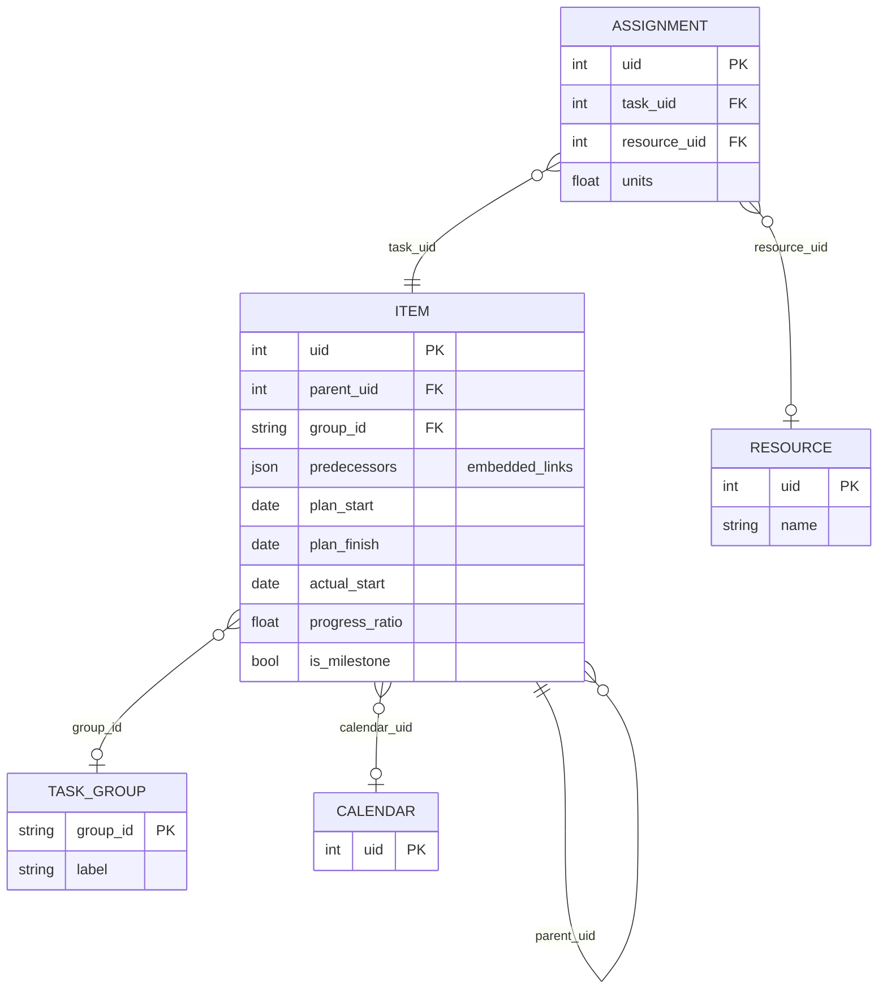
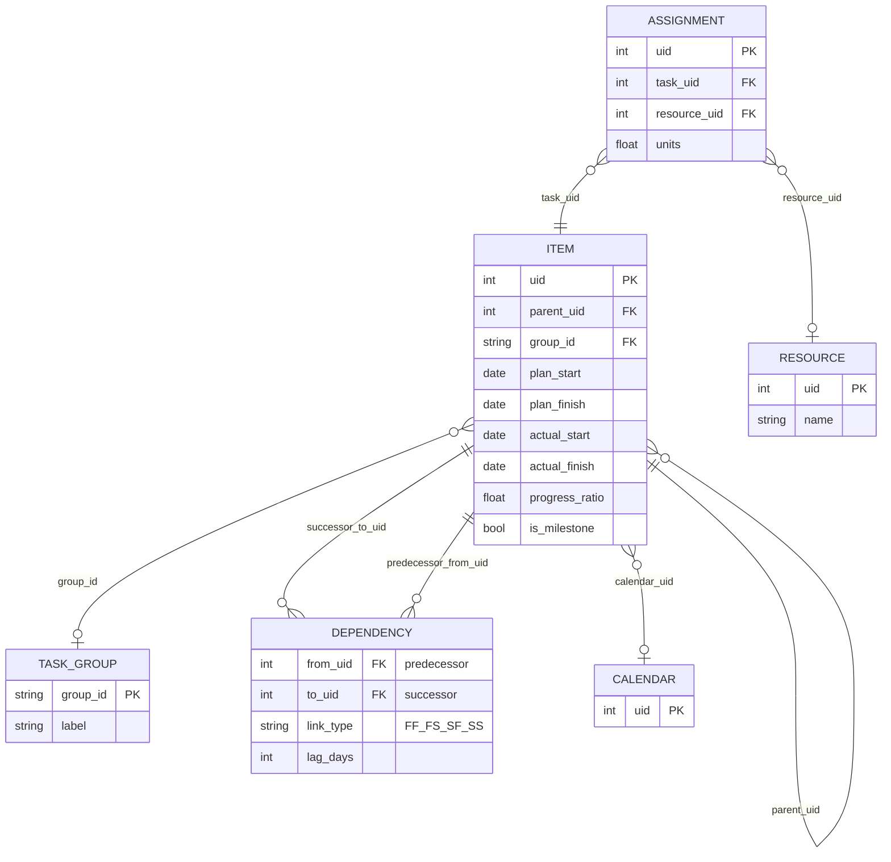
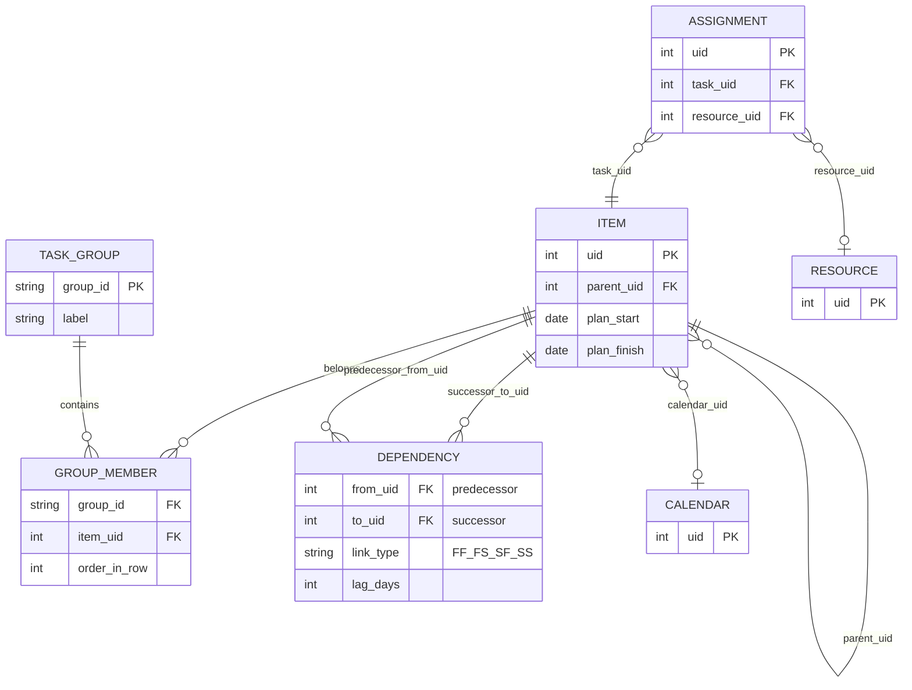
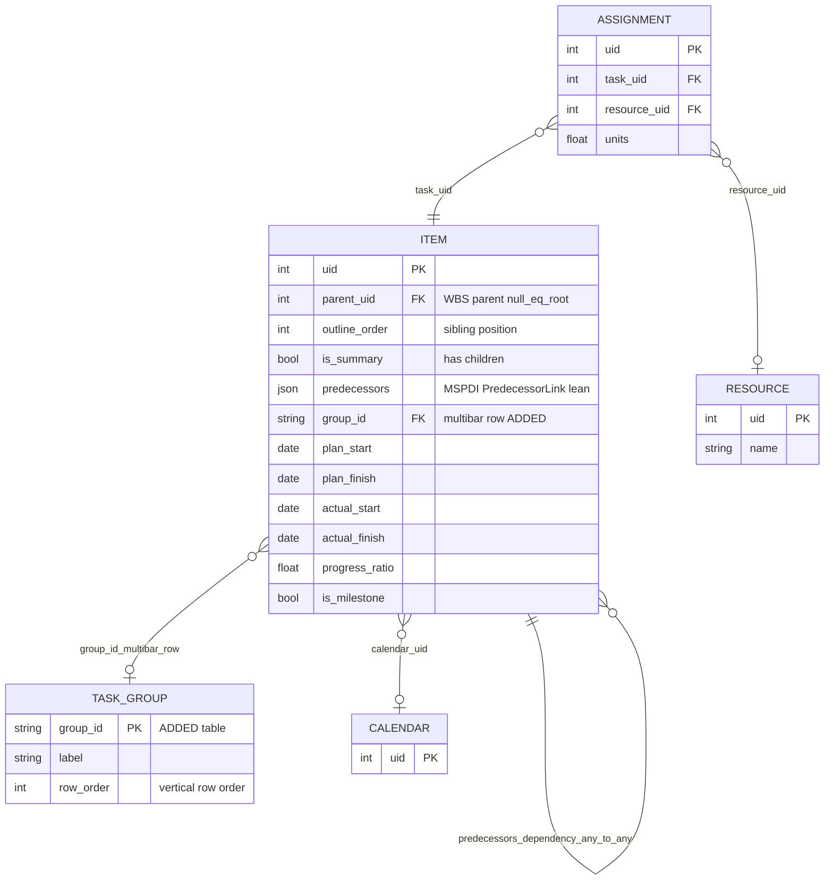
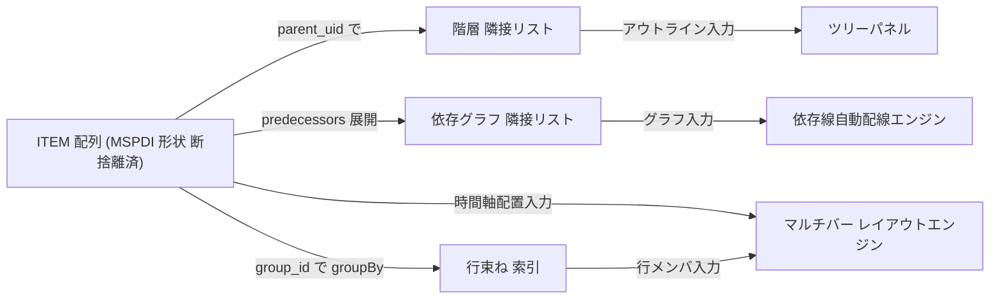

# GRS テーブル構成 ERD 比較

- 日付: 2026-07-24
- 種別: データ構造設計の比較検討（確定前の意思決定材料）
- 関連: DEC-006（マルチバー行束ね=案2ピュア）, `docs/spec/vendor/mspdi-core-tree.md`, CLAUDE.md（ドメイン境界: 依存線自動配線）

## 前提（この会話までに確定した事項）

- データ構造は **正規化テーブル（リレーショナル）**。ネスト木ではない。SQL/DB は使わず、実体は JS の配列 + `Map` 索引。
- **永続化=フラット配列 / 実行時=派生インデックス（O(1) 参照）**。単一の真実源は配列。
- 階層は **隣接リスト（`parent_uid`）**。ネストしない。
- 予実は **Model H**（同一アイテムに予定+実績+進捗率）。
- MSPDI 準拠は **Adapter の責務**。JSON はネイティブ・ドメインモデル。

差が出るのは「**依存**」と「**マルチバー行束ね**」の持ち方。そこを変えた3案を比較する。

## 案A: MSPDI ミラー（最小テーブル）

**案A ERD:**

依存を `ITEM.predecessors`（JSON 配列）としてアイテムに内包し、行束ねは `ITEM.group_id` でアイテム側に持たせる。テーブル5個で最小、MSPDI の `Task.PredecessorLink` 内包構造とほぼ 1:1 に写像できる。難点は、依存が各アイテムに散らばるため、依存線自動配線エンジンが毎回全アイテムを走査してグラフを組み直す必要があること。

## 案B: グラフ正規化（推奨）

**案B ERD:**

依存を独立した `DEPENDENCY` エッジ表に昇格させる。依存線自動配線（コアドメイン）が、全依存をグラフとしてそのまま受け取れる。行束ねは案A と同じく `ITEM.group_id` で単純に持つ（行内のバー位置は時間軸=日付で決まるため、明示的な並び順カラムは不要）。テーブルは案A より1個多いだけで、コア価値に効く。MSPDI との差は「依存の持ち替え」のみで、Adapter で `DEPENDENCY[]` と `Task.PredecessorLink` を相互変換すれば損失はない。

## 案C: 完全ジャンクション（最大柔軟）

**案C ERD:**

依存=エッジ表に加え、行束ねも `GROUP_MEMBER` 交差表にする。これで「1アイテムが複数行に所属」と「行内の明示的な並び順（`order_in_row`）」が可能になる。ただしその m:n 柔軟性は現要求（1車種=1行、各フェーズのバーはその行に属す）には存在せず、テーブル7個で最も複雑。アイテム削除時に `GROUP_MEMBER` 行の掃除も要る。

## 比較表

| 観点 | 案A ミラー | 案B グラフ正規化 | 案C 完全ジャンクション |
|---|---|---|---|
| テーブル数 | 5（最少） | 6 | 7（最多） |
| MSPDI 写像 | ◎ ほぼ 1:1 | ○ 依存のみ相互変換（損失なし） | △ 行束ね2段で写像が遠い |
| 依存線自動配線（コア価値） | △ 毎回全走査でグラフ構築 | ◎ エッジ表がそのままグラフ | ◎ 同左 |
| マルチバー表現力 | ○ 1アイテム=1行 | ○ 1アイテム=1行 | ◎ 1アイテム→複数行 m:n |
| 行内の描画反復 | 派生 groupBy 索引 | 派生 groupBy 索引 | 交差表を直接反復 |
| アイテム削除時の整合 | ◎ group_id 消えるだけ | ◎ 同左 + エッジは索引で掃除 | △ GROUP_MEMBER 行も掃除要 |
| 不変更新 / undo・redo | ○ 内包依存の更新は item 巻き込み | ◎ 依存・所属が独立し更新が浅い | ○ テーブル増で面倒 |
| 軽さ | ◎ | ◎（索引は O(1)） | ○ |
| YAGNI 適合 | ◎ | ◎ | ✗ m:n は未確認の要求 |

## 判定（確定）: 案A 系を精緻化して採用（案B/C は撤回）

議論の結果、案B のエッジ表は撤回した。理由: 配線エンジンが読むのは**実行時に派生する依存グラフ索引**であり、永続形状ではない。内包依存（MSPDI 形状）からでもロード時に O(n) で同じ索引を組めるため、永続をエッジ表にする必要はない（永続形状と実行時形状の混同だった）。案C の m:n（1アイテム→複数行）は現要求に無く YAGNI。

**確定モデル（変化点は2つ: ①断捨離 ②マルチバーテーブル追加）:**

**確定事項:**

- **依存**: MSPDI 通り `ITEM.predecessors` に内包（`from_uid, link_type, lag_days` に痩せさせる）。任意タスク間・別グループ間に引ける（MSPDI と同一定義）。実行時に依存グラフ索引を派生して配線エンジンへ渡す。エッジ表は作らない。
- **マルチバー行**: `TASK_GROUP` テーブルを追加し、`ITEM.group_id` FK（案 i）で所属を張る。単一 FK が「1アイテム=1行」を構造レベルで強制し、削除時も安全。
- **階層（WBS）**: `parent_uid` + `outline_order` + `is_summary` で定義（MSPDI ネイティブ、テーブル追加なし）。`OutlineNumber` は派生で持たない。
- **階層 × マルチバー行は完全独立の 2 軸**。WBS ツリーと表示行は無関係に設定でき、任意のアイテムを同一行に束ねられる（上位互換）。
- テーブルは 5 個: ITEM / TASK_GROUP / ASSIGNMENT / RESOURCE / CALENDAR。依存は ITEM 内包のためテーブルにしない。

**データ構造フロー（実行時の派生索引）:**

## 次アクション

- 【確定済み】上記モデルを採用（依存内包 / group_id FK / 階層独立）。
- 【任意】この確定を DEC 化するか、`docs/spec/40-data-format.sdoc` に落とし込む。
- 【次工程】各テーブルの列を確定する断捨離③（MSPDI 約100フィールド → 残す/捨てる/gr-scheduler固有で足す）。
