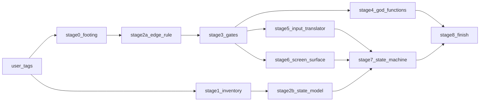

# リファクタ計画 —— 神ファイルの解体と、自前の状態機械への移行（2026-09-13 立案）

**本書は、`src/` のリファクタの計画である。** 立案した時点では、コードも仕様も 1 行も変えていない。
⭐ 数にはすべて測り方を添える。⚠️ 測っていないものは「未測定」、行の要旨から判断したものは「判断」と書く。
⛔ 何を変えたかは `git log` が答える。本書はそれを繰り返さない。
⚠️ 本書の初版（同日）は裁定を受ける前に書いた。裁定（`rulings.md` の JDG-45〜58）を受けて改めた点は、記録の 9 節にある。

---

## 現在地

- **計画は確定した。**
  - 振る舞いの欠陥の置き場は d（JDG-57。記録の 7 節）。
  - 断捨離を繰り返さない仕組み、状態機械の原稿と置き場、性能の見立ても了承を受けた（JDG-59・60。記録の 11〜13 節）。
  - 試験のコメントの規則は案 C に決まった（JDG-62。記録の 15 節）。
- **ブランチとタグは整った**（JDG-61。記録の 14 節）。
  - `main`・`restart`・`refactor` はいずれも `8701ccf` から出発した。タグ `After-Cleanup` と `Before-Refactor` はそのコミットにある。
  - 以後の作業はすべて `refactor` で行う。
- **次の一手（新しいセッションで、この順）:**
  1. `git status` で `refactor` にいることを確かめ、`bash .claude/skills/spec-graph-check/check.sh` を回して、本書の数と実物を突き合わせる。
  2. `dist/index.html` を作り直す（JDG-51）。
  3. 段 0（足場）と段 1（棚卸し）を始める。仕組み化（記録の 11 節と 15 節）は段 0 の並行作業である。
  4. 網羅の道具を足す前に、取得の許可を受ける。
- **段の流れ:**



- 段 1 は読むだけなので、段 0 と並行してよい。
- 段 4・5・6 は互いに別のファイルを触るので、段 3 のあとで並行してよい（1 体 1 ファイル）。
- 段 7 は、`frame-loop.ts` が段 5 と段 6 の成果を import するので、その 2 つの後に置く。

---

## 状態表

| 段 | 中身 | 入口の条件 | 出口の条件（数） | 状態 |
|---|---|---|---|---|
| 段 0 足場 | ① 赤い試験を緑にする ② `dist/index.html` を作り直して性能の基準を測る ③ e2e と網羅の基準を記録する ④ 割っても残る場所の欠陥（記録の 7 節。裁定待ちを除く 4 行）を直す ⑤ CR-374 を仕様とコードの両方で当てる | タグ（JDG-51） | vitest の失敗 0。性能・e2e・網羅の基準値を記録した。④⑤ に直しの確認の試験がある | 🔧 |
| 段 1 棚卸し | 保存しない状態と、その依存を 1 つずつ集める | タグ | 状態 1 つにつき 1 行の一覧 | ✅ `docs/development-records/refactor-stage1-state-inventory-2026-09-13.md`（101 行） |
| 段 2a 辺の規則 | 変更要求: 辺の定義（JDG-47）を 5.2 に置く。JSON の置き場を決める | 段 0 | 変更要求が当たり、検査が緑 | ⬜ |
| 段 2b 状態のモデル | 変更要求: ADR-002（状態の持ち方）、状態の SSOT、UseCase のモジュール状態の置き場 | 段 1 | 同上 | ⬜ |
| 段 3 門 | 検査: 辺の許可リスト（コード ⊆ 図）、JSON も辺に数える、大きさのラチェット（JDG-54）、UseCase のモジュール状態 | 段 2a | 新しい検査が、わざと入れた違反で赤になり、今の基準値で緑 | ⬜ |
| 段 4 神関数 | `editTask` / `editTaskGroup` / `svgFromSchedule` / `builtMerge` を割る | 段 3 ＋ 割るファイルを表 T-075 に足す変更要求（JDG-48） | 500 行を超える関数が `frameLoop` と `domScreenSurface` だけ | ⬜ |
| 段 5 入力の翻訳係 | `input-command-translator.ts` を入力の種類ごとに割る | 同上 | 公開エントリの名前と署名が不変。試験が無変更で緑 | ⬜ |
| 段 6 画面に描く係 | `dom-screen-surface.ts` を UI パーツごとに割る | 同上 ＋ 裁定待ちの 2 行（DFC-566・571）が裁定を受けて直っている | 同上。描いた DOM が割る前と一致 | ⬜ |
| 段 7 状態機械 | `frame-loop.ts` の状態を、領域ごとに状態機械へ移す。書き直される場所の欠陥は、その領域を移した直後に直す | 段 2b・5・6 ＋ 領域ごとのユニットの変更要求 | `frameLoop` の `let` が芯だけ。UseCase のモジュール状態 0。書き直される場所の欠陥 8 行が閉じた | ⬜ |
| 段 8 仕上げ | components.json を到達点へ、図の再生成、書き直した試験のコメント、性能・網羅・e2e の再測定、引継ぎの更新 | 段 4・7 | 記録の 3 節の数がすべて目標に届く | ⬜ |

**段 0 の出口の条件、満たしたものと残り（2026-09-14。記録の 16 節）:**
- ✅ 満たした: vitest の失敗 0（②）、性能・e2e・網羅の基準値を記録した（③。記録の 16 節）。
- ⬜ 残り: ④ 割っても残る場所の欠陥のうち `DFC-568`（コメント／ハイライトボックスの四隅の掴み）と、
  `IV-21` の実装（`edit-task.ts` の拒みの理由を `AT-39` から付け替える）、非稼働日の終了点（`JDG-67`、未着地）。

**並行してよい作業と、ぶつかる作業:**

| 作業 | いつ | ぶつかるもの |
|---|---|---|
| `tests/` のコメント整理 | 段 0 の赤い試験の修正のあと | `frame-loop.ts` を import する試験 51 本は段 7 で書き直すので、段 8 まで待つ |
| マジックナンバー（`magic-numbers.md`） | 割らないファイルは段 0 から | `svg-renderer.ts`・`input-command-translator.ts`・`dom-screen-surface.ts`・`frame-loop.ts` は、それぞれを割る段の後。作業表がファイルの道で引かれているので、割ると引き直しになる |
| 仕様だけの欠陥（26 行） | いつでも | 仕様への適用は 1 つのセッションだけで行う。段 2a・2b・各段のユニットの変更要求と同じ巡にまとめる |

---

## 記録

### 1. 状況（2026-09-13 実測）

**コードの形:**

| 指標 | 値 | 測り方 |
|---|---|---|
| 上位 3 ファイルの実コード行 | `frame-loop.ts` 2,997 ／ `input-command-translator.ts` 2,854 ／ `dom-screen-surface.ts` 2,217 | rolldown の `parseAst` で構文解析し、空行とコメントを除いた行を数えた |
| 上の 3 ファイルが占める割合 | 実コード 25,022 行のうち 32% | 同上 |
| 500 行を超える関数 | `frameLoop` 2,173 ／ `domScreenSurface` 810 ／ `svgFromSchedule` 589 ／ `editTask` 508 | 関数の開始行から終了行まで |
| 分岐が 100 以上の関数 | `svgFromSchedule` 124 ／ `editTask` 106 ／ `editTaskGroup` 100 | if・三項・ループ・catch・case・`&&` `\|\|` `??` を数えた |
| 全関数 1,679 のうち 50 行以下 | 1,618 | 同上 |
| `frameLoop` が直に持つ `let` | 60 | `frameLoop` の本体で、字下げ 2 の `let` を数えた |
| UseCase のモジュールスコープの可変状態 | 2（`notify-change-watchers.ts` の登録簿、`apply-document-change.ts` の配布中の旗） | トップレベルの `let` と `new Map` を grep |
| 層の規則 | 違反 0 ／ import 指定子 299 | `python tools/check_layer_rules.py` |

**components.json の辺とコードの import:**

| 数え方 | 本数 |
|---|---|
| components.json の辺 | 85 |
| コードのコンポーネント間の辺 | 125 |
| 両方にある | 74 |
| コードにだけある | 51 |
| components.json にだけある | 11 |
| コードの辺のうち、型だけの import でできている辺 | 51 |

測り方: `src/` の全 `.ts` の相対 import（型だけの import と `.json` を含む）をフォルダ単位でコンポーネントに畳み、`docs/spec/_source/components.json` の `edges` と突き合わせた。同じフォルダの中の import は辺にしない。
⚠️ 既存の検査は、どれも辺を `src/` と比べていない。検査 19 は層の向き、検査 26b は公開名、検査 33 は仕様の中の数だけを見る。

**試験・性能・台帳:**

| 指標 | 値 | 出どころ |
|---|---|---|
| vitest の失敗 | 47 件 ／ 22 ファイル（DFC-510〜531） | `src-comment-cleanup-report-2026-09-13.md` の 2.3 |
| コミット前の門 `guard:commit` | vitest までで、e2e（`tests/usecase` / `system` / `nfr`）は含まない | `package.json` の scripts、`playwright.config.ts` |
| 1 フレームの時間 | 実測 20.42 ms、上限 16.7 ms。いまの値を是とする（LM-19、JDG-11） | `docs/spec/01-04-requirements.md` の LM-19 |
| 開いている欠陥 | 91 行 | `defects.md` の集計表 |
| 未裁定の PND | 178 行（D〜H は 57 行） | `pending-decisions.md` |
| 対象ファイルに触れる未裁定の PND | 15 行 | 行の本文を、対象ファイル名と画面の状態の語で正規表現にかけた |
| マジックナンバー | 436 件 ／ 25 ファイル | `magic-numbers.md`（`768501a` 時点） |

**開いている欠陥 91 行の仕分け**（判断: 読むだけの体が行の要旨から分けた）:

| 仕分け | 行数 | 扱い |
|---|---|---|
| リファクタが触らないファイル | 6 | いつ直してもよい |
| 対象ファイルの中 | 36 | 下の表 |
| 仕様だけ | 26 | 仕様のセッションが順に当てる |
| 試験と道具 | 23 | 22 行（DFC-510〜531）は段 0。道具の 1 行はいつでも |

**対象ファイルの中の 36 行**（判断）:

| 性質 | 行数 | 行 | 置く段 |
|---|---|---|---|
| 利用者に見える振る舞いの欠陥 | 14 | DFC-507・554・555・556・557・558・559・560・561・562・566・568・569・571 | 記録の 7 節（d）。566・569・571 は裁定待ち |
| 構造の負債（型・守り・試験・重複） | 20 | DFC-532〜542・544〜548・550〜553 | 割る段の設計で閉じる。550 は PND-187 の裁定待ち |
| コメントの誤り | 2 | DFC-485・509 | いつでも |

⭐ **構造の負債を割る段に置く理由:** DFC-538（`await` をまたぐ共有状態）や DFC-541（書き込みの後の画面の状態）は、状態機械へ移すこと自体が答えである。先に直すと、段 7 で作り直すことになる。

### 2. なぜ神が生まれたか

| 原因 | 根拠 |
|---|---|
| ユニットを割る基準を純粋性だけにした | `change-request/CR-125-file-structure-and-public-interface.md` §2-4。`InputCommandTranslator` は全部純粋なので割らないと、同じ文書が明示している |
| 対になる側だけを割った | CR-140 は `ScreenRenderer` を UI パーツごとに 10 ユニットに割り（UT-7）、`DomScreenSurface` は 1 ユニットで足した |
| SRP の違反に気づいたが、2 つにだけ割った | CR-134 が `SingleHtmlShell` の責務 8 節を見つけ、UT-6 で 2 ユニットにした |
| 状態の置き場がクロージャしか無い | LY-5（現在値は Framework だけ）＋ 5.3（インスタンスを作らない）＋ 内側は純粋。`frameLoop` の `let` 60 はその帰結 |
| ファイルを足すたびに変更要求が要る | 検査 18 は、`src/` のファイルの集合が表 T-075 と同じでなければ赤にする。⚠️ これ自体は残す（JDG-48）。欠けていたのは、ファイルが太ったときに割る変更要求を起こす契機である |
| 修理が同じファイルに積もった | `docs/review/why-a-fix-costs-what-it-does-2026-09-10.md` の測定では、`frame-loop.ts` を開いたコミットが 105 で、全コミットの 4 本に 1 本 |
| SRP を `src/` に当て直さなかった | `src/` に SRP を当てた記録は 0 件（`docs/development-records` と `change-request/` を grep） |
| 仕事を「概念の持ち主」で割って失敗した | `3d1d9f1`: 描く処理は `dom-screen-surface.ts` にあったので割り当てが外れ、3 体が「自分のファイルではない」と止まった |

外部レビュー（`docs/review/third-party-review-2026-09-10.md`）の見立ても同じ向きである。**分解はよくできていて、少数の巨大な受付が問題だ**という。関数の中央値は 4 文、90 パーセンタイルは 19 文だった。

### 3. 到達点

到達点は 3 つの層で示す。**設計図だけでは足りない。** いまの図も検査は緑なのに、コードとずれている。

| 層 | 中身 | 置き場 |
|---|---|---|
| 構造 | 到達点の `components.json`（ノード・辺・層） | 段 8 で `docs/spec/_source/components.json` に当てる |
| 規則 | 第 5 章の差分: 辺の定義（JDG-47）、JSON の置き場、ADR-002、割るたびのユニット（JDG-48） | 段 2a・2b と各段の変更要求 |
| 検証 | 下の数 | 段 3 の検査と、段 8 の再測定 |

| 数 | いま | 目標 |
|---|---|---|
| components.json に無い import の辺 | 51 | 0 |
| components.json にあってコードが使わない辺 | 11 | 0。残すなら行ごとに理由 |
| UseCase から Adapter フォルダの JSON への import | 2 | 0 |
| 他コンポーネントの公開エントリ以外の JSON を読む import | 2 | 0 |
| UseCase のモジュールスコープの可変状態 | 2 | 0 |
| `frameLoop` が直に持つ `let` | 60 | 状態の値 1 つと、環境の値だけ（数は段 1 で決める） |
| 500 行を超える関数 | 4 | 0 |
| 分岐 100 以上の関数 | 3 | 0 |
| 関数の行数・分岐数の上限値 | 無い | 段 3 はラチェット（増加禁止）だけ。上限値は段 8 の実測を見て決める（JDG-54） |
| 表 T-064 に無い越境名 | 137 | 減らす（目標は段 8 で決める） |
| vitest の失敗 | 47 | 0 |
| 1 フレームの時間 | 段 0 で測る | 段 0 の値より悪くしない（JDG-50） |

### 4. 自前の状態機械の設計方針（ADR-002 の叩き台）

XState は採らず、自前で実装する（JDG-45）。

**形:**
- 状態は、領域ごとの判別共用体（`kind` で分かれる型）で持つ。出来事も共用体にする。
- 遷移は `step(state, event)` が `{ next, effects }` を返す純粋関数とする。
- 何も変わらない出来事では、**同じ参照を返す**。そうすれば「変わった」と誤判定して描き直すことが無い（NFR-010）。
- 処理し忘れた出来事は、`never` による網羅検査でコンパイルエラーにする。
- **連続して変わる値（ポインタの座標など）は状態機械に入れない。** フレームの値として持ち、機械には「押した」「掴んだ」「問いに答えた」のような離散的な出来事だけを入れる。
- 副作用（書き込み・ファイル・クリップボード・問い）は値として返し、シェルが実行する。シェルが持つ現在値は状態の値 1 つだけにする（LY-5 を守る）。
- 根の状態は領域の合成とし、**`step` を領域ごとに分けて持つ。** 1 つの `switch` に全部を集めると、新しい神になる。

**領域の候補**（判断: `frameLoop` の `let` 60 を名前から分けた。使われ方は 1 つずつ確かめていない）:

| 領域 | `let` の数 | 例 |
|---|---|---|
| ファイル操作と問いの待ち | 11 | `asking` `openChoosing` `mergeChoosing` `isFileOperationWaiting` |
| 画面の値 | 10 | `isPaletteMinimised` `propertiesShowing` `isDialogueFieldVisible` |
| ポインタとツールチップ | 8 | `pointerAt` `isTooltipStanding` `pointerRestingSince` |
| 身振り | 6 | `pressed` `previewDocument` `rowGrabbedAt` |
| 文書と現在値の芯 | 5 | `held` `values` `dialogueLog` |
| 通知 | 5 | `raisedNotices` `stackSafetyCapToldFor` |
| 名前付けと入力欄の流れ | 5 | `namingCreatedTaskUid` `isSettlingFieldCommit` |
| 選択 | 4 | `selection` `selectedGroupIds` `copiedForPaste` |
| 操作の記録 | 4 | `isRecordingInteractions` |
| Agent API | 2 | `isAgentApiEnabled` |

**移す順（案）:**
1. **画面の値。** 既に `ScreenState`（5 項目）と表 T-206 の行（S-99e・S-99f・S-99g・S-144）がある。小さく仕様も明確なので、ここで型の形を決める。
2. **通知。** UseCase の配布中の旗を、ここで状態へ移す（DFC-562 と重なる）。
3. **身振り。**
4. **ファイル操作と問いの待ち。** 最も大きく、非同期である。DFC-538・541・542・557・561・569 と PND-187・423・446 が重なる。
5. **ポインタとツールチップ。** 毎秒の出来事が最も多いので、移すたびに性能を測る。
6. **名前付けと入力欄、選択、操作の記録、Agent API。**

**SSOT:**
- 状態の値と既定値は `docs/spec/_source/settings.json`（表 T-206）が持つ。前例がある。
- 遷移の持ち主は、段 1 の棚卸しの結果を見て、次の 2 つから選ぶ。
  - **要求の表の散文が持ち、コードは手で追う**（いまの延長）
  - **新しい原稿が持ち、そこから仕様の表・図と遷移の型を生成する**（`erd.json` と同じ筋。状態遷移を図にする前例は、予実の状態遷移を描いた図 F-018 がある）
- ⛔ **仕様に載せるのは、要求が名指す状態と遷移だけにする。** ツールチップの待ち時間のような実装の都合まで仕様に載せると、仕様を直さないとコードを直せない形になる。
- ⚠️ 台帳の行（PND-141〜144）は `ScreenSession` の語を使うが、`docs/spec` にこの語は 0 件である（`*.md` と `*.json` を grep）。

### 5. 段ごとに気をつけること

**段 0 足場**
- 赤い試験 47 件（DFC-510〜531）を緑にする。**仕様が正であり、直すのは試験である。**
- `dist/index.html` はタグの後に作り直す（JDG-51）。いまの出荷物は `src/` より古い。
- 性能の基準は、LM-19 と同じ手順（出荷ビルド、1920 × 1080、`Task` 1000 件）で測る。段 7 と段 8 で同じ手順を再生できるよう、手順を記録に残す。
- 割っても残る場所の欠陥（記録の 7 節）と CR-374 を直す。直す前に、各行の実際の所在をコードで確かめ直す。

**段 2a 辺の規則**
- 辺の定義（JDG-47）: 「コンポーネント A のフォルダのファイルが、コンポーネント B のフォルダのファイル（`.ts` と `.json`）を import することを辺とする。型だけの import を含む。コードの辺は components.json の辺に含まれること」。
- シェル（`SingleHtmlShell`）から出る辺も省略せずに書く。シェルが知りすぎていることが見えるほうが、減らす圧力になる。
- 実行時にコールバックで呼ぶ流れは辺にせず、5.5 の表（T-067 / T-077）が持つ。
- 表 T-075 のユニット一覧は仕様に残す（JDG-48）。

**段 3 門**
- 辺の許可リスト（コード ⊆ 図）: 検査 19 の読み取りを使えば、新しい読み取りを作らずに済む。
- 大きさ: 関数の行数と分岐数に、いまの値を基準線として持たせ、**増えたら赤**にする（JDG-54）。
- ⭐ **門を先に置く理由:** コメント整理が止まったとき（`0dd981c`）、原因の 1 つは基準を測る機械が無かったことだった。原則の段に置いた規則は守られない。

**段 4〜7 の入口 —— ユニットの変更要求（JDG-48）**
- 割る前に、足すファイルごとに表 T-075 の行と表 T-063 の割った理由を書く変更要求を起こす。
- **変更要求の段階で、そのファイルの妥当性を評価する:**
  - 変更の理由が 1 つか（R2.2）。1 ファイルに「〜と〜を行う」が残らないか。
  - 純粋な側と非純粋な側が混ざらないか（R7.9）。
  - 仕事の割り振りで迷わないか —— 「この欠陥はどのファイルか」に 1 つで答えられるか（`3d1d9f1` の教訓）。
  - 割ったファイルに見出しが増えても、ファイルごとのコメント密度の上限（10%、コード 100 行以上）に収まるか。

**段 4〜6 の共通の型**
- 公開エントリの名前と署名を変えず、その裏で割る。試験は公開エントリを import しているので、そのまま通る。
  - `input-command-translator.ts` を import する試験は 66 本、`dom-screen-surface.ts` は 28 本、`edit-document.ts` は 36 本。
- **振る舞いを変えるコミットと混ぜない。** 割るコミットは、試験が変わらずに緑であることで検証する。
- 巨大ファイルの節は、行番号ではなく目印で切る（行番号は最初の編集で動く）。
- 1 体 1 ファイル。体への指示には「このブリーフの誤りを 1 つ挙げよ」と「commit と push は前に立つ者が行う」を書く。

**段 5 入力の翻訳係** —— 入力の種類ごと（キー・ホイール・ポインタの押下・掴みとドラッグ・画面の入口・入力欄の確定・選択・画面の状態）に割る。`commandFromInput` の振り分けだけを公開エントリに残す。

**段 6 画面に描く係** —— `ScreenRenderer` の 10 ユニットと同じ切り方で割る。記述を作る側と描く側が 1 対 1 になる。

**段 7 状態機械**
- `frame-loop.ts` を import する試験 51 本は、ここで書き直す。
- ⚠️ シェルの安全網は薄い。シェルと画面の面が公開する 11 の名前のうち、単体試験があるのは 3 つ（`docs/review/third-party-review-2026-09-10.md`）。e2e は `guard:commit` に入っていない。⇒ 領域を移す前に、その領域の振る舞いを固定する試験を足す（6 節）。

### 6. 試験の計画（JDG-49）

**試験の種類:**

| 種類 | 何を確かめるか | 誰が書くか | 寿命 |
|---|---|---|---|
| 仕様駆動の試験 | 仕様の行が求める振る舞い | `docs/spec` だけを読む別の体 | 残る |
| 直しの確認の試験 | 直した欠陥が直っていること | 同上 | 残る |
| 現状固定の試験 | いまのコードの出力が、動かす前後で変わらないこと | 動かす作業をしない別の体。コードを読んでよい | 一時。その段の終わりに、仕様駆動の試験で覆えている分は消す |
| 門の試験 | 新しい検査が、わざと入れた違反で赤になること | 前に立つ者 | 記録に残す（検査 50 の前例） |
| 性能の測定 | 1 フレームの時間 | 前に立つ者が手順を決め、体が回す | 段 0・段 7 の領域ごと・段 8 |

**段ごとに試すこと:**

| 段 | 割る・移す前 | 割る・移すコミット | 後 |
|---|---|---|---|
| 段 0 | 赤い試験 47 件を仕様に合わせて直す。性能・e2e（全部。既知の赤は PND-443 の 2 件）・網羅の基準を記録する | —— | 割っても残る場所の欠陥と CR-374 に、直しの確認の試験を 1 件ずつ |
| 段 1〜2b | 試験なし | —— | `check.sh`・`gen:check` |
| 段 3 | —— | 新しい検査ごとに、わざと違反を 1 つ入れて赤になることを確かめる | 基準値で緑 |
| 段 4 | 対象関数の分岐の網羅を測り、足りない分岐に仕様駆動の試験を足す（`editTask` / `editTaskGroup` は命令ごと、`svgFromSchedule` は描くものごと） | 試験を 1 行も変えずに緑 | 網羅が段 0 より下がっていない |
| 段 5 | 同上。入力の種類ごとに少なくとも 1 本 | 同上 | 同上 |
| 段 6 | 固定した場面で描いた DOM を直列化し、現状固定の試験として記録する | 同上 ＋ 現状固定の試験が一致 ＋ e2e | 現状固定の試験のうち、仕様駆動で覆えている分を消す |
| 段 7（領域ごと） | ① 領域の外から見える振る舞い（出来事の列 → 画面の記述・書き込み・通知）の現状固定の試験 ② 純粋な遷移の表の仕様駆動の試験（何も変えない出来事で同じ参照を返すことを含む） | ① が無変更で緑 ＋ e2e。ポインタとツールチップの領域は性能も測る | `frame-loop.ts` の内部に結びついた試験を書き直す。書き直される場所の欠陥を別のコミットで直す（直しの確認の試験が赤 → 緑） |
| 段 8 | —— | —— | e2e 全部、性能を段 0 と比べる、網羅を段 0 と比べる、現状固定の試験の後始末 |

**全段で:** コミットごとに `guard:commit`。段の出口ごとに e2e（`guard:commit` に入っていないため）。

### 7. 利用者に見える振る舞いの欠陥 14 行の置き場 —— d に決まった（JDG-57）

**比べた選択肢:**
- a) 先に直してからリファクタする
- b) リファクタの前後で振る舞いを揃えるため、今は直さない。リファクタ後に一致を確かめてから直す
- c) リファクタと同時に直す
- d) その他

**決まったこと: d —— 直す場所がリファクタの後も残るかで、欠陥ごとに a と b を使い分ける。c はどの行にも使わない。**

| 群 | 直す場所 | いつ直すか | 行（判断: 行の要旨から） |
|---|---|---|---|
| 割っても残る場所 | 段 4〜6 で割るだけのファイル（入力の翻訳係・画面に描く係・編集の規則）と、シェルの定数 | **a**: 段 0 で直す。裁定待ちの 2 行は、裁定を受けて段 6 の前に直す | DFC-507・554・560・568、裁定待ちの 566・571 |
| 書き直される場所 | 段 7 で状態機械へ移す `frame-loop.ts` と `single-html-shell.ts` の流れ | **b を領域ごとに**: その領域を移して一致を確かめた直後に、別のコミットで直す | DFC-555・556・557・558・559・561・562、裁定待ちの 569 |

**根拠:**
- **割るだけの段（4〜6）は、コードを動かすだけで振る舞いを変えない。**
  - 先に直しておけば、直しの確認の試験が、割る前後で同じ振る舞いを確かめる安全網を兼ねる。
  - 台帳の行は今のファイルと行で書かれているので、今直すほうが探す手間が少ない。割ると所在が変わる。
  - 逆に後に回すと、誤った振る舞いを現状固定の試験で固め、直すときにその試験を書き換えることになる。仕様を正とする試験の方針ともぶつかる。
- **書き直す段（7）で先に直すと、直した部分をその段で捨てることになる。**
  - 移す作業の検証は「移す前と同じ振る舞い」が最も単純で強い。
  - 移した後は遷移が純粋関数なので、直しは状態と出来事の表の 1 行として試せて安い。
  - 全部の段の後まで待つのではなく、その領域を移した直後に直すので、利用者が不具合と暮らす期間は領域ごとに短い。
- **c を採らない理由:** 振る舞いが変わったとき、原因が移し間違いか直しかを切り分けられない。このプロジェクトは既に、改名と掃除を混ぜないと決めている（`docs/review/pd-id-split-plan.md`）。

**但し書き:**
- 群の分け方は、台帳の行の 1 行の要旨から判断した。段 0 の頭で、各行の実際の所在をコードで確かめ直す。群が変われば、本節の表を追記で改める。
- 書き直される場所の欠陥のうち、日々の利用で困るものがあれば、前へ移してよい。代償は、段 7 でその部分を作り直すことである。

**CR-374 の置き場:** 抱える作業（DFC-507・508・509）は `input-command-translator.ts` にあり、割っても残る場所である。⇒ **仕様側もコード側も段 0 で当てる**（段 5 で割る前）。

### 8. 断捨離（掃除の巡）の計画の変更（JDG-53）

**元の計画**（`docs/review/cleanup-2026-09-11-prompt.md` の 7〜10 節）は 3 つのフェーズだった。

| フェーズと手 | 元の中身 | 2026-09-13 の状態 | 変更後の扱い |
|---|---|---|---|
| フェーズ 1 の P1-1〜P1-4 | 道具を作る | ✅ 完了（タグ `After-Cleanup-P1`） | —— |
| フェーズ 2 の P2-1 | 変更履歴の移設 | ✅ 完了 | —— |
| フェーズ 2 の P2-2 | 仕様書の原稿の仕分け | ✅ CR-375 で終えた（タグ `Readable-Spec`） | —— |
| フェーズ 2 の `src/` のコメント | 裁定 17・18 で削る | ✅ 完了（`src-comment-cleanup-report-2026-09-13.md`） | —— |
| フェーズ 2 の `tests/` のコメント | `src/` の後に削る | ⬜ 未着手 | **掃除の巡から外し、本計画へ移す。** 段 0 の赤い試験の修正のあとに並行して行い、`frame-loop.ts` を import する 51 本は段 8 に回す |
| フェーズ 2 の P2-3 | 仕様書の結合度と行長 | ⬜ 未着手 | 掃除の巡から外す。本計画にも入れない（残件） |
| フェーズ 2 の終わりのタグ `After-Cleanup-P2` | フェーズ 2 の終わりに打つ | 打っていない | **断捨離の終了のタグと、リファクタ開始のタグに置き換える。** 利用者が打つ（JDG-52） |
| フェーズ 3 の P3-1 | `@purity` の検査 | 済 | —— |
| フェーズ 3 の P3-2・P3-3 | 関門の順序、`FR-093` の数え式の重複 | 不要と判定済 | —— |
| フェーズ 3 の P3-4 | 論駁の圧縮 | 上限の裁定待ち | 掃除の巡から外す（残件） |
| フェーズ 3 の P3-5 | 台帳 5 本 | 裁定 6 により触らない | —— |
| フェーズ 3 の P3-6・P3-7・P3-8 | 仕様書の中の嘘を捕まえる検査 3 本 | 未裁定 | 掃除の巡から外す（残件）。仕様への適用が増える段 2a・2b の前に入れる価値があるかは、記録の 10 節で問う |

⚠️ `docs/review/cleanup-2026-09-11-prompt.md` の 0 節の状態表は古いまま（`src/` を未着手と書く）。本書は掃除の巡の最後の状態を持つが、あの文書は書き換えていない。

### 9. 本セッションで決めたこと・分かったこと

| 日付 | 事柄 | 根拠 |
|---|---|---|
| 2026-09-13 | 状態機械は自前で実装する（JDG-45） | 事前の比較: XState を足すと、成果物は gzip で 194,086 → 約 208,600 バイト（+7.5%）。TypeScript 7.0.2 と LR-6（DOM 無しのコンパイル）が通るかは未確認。初めての実行時依存になり FR-069 の変更要求が要る。何も変わらない出来事で新しい値を作ると NFR-010 と NFR-003 を壊しうる |
| 2026-09-13 | 辺の定義と検査の形が決まった（JDG-47） | 本書 5 節の段 2a |
| 2026-09-13 | ユニットの一覧は仕様に残し、割るたびに変更要求を起こしてその段階で妥当性を評価する（JDG-48） | 初版の「一覧を仕様から外す」案は採られなかった。段 4〜7 の入口に変更要求を置いた |
| 2026-09-13 | 試験は必要に応じて足す。段ごとに何を試すかを計画が持つ（JDG-49。JDG-13 を覆した） | 本書 6 節 |
| 2026-09-13 | 性能は段 0 で測った値より悪くしない（JDG-50） | JDG-11 はそのまま生きている |
| 2026-09-13 | `dist/index.html` の作り直しは、計画とタグの後（JDG-51・52） | 本書の現在地 |
| 2026-09-13 | 大きさの上限値は段 8 で決め、段 3 はラチェットだけ（JDG-54） | 本書 3 節 |
| 2026-09-13 | 振る舞いの欠陥の置き場は d（JDG-57）。CR-374 は段 0 で当てる | 本書 7 節 |
| 2026-09-13 | コミットと push は前に立つ者が行ってよい。タグは利用者が打つ（JDG-58） | 本書の現在地 |
| 2026-09-13 | 検査 24 は、本フォルダの新しい `.md` を波の記録として読む。報告を置くには、名前を検査の除外に足し、`README.md` の木にも足す | `check-development-record.py` |
| 2026-09-13 | 本フォルダの表の行の第 1 セルは、検査 44 が ID の定義として読む。報告の表は ID から始めない | `check-spec-id-references.py` |
| 2026-09-13 | ⛔ `rulings.md` に行を足すと、仕様書の生成物 `docs/spec/_assets/tbl-row-id-prefixes.md` がずれて検査 27 が赤になる。生成器が接頭辞ごとに記録の行も数えるためである。⇒ 行を足したら `npm run gen:prefixes` を回す | `check.sh` の検査 27（実測: JDG の 12 行で赤、生成し直して緑） |
| 2026-09-13 | `handoff.md` は「開いている行は DFC-311 だけ」と書いたままで古い。台帳の残件は 91。冒頭に本書への案内と、古い節の注意を足した | `handoff.md` の冒頭 |
| 2026-09-13 | `rulings.md` の検査 43 は、`適用済` の行の着地先が既存のファイルか仕様の ID を名指すことを求める。JDG-47 と JDG-48 の着地先は本書であり、第 5 章への着地は段 2a と各段の変更要求で行う | `check-ruling-landed.py` |

### 10. 残る問い

| 問い | 選択肢 | 推奨 |
|---|---|---|
| タグの名前 | 既存の形（`Before-Cleanup`・`After-Cleanup-P1`・`Readable-Spec`）に倣う | 断捨離の終了を `After-Cleanup`、リファクタ開始を `Before-Refactor` とする |
| 網羅の測定の道具 | (a) vitest の網羅の道具（開発用の依存。成果物には入らない）を足す ／ (b) 足さず、分岐の網羅は読んで確かめる | (a)。段 4〜7 の「網羅が下がっていない」を数で判定できる。⚠️ 段 0 で足す前に問う |
| 掃除の残件（P2-3・P3-4・P3-6・P3-7・P3-8） | (a) 残件として置く ／ (b) P3-6 と P3-8 だけ段 2a の前に入れる | (a)。本計画の範囲を広げない |

⭐ 上の 3 つは JDG-59・61 で推奨どおりに決まった。網羅の道具は、足す時点で取得の許可を改めて受ける。

### 11. 断捨離を繰り返さない仕組み（JDG-59。段 0 の並行作業）

**方針:** 書く前に規則を全部読ませることも、コミット前にツールで削ることも、主役にしない。**書いた直後に、ツールで止めずに知らせ、AI に直させる。**

| 根拠 | 出どころ |
|---|---|
| 原則として書いた規則は 75 回中 7 回しか守られず、手順に組み込んだ規則は毎回実行された | `check-ruling-landed.py` の説明（規則の信頼度の梯子） |
| 開発規則は 2,632 行、`07-review-standards.md` だけで 592 行。毎回読ませると重く、しかも守られない | `wc -l docs/development-rules/*.md` |
| コメントの門（検査 55）は `4d29370` で入った。それまでに `src/` へ 22,970 行のコメントが溜まった | 同コミットの `--shortstat` |
| 消すことを自動で決めると、罠を告げるコメントまで消える | `docs/review/comment-removal-logic.md` |
| 検査 55 は `src/` 全体を 0.25 秒で読み、1 ファイルだけを読むモード（`--file`）を持つ | 実測 |
| この木の hook はセッション開始の 1 つだけ | `.claude/settings.json` |

**3 つの層:**

| 層 | いつ | 何をするか |
|---|---|---|
| 書いた直後（新設） | AI がファイルを編集・作成した直後 | hook で、そのファイルだけを検査して違反を返す。**止めずに知らせる。** 原稿を編集したら、対応する生成器の `--check` も回す |
| コミット前（既存） | `guard:commit` | `check.sh` 全体。ここで止める |
| 書く前（縮小） | 体への指示を書くとき | 原典（`docs/review/comment-rules-src.md`）から生成した 30 行以下の規則カードだけを貼る |

**あわせて直すもの:**
- 検査 55 を `tests/` へ広げる（⚠️ 裁定 17・18 を `tests/` にどう当てるかは未決）。
- 台帳の行の長さにラチェットを置く。
- 検査ごとに、わざと違反を入れたら赤になる試験を持ち、`docs/development-rules/09-tools.md` と結ぶ。
- 起動時の統計に、コメント密度と違反数を足す。

**⚠️ 未確認:**
- hook がサブエージェントの編集でも発火するかは、作る前に確かめる。
- Bash 経由の書き換えは hook に掛からないので、コミット前の門が拾う。

### 12. 状態機械の原稿と置き場（JDG-59・60。ADR-002 の叩き台）

**原稿（SSOT）:** `docs/spec/_source/` の 1 ファイル（仮称 `state-machines.json`）。

| 項目 | 持つもの | 持たないもの |
|---|---|---|
| 状態 | 行 ID、キー、親（入れ子）、初期状態か、運ぶ値の名前、根拠の行 | 既定値と上下限（表 T-206 が持ち、`S-` 行を指すだけ） |
| 出来事 | 行 ID、キー、どこから来るか（入力の行・副作用の結果・時間）、運ぶ値の名前 | 画面の語（辞書が持つ） |
| 遷移 | 元の状態、出来事、ガードの名前、先の状態、副作用の名前、根拠の行 | ガードの条件式と副作用の中身（コードが持つ） |
| 領域をまたぐ優先順 | IN-4 のように 1 つの出来事を奪い合う順 | —— |

- 行 ID の接頭辞は仮に `SM`（状態）・`EV`（出来事）・`TN`（遷移）。いずれも登録簿に無いことを確かめた。段 2b の変更要求で登録する。
- **原稿に載せるのは、要求が名指す状態・出来事・遷移だけにする。** 実装の都合の細部は、状態の種類を増やさず、状態が運ぶデータとしてコードが持つ。
- **生成するもの:**
  - 領域ごとの状態遷移図（`stateDiagram-v2`）
  - 状態の表・出来事の表・遷移表・優先順の表
  - TypeScript の判別共用体と遷移表の定数（生成範囲へ）
- **手で書くもの:** 各領域の遷移の関数（`switch`）。
- **ずれの止め方:**
  - 原稿と生成物のずれは `gen:check` が止める。
  - 遷移表と遷移の関数のずれは、領域ごとの契約試験が止める。すべての（状態, 出来事）の組で、先の状態の種類が表と一致し、表に無い組では同じ参照を返すことを確かめる。
- 図 F-018（予実）は文書のデータの状態なので、この原稿には入れない。

**置き場:**

| 層 | 置くもの | 新設か |
|---|---|---|
| Entity / documentModel | `ScreenState`（CP-36）を広げる —— 開いている面・構え・パレット・全画面・透かし・Dual Cursor・説明 | 既存を広げる |
| UseCase | **専用コンポーネント 1 つ**（仮称 `AdvanceScreenSession`）: セッション全体の型、出来事と副作用の型、入口の振り分け、領域ごとの遷移ユニット、共通の型（`Step`・`unchanged`・`assertNever`）のユニット | 新設 |
| Adapter | `InputCommandTranslator` は、どこで何が押されたかを出来事に変える役へ細る。描き手はセッションを読む | 責務を変える |
| Framework | `SingleHtmlShell` がセッションの現在値を 1 つ持ち、出来事 → 遷移 → 差し替え → 副作用の実行を回す。副作用の結果は出来事で戻す | 責務を変える |

- **UseCase に置く理由:**
  - 判断の中身がアプリの手順だから。
  - 流れの状態は UseCase の型（合流の候補、文書の命令）を運ぶので、Entity に置くと外向きの依存になる。
  - Adapter に置くと、ブラウザ無しで試せる純粋な層の外に出る。
- **コンポーネントを 1 つにする理由:** IN-4 の優先順は 8 領域をまたぎ、書き込みを拒むガードは 3 領域を同時に読む。変更の理由が領域ごとに違う点は、ユニットを領域ごとに分けて満たす（UT-2 と同じ形）。
- **文書は集約に入れない。** 書き込みの唯一の経路（MS-1）が持ち、セッションは読むだけである。
- **共通の型:** 使い手がこのコンポーネントだけなので、ライブラリ用のコンポーネントは作らない。
- **境界の決まり:**
  - 座標と当たり判定は Adapter と layoutEngine が持ち、結果を出来事の値で運ぶ。
  - いまのモードで出来事が何を意味するかは、UseCase の遷移が決める。
  - 文書をどう変えるかは、既存の `EditDocument` / `ApplyDocumentChange` が決める。
- **仕様への影響（段 2b）:**
  - 表 T-060 の LY-3
  - 表 T-062 に 1 行を足し、CP-18・CP-25・CP-36 の責務を改める
  - 表 T-063 / T-075 / T-064
  - `components.json`
  - 表 T-065（層をまたぐインターフェース）は増やさない

### 13. 性能の見立て（JDG-60）

- **ズーム・スクロール・パンで速く変わるのは、文書の設定値である。**
  - 倍率と表示位置（S-75〜S-78、S-176、S-177）は保存される値である。
  - ホイール 1 回ごとに `setZoom` / `setScrollPosition` の命令になり、書き込みの経路を通る（取り消しの対象外）。
  - 文書は集約に入れないので、状態機械は動かない。
- **状態機械が動くのは、操作を始めたとき・やめたとき・指しているパーツが変わったときだけである。**
- **合成ベンチマーク:** 計画の形を模した 8 領域の遷移を Node 24 で 100 万回ずつ回した。製品のコードではない。

| 出来事 | 中央値 | 95 パーセンタイル |
|---|---|---|
| どの領域にも関係しない | 11 ns | 30 ns |
| 指しているパーツが同じ | 30 ns | 65 ns |
| 毎回パーツが変わる | 58 ns | 68 ns |
| `Esc`（消すものが無く、8 領域を順に見る） | 231 ns | 261 ns |
| 押す・離すを交互（毎回変わり、副作用を返す） | 112 ns | 139 ns |

- 1 フレームに出来事が 10 回来ても約 0.003 ms で、予算 16.7 ms の 0.02% である。
- **重いのは今と同じ場所である:** MC-8 の区間で 20.42 ms。そのうち 9.2 ms は、絵を文字列で受け渡していること（IF-1）から来る（LM-19）。
- **遅くなる誤りと手当て:**

| 誤り | 手当て |
|---|---|
| 何も変わらない出来事で新しい値を作る | 同じ参照を返す。契約試験で確かめる |
| ポインタの移動のたびに出来事を作る | パーツや当たりが変わったときだけ作る。空の副作用は使い回しの定数にする |
| 大きな値を出来事ごとにコピーする | 領域は参照の差し替えで扱う |
| 遷移に渡す文脈を毎回計算する | 文脈は参照と時刻だけ。レイアウトはフレーム先頭で 1 回のまま |

- **合否:** 段 7 で領域を移すたびに LM-19 の手順で測り、段 0 より悪くしない（JDG-50）。
- **将来の選択肢（いまは手を付けない。JDG-11）:** 1 フレーム分のホイールの書き込みをまとめる。段 0 で書き込み 1 回のコストも測っておく。

### 14. ブランチとタグ（JDG-60・61）

| 順 | 誰が | やること |
|---|---|---|
| 1 | 前に立つ者 | 本書と記録を `restart` にコミットして push する |
| 2 | 利用者 | そのコミットに `After-Cleanup` のタグを打つ |
| 3 | 前に立つ者 | `main` をそのコミットまで早送りして push する。手元の `main` も合わせる |
| 4 | 前に立つ者 | `main` の先端から `refactor` を切って push する |
| 5 | 利用者 | 同じコミットに `Before-Refactor` のタグを打つ |
| 6 | 前に立つ者 | `refactor` で作業を始める |

**確かめた事実（2026-09-13）:**
- `origin/main` は `restart` の祖先で、`restart` が 375 コミット先にある。`main` だけにあるコミットは 0 なので、早送りで取り込める。
- `main` に保護もルールセットも無い。
- Pages のワークフローは手動実行だけで、`main` への push では公開されない。

**リファクタ中の決まり:**
- 作業はすべて `refactor` に集める。`main` では直接作業しない。
- `main` へは、段の出口の条件（検査・試験・e2e・性能）を満たすたびに早送りで取り込む。必要なら段ごとのタグを利用者が打つ。
- `main` に急ぎの修正を入れたら、すぐ `refactor` へ取り込む。
- `dist/index.html` は古いまま `main` に入る。作り直しは `refactor` の最初の仕事であり、`main` には最初の段の取り込みで入る。
- 手元の `worktree-agent-*` のブランチ 187 本は、すべて `restart` に取り込み済み（未マージ 0）なので、`main` の早送りの後に消す。

⭐ 2026-09-13 に 1〜5 を終えた。`main`・`restart`・`refactor` は `8701ccf` を指し、`worktree-agent-*` は 187 本から 0 本になった。

### 15. 試験コードのコメントの規則（JDG-62。段 0 の並行作業）

**決まったこと:** `tests/` のコメントに、`src/` と同じ文字と形を当てる（案 C）。

| 事柄 | 決まり |
|---|---|
| 文字 | ASCII の印字可能文字だけ。日本語は書かない |
| 形 | `src/` と同じ（`see` の指し先、`TRAP`、`WHY`、`STOP`、`DEVIATION`、`@purity`、5 行以内の見出し）。**試験に限り `// STEP:` を足す** —— 押し方の順が自明でないときの手順の説明。1 行 1 手順、1 つの試験に 3 行まで、条文の文言を書かない |
| 写し | 条文の写しは禁止。文言や値が要るときは、`tests/contract/spec-table.ts` などで仕様を実行時に読む |
| 量 | 現在の値を基準線とするラチェット。増えたら赤、減ったら同じコミットで基準線を締める。上限値は段 8 の実測を見て決める |
| 対象外 | 試験の題名（`it` や `describe` の文字列）。日本語を確かめる試験のデータとしての文字列 |

**決めたときの実測（2026-09-13。`check-comment-rules.py` の字句解析器で数えた）:**

| 指標 | 値 |
|---|---|
| ファイル ／ コード行 ／ コメント行 | 227 ／ 113,877 ／ 59,790 |
| コメント密度（木全体） | 34.4% |
| ファイルごとの密度 | 中央値 36%、上位 1 割で 47%、最大 70% |
| 10% を超えるファイル（コード 100 行以上） | 219 本中 219 本 |
| 日本語を含むコメント行 ／ 「」『』で仕様の文を写した行 | 18,759 ／ 5,677 |
| 台帳の番号を含む行 ／ 日付を含む行 | 681 ／ 1,180 |
| 仕様を実行時に読む試験ファイル | 227 本中 183 本 |
| 日本語を含む試験の題名 | 5,764 件中 1,711 件 |

**決めた理由:**
- ASCII に限れば、日本語の条文は書こうとしても写せない。「写しか、言い換えか」を判断する必要がなくなる。
- 写しは試験を支えていない。条項を数える検査はコメントを数えず、試験の大半は仕様を実行時に読んでいる。
- 利用者の全体規則（コードは英語・ASCII）に合う。
- 一斉の断捨離を作らない。10% を今すぐ当てると 47,137 行を削ることになる。
- 規則カードは `src/` と同じ 1 枚に、1 行を足すだけで済む。

**作るもの（段 0）:**
- `check-comment-rules.py` を `tests/` へ広げる。`STEP` の形を加え、基準線を置く。
- 書いた直後の hook（記録の 11 節）を `tests/` にも効かせる。
- 規則カードに `STEP` の 1 行を足す。

**減らし方:**
- リファクタで書き直す試験（`frame-loop.ts` を import する 51 本など）は、書き直すときから規則どおりにする。
- それ以外は、触ったファイルから規則に合わせ、減った分だけ基準線を締める。
- 一斉の削除は行わない。

### 16. 段 0 の基準値（2026-09-14 実測）

⭐ 生の数は `docs/development-records/measurements/coverage-stage0-2026-09-14.json`（網羅、ファイル別）と
`docs/development-records/measurements/frame-time-stage0-2026-09-14.json`（① フレーム間隔、区間別）が持つ。
本節は要約と測り方だけを書く。

**網羅**

| 項目 | 値 |
|---|---|
| 日付・コミット | 2026-09-14、`5c1b915` |
| コマンド | `npx vitest run --coverage.enabled --coverage.include='src/**'` |
| 道具 | `@vitest/coverage-v8 4.1.10` |
| 試験 | 209 ファイル・7553 件緑・1 skip |

| 指標 | 値 |
|---|---:|
| 文 | 86.62% |
| 分岐 | 79.8% |
| 関数 | 91.54% |
| 行 | 89.42% |

リファクタで割る 5 ファイル（記録の 4〜6 節。神関数・入力の翻訳係・画面に描く係）の分岐:

| ファイル | 分岐 |
|---|---:|
| `frame-loop.ts` | 73.08% |
| `input-command-translator.ts` | 78.41% |
| `dom-screen-surface.ts` | 62.29% |
| `edit-task.ts` | 89.6% |
| `svg-renderer.ts` | 92.57% |

**e2e**

同じコミットの出荷ビルドで `npx playwright test`。**135 passed / 2 failed（8.5 分）。**

落ちた 2 本:
- `tests/nfr/nfr-001-010-011-013-*` の T-043 の門
- `tests/nfr/nfr-002-003-*` の門

`unmet` の行はすべて `NFR-002` / `NFR-003`（それ以外 0）。既知の赤は `PND-443`。

**parity**

`npm run parity` **75/75 一致。**

**性能**

条件: 出荷ビルド、`dist/index.html` の sha256 `8460eaa9fe055d74…`、コミット `5c1b915`、Edge `153.0.4234.32`、
1920×1080、`Task` 1000 件、CPU `12th Gen Intel(R) Core(TM) i7-12650H`。

① MC-8 のフレーム間隔（`tools/probe/examples/lm-19-frame-time-baseline.mjs`、区間 4 × 240 = 960 サンプル）:

| 区間 | フレーム間隔 中央値 | p95 |
|---|---:|---:|
| 全体 | 16.67 ms | 24.4 ms |
| MK-1 スクロール | 18.2 ms | 30.2 ms |
| MK-2 ズーム | 21.99 ms | 25.73 ms |
| MK-7 パン | 12.2 ms | 24.2 ms |
| MK-6 範囲選択 | 12.1 ms | 16.67 ms |

参考（フレーム時間ではない）:
- 描き直しの呼び出しの中の時間: 中央値 9.3 ms
- 書き込み 1 回（Ctrl+ホイール 1 目盛）の入力から描き直しの終わりまで: 中央値 26.8 ms

② trace（`tools/probe/examples/frame-attribution.mjs dist/index.html trace`）: **16.53 ms/フレーム。**

内訳の上位（自己時間、フレーム全体。112 フレーム、493 要素）:

| 関数 | ms/frame |
|---|---:|
| FunctionCall | 9.95 |
| UpdateLayoutTree | 1.18 |
| RunTask | 1.12 |
| Layout | 1.12 |
| ParseHTML | 0.95 |
| Paint | 0.66 |
| PrePaint | 0.44 |
| Layerize | 0.41 |

⚠️ **注**: `LM-19` の 20.42 ms は ② と同じ量（メインスレッドの仕事量をフレーム数で割ったもの）だが、
trace が描いた要素数が違う（今回 493 要素、`LM-19` の頃 1,376 要素）。そのため速くなったとは読めない。

⚠️ **注**: 表 T-043 の「フレーム時間」は ①（届いたフレームの間隔）であり、`LM-19` の数（② と同じ量）との
食い違いは台帳 `DFC-573` が持つ。

**合否（`JDG-50`）**: 段 7 の領域ごと・段 8 で、上の①②と同じ 2 つの手順を再生し、この値より悪くしないこと。

**再生の手順**（この順。`npx vite build` を先に打つこと）:

```
npx vite build
npx vitest run --coverage.enabled --coverage.include='src/**'
npx playwright test
npm run parity
node tools/probe/examples/lm-19-frame-time-baseline.mjs
node tools/probe/examples/frame-attribution.mjs dist/index.html trace
```
