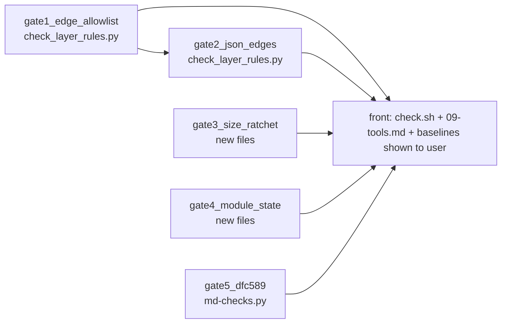

# 段 3 門の提案（規則 05 の 7 の段 2 —— 方針の提案。コードは書いていない）

> 読んだ木: `9cd58868`（枝 `wave-cr378-379`）。すべて `git show` / `git archive` で読み、作業木には触れていない。
> 計画: `docs/development-records/refactor-plan-report-2026-09-13.md` の状態表「段 3 門」、記録 1・3・5 節。出口「新しい検査が、わざと入れた違反で赤になり、今の基準値で緑」。
> ⛔ 本書の数はすべて使い捨てのスクリプト（セッションの scratchpad に置き、`9cd58868` を写した木だけを読んだ）で測った。測り方は各数の横に書く。

---

## 0. 共通の前提（測って分かったこと）

| # | 事実 | 測り方 |
|---|---|---|
| 前提 1 | 検査 19（`tools/check_layer_rules.py`）の被覆はいま `297 of 297` 指定子・68 ファイル | 同ファイルの `read_imports()` を scratchpad から import して呼んだ |
| 前提 2 | ⭐ `EG-1`〜`EG-3`・`EG-8`・`JF-1`・`JF-3`・`JF-4` は、すでに vitest の `tests/unit/cr-378-an-import-is-an-edge-and-json-sits-with-its-owner.test.ts`（`:173-283`）が `src/` を読んで確かめている。`DFC-588` の import 1 本でその `JF-1` の場合が赤くなったことは台帳が記録済み。**`EG-5`（コード ⊆ 図）を確かめるものは、検査にも試験にも 0 件** | 同試験を通読。`grep -n "EG-5\|components.json"` で 0 件 |
| 前提 3 | 検査の基準線は `.claude/skills/spec-graph-check/*-baseline.txt` に置く。1 行目が数、`HELD` の行が 1 件ずつの負債という形、**両向き**の門（新しい違反で赤、消えた負債が残っていても赤）の前例は検査 26b と 43 | `published-members-baseline.txt`・`ruling-landed-baseline.txt` の冒頭 |
| 前提 4 | わざと入れた違反を毎回走らせる前例は検査 55 の `--self-test`（記憶の中で壊して、赤にならなければ赤） | `check.sh:511-514` |
| 前提 5 | `check.sh` の見出しの最大は 55。新しい検査は 56 から取る。頭の注「All 52 mechanical checks」と `docs/development-rules/09-tools.md` の検査表（`:96` 前後、`:209`）は、検査を足す**すべての**体が触る共有の場所 | `grep -o '^section "[0-9][^ ]*' check.sh` |
| 前提 6 | ⛔ 基準線を置く・動かす直しは利用者の了承が要る（memory「Baseline moves need the user's OK」）。**初めて置く基準線の数も、前に立つ者が利用者に見せてから入れる** | —— |

---

## 門 1 —— 辺の許可リスト（コード ⊆ 図）

| 欄 | 中身 |
|---|---|
| 強制する条項 | 表 T-247 の `EG-5`「本表で数えた辺はすべて、`_source/components.json` の `edges` に、同じ `source` と `target` の組として在ること（MUST）。`edges` に無い辺をコードに作ってはならない（MUST NOT）」。数え方は `EG-1`〜`EG-4`、殻の辺も省かない根拠は `EG-6` |
| 差し込む所 | `tools/check_layer_rules.py` の `main()`。`read_imports()` と `unit_key()` はそのまま使う（計画の記録 5 節「検査 19 の読み取りを使えば、新しい読み取りを作らずに済む」、`CR-378` の P-4 が被覆 100% を確認済み）。LR 系の判定の後に、辺の集合 `(PascalCase(from_component), PascalCase(to_component))` を作り、`components.json` の `edges` と引く。`check.sh` の section 19 は変えない（見出しの文だけ `EG-5` を足す） |
| 読むもの | `src/**/*.ts` の相対指定子（`.ts`・`.json`、型だけも含む）と `docs/spec/_source/components.json` の `nodes`・`edges`。`EG-1` のとおりフォルダ名を PascalCase にし、`nodes` に無い名は違反にする |
| 基準線 | 新しいファイル `.claude/skills/spec-graph-check/component-edges-baseline.txt`。1 行 1 本の `HELD A -> B`（図に無いコードの辺）。両向き（C-3）。⛔ `components.json` にだけ在る辺（図 ⊆ コード）は門にしない（`CR-378` の決定 7。`JDG-47` は片向きしか裁いていない）。数だけは刷る |
| 実測（`9cd58868`） | **コードの辺 124 ／ 図の辺 85 ／ 両方 74 ／ コードにだけ 50（うち `SingleHtmlShell` から 19）／ 図にだけ 11**。測り方: `read_imports()` の結果を `.` で始まる指定子に絞り、`unit_key()` で両端をコンポーネントに畳み、同じコンポーネントの中は捨て、組の集合を `components.json` の `(source, target)` と差を取った。同じ手で `3cf64a4` を測ると 125 / 51 で、`CR-378` 第 1 節の M-2・M-3 と一致した |
| ⚠️ 予測とのずれ | `CR-378` 第 6 節は M-3 を 51 → **49** と予測した。実測は **50**。`ApplyDocumentChange -> ScreenRenderer` と `EditDocument -> ScreenRenderer` は予測どおり消えたが、**`AgentApiEndpoint -> EditDocument` が新しく生まれた** —— `src/adapter/agent-api-endpoint/agent-api-members.ts:22-25` の `import type { InvariantRefusal, InvariantRow } from '../../use-case/edit-document/edit-document'`。`git log -S` で入れたのは `4d00e69a`（`CR-376` / `CR-377` / `DFC-582` の読み手の波）。⇒ **この門があれば、その日に赤だった実例である**。基準線に入れるか、図に足すか、import を外すかは、門を入れる前に前に立つ者が決める（台帳の行にするかも同じ） |
| わざと入れる違反 | ① `--self-test`: 記憶の中で、図に無い辺を 1 本足した import（例 `src/entity/document-model/.../x.ts` が `use-case` の公開エントリを読む）を読ませ、`EG-5` の赤を出すこと。② 記憶の中で `HELD` の 1 行を図に在る辺に書き換え、「消えた負債」の赤を出すこと。③ 今の木と基準線で緑 |
| 体が編集してよいファイル | `tools/check_layer_rules.py`、新しい `component-edges-baseline.txt`。⛔ `check.sh`・`09-tools.md` は前に立つ者がまとめる（C-5） |
| §0.2 の 3 手 | (1) `rulings.md` を「辺」「components.json」「許可リスト」で引いた ⇒ `JDG-47`（辺の定義と「コード ⊆ 図」）と `JDG-71`（無関係）だけ。(2) `impact.py EG-5 EG-6 EG-8` ⇒ 3 行とも要求 0 件・参照 0 箇所（行は浮いているが、段 3 の門が読む先として置いた行である、`CR-378` の 5.1）。(3) 別の道 ⇒ vitest に `EG-5` の場合を足す道も在るが、計画は「検査」と書き、`CR-378` 第 7 節も検査 19 に載せると書く。基準線を持つ門は `check.sh` の形が前例（C-3） |
| 残る問い | **0 件**。⚠️ 判断を 1 つ前に立つ者へ渡す: 上の `AgentApiEndpoint -> EditDocument` の扱い（基準線に入れる／段 8 まで待たず図へ足す／型を殻から渡す）。いずれも `EG-5` の文から外れない |

---

## 門 2 —— `.json` の import を辺に数える（検査 19 の読み飛ばしを外す）

| 欄 | 中身 |
|---|---|
| 強制する条項 | 表 T-247 の `EG-8`「表 T-061 の規則は、本表で数えた辺のすべてに掛かること（MUST） —— `.json` を読む辺も含む」。表 T-248 の `JF-1`「他のコンポーネントのフォルダの `.json` を読んではならない（MUST NOT）」。`JF-3` は `JF-1` が 0 本なら機械で見る残りが無い（名前を介すかは検査 26b の持ち分） |
| 差し込む所 | `tools/check_layer_rules.py` の `main()` の `:150-158`（`if spec.endswith('.json'): ... continue`）。存在の確認は残し、`continue` をやめて `unit_key()` を `.json` にも当てる（いまは `[:-3]` で `.ts` を前提にしているので、拡張子を落とす形に直す）。層の向き（`LR-1` / `LR-4`）と同層の閉路（`LR-3`）を `.json` の辺にも掛け、公開エントリの判定（`LR-2`）の代わりに「別のコンポーネントの `.json`」を `JF-1` の違反にする。末尾の `OK` の文（`:227`）に `EG-8` / `JF-1` を足す |
| 読むもの | 門 1 と同じ |
| 基準線 | **要らない（0）**。違反はいま 0 本なので、基準線のファイルを足さない |
| 実測（`9cd58868`） | **`.json` を読む import 21 本、そのうちコンポーネントをまたぐもの 0 本**（`UseCase` → `Adapter` も 0）。測り方: 門 1 と同じ畳み方で `.json` の指定子だけを数えた。同じ手で `3cf64a4` は 24 本 / またぐもの 4 本（`CR-378` の M-6・M-7 と一致）。⇒ `CR-378` の予測 M-5 2 → 0・M-6 4 → 0 は、`DFC-588` の 1 本を直した後の木で成り立っている |
| わざと入れる違反 | `--self-test`（門 1 と同じ仕掛け）: ① `src/use-case/.../x.ts` が `../../adapter/screen-renderer/display-words.json` を読む ⇒ `LR-1` と `JF-1` の 2 つが赤。② `src/framework/.../x.ts` が `../../adapter/document-codec/exchange-formats.json` を読む ⇒ `JF-1` だけ赤（内向きなので `LR-1` は出ない）。③ 今の木で緑。⭐ `3cf64a4` の木で走らせると 4 本赤になるはず —— 手で 1 回確かめて記録に残す（計画の記録 6「門の試験: 記録に残す」） |
| 体が編集してよいファイル | `tools/check_layer_rules.py` だけ。⛔ **門 1 と同じファイルなので、門 1 と同じ体が続けて行う**（並行にしない） |
| §0.2 の 3 手 | (1) `rulings.md` を「JSON」「辺」で引いた ⇒ `JDG-47`（「型と JSON を含むすべての import を辺とし」）が裁いている。(2) `impact.py JF-1 JF-3` ⇒ `JF-1` は参照 0、`JF-3` は参照 1（`PI-20` の `extensionOfFormat`、`05-07-design.md:440`）。(3) 別の道 ⇒ 前提 2 の vitest がすでに同じ規則を赤にできる。**検査 19 に写すと同じ判定が 2 か所になる**（`R1.3`）。それでも外すべき理由: 検査 19 はいま `.json` を読み飛ばしたまま「`src/ obeys table T-061 … over all 297`」と刷っており、`EG-8` の後ではその文が偽である（`CR-378` の P-3 と同じ指摘）。⇒ **外す**を推す |
| 残る問い | **0 件**。⚠️ 覆してよい判断: 試験と検査で同じ規則を二重に持つこと。二重を避けたいなら、検査 19 は `.json` の辺を「数えて刷る」だけにして門を試験に任せる道もある（その場合、出口の「新しい検査が赤」は 前提 2 の試験の実績で満たしたとみなす） |

---

## 門 3 —— 大きさのラチェット（`JDG-54`）

| 欄 | 中身 |
|---|---|
| 強制する条項 | `rulings.md` の `JDG-54`「問 6: 大きさの上限値は、いまはラチェットだけにして、段 8 の実測を見てから決めてよい」。計画の記録 5 節の段 3「関数の行数と分岐数に、いまの値を基準線として持たせ、**増えたら赤**にする」。⚠️ 仕様の行は無い（計画と裁定だけが持つ。仕様に載せない理由は `JDG-54` が上限値を段 8 まで決めないこと） |
| 差し込む所 | 新しい検査 56。`.claude/skills/spec-graph-check/check-function-size.py`（`check.sh` の他の検査と同じ Python の入口）が、同じフォルダの `function-size.mjs` を `node` で呼び、`rolldown/parseAst` で `src/**/*.ts` を構文解析する（計画の記録 1 節と同じ解析器。`rolldown` 1.2.4 は `package.json` の依存から既に在る）。⚠️ `check.sh` から `node` を呼ぶ検査は初めて（いまの Python の検査で `node` を呼ぶものは 0 本。`subprocess` を使う 3 本は git を呼ぶ） |
| 読むもの | 関数（`FunctionDeclaration`・`FunctionExpression`・`ArrowFunctionExpression`）ごとに、開始行から終了行までの行数と、分岐の数（`if`・三項・`for` 系・`while` 系・`catch`・`case`（test のあるもの）・`&&` `\|\|` `??`）。入れ子の関数の分岐は内側の関数に数える。名前は宣言名、無ければ代入先・プロパティ名、無ければ `(anonymous)` ＋ 開始行 |
| 基準線の形（案） | 新しいファイル `function-size-baseline.txt`。⭐ **2 本立て**にする: ① `HELD <file>::<name> lines=<n> branches=<m>` —— 帯（50 行を超える、または分岐 15 を超える）の関数を 1 行ずつ。**その関数の値が上がったら赤**。② 1 行目に帯を超えた分の総量 `excess-lines=<Σ max(0, 行-50)> excess-branches=<Σ max(0, 分岐-15)>`。**総量が上がったら赤**。⭐ ② が要る理由: 段 4〜6 は関数を割るので、`HELD` の名は消え、新しい名が生まれる。名ごとの門だけでは「新しい名で太った関数」を通し、件数の門（帯を超えた数）では割った瞬間に件数が増えて正しい作業が赤になる。総量は割れば必ず下がる（実測の例: `editTask` 510 行を 170 行 × 3 に割ると、超過は 460 → 360）。`HELD` の名が消えたら、同じコミットでその行を消す（両向き、C-3）。下がったら同じコミットで締める（検査 55 と同じ） |
| 実測（`9cd58868`） | **関数 1,728。500 行を超えるもの 4（`frameLoop` 2,190・`domScreenSurface` 808・`svgFromSchedule` 589・`editTask` 510）。分岐 100 以上 3（`svgFromSchedule` 124・`editTask` 102・`editTaskGroup` 100）。帯（>50 行 または >15 分岐）の関数 75（うち無名 1、`schedule-layout.ts:634`）、同じ `file::name` の重なり 0。超過の総量 `excess-lines=7722`、`excess-branches=897`**。測り方: 上の読み方の Node スクリプトを scratchpad から、依存だけ作業木の `node_modules` を借りて走らせた。行数は空行・コメントを含む（計画の記録 1 の「関数の開始行から終了行まで」に合わせた。計画の 2,173 / 508 / 106 との差は、その後の直しの分）。⚠️ 計画の「全関数 1,679」は、数えた関数の種類が違うらしく一致しない（本測りは入れ子の矢印関数も数える）。**帯を変えたときの曲線**: 行の帯 30 / 50 / 100 で帯を超える関数 141 / 64 / 27、超過の総量 9,576 / 7,722 / 5,763。分岐の帯 10 / 15 / 20 で 76 / 44 / 32、総量 1,190 / 897 / 716 |
| 帯の選び方 | 50 行は計画の記録 1 節が使った区切り（「全関数のうち 50 行以下」）。分岐 15 は前例が無い **判断**（帯を超える関数が 44 で、行の帯の 64 と同じ桁になるように選んだ）。⭐ 帯は上限値ではない —— 帯より大きい関数を禁じず、増えることだけを禁じる（`JDG-54`）。検査 45 が床の値を曲線とともに docstring に書いた形に倣う |
| わざと入れる違反 | `--self-test`: ① 記憶の中で `editTask` の本体に分岐を 1 つ足す ⇒ `HELD` の赤。② 記憶の中で帯を超える新しい関数（60 行）を足す ⇒ 総量の赤。③ 記憶の中で `editTask` を 170 行 × 3 に割り、`HELD` の行を消す ⇒ 緑（割る作業を止めないことの確認）。④ 今の木で緑 |
| 体が編集してよいファイル | 新しい `check-function-size.py`・`function-size.mjs`・`function-size-baseline.txt` の 3 つだけ |
| §0.2 の 3 手 | (1) `rulings.md` を「ラチェット」「上限」「基準線」で引いた ⇒ `JDG-54`（大きさ）、`JDG-59`（台帳の行の長さのラチェット）、`JDG-62`（試験のコメント密度のラチェット。「減ったら同じコミットで基準線を締める」）。帯・総量を裁いた行は 0。(2) `impact.py` ⇒ 仕様の行が無いので引けない（大きさは仕様の外）。隣の判断として検査 55（`comment-rules-baseline.txt`、減らしたら締める）と検査 45（床を曲線で決めた）が同じ形を既に取っている。(3) 別の道 ⇒ 名ごとだけ／件数だけの門は、上に書いたとおり段 4〜6 の割る作業を誤って赤にするか、太らせる改名を通す |
| 残る問い | **0 件**。⚠️ 覆してよい判断 2 つ: 分岐の帯 15、総量の門を足したこと。⚠️ 前に立つ者への確認 1 つ: `check.sh` に `node` を入れてよいか（`guard:commit` は `npm run test` で既に node を要するので、新しい前提は増えない、と読んだ） |

---

## 門 4 —— 内側の層のモジュールスコープの可変状態

| 欄 | 中身 |
|---|---|
| 強制する条項 | 表 T-249 の `SF-7`「現在値はシェルが 1 つだけ持ち、参照を差し替えて進める。内側の 3 層のモジュールスコープに可変状態を置かない」。5.3 の散文「表 T-060 の `LY-5` の帰結であり、**内側の 3 層には漏らせる可変状態がそもそも無い。**」（`05-07-design.md:270`）。行き先は `CR-379` の決定 7（`deliveringNotices`・`REGISTRATIONS` をセッションの通知・Agent API の領域へ移し、引数で運ぶ） |
| 範囲の読み | 計画の状態表は「UseCase のモジュール状態」と書くが、`SF-7` と 5.3 は **内側の 3 層（`Entity`・`UseCase`・`Adapter`）** と書く ⇒ 門は 3 層を読む。いまの数はどちらで数えても同じ（下） |
| 差し込む所 | 新しい検査 57。`.claude/skills/spec-graph-check/check-module-state.py`（`src/entity`・`src/use-case`・`src/adapter` の `.ts` を読む） |
| 読むもの | 字下げ 0 の ① `let` / `var`（`export` 付きを含む）、② `const X = new Map/Set/WeakMap/WeakSet(...)`・`const X = [` ・`const X = {` のうち、同じファイルで `X.set/add/delete/clear/push/pop/shift/unshift/splice(` か `X[...] =` / `X.p =` で書き換えるもの。`ReadonlyMap` などで宣言し書き換え 0 のもの（`CR-379` 第 1 節の `ROUTES`）は数えない。⚠️ 字句で読むので、別名を介した書き換えと、他のファイルからの書き換えは見えない —— 見えないことを毎回刷る（検査 19 の被覆の行と同じ理由） |
| 基準線 | 新しいファイル `module-state-baseline.txt`。`HELD <file>:<name>` の 1 行ずつ、両向き（C-3）。段 7 の通知・Agent API の領域が移したら、同じコミットで行を消す |
| 実測（`9cd58868`） | **2 件**: `src/use-case/apply-document-change/apply-document-change.ts:69` の `let deliveringNotices`（書き換え `:85`・`:89`）、`src/use-case/notify-change-watchers/notify-change-watchers.ts:37` の `const REGISTRATIONS = new Map`（書き換え `:43` `set`・`:49` `delete` ほか、計 3）。`Entity` と `Adapter` は 0。測り方: 上の ①② を正規表現で 3 層に当てた。計画の記録 1（2）・`CR-379` 第 1 節（2）と一致 |
| わざと入れる違反 | `--self-test`: ① 記憶の中で `src/entity/.../x.ts` に `let cache = 0` ⇒ 赤。② `const seen = new Set<string>()` と `seen.add(id)` ⇒ 赤。③ `const ROUTES: ReadonlyMap<...> = new Map(...)` で書き換え無し ⇒ 緑。④ 今の木と基準線で緑 |
| 体が編集してよいファイル | 新しい `check-module-state.py`・`module-state-baseline.txt` の 2 つだけ |
| §0.2 の 3 手 | (1) `rulings.md` を「モジュール」「`deliveringNotices`」「`REGISTRATIONS`」で引いた ⇒ 0 件（`JDG-59` / `JDG-60` が `SF-7` の出どころ）。(2) `impact.py SF-7 LY-5` ⇒ `SF-7` は参照 0、`LY-5` は要求 1（`FR-102`）・参照 13。`LY-5` の「現在値を保持するのはこの層だけである」が同じ判断を既に下している。(3) 別の道 ⇒ AST（門 3 の `parseAst`）で読む道も在るが、門 3 とファイルを共有すると並行にできない。字句で足りる（いまの 2 件はどちらも字下げ 0 の 1 行宣言） |
| 残る問い | **0 件**。⚠️ 台帳: `CR-379` 第 6 節が「台帳に行が無い（`REGISTRATIONS` は 0 件、`deliveringNotices` は `DFC-562` の症状としてだけ）」と書いた。基準線の `HELD` の 2 行が指す台帳の行を、門を入れる前に台帳の体が立てるかは前に立つ者の判断（2026-09-13 の裁定「仕様とコードの食い違いは台帳へ」） |

---

## 門 5 —— `DFC-589`（1 つの表の中の行 ID の重複）は段 3 に入れるか

| 欄 | 中身 |
|---|---|
| 強制する規則 | `docs/development-rules/08-spec-template/spec-writing-rules.md` 1.9 節「表の第 1 列は行 ID とする（MUST）。テストが落ちたときに、行 ID がそのまま仕様の 1 行を指せるようにするためである」（台帳 `DFC-589` の決定仕様の欄の引用）。`md-checks.py` の docstring が検査 6 を「duplicate definition」と名乗る |
| 差し込む所 | `.claude/skills/spec-graph-check/md-checks.py` の検査 6（`:144-148`）。いまは `where = {o[0] for o in owners}` の `len(where) > 1`（表の**集合**）で比べるので、同じ表の中の 2 度目を見ない。`owners` の数で比べ、同じ表の中の重複も報告する形に広げる |
| 読むもの | `specindex.discover()` が見つける仕様の `.md`（いまと同じ） |
| 基準線 | **要らない（0）** |
| 実測（`9cd58868`） | **同じ表の中で 2 度定義された行 ID 0 件、表をまたぐもの 0 件（表 149、行 ID 1,931）**。測り方: `md-checks.py` の parse の節（検査 5 の見出しの前まで）を scratchpad から実行し、`row_owner` を表ごとに `Counter` で数えた |
| わざと入れる違反 | 台帳が既に 1 回実測した形（表 T-249 の `SF-3` を `SF-2` に書き換える）を、記憶の中の写しで再生する ⇒ 検査 6 が赤。今の木で緑 |
| 体が編集してよいファイル | `md-checks.py` だけ |
| 段 3 に入れるか | ⭐ **推し: 段 3 の門には数えず、段 3 と同じ波で並行の体に出す**。理由: ① 段 3 の 4 つの門は `src/` を読み、`DFC-589` は `docs/spec` を読む —— 状態表の段 3 の中身（辺・JSON・大きさ・モジュール状態）にも、段 4〜6 の入口にも関係しない。② `DFC-589` は台帳の `実装待ち` の行としてすでに独立して立っており、閉じる条件は台帳の行が持つ。③ それでも同じ波に載せる価値がある: 出口の形（わざと入れた違反で赤、今の値で緑）が同じで、触るファイルが他の 4 つと重ならず、基準線も要らない |
| §0.2 の 3 手 | 台帳 `DFC-589` の行が 2026-09-14 に打ち済み（「一意」「重複」の裁定 0 件、行 ID の一意を言う条項は 1.9 の理由だけ、検査 6 の実体は表をまたぐ重複に限る）。本書は重ねて打たず、(1) の `rulings.md` の「重複」「一意」だけを引き直した ⇒ `JDG-04`・`JDG-34`・`JDG-64`（どれも予定と実績の重なり）で、行 ID の裁定は 0 |
| 残る問い | **0 件** |

---

## 依存と並行

| 体 | 門 | 触るファイル | 並行 |
|---|---|---|---|
| 体 A | 1 → 2（続けて） | `tools/check_layer_rules.py`、`component-edges-baseline.txt` | B・C・D と並行してよい |
| 体 B | 3 | `check-function-size.py`、`function-size.mjs`、`function-size-baseline.txt` | 並行してよい |
| 体 C | 4 | `check-module-state.py`、`module-state-baseline.txt` | 並行してよい |
| 体 D | 5 | `md-checks.py` | 並行してよい |
| 前に立つ者 | 結線 | `check.sh`（section 56・57、section 19 の見出し、頭の検査数 52 → 54、索引の注）、`docs/development-rules/09-tools.md`（検査 19 の行の改稿、56・57 の行、`:209` の束の文） | 4 体が戻ってから 1 回で |

- ⛔ 門 1 と門 2 は同じファイルなので同じ体に渡す（規則 05 の 3「並行の単位はファイル」）。
- 門 3 と門 4 は構文解析器を共有しない形にしたので、ファイルが重ならない。
- ⛔ 4 体とも `check.sh` と `09-tools.md` を触らせない（C-5）。触らせると頭の検査数と索引の文で必ず衝突する。

## 作業の順

1. **前に立つ者が決める（波を出す前）**: 門 1 の `AgentApiEndpoint -> EditDocument`（基準線に入れるか、図か、コードか）と、門 4 の台帳の 2 行を立てるか。⛔ 決めた内容を commit してから、その sha を `baseCommit` として渡す（規則 05 の 7「波を出す前に commit する」）。
2. **利用者に見せる**: 新しい基準線 3 つの初期値 —— 辺 50 本（または 49）、大きさ `HELD` 75 行 ＋ `excess-lines=7722` / `excess-branches=897`、モジュール状態 2 行（C-6）。
3. **体 A〜D を並行に出す**。ブリーフに「このブリーフの誤りを 1 つ挙げよ」「`--self-test` の赤を 1 つずつ実測して報告せよ」「`check.sh` と `09-tools.md` は触るな」「commit と push は前に立つ者が行う」を書く。
4. **戻ったら前に立つ者が結線し**、`bash .claude/skills/spec-graph-check/check.sh` を全部走らせて緑を確かめる。門 2 は、`3cf64a4` の木で 4 本赤になることも 1 回確かめて記録に残す（計画の記録 6「門の試験」）。
5. **出口の判定**: 5 つの `--self-test` が赤を出し、今の木で `ALL GREEN`。状態表の段 3 を ✅ にし、記録に基準線の値と測り方を書く。⚠️ 検査 39 の +7（`EG-5`・`EG-6` など）は、Python の門が入っても下がらない（検査 39 は `tests/` の逐語だけを数える）。⛔ 下げるための試験を書かない（検査 39 の docstring）。
