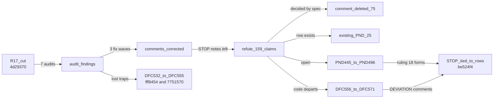
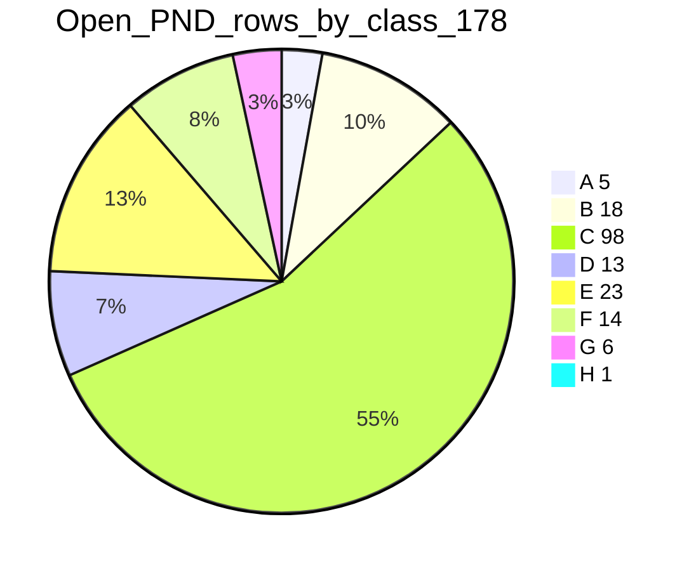
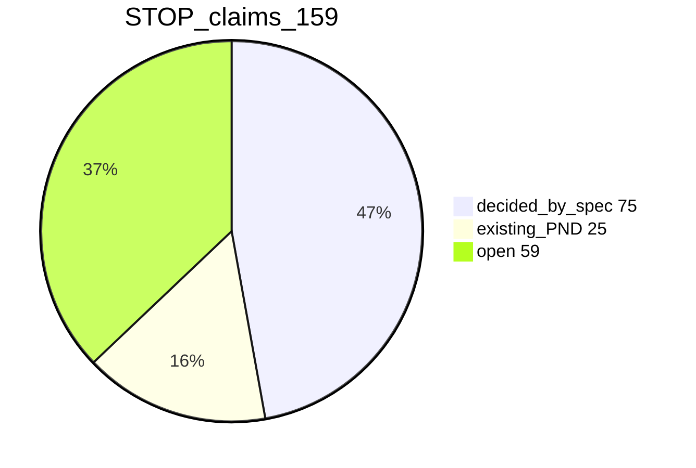
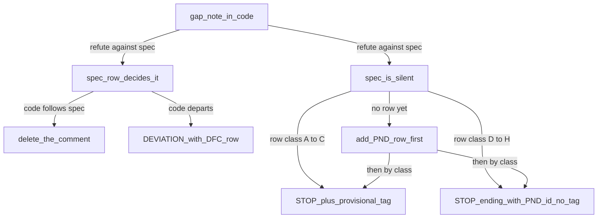

# src/ コメント整理（裁定 17・18）の状況報告 —— 2026-09-13 時点

**本書は、`src/` のコメント整理を 2026-09-13 に終えた時点の状況の写しである。**
⭐ 数にはすべて、測り方を並べて書く。⚠️ 測っていないものは「未測定」と書く。
⛔ 何を変えたかの細部は `git log` / `git show` が答える。本書はそれを繰り返さない。

---

## 1. 現在地

- **`src/` のコメント整理は終わった。** 4 つのコミットを、ブランチ `restart` へ push した。
- **手元とリモートは `be524f4` で一致している。作業ツリーに変更は無い。**
  測り方: `git rev-parse --short HEAD` と `git rev-parse --short origin/restart`、`git status --porcelain` の行数（0）。
- **動いているエージェントは無い。**
- **次の一手（未着手）:**
  - マジックナンバー（別セッション。`docs/development-records/magic-numbers.md`）
  - `tests/` のコメント整理
  - DFC-532〜571 をコードで守る修正
  - 変更要求（S-99g / S-99h の文言、表 T-016 に `HighlightBox` の行）

**作業の流れ:**

コメントを削ったあと、監査で見つかった誤りを直し、コメントに収まらない罠を欠陥台帳へ移した。最後に、削り残った「仕様が決めていない」というメモ（STOP）を 1 件ずつ仕様と突き合わせて、台帳の行と結んだ。

---

## 2. メトリクス

### 2.1 コメント

**測り方:** `python .claude/skills/spec-graph-check/check-comment-rules.py`（検査 55）の出力。

| 指標 | 値 |
|---|---|
| コード行 | 22,729 |
| コメント行 | 1,748 |
| コメント密度（木全体） | **7.1%**（上限 10%、許容量 2,525 行） |
| コード 100 行以上のファイルで 10% を超えるもの | **0 ／ 38** |
| 対象ファイル | 68 |
| ASCII 外のコメント | 0 |
| 許されない形のコメント | 0 |
| 検査 55 の基準値 | 0（赤にならない） |

**密度の定義:**

$$
\mathrm{density} = \frac{\mathrm{comment\ lines}}{\mathrm{code\ lines} + \mathrm{comment\ lines}}
$$

いまの値は $1748 / (22729 + 1748) \approx 0.071$ である。`@purity` だけの行は数えない。行末コメントは 1 行と数える。生成範囲は、コードにもコメントにも数えない（裁定 17）。

**カットで消えた量:**

測り方: `git show --shortstat --format= 4d29370 -- src`

| 範囲 | 変わったファイル | 追加 | 削除 |
|---|---|---|---|
| `4d29370` の `src/` | 68 | 2,683 | 22,970 |
| `be524f4` の `src/` | 32 | 125 | 77 |

⚠️ **カット直前のコメント行数そのものは、本書では測り直していない。**

### 2.2 コードが変わっていないこと

- **測り方:** 変更したファイルごとに、`git show HEAD:<file>` と作業ツリーを字句で比べた。
  - 比べるとき、文字列・テンプレート・正規表現の中身はバイト単位のまま残し、コメントと空白だけを除いた。
- **結果:**
  - `4d29370`: 68 ／ 68 ファイルでコードが同一。
  - `be524f4`: 32 ／ 32 ファイルでコードが同一。
  - 変更したファイルに CR バイトは 0。
- ⛔ **トランスパイルした結果を比べるやり方は、文字列のエスケープの違いを見落とす**（`'…'` と `'…'` が同じに見える）。だから字句で比べた。

### 2.3 試験と検査

| 項目 | 値 | 測り方 |
|---|---|---|
| `npx tsc --noEmit -p .` | エラー 0 | 終了コード |
| vitest のファイル | 202 本中、失敗 22 本、成功 180 本 | `npx vitest run --reporter=dot` |
| vitest の件 | 7,480 件中、失敗 47 件、成功 7,432 件、スキップ 1 件 | 同上 |
| 新しい失敗 | **0** | 整理前の失敗の集合と、件名で集合差を取った |
| check.sh | **全緑**（52 の検査） | コミット直前の作業ツリーで実行 |
| 仕様 ID の参照違反（検査 44） | 108 件（廃止 96、未定義 12）。基準値を 112 から 108 へ下げた | `check-spec-id-references.py` |
| 裁定済の PND を名指す未裁定の欠陥行（検査 40） | 3 件（基準値のまま） | `check-ruled-elsewhere.py` |

**失敗している 47 件の内訳（整理前からあるもの）:**

| 試験ファイル | 件数 |
|---|---|
| `tests/contract/t-233-reason-words-tell-the-row.contract.test.ts` | 8 |
| `tests/unit/fr-001-fr-083-the-toggle-and-the-drag.test.ts` | 6 |
| `tests/unit/dfc-355-the-four-rulings-of-2026-09-07.test.ts` | 6 |
| `tests/unit/t-023d-the-plan-start-is-the-boundary.test.ts` | 5 |
| `tests/unit/dfc-377-fr-016-zoom-ceilings-and-ep-9-thickness.test.ts` | 3 |
| `tests/unit/t-024a-op-10-a-chosen-zoom-is-the-place.test.ts` | 2 |
| `tests/unit/in-2-pointer-shape.test.ts` | 2 |
| 以下の 15 本（各 1 件） | 15 |

各 1 件の 15 本は次のとおり:
- `uf-8-9-history-depth`
- `uf-72-screen-part`
- `t-051-hf-6-ground-under-the-row-controls`
- `t-051-hf-17-adding-a-row-walks-the-rename-road`
- `t-023d-the-hit-box-starts-at-the-day`
- `fr-098-the-band-does-not-scroll`
- `fr-098-t-233-the-overflowing-band-tells-nobody`
- `fr-066-the-dialogue-field-keeps-its-own-value`
- `fr-053-minimised-shows-the-band-alone`
- `fr-043-dummy-drawn`
- `fr-036-help-item-order-and-size`
- `fr-031-a-write-that-moved-nothing-leaves-no-step`
- `fr-021-the-outline-base-of-the-file-comes-back`
- `edit-task`
- `dfc-152-in-6-the-same-value-writes-nothing`

いずれも `tests/unit/` の下の `.test.ts` である。⚠️ **これらが落ちる原因は、本書では調べていない。**

### 2.4 台帳

**裁定待ちの一覧（`pending-decisions.md`）** —— 測り方: 行の分類欄と状態欄を数えた。検査 25 の出力とも一致する。

| 指標 | 値 |
|---|---|
| 行の総数 | 265 |
| 未裁定 | 178 |
| 裁定済 | 87 |
| 今回足した行 | PND-445〜496 の 52 行 |

**未裁定の行の分類:**

A〜C は、推奨値で実装し印を付けて先へ進んでよい分類である。D〜H は、裁定が出るまで実装してはならない分類である（規則 06）。未裁定の D〜H は合わせて 57 行ある。

**今回足した PND-445〜496 の分類:**

| 分類 | A | B | C | D | E | F | G |
|---|---|---|---|---|---|---|---|
| 行数 | 1 | 2 | 26 | 10 | 3 | 7 | 3 |

**欠陥台帳（`defects.md` ＋ `fixed-defects.md`）** —— 測り方: `defects.md` の集計表（`tools/ledger_metrics.py --check` が一致を確かめる）。

| 指標 | セッション開始時 2026-09-10 | 最新 2026-09-13 | 差分 |
|---|---|---|---|
| 総件数 | 421 | 559 | +138 |
| 残件 | 5 | 91 | +86 |
| 裁定待ち | 1 | 5 | +4 |
| 仕様待ち | 2 | 26 | +24 |
| 実装待ち | 0 | 38 | +38 |
| 試験待ち | 0 | 22 | +22 |
| 実測待ち | 2 | 0 | -2 |
| 実測済 | 370 | 421 | +51 |
| 取下げ | 46 | 47 | +1 |

⚠️ この差分には、今回のコメント整理より前の作業の分も含まれる。**今回の整理で足した欠陥行は、DFC-532〜571 の 40 行である。**

### 2.5 マジックナンバー（別の作業表）

- **`docs/development-records/magic-numbers.md`:** 25 ファイルにある数値リテラル 436 件を記録している。
  - 測ったのは `768501a` の時点で、本書では測り直していない。
- **種類別の件数:**

  | 種類 | 件数 |
  |---|---|
  | 比率 | 183 |
  | 半分・倍 | 82 |
  | 単位換算 | 34 |
  | 文字列長 | 21 |
  | 基数 | 6 |
  | 添字 | 14 |
  | その他 | 96 |

- **裁定（2026-09-13）:**
  - 基数は名前付きの定数にする。定数名は、作業するセッションで利用者が裁定する。
  - 文字列長は `.length` で計算する。

---

## 3. 状態表

| 工程 | 状態 | 結果 | コミット |
|---|---|---|---|
| 裁定 17 でコメントを削る | ✅ | 68 ファイル。検査 55 を新設 | `4d29370` |
| 生成器を ASCII のコメントにする | ✅ | 型と検証器の生成器が、非 ASCII のコメントを出さず、出そうとすれば止まる | `4d29370` |
| カット後の監査 7 本 | ✅ | 失われた罠、誤った `see` 行、偽のコメントを見つけた | —— |
| 監査の指摘を直す（3 波とフロント） | ✅ | 第 1 波 17 件 ／ 9 ファイル、第 2 波 6 件 ／ 2 ファイル、第 3 波 11 件 ／ 1 ファイル、フロント 1 件 | `4d29370` |
| 罠を欠陥台帳へ（1 回目） | ✅ | DFC-532〜550 の 19 行に罠 66 件。偽の罠 7 件は載せなかった | `fff8454` |
| 罠を欠陥台帳へ（2 回目） | ✅ | DFC-551〜555 の 5 行を足し、4 行に追記 | `7751570` |
| STOP の申し立ての反証（3 束） | ✅ | 159 件 | —— |
| 裁定 18 と検査 55 の改修 | ✅ | STOP の形を、行の分類で分けた | `be524f4` |
| PND の行を起こし、コメントを結ぶ | ✅ | PND-445〜496、DFC-556〜571、`src/` 32 ファイル | `be524f4` |
| 食い違う PND 7 行の裁定を台帳へ | ✅ | PND-337 / 345 / 353 / 156 を裁定済にした。339 は分割、181 と 435 は文を直した | `be524f4` |
| マジックナンバー | ⬜ | 別セッション | —— |
| `tests/` のコメント整理 | ⬜ | 利用者の指示で後回し | —— |
| DFC-532〜571 のコード修正 | ⬜ | 後でまとめて直す（利用者の裁定） | —— |
| 変更要求（S-99g / S-99h、表 T-016） | ⬜ | 未起票 | —— |

### 3.1 STOP の申し立ての反証

**測り方:** 読むだけのエージェント 3 体が、ファイルの束ごとに、申し立てを `docs/spec` の行と突き合わせた。⛔ `docs/spec/output/` は古い生成物なので読ませていない。

| 束 | 対象 | 件数 | 仕様が決めていた | 既存の PND | 未決 |
|---|---|---|---|---|---|
| A | シェル・通知・コーデックなど | 60 | 35 | 11 | 14 |
| B | 描画・画面の面・配置エンジン | 55 | 19 | 8 | 28 |
| C | 入力の翻訳・ユースケース | 44 | 21 | 6 | 17 |
| 計 | —— | **159** | **75** | **25** | **59** |

**反証の結果:**

**半分近く（75 件）が偽だった。** 仕様の行が既に決めていることを「決めていない」と書いていた。未決 59 件は、束をまたいで重複を 1 行にまとめ、PND-445〜495 の 51 行にした。7 行の裁定から PND-496 が 1 行増え、合わせて 52 行である。

### 3.2 コメントの形を決める規則（裁定 18）

- **仕様が決めている点:**
  - コードが従っていればコメントを消す。
  - 外れていれば、DFC の行を起こし、`// DEVIATION: ... (DFC-n)` と書く。
- **仕様が黙っている点:** 台帳の行の分類で書き分ける。
  - A〜C の行: `// @provisional PND-n` の印を付ける。
  - D〜H の行: 規則 06 が実装を禁じるので、印を付けず、末尾に `(PND-n)` とだけ書く。その行の「推奨と根拠」に、コードが既に何を選んでいるかを書く。
- **検査 55 の見方:** 印の先の行の分類を読み、どちらの形でもない STOP を赤にする。

---

## 4. 記録

### 4.1 利用者の裁定（本セッション）

| 日付 | 裁定 | 置き場 |
|---|---|---|
| 2026-09-13 | **裁定 16**: WHY は結論と指し先だけ残す。検討の経緯は書かない | `docs/review/cleanup-2026-09-11-prompt.md` |
| 2026-09-13 | **PND-340** を裁定済にする | `pending-decisions.md`（`768501a`） |
| 2026-09-13 | **裁定 17**（下に詳細） | `docs/review/comment-rules-src.md` |
| 2026-09-13 | **マジックナンバー**は別の作業表で扱う。基数は名前付きの定数にし、文字列長は `.length` で計算する | `magic-numbers.md` |
| 2026-09-13 | **予算に収まらない罠**は、コメントではなくコードで守る。`defects.md` に残し、後でまとめて直す | `comment-rules-src.md` の 5 節 |
| 2026-09-13 | **生成範囲の日本語 5 行**は、生成器のテンプレートの文だった。SSOT は変えず、生成器を直す | `tools/generate_entity_types.py` ほか |
| 2026-09-13 | **STOP で行が無いもの**は、反証してから行を起こす | 本書 3.1 |
| 2026-09-13 | **裁定 18**: D〜H の穴は、行を起こし、印の無い STOP にする | `comment-rules-src.md` の 3 節 |
| 2026-09-13 | **PointerShape**: 誤った PND-337 の印を外す（穴ではない。IN-2 が形の綴りを閲覧環境に委ねている）。依存線を引く準備中にカーソルの形が変わらない点は DFC-556 にする | `defects.md` |
| 2026-09-13 | **PND-337**: 現状を肯定する。仕様とコードの食い違いは、どちらが誤りかを決めずに `defects.md` に書き、誤っている方を後で直す | DFC-570 |
| 2026-09-13 | **PND-345**: DC-7 で裁定済にする。**PND-353**: HF-6 で裁定済にする。**PND-156**: IF-9 で裁定済にし、外れを DFC-571 にする | `pending-decisions.md` |
| 2026-09-13 | **PND-339**: 2 行に分ける（新しい行 PND-496）。**PND-181**: 問いを S-99c に絞る。**PND-435**: 文を直し、表 T-016 は変更要求を待つ | `pending-decisions.md` |
| 2026-09-13 | **`tests/` の整理はまだ行わない** | —— |

**裁定 17 の中身:**
- **文字:** コメントは ASCII の印字可能文字（0x20〜0x7E）だけ。日本語と絵文字は使わない。
- **密度:** 木全体で 10% 以下。コード 100 行以上のファイルは、ファイルごとにも 10% 以下。
- **仕様 ID:** 関数・クラス・型を定義する場所に `// see FR-013` の形で書く。
- **許される形:**
  - `TRAP` と `WHY`（各 2 行まで）
  - `STOP`（3 行まで）
  - `DEVIATION`（2 行まで、DFC-n を名指す）
  - 1 行の `@purity`
  - ファイルの見出し
  - 生成範囲の出所

### 4.2 今回足した欠陥行

| 範囲 | 行数 | 中身 |
|---|---|---|
| DFC-532〜550 | 19 | 削った罠をまとめた。任意の入力項目が抜けても黙って別の答えになる、呼び出し順を型が守っていない、同じ規則を 2 か所に書いている、試験の無い規則、ばらの数値、ただの文字列で持つ識別子など。DFC-550 だけは裁定待ち（PND-187） |
| DFC-551〜555 | 5 | 監査が見つけた罠（FrameLoop の順序と既定値など）と、コードで確かめた欠陥 3 件 |
| DFC-556〜569 | 14 | 仕様は決めているのに、コードが外れている点。DFC-566 と 569 は裁定待ち |
| DFC-570〜571 | 2 | IN-4 と `escapeTarget` の順、IF-9 と `readDialogueInput` の食い違い。どちらが誤りかは未決（裁定待ち） |

**コードで確かめた欠陥 3 件:**

| 欠陥 | 行 | 確かめ方 |
|---|---|---|
| GR-17 のダミーを自分の日か左で放すと、`actualDuration` が 0 か負になる | DFC-554 | コードを読んだ。FR-011 は S-129（1）を下回ってはならないと定める。⚠️ 出荷物では未実測 |
| `FILE_STATUS_TEXT_SCALE` と取り込み日の上下限が、設定値を読まず手で写してある | DFC-553 | コードを読んだ。`magic-numbers.md` とも照合した |
| まとめた NT-4 の通知で OK を押しても、何も消えない | DFC-555 | コードを読んだ。⚠️ いまは NT-4 を使う理由が無いので、まとめが起きない（潜在） |

**DFC-556〜569 で、コードが外れていると確かめた点:**
- 依存線を引く準備中に、描画カーソルにならない（IN-2）
- MSPDI の通知と障害を捨てている
- 利用者自身の発話が投稿されない
- SHA-256 が無いことを RS-41 として告げる
- 書き手の名前が `''` と `'agent'` になっている
- 起動時に、読めない列があると U-61 の問いではなく通知を出す
- 発話を配っている間の書き込みを拒まない
- MSPDI の持ち回り要素の順が、書き出しで変わる
- 編集していない Task の `ID` と階層の列を作り直す
- lag 以外の依存の欄を編集可として出す
- ホストの色選択を出す
- ヘッダーと名簿の入口を、薄く描かない
- GR-14 の幅変更が無い
- ドロップしたファイルを開かない

### 4.3 踏んだ罠と教訓

- **検証の方法**
  - ⛔ **トランスパイルした結果を比べても、文字列のエスケープの違いが見えない。** 字句で比べる検査器を書き直した。
  - ⛔ **`grep -c $'\r'` の数は、LF のファイルでも CRLF に見える。** CR のバイトは Python で数える。
- **ヘッダーと試験**
  - ⛔ **ヘッダーの `@unit` と `@purity` の空白の数を、試験が読んでいる。** カット後に `units.contract.test.ts` が 10 件落ちたので、HEAD からヘッダーの行を戻した。
- **生成器**
  - ⛔ **生成器を直しただけで生成し直さないと、検査 20 と 27 が赤になる。** `npm run types` と `npm run validator` を回した。
- **反証**
  - ⛔ **「仕様が決めていない」というメモは、半分近くが偽だった**（159 件中 75 件）。書く前に仕様の行を引く。
- **台帳の検査**
  - ⛔ **検査 40 は、欠陥行の中にあるすべての `PND-n` を名指しと読む。** 閉じた PND を名指す行が裁定待ちだと赤になる。
    - 「どちらが誤りか」を待つ欠陥行は、閉じた PND の番号を書かない。PND の行の側から欠陥行を指す。
  - ⛔ **D〜H の行に `@provisional` を付けると、検査 25 が赤になる。** それなのに、コードは既に選んでいた。これを裁定 18 で解いた。
- **並列の作業**
  - ⛔ **並列の作業中に、エージェントの 1 体が `git stash` を使った。** 他の 3 体が同じ作業ツリーに書いていた。
    - 戻したあと、作業ツリーが無事であることを確かめた。書き込みが重なっていれば、失われても何も赤くならなかった。
    - 以後の指示では、stash・checkout・restore を禁じる。
  - ⚠️ **stash の一覧に残る 2026-09-12 の `wrap-conservative`（仕様書 3 ファイル）は、利用者の作業の可能性がある。** 触っていない。
- **道具**
  - ⚠️ **`tools/ledger_metrics.py` は `--help` を無視して、集計表を書き換える。**

### 4.4 未確認のもの・後で見るもの

- **推奨とコードの食い違い**
  - **PND-496**: 推奨は「設定を出す」だが、コードは選択の表示に切り替える。行にそう明記した。
  - **PND-481**（分類 A）: 印の場所に、推奨値がまだ実装されていない（DFC-568）。
- **未決の問い**
  - **DFC-564**: MSPDI の `ID` を振り直すことが EX-2 の「値を書き換える」に当たるか、決まっていない。
  - **DFC-563**: 直すと、持ち回りの保存形が変わる見込み。分類 D の裁定が先に要る。
  - **DFC-556**: PTD-4a は、依存線を引く準備中に空いた所を押しても何もしない、と定める。描画カーソルと釣り合うかを行に書いた。
- **確かめていないもの**
  - **マイルストーンの実績:** 占有の計算に入っていない疑い（反証の B52）。確かめておらず、行も無い。
  - **DFC-541 ①:** 生きている不具合かもしれないが、出荷物では確かめていない。
- **`tests/` に残る古い記述**
  - `in-4-escape-closes-the-panel` と `fr-072-a-moved-selection-does-not-open-the-panel`（`tests/unit/`）が、廃止された入口の並び「MK-13 と IC-17」を引用している。台帳の行は無い。
  - `fr-029-en-2-a-palette-toggle-that-is-on` の 57〜58 行が、古い DC-7 で書かれている。
- **PND-144** の STOP は、FR-072 が見出しを禁じる前の前提に立っている。

---

## 5. 再開するとき

1. `git status` と `bash .claude/skills/spec-graph-check/check.sh` を回し、本書の数と実物が合っているか確かめる。⚠️ 合わなければ実物が正しい。
2. マジックナンバーに進むなら、`docs/development-records/magic-numbers.md` の 3 節の裁定を読んでから始める。
3. `tests/` のコメント整理に進むなら、`docs/review/comment-rules-src.md`（裁定 17・18）を `tests/` にどう当てるかを、先に利用者へ問う。
