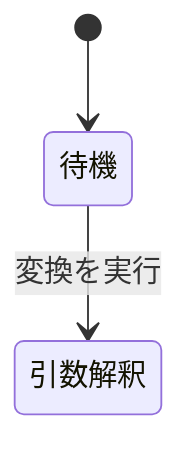

# Markdown 形式の StrictDoc 仕様書 — AI 向け手引き

**UID**: DOC-AI-GUIDE
**Version**: 1.0

本書は、 AI が Markdown 形式の StrictDoc 仕様書を書き、 そこから必要な情報を
取り出すための手引きである。 StrictDoc には `.sdoc` 形式もあるが、 本書は扱わない。

仕様書を書くだけなら本書 1 つで足りる。 ほかの解説文書も、 既存の仕様書も
開かなくてよい。 既にある文法を使う場合も、 文法ごと新しく起こす場合も同じである
(文法ファイルの雛形は「文法ファイル (`.sgra`) の書き方」にそのまま使える形で載せてある)。
**書いたあとの検査には `01-ai-queries.md` が要る。** 本書は検査の名前 (G29 / G33 /
G35 / G37 など) だけを指し、 クエリの本体はあちらが持っているためである。

本書に載っていないエラーに当たったら、 止まらずに 1 行だけ記録して先へ進むこと。
やり方は「本書に無いエラーに当たったとき」にある。**その場で原因を追ってはならない。**

以下の説明は、 実例として `samples/md-basic-ja` を使う。同じ規則がどの
Markdown 形式の StrictDoc プロジェクトにも当てはまる。

この実例の構成。**StrictDoc は `.md` をすべて文書として解析する。**
本書も例外ではなく、 1 個の文書 `DOC-AI-GUIDE` になる。

| ファイル                   | 中身                                                         | 文書の UID                    |
| -------------------------- | ------------------------------------------------------------ | ----------------------------- |
| `00-ai-guide.md`           | 本書                                                         | `DOC-AI-GUIDE` (要求は無い)   |
| `01-ai-queries.md`         | 本書のクエリの詳細版                                         | `DOC-AI-QUERIES` (要求は無い) |
| `02-guide-for-human.md`    | 人間向けの解説書。AI は読まなくてよい                        | `DOC-GUIDE` (要求は無い)      |
| `03-usecases.md`           | ユースケース 1 件 (Cockburn 形式、 海面レベル)。上位要求の親 | `DOC-USECASES`                |
| `04-upper.md`              | 上位要求 3 件                                                | `DOC-UPPER`                   |
| `05-architecture.md`       | システム構成の見取り図。要求は持たない                       | `DOC-ARCH` (要求は無い)       |
| `06-lower.md`              | 下位要求 4 件。上位要求へ繋がる                              | `DOC-LOWER`                   |
| `07-tests.md`              | テストケース 4 件。下位要求へ繋がる                          | `DOC-TESTS`                   |
| `08-review.md`             | レビューの進め方。指摘は要求そのものに書く                   | `DOC-REVIEW` (要求は無い)     |
| `09-browser-guide.md`      | ブラウザ操作の手引き                                         | `DOC-BROWSER` (要求は無い)    |
| `10-cowork-with-claude.md` | AI と組んで書く方法                                          | `DOC-COWORK` (要求は無い)     |
| `_assets/note.md`          | 用語表。リンク先                                             | `DOC-NOTE` (要求は無い)       |
| `_assets/fig-state.md`     | 大きい図 1 つ。リンク先                                      | `DOC-FIG-STATE` (要求は無い)  |
| `basic.sgra`               | 文法定義。ノード型・フィールド・`Role` はここで宣言する      | —                             |
| `strictdoc_config.py`      | プロジェクト設定                                             | —                             |

番号は読む順である。 `00` と `01` が AI 向け、 `02` が人間向け、 `03` から `07` が仕様書本体、 `08` から `10` が進め方と道具の手引きである。
`_assets/` の中は番号を持たない。

`01-ai-queries.md` の A1 は文書を 13 件返す。 上表のうち UID を持つもの全部である。
そのうち 9 件 — `DOC-AI-GUIDE` / `DOC-AI-QUERIES` / `DOC-GUIDE` / `DOC-ARCH` /
`DOC-REVIEW` / `DOC-BROWSER` / `DOC-COWORK` / `DOC-NOTE` / `DOC-FIG-STATE` — は
要求を持たないので、 要求を数えるときは混ざらない。

本書と `01-ai-queries.md` は、 自分自身も StrictDoc の文書である。
だから見出しには全部 `**Type**: SECTION` が付いている。付けないと StrictDoc が
見出しの下の文を要求の本文と見なして停止する (「仕様書を書く」の規則そのままである)。
そして本書の中身も JSON に入る。 図やコードを数えるクエリを当てると本書が混ざるので、
集計するときは「集計するときは解説文書を除くこと」に従うこと。

コマンド例は Git Bash で実行する前提で書いてある。

## 他のプロジェクトで使うときに置き換えるもの

**Type**: SECTION

本書の規則はどの Markdown 形式の StrictDoc プロジェクトにも当てはまる。
一方、 本書に出てくる固有名詞はこの実例のものである。 他のプロジェクトで使うときは
下の表のとおり読み替える。規則そのものは読み替えなくてよい。

| 本書に出る名前                                                                                | 何を表すか              | 相手のプロジェクトでは                               |
| --------------------------------------------------------------------------------------------- | ----------------------- | ---------------------------------------------------- |
| `samples/md-basic-ja`                                                                         | 仕様書のフォルダ        | 相手のフォルダ                                       |
| `basic.sgra`                                                                                  | 文法ファイル            | 名前は自由。 拡張子だけ `.sgra`                      |
| `DOC-UPPER` / `DOC-LOWER` など                                                                | 文書の UID              | 相手が決めている。A1 で調べる                        |
| `SYS-*` / `SW-*` / `TC-*`                                                                     | 要求とテストの UID      | 相手の採番。F24 で調べる                             |
| `DOC-FIG-`                                                                                    | 図の文書の UID の接頭辞 | 自分で決める。 監査クエリに `--arg figprefix` で渡す |
| `DOC-AI-GUIDE` / `DOC-AI-QUERIES` / `DOC-GUIDE` / `DOC-REVIEW` / `DOC-BROWSER` / `DOC-COWORK` | 解説文書の UID          | 相手の解説文書。集計時に `--arg skip` で除く         |
| `04-upper.md` などのファイル名                                                                | 文書のファイル名        | JSON には入らない。 G34 の `grep` で調べる           |
| `_assets`                                                                                     | 添付ファイル置き場      | 固定。変えられない (「添付ファイル」)                |
| `strictdoc-quirks.tsv`                                                                        | 癖の記録                | 同じ名前で作る (「記録の書き方」)                    |

この 2 つだけは自分で決める取り決めであり、 StrictDoc の仕様ではない。

- 図の文書の UID の接頭辞 — 監査クエリが「既に外に出した図」を見分けるために要る
  (「図 — 大きい図は別文書にする」)
- 解説文書をどれと見なすか — 記法を数えるクエリから除くために要る
  (「仕様書から必要な部分だけを取り出す」)

どちらもクエリへ引数で渡す。 クエリ本体を書き換えないこと。

---

## 本書に無いエラーに当たったとき

**Type**: SECTION

本書は strictdoc 0.27.1 で測った内容である。 版が違えば挙動も違う。相手の
プロジェクトが変わった書き方をしていることもある。そのとき本書は必ず外れる。

外れたときにやることは 3 つだけである。

1. 回避して先へ進む。 目的は仕様書を書くことであって、 StrictDoc を直すことではない
2. `strictdoc-quirks.tsv` に 1 行だけ足す
3. 次の作業へ移る

その場で原因を追ってはならない。 深追いすると本来の仕事が終わらない。
溜まった行は後でまとめて読み、 本書を直す材料にする。 1 件ずつ直すのではなく、
版が上がったときや行が溜まったときに一度に片づける。

### 記録の書き方

**Type**: SECTION

仕様書のフォルダの直下に `strictdoc-quirks.tsv` を置く。 タブ区切りで 6 列、
1 件 1 行。**追記だけする。既にある行を書き換えたり消したりしない。**
`.tsv` は StrictDoc が解析しないので、 文書には一切影響しない (実測)。

| 列           | 中身                                                                     |
| ------------ | ------------------------------------------------------------------------ |
| `date`       | `YYYY-MM-DD`                                                             |
| `sd_version` | `strictdoc --version` の出力                                             |
| `step`       | 何をしていたか。`export-html` / `export-json` / `jq` / `server` / `edit` |
| `symptom`    | エラーの 1 行目をそのまま。 長ければ切る                                 |
| `workaround` | どう回避したか。1 行で                                                   |
| `where`      | どのファイルのどこか                                                     |

無ければ見出し行ごと作る。

```bash
printf 'date\tsd_version\tstep\tsymptom\tworkaround\twhere\n' > <仕様書のフォルダ>/strictdoc-quirks.tsv
```

1 行足す。**`>>` で追記すること。`>` は既存の記録を消す。**

```bash
printf '%s\t%s\t%s\t%s\t%s\t%s\n' "$(date +%F)" "0.27.1" "export-html" "error: string index out of range" "put a character after the closing dollar" "06-lower.md" >> <仕様書のフォルダ>/strictdoc-quirks.tsv
```

英語 ASCII で書く。 後で機械にかけるためと、 `symptom` に入るエラーが英語だからである。

### 記録するもの・しないもの

**Type**: SECTION

| 記録する                       | 記録しない                          |
| ------------------------------ | ----------------------------------- |
| 本書に載っていないエラー       | 本書に載っている罠 (`$` の末尾など) |
| 本書の記述と違う挙動           | 自分の打ち間違い                    |
| 版が違うために効かなかった手順 | 一度直せば再発しないもの            |

判断に迷ったら書く。 1 行の値段は安く、 失われた知見は戻らない。

### 溜まった記録の使い方

**Type**: SECTION

まとめて片づけるときだけ読む。 同じ `symptom` が何度も出ていれば、 本書に書くべき罠である。

```bash
cut -f2,4 <仕様書のフォルダ>/strictdoc-quirks.tsv | sort | uniq -c | sort -rn
```

版ごとに並べれば、 どの版で何が変わったかが出る。

```bash
sort -t"$(printf '\t')" -k2,2 -k1,1 <仕様書のフォルダ>/strictdoc-quirks.tsv
```

---

## 仕様書を書く

**Type**: SECTION

下は strictdoc 0.27.1 で parse 確認済みの雛形である。この雛形は
`DOCUMENT` / `TEXT` / `SECTION` / `REQUIREMENT` / カスタムノード型の 5 種のノードを作る。

```markdown
# 文書のタイトル

**Grammar**: basic.sgra
**UID**: DOC-UPPER
**Version**: 1.0

H1 の直下は地の文になる。 UID が無いので要求ではない。

## 章の名前

**Type**: SECTION

章の中の地の文。 `Type` を書かないと、 この段落は要求の本文と見なされる。

## 要求の名前

**UID**: SW-001
**STATUS**: Approved
**REVIEW_STATUS**: NoFinding

**Statement**: 本システムは、 〜すること。

**Rationale**: そう決めた理由。

**Relations**:

- **Type**: `Parent`
  **ID**: `SYS-001`

## テストケースの名前

**Type**: TEST_CASE
**UID**: TC-001
**TEST_RESULT**: NotRun

**GIVEN**: 〜の状態である。

**WHEN**: 〜を実行する。

**THEN**: 〜になっている。

**Relations**:

- **Type**: `Parent`
  **ID**: `SW-001`
  **Role**: `Verifies`
```

**欄の行末に `\` を書いてはならない。** StrictDoc には不要である。得るものが無い一方で、
**この記法が持つ唯一の失敗形がこれに由来する** —— 塊の最終行に残すと export が止まる。
欄を 1 つ削るたびに、 前の行の `\` を落とし忘れる危険が生じる。
(これはノードの欄の話である。 `bash` フェンスの中の行末 `\` は**シェルの行継続**であって
StrictDoc とは無関係である —— 本書の後半のコマンドが使っており、 消すとコマンドが壊れる。)

**行末 2 スペースは代わりにならない。** StrictDoc は欄の値から行末の空白を落とさない
（0.27.1 で実測）。 `**Grammar**: basic.sgra  ` は
`imports a grammar from a file that does not exist` で止まり、 選択肢の欄は
`invalid SingleChoice value` で止まる。 文法が検証しない欄では空白がそのまま値に
入るだけで、 **何も教えてくれない。**

**`**Relations**` は本文欄の後ろに置き、 直後に空行を 1 つ置く。** その空行は整形器が
勝手に入れる。 置かずに配ると、 利用者が開いて保存した瞬間に差分が立つ。
メタデータの塊に密着させて書いた場合は、 その保存が欄名と箇条書きを切り離し、
`duplicate field names in a valid requirement node are not allowed` で export が
止まる —— **行番号はノードの先頭を指し、 空行のことは一言も出ない。**

### 違反すると export 全体が停止する規則

**Type**: SECTION

| 規則                                                             | 違反時のエラーメッセージ                                                                                                                                  |
| ---------------------------------------------------------------- | --------------------------------------------------------------------------------------------------------------------------------------------------------- |
| ファイルの先頭を H1 で始める。1 ファイルに 1 つだけ              | `the document must start with an H1 heading`                                                                                                              |
| 要求ではない章に `**Type**: SECTION` を書く                      | `Semantic error: Node is missing a field that is required by grammar: UID.` (Hint に欄の並びが出る)                                                       |
| 見出しのレベルを飛ばさない。 `#` の次に `###` を置いてはならない | `heading level forward jumps are not allowed: L1 -> L3`                                                                                                   |
| 空行を 2 つ以上続けない (フェンスと引用の中を除く)               | `two or more consecutive empty lines are not allowed outside of code blocks and blockquotes`                                                              |
| フィールド名は文法どおりの綴りで書く                             | `Invalid requirement field`                                                                                                                               |
| `TYPE` という名前のフィールドは `**TYPE**:` と大文字で書く       | `**Type**:` はノード型の指定子として先に抜き取られる                                                                                                      |
| 宣言されていない `Role` を書かない                               | `Semantic error: Requirement relation type/role is not registered: Parent / Verifies`                                                                     |
| 文法を自分で起こすなら `SECTION` を宣言する                      | `Semantic error: Invalid node type: SECTION.`                                                                                                             |
| `SECTION` には `PROPERTIES: IS_COMPOSITE: True` を付ける         | `The SECTION grammar element must be declared as composite.` (Hint に修正例が出る)                                                                        |
| `**Relations**` は本文欄の後ろに置き、 直後に空行を 1 つ置く     | `duplicate field names in a valid requirement node are not allowed` —— ただし整形器が 1 度走った後にしか出ない。export が通ったことは何の証拠にもならない |
| すべてのファイルを UTF-8 で保存する。 BOM は付いていてよい       | `'utf-8' codec can't decode byte 0x82 in position 2: invalid start byte` —— **しかもファイル名を出さない**                                                |
| 水平線 (`---`) を文書のどこにも書かない                          | `duplicate field names in a valid requirement node are not allowed`                                                                                       |
| 親として書く UID は、 プロジェクトのどこかに実在させる           | `Requirement SW-001 references parent requirement which doesn't exist: SYS-999.`                                                                          |

`TEXT` は宣言しなくてよい。組み込みである (実測)。`SECTION` と `REQUIREMENT` だけを
宣言した文法で export したところ、 地の文はちゃんと `TEXT` ノードになった。
宣言が要るのは `SECTION` のほうだけである。

エラーは 2 行で出る。1 行目にファイル名が入る。

```text
error: could not parse file: C:\...\06-lower.md.
Semantic error: Invalid node type: SECTION.
```

**例外が 1 つだけある。原因もファイル名も出ないエラー。**

```text
error: A process in the process pool was terminated abruptly while the future was running or pending.
```

**このエラーが出たら `--no-parallelization` を付けて出し直す。本当のエラーが出る** (実測)。

```bash
strictdoc export <仕様書のフォルダ> --formats=json --output-dir <出力先> --no-parallelization
```

```text
error: could not parse file: C:\...\00-ai-guide.md.
Semantic error: Markdown parsing error: heading level forward jumps are not allowed: L1 -> L3.
Location: C:\...\00-ai-guide.md:54:1
```

ファイル名も行番号も出る。 並列で走らせているときだけ、 StrictDoc が本当のエラーを
子プロセスから運べずに握り潰している (strictdoc 0.27.1 の不具合。例外クラスの生成に
失敗している)。`--debug` は stack trace を出すだけで場所は出さない。
`--no-parallelization` のほうが速い。

**「そのままでは場所を教えないエラー」は 3 つある** —— これと、 「`$` の罠」の
`string index out of range` と、 下の文字コードのエラーである。 ほかは 1 行目を読めば場所が分かる。

### 出たメッセージと、その原因

**Type**: SECTION

上の表は「書くときに従う一覧」である。 こちらは**止まった後**のためのもので、
**破った規則の名前ではなく、 手元にあるメッセージから引く**。 その瞬間に持っているのは
メッセージのほうだからである。

とりわけ 1 つが重要である。 `duplicate field names in a valid requirement node are not allowed`
には**無関係な原因が 3 つ**あり、 しかも表示される行番号は**そのどれでもなくノードの先頭**を指す。

| メッセージ                                                                    | 実際の原因                                                                                                                                                                                                                                                                                               |
| ----------------------------------------------------------------------------- | -------------------------------------------------------------------------------------------------------------------------------------------------------------------------------------------------------------------------------------------------------------------------------------------------------- |
| `duplicate field names in a valid requirement node are not allowed`           | (a) `**Relations**` がメタデータの塊に密着していて、 その後で整形器が欄名と箇条書きを切り離した。 (b) 水平線 (`---`) が文書のどこかにある —— **置ける 2 箇所 (ノードの中／章見出しの直後) の両方で実測し、 どちらも同じこのメッセージだった。** (c) 本文欄がメタデータの塊と自分を隔てていた空行を失った |
| `'utf-8' codec can't decode byte 0x.. in position ..: invalid start byte`     | UTF-8 でないファイルがある。 **メッセージはファイル名を出さない。** 日本語 Windows では、 ANSI 既定のエディタで新規保存した `.md` がたいていの原因である。 `launch-strictdoc` はサーバ起動前にこれを検査してファイル名を出す                                                                             |
| `Requirement <UID> references parent requirement which doesn't exist: <UID>.` | `**Relations**` が、 どのノードも宣言していない UID を指している。 親は別ファイルにいてよいが、 どこかに実在しなければならない                                                                                                                                                                           |
| `Relations list must not be empty.`                                           | `**Relations**:` はあるのに中身が無い。 整形器が欄名と箇条書きの間に空行を入れた場合がほとんどである                                                                                                                                                                                                     |
| `Relations must directly follow requirement metadata without an empty line.`  | 本文欄を持たないノードで、 `**Relations**` がメタデータの塊の後ろに空行を挟んで置かれている。 **最後の 1 行欄の前に空行を 1 つ入れて本文欄を作れば置き場ができる**                                                                                                                                       |
| `Node is missing a field that is required by grammar: <NAME>.`                | 文法が要求する欄をノードが持っていない。 `Hint` に文法の全欄が並ぶので 1 回の編集で収束する                                                                                                                                                                                                              |
| `Wrong field order for requirement`                                           | 欄の並びが文法の宣言順と違う。 1 行に収まる欄は見出し直下の塊に、 段落になる欄はその後ろに置き、 どちらも宣言順に従う                                                                                                                                                                                    |
| `A process in the process pool was terminated abruptly...`                    | 本当のエラーではない。 `--no-parallelization` を付けて export し直すと本物が出る                                                                                                                                                                                                                         |

### ファイルそのものの保存のしかた

**Type**: SECTION

中身ではなく、 ファイルの性質の話が 2 つある。

**UTF-8 以外は受け付けない。** StrictDoc はすべての原稿を `utf-8-sig` で開くので BOM は
読み飛ばされるが、 **ほかの文字コードへの退避は無い。** 1 枚でも違えばプロジェクト全体の
export が止まり、 しかもメッセージはファイル名を出さない。

**`.md` は LF で保存する。** これは export を止めない —— **だからこそ見落としやすい。**
StrictDoc は `.md` を改行変換せずに読むため、 CRLF のファイルは**その中身から読み取る
すべての欄の値に復帰文字を持ち込み**、 それが JSON export にまで残る。 以後どのクエリも
それを剥がす羽目になる。 0.27.1 で実測: 同じ 13 ファイルが CRLF なら `STATEMENT` 152 欄に
復帰文字 4265 個、 LF なら 0 個。 **後半のクエリに `rtrimstr("\r")` が並んでいるのはこれが理由である。**

**`.sdoc` と `.sgra` にこの問題は無い** (実測)。 改行を変換して読むリーダを通るため、
全部を CRLF にしても復帰文字は 1 つも通らなかった。 **この規則は `.md` だけの話である。**

`launch-strictdoc` はサーバ起動前に両方を検査する。 UTF-8 でないファイルは名指しし、
文字コードが確実なものだけ変換を申し出る。 CRLF の Markdown には LF への統一を申し出る。
**必ず先に尋ね、 書き換えるファイルは必ず退避し、 文字コードを推測しない。**

### 実例を見ても分からない規則

**Type**: SECTION

- StrictDoc は、 見出しの直下に置いた文を暗黙の `Statement` として扱う。 その結果、 その見出しは
  要求ノードになる。要求ではない章には `**Type**: SECTION` を明記する。明記しないと
  「`UID` が無い」という理由で停止する。ただし H1 の直下だけは例外で、 常に地の文になる
- フィールド名の大文字小文字: `Statement` `Title` `Status` `Rationale` `Comment` `Level`
  `Tags` `Prefix` の 8 語だけは大文字小文字を問わない。それ以外は文法どおりに書く
  (`GIVEN` は通るが `Given` は停止する)。判断できないときは全部大文字で書く
- 繋がりは下位の側に書く。 下位のノードに `**Relations**:` を置き、 親の UID を指す。
  上位の側には何も書かない。親が別のファイルにあってもよい (StrictDoc はプロジェクト全体で
  UID を解決するため)
- `Role` を書けるのは、 文法がその節点型の関係に `ROLE` を宣言している場合だけである。
  `basic.sgra` の宣言は次のとおり。下位要求に `Role` を付けてはならない —
  テストケースの書き方をそのまま真似すると停止する
  | 節点型 | 書ける関係 |
  |---|---|
  | `REQUIREMENT` | `Parent` / `Child`。`Role` は付けられない |
  | `USE_CASE` | `Parent`。`Role` は付けられない |
  | `TEST_CASE` | `Parent` + `Role: Verifies` |
- 関係の中だけ `**ID**:` である。 ノードの識別子は `**UID**:` だが、 `**Relations**:`
  ブロックの中で相手を指すキーは `**ID**:` になる。`**UID**:` と書くと通らない
- `Type` は `.md` 上でノード型を選ぶための予約語である。 予約されているのは
  `Type` という綴りだけで、 reader は `field_.name == "Type"` と完全一致で比べる
  (0.27.1 の `backend/markdown/reader.py`)。だから文法に `TYPE` という名前の
  フィールドを作ってよい — `**TYPE**:` と大文字で書けば通常のフィールドとして通り、
  同じノードに `**Type**: COMPONENT` と併記もできる (実測)。
  ただし単一行のカスタムフィールドなので、 宣言は `TITLE` の後ろに置く
- `.sgra` の `FIELDS` は必ずこの順で宣言する (`.md` に書く順ではない)。
  `MID / UID / LEVEL / STATUS / TAGS の組み込みメタ欄 → TITLE →
カスタムの単一行フィールド → STATEMENT → RATIONALE などの複数行フィールド`。
  `TITLE` は `.md` では見出しから来るため、 StrictDoc がこの位置に差し込む。
  組み込みメタ欄より前にも、 カスタム欄より後ろにも置けない。
  違反すると json / html / sdoc のすべてが即座に `Wrong field order` で停止する (実測)。
  「json は通るが sdoc で落ちる」ということは起きない
- 文書の H1 直下に書いて JSON にも残るのは
  `**Grammar**:` `**UID**:` `**Version**:` `**Classification**:` `**Prefix**:` の 5 つだけ
  (実測。JSON では `GRAMMAR` `UID` `VERSION` `CLASSIFICATION` `PREFIX` になる)。
  `**Date**:` や `**Root**:` は書いても停止しないが JSON から消える。
  機械で引けなくなるので、 後から引きたい情報を文書レベルに置いてはならない
- StrictDoc はフォルダ内の `.md` を、 置き場所に関係なくすべて文書として解析する。 `_assets/` の中も
  例外ではないため、 そこに置く `.md` にも H1 が必要である
- 文書として解析させたくない `.md` は、 `strictdoc_config.py` の `exclude_doc_paths` に
  ファイル名で指定する。 `_assets/**` のようにフォルダごと指定してはならない。指定すると
  画像もコピーされなくなり、 export は成功と報告するのに HTML の画像だけが 404 になる
- 図・数式・コード・表・画像の書き方は「図・数式・コードを書く」にまとめてある。 罠が多いので、
  これらを書く前に必ず読むこと
- ノード型・フィールド・`Role` を追加するときは `.sgra` に追加する。
  個別の文書に追加してはならない

新しくプロジェクトを起こすときの最小構成 (実測):

```text
<プロジェクトフォルダ>/
  <名前>.sgra       ← 文書と同じフォルダに置く。**Grammar**: <名前>.sgra はここを指す
  00-upper.md
  01-lower.md
```

文法ファイルの名前は自由である (実測。`basic.sgra` でなくてよい)。拡張子だけ `.sgra`。
`.sgra` も StrictDoc が読み込んでログに `Reading SDOC:` と出るが、 文書にはならない。

### 文法ファイル (`.sgra`) の書き方

**Type**: SECTION

新しくプロジェクトを起こすときは、 必ず自分で `.sgra` を書くことになる。
下がそのまま使える最小の雛形である。この雛形は「仕様書を書く」の `.md` の雛形と対になっている。
両方をそのまま貼って `--formats=json` と `--formats=html` を通したところ、
どちらも成功した (実測)。

2 つの雛形は必ず対で使うこと。 `.md` の雛形が書くフィールドを `.sgra` が
1 つでも宣言していないと、 StrictDoc は export を止める。下は `REVIEW_STATUS` の
宣言を落として実測したときのエラーである (`Hint:` が宣言済みの並びを教える)。
片方だけを別のものに差し替えたときは、 両方の並びを見比べて確かめること。

```text
Semantic error: Invalid requirement field: REVIEW_STATUS
```

```text
[GRAMMAR]
ELEMENTS:
- TAG: SECTION
  PROPERTIES:
    IS_COMPOSITE: True
  FIELDS:
  - TITLE: TITLE
    TYPE: String
    REQUIRED: True
- TAG: REQUIREMENT
  FIELDS:
  - TITLE: UID
    TYPE: String
    REQUIRED: True
  - TITLE: STATUS
    TYPE: SingleChoice(Draft, Reviewed, Approved)
    REQUIRED: False
  - TITLE: TITLE
    TYPE: String
    REQUIRED: True
  - TITLE: REVIEW_STATUS
    TYPE: SingleChoice(NotReviewed, NoFinding, Open, Fixed, WontFix)
    REQUIRED: True
  - TITLE: STATEMENT
    TYPE: String
    REQUIRED: True
  - TITLE: RATIONALE
    TYPE: String
    REQUIRED: False
  - TITLE: REVIEW_COMMENT
    TYPE: String
    REQUIRED: False
  - TITLE: REVIEW_ACTION
    TYPE: String
    REQUIRED: False
  RELATIONS:
  - TYPE: Parent
  - TYPE: Child
- TAG: USE_CASE
  FIELDS:
  - TITLE: UID
    TYPE: String
    REQUIRED: True
  - TITLE: TITLE
    TYPE: String
    REQUIRED: True
  - TITLE: UC_LEVEL
    TYPE: SingleChoice(Summary, UserGoal, Subfunction)
    REQUIRED: True
  - TITLE: REVIEW_STATUS
    TYPE: SingleChoice(NotReviewed, NoFinding, Open, Fixed, WontFix)
    REQUIRED: True
  - TITLE: STATEMENT
    TYPE: String
    REQUIRED: True
  - TITLE: REVIEW_COMMENT
    TYPE: String
    REQUIRED: False
  - TITLE: REVIEW_ACTION
    TYPE: String
    REQUIRED: False
  RELATIONS:
  - TYPE: Parent
- TAG: TEST_CASE
  FIELDS:
  - TITLE: UID
    TYPE: String
    REQUIRED: True
  - TITLE: TITLE
    TYPE: String
    REQUIRED: True
  - TITLE: TEST_RESULT
    TYPE: SingleChoice(NotRun, Passed, Failed, Blocked)
    REQUIRED: True
  - TITLE: ISSUE_KEY
    TYPE: String
    REQUIRED: False
  - TITLE: GIVEN
    TYPE: String
    REQUIRED: True
  - TITLE: WHEN
    TYPE: String
    REQUIRED: True
  - TITLE: THEN
    TYPE: String
    REQUIRED: True
  - TITLE: TEST_REMARK
    TYPE: String
    REQUIRED: False
  RELATIONS:
  - TYPE: Parent
    ROLE: Verifies
```

読み方:

| 書くもの                         | 意味                                                                      |
| -------------------------------- | ------------------------------------------------------------------------- |
| `- TAG: <名前>`                  | ノード型を 1 つ宣言する。`.md` 側の `**Type**: <名前>` がこれを指す       |
| `PROPERTIES: IS_COMPOSITE: True` | 中に他のノードを入れられる。`SECTION` には必須                            |
| `- TITLE: <名前>`                | フィールドを 1 つ宣言する。`.md` 側の `**<名前>**:` がこれを指す          |
| `TYPE: String`                   | 任意の文字列                                                              |
| `TYPE: SingleChoice(A, B, C)`    | 列挙。ここに無い値を書くと停止する                                        |
| `REQUIRED: True`                 | 省略すると停止する                                                        |
| `RELATIONS: - TYPE: Parent`      | `**Relations**:` で `Parent` を張れるようになる                           |
| `ROLE: <名前>`                   | その関係に `**Role**:` を書けるようになる。書かなければ `Role` は使えない |

規則:

- `TAG` と `TITLE` の名前は、 `.md` 側の綴りとそのまま一致させる。 `GIVEN` と
  宣言したら `.md` にも `**GIVEN**:` と書く。`**Given**:` は停止する
- フィールドの宣言順が `.md` 側の制約になる。 順と違反時の停止は「仕様書を書く」にある。
  `TYPE` という名前のフィールドを宣言するなら、 その宣言も `TITLE` の後ろに置く
- 順が正しいかは `--formats=json` を通せば分かる。 「json は通るが sdoc で落ちる」
  ということは起きない。 `--formats=sdoc` も往復の確認には使えない —
  生成した `.sdoc` が名指しする `.sgra` は一緒に複製されず、 さらに
  `[LINK: UID]` を例として引用している文書があると、 その引用が実際のリンクに変わり、
  読み戻しが `the inline link references an object with an UID that does not exist: UID`
  で止まる (実測)

```bash
strictdoc export <仕様書のフォルダ> --formats=sdoc --output-dir <出力先>
```

`strictdoc_config.py` は無くても export は通る。 `exclude_doc_paths` や画面の設定が
要るときだけ、 このフォルダの直下に置く (親フォルダには置かない。StrictDoc がそこを読まない)。

**`strictdoc_config.py` を書き換えたら、 サーバを起動し直すこと** (実測)。
StrictDoc はこのファイルを起動時に 1 回しか読まない。 文書の `.md` を書き換えたときは
サーバが 1 秒足らずで拾い直すが、 プロジェクト設定だけは拾い直さない。

| 書き換えたもの        | サーバの再起動           |
| --------------------- | ------------------------ |
| `.md` の文書          | 要らない。自動で反映する |
| `.sgra` の文法        | 要らない                 |
| `strictdoc_config.py` | 要る                     |

この症状は気づきにくい。 設定を直したのに画面が古いままなので、 設定を間違えたと
考えてしまう。しかもサーバは古い設定で HTML を書き続けるため、 出力フォルダの中身も
古いままになる。 迷ったらサーバを止め、 `strictdoc export` を手で 1 回通して確かめる。

---

## 図・数式・コードを書く

**Type**: SECTION

以下はすべて strictdoc 0.27.1 で実測した。 「通る」は export が成功し、 意図した
HTML が出たという意味である。

| 記法                      | 結果               | 出る HTML                                                     |
| ------------------------- | ------------------ | ------------------------------------------------------------- |
| ` ```mermaid ` フェンス   | 通る               | `<pre class="mermaid">`                                       |
| `$E = mc^2$` (インライン) | 通る               | `<span class="math notranslate nohighlight">\( ... \)</span>` |
| `$$ ... $$` (ブロック)    | 通る               | `<div class="math notranslate nohighlight">\[ ... \]</div>`   |
| ` ```python ` フェンス    | 通るが色は付かない | `<code class="language-python">`                              |
| パイプ表                  | 通る               | `<table>`                                                     |
| ``   | 通る               | ``                                                       |
| `[LINK: UID]`             | 通る               | `<a href="....html#UID">🔗 タイトル</a>`                      |
| RST の `.. math::`        | 通らない           | `<p>.. math::</p>` — ただの段落                               |
| `[DOCUMENT_FROM_FILE]`    | 通らない           | 下記「`[DOCUMENT_FROM_FILE]` を書いてはならない」             |

StrictDoc は MathJax と Mermaid を出力フォルダへ同梱する (`_static/mathjax/tex-mml-chtml.js` /
`_static/mermaid/mermaid.min.js`)。外部への通信は起きない。設定に足すものは何も無い。

### 図 — 大きい図は別文書にする

**Type**: SECTION

目的は 1 つである — 大きい図が本文の流れを分断するのを防ぐ。

| 図の種類       | 別文書にする目安        |
| -------------- | ----------------------- |
| シーケンス図   | ライフラインが 5 つ以上 |
| クラス図       | クラスが 5 つ以上       |
| フローチャート | 目安を置かない          |

書き手はこの表を門番ではなく目安として使う。 どちらに置くかは最後は書き手が決める。

フローチャートに目安を置かないのは、 決めていないからではない。 置かないと決めた。
フローチャートの幅はノードの数ではなく、 いちばん長い連なりの長さで決まる。
`md-sovd-automotive-ja` の `_assets/` にある 2 枚がその証拠である — どちらも
`flowchart LR` でノードは 9 個だが、 自然な幅は 520 px と 1438 px で 3 倍近く違う。
役者と使い方を 2 列に並べただけの `fig-usecase-map.md` は幅 520 px の本文段にそのまま
収まり、 5 段の連なりを持つ `fig-arch-context.md` は 36 % に縮む (実測)。
数えて当たる量が無いので、 当たらない目安を置かない。

別文書にする図は `_assets/fig-*.md` に独立した文書として置き、 本文からは `[LINK:]`
で飛ばす。 ライフラインとクラスが何個あるかは G29 で数えられる。

行数で切る規則を本書は採らない。 行数が描画の大きさを予測しないからである。
本書が持つ図 3 枚を測った。

| 図                                  | 行数 | 図の自然な幅 | 幅 520 px の本文段での大きさ |
| ----------------------------------- | ---: | -----------: | ---------------------------: |
| `06-lower.md` の流れ図              |    8 |      1430 px |                         36 % |
| `05-architecture.md` のやりとりの図 |    8 |       744 px |                         70 % |
| `_assets/fig-state.md` の状態遷移図 |   19 |       885 px |                         59 % |

同じ 8 行の 2 枚が 36 % と 70 % に分かれ、 19 行の 1 枚はその間に入った。
行数は大小の順序すら保っていない。 効くのは横に並ぶ数である。 シーケンス図の
ライフラインも、 クラス図のクラスも、 1 つ増えるごとに図を横へ広げる。

本文段の幅は窓の幅で動く (実測: 窓 1024 px で 367 px、 1280 px で 520 px、
1920 px で 836 px)。 上の百分率は 520 px の段に対する値である。 自然な幅のほうは
窓の幅に関係なく決まるので、 測り直すならそちらを採る。

**別文書にしても図は 1 px も大きくならない。** StrictDoc は本文段の幅に合わせて図を
縮小し、 その段の幅は本文の文書でも図だけの文書でも同じである (実測: 上の 3 枚は
どの窓幅でも同じ段幅に入った)。 別文書にして買えるのは、 本文が途切れないことだけ
である。 図そのものが読めないなら、 図を細くするしかない。

外に出す利得も実測してある。`.md` 一式を全部読む場合を 100 % として:

| 引くもの                          | 一式を全部読む場合に対して |
| --------------------------------- | -------------------------: |
| 要求の一覧だけ                    |                 0.2 % 未満 |
| 大きい図だけを名指しで            |                 0.5 % 前後 |
| 全 `TEXT` ノード (図も数式も込み) |                   9 割以上 |

要求を引いている限り、 読む側は別文書にした図の分を 1 トークンも払わない。
図を名指しで引くと、 その 1 つだけで要求の一覧の 3 倍以上かかる。
必要なときだけ UID で名指しする。 この表の比は tiktoken の `o200k_base` で数えた
値から出した。 測り直すときも同じ数え方を使うこと。

別文書の作り方 — StrictDoc は置き場所に関係なく `.md` を文書として解析するので、
`_assets/` の中でも H1 と `**UID**:` が要る。

````markdown
# 大きい図 - 変換処理の状態遷移

**UID**: DOC-FIG-STATE


````

`**Grammar**:` の行は要らない (実測)。書かなければ StrictDoc が既定の文法を当てる。
図の文書に要求ノードを入れたい場合も、 既定の文法で通る。

本文の側にはリンクを 1 行置く。

```markdown
中断と後始末まで含めた大きい図は別文書にしてある → [LINK: DOC-FIG-STATE]
```

`.md` には図を本文へ取り込む手段が無い。 リンク先の独立したページに図が出るだけで、
StrictDoc は図を本文へ展開しない。`[LINK:]` の文字も StrictDoc がリンク先のタイトルから
自動で作るので、 書き手はその文字を指定できない。

**規則: 図の文書には、 ファイル名にも UID にも共通の接頭辞を付ける。**
接頭辞そのものは StrictDoc が決めるものではなく、 プロジェクトごとの取り決めである。

|            | 規則                       | この実例での取り決め            |
| ---------- | -------------------------- | ------------------------------- |
| ファイル名 | 図だと分かる接頭辞で始める | `fig-` — `_assets/fig-state.md` |
| `**UID**:` | 図だと分かる接頭辞で始める | `DOC-FIG-` — `DOC-FIG-STATE`    |

機械で効くのは UID のほうだけである。 監査クエリ (G29) は
`--arg figprefix` で渡した接頭辞で「既に外に出した図」を判定する。
ファイル名は JSON に入らないので、 どのクエリからも見えない —
ファイル名の接頭辞は、 人がファイル一覧を見たときに図だと分かるための取り決めである。

**UID の接頭辞を間違えると監査が壊れる。ファイル名を間違えても壊れない。**

既にあるプロジェクトに図を足すときは、 相手の接頭辞に合わせる。 A1 で文書を
一覧すれば、 図の文書がどんな UID を使っているかが分かる。接頭辞が無いプロジェクトなら、
自分で決めて「記録の書き方」の記録ではなく `02-guide-for-human.md` に当たる文書へ書き残す。

副作用: `_assets/*.md` は文書一覧に出る。この実例では `DOC-NOTE` と `DOC-FIG-STATE`
が該当する。これは許容する方針である (隠す方法は無い。下記)。

**本文から図を外に出すときは、 前後の地の文も直すこと。** 「下の図のとおり」「上の流れで」
のような文は、 図が消えた瞬間に宙に浮く。リンクの 1 行に差し替えるだけでは足りない。

**`exclude_doc_paths` で図の文書を除外してはならない。** 宛先が消えるため、
`[LINK:]` を書いてある側の export が止まる (実測)。

```text
error: DocumentIndex: the inline link references an object with an UID that does not exist: DOC-FIG-STATE.
```

これは黙って壊れない類のエラーである。 図を一覧から隠したくなっても、 この方法は使えない。

### 数式 — `$` と `$$` だけ

**Type**: SECTION

| 書き方      | 出る形           |
| ----------- | ---------------- |
| `$ ... $`   | 文の中に埋まる   |
| `$$ ... $$` | 独立した行になる |

RST の `.. math::` は使えない。 書くと `.. math::` という文字が段落として出る。
**export は止まらないので、 HTML を見るまで気づけない。**

`$ ... $` と `$$ ... $$` のどちらでも、 中の LaTeX はそのまま通る。 `\bar{T}` も
`\frac{a}{b}` も `\\` の改行も `\begin{aligned}` も `\begin{pmatrix}` も、 原文のまま
MathJax に渡る (実測)。数式の中身は Markdown のエスケープも強調も受けない —
`T_a` の `_` が `<em>` に化けることもない。

ただし数式の外では `\\` は `\` 1 本に潰れる — これは Markdown の通常の
エスケープであって不具合ではない。

### `$` の罠 — export が原因不明で止まる

**Type**: SECTION

**`$` が段落や表のセルの最後の 1 文字になると、 HTML の export が止まる。**

```text
error: string index out of range
```

ファイル名も行番号も出ない。 これは strictdoc 0.27.1 側の不具合である
(`markdown_to_html_fragment_writer.py` の `_math_inline_rule` が範囲外を読む)。

| 書き方                                     | 結果   |
| ------------------------------------------ | ------ |
| `処理時間は $T$` (段落が数式で終わる)      | 止まる |
| `処理時間は $T$ である。`                  | 通る   |
| `\| 記号 \| $T$ \|` (セルが数式で終わる)   | 止まる |
| `\| 記号 \| $T$ 秒 \|`                     | 通る   |
| `\| 記号 \| $$T$$ \|` (セルで `$$` を使う) | 通る   |
| `費用は 100 $` (裸の `$` で終わる)         | 止まる |
| `費用は 100 \$`                            | 通る   |
| `` 費用は `100 $` `` (コード印の中)        | 通る   |
| `$$ ... $$` のブロックが節の最後           | 通る   |

覚えることは 1 つ — 閉じの `$` の後ろに必ず何か字を置く。
日本語なら文末が「。」で終わるので、 書き手は自然にこの規則を守れる。守れないのは表のセルである。

**もう 1 つ。1 行に `$` が 2 つあると、 その間が数式に化ける。** 金額に限らない。

| 書いたもの                       | 出るもの                   |
| -------------------------------- | -------------------------- |
| `費用は $100 から $200`          | 「100 から」が数式に化ける |
| `$HOME と $PATH`                 | 「HOME と」が数式に化ける  |
| `費用は $100 のみ` (`$` が 1 つ) | そのまま出る               |

`$` の後ろに空白を置いても防げない (`$ 100 から $ 200` でも化ける)。
`\$100` と逃がすか、 `` `$100` `` とコード印に入れる。export は止まらない。

`--formats=json` はこの罠を素通しする (実測)。JSON は正常に出るので、
JSON だけ見て仕事を終えると、 人間が HTML を作った時点で初めて落ちる。

**だから図・数式・コードを触ったら、 必ず次の 2 つを両方通すこと。**

```bash
strictdoc export <仕様書のフォルダ> --formats=json --output-dir <出力先>
strictdoc export <仕様書のフォルダ> --formats=html --output-dir <出力先>
```

JSON が出ていれば、 HTML を作る前に危ない行を機械で探せる。0 件が正常。
クエリは `01-ai-queries.md` の G33 にある。

表のセルでは `$` を単独で閉じない。 逃げ方は 2 つあり、 前者を選ぶこと。

| 書き方                          | 出る HTML                 | 見え方                                  |
| ------------------------------- | ------------------------- | --------------------------------------- |
| `\| $T$ 秒 \|` (単位や語を足す) | `<span class="math ...">` | 文中に収まる。こちらを使う              |
| `\| $$T$$ \|` (ブロックにする)  | `<div class="math ...">`  | セルの中で独立した行になり、 中央に寄る |

### コード — 言語名は必ず書く

**Type**: SECTION

````markdown
```python
def convert(src: str, dst: str) -> None:
    os.replace(tmp, dst)
```
````

出力の HTML は `<code class="language-python">` になるが、 StrictDoc は構文強調を
積んでいない (pygments のスパンは 0 個であることを実測した)。色は付かない。
これは許容する方針である。

**それでも言語名は必ず書く。** 言語名は JSON にも原文のまま残るため、 後から読む側が
これが何のコードかを判別できる唯一の手掛かりになる。言語名の無いフェンスは
`01-ai-queries.md` の G31 で拾えない。

### フェンスの中は StrictDoc が一切解釈しない

**Type**: SECTION

Mermaid でもコードでも同じである。 フェンスの中に書いた `[LINK: SW-001]` は
リンクにならず、 文字のまま出る。`$` も `|` も `**` も、 フェンスの中では何も起こらない。

- 図から要求へ飛ばしたいなら、 リンクはフェンスの外に置く
- `$` の罠を確実に避けたい文字列は、 フェンスかコード印の中に入れる

クエリのように本文へ ` ``` ` を書きたいときは、 囲みを 4 個のバッククォートにする。
3 個だと囲みが途中で閉じる。StrictDoc も 4 個の囲みを正しく解釈する (実測)。

### `[DOCUMENT_FROM_FILE]` を書いてはならない

**Type**: SECTION

`.sdoc` の取り込み記法である。**`.md` では動かないだけでなく、 書き方によっては
黙って壊れる** (実測)。

| 書き方                                | 起きること                                         |
| ------------------------------------- | -------------------------------------------------- |
| `[DOCUMENT_FROM_FILE]: path`          | Markdown のリンク参照定義と解釈され、 行ごと消える |
| 上を書いた後の `[DOCUMENT_FROM_FILE]` | 上の定義に解決され、 壊れたリンクになる            |
| 単独の `[DOCUMENT_FROM_FILE]`         | 文字のまま出る                                     |

いずれも export は成功する。 別文書に分けたいときは
「図 — 大きい図は別文書にする」の `[LINK:]` を使う。

### 表

**Type**: SECTION

表はパイプ表だけである。 RST の grid / simple 形式は通らない。桁は揃えなくてよい。

```markdown
| 記号 | 意味 |
| ---- | ---- |
| a    | あ   |
```

両端のパイプは省いても通る (実測) が、 **必ず書くこと。**
省くと「仕様書から必要な部分だけを取り出す」の表の検査クエリが行を見つけられない。

揃え記号 (`:---` / `:---:` / `---:`) と空セルは通る。
セルの中で `` `コード` `` / `**太字**` / `[リンク](path)` は使える (実測)。

要求の `STATEMENT` に表を置ける。 JSON にも原文のまま入るので、
表だけを取り出して書き換えて戻せる (G36)。

#### 表が黙って壊れる 3 つの書き方

**Type**: SECTION

**いずれも export は成功する。HTML だけが崩れる。**

| 書き方                        | 起きること                                                           |
| ----------------------------- | -------------------------------------------------------------------- |
| セルの数が見出しより多い      | 超えた分を捨てる。 `\| 多い \| 行 \| です \| よ \|` の「よ」が消える |
| セルの数が見出しより少ない    | 空セルで埋める。害は小さい                                           |
| セルの中に逃がしていない `\|` | そこで列が割れる                                                     |

**`|` はコード印では保護されない。** `$` とは違う。

| 書き方                                  | 結果                                |
| --------------------------------------- | ----------------------------------- |
| `a \| b` (逃がす)                       | 通る。 セルには `a \| b` と出る     |
| `` `a \| b` `` (コード印の中でも逃がす) | 通る。 これが正しい書き方           |
| `` `a \| b` `` の `\` を外したもの      | 割れる。 コード印は `\|` を守らない |

`$` はコード印で守られるのに、 `|` は守られない。 混同しないこと。

JSON には壊れた行も原文のまま残る (実測)。だから HTML を見る前に
G37 で検出できる。0 件が正常。

セルを `$` で終わらせない (「`$` の罠」)。これだけは export が止まる。

### 添付ファイル

**Type**: SECTION

`_assets/` に置いたものを、 StrictDoc は種類を問わず出力へ複製する (実測)。
画像だけの仕組みではない。

| やること           | 書き方                                       |
| ------------------ | -------------------------------------------- |
| 画像を貼る         | ``                     |
| 画像以外を添付する | `[説明](_assets/x.csv)` — 普通のリンクで書く |

`.csv` / `.pdf` / `.zip` を `_assets/` に置いて export したところ、 3 つとも出力へ
複製され、 リンクも解決した (実測)。拡大しても崩れないので、 図の画像は SVG を既定にする。

**添付は 2 通りの壊れ方を黙ってする。export は成功と報告する。**

| 壊れ方                  | 起きること                                     |
| ----------------------- | ---------------------------------------------- |
| 参照先のファイルが無い  | `` や `<a>` は出る。開くと 404            |
| `_assets/` 以外に置いた | ファイルは実在するのに複製されない。開くと 404 |

アセット置き場の名前は `_assets` に固定である。 `attachments/` のような別名の
フォルダを作っても、 StrictDoc はそこを走査しない (実測。ソースでも
`find_directories(..., "_assets")` と名前が直に書いてある)。

どちらも export のログに何も出ない。 だから G35 を毎回通すこと。
0 件が正常。

- `exclude_doc_paths` に `_assets/**` のようにフォルダを指定してはならない。
  StrictDoc は同じ設定を「文書を探す」と「アセット置き場を探す」の両方に渡すため、
  画像も複製されなくなる。export は成功と報告するのに HTML の画像だけが 404 になる

---

## 仕様書から必要な部分だけを取り出す

**Type**: SECTION

**仕様書の一部だけが必要なとき、 `.md` ファイルを読んではならない。**
この実例の仕様書 (`03` 〜 `07` と `_assets/`) を全部読むと、 `.md` 一式を読む場合の
2 割弱を消費する。 `02-guide-for-human.md` まで含めると 3 割前後になる。
JSON に変換して `jq` で取り出せば、 要求の一覧は 0.2 % 未満で済む。

この禁止は「知るために読む」ことだけを指す。書き換えるなら開いてよい。
既にある仕様書を直す仕事では、 対象の `.md` を開いて編集するのが正しい手順である
(「既にある仕様書を書き換える」に手順をまとめてある)。JSON から `.md` へ機械的に書き戻すことはできない —
JSON にファイルパスが入っていないためである。

| やること                 | `.md` を開くか                                 |
| ------------------------ | ---------------------------------------------- |
| 内容を知る・数える・探す | 開かない。 JSON を出して `jq` で引く           |
| 内容を書き換える         | 開く。 場所は G34 の `grep` で特定してから開く |

### 手順 1 — JSON に変換する

**Type**: SECTION

```bash
strictdoc export <仕様書のフォルダ> --formats=json --output-dir <出力先>
```

StrictDoc は `<出力先>/json/index.json` を作る。以下ではこのファイルを `<json>` と表記する。

**`--formats=sdoc` のときだけは `<出力先>` を仕様書のフォルダの外にすること** (実測)。
`sdoc` は解析できる `.sdoc` を書き出すため、 それが次回の入力として拾われ、
export 全体が止まる。

```text
error: TraceabilityIndex: the document "A" imports a grammar from a file that does not exist: "basic.sgra".
```

json と html は中に置いても壊れない (実測)。StrictDoc は自分の出力先を文書の探索から
外すので、 `<仕様書のフォルダ>/output/strictdoc` のように中へ書いてよい。
迷うなら `%TEMP%` 配下など外の作業用の場所を使えば、 形式を問わず安全である。
サーバ (`strictdoc server`) の出力先には別の規則がある — `09-browser-guide.md`。

json と html は同じ `<出力先>` に出してよい (実測)。`<出力先>/json/` と
`<出力先>/html/` に分かれるので、 上書きし合わない。

`.md` を修正したら、 再度この `strictdoc export` を実行すること。
StrictDoc は JSON を自動では更新しない。

**この `index.json` を直接読んではならない** — `.md` 一式より大きく、 約 3 倍ある。
`jq` に読ませるためだけのファイルである。

StrictDoc 自身にも問い合わせ言語があるが、 JSON 出力には効かない。
`--filter-nodes` は `.sdoc` と HTML の出力しか絞り込まない。`--formats=json` に付けても
**StrictDoc はエラーも警告も出さないまま全件を出力する**。絞り込みは `jq` で行う。

### 手順 2 — jq で取り出す

**Type**: SECTION

JSON の構造:

```json
{
  "DOCUMENTS": [
    {
      "_NODE_TYPE": "DOCUMENT",
      "UID": "...",
      "TITLE": "...",
      "GRAMMAR": {},
      "NODES": [
        {
          "_NODE_TYPE": "SECTION",
          "TITLE": "...",
          "NODES": [
            {
              "_NODE_TYPE": "TEXT",
              "_TOC": "2.1.1",
              "STATEMENT": "地の文。UID は無い"
            }
          ]
        },
        {
          "_NODE_TYPE": "REQUIREMENT",
          "UID": "...",
          "TITLE": "...",
          "STATEMENT": "...",
          "RELATIONS": [{ "TYPE": "Parent", "VALUE": "...", "ROLE": "..." }]
        }
      ]
    }
  ]
}
```

図・数式・コードは、 ほぼ全部 `_NODE_TYPE == "TEXT"` の地の文ノードに入る。
要求の `STATEMENT` に書くこともできるが、 普通は地の文である。
`TEXT` ノードは `UID` を持たない。 場所を指すには `_TOC` (`2.1.1` のような階層番号) を
使う。人に伝えるときは文書の `UID` + `_TOC` + 親の章タイトルの 3 つで示す。

ノードは入れ子になっている。平坦化には次の定型を使う。

```bash
jq -r '.DOCUMENTS[] | recurse(.NODES[]?) | select(._NODE_TYPE=="REQUIREMENT") | .UID + "  " + .TITLE' <json>
```

- ノード型を判定するキーは `_NODE_TYPE` である。先頭に下線が付く。 `_TOC` `_OPTIONS` も同様
- `.md` のファイルパスは JSON に入っていない。 「特定のファイルの要求だけ」を取り出すには、
  文書の `UID` (`DOC-UPPER` など) で絞る。文書の UID は A1 で調べる
- `_TOC` は `2.1.1` のような階層番号である。章単位で絞るときに使う
- JSON に「子」は記録されていない。 ある要求の子を取り出すには、 全ノードを走査して
  「親がその要求であるもの」を集める
- `RELATIONS` には `Parent` も `File` も同じ配列に入る。親だけが必要なら
  `select(.TYPE=="Parent")` で絞り込む
- `--included-documents` を付けてはならない。 取り込んだ文書が重複し、
  同じ UID が 2 か所に現れる
- `DATE` と `METADATA:` は JSON に含まれない。文書レベルのメタ情報は
  `GRAMMAR` / `UID` / `VERSION` / `CLASSIFICATION` / `PREFIX` のみ (`ROOT` は消える)
- `-r` を付けると `jq` は人が読む行を出力し、 付けなければ JSON のまま出力する。
  プログラムで処理するなら付けない
- StrictDoc は `index.json` の中で日本語を `\uXXXX` に変換して書くが、 `jq` は
  元の文字に戻して出力する。書き手が変換する必要は無い

### 用例はすべて `01-ai-queries.md` にある

**Type**: SECTION

クエリの一覧は本書に置かない。 `01-ai-queries.md` に 35 本を A 〜 G の 7 群で
並べてあり、 すべて実行して出力を貼ってある。 本書と二重に持つと必ず片方が古くなる。

| 群  | 何をするクエリか                                                         |
| --- | ------------------------------------------------------------------------ |
| A   | 全体を掴む — 文書の一覧、 ノード型ごとの件数、 目次、 使えるフィールド名 |
| B   | 位置を特定する — UID・語・正規表現・文書・章で絞る                       |
| C   | 関係をたどる — 親、 子、 推移的な祖先と子孫、 `ROLE` で絞る              |
| D   | 抜けを見つける — 未テスト、 親なし、 孤立、 リンク切れ、 UID の重複      |
| E   | フィールドで絞る — `STATUS`、 and/or/not、 欄が無いもの                  |
| F   | 形を整えて出す — 表形式、 件数だけ、 必要な欄だけ                        |
| G   | 図・数式・コード・表・画像 — 取り出す、 測る、 罠を探す、 書き戻す       |

最初に打つのは A1 (文書の一覧) である。 相手のプロジェクトの文書 UID が分かれば、
残りはそこから絞れる。

### クエリを書くときの 2 つの制約

**Type**: SECTION

1. 正規表現にバックスラッシュを使わない。 `\\[` のような二重バックスラッシュは
   `bash -c` に渡すと半分に減り、 `Invalid escape` で落ちる (実測)。`[$]` `[|]` のような
   文字クラスか `split()` / `contains()` で書く。
   `split("\n")` のような単独のバックスラッシュは無事である (実測)。減るのは二重のときだけ。

2. どうしても複雑になるならファイルに書く。 `.jq` ファイルに置いて `-f` で渡せば、
   シェルを通らないのでバックスラッシュ問題は起きない。

```bash
jq -r -f <クエリを書いたファイル>.jq <json>
```

### 集計するときは解説文書を除くこと

**Type**: SECTION

記法の解説を兼ねた文書がプロジェクトに混ざっていることがある。 その手の文書は
図・数式・コード・表を説明のために抱えているので、 「この一式に図はいくつか」のような
集計が必ず狂う。この実例では解説文書が 6 つある (`DOC-AI-GUIDE` = 本書、
`DOC-AI-QUERIES`、 `DOC-GUIDE`、 `DOC-REVIEW`、 `DOC-BROWSER`、 `DOC-COWORK`)。
G27 の出力 128 行のうち 115 行をこの 6 つが占める (実測)。

該当する文書は「UID を持つノードが 1 つも無い文書」として機械で見つかる。
地の文と章しか入っていない文書、 という意味である。

```bash
jq -r '.DOCUMENTS[] | select([recurse(.NODES[]?) | select(._NODE_TYPE != "DOCUMENT" and .UID?)] | length == 0) | (.UID // "-") + "  " + .TITLE' <json>
```

```text
DOC-AI-GUIDE  Markdown 形式の StrictDoc 仕様書 — AI 向け手引き
DOC-AI-QUERIES  jq クエリ集 — AI 向け
DOC-GUIDE  まずこれを読む
DOC-ARCH  システム構成
DOC-REVIEW  レビューの進め方
DOC-BROWSER  ブラウザ操作の手引き
DOC-COWORK  Claude と組んで書く
DOC-FIG-STATE  大きい図 - 変換処理の状態遷移
DOC-NOTE  用語の対応表
```

**「要求を持たない文書」で絞ってはならない。** テストケースだけを収めた
文書 (`DOC-TESTS`) まで引っ掛かる。要求以外にも UID を持つノード型があるためである。

返った UID のうち不要なものを除いて集計する。何を除くかは目的次第である —
図を数えたいなら図の文書は残す。

```bash
jq -r '.DOCUMENTS[] | select(.UID | IN("DOC-AI-GUIDE", "DOC-AI-QUERIES", "DOC-GUIDE", "DOC-REVIEW", "DOC-BROWSER", "DOC-COWORK") | not) | .UID' <json>
```

G27 から G29 も、 集計に使うならこの `select` を足すこと。
場所を突き止めるために使うだけなら、 足さなくてよい。

---

### 既にある仕様書を書き換える

**Type**: SECTION

**JSON から `.md` へ機械的に戻すことはできない。** JSON にファイルパスが入っていないため、
書き換えは `.md` を開いて行う。手順は決まっている。

1. 直す場所を突き止める — G27 で在処を出し、 G28 で中身を取り出す。

2. どのファイルかを突き止める — G34 の `grep`。ここまでは `.md` を開かない。

3. その `.md` を開いて書き換える。 貼り戻すときは 2 つに注意すること — フェンスの
   前後の空行を消さないこと、 Windows の `jq` が行末に付ける CR を持ち込まないこと。

4. 図を触ったなら横に並ぶ数を測り直す — G29。 目安を超えたら
   「図 — 大きい図は別文書にする」に従って
   `_assets/fig-*.md` へ出し、 元の場所には `[LINK:]` を残す。

5. 図を本文から外したら、 前後の地の文も直す。 「下の図のとおり」「小さい図は本文に置く」
   のような文が宙に浮く。これは機械では検出できない。必ず目で読むこと。

6. 新しく `_assets/fig-*.md` を足すとき、 `strictdoc_config.py` は触らなくてよい
   (実測)。`exclude_doc_paths` はファイル名を名指しする仕組みなので、 新しいファイルは
   素通りして普通に文書になる。

7. 再 export して確かめる。 StrictDoc は JSON を自動では更新しない。json と html を両方通し、
   G29 (規則違反) と G33 (`$` の罠) が 0 件であることを見る。 リンク切れと UID の重複は
   export が通った時点で無い。

```bash
strictdoc export <仕様書のフォルダ> --formats=json --output-dir <出力先>
strictdoc export <仕様書のフォルダ> --formats=html --output-dir <出力先>
```

`strictdoc_config.py` があるプロジェクトでは、 export が入力フォルダの中に
`__pycache__/` を作る (実測)。設定を読み込む副作用である。消してよい。

---

上で足りないときだけ `01-ai-queries.md` を読む。35 本を用途別に分類し、 出力例を付けてある
(約 11,000 tokens)。目次・章単位の絞り込み・推移的な子・ROLE での絞り込み・孤立要求の検出・
UID の重複検出などが載っている。
