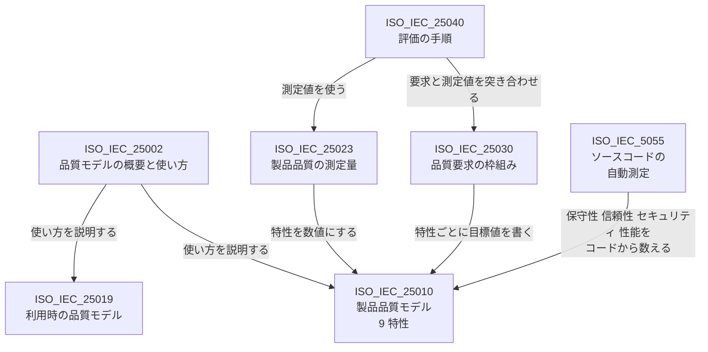

# ソフトウェアの品質の基準 —— 「できの良さ」を測る業界標準、出典つき

- 作成日: 2026-09-27
- 位置づけ: **参考資料**。規則 `01` 〜 `09` を変えるものではない。本フォルダの索引（`README.md`）には載せていない。
  使いやすさの詳細は姉妹資料 [usability-principles-ja.md](usability-principles-ja.md) に置いた。
- 前提: **バグが直っている（機能が正しい）ことを前提**に、その先の「メンテ性・堅牢性・アーキテクチャ・仕様書」の良さを扱う。
- 出典の扱い: 末尾の第 8 節に一覧を置く。本文の `[Q1]` などはその番号を指す。
  - **照合済み** —— 2026-09-27 に検索で所在と要点を確かめた（URL を付けた）
  - **未照合** —— 作者の知識によるもので、本資料の作成時に照合していない。使う前に確かめること

---

## 0. 要旨

**要点:**

| # | 要点 |
|---|---|
| 1 | 業界標準の中心は **ISO/IEC 25010:2023**（SQuaRE 規格群の製品品質モデル）である。品質を **9 つの特性** に分ける [Q1] [Q2] |
| 2 | **規格が決めているのは「何を見るか」まで**で、「何点なら合格か」は決めていない。目標値は製品ごとに決めて測る |
| 3 | **メンテ性と堅牢性のコード面は、機械で数えられる**（ISO/IEC 5055:2021 など）[Q3] [Q4] |
| 4 | **アーキテクチャと仕様書の良さは、点数より手順と点検表で評価する**（ATAM、ISO/IEC/IEEE 29148 など。いずれも未照合） |
| 5 | **製品の良さと作り方（工程・組織）の良さは別物**である。工程の基準が良くても製品の品質は保証されない |

---

## 1. 全体の枠組み —— ISO/IEC 25010:2023

### 1.1 9 つの品質特性

**ISO/IEC 25010:2023 の品質特性と、よく問われる観点の対応:**

| 特性 | 主な副特性 | よく問われる観点 |
|---|---|---|
| 機能適合性 | 機能完全性・機能正確性・機能適切性 | バグが無いこと（本資料では前提） |
| 性能効率性 | 時間効率性・資源効率性・容量満足性 | 速さ・軽さ |
| 互換性 | 共存性・相互運用性 | 他のソフトとの共存、データのやり取り |
| 相互作用能力（旧「使用性」） | 習得性・自己記述性・包摂性 ほか | 使いやすさ（姉妹資料） |
| 信頼性 | 無欠陥性（旧「成熟性」）・可用性・障害許容性・回復性 | **堅牢性** |
| セキュリティ | 機密性・インテグリティ・否認防止・責任追跡性・真正性・**抵抗性（2023 年版で新設）** | 堅牢性 |
| 保守性 | モジュール性・再利用性・解析性・修正性・試験性 | **メンテ性**・綺麗なアーキテクチャ |
| 柔軟性（旧「移植性」） | 適応性・**拡張性（新設）**・設置性・置換性 | 環境や規模の変化への強さ |
| 安全性（2023 年版で新設） | 運用制約性・リスク特定性・フェイルセーフ性・危険警告性・安全統合性 | 堅牢性 |

特性の数（9）、2023 年版で新設・改名されたもの（安全性・柔軟性・抵抗性・拡張性・無欠陥性・相互作用能力）は照合済みである [Q1] [Q2]。
**副特性の日本語は作者の仮訳**であり、JIS 版の訳語とは照合していない。副特性の一覧のうち、上で「新設」と書いていないものは未照合である。

### 1.2 SQuaRE 規格群の中での位置

**SQuaRE 規格群の関係:**

2023 年版で、旧版（2011 年版）が一冊に持っていた「製品品質モデル」と「利用時の品質モデル」が分かれ、
製品品質は ISO/IEC 25010:2023、利用時の品質は ISO/IEC 25019:2023、モデルの概要と使い方は ISO/IEC 25002 に移った（照合済み [Q1] [Q2]）。
ISO/IEC 5055 は SQuaRE 規格群の番号ではないが、保守性・信頼性・セキュリティ・性能効率性をコードから測る点で 25010 の特性と対応する（照合済み [Q3] [Q4]）。
**ISO/IEC 25023・25030・25040 の役割は作者の知識による未照合の記述である。**

### 1.3 規格が決めていないこと

- **合格線。** ISO/IEC 25010 は品質の「観点の地図」であり、「保守性が何点以上なら良い」とは書いていない。
  目標値は製品の目的と利用者に合わせて自分で決め、要求として書き、測って確かめる。
- **重み。** 9 つの特性のどれを重く見るかは製品によって違う。すべてを最高にすることはできず、特性同士は引っ張り合う
  （たとえばセキュリティを強めると使いやすさや性能が下がることがある）。

---

## 2. 観点ごとの基準

### 2.1 メンテ性（保守性）

**メンテ性の基準:**

| 規格・基準 | 何が決まっているか | 強さ | 照合 |
|---|---|---|---|
| ISO/IEC 25010 の保守性 | 観点（モジュール性・再利用性・解析性・修正性・試験性）だけ。数値は無い | 国際規格 | 特性の存在は照合済み [Q1] |
| **ISO/IEC 5055:2021** | ソースコードの内部構造を機械的に測る。既知の弱点の一覧（CWE）から選んだ違反を数える。対象は **信頼性・セキュリティ・性能効率性・保守性** の 4 つ。CISQ が OMG 標準として作り、ISO 規格になった | 国際規格。数えて測れる | 照合済み [Q3] [Q4] |
| SIG の保守性モデル | コードの量・重複・複雑さ・単位の大きさなどから 1 〜 5 つ星を付ける。多数のシステムと比べた相対評価。認証の仕組みもある | 事実上の標準 | 未照合 [Q5] |
| McCabe の循環的複雑度 | 関数 1 つの分岐の多さ。およそ 10 までが目安とされる | 慣習的な数値 | 未照合 [Q6] |

**大事な点:** 機械で数えた値が良くても、**構造が目的に合っているか** は分からない。
数値は「悪いところを見つける」ために使い、「良いと言い切る」ためには使わない。

### 2.2 堅牢性（信頼性・セキュリティ・安全性）

**堅牢性の基準:**

| 規格・基準 | 何が決まっているか | 強さ | 照合 |
|---|---|---|---|
| ISO/IEC 25010 の信頼性・セキュリティ・安全性 | 観点（第 1.1 節の表）。数値は無い | 国際規格 | 照合済み [Q1] [Q2] |
| ISO/IEC 5055 の信頼性とセキュリティ | 危険なコードの型（CWE の一部）への違反を数える | 国際規格 | 照合済み [Q3] [Q4] |
| OWASP ASVS | アプリケーションのセキュリティ検証項目の一覧。求める水準が 3 段階ある | 事実上の標準（ウェブ向け） | 未照合 [Q7] |
| CWE Top 25 | 特に危険な弱点の上位 25 の一覧 | 参照用の一覧 | 未照合 [Q8] |

機能安全の分野別規格（人命や設備に関わる製品向け）もあるが、分野に依存するため本資料では扱わない。

### 2.3 綺麗なアーキテクチャ

**アーキテクチャの基準:**

| 規格・基準 | 何が決まっているか | 強さ | 照合 |
|---|---|---|---|
| ISO/IEC/IEEE 42010:2022 | アーキテクチャの **書き方**（利害関係者・関心事・視点・根拠）。**何が良い構造かは決めていない** | 国際規格 | 未照合 [Q9] |
| ATAM（SEI のアーキテクチャ評価手法） | 品質の要求を具体的な場面（品質特性シナリオ）に落とし、その構造で満たせるかを検討する **手順** | 事実上の標準 | 未照合 [Q10] |
| 結合度・凝集度の指標（Martin のパッケージ指標、CK 指標など） | 依存の向き・安定度・抽象度・クラスの複雑さを数値化する | 研究と慣習 | 未照合 [Q11] [Q12] |
| 「クリーンアーキテクチャ」「SOLID」など | 書籍に書かれた設計原則 | **規格ではない** | —— |

**大事な点:** 「綺麗なアーキテクチャ」を点数で認定する規格は無い。
アーキテクチャの良さは **「求める品質特性を、その構造で満たせるか」** で決まり、ATAM はそれを場面ごとに問う手順である。
第 1 節の ISO/IEC 25010 の特性が、その「求める品質特性」の一覧として使える。

### 2.4 仕様書の良さ

**仕様書の基準:**

| 規格・基準 | 何が決まっているか | 強さ | 照合 |
|---|---|---|---|
| **ISO/IEC/IEEE 29148:2018** | 要求 1 件ごとの良さ（必要・適切・曖昧でない・完全・単一・実現可能・検証可能・正しい・適合している）と、要求の集合としての良さ（完全・無矛盾・実現可能・理解できる・妥当性を確認できる） | 国際規格。点検表として使える | 未照合 [Q13] |
| IEEE 830-1998（29148 の前身） | 8 つの性質（正しい・曖昧でない・完全・無矛盾・重要度と安定度付き・検証可能・変更しやすい・追跡可能） | 廃止済みだが今もよく引かれる | 未照合 [Q14] |
| INCOSE の要求記述ガイド | 要求文の書き方の規則集 | 業界の手引き | 未照合 [Q15] |
| EARS 記法 | 要求文の文型（「〜のとき、システムは〜しなければならない」など） | 業界の手引き | 未照合 [Q16] |

### 2.5 その他の文書と工程

**その他の基準:**

| 対象 | 規格・基準 | 何が決まっているか | 照合 |
|---|---|---|---|
| テスト | ISO/IEC/IEEE 29119 | テストの工程・文書・技法 | 未照合 [Q17] |
| 利用者向けの文書 | ISO/IEC/IEEE 26514 | 利用者向け文書の設計と作り方 | 未照合 [Q18] |

---

## 3. 製品の良さと、作り方の良さ

**製品の基準と工程の基準の区別:**

| 区分 | 何を見るか | 例 | 照合 |
|---|---|---|---|
| **製品の品質** | できあがったソフトそのもの | ISO/IEC 25010、ISO/IEC 5055 | 照合済み [Q1] [Q3] |
| 作り方の品質（工程） | ソフトの生涯の工程 | ISO/IEC/IEEE 12207 | 未照合 [Q19] |
| 作り方の品質（組織） | 組織の成熟度 | CMMI、ISO/IEC 33000 | 未照合 [Q20] [Q21] |
| 届け方の性能 | リリースの頻度・変更から本番までの時間・変更の失敗率・復旧時間 | DORA の 4 指標 | 未照合 [Q22] |

**大事な点:** 工程や組織の基準を満たしても、**製品の品質が保証されるわけではない**。
本資料の関心（できの良さ）は上の表の 1 行目であり、他の行はそれを生み出す仕組みの側の基準である。

---

## 4. 実際の使い方

**基準の使い分け:**

| 目的 | 使うもの | 理由 |
|---|---|---|
| 品質の観点の抜けを防ぐ | ISO/IEC 25010 の 9 特性を点検表にする | 「性能は見たが回復性を見ていなかった」といった抜けが分かる |
| メンテ性と堅牢性のコード面を測る | ISO/IEC 5055、複雑度、重複率など | 機械で数えられ、毎回同じ結果が出る |
| アーキテクチャを評価する | ATAM のように、品質の要求を場面に落として構造に当てる | 良い構造かどうかは、求める品質によって変わる |
| 仕様書を点検する | ISO/IEC/IEEE 29148 の性質を 1 件ずつ当てる | 曖昧さ・検証できなさ・矛盾が見つかる |
| 目標値を決める | 製品ごとに決めて要求として書く | 規格は合格線を与えない |

---

## 5. 本プロジェクトとの関係

`07-review-standards.md`（R1 〜 R7）は、第 2 節の表の「アーキテクチャ」「仕様書」「メンテ性」の一部を自前の規約にしたもの、と位置づけられる見込みがある。
**ただし両者はまだ突き合わせていない。** R1 〜 R7 と ISO/IEC 25010 の 9 特性・ISO/IEC/IEEE 29148 の性質との対照は、行うなら別の作業である。

---

## 6. 用語

**用語:**

| 用語 | 意味 |
|---|---|
| SQuaRE | Systems and software Quality Requirements and Evaluation。ISO/IEC 25000 番台の品質規格群の総称 |
| 品質特性 | 品質を分けた観点（ISO/IEC 25010 では 9 つ） |
| 副特性 | 品質特性をさらに分けた観点 |
| CWE | Common Weakness Enumeration。ソフトウェアの弱点の型の一覧 |
| CISQ | Consortium for Information & Software Quality。ISO/IEC 5055 の元になった測定量を作った団体 |

---

## 7. 未確認・要調査の事項

**本資料で確かめきれていないこと:**

| 事項 | 状態 |
|---|---|
| ISO/IEC 25010:2023 の副特性の JIS 訳語 | 未照合。第 1.1 節の訳語は作者の仮訳 |
| 第 1.1 節の副特性のうち、2023 年版の新設・改名以外のもの | 未照合 |
| ISO/IEC 25023・25030・25040 の役割 | 未照合（第 1.2 節の図） |
| 第 2 節・第 3 節で「未照合」と書いた基準 | すべて作者の知識による。本資料の作成時に追加の調査はしないと決めたため、照合していない |
| 規格の本文 | 有料のため読んでいない。照合済みの項目も、規格のサンプル頁と二次資料による |
| R1 〜 R7 との対応 | 未着手（第 5 節） |

---

## 8. 出典

**照合済み（2026-09-27）:**

| 番号 | 出典 |
|---|---|
| [Q1] | ISO/IEC 25010:2023, Systems and software engineering — Systems and software Quality Requirements and Evaluation (SQuaRE) — Product quality model. サンプル頁: https://cdn.standards.iteh.ai/samples/78176/13ff8ea97048443f99318920757df124/ISO-IEC-25010-2023.pdf |
| [Q2] | arc42 Quality Model. Update on ISO 25010, version 2023. https://quality.arc42.org/articles/iso-25010-update-2023 |
| [Q3] | ISO/IEC 5055:2021, Information technology — Software measurement — Software quality measurement — Automated source code quality measures. https://www.iso.org/standard/80623.html |
| [Q4] | CISQ. Software Quality Standards – ISO 5055. https://www.it-cisq.org/standards/code-quality-standards/ |

**未照合（作者の知識による書誌）:**

| 番号 | 出典 |
|---|---|
| [Q5] | Heitlager, I., Kuipers, T., Visser, J. (2007). A Practical Model for Measuring Maintainability. Proceedings of QUATIC 2007. |
| [Q6] | McCabe, T. J. (1976). A Complexity Measure. IEEE Transactions on Software Engineering, SE-2(4). |
| [Q7] | OWASP. Application Security Verification Standard (ASVS). |
| [Q8] | MITRE. CWE Top 25 Most Dangerous Software Weaknesses. |
| [Q9] | ISO/IEC/IEEE 42010:2022, Software, systems and enterprise — Architecture description. |
| [Q10] | Kazman, R., Klein, M., Clements, P. (2000). ATAM: Method for Architecture Evaluation. CMU/SEI-2000-TR-004. Software Engineering Institute. |
| [Q11] | Martin, R. C. (1994). OO Design Quality Metrics: An Analysis of Dependencies. |
| [Q12] | Chidamber, S. R., Kemerer, C. F. (1994). A Metrics Suite for Object Oriented Design. IEEE Transactions on Software Engineering, 20(6). |
| [Q13] | ISO/IEC/IEEE 29148:2018, Systems and software engineering — Life cycle processes — Requirements engineering. |
| [Q14] | IEEE Std 830-1998, IEEE Recommended Practice for Software Requirements Specifications. |
| [Q15] | INCOSE. Guide for Writing Requirements. |
| [Q16] | Mavin, A., Wilkinson, P., Harwood, A., Novak, M. (2009). Easy Approach to Requirements Syntax (EARS). Proceedings of the 17th IEEE International Requirements Engineering Conference. |
| [Q17] | ISO/IEC/IEEE 29119, Software and systems engineering — Software testing（複数部からなる規格群）. |
| [Q18] | ISO/IEC/IEEE 26514, Systems and software engineering — Design and development of information for users. |
| [Q19] | ISO/IEC/IEEE 12207:2017, Systems and software engineering — Software life cycle processes. |
| [Q20] | CMMI Institute. Capability Maturity Model Integration (CMMI). |
| [Q21] | ISO/IEC 33000 series, Information technology — Process assessment. |
| [Q22] | DORA (DevOps Research and Assessment). Four key metrics of software delivery performance. |
