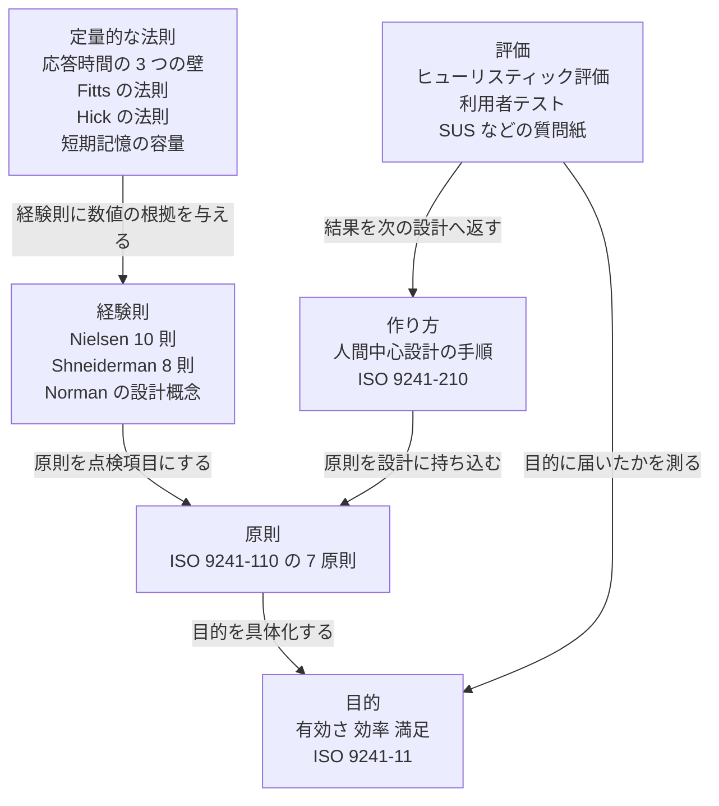
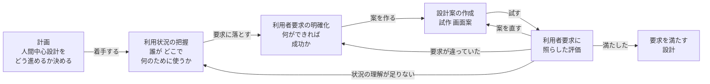

# ユーザビリティの体系 —— 良いソフトとは何か、出典つき

- 作成日: 2026-09-25
- 位置づけ: **参考資料**。規則 `01` 〜 `09` を変えるものではない。本フォルダの索引（`README.md`）にはまだ載せていない。
- 出典の扱い: 末尾の第 9 節に一覧を置く。本文の `[S1]` などはその番号を指す。
  URL を付けたものは 2026-09-25 に検索で所在を確かめた。URL の無いものは書誌だけを挙げ、本文は照合していない。

---

## 0. 要旨 —— ユーザビリティで大事なこと Top 10

**ユーザビリティ Top 10:**

| 順 | 大事なこと | 一言でいうと | 主な出典 |
|---|---|---|---|
| 1 | **利用者と作業に合わせる** | 技術の都合ではなく、利用者が片づけたい作業の形に画面と操作を合わせる | [S1] [S3] [S4] |
| 2 | **見れば分かる（マニュアル不要）** | 何ができて、どう使うかが画面から読み取れる。説明書を開かせない | [S3] [S6] [S8] [S29] |
| 3 | **すぐ反応し、いま何が起きているかを見せる** | 操作には必ず応答がある。0.1 秒・1 秒・10 秒の壁を守り、超えるなら進み具合を見せる | [S6] [S7] [S9] [S13] |
| 4 | **一貫させ、慣習に従う** | 同じことは同じ見た目と同じ操作で。利用者が他のソフトで覚えたやり方を裏切らない | [S3] [S6] [S7] [S14] |
| 5 | **誤りを防ぎ、起きても立ち直れるようにする** | 誤りにくい作りを先に。起きたら、何が悪く、どう直すかを平易な言葉で示す | [S3] [S6] [S7] [S8] |
| 6 | **取り消せる。主導権は利用者にある** | 元に戻せるから、利用者は安心して試せる。ソフトが勝手に先へ進まない | [S3] [S6] [S7] |
| 7 | **覚えさせない** | 選択肢や直前の値を画面に出しておく。思い出させるより、見て選ばせる | [S6] [S7] [S8] [S19] [S20] |
| 8 | **探すものが見つかる** | クリック数より「次の一手に確信が持てるか」。数が多ければ絞り込みや検索を用意する | [S10] [S11] [S12] |
| 9 | **初心者には易しく、熟練者には速く** | よく使う機能は近道（ショートカット等）で速く。使わない機能は段階的に見せる | [S6] [S7] [S15] |
| 10 | **利用者で試して、測って確かめる** | 作り手の目は当てにならない。少人数でよいので実際の利用者に使わせ、数値で比べる | [S4] [S16] [S17] [S18] |

**順番の決め方:** 目的（第 1 節の「有効さ・効率・満足」）に近いものを上に置いた。これは本資料の作者の判断であり、
どの出典にもこの順位は書かれていない。第 3 節の対照表で、各項目がいくつの枠組みに現れるかを数えられる。

---

## 1. ユーザビリティとは何か —— 定義

### 1.1 三つの代表的な定義

**定義の比較:**

| 出典 | 何と定義しているか | 構成要素 |
|---|---|---|
| ISO 9241-11:2018 [S1] | 特定の利用者が、特定の利用状況で、特定の目標を達成するときの度合い | **有効さ**（目標を正しく完全に達成できるか）・**効率**（そのために費やす資源）・**満足**（利用者の受け止め） |
| Nielsen, Usability 101 [S5] | 使いやすさを表す品質の属性 | **学習しやすさ**・**効率**・**覚えやすさ**・**誤り**（少なさと回復しやすさ）・**満足** |
| ISO/IEC 25010:2023 [S2] | 製品品質の特性の一つ。2023 年版で名前が「使用性（usability）」から **「相互作用能力（interaction capability）」** に変わった | 適切度認識性・習得性・運用操作性・ユーザーエラー防止性・ユーザーエンゲージメント・**包摂性**・ユーザー支援性・**自己記述性**（包摂性と自己記述性は 2023 年版で追加） |

`ISO/IEC 25010:2023` の副特性の日本語訳は、JIS 版が本資料の作成時点で確認できていないため、作者の仮訳である。

### 1.2 大事な点

- **「使いやすさ」は製品単体の性質ではない。** ISO 9241-11 は「誰が・どんな状況で・何をするか」を必ず添える [S1]。
  初心者と熟練者、たまに使う人と毎日使う人とでは、同じ画面の評価が変わる。
- **速いだけでも、きれいなだけでも足りない。** 目標を達成できること（有効さ）が最初にあり、効率と満足はその上に乗る。

---

## 2. 体系の全体像

**ユーザビリティ知識の階層:**

上の層ほど抽象的で、下の層ほど具体的に測れる。**目的**は何を良しとするか、**原則**はそのための性質、
**経験則**は設計や点検にそのまま使える言い回し、**定量的な法則**は数値の根拠、**作り方と評価**はそれを実際の製品に通す手順である。
この図の層の切り方は本資料の作者による整理であり、特定の出典の図ではない。

---

## 3. 原則と経験則の対照表

代表的な四つの枠組みが、Top 10 のどの項目に当たるかを並べる。空欄はその枠組みに明示の項目が無いことを表す
（作者が各枠組みの項目名を読んで対応づけた。解釈の余地がある）。

**Top 10 と四つの枠組みの対照:**

| Top 10 | ISO 9241-110:2020 の原則 [S3] | Nielsen 10 則 [S6] | Shneiderman 8 則 [S7] | Norman [S8] | 現れる数 |
|---|---|---|---|---|---|
| 1 利用者と作業に合わせる | 利用者の作業への適合性 | H2 システムと実世界の一致 | | 概念モデル・対応づけ（マッピング） | 3 |
| 2 見れば分かる | 自己記述性・学習容易性 | H6 記憶より再認 / H10 ヘルプと文書 | | 発見可能性・シグニファイア | 3 |
| 3 すぐ反応し、状態を見せる | 自己記述性 | H1 システム状態の可視化 | 3 有益なフィードバック / 4 完結感のある対話 | フィードバック | 4 |
| 4 一貫させ、慣習に従う | 利用者の期待への適合性 | H4 一貫性と標準 | 1 一貫性を保つ | 制約（文化的な慣習）・標準化 | 4 |
| 5 誤りを防ぎ、立ち直れる | 使用エラーへの頑健性 | H5 エラーの防止 / H9 エラーの認識・診断・回復 | 5 エラーを防ぐ | 制約・誤りを前提にした設計 | 4 |
| 6 取り消せる・利用者が主導 | 制御可能性 | H3 利用者の制御と自由 | 6 操作を容易に取り消せる / 7 利用者に主導権を | 誤りを前提にした設計（取り消し） | 4 |
| 7 覚えさせない | 学習容易性 | H6 記憶より再認 | 8 短期記憶の負担を減らす | 知識を頭の中でなく外界に置く | 4 |
| 8 探すものが見つかる | | | | | 0 |
| 9 初心者に易しく熟練者に速く | 制御可能性（2020 年版で旧「個別化」を吸収） | H7 柔軟性と効率 / H8 美しく最小限の設計 | 2 誰にでも使える（熟練者向けの近道を含む） | | 3 |
| 10 利用者で試して測る | | | | | 0 |
| （Top 10 外）利用者の意欲 | 利用者エンゲージメント（2020 年版で新設） | | | | 1 |

**読み方:**

- 項目 8（見つかる）と 10（試して測る）は、上の四つの「画面の性質」の枠組みには現れない。
  8 は情報探索の研究 [S10] [S11] [S12]、10 は設計の手順 [S4] と評価の研究 [S16] [S17] から来る。
  **画面の性質だけ整えても、探しやすさと検証が抜ける** —— これが四つの枠組みだけで Top 10 を作らなかった理由である。
- `ISO 9241-110` の 2006 年版では 7 原則の名前が異なる（作業への適合性・自己記述性・制御可能性・期待への適合性・誤りへの許容度・個別化への適合性・学習への適合性）。
  古い資料を読むときは版に注意する [S3]。
- Norman の用語（アフォーダンス・シグニファイア・制約・対応づけ・フィードバック・概念モデル）は 2013 年の改訂版による [S8]。
  Norman は、利用者の意図と操作のあいだの溝（**実行の淵**）と、結果と理解のあいだの溝（**評価の淵**）を狭めることを設計の中心に置く。

---

## 4. 数値で言えること

### 4.1 応答時間の目安

**応答時間と、利用者に見せるべきもの:**

| 待ち時間 | 利用者の感じ方 | 設計ですべきこと | 出典 |
|---|---|---|---|
| 約 0.1 秒以内 | 即座に反応したと感じる | 結果を出すだけでよい。特別な表示は要らない | [S9] [S13] [S21] |
| 約 0.4 秒以内 | 操作のテンポが保たれ、生産性が上がる（Doherty の閾値） | 対話的な操作はここを目指す | [S22] |
| 約 1 秒以内 | 遅れには気づくが、考えの流れは途切れない | 特別な表示は通常要らない。これを超えるならカーソル変化などで「処理中」を示す | [S9] [S13] |
| 約 10 秒以内 | 注意を対話に向けていられる限界 | 待ち時間の見込みを示す | [S9] [S13] |
| 10 秒超 | 利用者は別のことを始める | **進み具合（残り量）と中止の手段を必ず出す**。戻ってきたとき終わったことが分かるようにする | [S9] |

**大事な点:** 0.1 秒・1 秒・10 秒は **知覚と注意の目安** であって、性能要件の数値そのものではない。
何の操作にどの壁を当てるか（入力の反響は 0.1 秒、画面遷移は 1 秒、など）は製品ごとに決めて、仕様に書き、測る必要がある。
Doherty の閾値の出典は IBM の社内報告であり、本資料の作者は原文を照合していない [S22]。

### 4.2 指し示しと選択にかかる時間

**Fitts の法則（Shannon 形）:**

$$
MT = a + b \log_2\left(\frac{D}{W} + 1\right)
$$

目標を指し示すのにかかる時間 $MT$ は、目標までの距離 $D$ が大きいほど、目標の幅 $W$ が小さいほど長くなる。
$a$ と $b$ は機器と人ごとに測って求める定数である [S23] [S24]。
**設計への帰結:** よく押すものは大きく、近くに置く。画面の端や角は「幅が無限大」に近いので押しやすい。

**Hick-Hyman の法則:**

$$
T = b \log_2(n + 1)
$$

同じ確からしさの選択肢が $n$ 個あるとき、選ぶのにかかる時間 $T$ は $n$ の対数で増える [S25] [S26]。
**設計への帰結:** 一度に見せる選択肢を減らすと選択は速くなる。ただし、選択肢を細かい階層に分けすぎると、
今度は階層をたどる手間が増える。対数で増えるので、並べ方が整理されていれば長い一覧も思ったほど遅くはならない。

### 4.3 記憶の容量

**短期記憶の容量に関する二つの説:**

| 説 | 容量 | 出典 |
|---|---|---|
| Miller（1956） | 7 ± 2 個 | [S19] |
| Cowan（2001） | 約 4 個のまとまり（チャンク） | [S20] |

**大事な点:** 「メニューは 7 項目まで」という言い伝えは Miller の論文の誤用であることが多い。
Miller の数は **覚えておく** 量の話であり、**画面に見えている** 一覧を選ぶ場面には直接当てはまらない。
Top 10 の 7「覚えさせない」—— 見えるところに置けば記憶の容量は問題にならない —— が正しい帰結である。

### 4.4 評価の人数と点数

**評価に関わる数値:**

| 数値 | 意味 | 出典 |
|---|---|---|
| 5 人 | 1 回の利用者テストで、問題のおよそ 85% が見つかる（問題 1 件を 1 人が見つける確率を 31% とした場合） | [S16] [S17] |
| 68 点 | SUS（System Usability Scale）の平均点。100 点満点だが百分率ではない | [S18] |

**5 人で見つかる問題の割合:**

$$
\mathrm{Found}(i) = N \left(1 - (1 - L)^{i}\right)
$$

$N$ は問題の総数、 $L$ は 1 人が 1 件の問題を見つける確率、 $i$ は被験者の人数である。
$L = 0.31$ のとき $i = 5$ で約 85% になる [S16] [S17]。
**大事な点:** Nielsen の推奨は「5 人を 1 回」ではなく **「5 人ずつ、直しながら何回も」** である [S17]。
利用者層が大きく異なる場合は、層ごとに人数を用意する。 $L$ は製品と課題によって変わるので、31% は固定の値ではない。

---

## 5. よく言われる経験則の検証

利用者が挙げた例を、出典に照らして確かめる。

**経験則の判定:**

| よく言われること | 判定 | 根拠と、正しい言い方 |
|---|---|---|
| マニュアル不要で操作できる | **正しい（ただし限度あり）** | ISO 9241-110 の自己記述性・学習容易性 [S3]、Nielsen H6 [S6]、Norman の発見可能性 [S8]。ただし Nielsen H10 は「ヘルプが要らないのが理想だが、必要な場面はある。探しやすく、作業に即したものにせよ」とする [S6]。**「マニュアルを開かずに主要な作業が終わる」が目標で、「ヘルプを置かない」ではない** |
| 待ち時間は 100ms / 1 秒 / 10 秒以下 | **正しい** | Miller（1968）[S21] に始まり、Card ら（1991）[S13]、Nielsen（1993）[S9] が広めた。ただし第 4.1 節のとおり、**超えたときに何を見せるか** とセットで意味を持つ |
| やりたいことまで 3 クリック | **根拠が無い（否定されている）** | Porter（2003）の調査は 44 人・620 課題を分析し、3 クリックを超えても離脱率も満足度も変わらないことを示した [S10]。NN/g も同じ結論である [S11]。**正しい言い方は「クリック数より、各クリックで正しい方向に進んでいると確信できること」**。これは情報の匂い（information scent）[S12] の考え方である |
| 対象が多いと検索を用意する | **おおむね正しい（閾値は未確立）** | 一覧から見て選ぶ（再認）のは思い出して打つ（想起）より楽なので、少ないうちは一覧がよい [S6]。数が増えると一覧をたどる手間が増え、絞り込みや検索が効く。**「何件を超えたら検索」という権威ある数値は、本資料の調査では見つからなかった**。製品ごとに利用者テストで決めるべきである |

---

## 6. 作り方と評価の手順

### 6.1 人間中心設計の流れ

**人間中心設計の活動（ISO 9241-210）:**

ISO 9241-210 は、利用状況の把握・要求の明確化・設計・評価の四つの活動を **繰り返す** ことを求める [S4]。
評価の結果によって、どの活動へ戻るかが変わる。一度作って終わりにしないことが、この規格の中心である。

### 6.2 評価の方法

**評価の方法の比較:**

| 方法 | 誰が | 何が分かるか | 出典 |
|---|---|---|---|
| ヒューリスティック評価 | 専門家（3 〜 5 人が望ましい） | 経験則（Nielsen 10 則など）に反する箇所。安く速いが、実際の利用者のつまずきは見落とす | [S6] [S27] |
| 利用者テスト（思考発話法など） | 実際の利用者 | どこで迷い、何を誤解するか。問題の発見に最も強い | [S16] [S17] |
| 質問紙（SUS など） | 実際の利用者 | 主観的な使いやすさを点数で比べる。**なぜ悪いかは分からない** | [S18] |
| 数値の計測 | 実際の利用者 | 課題の成功率・所要時間・誤りの回数。ISO 9241-11 の有効さと効率に対応する | [S1] |

**大事な点:** 質問紙の点数だけ見ても、何を直せばよいかは分からない。
**発見には利用者テスト、比較には数値と質問紙** —— と使い分ける。

---

## 7. 本プロジェクトで読むときの注意

この節は、本リポジトリの既存の取り決めとの関係を示すだけである。新しい規則は作らない。

**既存の取り決めとの関係:**

| 本資料の項目 | 本プロジェクトでの扱い |
|---|---|
| ISO/IEC 25010:2023 の包摂性、WCAG などのアクセシビリティ | 利用者の裁定（2026-09-17）により、**画面読み上げ（スクリーンリーダー）は対象外**。色・大きさ・操作のしやすさなど、それ以外の包摂性は本資料の範囲で参考にできる |
| 第 4.2 節 Fitts の法則（押す目標の大きさ） | 掴む領域や押す領域の大きさは、文章で決めずに、触れる試作と計測で決めてきた（`previous-project-result/16-grab-area-sizing/`）。数値を決める場面ではそちらが優先する |
| 第 4.1 節 応答時間 | 何の操作にどの壁を当てるかは、仕様（`docs/spec/`）に書き、測って確かめる。本資料の数値をそのまま要件にしない |
| 第 5 節 3 クリックの否定 | 「操作回数を減らせ」ではなく「各操作で迷わないか」を問う |

WCAG 2.2 の達成基準 2.5.8（押す目標の最小寸法 24 × 24 CSS ピクセル、レベル AA）と 2.5.5（44 × 44、レベル AAA）は、
画面読み上げとは関係の無い、指やポインタで押すための基準であり、上の裁定の対象外として参考にできる [S28]。

---

## 8. 未確認・要調査の事項

**本資料で確かめきれていないこと:**

| 事項 | 状態 |
|---|---|
| 「何件を超えたら検索を用意すべきか」の数値 | 権威ある数値を見つけられなかった。製品ごとに利用者テストで決める必要がある |
| ISO/IEC 25010:2023 の副特性の JIS 訳語 | 未確認。第 1.1 節の訳語は作者の仮訳 |
| Doherty & Thadani（1982）の原文 | 未照合。0.4 秒という数値は二次資料による |
| ISO 規格の本文 | 有料のため本文は読んでいない。原則の名前と定義は規格のサンプル頁と二次資料で確かめた |
| 第 3 節の対照表の対応づけ | 作者の解釈。特に Norman の列は、Norman が「規則の一覧」の形で書いていないため、解釈の幅が大きい |

---

## 9. 出典

**規格:**

| 番号 | 出典 |
|---|---|
| [S1] | ISO 9241-11:2018, Ergonomics of human-system interaction — Part 11: Usability: Definitions and concepts. ISO. |
| [S2] | ISO/IEC 25010:2023, Systems and software engineering — Systems and software Quality Requirements and Evaluation (SQuaRE) — Product quality model. ISO/IEC. 概要: https://quality.arc42.org/articles/iso-25010-update-2023 |
| [S3] | ISO 9241-110:2020, Ergonomics of human-system interaction — Part 110: Interaction principles. ISO. サンプル頁: https://cdn.standards.iteh.ai/samples/75258/1d33833551994efeb4c4896a3c22bab4/ISO-9241-110-2020.pdf ／ 解説: https://www.dialogdesign.dk/isos-dialogue-principles-2019/ |
| [S4] | ISO 9241-210:2019, Ergonomics of human-system interaction — Part 210: Human-centred design for interactive systems. ISO. |
| [S28] | W3C (2023). Web Content Accessibility Guidelines (WCAG) 2.2. W3C Recommendation. |

**書籍・記事:**

| 番号 | 出典 |
|---|---|
| [S5] | Nielsen, J. (2003, 改訂 2012). Usability 101: Introduction to Usability. Nielsen Norman Group. |
| [S6] | Nielsen, J. (1994, 文言の改訂 2020). 10 Usability Heuristics for User Interface Design. Nielsen Norman Group. |
| [S7] | Shneiderman, B., Plaisant, C., Cohen, M., Jacobs, S., Elmqvist, N. (2016). Designing the User Interface: Strategies for Effective Human-Computer Interaction, 6th ed. Pearson. —— 「8 つの黄金律」 |
| [S8] | Norman, D. A. (2013). The Design of Everyday Things, Revised and Expanded Edition. Basic Books. |
| [S9] | Nielsen, J. (1993). Usability Engineering. Academic Press. 第 5 章。要約: https://www.nngroup.com/articles/response-times-3-important-limits/ |
| [S10] | Porter, J. (2003). Testing the Three-Click Rule. User Interface Engineering. https://articles.centercentre.com/three_click_rule/ |
| [S11] | Nielsen Norman Group. The 3-Click Rule for Navigation Is False. https://www.nngroup.com/articles/3-click-rule/ |
| [S12] | Pirolli, P., Card, S. K. (1999). Information Foraging. Psychological Review, 106(4). |
| [S14] | Nielsen, J. (2000). The End of Web Design. Nielsen Norman Group. —— 「利用者は他のサイトで大半の時間を過ごす」（Jakob の法則の由来） |
| [S15] | Nielsen, J. (2006). Progressive Disclosure. Nielsen Norman Group. |
| [S18] | Brooke, J. (1996). SUS: A "quick and dirty" usability scale. In Usability Evaluation in Industry. Taylor & Francis. ／ Sauro, J. (2011). A Practical Guide to the System Usability Scale. Measuring Usability LLC. —— 平均 68 点 |
| [S27] | Nielsen, J., Molich, R. (1990). Heuristic evaluation of user interfaces. Proceedings of CHI '90. |
| [S29] | Krug, S. (2014). Don't Make Me Think, Revisited, 3rd ed. New Riders. —— 「見れば分かる」の入門書 |

**研究論文:**

| 番号 | 出典 |
|---|---|
| [S13] | Card, S. K., Robertson, G. G., Mackinlay, J. D. (1991). The Information Visualizer, an Information Workspace. Proceedings of CHI '91. |
| [S16] | Nielsen, J., Landauer, T. K. (1993). A mathematical model of the finding of usability problems. Proceedings of INTERCHI '93. |
| [S17] | Nielsen, J. (2000). Why You Only Need to Test with 5 Users. Nielsen Norman Group. |
| [S19] | Miller, G. A. (1956). The magical number seven, plus or minus two. Psychological Review, 63(2). |
| [S20] | Cowan, N. (2001). The magical number 4 in short-term memory. Behavioral and Brain Sciences, 24(1). |
| [S21] | Miller, R. B. (1968). Response time in man-computer conversational transactions. Proceedings of the AFIPS Fall Joint Computer Conference, vol. 33. |
| [S22] | Doherty, W. J., Thadani, A. J. (1982). The Economic Value of Rapid Response Time. IBM. —— 原文未照合 |
| [S23] | Fitts, P. M. (1954). The information capacity of the human motor system in controlling the amplitude of movement. Journal of Experimental Psychology, 47(6). |
| [S24] | MacKenzie, I. S. (1992). Fitts' law as a research and design tool in human-computer interaction. Human-Computer Interaction, 7(1). |
| [S25] | Hick, W. E. (1952). On the rate of gain of information. Quarterly Journal of Experimental Psychology, 4(1). |
| [S26] | Hyman, R. (1953). Stimulus information as a determinant of reaction time. Journal of Experimental Psychology, 45(3). |
