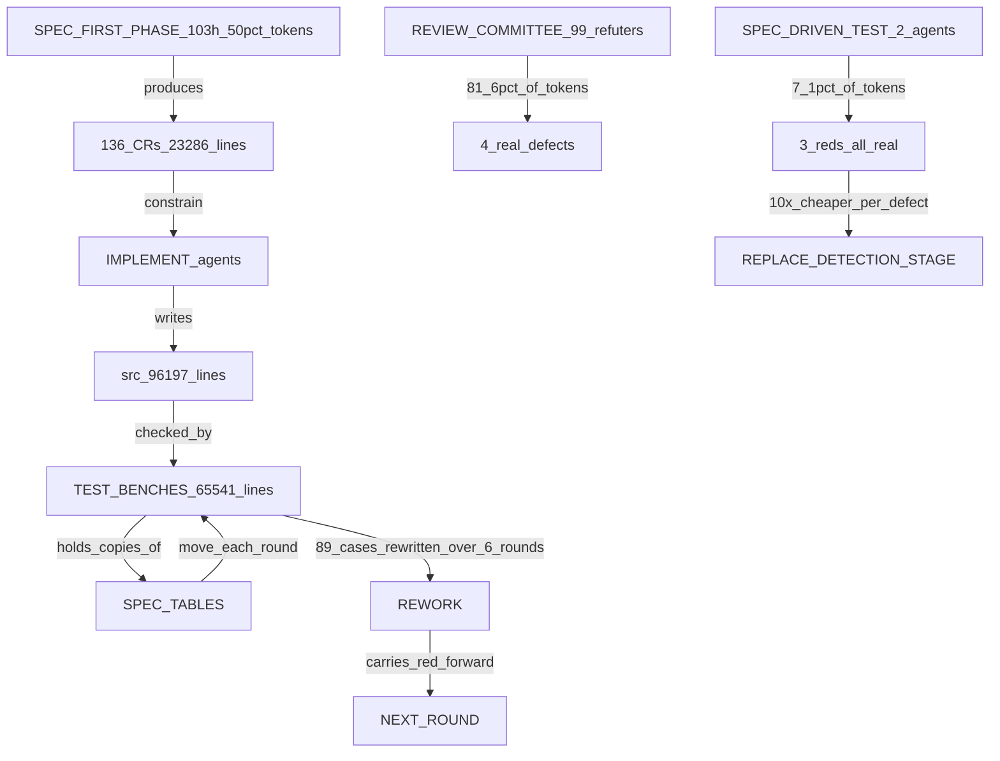
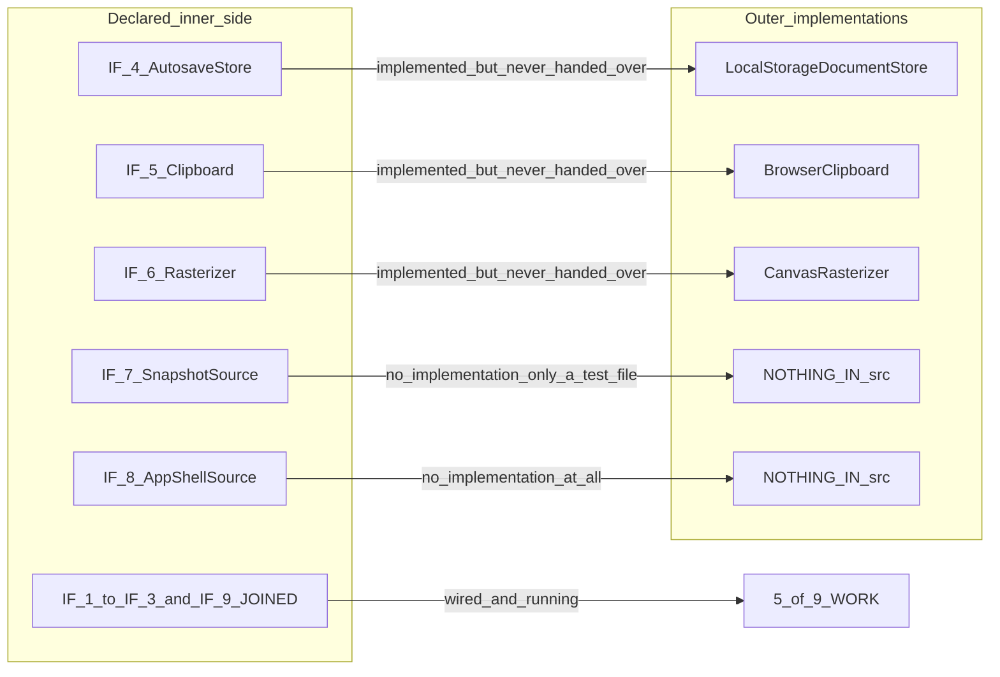
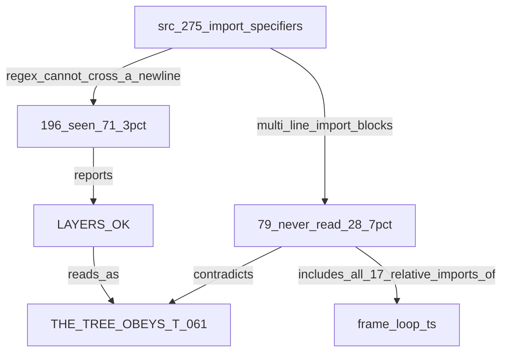
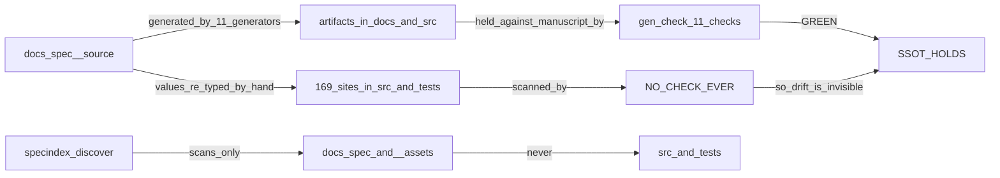
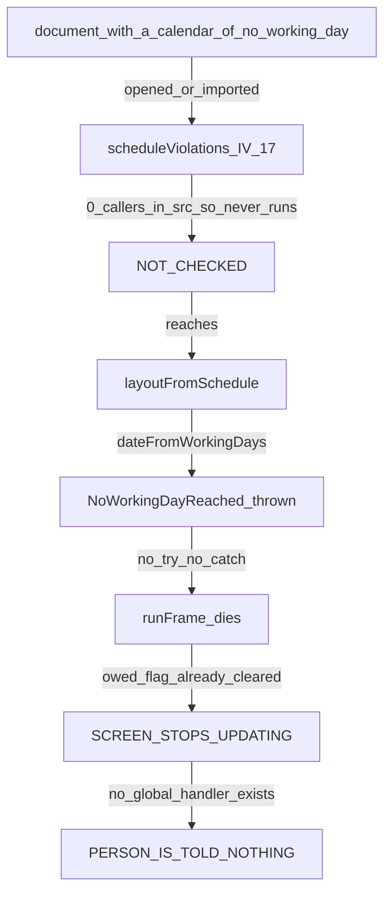

# 監査 — 何に時間が溶けているか、そして仕様どおりに建っているか

**測定日**: 2026-08-23 ／ **対象**: `restart` ブランチ `f64b025` 時点 ／ **方法**: 読み取り専用の体 5 つを並行

⛔ **本書の主張はすべて数値か逐語の引用を伴う。** 伴わないものは「測れなかった」節に置いた。

---

## 0. 結論（先に）

| 問い | 答え |
|---|---|
| なぜ遅いか | ⛔ **検出の歩留まりが 11〜12% で、そこに費用の 8 割が乗っている。** 同じ回で、**仕様だけを読んだ試験は 10 倍の効率で本物を捕まえた** |
| ボトルネックは | ① レビュー委員会の検出段 ② **試験台が仕様の表を写している**こと ③ 再検証と作業木の作り直し |
| CA は仕様どおりか | ⭐ **依存の向きは本物**（275 辺すべて内向き・越境 0・閉路 0）。⛔ **依存性逆転は 9 継ぎ目のうち 5 本しか繋がっていない** |
| データモデルは | ⭐ **列は機械が保証**（18 実体 / 138 列が原稿と一致）。⛔ **生成したスキーマを製品が 1 度も読まない** |
| SSOT は | ⭐ 生成機構は緑。⛔ **どの検査も `src/` と `tests/` を見たことがない** —— 写された値が **169 か所** |
| 例外は | ⭐ `adapter` と `use-case` に `throw` は 0。⛔ **描画中の例外を誰も捕まえず、画面が黙って止まる** |

---

## 1. なぜ実装・テスト・修正に時間がかかるのか

### 1-1. 測った数

**費用と時間の配分:**

```text
コミット           151 本 ／ 269.6 時間 ／ 中央値の間隔 39.7 分
うち仕様のみ        94 本（62.3%）—— src/ にも tests/ にも触れない
最初の製品コード    151 本中 84 本目。⛔ それ以前に 103.9 時間（38.5%）と
                    出力トークンの 50.3%（37.38M / 74.26M）が費やされている
体                 897（ワークフロー）／ 道具呼び出し 46,483 ／ うち Bash 32,165
変更要求            136 本 23,286 行 —— 仕様 1 行あたり 3.38 行
```

**レビュー委員会の歩留まり（2 回とも同じ形）:**

| 日 | 体 | 出力トークン | 得た本物 | 1 件あたり |
|---|---|---|---|---|
| 2026-08-15 | 89（うち refute 72）| 2,958,214 | **6 件**（72 件中 64 件を反証で消した）| **493,036** |
| 2026-08-22 | 106（うち refute 99）| 1,662,757 | **4 件** | **386,305** |
| ⭐ 同じ回の仕様駆動試験 | **2** | **117,537**（7.1%）| **赤 3 件、すべて本物** | ⭐ **39,179** |

⛔ **`docs/review/ft1-wiring-findings-2026-08-22.md:37` の逐語**:
「⛔ **本回いちばんの発見 —— refute の合議が落とした欠陥を、仕様だけを読んだ試験が捕まえた**」

**手戻り:**

```text
試験台の書き直し    6 巡で 89 件以上。原因は「試験台が仕様の表を写している」
赤で終わった巡      5 巡連続。⛔ 赤が増えた遷移が 5 回中 4 回
最初に 0 赤で終えた巡  第 8 巡（最終日）
禁じられた検証      2026-08-23 の 4 ワークフローのうち 3 つで、12 体が npm test を 63 回
作業木の取り違え     3 巡連続で古いコミットから切られた。ある巡は 8 体中 5 体が自力で検出
繰り返した罠        検査 7 の罠が 3 回、検査 9 の罠が 1 回、重複基準線の罠が 2 回
```

### 1-2. ボトルネックの図

**title:**



上の閉路が本命である。**試験台が表を写しているかぎり、原稿が動くたびに試験台が落ち、その修理が次の巡へ赤を持ち越す。** 右下の 2 本は費用対効果の比較で、下の経路が上の経路の 10 分の 1 の費用で同じ仕事をしている。

### 1-3. 早くする 3 手（測定に裏打ちされたもののみ）

| | やること | 根拠 | 見込み |
|---|---|---|---|
| **1** | ⭐ **検出段（多レンズ）を廃し、仕様駆動の試験に置き換える。** refute は残すが、レンズではなく試験が挙げた赤に向ける | 386,305 対 39,179 トークン／件 | **約 10 倍** |
| **2** | ⛔ **試験台が仕様の表を写すことを禁じ、生成物を読ませる。** 写しを機械検査で落とす | `142fe7a` で原稿が動いたとき、生成物を読む製品コードは無傷で、**写しを持つ試験だけが 10 件落ちた** | 合流点の赤の最大要因が消える |
| **3** | ⛔ **繰り返す罠を散文から harness へ。** `precheck.py` を編集前に必ず走らせ、台本の 1 行目で作業木の HEAD を検査する | 同じ罠が 3 回・2 回と再発。⭐ 本リポジトリ自身が「規則は機械検査まで下ろさないと守られない（実測 75 回中 7 回）」と記録している | 往復と誤報が消える |

---

## 2. アーキテクチャ・データモデル・SSOT・例外

### 2-1. Clean Architecture

⭐ **依存の向きは本物である。** 71 ユニットの 275 個の import 指定子を手で数え直した結果:

```text
外向きの辺              0
他コンポーネントの内部へ  0
同層コンポーネント間の閉路 0（25 対）
entity と use-case の 31 ユニット内のブラウザ型・時計・乱数  0
```

⛔ **ところが依存性逆転は半分しか成立していない。**

**title:**



9 本の継ぎ目はすべて内側で宣言され、入口から再輸出されている（そこは正しい）。⛔ **繋がっているのは 5 本だけで、`IF-7` は `src/` に実装が無く、唯一の実装が試験ファイルの中にある。** `installAgentApi` の呼び出し元は `src/` に 0 件、38 コンポーネントのうち 4 つが Vite の入口から到達不能である。

⛔ **さらに悪いのは、その向きを保証している門が 3 割を見ていないことである:**

**title:**



`tools/check_layer_rules.py:47-49` の正規表現は `[^;\n]*?` を挟むため、**複数行にまたがる import を 1 つも見られない。** 「OK」は 275 辺のうち 196 辺についての OK である。

**そのほか:**

- ⛔ 表 T-064 は「コンポーネントの外から呼んでよい名前の全数」を名乗るが、**実際に境界を越える 229 対のうち 142 対が載っていない**（検査は T-064 → `src/` の一方向しか歩かない）
- ⚠️ **表 T-065 に無い依存性逆転が 3 本ある**（`DocumentHolder` / `ChangeAudience` ほか）。同表は「層をまたぐ 9 本」と自称している
- ⚠️ `tests/` が 15 の非入口ユニットへ 36 か所で結び付いている（Chapter 5.3 は `src/` だけを縛るので違反ではないが、内部を動かせなくしている）

### 2-2. データモデル

⭐ **列は機械が保証している。** 生成器とは独立に検証した結果、`erd.json` の **18 実体 / 138 列**が生成された TypeScript に、同じ名前・順序・省略可否・型で届いている（ズレ 0）。生成された JSON スキーマも 138 列すべてを制約付きで持つ。

⛔ **ところが製品はそのスキーマを 1 度も読まない。**

```text
docs/spec/05-07-design.md:715 の逐語:
「`_source/grs-document.schema.json` は、列ごとの型と、`null` を許すかと、
  文字列の長さと、数値の範囲と、原稿が値を綴った列挙を既に強制する。
  1 つの列だけで決まる条件を本表に書いてはならない（MUST NOT）」

実測: src/ から grs-document.schema / ajv への参照 = 3 件、すべてコメント。コード 0 件。
      ajv は devDependency で、読むのは tests/fixtures/grs-document.ts だけ。
```

⛔ **つまり、表 T-220 が「単一列の条件を書くな」と免除した根拠そのものが、製品では走っていない。**

**そのほか:**

- ⛔ **MSPDI の要素名 70 個が `mspdi-codec.ts` に手で 2 度目に打たれている。** 突き合わせる生成器も検査も無い
- ⛔ `scheduleViolations`（`PI-1`）は 18 行すべてに答えるのに、**`src/` の呼び出し元が 0**（`tests/contract` に 4 件）
- ⚠️ `ProjectProfileFields` が Project の 8 列を手で写しており、**改名しても型検査が落ちない**ことを実測

### 2-3. SSOT

⭐ **生成機構は本物で、いま緑である** —— `gen:check` 11 本すべて通過、検査 21 の 18 生成物がすべて自分の原稿を名乗る、`src/` 全体で日本語の文字列リテラルは **1 個**。

⛔ **原則が破れるのは、検査が越えない境界である。**

**title:**



`specindex.py:31` は `docs/spec` と `docs/spec/_assets` しか走査しない。⛔ **したがって `src/` と `tests/` に写された値は、構造的にどの検査からも見えない。**

**実測した写し:**

```text
生成された既定値と同じリテラル      169 か所（107 鍵中 39 鍵。うち 90 は 2 文字以上）
themeHue: 214                     26 か所 / 22 ファイル
18 鍵の documentSettings 手打ち     7 つの試験ファイル。⛔ どれも SETTINGS_DEFAULTS を import していない
tests/unit/uf-22.test.ts:63        「// The tables, copied out」—— 入力も期待値も写しから作る閉路
src/use-case/edit-document/edit-project.ts:120  S-73 の 0 と 359 を手で書いた境界
```

**検査そのものの穴:**

- ⛔ `check.sh` は **11 本の生成器検査のうち 6 本しか走らせない** —— `src/` 内の 6 生成物は、`check.sh` が呼ばない別の npm script だけが守っている。**ALL GREEN はそれらについて何も証明しない**
- ⛔ `docs/spec/_source/build.py` は 12 生成物を書くのに **`--check` を持たず、どの npm script にも検査にも入っていない**
- ⚠️ 生成された SVG 5 枚に素性の記載が無い（Chapter 6.2 の MUST に対して）
- ⚠️ 原稿が 2 つ `_assets/` に在る（Chapter 6.2 が MUST NOT で禁じている場所）

### 2-4. 例外

⭐ **値で返す規律は本物である。** `adapter` と `use-case` に `throw` は **0**、25 の try/catch はすべて外界（プラットフォーム API）に対する守りである。⭐ **知らせの道も通っている** —— `RaisedNotice` → 辞書 → DOM の `role="status"` まで実際に描かれている。

⛔ **しかし 4 本の `throw` が残り、そのうち 3 本は誰も捕まえない。**

**title:**



`schedule.ts:1047` の `throw` は、描画路（`schedule-layout.ts:546`）と書込路（`edit-task.ts:837`）の**両方**から届く。それを不到達にするはずの `scheduleViolations` は書かれていて契約試験も緑なのに、**`src/` から 1 度も呼ばれていない。** `src/` と `index.html` に `unhandledrejection` も `error` 監視も **0 件**。

**そのほか:**

- ⛔ `frame-loop.ts:1687` が `notifyChangeWatchers` の結果を捨てている。⚠️ **その単位自身が「黙って飲み込むことは、その答えが唯一排除した選択肢である」と書いている**（`R3.1` 違反）
- ⚠️ 浮いた Promise が 3 本（`.finally` は拒否を消費しない）
- ⚠️ 失敗値の弁別子が **4 通り**（`ok: false` / `accepted: false` / `kind:` / 旗なし）、積荷の名前が **6 通り**。`ImportRefusal` という同名の型が**別の形で 2 つ**在る
- ⚠️ 表 T-233 の 15 行のうち**実際に発火できるのは 9 行**。⛔ **8 種類の失敗値には載せる行が無い**

---

## 3. 要問（Yomon）分析

| # | 項目 | 内容 |
| --- | --- | --- |
| 1 | 背景 | 1. `restart` で 151 コミット・269.6 時間を費やし、いま試験 3,496 件が全緑・`check.sh` が ALL GREEN・e2e 17 件が緑である<br />2. それでも直近 2 巡で、利用者が実物を触って本物の不具合を 4 件見つけた（ホイール 2 件・パレット・プロパティ面）<br />3. 裁定待ちが 69 件中 57 件（82.6%）未決、`src/` に `STOP` が 127 個残る |
| 2 | 目的 | 検査が現実を測る状態へ移し、巡あたりの手戻りと費用を下げる |
| 3 | 分析 | 1. **緑がすり抜けた実例を 4 つ測った** —— 層検査は 275 辺のうち 196 辺しか読まない（正規表現が改行をまたげない）／SSOT 検査は `src/` と `tests/` を 1 度も走査していない（写し 169 か所）／生成した JSON スキーマは製品で読まれない／`scheduleViolations` は呼ばれない<br />2. **費用の偏りを測った** —— 検出段が費用の 81.6% を占めて歩留まり 11〜12%、同じ回の仕様駆動試験は 7.1% の費用で 10 倍の効率<br />3. **手戻りの源を特定した** —— 試験台が仕様の表を写しており、原稿が動くたびに落ちる（6 巡で 89 件以上）<br />4. ⭐ 対照実験が既にある —— 同じコミットで、生成物を読む製品コードは無傷、写しを持つ試験だけが 10 件落ちた |
| 4 | **要問** | 全緑が「動く」の証拠にならないのはなぜか。検査が見ていない範囲を、どう塞げば緑を信じられるようになるか? |
| 5 | 課題 | 検査の被覆を、書かれた規則ではなく機械が測れる形へ広げる |
| 6 | 施策・対策 | 1. **検出段を仕様駆動の試験へ置き換える**（refute はレンズではなく赤に向ける）<br />2. **試験台が表を写すことを禁じ、生成物を読ませる**（写しを機械検査で落とす）<br />3. **検査自身の被覆を測って公表する**（層検査が何辺を読んだか、SSOT 検査がどの木を走査したかを出力に書かせる） |
| 7 | 作業・タスク | 1. `check_layer_rules.py` の正規表現を差し替え、**読んだ辺数と全辺数を必ず刷る**<br />2. `specindex.discover()` の走査対象に `src/` と `tests/` を足し、生成された既定値のリテラル一致を検査 14 の対象にする<br />3. `check.sh` から 11 本の生成器検査すべてを呼ぶ（いまは 6 本）<br />4. `scheduleViolations` を開く経路へ配線し、3 本の `throw` を不到達にする<br />5. `grs-document.schema.json` を製品の取込経路で実際に走らせる<br />6. `precheck.py` を編集前フックにし、台本の 1 行目で作業木の HEAD を検査する |
| 8 | 答え | 全緑が証拠にならないのは、**検査が自分の被覆を報告しないまま「OK」と言うから**である。層検査は 71.3% の辺しか読まず、SSOT 検査は `src/` を走査対象にしておらず、生成したスキーマと不変条件の検査器は書かれているのに製品から呼ばれていない。**被覆を測って刷らせ、写しを機械が落とすようにすれば、緑は「動く」の証拠に戻る。** |

---

## 4. 測れなかったこと

⛔ **推測で埋めていない。**

```text
利用者自身の時間      記録にもトランスクリプトにも時刻が無い。コミット間隔 39.7 分が唯一の代理
金額                 単価がどこにも記録されていない。トークン数までしか出せない
2026-08-15 の反証 64 件が本当に偽だったか  レビュー自身の集計を採った。再検証していない
描画中の例外で実際に画面が固まるか  経路は追ったが、動かして確かめていない
        （確かめ方: 稼働日 0 の暦と actualDuration > 0 のタスクを持つ文書を開く）
`StackSafetyCapReached` を throw のままにするのが仕様の意図か
        表 T-014 の `ST-7` は「エラーを出して処理を止める（MUST）」、`FR-028` は throw を禁じる。
        ⛔ 本文で調停されていない。裁定が要る
```

---

## 5. 次に打つ手（優先順）

| | 手 | 効く先 |
|---|---|---|
| **1** | `scheduleViolations` を開く経路へ配線する | ⛔ 画面が黙って止まる経路が消える。書いてあって呼ばれていないだけ |
| **2** | `check_layer_rules.py` の正規表現と、被覆の刷り出し | ⛔ 「層 OK」が全辺についての OK になる |
| **3** | 試験台の写しを機械検査で禁じる | ⭐ 合流点の赤の最大要因 |
| **4** | 検出段を仕様駆動試験へ置き換える | ⭐ 費用対効果 10 倍 |
| **5** | `check.sh` に 11 本すべてを呼ばせる | ⛔ ALL GREEN の意味が広がる |
| **6** | `notifyChangeWatchers` の結果を読む | ⛔ 唯一、注記も無く握り潰されている失敗 |
