# Y1 — 未反映 6 CR が触る対象だけの誘導部分グラフと、その中の閉路

⚠️ **本書は読み取りだけで作った。`docs/spec/` は 1 バイトも編集していない。**
⚠️ **行番号で対象を指していない。** リテラル文字列か行 ID / `UID` / 表番号で指す。
⚠️ **確かめられなかったことは「未検証」と書いた。** 数は自分で数えた。

対象 CR: **CR-105 / CR-106 / CR-107 / CR-109 / CR-110 / CR-114（資産側）の 6 件。**

---

## 0. 走らせたもの（実測・2026-08-14）

```bash
bash .claude/skills/spec-graph-check/check.sh
python .claude/skills/spec-graph-check/graph.py --cycles
python .claude/skills/spec-graph-check/impact.py <対象>     # 対象 130 件に 1 つずつ
```

| 走らせたもの | 出力（そのまま） |
|---|---|
| `check.sh` | **ALL GREEN**。`tables=83 figures=1 rows=811 uids=136`。検査 12 = 0、検査 13 = 4（助言）、検査 14 = 20（助言）、重複検出 `A=18 (new 0)` |
| `graph.py --cycles` | `objects with outgoing references: 437` / `cycles (2+ members): 6` —— `size 195` / `size 8` / `size 2` × 4（`MG-10↔MM-2` `MG-13↔S-71` `AG-11↔AG-6` `EZ-2↔S-124`）。**依頼文の実測と一致した** |
| `impact.py` | **130 回。1 対象につき 1 回**。出力は全件保存した |

⚠️ **Windows では `PYTHONUTF8=1 PYTHONIOENCODING=utf-8` を付けないと `cp932` で落ちる。**
付けずに走らせると出力が途中で切れ、**「参照が無い」と読み違える。**

**`SKILL.md` の指示どおり、195 メンバーの全体閉路は使わなかった。**
**これから触る対象だけの誘導部分グラフを取り、そこで閉路を探した。**

⚠️ **測っている間、別の作業者が `docs/spec` を編集している。**
本作業の開始時点の `git status` は `05-07-design.md` と `A-appendix.md` だけが変更済みだったが、
終了時点では `01-04-requirements.md` / `_assets/tbl-glossary.md` / `_assets/tbl-settings.md` も変更済みになっている。
**本書の数はすべて 2026-08-14 のこの時点の実測であり、反映の直前にもう一度数え直すこと（MUST）。**
（「システムは」は作業の始めと終わりの 2 回数えて、どちらも **179** だった。）

---

## 1. 頂点 —— 未反映 6 CR が触る対象の全数

各 CR の **§3 変更箇所**の表を読み、グラフの頂点になるもの（表番号・行 ID・要求 `UID`）を全数書き出した。
**既存 50 ＋ 新設 14 ＝ 64 頂点。**

### 1-1. 既存の頂点（50）

| CR | 頂点 | 数 |
|---|---|--:|
| **CR-105** | `T-001` `C-1` `C-2` `C-3` `C-4` `FR-092` `GL-001` `GL-002` `GL-003` `GL-004` `GL-005` `GL-006` `GL-007` | 13 |
| **CR-106** | `T-007` `U-45` `XO-4` `FR-076` `UC-009` `FR-086` | 6 |
| **CR-107** | `GL-003`(既出) `T-025` `T-043` `LM-2a` | 3 |
| **CR-109** | `FR-004` `T-015` `T-015a` `T-036` `FR-018` `FR-055` `T-103` | 7 |
| **CR-110** | `FR-024` `FR-021` `FR-063` `AG-11` `T-203` `S-73` `K-60` `T-032` `MG-12` `T-041` `WY-1` | 11 |
| **CR-114（資産側）** | `U-23` `S-52` `S-89` `S-93` `S-99d` `S-100` `S-118` `S-124` `T-215` `T-201` | 10 |
| **合計（重複を除く）** | | **50** |

**`impact.py` は 50 件すべてを既知の対象として認識した**（頂点集合を通したとき `not in index : (none)`）。

⚠️ **CR-114 の資産側は「散文 14 か所」だが、頂点になるのは 10 個である。**
残る 4 か所（`tbl-glossary.md` の由来の段落、`tbl-settings.md` §1 の由来、
🅿 の凡例、表 T-215 の末尾の注）は**節に属する散文であって、行 ID を持たない。**
`impact.py` は行と表と `UID` を辿るので、**この 4 か所には辺が 1 本も立たない。**

### 1-2. 新設される頂点（14）—— まだ存在しないので `impact.py` の出力には現れない

| 席 | 与える CR | 中身 | 実測 |
|---|---|---|---|
| **`T-054`** | CR-105 | 課題 → 目標の対応（`CH-1`〜`CH-5`） | `docs/spec` に 0 件 |
| **`T-106`** | CR-105 | 価値のキーワード（`VK-1`〜`VK-3`） | 同 0 件 |
| **`T-055`** | CR-107 | 計算量の対象と判定（`CO-1`〜`CO-7`） | 同 0 件 |
| **`NFR-013`** | CR-107 | 規模が増えても増え方が緩やか | 既存は `NFR-001`〜`NFR-012`。0 件 |
| **`MC-9`** | CR-107 | 規模を変えて測る 3 点（表 T-025 へ追加） | 0 件 |
| **`PG-13`** | CR-107 | 測る節目（表 T-043 へ追加） | 0 件 |
| **`T-051`** | CR-109 | 行の折り畳みの操作面（`HF-1`〜`HF-9`） | 0 件 |
| **`HM-10`** | CR-109 | WBS の深さを 1 段（表 T-015a へ追加） | 0 件 |
| **`SK-21` / `SK-22`** | CR-109 | `Tab` / `Shift`＋`Tab`（表 T-036 へ追加） | 0 件 |
| **`U-47`** | CR-109 | `Row Expander`（表 T-103 へ追加） | ⚠️ **`U-46` は `Pinned Row` で使用中**（CR-108 が採った。自分で開いて確認） |
| **`T-052`** | CR-110 | 文書ルートの群（`DR-1`〜`DR-5`） | 0 件 |
| **`T-053`** | CR-110 | 文書の形（`DF-1`〜`DF-5`。CR-000 の「予備」を充てる） | 0 件 |
| **（席なし）** | CR-110 | `_assets/tbl-settings.md` の「`schedule` が持つ値」 | ⚠️ **席が配られていない**（§7 の指摘 1） |

⚠️ **CR 本文の表番号は使えない。** CR-105 / 107 / 109 / 110 は 4 件とも自分の表を `T-050` と書いているが、
**`T-050` は既に `**表 T-050 — 削除の連鎖**` として使用中である**（CR-112 が採った。自分で開いて確認。`CD-` 行は 4 行）。
**席の正は `change-request/CR-000-impact-and-order.md` の「塊 0 の決定」**であり、
そこで `T-051`→CR-109、`T-052`→CR-110、`T-054`→CR-105、`T-055`→CR-107 と配り直されている。
**本書は CR-000 の配分に従う。**

---

## 2. 誘導部分グラフ

**辺の取り方** —— `impact.py` の「この要求が指している先」と「この要求を指している箇所」を、
64 頂点の内側だけに制限した。

| | 値 |
|---|--:|
| 既存頂点 | **50** |
| **実測の辺** | **26**（本文で名指し **21** ／ StrictDoc の `Parent` 関係 **5**） |
| 実測の辺を持つ頂点 | **20** |
| **実測では孤立している頂点** | **30** |

**描き分け** —— 実線の矢印が**実測の辺**、破線の矢印が **CR が張る予定の辺**、
**矢印の無い線**は**参照ではなく、意味の食い違い**（グラフの辺ではない）。

**色** —— 🟧 **束**（まとめて直さないと収束しない閉路の一員）／
🟦 **規約**（`ORIGIN`⇄`Parent` の対、または値の行⇄規則の対）／
🟪 **新設**（まだ実測の辺を持たない）／
⬜ **実測の辺を 1 本も持たない既存頂点**。

```mermaid
flowchart TD
    classDef bundle fill:#ffe8cc,stroke:#d9480f,stroke-width:3px,color:#000
    classDef conv fill:#d0ebff,stroke:#1971c2,stroke-width:3px,color:#000
    classDef plan fill:#f3f0ff,stroke:#7048e8,stroke-width:2px,stroke-dasharray:5 3,color:#000
    classDef iso fill:#f1f3f5,stroke:#adb5bd,color:#495057

    subgraph B1["束 1 — 畳み・段割当・全体表示（CR-109 が中心）"]
        FR_004["FR-004 行を階層で編集する"]
        FR_018["FR-018 表示量を増減させる"]
        FR_055["FR-055 全体を 1 画面に収める"]
        T_015["表 T-015 階層の操作 HR-"]
        T_015a["表 T-015a 階層の移動 ＋HM-10"]:::iso
        T_036["表 T-036 キー割当 ＋SK-21/22"]:::iso
        T_103["表 T-103 UI パーツ名 ＋U-47"]:::iso
        T_051["表 T-051 折り畳みの操作面 HF-"]:::plan
    end

    subgraph B2["束 2 — 文書ルートと版数（CR-110）"]
        FR_021["FR-021 往復無損失"]
        FR_024["FR-024 JSON を書き出す"]
        FR_063["FR-063 版数"]
        AG_11["AG-11 発話を読む"]
        WY_1["WY-1 WYSIWYG の達成判定"]
        T_041["表 T-041 WYSIWYG 判定"]:::iso
        T_032["表 T-032 合流の規則（MG-12）"]:::iso
        T_203["表 T-203 画面の状態"]:::iso
        S_73["S-73 themeHue"]:::iso
        K_60["K-60 themeHue の名前"]:::iso
        T_052["表 T-052 文書ルートの群 DR-"]:::plan
        T_053["表 T-053 文書の形 DF-"]:::plan
        T_NEW["席なし schedule が持つ値"]:::plan
    end

    subgraph B4["束 4 — ぬるサクと計算量（CR-107 ＋ CR-105）"]
        GL_003["GL-003 操作が引っかからない"]
        LM_2a["LM-2a 概算のままにする"]
        T_025["表 T-025 測定条件 ＋MC-9"]
        T_043["表 T-043 性能ゲート ＋PG-13"]:::iso
        NFR_013["NFR-013 増え方が緩やか"]:::plan
        T_055["表 T-055 計算量 CO-"]:::plan
    end

    subgraph B5["束 5 — 1.1 背景と 1.2 課題（CR-105 ＋ CR-106）"]
        T_001["表 T-001 現状の問題点 C- を PLM- へ"]:::iso
        C_1234["C-1 / C-2 / C-3 / C-4"]:::iso
        GL_001["GL-001 1 行に複数のタスク"]:::iso
        GL_002["GL-002 縮小しても読める"]
        GL_004["GL-004 WYSIWYG"]:::iso
        GL_005["GL-005 単一ファイル"]:::iso
        GL_006["GL-006 マニュアルなしで使える"]
        GL_007["GL-007 証跡が残る"]
        FR_092["FR-092 マニュアルなしで使う手立て"]
        FR_076["FR-076 人に知らせる作法"]
        T_054["表 T-054 課題 CH-"]:::plan
        T_106["表 T-106 価値のキーワード VK-"]:::plan
    end

    subgraph B6["束 6 — 主語を GRS にする（CR-106）"]
        T_007["表 T-007 機器 下の注が System の定義"]:::iso
        U_45["U-45 GoodRelax Scheduler"]:::iso
        XO_4["XO-4 AI 推論の実行系"]:::iso
        UC_009["UC-009 透かしで証跡を残す"]
        FR_086["FR-086 透かしの解除"]
    end

    subgraph B7["束 7 — 透かしの既定値と製品名（CR-114 ＋ CR-106）"]
        S_100["S-100 既定の透かし解除パスワード gr-scheduler"]:::iso
    end

    subgraph B8["束 8 — 資産の散文。実測の辺を持たず、互いに素（CR-114）"]
        U_23["U-23 行見出しパネル"]:::iso
        S_52["S-52 statusDate 行ごと削除"]:::iso
        S_89["S-89 stackSafetyCap"]:::iso
        S_93["S-93 実績入力の当たり判定"]:::iso
        S_99d["S-99d 本日線の表示状態 行ごと削除"]:::iso
        S_118["S-118 ラグの単位"]:::iso
        T_215["表 T-215 LOD のしきい値"]:::iso
        T_201["表 T-201 寸法"]:::iso
    end

    S_124["S-124 iconHintDelayMs"]

    %% ============ 実測の辺（26 本・実線） ============
    FR_004 -->|"表 T-015 の操作体系で畳む"| T_015
    FR_004 -->|"S-125 で頭打ちにしてよいのは LOD 判定だけ"| FR_018
    FR_004 -->|"深さクランプは往復無損失と正面衝突"| FR_021
    FR_004 -->|"RATIONALE が GL-006 を引く"| GL_006
    FR_018 -->|"深さ 1 を落とすと FR-055 の下限を破る"| FR_055
    FR_018 -->|"表 T-015 を引く"| T_015
    FR_055 -->|"FR-018 の単調性と対になる"| FR_018
    FR_055 -->|"ORIGIN"| GL_002
    FR_055 -->|"測定条件は表 T-025"| T_025
    GL_002 -->|"Parent / Satisfies"| FR_055
    FR_092 -->|"ORIGIN"| GL_002
    FR_092 -->|"ORIGIN"| GL_006
    FR_092 -->|"測定条件は表 T-025"| T_025
    GL_006 -->|"Parent / Satisfies"| FR_092
    GL_006 -->|"Parent / Satisfies"| FR_076
    FR_076 -->|"ORIGIN"| GL_006
    LM_2a -->|"GL-003 を唯一の根拠に引く"| GL_003
    FR_024 -->|"版数 FR-063 とは別物"| FR_063
    FR_063 -->|"見せ方は WY-1 が再現を求める"| WY_1
    AG_11 -->|"発話は版数を上げない"| FR_063
    S_124 -->|"FR-092 の EZ-2 の待ち時間"| FR_092
    UC_009 -->|"GL-007 を名指し"| GL_007
    GL_007 -->|"Parent / Satisfies"| UC_009
    UC_009 -->|"Parent / Satisfies"| FR_086
    FR_086 -->|"UC-009 の拡張 2a を逐語引用"| UC_009
    FR_086 -->|"GL-007 を名指し"| GL_007

    %% ============ CR が張る予定の辺（破線） ============
    FR_004 -.->|"CR-109 操作面は表 T-051 に従う"| T_051
    T_051 -.->|"HF-2 / HF-3 の効果は表 T-015 が持つ"| T_015
    T_051 -.->|"HF-7 自動 LOD との勝敗"| FR_018
    FR_018 -.->|"CR-109 勝敗は HF-7 が持つ"| T_051
    T_051 -.->|"HF-8 Fit が手の畳みを解く"| FR_055
    FR_055 -.->|"CR-109 本操作は HF-8 で解く"| T_051
    T_051 -.->|"HF-9 WBS の深さの操作と同居させない"| T_015a
    T_015a -.->|"HM-10 の入口は SK-21 / SK-22"| T_036
    T_036 -.->|"SK-21 / SK-22 の効果は HM-10"| T_015a
    T_015a -.->|"HM-10 は HF-9 に従う"| T_051
    T_103 -.->|"U-47 の規則は表 T-051 が持つ"| T_051

    NFR_013 -.->|"ORIGIN GL-003"| GL_003
    GL_003 -.->|"Parent / Satisfies"| NFR_013
    NFR_013 -.->|"対象は表 T-055"| T_055
    NFR_013 -.->|"測定条件は MC-9"| T_025
    T_055 -.->|"CO-3 の正は FR-018"| FR_018
    T_043 -.->|"PG-13 の正は NFR-013"| NFR_013

    T_054 -.->|"CH-2 ペライチ"| GL_001
    T_054 -.->|"CH-2 ペライチ"| GL_002
    T_054 -.->|"CH-3 ぬるサク"| GL_003
    T_054 -.->|"CH-1"| GL_004
    T_054 -.->|"CH-5"| GL_005
    T_054 -.->|"CH-4 すぐわか"| GL_006
    T_054 -.->|"1.2 の導入文が語義を T-106 へ委ねる 始点は節"| T_106
    T_106 -.->|"辞書 §6 の導入文が 1.2 の T-054 を指す 始点は節"| T_054
    T_001 -.->|"1.2 の導入文が T-001 の問題点を受ける 始点は節"| T_054

    FR_024 -.->|"CR-110 文書ルートの形は表 T-052"| T_052
    T_052 -.->|"DR-4 が FR-024 の形式の版を群の外へ"| FR_024
    FR_063 -.->|"CR-110 版数は schedule 群で決まる"| T_052
    T_052 -.->|"DR-4 が FR-063 の刻印を群の外へ"| FR_063
    FR_021 -.->|"CR-110 持ち回る形は表 T-053"| T_053
    T_052 -.->|"DR-5 themeHue の値は新表が持つ"| T_NEW
    S_73 -.->|"表 T-203 から外して新表へ移す"| T_NEW
    T_007 -.->|"CR-106 System の定義の正が GRS を指す"| U_45

    %% ============ 参照ではない食い違い（矢印なし点線） ============
    S_100 ---|"⚠️ CR-114 が注を『既定値は製品名』にし CR-106 が製品名を GoodRelax Scheduler にする。値は gr-scheduler のまま"| U_45
    S_89 ---|"⚠️ ここでは孤立だが FR-003 / ST-7 を足すと W-1 の 8 閉路に入る"| FR_004
    T_032 ---|"⚠️ themeHue が schedule へ移ると MG-12 の一括適用から外れ MG-4 側になる"| T_052

    class FR_018,FR_055,GL_002 bundle
    class FR_024,FR_063,AG_11 bundle
    class GL_006,FR_092,FR_076 conv
    class UC_009,FR_086,GL_007 conv
    class S_124 conv
```



**図の読み方の補足** ——

- **`C-1` 〜 `C-4` は 1 つの節点にまとめて描いた**（4 行とも指してくる要求が 0 件だと `impact.py` が答えたため。CR-105 §6-1 の実測と一致する）。
- **`MG-12` は表 T-032 の節点の中に描いた**（行であって表ではないが、実測の辺を持たないため別の節点にしていない）。
- **新設の行（`HM-10` `SK-21` `SK-22` `U-47` `MC-9` `PG-13`）は、属する表の節点の中に `＋` で書いた。**
- **灰色に塗った節点は 26 個。** `C-1` 〜 `C-4` を 4 頂点、`MG-12` を表 T-032 の中の 1 頂点として数えると
  **26 − 1 ＋ 4 ＋ 1 ＝ 30** となり、実測の辺を持たない既存頂点の全数（30）と一致する。**自分で数えた。**

⚠️ **`T-015a` `T-036` `T-103` `T-043` `T-007` は「実測の辺を持たない」ので灰色だが、
CR が破線の辺を張ると閉路の一員になる。孤立していることは安全の証拠ではない。**

---

## 3. 閉路の全数

### 3-1. 誘導部分グラフ（既存 50 頂点・実測の辺 26 本）の閉路 —— **3 つ**

| # | メンバー | 何が閉じているか |
|---|---|---|
| **Y1-A** | `GL-002` `FR-055` `FR-018` | `GL-002`⇄`FR-055`（`ORIGIN`／`Parent`）＋ **`FR-055`⇄`FR-018`（本文どうし）** |
| **Y1-B** | `GL-006` `FR-092` `FR-076` | `GL-006`⇄`FR-092` と `GL-006`⇄`FR-076` が目標で糊付けされただけ |
| **Y1-C** | `UC-009` `FR-086` `GL-007` | `UC-009`⇄`FR-086`、`UC-009`⇄`GL-007`、`FR-086`→`GL-007` |

**規約の 2 閉路を機械的に剥がすと、残るのは 1 つだけになった。**

剥がす条件は 2 つ ——（a）往復のうち片方が StrictDoc の `Parent` 関係である（`ORIGIN` と `Parent` の対）、
（b）設定値の行（`S-`）と、その規則を持つ要求の対。**どちらも機械で判定できる。**

| | 値 |
|---|--:|
| 誘導した辺 | **26** |
| うち規約 A（`ORIGIN`⇄`Parent`）| **10**（5 対: `FR-055`⇄`GL-002` / `FR-076`⇄`GL-006` / `FR-092`⇄`GL-006` / `FR-086`⇄`UC-009` / `GL-007`⇄`UC-009`） |
| うち規約 B（値の行⇄規則）| **0** |
| 剥がした後の辺 | **16** |
| **剥がした後の閉路** | **1** —— **`FR-018` ⇄ `FR-055`** |

⚠️ **Y1-B と Y1-C は、規約の 2 閉路が目標（`GL-006`）とユースケース（`UC-009`）で糊付けされただけである。**
**閉路そのものは欠陥ではない。** ただし §4 に書くとおり、**別の理由で束になる。**

**規約であることの裏づけ（自分で数えた）** —— 全体グラフの相互参照は **210 対**あり、
うち **43 対が目標⇄要求**、**11 対が設定値の行⇄要求**、残り 156 対の大半は **要求⇄ユースケース**である。
**要求は必ず `ORIGIN` で親を名指しし、`Relations` が親から子へ張り返す。**
**したがって要求と親は必ず 2 閉路を作る。数が多いのは規約が守られている証拠であって、欠陥の数ではない。**

### 3-2. 頂点を各 CR の §6（読むと決めた 1 次・2 次）まで広げたとき —— **6 つ**

**130 頂点まで広げ、1 件ずつ `impact.py` を走らせて同じやり方で誘導した。**

| | 値 |
|---|--:|
| 頂点 | **130**（`impact.py` は全件を既知と認識） |
| 誘導した辺 | **209** |
| 辺を持つ頂点 | **112** ／ 孤立 **18** |
| 閉路 | **6** |

`size 40` ／ `size 8` ／ `size 2` × 4（`FR-026`⇄`LM-11`、`AG-11`⇄`AG-6`、`MG-13`⇄`S-71`、`EZ-2`⇄`S-124`）。

**規約（44 本の辺・22 対）を剥がすと 40 メンバーの塊が割れ、9 つの小さな閉路になった。**

| 閉路 | メンバー |
|---|---|
| **W-1（size 8）** | `FR-003` `FR-004` `FR-018` `FR-055` `FR-058` `HR-1a` `S-89` `ST-7` |
| **W-2（size 3）** | `FR-022` `FR-056` `FR-087` |
| size 2 × 7 | `FR-020`⇄`LM-8` ／ `FR-048`⇄`NFR-010` ／ `FR-026`⇄`LM-11` ／ `FR-095`⇄`WY-1` ／ `AG-11`⇄`AG-6` ／ `MG-13`⇄`S-71` ／ `EZ-2`⇄`S-124` |

⚠️ **40 メンバーの塊の実体は、この 9 つが規約の辺で数珠つなぎになったものである。**
**規約を剥がして初めて「まとめて直す単位」が見える。**
**依頼文が挙げた全体の `size 195` も、同じ理由で使い物にならない。**

### 3-3. CR が**新しく作る**閉路 —— **4 つ**（実測ではなく CR 本文から導いた）

| # | メンバー | 張る CR | 根拠（CR の本文） |
|---|---|---|---|
| **Y1-D** | `FR-018` `FR-055` `表 T-051` | CR-109 | `HF-7` が `FR-018` を、`HF-8` が `FR-055` を名指しし、**`FR-018` と `FR-055` の末尾には表 T-051 を指す 1 文を足す**（§5-6 / §5-7）。⚠️ **Y1-A と合体して 4 メンバーになる** |
| **Y1-E** | `FR-024` `FR-063` `表 T-052` | CR-110 | `FR-024` と `FR-063` の `STATEMENT` が表 T-052 を指し、`DR-4` が両者の刻印を名指しする。**CR-110 §6-7 自身が「1 つの塊として一度に書く」と書いている** |
| **Y1-F** | `表 T-015a` `表 T-036` | CR-109 | `HM-10` が「入口は表 T-036 の `SK-21` / `SK-22`」と書き、`SK-21` / `SK-22` が「表 T-015a の `HM-10`」と書く |
| **Y1-G** | `表 T-054` `表 T-106` | CR-105 | 1.2 の導入文が「語義は表 T-106 が持つ」、辞書 §6 の導入文が「1.2（表 T-054）が使う語」。⚠️ **辺の始点が節なので、現行の道具では閉路として出力されない** |

---

## 4. 閉路の表（依頼の様式）

| 閉路 | メンバー | まとめて直す理由 | どの CR が触るか | 規約か欠陥か |
|---|---|---|---|---|
| **Y1-A** | `FR-018` `FR-055` `GL-002` | `FR-018` は「深さ 1 を LOD の対象にすると `FR-055` の下限を破る」と書き、`FR-055` は「`FR-018` の単調性と対になる」と書く。**片方の文言を動かすと、もう片方の根拠が指す先が変わる。順に直すと収束しない** | CR-109（両方の末尾に 1 文）／ CR-105（`CH-2` が `GL-002` を受ける）／ CR-107（`CO-3` の正が `FR-018`） | **束** ——『`GL-002`⇄`FR-055`』は規約だが、『`FR-018`⇄`FR-055`』は規則どうしの相互依存 |
| **Y1-B** | `GL-006` `FR-092` `FR-076` | 閉路そのものは規約。**ただし CR-105 が `FR-092` の注から「（Chapter 1.1 と同じ扱い）」を外し、CR-106 が同じ `FR-092` の `STATEMENT` の主語を替える。同じ要求を 2 CR が別の理由で書く** | CR-105（注）／ CR-106（主語） | **規約** ——『`ORIGIN`⇄`Parent`』2 対が `GL-006` で糊付けされただけ。**束としては別に立つ** |
| **Y1-C** | `UC-009` `FR-086` `GL-007` | 閉路そのものは規約。**ただし `FR-086` の `RATIONALE` は `UC-009` の拡張 2a を鉤括弧で逐語引用しており、その中に「システムは」がある。片方だけ置換すると引用が原文と食い違う**（CR-106 §6-5 が自分で挙げている） | CR-106（引用と引用元）／ CR-105（`GL-007` を受ける `CH-` 行が無い＝開いた問い） | **規約 ＋ 束** —— 閉路は規約、束になる理由は逐語引用 |
| **Y1-D**（新設） | `FR-018` `FR-055` `表 T-051` | 3 者が互いを唯一の正として名指しする。**表 T-051 を先に書いてから `FR-018` / `FR-055` に 1 文を足す順にすると、足す時点で `HF-7` / `HF-8` の文言が確定していない** | CR-109 単独 | **束** |
| **Y1-E**（新設） | `FR-024` `FR-063` `表 T-052` | `FR-024` の「常に全項目を書き出す」が `documentSettings` にだけ掛かること、`FR-063` の版数が `schedule` 群で決まること、`DR-4` が両者の刻印を群の外へ出すことは、**3 つで 1 つの規則である。1 つだけ直すと他の 2 つが古い前提を指したまま残る** | CR-110 単独 | **束** |
| **Y1-F**（新設） | `表 T-015a` `表 T-036` | `HM-10` は入口を `SK-21` / `SK-22` に、`SK-21` / `SK-22` は効果を `HM-10` に委ねる。**片方だけ足すと、入口の無い規則か、規則の無い入口が立つ** | CR-109 単独 | **束** |
| **Y1-G**（新設） | `表 T-054` `表 T-106` | 対応表と語義の表が互いを指す。**どちらが正かを先に決めないと、両方が語義を書いて重複が生まれる** | CR-105 単独 | **規約** —— 一方が正、他方が指すだけ。**CR-105 §5-3 が「語義だけを書く。MUST を書いてはならない」と持ち主を決めている。束から外す** |
| **Y1-H**（新設） | `GL-003` `NFR-013` | `NFR-013` の `ORIGIN` が `GL-003`、`Relations` が張り返す | CR-107 単独 | **規約** —— **束から外す** |
| **W-1** | `FR-003` `FR-004` `FR-018` `FR-055` `FR-058` `HR-1a` `S-89` `ST-7` | **段割当・畳み・取込・全体表示・安全弁が 1 周する。** `ST-7` は 1 行の中で `FR-058`・`HR-1a`・`S-89` を名指しし、`HR-1a` は `FR-003`・`FR-055`・`ST-7` を名指しする。**畳みの操作面（表 T-051）を足すと、この輪の中に新しい入口が生える** | CR-109（`FR-004` `FR-018` `FR-055` `T-015` `T-015a`）／ CR-114（`S-89` の注）／ CR-107（`CO-1` の正が `FR-003`、`CO-3` の正が `FR-018`） | **束** ——『`ST-7`⇄`S-89`』『`FR-004`⇄`S-125`』は規約だが、剥がしても 8 メンバーが残る |
| **W-2** | `FR-022` `FR-056` `FR-087` | `SKILL.md` が既知の例として挙げている合流の輪。**`MG-12` は `FR-056` が持つ表 T-032 の行であり、CR-110 が `themeHue` を `schedule` へ移すと `MG-12` の「`documentSettings` 全体へ一括して適用する」が `themeHue` を覆わなくなる** | CR-110（`MG-12`） | **束** |
| **W-3** | `AG-11` `AG-6` | `AG-11` が「版数を上げない（`FR-063`）。それでも監視は起きる（`AG-6`）」と書き、`AG-6` が「確定した発話（`AG-11`）もこれに含める（MUST）」と書く。**`AG-11` の判定基準を `schedule` 群へ替えるなら、`AG-6` の「含める」の前提も同時に読み直す** | CR-110（`AG-11` の書き換え） | **束** —— 値の行ではなく、規則の行どうしの相互参照 |
| **W-4** | `FR-020` `FR-086` `GL-007` `LM-8` `LM-12` `S-100` `S-99a` `UC-009` | **実体は `FR-086`→`LM-12`→`S-100`→`FR-020`→`UC-009`→`FR-086` の 5 閉路。** ⚠️ **CR-114 は `S-100` の注を「既定値は製品名とする」に書き替え、CR-106 は製品名を `GoodRelax Scheduler` と宣言する。値は `gr-scheduler` のままなので、別々に直すと注と値が食い違う**（CR-106 §6-9 は自分でこれを「未決」と書き、CR-114 の判定書はこの論点を持っていない） | CR-114（`S-100` の注）／ CR-106（`UC-009` `FR-086` の主語と製品名）／ CR-105（`GL-007` を受ける課題が無い） | **欠陥になりうる** —— 閉路は規約寄りだが、**2 CR が同じセルの意味を逆向きに動かす** |
| **W-5** | `FR-026` `LM-11` | `LM-11` は「まとめる規則と理由は `FR-026` が持つ。`GL-003` を守るほうを選んだ結果として受け入れる」と書く。**CR-107 が `GL-003` に「大量のデータを読み書きする時間は含めない」を足すと、`LM-11` が受け入れている前提が変わる。CR-107 §6-2 自身が「`FR-026` の結論と必ず同じ向きに揃えること」と書いている** | CR-107（`GL-003`） | **規約 ＋ 束** —— 制限事項の行とその理由を持つ要求の対（値の行と同型）。束になるのは `GL-003` を動かすから |
| **W-6** | `EZ-2` `S-124` | `EZ-2` が「待ち時間は `S-124` が持つ」、`S-124` が「`FR-092` の `EZ-2`」と書く | CR-114（`S-124` の注から「利用者の指定（2026-08-13）」を除く） | **規約** —— `SKILL.md` が名指しする型そのもの。**束から外す** |
| **W-7** | `MG-13` `S-71` | 同上（`importSeq` の値と規則） | CR-110 §6-5 ⑤ が**別 CR へ送ると明記** | **規約** —— **束から外す** |
| **W-8** | `FR-095`⇄`WY-1` ／ `FR-048`⇄`NFR-010` ／ `FR-020`⇄`LM-8` | 判定行・制限事項行と、その規則を持つ要求の対 | CR-110（`WY-1` を読む） | **規約** —— **束から外す** |

---

## 5. 束 —— まとめて 1 回で書く単位

**閉路から規約を外したうえで、同じ対象を共有する CR をまとめた。**

| 束 | 一度に書く対象 | 関わる CR | 割ってはいけない理由 |
|---|---|---|---|
| **束 1 折り畳み** | `FR-004` `FR-018` `FR-055` `T-015` `T-015a` `T-036` `T-103` ＋ 新設 `T-051`(`HF-1`〜`HF-9`) `HM-10` `SK-21` `SK-22` `U-47` ／ 読むだけ `FR-003` `FR-058` `HR-1a` `ST-7` `S-89` `S-125` `FR-029` `T-027` | CR-109 ／ CR-107（`CO-3`）／ CR-114（`S-89`） | **W-1 と Y1-A と Y1-D と Y1-F が重なる。** 順に直すと収束しない |
| **束 2 文書ルート** | `FR-021` `FR-024` `FR-063` `AG-11` `T-203` `S-73` `K-60` ＋ 新設 `T-052`(`DR-`) `T-053`(`DF-`) と席未定の設定値表 ／ 読むだけ `AG-6` `FR-041` `T-206` | CR-110 単独 | **Y1-E と W-3。** CR-110 §6-7 自身が「1 つの塊として一度に書く」と指示している |
| **束 3 合流** | `T-032`（`MG-12`）`MG-4` ／ 読むだけ `FR-022` `FR-056` `FR-087` `T-024a` | CR-110 | **W-2。** `themeHue` の移動が `MG-12` の射程を変える |
| **束 4 ぬるサク** | `GL-003` `T-025`(`MC-9`) `T-043`(`PG-13`) ＋ 新設 `NFR-013` `T-055`(`CO-`) ／ 読むだけ `LM-2a` `LM-11` `FR-026` `FR-093` `NFR-001`〜`003` `NFR-010` `NFR-011` `UC-007` | CR-107 ／ CR-105（`CH-3` と `VK-1`） | **W-5 と Y1-H。**⚠️ **「ぬるサク」の語は 3 か所に同時に立つ** —— `GL-003`（CR-107）・`CH-3`（CR-105）・`VK-1`（CR-105）。**語義の正を 1 か所に決めないと、目標と課題表が別々に語義を持つ** |
| **束 5 背景と課題** | `T-001`（`C-` → `PLM-`）＋ 新設 `T-054`(`CH-`) `T-106`(`VK-`) ／ 参照先 `GL-001`〜`GL-006` ／ `FR-092` の注 | CR-105 ／ CR-106（同じ `FR-092`） | **Y1-G。**⚠️ **`CH-` の 5 行は目標を言い換えてはならない。5 行と `GL-001`〜`GL-007` の突き合わせは 1 回で行う** |
| **束 6 主語** | `T-007` の下の注 ／ §1.9 の `[System]` の定義 ／ §2.1 の宣言 ／ `U-45` ／ `XO-4` ／ 辞書の注 ／ **`UC-009` と `FR-086` の引用の対** ／ **`FR-076` の「システムが」** | CR-106 単独 | **Y1-C。** 引用と引用元を同じ作業で置換しないと、鉤括弧の中が原文と食い違う |
| **束 7 透かしと製品名** | `S-100` の注（CR-114）／ 製品名の宣言（CR-106）／ **`S-100` の値そのもの** | CR-114 ／ CR-106 | **W-4。** 別々に直すと「既定値は製品名」と書いてある行の値が製品名でなくなる |
| **束 8 資産の散文** | `U-23` `S-52` `S-93` `S-99d` `S-118` `S-124` `T-215` `T-201` ＋ 行 ID を持たない散文 4 か所 | CR-114 単独 | **束にならない。互いに素で、1 件ずつ独立に直せる。**⚠️ ただし `S-52` と 🅿 の凡例は**対で**（片方だけだと凡例が宙に浮く）、`S-99d` は CR-102 の後に |

⚠️ **孤立点は「安全」ではない。頂点集合を絞った結果にすぎない。**
`S-89` は本書の 50 頂点の中では孤立だが、`FR-003` / `ST-7` を頂点に加えると **W-1 の 8 メンバー閉路に入る。**
`S-100` も同じで、`FR-020` / `LM-12` を加えると **W-4 に入る。**
**孤立を理由に「単独で直してよい」と判断してはならない。**

---

## 6. `impact.py` が測れない依存（辺が 1 本も立たない）

**グラフは参照（表番号・行 ID・`UID`）を辿る。次の 4 種類は参照ではないので、辺が立たない。**
**グラフの答えを到達範囲として貼ってはならない。**

### 6-1. ⚠️ 最大のもの —— CR-106 の主語置換が、他の 3 CR の**置換元リテラルを壊す**

**自分で数えた（6 ファイルを `grep -o` で全数）** ——

| 語 | 実測（2026-08-14） | CR-106 が書いた数 | 依頼文の数 |
|---|--:|--:|--:|
| 「システムは」 | **179** | 180 | — |
| 「システムが」 | **20** | 20 | — |
| 「本ソフトウェア」 | **15** | 10 | — |
| **計** | **214** | **210** | **215** |

⚠️ **3 つの数のどれも一致しない。** 内訳は `01-04-requirements.md` が 179 / 20 / 12、
`05-07-design.md` が 0 / 0 / 1、`_assets/tbl-glossary.md` が 0 / 0 / 2 である。
**「システム」総数 205 ＝ 179 ＋ 20 ＋ 6（複合語・見出し）で辻褄は合う**ので、
**CR-106 起票後に「システムは」が 1 件消え、「本ソフトウェア」が 5 件増えたと読める（未検証）。**
**CR-106 の塊の内訳（12 ＋ 35 ＋ 37 ＋ 37 ＋ 59 ＝ 180）は、もう足して合わない。**

**そして、これが順序の問題を作る。自分で数えた** ——

| CR | CR 本文が含む「システムは／が」 | 何が起きるか |
|---|--:|---|
| **CR-107** | **1** | `NFR-013` の `STATEMENT` が「システムは、`Task` の数 n に対して」で始まる。**CR-106 の後に入れると、禁じた語が 1 件戻る** |
| **CR-109** | **4** | 置換元アンカー `作成者が行見出しパネルを操作したとき、システムは、` を使う。**いまちょうど 1 件一致することを確認した。CR-106 を先に入れると 0 件になり、アンカーが死ぬ** |
| **CR-110** | **6** | `FR-024` / `FR-021` / `FR-063` の置換元がいずれも「システムは、」を含む。**3 本ともいまちょうど 1 件一致することを確認した**（`作成者が JSON を書き出したとき、システムは、` ／ `編集せずに書き出したとき**、システムは、` ／ `文書が更新されたとき、システムは、`）。**置換後の文も「システムは、」を持つので、CR-106 の前に入れると置換対象が増える** |
| CR-105 / CR-114 | **0** | 順序に依存しない |

**これは閉路と同じ性質を持つ** —— **CR-106 を先にすれば 3 CR のアンカーが死に、後にすれば 3 CR が禁じた語を戻す。**
**どちらの順でも片付かない。同じ文を 1 回で書く（主語も新しい 1 文も同時に入れる）以外に収束する道が無い。**
⚠️ **`impact.py` はこの依存を 1 本も辺にしない。**

### 6-2. 節を指す散文

CR-105 が消す 1.1 の弁明の段落を、`FR-092` の注が「（Chapter 1.1 と同じ扱い）」と指している。
**章節を指す参照はグラフに乗らない。** CR-105 §6-4 が `grep` で全数 2 件を引き当てている。

### 6-3. 行 ID を持たない散文

CR-114 の資産側 14 か所のうち **4 か所**（辞書の由来の段落・設定値 §1 の由来・🅿 の凡例・表 T-215 末尾の注）は
**節に属する散文で、行 ID を持たない。** 到達範囲は `grep` でしか測れない。

### 6-4. 値と語の一致（`themeHue` / `gr-scheduler` / 「ぬるサク」）

`themeHue` は綴りを 1 文字も変えないので**辺が動かない**が、置き場が `documentSettings` から `schedule.project` へ移る。
`S-100` の値と製品名の関係（§4 の W-4）も同じで、**辺は 1 本も動かないのに意味が食い違う。**

---

## 7. 実測で見つけた食い違い（本書は直さない。記録する）

| # | 中身 | 確かめ方 |
|---|---|---|
| 1 | ⚠️ **CR-110 は新しい表を 3 枚要るのに、席が 2 つしか配られていない。** CR-110 §3 は「文書ルートの群」「文書の形」「`schedule` が持つ値」の 3 枚を挙げ、CR-000 の塊 0 は `T-052`（CR-110）と `T-053`（CR-110・2 枚目が要るときのみ）の 2 席しか配っていない。**設定値側の表に席が無い** | CR-110 §3 の #2 / #4 / #9 と CR-000 の表番号の表を突き合わせた |
| 2 | **`U-46` は `Pinned Row` で使用中。** CR-109 の本文は `U-46` を採ると書いているが、CR-108 が先に採った。**CR-000 の配分どおり `U-47` を使うこと** | `_assets/tbl-glossary.md` の `U-44` 〜 `U-46` を開いて読んだ |
| 3 | **`T-050` は「削除の連鎖」で使用中**（CR-112）。CR-105 / 107 / 109 / 110 の本文が 4 件とも `T-050` を採ると書いている | `docs/spec` に `**表 T-050 — 削除の連鎖**` が 1 件。`CD-` 行は 4 行 |
| 4 | **`FR-063` と `AG-11` は CR-103 の文言で入っている。** 現行は「文書は日程データの群と見せ方の群に分かれる」「発話は日程データではないので版数を上げない」であり、**CR-110 が求める `schedule` / `documentSettings` の語ではない。** 依頼文の「`FR-063`（済）」は **CR-103 が済んでいる**という意味であって、**CR-110 の差し替えは未反映である** | 両方の行を開いて読んだ |
| 5 | **CR-106 の実測値が古い**（§6-1）。180 / 20 / 10 に対し、いまは 179 / 20 / 15 | 6 ファイルを `grep -o` で数えた |
| 6 | **`S-100` の値 `gr-scheduler` と、CR-114 が書く注「既定値は製品名とする」と、CR-106 が宣言する製品名 `GoodRelax Scheduler` は、3 つそろうと食い違う。** CR-106 §6-9 は「未決」と書いており、CR-114 の判定書（`X2-cr114-assets.md` の `S15`）には**この論点が入っていない** | `S-100` の行と CR-106 §6-9 と `X2` の `S15` を読んだ |
| 7 | **CR-109 の挿入位置の行番号は既に動いている。** 「`:1275` の直後（`:1277` の見出しの前）」と書かれているが、いま `:1277` は見出しではなく ⚠️ の段落である。**アンカーのリテラル（`#### 階層の移動を元データへ反映し、行の移動は反映しない`）で位置を取ること** | 該当箇所を開いて読んだ |

---

## 8. 開いた問い（本書では決めない）

1. **CR-110 の 3 枚目の表にどの席を配るか**（指摘 1）。`T-053` を `DF-` に使うなら、設定値側は `T-056` 以降になる。**未決**
2. **束 4 の「ぬるサク」の語義の正をどこに置くか。** CR-105 は辞書 `VK-1`、CR-107 は `GL-003` の本文に置く。**両方に書くと重複になる。未決**
3. **`GL-007`（証跡）を受ける `CH-` 行が無い。** 意図した空白か抜けかは **未検証**（CR-105 §6-6 も同じ問いを残している）
4. **束 7 の `S-100` の既定値そのものを変えるか。** 注だけを直すと値と食い違う。**未決**
5. **本書の頂点集合は各 CR の §3（変更箇所）と依頼文から取った。** CR が §3 に書き落とした対象があれば頂点から漏れる。**全数であることは未検証**
6. **CR-106 の主語置換を「他の CR の編集と同じ 1 回で書く」ことにすると、CR-106 の塊 2 〜 8 の切り方（RST の壊れを 12 件で検出する設計）が崩れる。** どちらを優先するかは **未決**

---

## 9. 再現のしかた

```bash
# 1. 検査（グラフの前提。StrictDoc の export が無いとグラフが変わる）
bash .claude/skills/spec-graph-check/check.sh

# 2. 全体の閉路（6 つ。195 メンバーの塊は使わない）
PYTHONUTF8=1 PYTHONIOENCODING=utf-8 \
  python .claude/skills/spec-graph-check/graph.py --cycles

# 3. 対象 1 つずつ（本書は 130 件に 1 回ずつ走らせた）
PYTHONUTF8=1 PYTHONIOENCODING=utf-8 \
  python .claude/skills/spec-graph-check/impact.py FR-004
PYTHONUTF8=1 PYTHONIOENCODING=utf-8 \
  python .claude/skills/spec-graph-check/impact.py T-015
# …（§1 の 50 頂点 ＋ 各 CR の §6 が挙げる 1 次・2 次）

# 4. 主語の実測（グラフでは測れない）
grep -o "システムは" docs/spec/01-04-requirements.md | wc -l
grep -o "本ソフトウェア" docs/spec/_assets/tbl-glossary.md | wc -l
```

**誘導部分グラフと閉路は、`graph.py` の `build_graph()` と `sccs()` を頂点集合に制限して求めた。**
規約の剥がし方は §3-1 に書いた 2 条件のとおりで、**機械的に判定できる。**
