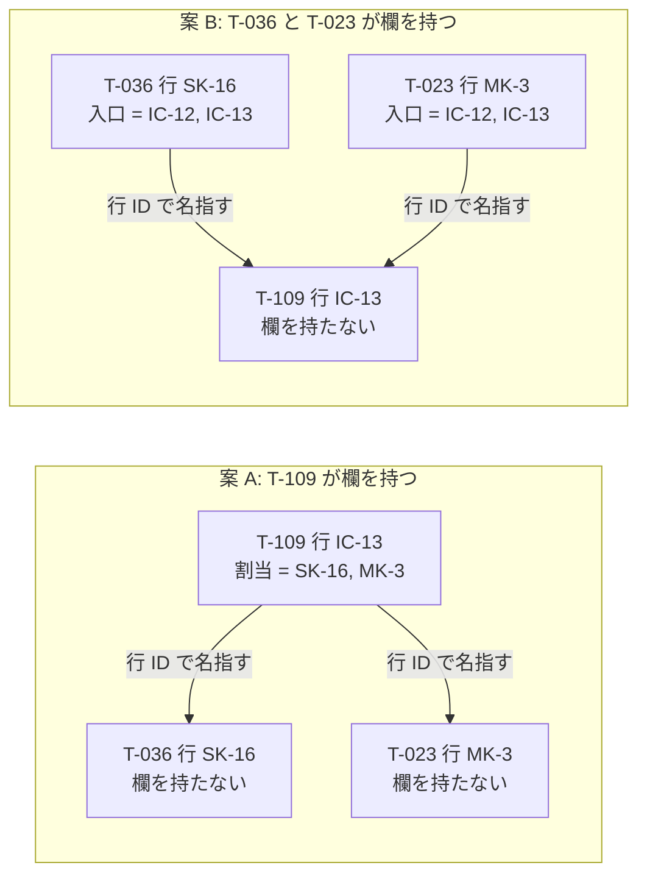
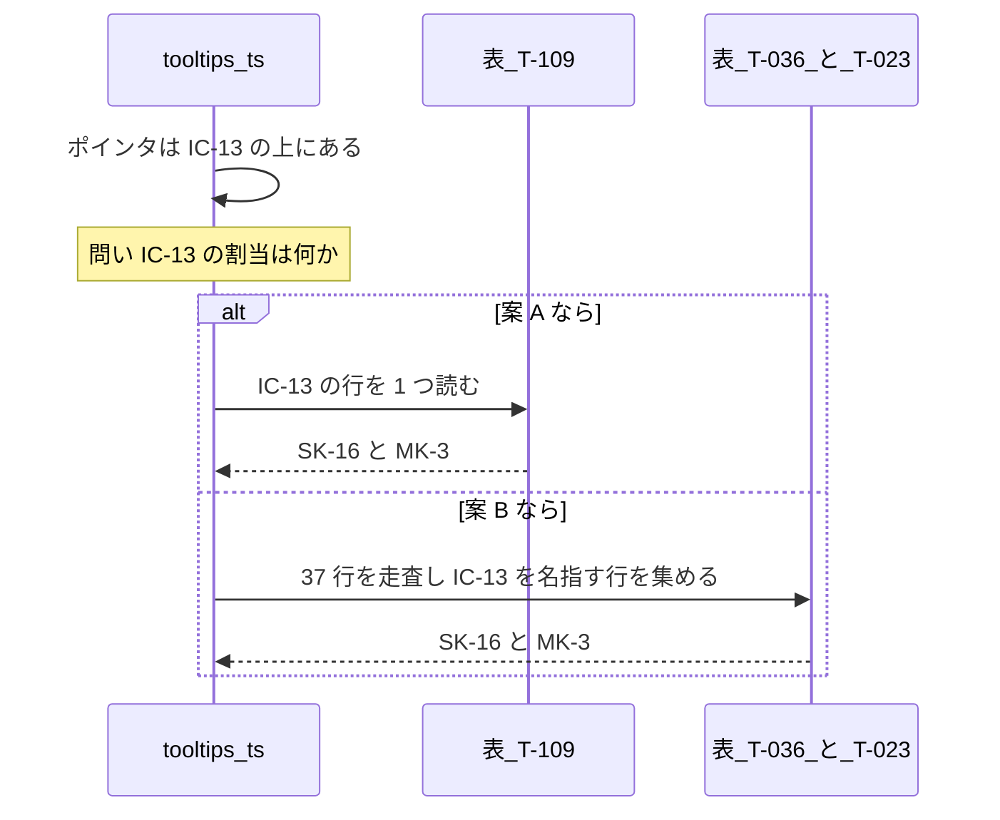
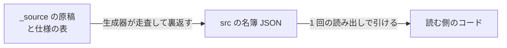
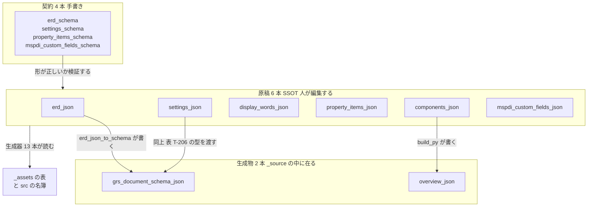
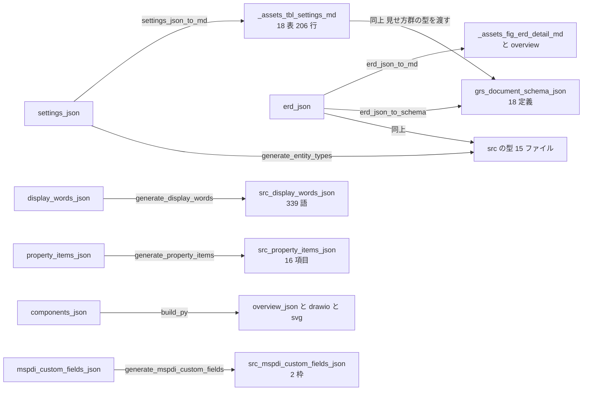
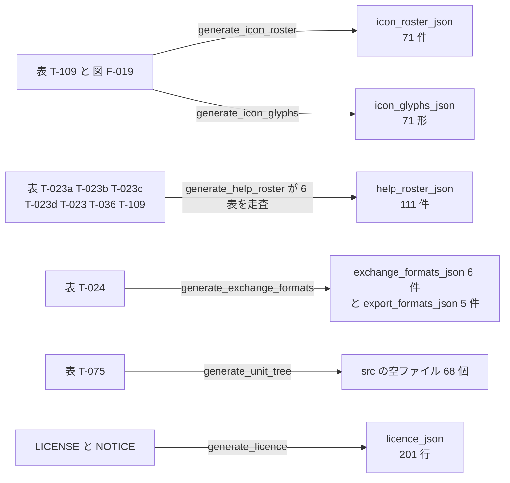
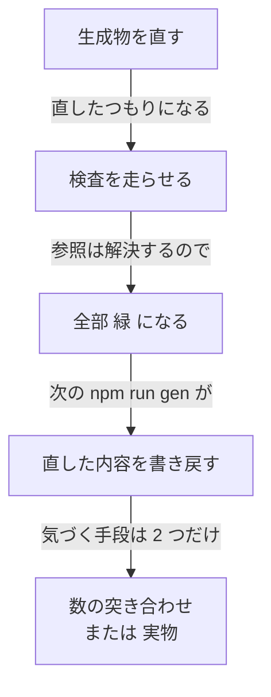

# `docs/spec/_source/*.json` の棚卸しと、「引く向き」の説明

**測定日**: 2026-08-29 / **測定者**: 前に立つ者 / **測り方**: 全ファイルを機械で読み、`npm run gen` の実出力と突き合わせた。

> ⚠️ **本書は調査記録であり、仕様ではない。** 数はすべて実測であり、推測は「未確認」と明記した。

---

## 1. 「引く向きが逆」とは何か

`D-122` の裁定で私が使った言い方の説明である。**同じ 1 つの事実を、どちらの表に書くか**という話で、事実そのものは変わらない。

結びたい事実は 1 つ:

> **`IC-13`（時間軸を拡大する入口）の割当は `SK-16`（`Shift` ＋ `+`）と `MK-3`（`Shift` ＋ ホイール）である**

これを **表 T-109 の側に書く**（案 A）か、**表 T-036 / T-023 の側に書く**（案 B）かで、読み出しの向きが変わる。

**事実をどちらに書くか:**



矢印の向きが「どちらの行が相手を名指すか」である。事実は同じでも、**書かれる場所が反対**になる。

**ツールチップが問う向き:**



⭐ **ツールチップは必ず「アイコンから割当へ」問う。**案 A はその向きにそのまま並んでいるので 1 行読めば済む。案 B は**書いてある向きが逆**なので、集めるために全行を走査して裏返す必要がある。これが「引く向きが逆」の意味である。

### ⭐ ただし、これは案 B の欠点として重く数えなかった

**裏返しは、この計画が既に 3 回やっていることだからである。**



`help-roster.json` は今まさにこれをしている —— 6 つの表を走査し、**111 件**を 1 本の配列に並べ直して `src/` へ置く。同じ形の生成物が `icon-roster.json`（71 件）、`export-formats.json`（5 件）にもある。⇒ **裏返す費用は「生成器 1 本」であり、表の形を決める理由には足りない。**

---

## 2. `_source/*.json` の全体像 —— **12 ファイル、3 つの役**

各ファイルは**自分の役を `$comment` に書いている**（`grs-document.schema.json` だけ `description` に書く）。役は 3 つしかない。

| 役 | 何を意味するか | 件数 |
|---|---|--:|
| **原稿（SSOT）** | ⭐ **人が編集する。**ここから生成物が出る | **6** |
| **契約（手書き）** | ⭐ **原稿を検証する。**何からも生成されず、何も生成しない | **4** |
| **生成物** | ⛔ **手で編集してはならない。**`_source` に置かれているが出力である | **2** |

**役ごとの流れ:**



⛔ **`_source` は「原稿だけの場所」ではない。**生成物が 2 本混ざっている。だから**ファイルごとに自分の役を宣言する**という約束になっている。

---

## 3. 原稿 6 本 —— **人が編集してよい唯一の場所**

| ファイル | 大きさ | 中身（実測） | ここから出るもの |
|---|--:|---|---|
| `settings.json` | 114 KB | **36 塊 / 206 行 / 18 の番号付き表**（`T-201`〜`T-217`, `T-236`）| `_assets/tbl-settings.md`、`src` の `SETTINGS_DEFAULTS` / `SETTINGS_BOUNDS` と `NOT_STORED_*` |
| `erd.json` | 68 KB | **18 実体 / 138 列 / 22 関連** | `_assets/fig-erd-detail.md`、`fig-erd-overview.md`、`grs-document.schema.json`、`src` の実体型 |
| `display-words.json` | 50 KB | **19 節 / 339 語**（＝ 項目 × 語の欄。言語の対ではない）| `src/adapter/screen-renderer/display-words.json` |
| `components.json` | 28 KB | **38 節点 / 89 辺 / 4 視点** | `overview.json`、`fig-components.drawio`、`view-*.drawio`、`.svg`、`docs/review/components/components.md` |
| `property-items.json` | 5.0 KB | **16 項目**（表 T-016）。**配列の順が印刷順である** | `_assets/tbl-property-items.md`、`src` の `property-items.json` |
| `mspdi-custom-fields.json` | 2.6 KB | **2 枠**（`fadeInDays` / `fadeOutDays` を運ぶ MSPDI の借り枠）| `src/adapter/document-codec/mspdi-custom-fields.json` |

⚠️ **`mspdi-custom-fields.json` の値は引用であって GRS の決定ではない**と、そのファイル自身が述べている。

**`settings.json` の 1 行の形:**

```json
{
  "id": "S-205",
  "value": { "ja": "`Scrollbars` の太さの下限（`FR-051`）" },
  "default": { "num": "8", "suffix": "px", "mark": "🔎" },
  "note": { "ja": "⛔ **太さそのものではない** —— ..." }
}
```

⭐ **本巡（CR-284）で足した行である。**`id` / `value` / `default` / `note` が `_assets/tbl-settings.md` の 1 行になる。**生成物の側を直しても次の `npm run gen` で消える** —— 本巡で 4 回踏んだ穴がこれである。

---

## 4. 契約 4 本 —— **原稿を門前で止めるためだけに在る**

| ファイル | 検証する相手 |
|---|---|
| `settings.schema.json` | `settings.json` |
| `erd.schema.json` | `erd.json` |
| `property-items.schema.json` | `property-items.json` |
| `mspdi-custom-fields.schema.json` | `mspdi-custom-fields.json` |

⭐ **4 本とも「何からも生成されず、何も生成しない」と自分で宣言している。**
⭐ **存在理由**: 境界や型や言語を欠いた原稿を、**黙って誤った生成物にする前に拒む**ため。
⛔ **`display-words.json` と `components.json` には契約が無い**（実測）。両者は生成器自身が検査している。

---

## 5. 生成物 2 本 —— **`_source` に在るが編集してはならない**

| ファイル | 誰が書くか | 何から |
|---|---|---|
| `grs-document.schema.json` | `erd_json_to_schema.py` | `erd.json`（日程データ群）＋ `_assets/tbl-settings.md`（見せ方群）。**18 の定義** |
| `overview.json` | `build.py` | `components.json`。**38 節点 / 9 辺** |

⚠️ **`grs-document.schema.json` は `$comment` を持たず、`description` に「Never edit by hand」と書く。**⛔ **他の 11 本と宣言の置き場が違う**ので、機械で役を判定するときは両方を見る必要がある。

⭐ **`overview.json` は `components.json` の 89 辺を 9 辺へ畳んだもの**である（概観図）。

---

## 6. 誰が誰を読むか —— **生成器 13 本**

**原稿から生成物への流れ:**



**仕様の表から `src` の名簿への流れ（原稿を経由しないもの）:**



⭐ **`help-roster.json` が「裏返し」の実例である** —— 6 つの表を走査して 111 件の 1 本の配列にする。⇒ **§1 で述べた案 B の費用は、この 1 本と同じ形である。**

⚠️ **未確認**: 上の対応は `npm run gen` の実出力と各生成器の定数から取った。**生成器が名前を単に言及しているだけの箇所と、実際に読んでいる箇所を機械では区別していない** —— `generate_help_roster.py` が `settings.json` を読むかどうかは確かめていない。

---

## 7. 本巡（2026-08-29）で `_source` に入った変更

| ファイル | 変更 | 変更要求 |
|---|---|---|
| `settings.json` | ⛔ `S-112`（`autosaveIdleMs`）を削除 | CR-280 |
| `settings.json` | `S-203`（ヘルプの字 0.80）・`S-204`（Tips の字 0.875）を新設 | CR-282 |
| `settings.json` | `S-35` を **24 → 48** | CR-283 |
| `settings.json` | `S-205`（スクロールバーの太さの下限 8px）を新設 | CR-284 |
| `display-words.json` | ⛔ `IC-55`〜`IC-57` / `QN-6` / `QN-7` / `RS-17` / `RS-18` を削除 | CR-280 |
| `display-words.json` | `fileStatus` の節、`SK-21` の語 | CR-280 |
| `display-words.json` | `exportFormats` の節（5 形式） | CR-281 |
| `display-words.json` | `assignments` に `press` の欄（14 行）＋ `text` を動作だけに縮めた | CR-282 |

⇒ **語は 330 → 320 → 325 → 339。**行は 1720 → 1701 → 1703 → 1704。

---

## 8. ⛔⛔ 本巡で 4 回踏んだ 1 つの穴



| 踏んだもの | 何を直せばよかったか | 変更要求 |
|---|---|---|
| `S-112` | `_assets/tbl-settings.md` ではなく **`_source/settings.json`** | CR-280 |
| 表 T-024 の語 | 直接書けない。**`_source/display-words.json` に節を作る** | CR-281 |
| `S-203` | 表に足すだけでは届かない。**`generate_entity_types.py` の名簿にも足す** | CR-282 |
| `S-205` | 同上。しかも**生成器は `single-html-shell.ts` へは 1 行も書かない** | CR-284 |

⭐⭐ **4 回とも「検査 28 本は全部緑」であった。**⛔ **捕まえたのは、数の予測との突き合わせと、実物を開くことだけである。**
