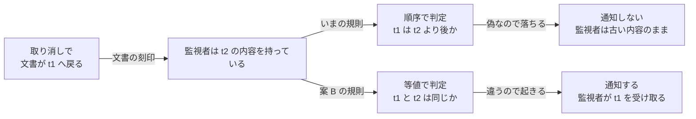
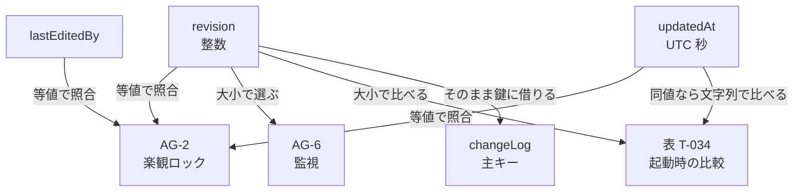
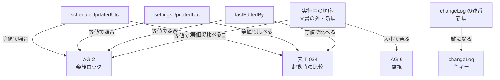
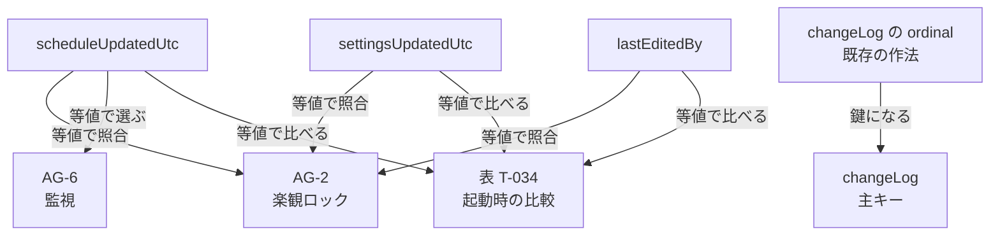

# 刻印の裁定を KISS で組み直す（2026-08-22）

⭐ **本書は `docs/review/stamp-and-utc-2026-08-22.md` の続きであり、裁定 1 〜 9 を受けた後の棚卸しである。**
⛔ **本書も記録であって仕様書ではない。仕様のオブジェクトは 1 つも動かない。**
⚠️ **利用者の指示により、裁定 10 の途中で立ちどまって組み直した**（`R2.8` KISS）。

---

## 0. なぜ止まったか —— 数えた結果

**積み上がったものの棚卸し:**

| | 現状（裁定前） | 案 A（裁定 1 〜 9 の積み上げ） |
|---|---|---|
| 文書の中の刻印の値 | **3**（`revision` / `lastEditedBy` / `updatedAt`） | **3**（`scheduleUpdatedUtc` / `settingsUpdatedUtc` / `lastEditedBy`） |
| `changeLog` の鍵 | ⚠️ **刻印の `revision` を借りている**（自前の鍵を持たない） | **自前の連番 1 本（新規）** |
| 文書の外に持つ値 | **0** | **実行中の順序 1 本（新規）** |
| 値の合計 | **3** | ⛔ **5** |
| 新しく作る概念 | — | ⛔ **2** |
| 判定の種類 | 等値 1・**順序 2**・一意性 1 | 等値 2・**順序 1**・一意性 1 |

⭐ **順序に依る判定は 2 から 1 へ減った。** ⛔ **しかし値は 3 から 5 へ増え、新しい概念を 2 つ作った。**

⚠️ **利用者の裁定は「いま 1 つの値で 2 つのものを追っていることの解消」であって、値を増やすことではない。**
⛔ **整数の連番を 1 本消して、整数を 2 本増やしたことになる。** ⭐ **止めた判断は正しい。**

---

## 1. KISS の問い —— 順序は本当に要るのか

⛔ **4 つの判定を 1 つずつ当たる。仕様の文をそのまま読む。**

| 判定 | 仕様の文（逐語） | それは順序か |
|---|---|---|
| **`AG-2`** 楽観ロック | 「書き込む側が**どの版を読んで書いているか**を申告でき、**食い違えば**書き込みを拒否して現在の文書を返すこと（MUST）」 | ⛔ **順序ではない。等値である** |
| **表 T-034** 起動時 | 「同じ文書で自動保存のほうが**新しければ**確認を求める」 | ⭐ **裁定 4 で既に等値に決めた** |
| **`changeLog`** の鍵 | `AT-130`「**どの版に対する理由か**」 | ⛔ **順序ではない。一意性である** |
| **`AG-6`** 監視 | 「**自分がまだ受け取っていない**、自分以外の書き手が確定した変更と発話**だけ**を通知すること」 | ⚠️ **ここだけ順序に見える** |

### 1.1 ⭐ `AG-6` を読み直す

⛔ **「まだ受け取っていない」は順序ではない。受け取ったかどうかである。**
⭐ **監視者が「最後に手渡された刻印」を覚えていれば、いまの刻印がそれと違うかどうかで答えが出る。**

**AG-6 の判定を等値へ移したときの実装の差:**

```typescript
// いま（src/use-case/notify-change-watchers/change-notice.ts）
export interface WatcherMark {
  readonly seenRevision: number
  readonly seenSequence: number
}
const changed = stamp.revision > seen.seenRevision && stamp.lastEditedBy !== watcher

// 案 B
export interface WatcherMark {
  readonly seenScheduleUpdatedUtc: string
  readonly seenSequence: number
}
const changed =
  stamp.scheduleUpdatedUtc !== seen.seenScheduleUpdatedUtc && stamp.lastEditedBy !== watcher
```

⭐ 新しい関数を 1 つも作らない。比較演算子が `>` から `!==` に変わり、覚える値が数から文字列に変わるだけである。⛔ 実行中の順序も、その配布経路も要らなくなる。

---

## 2. ⭐ 等値のほうが単純なだけでなく、**正しい**

⛔ **取り消し（`FR-031`）で証明できる。** 取り消しは、段に持っている「以前の `Document`」を刻印ごと復元する（`undo-edit.ts:33-43` の `STOP`）。

**取り消しが起きたときの 2 つの場合:**

| | 監視者が持っているもの | 文書が戻った先 | 順序で判定（いま） | 等値で判定（案 B） |
|---|---|---|---|---|
| **場合 A** | `t2` の内容（`t2` を受け取り済み） | `t1`（`t2` より前） | ⛔ **`t1 > t2` は偽 → 通知しない。**監視者は古い内容を持ち続ける | ⭐ **`t1 !== t2` は真 → 通知する。正しい** |
| **場合 B** | `t1` の内容（`t2` を受け取っていない） | `t1` | ⭐ 通知しない（正しい） | ⭐ **通知しない。文書は監視者が持っているものと同じである。正しい** |

⭐ **等値は 2 つとも正しく答える。順序は場合 A を落とす。**
⛔ **これは `AG-6` の MUST（まだ受け取っていない変更だけを通知する）の違反である。**
⚠️ **いま実害が出ていないのは、取り消しが `WS-6` へ届く経路がまだ無いからである**（`CR-196` の §0 が「決めていないこと」として記録している）。

**取り消しのときの判定の分かれ方:**



順序は「後か」を問うので、戻った文書を「新しくない」と読んで落とす。等値は「同じか」を問うので、戻ったことをそのまま変化として捉える。⛔ **壁時計が逆行した場合も、これとまったく同じ形で落ちる。**

---

## 3. 案 B —— 刻印は**同一性**だけを担う

⭐ **すべての判定を等値に統一する。刻印は順序を一切担わない。**

| 判定 | 見るもの | 規則 |
|---|---|---|
| `AG-2` 楽観ロック | ①②③ の **3 つ** | 1 つでも違えば拒否する |
| `AG-6` 監視 | ① **だけ** | 最後に手渡された ① と違えば通知する |
| 表 T-034 起動時 | ①②③ の **3 つ** | 1 つでも違えば確認を求める（裁定 4） |
| `changeLog` の鍵 | `ordinal` | 文書の中での出現順（§4） |

### 3.1 ⭐ ① と ② が、それぞれ 1 つの仕事を持つ

```
① scheduleUpdatedUtc   日程データの群が動いた刻   → 監視（AG-6）が見る
② settingsUpdatedUtc   見せ方の群も含めて動いた刻 → 照合（AG-2）が ①③ と一緒に見る
③ lastEditedBy         最後に書いた者             → 「自分以外か」を判定する
```

⭐ **これが利用者の狙い「1 つの値で 2 つのものを追っていることの解消」そのものである。**
⛔ **いまは `revision` 1 本が「監視の鍵」と「更新の回数」の 2 つを担っていた。**

### 3.2 ⛔ `AG-6` が ①②③ を全部見てはならない理由

⚠️ **見せ方の群への書き込みは 1 秒に何十回も起きる**（ホイールを 1 回転させれば `setZoom` と `setScrollPosition` が `WS-1` 〜 `WS-7` を何十回も通る。§2.2 の実測）。
⛔ **`AG-6` が ② を見ると、全監視者がそのたびに起きる。** `AG-6` の「**だけ**」に反する。
⭐ **① だけを見れば、いまの振る舞い（見せ方の群だけの更新では監視が起きない）がそのまま保たれる。**
⚠️ **これを明文で禁じる MUST は無い。** ⭐ **しかし変更が最も小さく、`FR-063` の群の分けとも揃う。**

---

## 4. ⭐ `changeLog` の鍵は、新しい概念ではなかった

⛔ **`erd.json` を全数で測ったところ、同じ形の主キーが 3 つ既に在った。**

**測った値 — 18 実体の主キー:**

```text
Task            PK = uid
TaskGroup       PK = id
Calendar        PK = uid
WeekDay         PK = ordinal      <- 親の中での出現順
Exception       PK = ordinal      <- 親の中での出現順
Resource        PK = uid
Assignment      PK = uid
CommentBox      PK = id
HighlightBox    PK = id
CarryElement    PK = ordinal      <- 所有者の中での出現順
BaselineTask    PK = uid
changeLog       PK = revision     <- ここだけ、刻印の値を借りている
Project / Dependency / TaskGroupMember / TaskVisual / TaskOrigin / revisionStamp   PK なし
```

`ordinal` を主キーに持つ実体が 3 つある。意味欄はいずれも「親（所有者）の中での出現順」であり、`Calendar` も鍵ではない列として同じ `ordinal` を持つ。⛔ **`changeLog` だけが自前の鍵を持たず、刻印の値を借りていた。**

⭐ **裁定 3 は生きる。** ⛔ **ただし「新しい連番を作る」のではなく、「3 つの先例と同じ `ordinal` を置く」である。**
⚠️ **新しい概念は 0 になる。** ⭐ **`changeLog` は JSON では配列であり、`ordinal` はその並びそのものである。**

---

## 5. 3 案の比較

**現状（裁定前）の判定の依存:**



`revision` 1 本が 4 つの判定すべてに刺さっている。⛔ そのうち 2 つ（`AG-6` と起動時）は順序であり、順序を日時へ移すと逆行と同刻衝突がそのまま欠落になる。

**案 A（裁定 1 〜 9 の積み上げ）の判定の依存:**



順序に依る判定は `AG-6` の 1 つに減る。⛔ その代わり、文書の外に 1 本・`changeLog` に 1 本、値が増える。⚠️ さらに `AG-2` の照合値が文書の刻印と一致しなくなり、公開面（`AM-4`）の問いが開く。**これが裁定 10 で止まった地点である。**

**案 B（KISS。すべて等値）の判定の依存:**



矢印のラベルが「等値」だけになる。⭐ **順序という判定が製品から消える。** 文書の外に持つ値は 0 で、`AM-4` は文書の刻印をそのまま返す。

**3 案を数で並べる:**

| | 現状 | 案 A | 案 B |
|---|:---:|:---:|:---:|
| 刻印の値 | 3 | 3 | **3** |
| `changeLog` の鍵 | 借り物 | 新規 1 | **既存の作法 1** |
| 文書の外の値 | 0 | 新規 1 | **0** |
| 新しく作る概念 | — | 2 | ⭐ **0** |
| 判定の種類 | 等値・順序・一意性 | 等値・順序・一意性 | ⭐ **等値・一意性** |
| 壁時計が順序を決める場所 | 1（起動時） | 0 | ⭐ **0** |
| 公開面（表 T-064 / T-107）が動くか | — | ⛔ **動く**（`AM-4`） | ⭐ **動かない** |
| 取り消しで通知が落ちるか | ⛔ **落ちる** | ⛔ **落ちる**（順序のまま） | ⭐ **落ちない** |

⛔ **案 A が案 B より優れている点は 1 つだけである** —— 同刻衝突を完全に閉じられること（§6）。

---

## 6. ⭐ 裁定 11 —— 同刻衝突は **後勝ち**（利用者の裁定 2026-08-22）

⭐ **利用者の指示: 「後勝ちか先勝ちか、シンプルな方に決めろ」。⛔ 答えは後勝ちである。**

### 6.1 ⛔ 先勝ちは、そもそも選べない

先勝ちとは「同じ刻の 2 回目を拒否する」ことである。
⛔ **しかし 2 回目を「同じ刻の 2 回目」と見分けるには弁別子が要り、その弁別子こそ案 B が取り除いた実行中の順序である。**
⭐ **先勝ちを選ぶことは、案 A を選び直すことと同義である。** ⛔ **したがって「シンプルな方」は後勝ちで確定する。**

### 6.2 ⭐ 後勝ちには、仕様の側の根拠が 3 つある

| | 根拠 |
|---|---|
| **1** | ⭐ **`FR-063` が「**最後に**書いた者と時刻」と書いている。**「最後」という語が既に後勝ちを宣言している |
| **2** | ⭐ **表 T-067 の `WS-6` が「差し替えは 1 つの参照の置き換えとすること（MUST）」と定める。**後から来た文書が前を置き換える |
| **3** | ⭐ **追加の値 0・追加の規則 0。**案 B がそのまま後勝ちである |

### 6.3 ⭐ 後勝ちの実害は「上書き」ではない —— **「1 秒ぶん古い判断」だけである**

⛔ **実測して分かった**（`src/use-case/apply-document-change/document-change-plan.ts:174`）:

```typescript
// WS-3 は現在の文書から組み立てる。申告された古い文書からではない。
let held = input.document
for (const command of input.commands) {
  const result = editDocument(held, command, input.settingsLimits)
  if (!result.ok) { refusals.push(...result.refusals); continue }
  held = result.document
}
```

`AG-2` の照合をすり抜けた書き込みも、**現在の文書の上に**適用される。⛔ **古い文書の上には適用されない。**
⚠️ **したがって、同刻衝突で通った書き込みが、誰かの直前の変更を消すことはない。**
⭐ **起きるのは「その書き手が最大 1 秒ぶん古い情報で判断した」ことだけである。**

⭐ **そして、① を動かさずに 1 秒に何十回も起きるのは見せ方の群の書き込みだけである**（ズーム・スクロール・パン）。
⛔ **それらは、AI の判断が依っている日程データを 1 バイトも変えない。** ⭐ **後勝ちの実害はここで頭打ちになる。**

### 6.4 ⛔ ただし `AG-6` だけは、放置すると先勝ちになる

**同じ書き手が同じ刻に日程データを 2 回書いたとき:**

| | 起きること | 監視者が最後に持つ内容 |
|---|---|---|
| 書き込み 1 | ① が `t0` から `t` へ動く → 通知が出る | **書き込み 1 の文書** |
| 書き込み 2 | ① は `t` のまま → **通知が出ない** | ⛔ **書き込み 1 の文書のまま**（先勝ち） |

⛔ **`AG-2` が後勝ち、`AG-6` が先勝ちでは、規約が自分と食い違う。**

⭐ **直し方は、値を 1 つも増やさずに済む** —— **`WS-5` が既に計算している真偽値を `WS-7` へ渡すだけである。**

```typescript
// いま: 通知の側が、WS-5 が既に出した答えを刻印から導き直している
const changed = stamp.revision > seen.seenRevision && stamp.lastEditedBy !== watcher

// 案 B + 後勝ち: WS-5 の答えをそのまま使う
//   document-change-plan.ts:212 が既にこう計算している
//     const raisedRevision = held.schedule !== input.document.schedule
//   ⛔ いまはこれが notifyChangeWatchers へ渡っていない（ConfirmedChange が持たない）
const changed = confirmed.hasMovedSchedule && stamp.lastEditedBy !== watcher
```

⭐ **`R2.7`（DRY）にも適う** —— 同じ判定が 2 か所で別々に導かれていた。⭐ **枝の参照の比較のほうが、日時の比較より正確でもある。**
⚠️ **`ConfirmedChange` は `src/` の型であり、表 T-064 の `PI-15` はメンバ名しか持たない**（`CR-146` が「署名の持ち主は `src/` である」と定める）。⛔ **仕様の表は 1 行も動かない。**

**後勝ちになったことの確認（4 つの場合すべて）:**

| 場合 | 判定 | 監視者が最後に持つ内容 | 後勝ちか |
|---|---|---|:---:|
| 同じ刻に日程を 2 回 | どちらも `hasMovedSchedule` が真 | **書き込み 2 の文書** | ⭐ **はい** |
| 見せ方の群だけの書き込み | `hasMovedSchedule` が偽 | 変わらない（通知が出ない） | ⭐ **いまの振る舞いのまま** |
| 自分の書き込み | `lastEditedBy` が自分 | 変わらない | ⭐ **`AG-6` の MUST NOT を守る** |
| 再購読（`since`） | 持っている ① と現在の ① の等値 | **現在の文書** | ⭐ **はい** |

⛔ **`WatcherMark` は再購読のために ① を持ち続ける。**⭐ **生の通知は `hasMovedSchedule` で、再購読は ① の等値で判定する。どちらも後勝ちである。**

---

## 7. どの裁定が生き、どれが覆るか

| 裁定 | 内容 | 案 B での扱い |
|:---:|---|---|
| **1** | `AG-6` の鍵を刻印の外の順序へ | ⛔ **覆る。**生の通知は `WS-5` の真偽値、再購読は ① の等値。⭐ **狙い（壁時計を順序の鍵にしない）は達成される** |
| **2** | その順序は文書の外（実行中だけ） | ⛔ **問いごと消える**（順序を作らない） |
| **3** | `changeLog` に自前の連番 | ⭐ **生きる。**⛔ **ただし「新規の連番」ではなく `ordinal`（3 つの先例と同じ作法）である** |
| **4** | 起動時は刻印が違えば確認を求める | ⭐ **生きる。**⭐ **案 B はこれを 4 つの判定すべてに広げたものである** |
| **5** | `AG-2` の照合に実行中の順序を加える | ⛔ **覆る。**照合は ①②③ の 3 値のまま |
| **6** | 古い版には何も足さない | ⭐ **生きる**（影響を受けない） |
| **7** | `scheduleUpdatedUtc` / `settingsUpdatedUtc` | ⭐ **生きる** |
| **8** | `changedUtc` / `settledUtc` に揃える | ⭐ **生きる** |
| **9** | 器を `documentStamp` に改める | ⭐ **生きる** |
| **10** | `AM-4` が返すもの | ⭐ **問いごと消える。**`readStamp` は文書の刻印 3 値をそのまま返す |
| **11** | 同刻衝突は後勝ち | ⭐ **確定**（§6） |

---

## 8. ⭐ 決着した設計（**刻印の側は、これで全部**）

**文書が持つもの:**

```text
documentStamp                        ルート直下（DR-4）
  scheduleUpdatedUtc   ISO 8601・UTC 日程データの群が動いた刻
  settingsUpdatedUtc   ISO 8601・UTC どちらの群であれ動いた刻
  lastEditedBy         文字列        最後に書いた者
changeLog[]                          ルート直下（DR-4）
  ordinal              整数・PK      文書の中での出現順（WeekDay / Exception / CarryElement と同じ作法）
  editedBy / explanation / changedUtc
schemaVersion                        ルート直下（DR-4。変えない）
```

**4 つの判定:**

```text
AG-2  楽観ロック   刻印 3 値の等値。1 つでも違えば拒否
AG-6  監視         生: WS-5 の「日程データの群が動いたか」＋「自分以外か」
                   再購読: 持っている scheduleUpdatedUtc との等値
表 T-034 起動時    刻印 3 値の等値。1 つでも違えば確認を求める
changeLog の鍵     ordinal
衝突              後勝ち（§6）
```

⭐ **順序という判定は 1 つも残らない。壁時計が順序を決める場所は 0 になる。**
⭐ **文書の外に持つ値は 0。公開面（表 T-064 / T-107）は 1 行も動かない。**

---

## 9. ⛔ 次にやること

```
1. この設計で変更要求を書く（規則 02 の手順。閉路 A と閉路 B は 1 つの計画で 1 度に書く）
   ⚠️ 触る対象: FR-063 / AG-2 / AG-6 / AG-11 / DR-4 / FR-066 / 表 T-034 /
                _source/erd.json（revisionStamp → documentStamp、changeLog の鍵）
   ⭐ 数の予測（tables / figures / rows / uids）を必ず入れる

2. 日付系（B-1 〜 B-5）を 1 件ずつ問う
   ⛔ 刻印とは別の閉路である（induced.py で種 26 まで広げても閉路は 2 つのまま）
   ⭐ 最も重いのは B-1（FR-046 の「本日」が誰のゾーンの本日か）

3. ⚠️ 積み残し 2 件を裁定待ちの一覧へ
   ・AT-128（lastEditedBy）の値域 —— 意味欄は「人か、AI か」の 2 値だが
     startup-template.json に "template" が既に在り、AI が 2 体在れば同じ文字列になる
   ・裁定 6 の帰結 —— 開発中の JSON と試験の固定データが「壊れた文書」として報告される
```
