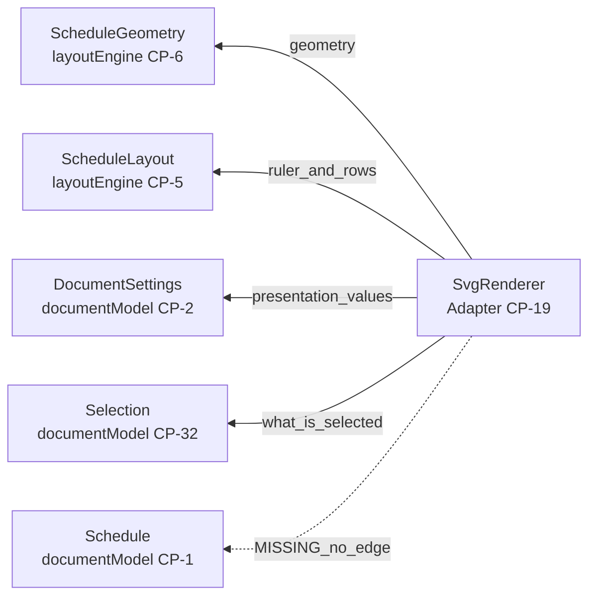
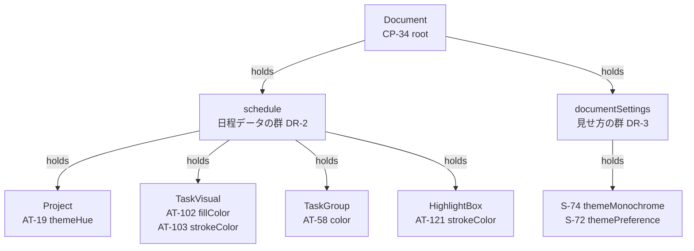
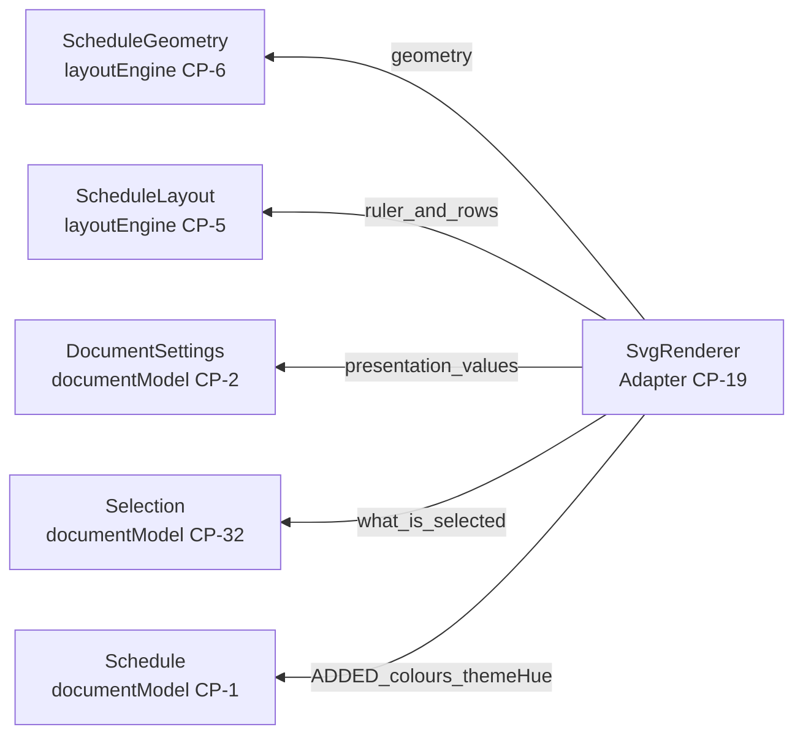
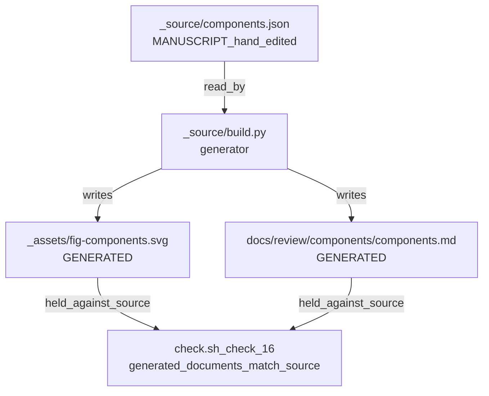
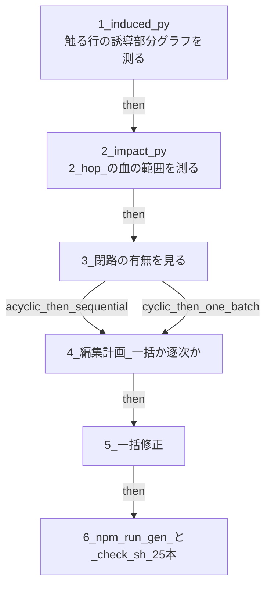

# `SvgRenderer` が色に届かない —— 調査レポート

**日付**: 2026-08-18 ／ **版**: 仕様 0.61 ／ **波**: W4（`src/adapter`）着手前
**きっかけ**: 縦線の 1 本目 `UF-32`（`svg-renderer.ts`）を書こうとして、渡せる引数に色が 1 つも無いことに気づいた。

⚠️ **本書は調査の記録である。仕様ではない。** 直し方は変更要求（`change-request/`）が持つ。

---

## 1. 結論

⛔ **`SvgRenderer` は、いま宣言されている依存だけでは 1 本のバーも正しい色で描けない。**

⭐ **原因は 1 つで、`_source/components.json` に `SvgRenderer → Schedule` の辺が無いことである。**
⚠️ **幾何（`ScheduleGeometry`）が色を代わりに運んでいる、という逃げ道も無い** —— 実測で色の綴りが 0 件だった。

⭐ **仕様の言葉は 3 つとも同じ案を指している**（本書 6.）。**辺を 1 本足す案である。**

---

## 2. 測ったこと（3 件とも自分で開いて数えた）

| # | 何を測ったか | 結果 |
| --- | --- | --- |
| 1 | `_source/components.json` の `SvgRenderer` から出る辺 | **4 本**（`ScheduleGeometry` / `ScheduleLayout` / `DocumentSettings` / `Selection`）。⛔ `Schedule` への辺は無い |
| 2 | `themeHue` の置き場 | **`Project.themeHue`**（`AT-19`）。⛔ 表 T-052 の `DR-5` が「**見せ方の群が持ってはならない（MUST NOT）**」と明記 |
| 3 | `schedule-geometry.ts` と `schedule-layout.ts` に現れる `color` の綴り | **0 件**（`grep -c` で両ファイルとも 0） |

**現状の辺:**

実線 4 本が `_source/components.json` に在る辺である。破線は**存在しない辺**を示すために本書が描いたものであり、原稿には無い。

---

## 3. 色を持っている列は、すべて届かない側に在る

**色の列の置き場:**

⭐ **見せ方の群にあるのは「明暗」と「モノクロか」だけである。** `SvgRenderer` はそこへは辺を持っている。
⛔ **色そのもの（色相・個別の指定色）はすべて日程データの群にあり、そこへは辺が無い。**

**したがって描けないものの全数:**

| 描けないもの | 値の在り処 | 規則の持ち主 |
| --- | --- | --- |
| テーマ色に追随するバー・行の帯・地の色 | `Project.themeHue`（`AT-19`） | `FR-041` |
| 人が指定したタスクの線色・塗り色 | `TaskVisual.strokeColor` / `fillColor` | `FR-007` |
| 行の帯の色（指定した側） | `TaskGroup.color`（`AT-58`） | `FR-042` |
| ハイライトボックスの枠の色 | `HighlightBox.strokeColor`（`AT-121`） | `FR-019` |

⚠️ **依存線とイナズマ線の固定色、および注記の固定色は、この表に入らない** ——
`FR-041` が「**依存線とイナズマ線は同じ固定色とし、文書に保存しないこと（MUST NOT）**」と定めており、
`FR-019` の注記の固定色も同じく文書に持たない。**この 2 つは `SvgRenderer` が定数として持てる。**

---

## 4. なぜ気づかれずに来たか（推測ではなく、原稿の形から言えること）

`_source/components.json` の 4 本の辺には、それぞれ英語の `description` が付いている。

- `ScheduleGeometry` —— `reads geometry only, never the write path`
- `ScheduleLayout` —— `reads the ruler and the row placement`
- `DocumentSettings` —— `reads the presentation values`
- `Selection` —— `shows the selection by more than colour`

⭐ **4 本とも「形と位置」の語で書かれている。** ⚠️ **`Selection` の辺だけが `colour` の語を含むが、
それは「色だけで伝えてはならない」という別の規則（`FR-030`）を指しており、色の供給元ではない。**

⛔ **`ScheduleGeometry` が「描くもの」を全部持っていると読めたことが、辺の漏れを隠したと考えられる。**
実際には 表 T-060 の `LY-2` が `layoutEngine` の守備範囲を「矩形・対応・配置・**頂点**・増減・当たり判定」と
列挙しており、**色は 1 語も入っていない。** 漏れは `components.json` の側だけである。

⚠️ **これは推測を含む段落である。** 確実なのは「辺が無い」ことと「幾何に色が無い」ことの 2 つだけである。

---

## 5. 案の比較

| | 案 | 何をするか | 代償 |
| --- | --- | --- | --- |
| **(a)** | ⭐ **辺を 1 本足す** | `_source/components.json` に `SvgRenderer → Schedule` を足し、`SvgRenderer` が自分で色を解く | 原稿を触るので `fig-components.svg` と `docs/review/components/components.md` の再生成を伴う。**受入済の W1 / W2 には 1 行も触らない** |
| **(b)** | 幾何に色を載せる | `ScheduleGeometry` が解決済みの色を運ぶ | ⛔ 5.1 の「`layoutEngine` は座標までしか持たない」に正面から反する。受入済（W2）の型・実装・試験が動く。色を解く規則（`FR-041` / `FR-007` / `FR-042`）の持ち主が `layoutEngine` へ移る |
| **(c)** | シェルが色だけ渡す | `SingleHtmlShell` が `Schedule` から色を取り出して渡す | ⛔ 色を解く規則の持ち主が `Framework` へ漏れる。表 T-060 の `LY-5` は `Framework` を「現在値を保持する」層と定めており、規則を持つ層ではない |

**案 (a) を採ったあとの辺:**

⭐ **足すのは 1 本だけである。** 層をまたぐ向きは `Adapter → documentModel` で内向きなので、
表 T-061 の `LR-1`（「内向きであれば層を飛び越してよい」）が明文で許している。
⚠️ **`LR-1` の飛び越しの実例として、5.1 は既に `SvgRenderer` を名指している。**

---

## 6. 仕様の言葉が案 (a) を指している 3 つの根拠

**根拠 1 —— 5.1 の分担の宣言（`docs/spec/05-07-design.md`）**

> 価値は「ペライチ」であり、それを成り立たせているのが `layoutEngine` の算法である。座標と当たり判定は手段ではなく本質であり、手段はむしろ描き方のほうである —— **描き方は `Adapter` が持ち、`layoutEngine` は座標までしか持たない。**

⭐ **色は「描き方」である。** したがって案 (b) は、この 1 文を書き換えない限り採れない。

**根拠 2 —— 公開メンバの名前が既に答えている**

表 T-064 の `PI-19` が `SvgRenderer` の公開メンバを **`svgFromSchedule`** と綴っている。
⭐ **`Schedule` から SVG を作る、という名前である。** ⚠️ **`svgFromGeometry` ではない。**
**名前の側は最初から `Schedule` を受け取る形を宣言していた。辺の側だけが遅れている。**

**根拠 3 —— 表 T-060 の `LY-2` に色が無い**

`layoutEngine` に置くものの列挙は「画面の各部の矩形、日付と座標の対応、`Rows` の配置、描くものの頂点、
表示量の増減、当たり判定」であり、**色を 1 語も含まない。** 案 (b) はこの列挙にも足すことになる。

---

## 7. 触るファイル（案 (a) を採った場合）

**再生成の連鎖:**

⛔ **`.svg` と `.drawio` を手で直してはならない（MUST NOT）** —— 5.2 が定めており、次の生成で消える。
⭐ **原稿を直して生成器を回すのが唯一の経路である。**

| ファイル | 何をするか |
| --- | --- |
| `docs/spec/_source/components.json` | 辺を 1 本足す（手で編集する唯一のファイル） |
| `docs/spec/_assets/fig-components.svg` | 生成物。`build.py` が書き直す |
| `docs/review/components/components.md` | 生成物。`build.py` が書き直す |
| `change-request/CR-nnn-*.md` | 新規。8 条の ①②⑧ の 3 節を持つこと（検査 22） |
| `docs/spec/A-appendix.md` | 版を 1 つ進め、変更履歴に 1 行 |

⚠️ **`docs/spec/05-07-design.md` の散文は触らなくてよい可能性が高い** ——
5.2 が「**層をまたぐ矢印は、それを裏づけるコンポーネントどうしの辺が 1 本以上あるときにだけ描かれる**（`build.py` が検算する）」
と定めており、`Adapter → documentModel` の層の矢印は `DocumentSettings` / `Selection` の 2 本で既に裏づけられているからである。
⛔ **ただしこれは未検証である。** 変更要求を書くときに `build.py` を実際に回して確かめること。

---

## 8. 影響範囲を測る手順（規則 02 と「CR: graph first」に従う）

**測る順:**

⭐ **触る行 ID の見込み**: `CP-19`（`SvgRenderer` の責務）／`PI-19`（公開メンバ）／`LR-1` の実例の文。
⚠️ **本当に触る行は `induced.py` と `impact.py` が決める。上は見込みであって結論ではない。**

---

## 9. 覆したときに落ちる試験（先に決めておくもの）

⭐ **規則 06 の 3. が「覆したとき落ちる試験を先に書いておくのが要点である」と定めている。**

| # | 試験 | 何を守るか |
| --- | --- | --- |
| 1 | `themeHue` を原稿で 1 つ変えると、`svgFromSchedule` の出す SVG の色が変わる | 値が原稿からコードへ届いていること（規則 04 の 2.） |
| 2 | `TaskVisual.strokeColor` に色を入れた `Task` が、テーマ色ではなくその色で出る | `FR-007` の「指定は上書きになる」 |
| 3 | `TaskVisual.strokeColor` が `null` の `Task` が、`themeHue` から解いた色で出る | `FR-041` の追随 |
| 4 | `themeMonochrome` が真のとき、指定色も無彩色で描かれる | `FR-041`（モノクロは描画時に効く） |
| 5 | 依存線とイナズマ線が**同じ**固定色で、`themeHue` を変えても動かない | `FR-041` の MUST NOT |
| 6 | `python tools/check_layer_rules.py` が緑 | 外向きの辺を作っていないこと（`LR-1`） |

⛔ **試験は実装した者に書かせない**（規則 04 の 1.）—— 別のエージェントに `docs/spec` だけを読ませて書かせること。

---

## 10. まだ答えが無い小問（本件と一緒に決めるのが安い）

⚠️ **以下は本調査で「仕様に見つからなかった」ものである。無いことの証明ではない。**

1. **`SvgRenderer` は `Project` 全体を受け取るのか、`themeHue` だけを受け取るのか。**
   ⭐ 表 T-064 の前書きが「引数・戻り値は `src/` の公開エントリが持つ」と定めているので、**これは `UF-32` が決めてよい。**
2. **解いた色を誰が計算するか** —— `themeHue` から予定・実績・行の帯の色を解く関数の置き場。
   ⚠️ `FR-041` / `FR-042` は規則を持つが、置き場を名指していない。`SvgRenderer` の内部で足りるかは未検証。
3. **`fig-components.svg` の再生成で図の配置が動くか** —— 動くと図の見た目の差分が大きくなる。
   ⛔ **未検証。`build.py` を回すまで分からない。**

---

## 11. 本書が主張しないこと

- ⛔ **「案 (a) が唯一正しい」とは主張しない。** 仕様の 3 つの言葉が (a) を指していることまでが本書の射程である。
- ⛔ **「他に穴が無い」とは主張しない。** 測ったのは色だけである。
- ⛔ **行番号は書かない** —— 引用は行 ID（`CP-19` / `AT-19` / `LR-1`）で引いた。行番号は版で動く。
