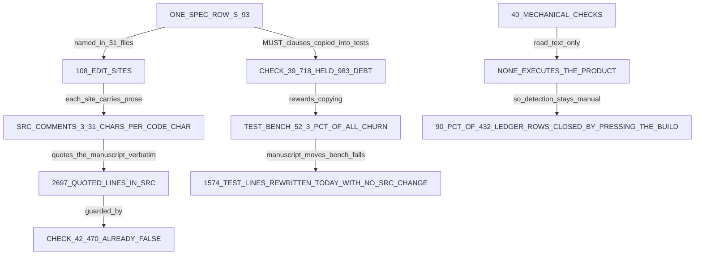

# 監査 —— なぜ 1 件直すのにこれだけ掛かるのか

**測定日**: 2026-09-10 ／ **対象**: `restart` ブランチ `fb4038e` 時点 ／ **方法**: 読み取り専用。数はすべて本書の測定者が自分で測り直した

⛔ **本書の数は 2026-08-23 の監査から写していない。**同じ量を今の木で測り直し、差分として並べた。
⛔ **数を伴わない主張は「10. 測れなかったこと」に置いた。**

---

## 0. 結論（先に）

| 問い | 答え |
|---|---|
| **律速は何か** | ① **1 行の造りに 34 行の散文が付く** ② **1 つの仕様行が中央値 13 ファイルに散っている** ③ **機械検査 40 本のうち、製品を動かすものが 1 本も無い** |
| 1 行直すのに何行書いているか | ⛔ **33.9 行**（直近 5 本の修正コミットの合計 9,016 行 ÷ `src/` に増えた実行行 266 行）。**今日の巡だけなら 35.3 行、8 件を直すのに 10,871 行** |
| 2026-08-23 から何が変わったか | ⭐ **処方 7 つのうち 6 つは着地した。**⛔ **効かなかったのではない —— 残る 1 つ（試験台の写しを禁じる）が逆向きに実装された。** 試験の変更行が全体の 23.0% → **52.3%** へ倍増している |
| いちばん先に切るもの | ⛔ **検査 39 の「逐語で持つ」定義。** 仕様の文を `tests/` へ写すことを被覆と数え、写していない 983 条項を借金と呼んでいる |

**律速を 1 枚の図にすると:**



---

## 1. 2026-08-23 の監査との差分 —— 処方は効いたのか

⭐ **当時の 7 手のうち 6 手は本当に着地している。**実測:

| 当時の手 | 今日の実測 | 判定 |
|---|---|---|
| 1. `scheduleViolations` を開く経路へ配線 | `frame-loop.ts:2315` が実際に呼ぶ。`src/` 内の言及 16 か所 | ⭐ **着地** |
| 2. 層検査の正規表現と被覆の刷り出し | 検査 19 の出力: `COVERAGE 299 of 299 import specifier(s) in 68 file(s) of src/ read (100.0%)` | ⭐ **着地**（当時 71.3%） |
| 3. **試験台の写しを機械検査で禁じる** | ⛔ **逆向きに実装された。**検査 39（2026-09-05 新設）は「`tests/` の生のバイト列が仕様の MUST の末尾 120 字を含むか」で被覆を数える | ⛔⛔ **未着地。しかも反対向き** |
| 4. 検出段を仕様駆動試験へ置き換える | 規則 05 の 7（利用者の裁定 2026-08-26）が 5 段のパイプラインとして成文化。監査後に増えた `docs/review/` の文書は 87 本中 **3 本**だけ | ⭐ **着地** |
| 5. `check.sh` に生成器検査をすべて呼ばせる | 検査 16 / 17 / 20 / 27 で 16 本の `gen:check` がすべて `check.sh` の中に在る | ⭐ **着地** |
| 6. `notifyChangeWatchers` の結果を読む | `frame-loop.ts:5226` が `outcome` に受けている | ⭐ **着地** |
| 7. 罠を harness へ（`precheck.py`） | 検査 41 として `check.sh` の 2 番目に走る | ⭐ **着地** |

⛔⛔ **したがって「処方が効かなかった」は偽である。** 6 手は効いた。⭐ **18 日後も同じ不満が出ているのは、当時の 3. が反対向きに実装され、そこが今いちばん大きな費用になっているからである。**

**当時 3. の根拠だった対照実験**（`docs/review/audit-cadence-and-architecture-2026-08-23.md` より）は、原稿が動いたとき **生成物を読む製品コードは無傷で、写しを持つ試験だけが 10 件落ちた**、というものだった。今日の巡はその形をもう一度示している —— 2026-09-10 の `5cee31d` は **`tests/` を 1,057 行書き換え、`src/` を 1 行も触っていない**。同じ日の `68c38bc` も **517 行、`tests/` だけ**である。⇒ **1 日のうち 1,574 行が、造りを変えない試験台の書き直しに費やされた。**

---

## 2. A. 巡の形

### 2-1. 二期の比較（実測）

| | 期 1: `e89a17a`〜`f64b025`（2026-08-12〜08-23） | 期 2: `f64b025`〜`fb4038e`（2026-08-23〜09-10） |
|---|---|---|
| コミット | 149 | **452** |
| 経過時間 | 268.2 時間 | 420.2 時間 |
| **間隔の中央値** | 39.7 分 | ⭐ **13.9 分** |
| 稼働日 | 12 日 | 19 日 |
| 1 日あたり | 12.4 本 | ⭐ **23.8 本** |
| 総変更行 | 289,477 | 288,739 |
| **1 コミットあたり** | 1,943 行 | ⭐ **639 行** |

⭐ **巡は速く小さくなった。**間隔は 2.9 倍細かく、1 コミットの大きさは 3 分の 1 になっている。⛔ **にもかかわらず総変更行は同じである** —— 期 2 は 3 倍のコミット数で同じ量を書いた。

### 2-2. 仕様だけのコミット

⛔ **当時の 62.3% は本測定では再現しなかった。**当時の母数は 151 本、こちらは 149 本で、定義も書かれていない。**3 通りの定義で両期を測り直した:**

| 定義 | 期 1 | 期 2 |
|---|---|---|
| `src/` にも `tests/` にも触れない | 103 / 149 = **69.1%** | 178 / 452 = **39.4%** |
| 変更が `docs/` の中だけ | 38 / 149 = 25.5% | 117 / 452 = 25.9% |
| 変更が `docs/` と `change-request/` の中だけ | 72 / 149 = 48.3% | 132 / 452 = 29.2% |

⭐ **どの定義でも下がっている。**文書だけの巡は減り、製品に触る巡が 29.5% → **52.9%** へ増えた。

### 2-3. 1 コミットあたりの変更行を分けて数える

| 区分 | 期 1 行数 | 期 1 % | 期 2 行数 | 期 2 % |
|---|---:|---:|---:|---:|
| `src/` | 107,644 | 37.2% | 72,970 | 25.3% |
| **`tests/`** | 66,633 | 23.0% | ⛔ **151,081** | ⛔ **52.3%** |
| `docs/spec/` | 40,161 | 13.9% | 9,059 | 3.1% |
| `docs/development-records/` | 1,946 | 0.7% | 19,884 | 6.9% |
| 基準線ファイル | 37 | 0.0% | 2,143 | 0.7% |
| `change-request/` | 23,352 | 8.1% | 15,730 | 5.4% |
| apparatus（`tools/` と `.claude/`） | 13,584 | 4.7% | 11,592 | 4.0% |
| その他（`docs/` ほか・`previous-project-result/`） | 36,120 | 12.5% | 6,280 | 2.2% |

⛔⛔ **これが本監査でいちばん大きな移動である。試験台が全変更行の過半（52.3%）になった。** 期 1 は `src/` 1 行につき試験 0.62 行、期 2 は **2.07 行**である。

### 2-4. コミットが何に触るか（期 2、452 本）

```text
src/ と tests/ の両方   148 本（32.7%）
src/ だけ               91 本（20.1%）
tests/ だけ             35 本（ 7.7%）  ⛔ 造りを変えずに試験台だけを直した巡
どちらでもない         178 本（39.4%）
```

### 2-5. 手戻りの代理指標 —— 同じファイルを何度開くか（期 2）

```text
触られた src/  のファイル  61 本、開き直しの中央値  6 回、最大 105 回
触られた tests/ のファイル 221 本、開き直しの中央値  2 回、最大  28 回

もっとも開かれた 5 本
  src/framework/single-html-shell/frame-loop.ts                105 コミット（全体の 23.2%）
  src/adapter/input-command-translator/input-command-translator.ts  94
  src/framework/dom-screen-surface/dom-screen-surface.ts        74
  src/adapter/screen-renderer/display-words.json                60
  src/adapter/svg-renderer/svg-renderer.ts                      55
```

⛔ `frame-loop.ts` は **11,270 行**（うちコメント 7,999 行）で、**4 コミットに 1 本がこの 1 本を開いている。**

### 2-6. 直近 1 週間と今日

```text
2026-09-04〜09-10  190 コミット / 147.7 時間 / 間隔の中央値 15.9 分 / 1 日 27.1 本 / 99,059 行
2026-09-10（今日）  17 コミット / 10.2 時間 / 間隔の中央値 23.4 分 / 10,871 行
```

---

## 3. B. ⭐⭐ 1 件の不具合を直す費用（本題）

### 3-1. 直近の修正コミット 5 本

⚠️ **「振る舞いが変わった行」の数え方**: 差分の `+` 側のうち、`src/` に在り、空行でなく、`//` `/*` `*` で始まらない行。**行の並べ替えや引数の削除も含むので、これは上限ではなく素直な計数である。**

| コミット | 総変更行 | ファイル | `src/` 実行行 `+` | `src/` コメント `+` | `src/` 撤去行・空行 | `tests/` | 仕様＋台帳 | 残り | **1 実行行あたり** |
|---|---:|---:|---:|---:|---:|---:|---:|---:|---:|
| `fb4038e` 今日の巡（8 件） | 4,269 | 44 | **73** | 335 | 287 | 3,110 | 295 | 169 | ⛔ **58.5** |
| `88b7692` アイコンと二度押し | 789 | 8 | **10** | 99 | 8 | 655 | 1 | 16 | ⛔ **78.9** |
| `8264592` 印そのものを掴む | 766 | 13 | **61** | 235 | 83 | 310 | 0 | 77 | 12.6 |
| `0141771` 利用者の指摘 6 件 | 1,745 | 18 | **84** | 446 | 105 | 1,081 | 2 | 27 | 20.8 |
| `7f42de9` どの倍率でも掴む | 1,447 | 24 | **38** | 141 | 33 | 1,104 | 104 | 27 | 38.1 |
| **合計** | **9,016** | — | **266** | **1,256** | **516** | **6,260** | **402** | **316** | ⛔⛔ **33.9** |

⚠️ **各行は左から順に足すと総変更行になる**（`+` と `-` の両側を数えているので、撤去行が別の欄に立つ）。

⛔⛔ **1 行直すのに 33.9 行書いている。**内訳は **試験台 69.4%、`src/` のコメント 13.9%、`src/` の撤去行 5.7%、仕様と台帳 4.5%、その他 3.5%、そして `src/` の実行行 2.9%。**

### 3-2. ⭐ 今日の巡（2026-09-10、`fb4038e` を含む 17 本）

**利用者が出荷ビルドを押して 8 件を出し、前の巡が残した 3 つの問いに裁定を下した日である。**

| sha | 時刻 | 総行 | `src/` 実行 `+` | `src/` 註 `+` | `src/` 撤去・空行 | `tests/` | `docs/spec/` | 台帳 | 残り | 主題 |
|---|---|---:|---:|---:|---:|---:|---:|---:|---:|---|
| `f25a534` | 00:49 | 825 | 0 | 0 | 0 | 0 | 0 | 131 | 694 | 掴み域の設計と 7 件の裁定を受ける |
| `acda361` | 01:44 | 212 | 0 | 13 | 2 | 161 | 0 | 16 | 20 | 関門に何を測ったか言わせる |
| `88017a5` | 01:57 | 361 | 68 | 0 | 68 | 0 | 207 | 0 | 18 | 境目を棒の端へ置く |
| `b4dfb9a` | 02:00 | 2 | 0 | 0 | 0 | 0 | 2 | 0 | 0 | 再開アイコンの 2 つの言及を一致させる |
| `e875ea3` | 02:14 | 172 | 23 | 106 | 43 | 0 | 0 | 0 | 0 | 2 つのダミーの取っ手を別にする |
| `4f5c3e4` | 02:36 | 859 | 134 | 412 | 297 | 0 | 0 | 0 | 16 | 表 T-023d を 1 つの並びとして歩く |
| `5cee31d` | 02:40 | 1,057 | **0** | **0** | **0** | **1,057** | 0 | 0 | 0 | ⛔ **期待値を原稿から読み直す** |
| `5b5b674` | 02:45 | 4 | 0 | 0 | 0 | 0 | 4 | 0 | 0 | 体が報告した 2 つの穴を閉じる |
| `68c38bc` | 03:36 | 517 | **0** | **0** | **0** | **517** | 0 | 0 | 0 | ⛔ **3 つの穴を留める（試験だけ）** |
| `a0c3dc8` | 04:21 | 335 | 0 | 17 | 7 | 133 | 12 | 14 | 152 | 裁定が借りたものを返す |
| `88b7692` | 05:19 | 789 | 10 | 99 | 8 | 655 | 0 | 1 | 16 | 点からアイコンを外す |
| `dd83c7f` | 05:33 | 21 | 0 | 0 | 0 | 0 | 0 | 21 | 0 | 台帳を刈り取る |
| `744afe3` | 05:40 | 357 | 0 | 0 | 0 | 0 | 0 | 357 | 0 | 引き継ぎを書き直す |
| `3941061` | 07:41 | 425 | 0 | 0 | 0 | 0 | 0 | 0 | 425 | 裁定用の見本を描く |
| `994f882` | 08:20 | 400 | 0 | 0 | 0 | 0 | 0 | 0 | 400 | 裁定用の見本を描く |
| `65950a7` | 08:45 | 266 | 0 | 0 | 0 | 0 | 0 | 0 | 266 | 語を 1 つ変えて裁定を収める |
| `fb4038e` | 11:01 | 4,269 | 73 | 335 | 287 | 3,110 | 56 | 239 | 169 | ⭐ 8 件を一度に直す |
| **合計** | **10.2 h** | **10,871** | **308** | **982** | **712** | **5,633** | **281** | **779** | **2,176** | |

**この日の配分（%）:**

```text
tests/                          5,633 行  51.8%
残り（見本ページ・基準線・生成物） 2,176 行  20.0%   ⛔ うち 1,850 行は裁定用 HTML 見本
src/ のコメント                   982 行   9.0%
台帳（development-records）       779 行   7.2%
src/ の撤去行・空行               712 行   6.5%
src/ の実行行                     308 行   2.8%   ⭐⭐ これが「直したところ」
docs/spec/                        281 行   2.6%
```

⛔⛔ **1 件の不具合につき 1,359 行を書き、そのうち実行行は 38.5 行である。**⭐ **35.3 行書いて、1 行が振る舞いを変える。**

### 3-3. `src/` の中身の内訳 —— 直したのは造りではなく散文である

`fb4038e` の `src/` の差分だけを取り出すと:

```text
実行行  +73  -64
コメント +335 -217     ⛔ 実行行 1 に対してコメント 4.6
```

⛔ **この比は事故ではない。**下の E で測るとおり、`src/` 全体で **コメントが実行行の 1.95 倍・文字で 3.31 倍**在る。**造りを 1 行変えると、その周りの散文を書き直すことになる。**

---

## 4. C. N 箇所編集の問題 —— `S-93` を廃すのに 108 か所

### 4-1. 実測

`S-93`（ダミーの当たり判定 30px）は 2026-09-10 に廃された。**`fb4038e` の差分の中で `S-93` を含む変更行と、その行を含む編集の塊（hunk）を数えた:**

```text
S-93 を含む変更行     318 行
S-93 に触れた編集箇所  108 か所
そのファイル数         31 本
```

**31 本の内訳:**

| 区分 | ファイル | 編集箇所 |
|---|---:|---:|
| `tests/` | 12 | 46 |
| `src/` | 5 | 24 |
| `docs/spec/`（要求・設定表・原稿 JSON） | 3 | 10 |
| `docs/development-records/`（台帳 5 本） | 5 | 7 |
| `previous-project-result/`（裁定の見本） | 2 | 4 |
| apparatus（`md-checks.py` の廃番集合、`generate_entity_types.py`） | 2 | 2 |
| 生成物（`dist/index.html`） | 1 | 2 |
| 基準線 | 1（重複基準線） | — |

⛔⛔ **1 つの設定行を廃すのに、31 本のファイルの 108 か所を直した。**

### 4-2. 同じ形は繰り返し起きている

- `md-checks.py` の廃番集合（`RETIRED`）には **54 個の行 ID** が在る。**すなわちこの形の編集が 54 回起きた。**
- `S-93` に触れた `src/` のコミットは `git log -S'S-93' -- src/` で **20 本以上**。1 度に消えたのではなく、6 週間かけて 20 回開き直された。
- ⛔ **廃したあとも `S-93` は 41 本のファイルに名前が残っている。**（撤回の記録は逐語で残す規律のため）

### 4-3. これは `S-93` に固有ではない —— 分布を測った

`docs/spec/_assets/tbl-settings.md` が定める **227 本の設定行**について、`src/` `tests/` `docs/spec/` `docs/development-records/` `change-request/` `.claude/` `docs/development-rules/` を走査した:

```text
1 つの設定行を名指すファイル数   中央値 13 本 / 平均 16.7 本 / 最大 81 本（S-77）
1 つの設定行を名指す行数         中央値 32 行 / 平均 45.4 行 / 最大 332 行（S-138）
```

**表や要求はもっと広い:**

| 行 ID | 名指すファイル | 名指す行 | うち `src/` | うち `tests/` |
|---|---:|---:|---:|---:|
| `T-206` | 229 | 1,297 | 350 | 570 |
| `T-109` | 187 | 1,828 | 394 | 889 |
| `T-023d` | 156 | 1,161 | 257 | 566 |
| `FR-029` | 154 | 1,088 | 289 | 452 |
| `T-233` | 117 | 893 | 231 | 401 |

```text
木の中で名指される行 ID  3,262 個
その言及（行単位）      113,169 行
```

⛔⛔ **`src/` の全行の 23.2% が、仕様の行 ID を名指している。**⇒ **仕様の 1 行を動かすことは、平均して十数本のファイルを開くことである。**これが「.md と .ts なのに時間が掛かる」の機構そのものである。

---

## 5. D. 機械検査の apparatus

### 5-1. 所要時間（実測、2026-09-10）

| 走らせるもの | 実測 | 中身 |
|---|---:|---|
| `bash .claude/skills/spec-graph-check/check.sh` | **34.0 秒** | 43 番までの検査、見出し 29 本、`OK` 38 行、終了 0 |
| `npx vitest run` | **21.7 秒** | 202 ファイル / 7,478 件、全緑 |
| `npx playwright test` | ⛔ **8 分 17 秒** | 137 件、**135 緑・2 赤**（第 7 章のフレーム時間の関門 2 本、`PND-443`。今日の巡の前から赤） |
| `npm run typecheck` | 1.6 秒 | ⚠️ 速すぎるので下の 10. に注記した |
| `npm run gen:check` | 6.7 秒 | 生成器 16 本 |
| **1 巡の関門をすべて通す** | **≈ 9.4 分** | ⛔ **88% が e2e である** |

⚠️ **今日の 17 コミットすべてでこの関門を通すと 2.7 時間** —— 10.2 時間の日の 26% にあたる。**実際には毎回は通していないが、上限としてこの大きさである。**

### 5-2. 基準線ファイル —— 11 本、1,818 行

| ファイル | 行 | 何を門にしているか |
|---|---:|---|
| `must-clause-coverage-baseline.txt` | 566 | ⛔ **検査 39。仕様の MUST 条項のうち `tests/` が逐語で持たない数（983）が増えないこと** |
| `stale-blocked-baseline.txt` | 245 | 検査 31。裁定が下りたのに未決の語が残る台帳行の数 |
| `crossing-names-baseline.txt` | 192 | 検査 26b。表 T-064 に載らないまま区画をまたぐ名前（137 件） |
| `ruling-landed-baseline.txt` | 187 | 検査 43。適用済と称して逐語が見つからない裁定 |
| `dictionary-table-pairing.txt` | 339 | 検査 37。表の行と表示語を一緒に読んだ記録（330 対） |
| `quoted-source-baseline.txt` | 87 | ⛔ **検査 42。`src/` と `tests/` のコメントが引いた文で `docs/spec` に無いもの（470 件）** |
| `ruled-elsewhere-baseline.txt` | 67 | 検査 40。裁定済なのに行が未裁定のまま |
| `decided-spec-baseline.txt` | 48 | 検査 29。実装待ち以降なのに書いた先を名乗らない台帳行（79 件） |
| `live-verification-baseline.txt` | 31 | 検査 28。実測済と称して測定を持たない行（0 件） |
| `published-members-baseline.txt` | 26 | 検査 26b の既知の穴 |
| `duplication-baseline.txt`（`docs/review/`） | 30 | 検査 11。既知の重複 |

⛔ **基準線は「今の借金は増やすな」であって「借金を返せ」ではない。**⇒ **470 件の誤った引用と 983 条項の未被覆は、機械が緑を出したまま在り続ける。**

### 5-3. ⭐⭐ どの検査が「本物の欠陥」を捕まえたことがあるか

**測り方**: 5 本の台帳（`fixed-defects.md` / `defects.md` / `pending-decisions.md` / `rulings.md` / `handoff.md`）と 270 本の変更要求と 8 本の規則を走査し、検査番号への言及と、その前後 120 字に「捕ま・見つけ・落ち・拒・赤・検出・気づ・指摘」が在るかを数えた。

**結果:**

```text
台帳の D 行  432 行（fixed-defects.md 431 + defects.md 1）
そのうち検査番号を名乗る行          54 行（12.5%）
そのうち「利用者」を名乗る行       262 行（60.6%）
そのうち「出荷ビルド」を名乗る行   323 行（74.8%）
そのうち「実測済」の印を持つ行     387 行（89.6%）
自動試験が緑だったと書いてある行   139 行（32.2%）
```

⛔⛔ **不具合の 9 割は、出荷ビルドを人が押して見つけ・押して閉じている。検査を名乗る行は 12.5% しか無い。**

**そして、その 12.5% が何を捕まえたかを逐語で読むと、捕まえているのは製品の欠陥ではなく文書の作法である:**

- 検査 12（値の表に規則を置くな）—— 台帳に 8 件。捕まえたのは **設定行の註に MUST NOT を書いてしまったこと**
- 検査 25（未決の印と分類の整合）—— 台帳に 24 件で最多。捕まえたのは **裁定済の行に印が残っていたこと**
- 検査 26b（表 T-064 と `src/` の相互）—— 公開メンバーの登記漏れ
- 検査 16 と 検査 41 —— ⛔ **台帳が「検査の側の欠陥」と記録している**（`D-344` / `D-345` の型）。正しい `npm run gen` のたびに鳴っていた
- 検査 24 —— 台帳に、**その語を捕まえていない**と明記された行が在る

**⛔ 名指しで挙げる —— 製品を動かす検査は 1 本も無い。**

`.claude/skills/spec-graph-check/` の 26 本のスクリプトのうち、

```text
src/  を読むもの   8 本（うち 6 本は素性・命名・引用の照合であって振る舞いではない）
tests/ を読むもの  6 本（同上。検査 39 はバイト列の一致だけを見る）
製品を実行するもの 0 本
```

**どの記録にも 1 度も名前が出ない検査は 検査 3 の 1 本だけである**（StrictDoc 書き出しの ORIGIN と関係の照合）。⚠️ **名前が出ることと捕まえたことは違う。**上の 432 行の分布のほうが本質である。

### 5-4. ⛔⛔ 検査 39 が、当時の処方の逆を institutionalise している

検査 39 は **2026-09-05** に入った。その動機は正当である —— スクリプト自身の冒頭が記録するとおり、`CR-350` で仕様の MUST を 7 か所動かして `npm test` を走らせたところ **1 件も赤にならなかった**。⭐ **当時の 33 本の検査はどれも仕様が自分と整合するかしか問わず、試験が仕様に従うかを問うものが 1 本も無かった** —— この指摘は正しい。

⛔ **しかし採った定義がまずい。**スクリプトの説明どおり、判定は **仕様の MUST 標識の直前 120 文字を、`tests/` の生のバイト列が含むか**である。⇒

- **仕様の文を試験ファイルへ写した者が「被覆した」ことになる**
- ⛔ **実行時に `docs/spec` を読む形の試験は、1 条項も押さえられない**（台帳にその記述が在る）
- 現在: **1,701 条項中 718 が逐語で保持され、983 が「借金」として基準線に記録されている**

⛔⛔ **これは 2026-08-23 の監査が「合流点の赤の最大要因」と名指した写しを、点数として奨励する仕掛けである。**実測される帰結が、期 2 の `tests/` 52.3% と、今日 1 日の 1,574 行の試験書き直しである。

---

## 6. E. 読む費用

### 6-1. `src/` のコメント ÷ 実行行

```text
src/    68 ファイル  実行行 24,978  コメント 48,736  ⛔ 比 1.95
        文字で見ると 実行 784,377 字 / コメント 2,598,350 字  ⛔⛔ 比 3.31
        コメント行のうち日本語を含むもの        4,682 行
        コメント行のうち仕様の逐語（かぎ括弧）  2,697 行

tests/ 227 ファイル  実行行 114,130 コメント 59,912  比 0.52
        コメント行のうち仕様の逐語              5,710 行
```

⛔⛔ **`src/` は、実行行 1 文字に対して 3.31 文字の散文を持っている。** 造りを読むには、その 3 倍の日本語を読むことになる。

**上位 15 本（コメント行の多い順）:**

| ファイル | 実行行 | コメント行 | 比 |
|---|---:|---:|---:|
| `src/framework/single-html-shell/frame-loop.ts` | 2,997 | 7,999 | 2.67 |
| `src/adapter/input-command-translator/input-command-translator.ts` | 2,832 | 6,742 | 2.38 |
| `src/framework/dom-screen-surface/dom-screen-surface.ts` | 2,217 | 6,343 | 2.86 |
| `src/adapter/screen-renderer/screen-renderer.ts` | 396 | 2,590 | **6.54** |
| `src/adapter/svg-renderer/svg-renderer.ts` | 1,075 | 2,019 | 1.88 |
| `src/entity/layout-engine/schedule-layout/schedule-layout.ts` | 876 | 1,735 | 1.98 |
| `src/adapter/screen-renderer/properties-panel.ts` | 578 | 1,170 | 2.02 |
| `src/entity/layout-engine/schedule-geometry/schedule-geometry.ts` | 930 | 1,094 | 1.18 |
| `src/adapter/document-codec/mspdi-codec.ts` | 1,561 | 1,050 | 0.67 |
| `src/framework/single-html-shell/single-html-shell.ts` | 333 | 954 | 2.86 |
| `src/entity/document-model/schedule/schedule.ts` | 1,325 | 942 | 0.71 |
| `src/adapter/agent-api-endpoint/agent-api-members.ts` | 539 | 919 | 1.71 |
| `src/entity/layout-engine/item-hit-area/item-hit-area.ts` | 328 | 891 | 2.72 |
| `src/adapter/screen-renderer/row-title-panel.ts` | 290 | 802 | 2.77 |
| `src/adapter/screen-renderer/command-palette.ts` | 220 | 730 | **3.32** |

### 6-2. 要求書の 1 行

```text
docs/spec/01-04-requirements.md   4,495 行 / 320,524 字
  いちばん長い行                  3,708 字（945 行目、FR-029 の STATEMENT）
  MUST を含む行                     579 行、MUST 標識は 1,627 個
  MUST を含む行の長さ              中央値 232 字 / 平均 355 字
  STATEMENT 行                      133 本、中央値 118 字
  名指される FR の UID              100 個
```

⛔ **1 つの要求が 1 本の物理行に収まっている。**3,708 字の 1 行の中に MUST と MUST NOT が並んでいる。⇒ **差分では「1 行変わった」としか見えず、実際には条項がいくつも動いている。**⭐ 検査 39 の説明自身がこの点を認め、行を単位に数えることを退けて標識そのものを単位にしている。

### 6-3. 台帳の大きさ

| ファイル | 行 | 文字 | いちばん長い行 | 空でない行の平均 |
|---|---:|---:|---:|---:|
| `docs/development-records/fixed-defects.md` | 454 | **725,550** | **5,929** | 1,629 |
| `docs/development-records/pending-decisions.md` | 307 | 134,992 | 2,749 | 499 |
| `docs/development-records/handoff.md` | 702 | 24,592 | 117 | 43 |
| `docs/development-records/rulings.md` | 136 | 15,355 | 1,202 | 140 |
| `docs/development-records/defects.md` | 80 | 4,728 | 898 | 91 |

```text
D 行の総数         432 行
D 行 1 本の平均    1,680 字   ⛔ 不具合 1 件あたり、原稿用紙 4 枚の日本語
```

### 6-4. 1 巡が向き合う散文の総量

| 山 | 文字 |
|---|---:|
| `tests/` のコメント | 3,473,134 |
| `src/` のコメント | 2,598,350 |
| `change-request/`（270 本） | 1,569,755 |
| 台帳 5 本 | 905,217 |
| `docs/spec/`（9 本） | 700,026 |
| `docs/development-rules/`（8 本） | 82,653 |
| **散文の合計** | **9,329,135** |
| （対照）`src/` の実行行の文字 | 784,377 |

⛔⛔ **製品の造り 1 文字に対して、木の中に 11.9 文字の散文が在る。**

---

## 7. F. 対照 —— この木の中で apparatus を持たない部分と比べる

⛔ **憶測ではなく、同じ木の中の 3 つの領域を同じ物差しで測った。**

| | `src/`（.ts） | `tools/`（.py） | `.claude/skills/spec-graph-check/`（.py） | `scratch/*.mjs`（使い捨ての探り針） |
|---|---:|---:|---:|---:|
| ファイル | 68 | 16 | 26 | 170 |
| 総行 | 76,574 | 11,485 | 5,580 | 11,024 |
| 実行行 | 24,978 | 6,363 | 3,013 | 9,495 |
| コメント ÷ 実行行 | ⛔ **1.95** | 0.60 | 0.58 | ⭐ **0.07** |
| **仕様の行 ID を名指す行の割合** | ⛔ **23.2%** | 10.2% | 4.7% | 6.3% |
| **仕様の逐語（かぎ括弧）を含む行** | ⛔ **2,697** | 44 | 88 | ⭐ **7** |

⚠️ **数え方**: TypeScript は `//` と `/* */`、Python は `#` と文字列だけの論理行（docstring）をコメントとした。⇒ **Python 側は docstring を含むぶん高めに出ている。**それでも `src/` の 1.95 とは 3 倍以上の開きが在る。

**そして巡の大きさ:**

```text
tools/ と .claude/ しか触らないコミット   9 本、変更行の中央値   66 行
src/ に触るコミット                     239 本、変更行の中央値  508 行
                                                            ⛔ 7.7 倍
```

### 7-1. ⭐ 同じ規模の素の TypeScript 製品なら要らないもの（この木の実測に基づく）

| 要らないもの | この木での実測量 | 根拠 |
|---|---|---|
| **仕様の逐語をコメントに写すこと** | `src/` 2,697 行・`tests/` 5,710 行。`src/` のコメント 2,598,350 字 | `tools/` は同じ言語圏で 44 行しか持たない。**動く道具は逐語なしで保守されている** |
| **その写しを守る検査** | 検査 42（基準線 470 件の誤引用） | 写しが無ければ検査ごと不要 |
| **MUST 条項の逐語被覆の帳簿** | 検査 39（1,701 条項、718 held、983 借金、基準線 566 行） | `tools/` に相当物は無い |
| **廃番の座席を焼き続けること** | `md-checks.py` の廃番集合 54 個 | 素の製品なら名前を消して終わり |
| **不具合 1 件ごとの台帳行** | 432 行 × 平均 1,680 字 | `tools/` の不具合は台帳行を持たず、直して終わっている |
| **裁定用の見本ページ** | 今日 1 日で 1,850 行 | ⭐ ただし下で述べるとおり、これは**費用ではなく最良の投資である** |
| **区画・層・公開名の登記** | 表 T-075（68 単位）・表 T-061（299 の import）・表 T-064（122 の公開メンバー）と検査 18 / 19 / 26b | `tools/` は 16 本の平坦なファイルで、登記が無い |

### 7-2. ⛔ しかし「apparatus が悪い」ではない —— 何が速く、何が遅いかを分けて見る

⭐ **利用者の逐語が言うとおり、この木でも「Dynamic HTML」は速い。**今日 1 日で `previous-project-result/` の裁定用 HTML 見本が **1,850 行**、3 本のコミットで一気に出ている（`3941061` 425 行・`994f882` 400 行・`65950a7` 266 行・`f25a534` 694 行）。⛔ **そこには台帳行も基準線も逐語のコメントも検査も付いていない。**

⇒ ⭐⭐ **速さの差は言語（.md と .ts）ではない。1 行あたりに付いている随伴物の量である。**

---

## 8. ⭐ どれを外せば、何が失われ、何が速くなるか

⛔ **「全部要る」も「全部要らない」も答えではない。**外したときに何が壊れるかを、台帳の実績で示す。

### 8-1. 検査 39 の「逐語で持つ」定義

| | |
|---|---|
| **外すと何が失われるか** | ⛔ **失われる実績が在る。**このスクリプト自身が記録するとおり、`CR-350` で仕様の MUST を 7 か所動かして `npm test` は 1 件も赤にならなかった。**同じ日に `S-220` ほか 4 値を動かしたときは 4 件が赤になった。**⇒ **被覆は在るが「まだら」であり、この検査が入るまでどこが薄いか誰も言えなかった** |
| **外すと何が速くなるか** | ⛔ **`tests/` の 5,710 行の逐語が不要になる。**期 2 の試験変更 151,081 行（全体の 52.3%）の主因が消える。今日の 1,574 行の試験書き直しが消える |
| **⭐ 正しい手** | **検査ごと捨てるのではなく、判定の定義を変える。** 逐語のバイト一致（末尾 120 字）ではなく、**実行時に `docs/spec` を読んで期待値を作った試験を「押さえた」と数える。** ⛔ **今の定義はその形の試験を 1 条項も認めない** —— 台帳にその記述が在る。⇒ **定義を反転させれば、原稿が動いても試験は落ちず、被覆の帳簿は残る** |

### 8-2. `src/` のコメントに仕様を逐語で写すこと

| | |
|---|---|
| **外すと何が失われるか** | ⚠️ **「なぜこの値なのか」の出所。**⛔ **ただし、いま在るものの品質は測れる** —— 検査 42 は **470 件の引用に `docs/spec` の出所が無い**と数えている。基準線の註が記録するとおり、2026-09-09/10 の裁定 1 回で **15 件の引用が 1 日で偽になった**（書いた時点では偽ではなかった） |
| **外すと何が速くなるか** | ⛔ **`src/` のコメント 2,598,350 字が対象。**修正コミットの `src/` 差分の 82%（`fb4038e` で実行 73 行に対しコメント 335 行）が消える。**読む費用も 3.31 → 0.6 程度へ落ちる** |
| **⭐ 正しい手** | **全廃ではなく、逐語をやめて行 ID の参照にする。** `S-93` と書くだけなら、原稿が動いても偽にならない。⛔ **偽になるのは、原稿の文をコメントに写したときだけである** —— 470 件がその証拠である |

### 8-3. 基準線 11 本（1,818 行）

| | |
|---|---|
| **外すと何が失われるか** | ⛔ **借金が増えたことに気づけなくなる。**実績: 検査 42 の基準線は 486 → 471 → 470 と実際に下がっており、下げた回の差分が **どの裁定でどの引用が偽になったか**を特定している |
| **外すと何が速くなるか** | ⚠️ **大きくない。**期 2 の基準線の変更は 2,143 行（全体の 0.7%）。今日は 216 行（2.0%） |
| **⭐ 判定** | ⛔ **切る対象ではない。**費用が小さく、実績が在る |

### 8-4. 不具合 1 件ごとの台帳行（平均 1,680 字）

| | |
|---|---|
| **外すと何が失われるか** | ⛔ **失われる実績が在る。**台帳自身が **`D-06` と `D-43` は自動試験が緑なのに実物で落ちた**と記録しており、そのために刈り取り済みの行にも戻り道が要る、と書いている。**432 行のうち 387 行（89.6%）が実測の証拠を持っている** —— これは他のどの仕掛けも持っていない情報である |
| **外すと何が速くなるか** | 期 2 の台帳変更 19,884 行（6.9%）。今日 779 行（7.2%） |
| **⭐ 正しい手** | ⛔ **切るのは行ではなく長さである。**1 行 1,680 字・最長 5,929 字は、**読み返すための書式ではない**。⭐ **測定の証拠（実測済の欄）を残し、経緯の散文を短くする** |

### 8-5. 裁定用の HTML 見本（今日 1,850 行）

⭐ **切ってはならない。**これは利用者自身が速いと言っている作り方であり、**1 日の 17% でその日の 3 つの裁定を決着させている。**⛔ **むしろ増やす対象である。**

### 8-6. e2e（8 分 17 秒）

⚠️ **切る対象ではないが、巡ごとに全通しする対象でもない。**関門の 88% を占める。⭐ **1 巡の終わりに 1 回で足りる。**

---

## 9. 切る順（費用対効果の高い順）

| | 手 | 消える費用（実測） | 失うもの |
|---|---|---|---|
| **1** | ⛔⛔ **検査 39 の判定を「逐語のバイト一致」から「実行時に原稿を読んだ試験」へ反転する** | 期 2 の試験変更 151,081 行の主因。今日 1 日で 1,574 行の書き直し | ⭐ **何も失わない。**被覆の帳簿は残り、まだらは見え続ける。⛔ **983 の借金の数え方だけが変わる** |
| **2** | ⛔ **`src/` のコメントで仕様を逐語で写すのをやめ、行 ID の参照に置き換える** | `src/` のコメント 2,598,350 字（実行行の 3.31 倍）。修正コミットの `src/` 差分の 8 割 | ⚠️ **出所の文言。**⛔ ただし 470 件は既に偽である |
| **3** | ⛔ **1 つの設定行を 13 本のファイルへ散らすのをやめる**（生成した定数を 1 か所から読む） | `S-93` 型の編集 108 か所 × 廃番 54 回。設定行の中央値 13 ファイル / 32 行 | ⚠️ **無し。**⭐ 生成器は既に 16 本在り、機構は動いている |
| **4** | **台帳の 1 行を短くする**（実測の証拠は残し、経緯の散文を削る） | 432 行 × 1,680 字。期 2 で 19,884 行 | ⚠️ **経緯。**⛔ **戻り道（`D-06` / `D-43`）は残さねばならない** |
| **5** | **要求の 1 行を条項ごとに割る** | 3,708 字の 1 行。差分が「1 行」としか言えない状態 | ⚠️ 表・図を指す書き方（`spec-table-first-writing`）との整合を要検討 |
| **6** | **e2e は巡の終わりに 1 回だけ** | 8 分 17 秒 × 走らせた回数 | ⚠️ 途中の赤の発見が遅れる |

⛔ **1 位の根拠をもう一度**: 2026-08-23 の監査が「合流点の赤の最大要因」と名指した写しを、2026-09-05 に入った検査 39 が **点数として奨励している。**⇒ **18 日経って同じ不満が出ている理由は、処方が効かなかったからではなく、残る 1 手が反対向きに実装されたからである。**

---

## 10. 測れなかったこと

⛔ **推測で埋めていない。**

```text
利用者自身の時間
    記録に時刻が無い。コミット間隔の中央値（期 2 で 13.9 分）が唯一の代理である。
    ⛔ 待っていた時間と読んでいた時間は分けられない。

トークンと金額
    2026-08-23 の監査はワークフロー数と出力トークンを持っているが、その出所
    （トランスクリプト）を本測定は読んでいない。⇒ 期 1 と期 2 のトークン比較はできていない。
    体の数の下限だけは分かる: worktree-agent-* のブランチが 187 本残っている。

npm run typecheck が 1.6 秒で終わること
    ⚠️ 76,574 行に対して速すぎる。tsc の増分キャッシュが効いている可能性が高い。
    ⇒ 冷えた状態での所要時間は測れていない。数値としては採らないほうがよい。

「検査 N が本物の欠陥を捕まえた」の完全な数
    台帳の逐語を機械で走査したが、⛔ 台帳は「誰が見つけたか」を欄として持っていない。
    432 行のうち検査番号を名乗るのは 54 行（12.5%）で、その中身を読むと文書の作法の
    捕捉であって製品の欠陥ではない —— という判断は測定者の読みである。
    ⇒ 反証したい者は fixed-defects.md の 54 行を読み直せばよい。

2026-08-23 の 62.3%（仕様のみのコミット）
    再現しなかった。母数が 151 対 149 で、定義が書かれていない。
    ⇒ 3 通りの定義で両期を測り直して 2-2 に並べた。当時の数は採用していない。

検査 39 の定義を反転したときに実際に何行減るか
    減る上限（tests/ の逐語 5,710 行、期 2 の試験変更 151,081 行）は測れたが、
    ⛔ 反転後に書き直しがどれだけ減るかは、やってみないと分からない。

e2e の 2 件の赤が今日の巡で入ったものかどうか
    fb4038e のコミット本文が PND-443 として、この巡の前から赤であったと述べており、
    ⛔ 本測定はその前の巡で e2e を走らせて確かめてはいない。
```

---

## 11. 要問（Yomon）

| # | 項目 | 内容 |
| --- | --- | --- |
| 1 | 背景 | 1. 利用者の逐語: **ClaudeCode に Dynamic HTML を指示すると、かなり高精度にこちらの思うものを作る。Python もそうだ。しかし、GRS は .md と .ts が主なのに、不具合修正や、俺の指摘対応に膨大な時間がかかる**<br />2. 2026-08-23 の監査から 18 日。処方 7 手のうち 6 手は着地している<br />3. それでも今日 1 日で、8 件の不具合に 10,871 行を書いた |
| 2 | 目的 | 1 件の修正に付いてくる随伴物を減らし、巡あたりの手戻りを下げる |
| 3 | 分析 | 1. **1 行の造りに 33.9 行が付く**（直近 5 本の修正コミット、9,016 行 ÷ 266 行）<br />2. **`src/` は実行 1 文字に散文 3.31 文字**。`tools/` の同じ物差しは 0.60<br />3. **1 つの設定行が中央値 13 ファイルに散る**。`S-93` の撤回は 31 ファイル 108 か所<br />4. **検査 40 本のうち製品を動かすものは 0**。台帳 432 行の 89.6% は出荷ビルドを押して閉じている<br />5. ⭐ **同じ木の中で、apparatus を持たない部分は速い** —— `tools/` だけのコミットは中央値 66 行、`src/` に触るコミットは 508 行 |
| 4 | **要問** | 「.md と .ts」が遅いのではないなら、**1 行の造りに付いてくる 33.9 行のうち、どれが証拠でどれが儀式か。** |
| 5 | 課題 | 随伴物のうち、実績で欠陥を捕まえたものだけを残し、写しを機械から報酬されない形に変える |
| 6 | 施策・対策 | 1. 検査 39 の判定を逐語一致から**実行時に原稿を読む試験**へ反転する<br />2. `src/` のコメントの逐語を**行 ID の参照**へ置き換える<br />3. 設定値を **1 か所から読む**（生成器は既に在る） |
| 7 | 作業・タスク | 1. `check-must-clause-coverage.py` の「held」の定義を書き換え、基準線を作り直す<br />2. `check-quoted-source.py` の 470 件を、消すのではなく**行 ID 参照へ置換する**方針を裁定する<br />3. 設定行の散らばり（中央値 13 ファイル）を、上位 15 行について 1 行ずつ潰す<br />4. 台帳の 1 行の書式に上限を置く（今の平均 1,680 字・最長 5,929 字） |
| 8 | 答え | ⛔ **遅いのは言語ではなく、1 行あたりの随伴物である。**同じ木の中で、随伴物を持たない Python と HTML は速い。⭐ **随伴物のうち実績を持つもの（基準線・台帳の実測欄・生成器）は小さく、実績を持たないもの（逐語の写しと、それを奨励する検査 39）が大きい。**⇒ **検査 39 の判定を反転することが、最も費用対効果の高い 1 手である。** |
