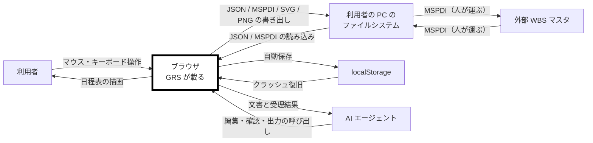

# gr-scheduler 仕様書 — 要求

**Grammar**: spec.sgra
**UID**: DOC-REQUIREMENTS
**Version**: 0.3

本書は第 1 部（Chapter 1 〜 4）である。仕様形式は **ANPS-part**（4 枚）。
書き方の規則は `previous-project-result/20-spec-template/spec-writing-rules.md`、
要望の入力は `previous-project-result/user-order.md` が正である。

> **Chapter 3 と 4 はまだ器である。** 未記入の節は引用で始まる行を持つ。
> `grep -n "^> 未記入" docs/spec/*.md` で残りを引ける。

## Chapter 1. Foundation (基本事項)

### 1.1 Background (背景)

**Type**: SECTION

日程表は、複数の対象と複数の工程が絡む仕事で最も広く使われる図の 1 つである。ところが、それを描く道具は 2 つに割れている。作図ソフトと表計算ソフトは自由に描けるが、成果物は画像であって構造を持たない。日程管理ソフトは構造を持つが、調査した範囲ではいずれも 1 つの行に複数のタスクやマイルストーンを置けない。

そのため「1 対象を 1 行に置き、その対象の全工程を 1 枚で俯瞰する」形式の日程表は、実際には作図ソフトで描かれている。描いた図は日付が動くたびに人が引き直すことになり、他の道具へ渡すこともできない。

本ソフトウェアは、作図ソフトと同じ操作感で日程表を描きながら、成果物として構造化データを持つことを目指す。特定の業種や特定の製品を前提としない、汎用の日程表作成ツールである。

### 1.2 Challenges (課題)

**Type**: SECTION

現状の問題点を表 T-001 に示す。

**表 T-001 — 現状の課題**

| 行 ID | 現状 | 何が起きるか |
| --- | --- | --- |
| C-1 | 日程表を作図ソフトで描いている | 日付が 1 つ動くたびに、図形と線を人が引き直す。更新が滞り、図と実態が離れる |
| C-2 | 成果物が画像である | 他の道具へ渡せず、機械が読めない。同じ日程を別の場所でもう一度入力することになる |
| C-3 | 日程管理ソフトは 1 行に 1 つのタスクしか置けない | 対象ごとの俯瞰ができない。行数が対象数と工程数の積まで膨らむ |
| C-4 | 全体日程が 1 画面に収まらない | スクロールしながら記憶で繋ぐことになり、工程の前後関係を見落とす |

### 1.3 Goals (目標)

#### 1 つの行に複数のタスクを置いて俯瞰できる

**Type**: GOAL
**UID**: GL-001

**STATEMENT**: 利用者が、1 つの行に複数のタスクとマイルストーンを置き、1 つの対象の全工程を 1 行で見渡せる状態になること。

#### 全体日程を 1 画面で見られる

**Type**: GOAL
**UID**: GL-002

**STATEMENT**: 利用者が、プロジェクトの全体日程をスクロールせずに 1 画面で見られる状態になること。

#### 操作が引っかからない

**Type**: GOAL
**UID**: GL-003

**STATEMENT**: 利用者が、ズーム・パン・ドラッグのいずれを行っても、操作が引っかからずに追従する状態になること。

#### 成果物が構造化データである

**Type**: GOAL
**UID**: GL-004

**STATEMENT**: 描いた日程表が、画像ではなく機械が読める構造化データとして出し入れでき、外部 WBS マスタとの間を情報を落とさずに往復できる状態になること。

#### 1 つのファイルだけで動く

**Type**: GOAL
**UID**: GL-005

**STATEMENT**: 利用者が、1 つの `.html` をブラウザで開くだけで、サーバーもインストールも無しに日程表を編集できる状態になること。

#### マニュアルを読まずに使える

**Type**: GOAL
**UID**: GL-006

**STATEMENT**: 初めて触る利用者が、マニュアルを読まずに主要な操作へ到達できる状態になること。

#### 秘密の日程を画面に出した証跡が残る

**Type**: GOAL
**UID**: GL-007

**STATEMENT**: 利用者が秘密の日程を画面に出すとき、誰がいつ出していたかが画面上に残る状態になること。

### 1.4 Approach (解決方針)

**Type**: SECTION

実装言語は TypeScript とする。ビルドは Vite で行い、生成した JavaScript と CSS を 1 つの `.html` へ埋め込んで出力する。テストは、値だけで決まる層を Vitest で、利用者の操作を通した確認と性能の計測を Playwright で行う。テストコードの置き場と Chapter 8 〜 10 の対応は Chapter 7 が定める。

⚠️ **Vite は型を検査しない。** TypeScript から型注釈を落とすだけなので、型エラーがあってもビルドは通る。型検査は `tsc --noEmit` として別に実行する。

**描画方式と層の分け方は本章では決めない。Chapter 5 で決める。** 前プロジェクトは描画方式を決めているが、その決定記録は引継ぎ資産に含まれておらず、残っているのは「次期にも同じ選択を推奨する」という推奨までである（`previous-project-result/09-architecture/architecture-entry-ja.md` §1）。**推奨を決定として書かない。** 方式の理由と代償は `previous-project-result/04-performance/performance-notes-ja.md` §1 E-1 にあり、Chapter 5.1 はそれを読んだうえで決める。

**性能は骨格の段階で実測してから機能を積む。** 前プロジェクトは骨格に性能ゲートを置くところまでは正しく行い、そこで 1 度測ったきり完成版を一度も測らなかった。Chapter 10 の非機能テストは節目ごとに再計測して結果を足す。

### 1.5 Scope (範囲)

**Type**: SECTION

本プロジェクトの範囲を表 T-002 に示す。

**表 T-002 — 範囲**

| 行 ID | 区分 | 内容 |
| --- | --- | --- |
| S-1 | In-scope | 日程表の作成・編集・表示。1 行に複数のタスクを置くこと（マルチバー）。行の階層と畳み。異方性ズームと表示量の増減 |
| S-2 | In-scope | 予定と実績の管理・表示。進捗の可視化 |
| S-3 | In-scope | タスク間の依存関係の表現と自動配線 |
| S-4 | In-scope | 注記・強調・カーソル・透かし |
| S-5 | In-scope | JSON と MSPDI XML の双方向 Import / Export。複数 MSPDI の合流 |
| S-6 | In-scope | SVG と PNG の出力 |
| S-7 | In-scope | 人間向け UI と同格の機械向けインターフェース |
| S-8 | Out-of-scope | 資源管理（工数・割当率・稼働率）。ただし担当者の表示と割当の追加・編集・解除は行う |
| S-9 | Out-of-scope | コスト管理・EVM・出来高管理・資源平準化 |
| S-10 | Out-of-scope | クリティカルパス計算とスケジューラ。日付は人が決める |
| S-11 | Out-of-scope | カスタムフィールドの汎用機構 |
| S-12 | Out-of-scope | サーバー通信・認証・共同編集。設計の余地だけ残す |
| S-13 | Out-of-scope | 絵文字アイコンの対応。アイコンの外部からの取り込み |
| S-14 | Out-of-scope | タッチ操作とモバイル表示 |

### 1.6 Constraints (制約事項)

**Type**: SECTION

破ることのできない制約を表 T-003 に示す。

**表 T-003 — 制約事項**

| 行 ID | 制約 | 内容 |
| --- | --- | --- |
| CN-1 | 単一ファイル | 成果物は 1 つの `.html` とする。サーバーを必要とせず、ネットワークから切り離した状態で全機能が動くこと |
| CN-2 | 対応ブラウザ | Chromium 系（Chrome / Edge）を基準とする。Firefox は動作確認に留め、Safari は対象外とする |
| CN-3 | 対応 OS | 問わない。単一ファイルでネットワークを持たないため、OS 差は実質フォントだけである |
| CN-4 | 入力機器 | マウスとキーボードのみとする。タッチは対象外とする |
| CN-5 | 文字コード | UTF-8・BOM なしとする。JSON は RFC 8259 が BOM の付加を禁じており、MSPDI XML も同じ扱いとする |
| CN-6 | 外部通信 | 実行時に外部へ通信しない。外部から取得する資源を持たない |
| CN-7 | 第三者著作物 | 第三者の著作物を成果物にもリポジトリにも同梱しない |
| CN-8 | 内容セキュリティ方針 | 単一 HTML に対する CSP を持つ。`img-src` は `data:` とする |

### 1.7 Limitations (制限事項)

**Type**: SECTION

要求を完全には満たさないが、許容すると決めた既知の妥協点を表 T-004 に示す。

**表 T-004 — 制限事項**

| 行 ID | 制限 | なぜ許容するか |
| --- | --- | --- |
| LM-1 | 透かしの除去は暗号的に防げない。クライアント単体で動く単一 HTML であるため、DOM を直接編集すれば透かしは消せる | 目的は撮影されたときの証跡であり、弱い抑止で足りる。強制するにはサーバー配備が要る |
| LM-2 | 「WCAG 2.1 AA 適合」とは名乗らない | 支援技術による読み上げを対象外にしたため。条文に部分適合の概念が無く、1 つでも外せば適合とは言えない。AA は指針として使い、視覚と操作に絞る |
| LM-3 | 書き出した担当者を外部ツールがどう扱うかは未検証である | 実機での確認が要る。開発を止める理由にはならないが、検証するまで断定しない |
| LM-4 | 扱える文書の大きさはブラウザのメモリに収まる範囲に限られる | サーバーもデータベースも持たない構成の帰結である。上限に達したときは人に知らせる |

### 1.8 Glossary (用語集)

**Type**: SECTION

**確定名の全数は `_assets/tbl-glossary.md`（`DOC-TBL-GLOSSARY`）が持つ。本書と合わせて、そこが用語の正である。** 前プロジェクトが慎重に選んだ語を 1 つも落とさずに引き継いだもので、データの語・プロパティ・UI パーツ・設定値のキー・直訳しない語の 5 つの表からなる。**他所で違う名前を見たら、あちらが勝つ。**

辞書を開かずに本書の散文を読むための語だけを表 T-005 に示す。**表 T-005 は辞書からの抜粋であり、正ではない。食い違ったら辞書が勝つ。**

**表 T-005 — 本書を読むための語**

| 行 ID | 語 | 意味 |
| --- | --- | --- |
| G-1 | `Task` | 日程要素。バーもマイルストーンも `Task` であり、`Task.milestone`（真偽値）で区別する |
| G-2 | `TaskGroup` | `Task` が載る器。入れ子で階層になる（最大 5 段）。画面に描いたものは行（`Rows`） |
| G-3 | `TaskGroupMember` | どの `Task` がどの `TaskGroup` に載るかの対応 |
| G-4 | `stackOrder`（積み順） | 1 つの `TaskGroup` の中で縦に積む順。`null` は自動を表す |
| G-5 | マルチバー | 1 つの行に複数の `Task` が載っている状態。`TaskGroup` と `TaskGroupMember` がその実体である |
| G-6 | WBS | タスクの親子の木。`Task.wbs_parent_uid` が持つ。MSPDI へ書き出す |
| G-7 | 外部 WBS マスタ | 本ソフトウェアの外側で WBS を持ち、MSPDI を生成・再取込する対向ツール。特定の製品を指す語ではない |
| G-8 | MSPDI | 外部 WBS マスタとの交換に用いる XML 形式。事実の正は公式スキーマ（XSD）である |
| G-9 | 予定 / 実績 | 同じ 1 つの `Task` が両方を持つ。別のアイテムにも別の行にもしない |
| G-10 | `Progress Marker`（進捗マーカー） | 実績バーの右端の外側に出る、状態を変える入口。形が意味を担う |
| G-11 | `Progress Line`（イナズマ線） | 遅れの分布を 1 本の折れ線で示す重ね描き。ボトルネックの可視化に使う |
| G-12 | LOD | ズームに応じて描く要素を増減させる仕組み。**3 つある**（時間軸 LOD / タスク LOD / グループ LOD）。表 T-005a で言い分ける |
| G-13 | Carry | 本ソフトウェアが使わない MSPDI の項目を、そのまま持ち回って書き戻す仕組み |

**LOD は 3 つある。混ぜて書いてはならない（MUST NOT）。** 内訳を表 T-005a に示す。

**表 T-005a — LOD の 3 種**

| 行 ID | 名前 | 何を増減するか | 駆動 |
| --- | --- | --- | --- |
| L-1 | 時間軸 LOD | `Time Ruler` の粒度（年 → 年 ＋ 月 → 年 ＋ 月 ＋ 週 → 年 ＋ 月 ＋ 日 ＋ 曜日） | 横（`zoomX`） |
| L-2 | タスク LOD | 深い **WBS** の `Task` を描かない | 横（`zoomX`）＝ 幅 |
| L-3 | グループ LOD | 深い **`TaskGroup`** を親へ畳む | 縦（`zoomY`）＝ 高さ |

### 1.9 Notation (表記規約)

**Type**: SECTION

本書は RFC 2119 / RFC 8174 に従う。SHALL / MUST は必須、SHOULD は推奨、MAY は任意を表す。規範語として扱うのは大文字で書かれた場合に限る。

**例外:** EARS 構文中の小文字 `shall` は、本書では大文字の SHALL と同じ拘束力を持つものとする。

**文体:** 記述文では主語と他動詞の目的語を省略しない。指示文（「〜する（MUST）」の形）はこの限りでない。

**EARS 構文パターンを表 T-006 に示す。**

**表 T-006 — EARS 構文パターン**

| 行 ID | パターン | 英語構文 | 日本語の形 | 用途 |
| --- | --- | --- | --- | --- |
| E-1 | Ubiquitous | The [System] shall [Response]. | [System] は、[Response] すること。 | 常に成り立つ要求 |
| E-2 | Event-driven | **When** [Trigger], the [System] shall [Response]. | [Trigger] したとき、[System] は、[Response] すること。 | イベント起点の要求 |
| E-3 | State-driven | **While** [In State], the [System] shall [Response]. | [In State] の間、[System] は、[Response] すること。 | 状態依存の要求 |
| E-4 | Unwanted Behavior | **If** [Trigger], then the [System] shall [Response]. | もし [Trigger] ならば、[System] は、[Response] すること。 | 異常系・例外処理 |
| E-5 | Optional Feature | **Where** [Feature is included], the [System] shall [Response]. | [Feature] がある場合、[System] は、[Response] すること。 | オプション機能・条件付き機能 |
| E-6 | Complex | **While** [In State], **when** [Trigger], the [System] shall [Response]. | [In State] の間、[Trigger] したとき、[System] は、[Response] すること。 | 複合条件の要求。**状態が先、契機が後**（原論文の節順に従う） |

**条件は主語より先に書く（MUST）。これが EARS の要点である。**

**要求は必ず「〜すること。」で終える（MUST）。** 事実の記述は「〜する。」、推奨は「〜が望ましい。」で区別する。

> **`Where` は、製品にその機能が入っているかどうかで分ける。実行時に切り替わるものは State-driven である（MUST）。**

**`[System]` の定義。** EARS の `[System]` は、**Chapter 2.2 で「対象ソフトが載る」と記した機器の上で動くソフトウェアを指す。Chapter 2 を書かずに Chapter 4 を書いてはならない（MUST NOT）。**

**表と図の参照（本書の書き方の要）。**

**細目が表または図で表せるなら、要求は 1 文でそれを指すこと（MUST）。行ごとに要求ノードを作ってはならない（MUST NOT）。**

| | 書き方 |
| --- | --- |
| 良い | 「〜の判定は表 T-012 に従うこと。」／「〜を構成するクラスは図 F-004 に従うこと。」 |
| 悪い | 「aaa は bbb であること。」「ccc は ddd であること。」…と細目を要求ノードで並べる |

要求ノードは 1 つずつが UID・理由・関係・検証するテストを連れてくる。表で表せる細目をノードに割ると、文書も追跡も重くなるだけで、得るものが無い。

- **番号は席番号とする（MUST）。** 表は `表 T-001`、図は `図 F-001` の形で通し番号を振り、途中の表や図を削っても残りの番号を詰め直してはならない（MUST NOT）。
- **表の第 1 列は行 ID とする（MUST）。** テストが落ちたときに、行 ID がそのまま仕様の 1 行を指せるようにするためである。
- **表を指す要求を検証するテストは、表を写した固定データで駆動すること（SHOULD）。** 行ごとにテストを書くのではなく、1 つのテストが表の全行を回る形にする。
- **大きい図は `_assets/fig-<name>.md` へ出し、本文からは参照だけを書く（MUST）。** 図の行数はそのまま、その仕様書を読むすべての者の固定費になる。

**図:** 判定の閾値を変更した場合はここに記す。

**命名の規約。**

**モデルの語彙に一本化する（MUST）。** UI の名前とデータの名前が食い違ったら、**UI の名前を変える**。同じものを画面側とデータ側で別の語で呼ぶことが、前プロジェクトで不具合が止まらなかった根因である。1 つの概念には 1 つの語しか与えない。`type` `data` `info` `value` のような無意味な汎用語を使ってはならない（MUST NOT）。

**面ごとの記法を表 T-006a に示す。同じ概念でも面が違えば記法が違う。矛盾ではない。ただし語幹は必ず一致させること（MUST）** —— `stackOrder` ↔ `stack_order` は正しく、`laneIndex` ↔ `stack_order` は禁止である。

**表 T-006a — 面ごとの記法**

| 行 ID | 面 | 記法 | 例 |
| --- | --- | --- | --- |
| W-1 | 型・クラス | PascalCase | `TaskGroup` |
| W-2 | 関数・変数・JSON プロパティ | camelCase | `stackOrder` |
| W-3 | 定数 | SCREAMING_SNAKE_CASE | `MAX_GROUP_DEPTH` |
| W-4 | 文字列判別値・`data-role`・CSS クラス | kebab-case | `toggle-plan` |
| W-5 | i18n キー・プロパティパネルの項目名 | snake_case | `stack_order` |
| W-6 | UI パーツ（散文で指すとき） | PascalCase の複合語（空白あり） | `Row Title Panel` |
| W-7 | データの属性（散文で指すとき） | `Entity.field` 形式 | `TaskGroupMember.stackOrder` |

**大文字の略語を識別子に入れてはならない（MUST NOT）。** camelCase に落ちた瞬間に意味が消えるためである。`LOD` は識別子では `LevelOfDetail` と全部書く（`Lod` は無意味な語になる）。裸の `H` / `W` も同じで、`Height` / `Width` と書く。**散文では `LOD` と書いてよい**（大文字なら読める）。

**概念に記号のラベルを与えてはならない（MUST NOT）。** 比較しているあいだの一時的な番号（案 A / 案 B）と比較表の行ラベルは許すが、**決着したあとの散文では中身の名前で呼ぶ**。却下案も同じである。判定は 1 つ —— **その記号を知らない者が、その 1 文だけを読んで意味が取れるか。** 取れないなら記号ではなく中身で呼ぶ。

**曖昧な日本語を単独で使ってはならない（MUST NOT）。** 同じ日本語が複数の概念を指す語がある。単独で書いたら誤りとする。全数を表 T-006b に示す。

**表 T-006b — 単独で使ってはならない日本語**

| 行 ID | 語 | 書き方 |
| --- | --- | --- |
| A-1 | 段 | **4 義ある。** ①積み順（`stackOrder`）②WBS の深さ ③`TaskGroup` の深さ ④ズームのノッチ。必ずどれかを併記する。「N 段」と単独で書かない |
| A-2 | 行 | `Rows`（UI パーツ）か「タスクグループ（`TaskGroup`）」（データ）かを明示する |
| A-3 | レベル | `OutlineLevel` / `TaskGroup` の深さ / LOD のどれかを明示する |
| A-4 | 深さ | WBS か `TaskGroup` かを必ず併記する |
| A-5 | マーカー | 単独で書いたら `Progress Marker` を指す。期限の印は「期限の印」（`deadline`）、マイルストーンの図形は「マイルストーン形状（`milestoneGlyph`）」と書く。「マーク」とも書かない |
| A-6 | 進捗 | **3 つが別物。** `Progress Marker`（状態の記号）／ `Progress Line`（イナズマ線）／ 完了率（`percentComplete`）。ラベルを指すなら「完了率ラベル」 |
| A-7 | ベースライン | **2 義ある。** ①変更前の予定（`baselineVisible`）②文字のベースライン（`labelBaseline`）。前者は「変更前の予定」と書く |
| A-8 | キャンバス | `Schedule Canvas`（UI 領域）／ 出力サイズ（`exportCanvas`）／ 余白（`canvasPadding`）を区別する |
| A-9 | 基準線 | 変更前の予定の訳語に限る。性能の実測値は「基準値」と書く |
| A-10 | 太さ | 英語は用途で分かれる。`Width` は寸法（幅）に使い、太さには使わない。日本語で「幅」と「太さ」を取り違えない |
| A-11 | 幅 | 「日付の幅」と「占有幅」（ラベル込み）を区別する |
| A-12 | 期間 | 「予定の期間」／ 実績期間（`actualDuration`）／ 表示期間 を明示する |
| A-13 | 端点 | 単独で書いたら掴み点（全形状が持つバーの端）。形状名は必ず「端点スパン」と 4 文字で書く |
| A-14 | バー | `Task Bars`（総称）／ `Plan Bar` ／ `Actual Bar` のどれかを明示する。形状の 1 値は矩形（`rectangle`）であって「バー」ではない |
| A-15 | カーソル | 単独で書いたら `Cursors`（日付を指す線の総称）を指す。マウスが指す点は必ず「ポインタ」と書く |

**文中で属性に触れるときは所属を付ける（MUST）** —— `stackOrder` ではなく `TaskGroupMember.stackOrder` と書く。表 T-006a により、形で面が見分けられる。

## Chapter 2. System Overview (システム概要)

### 2.1 Overview Diagram (概要図)

**Type**: SECTION

構成の概要を図 F-001 に示す。対象ソフトが載る機器を太枠で示す。色は使わない。線のラベルには何が流れるかを書く。

**図 F-001 — 構成の概要**

**外部 WBS マスタとの間にネットワークの線は無い。** ファイルを人が運ぶ。これは制約 CN-1 と CN-6 の帰結である。

### 2.2 Devices (機器)

**Type**: SECTION

構成する機器を表 T-007 に示す。

**表 T-007 — 機器**

| 行 ID | 機器 | 種別 | 対象ソフトが載るか | 供給元 | こちらで変えられるか |
| --- | --- | --- | --- | --- | --- |
| D-1 | 利用者の PC のブラウザ | Chromium 系 Web ブラウザ | **載る** | 既存 | 変えられない |
| D-2 | 利用者の PC のファイルシステム | ローカル記憶 | 載らない | 既存 | 変えられない |
| D-3 | ブラウザの localStorage | ブラウザ内蔵の記憶 | 載らない | 既存 | 変えられない |
| D-4 | 外部 WBS マスタが動く環境 | 対向ツール | 載らない | 既存 | 変えられない |
| D-5 | AI エージェントの実行環境 | 自動化の主体。利用者の PC 上で動く | 載らない | 既存 | 変えられない |

> **EARS の `[System]` は、D-1 の上で動く単一 `.html` の本ソフトウェアを指す。**
> 以降の要求で主語となるのはこれだけである。D-2 から D-5 は本ソフトウェアの外側にあり、
> **こちらで挙動を変えられない**。それらに対する要求を書いてはならない（MUST NOT）。

### 2.3 Routes (経路)

**Type**: SECTION

機器の間を流れるものを表 T-008 に示す。

**表 T-008 — 経路**

| 行 ID | from | to | 運ぶもの | 方式 | 入力として信頼できるか |
| --- | --- | --- | --- | --- | --- |
| R-1 | D-2 | D-1 | JSON / MSPDI XML | ファイル選択またはドラッグ＆ドロップ | **信頼できない** |
| R-2 | D-1 | D-2 | JSON / MSPDI XML / SVG / PNG | ダウンロード | 該当なし（送信のみ） |
| R-3 | D-3 | D-1 | 自動保存された文書 | Web Storage の読み出し | **信頼できない** |
| R-4 | D-1 | D-3 | 同上 | Web Storage の書き込み | 該当なし（送信のみ） |
| R-5 | D-5 | D-1 | 編集・確認・出力の指示 | 単一 `.html` が公開する関数の呼び出し | **信頼できない** |
| R-6 | D-1 | D-5 | 文書と受理結果 | 同上の戻り値 | 該当なし（送信のみ） |
| R-7 | D-4 | D-2 | MSPDI XML | 人が運ぶ（共有フォルダ・メール等） | 該当なし（本ソフトウェアの外） |
| R-8 | D-2 | D-4 | MSPDI XML | 同上 | 該当なし（本ソフトウェアの外） |

> **ネットワークを通る経路は 1 本も無い。**
> **自分が書いたものを読み戻す R-3 も「信頼できない」に数える。** localStorage は
> 同じブラウザの他のページからも書き換えられるので、出所を自分だと仮定できない。

### 2.4 Exclusions (持たないもの)

**Type**: SECTION

構成に含まれないものを表 T-009 に示す。

**表 T-009 — 持たないもの**

| 行 ID | 持たないもの | 理由 |
| --- | --- | --- |
| X-1 | サーバーとネットワーク通信 | 単一 `.html` で完全にオフラインで動くこと（CN-1・CN-6）。将来拡張として設計の余地だけ残す |
| X-2 | 利用者アカウントと認証 | X-1 と同じ。共同編集と権限設定は将来拡張である |
| X-3 | データベース | 文書はファイル（D-2）と localStorage（D-3）だけで持つ |
| X-4 | AI 推論の実行系 | 本ソフトウェアは AI を持たない。機械向けの口を持つだけである |
| X-5 | 日付を自動で決める計算系 | 日付は人が決める。クリティカルパス計算と資源平準化は範囲外である（S-10） |
| X-6 | タッチ入力とモバイル表示 | 入力機器をマウスとキーボードに限る（CN-4） |

## Chapter 3. Use Cases (ユースケース)

### 3.1 Actors (アクター)

**Type**: SECTION

アクターを表 T-010 に示す。人は 2 種いる。**同じ `.html` を開くが、達成したいことが違う。**

**表 T-010 — アクター**

| 行 ID | アクター | 種別 | 対応する機器 | 何を得たいか |
| --- | --- | --- | --- | --- |
| AC-1 | 作成者 | 人 | D-1 | 日程を描き、動いたら直し、他者へ配りたい |
| AC-2 | 閲覧者 | 人 | D-1 | 全体を俯瞰し、どこが遅れているかを見つけたい |
| AC-3 | AI エージェント | 外部システム | D-5 | 人が UI で行える編集・確認・出力を、API で行いたい |
| AC-4 | 外部 WBS マスタ | 外部システム | D-4 | WBS と日付を MSPDI で受け渡し、自分の側の構造を保ちたい |

> **AC-4 は自動では動かない。** 表 T-008 の R-7 / R-8 のとおり、両者の間はファイルを人が運ぶ。

### 3.2 Use Cases (ユースケース)

**Type**: SECTION

ユースケースは **12 件**である。**要望の 66 項目を機能ごとに 1 件ずつ立てず、アクターが 1 度に達成する目標の単位でまとめた。** どのユースケースがどの要望を吸収したかを表 T-011 に示す。**この表が要望の取りこぼしを防ぐ唯一の手段である。**

**表 T-011 — ユースケースと要望の対応**

| 行 ID | ユースケース | 吸収した要望の項番 | 主なアクター |
| --- | --- | --- | --- |
| V-1 | UC-001 タスクを置いて期間を決める | 10 / 12 / 13 / 15 / 17 / 18 / 30 / 31 | AC-1 |
| V-2 | UC-002 行を階層で組み立てる | 26 / 27 / 28 / 29 | AC-1 |
| V-3 | UC-003 タスクの属性を編集する | 16 / 19 / 20 / 21 / 22 / 23 / 24 / 25 / 69 | AC-1 |
| V-4 | UC-004 タスク間の依存を示す | 46 / 47 / 48 / 49 | AC-1 |
| V-5 | UC-005 実績を記録する | 50 / 51 | AC-1 |
| V-6 | UC-006 遅れを見つける | 53 / 54 | AC-2 |
| V-7 | UC-007 見たい範囲を出す | 6 / 7 / 8 / 9 / 32 / 33 / 34 / 35 / 36 / 37 / 38 / 39 / 40 / 41 / 42 / 43 / 64 | AC-2 |
| V-8 | UC-008 注記で伝える | 44 / 45 | AC-1 |
| V-9 | UC-009 秘密の日程を画面に出す | 55 | AC-1 / AC-2 |
| V-10 | UC-010 外部 WBS マスタとやりとりする | 56 / 61 / 62 | AC-1 / AC-4 |
| V-11 | UC-011 文書を保存して配る | 57 / 58 / 59 / 60 / 63 | AC-1 |
| V-12 | UC-012 AI エージェントに編集させる | 65 | AC-3 |
| V-13 | （ユースケースを持たない項番） | 1 〜 5（最優先事項）／ 66 / 67（作り方の原則）／ 68（提案の依頼）／ 11 / 14 / 52（欠番） | — |

> **V-13 は取りこぼしではない。** 最優先事項と作り方の原則は**目標と制約**であり、Chapter 1.3 と 1.6 が受けている。欠番 3 件は要望として取り下げられたものである。

#### タスクを置いて期間を決める

**Type**: USE_CASE
**UID**: UC-001

**STATEMENT**: 作成者が行の上で期間を示し、システムがそこにタスクまたはマイルストーンを作って、名称が読める形で描くこと。

**SCENARIO**:

1. 作成者が形状を選び、行の上で始点から終点までドラッグする。
2. システムはその期間のタスクを作り、選ばれた形状で描く。
3. 作成者がタスクに名称を入力する。
4. システムは名称ラベルを、形状が隠れない位置へ自動で置く。
5. システムは同じ行で時間が重なるタスクを、決まった順序で縦に積む。

**EXTENSIONS**:

- 2a. ドラッグの幅が 1 日に満たない。
  - システムはマイルストーンとして作る。
- 4a. 名称が形状の幅に収まらない。
  - システムは表示だけを打ち切り、全文をツールチップで出す。データは切らない。
- 5a. 積み順が安全弁の上限に達した。
  - システムは積むのをやめ、上限に達したことを作成者に知らせる。

**Relations**:

- **Type**: `Parent`
  **ID**: `GL-001`
  **Role**: `Satisfies`

#### 行を階層で組み立てる

**Type**: USE_CASE
**UID**: UC-002

**STATEMENT**: 作成者が行見出しの木を編集し、システムが階層に従って行を並べ替え、畳みと表示の切り替えを反映すること。

**SCENARIO**:

1. 作成者が行見出しパネルで `TaskGroup` を作り、名前を付ける。
2. 作成者が `TaskGroup` を別の `TaskGroup` の下へ移す。
3. システムは階層を組み替え、その変更を元データの階層にも反映する。ただし `UID` は保持する。
4. 作成者が階層の単位で畳む、または非表示にする。
5. システムは畳んだ内容を親へ集約し、非表示にしたものは親の非表示グループタブから戻せるようにする。

**EXTENSIONS**:

- 2a. 移そうとした先が 5 段目より深い。
  - システムは移動を受け付けず、深さの上限に達したことを知らせる。
- 3a. 作成者が移したのは `TaskGroup` ではなくタスクバーである。
  - システムは行の所属だけを変え、元データの階層は変えない。

**Relations**:

- **Type**: `Parent`
  **ID**: `GL-001`
  **Role**: `Satisfies`

#### タスクの属性を編集する

**Type**: USE_CASE
**UID**: UC-003

**STATEMENT**: 作成者がタスクを選び、システムが属性を編集する面を出して、変更を描画に反映すること。

**SCENARIO**:

1. 作成者がタスクを選ぶ。
2. システムはプロパティパネルに、そのタスクの属性を英語の項目名で出す。
3. 作成者が日付・形状・色・線の太さ・担当者のいずれかを変える。
4. システムは描画を更新し、担当ラベルと完了率ラベルを表示の設定に従って出す。

**EXTENSIONS**:

- 3a. 作成者が塗りと輪郭を同時に透明にしようとした。
  - システムは受け付けず、理由を示す。
- 3b. 作成者が担当者を新たに割り当てた。
  - システムは資源と割当を作り、書き出したときに相手のツールで担当者として現れる形にする。
- 4a. 作成者が画面上でタスクを動かした。
  - システムはプロパティの日付を追随させる。

**Relations**:

- **Type**: `Parent`
  **ID**: `GL-004`
  **Role**: `Satisfies`

#### タスク間の依存を示す

**Type**: USE_CASE
**UID**: UC-004

**STATEMENT**: 作成者が 2 つのタスクを結び、システムが依存の種別に応じた経路で線を引くこと。

**SCENARIO**:

1. 作成者が先行タスクの引き出し点から、後続タスクの引き入れ点へドラッグする。
2. システムは依存を作り、種別とラグを既定値で置く。
3. システムは種別から両端のアンカーを決め、他の図形と極力かぶらない経路で線を引く。
4. 作成者が種別またはラグを変える。
5. システムは経路を引き直す。

**EXTENSIONS**:

- 3a. 2 つのタスクの日程が重なっている。
  - システムは折れ点を増やして引く。経路は人が調整せず、保存もしない。

**Relations**:

- **Type**: `Parent`
  **ID**: `GL-004`
  **Role**: `Satisfies`

#### 実績を記録する

**Type**: USE_CASE
**UID**: UC-005

**STATEMENT**: 作成者が実績の日付と状態を入力し、システムが予定と同じ形状で実績を描いて完了率を算出すること。

**SCENARIO**:

1. 作成者が実績バーの端を掴んで置く。
2. システムは実績開始日と実績期間を更新し、完了率を日付から算出して格納する。
3. 作成者が進捗マーカーを押して状態を進める。
4. システムは状態を巡らせ、形が意味を担う記号で示す。

**EXTENSIONS**:

- 1a. 予定と実績が重なって端を掴めない。
  - システムは予定バーを実績バーより高く描き、上下に露出した帯で予定を掴ませる。
- 1b. 形状に上下の幅が無い（矢印・端点スパン）。
  - システムは実績を下へずらして描く。マイルストーンは実績日の位置へ横にずらす。
- 3a. 作成者が状態を中断にし、再開日を決めない。
  - システムは再開可否を偽として扱う。中止は中断の一種であり、別の概念を作らない。

**Relations**:

- **Type**: `Parent`
  **ID**: `GL-004`
  **Role**: `Satisfies`

#### 遅れを見つける

**Type**: USE_CASE
**UID**: UC-006

**STATEMENT**: 閲覧者が基準日を指定し、システムがイナズマ線と進捗マーカーで、どこが遅れているかを示すこと。

**SCENARIO**:

1. 閲覧者が基準日を置く。
2. システムは、動いているべき日を過ぎているタスクだけに頂点を打ち、上端から下端まで途切れない 1 本の折れ線を引く。
3. システムは遅れているタスクの進捗マーカーを、遅れを表す形にする。
4. 閲覧者は変更前の予定を重ねて、計画がどう動いたかを見る。

**EXTENSIONS**:

- 2a. 同じ段に複数のタスクがあり、頂点が競合する。
  - システムは最も遅れた頂点を採る。
- 2b. 段に頂点が 1 つも無い。
  - システムはその段で基準日の位置を通す。線は途切れさせない。
- 4a. 重ねる変更前の予定が読み込まれていない。
  - システムは別ファイルとして読み込ませる。

**Relations**:

- **Type**: `Parent`
  **ID**: `GL-002`
  **Role**: `Satisfies`

#### 見たい範囲を出す

**Type**: USE_CASE
**UID**: UC-007

**STATEMENT**: 閲覧者がズームとスクロールを行い、システムが目盛の粒度と描くタスクの量を追随させて、狙った範囲を 1 画面に出すこと。

**SCENARIO**:

1. 閲覧者がポインタを目的の位置へ置き、修飾キーとホイールでズームする。
2. システムはポインタの下の日付と行を動かさずに倍率を変える。
3. システムはタイムルーラーの粒度を、1 日あたりの表示幅から決めた段階へ切り替える。
4. システムは描くタスクと行の量を、表 T-005a の 3 つの LOD に従って増減させる。
5. 閲覧者が背景をドラッグして、見たい位置まで等倍で動かす。

**EXTENSIONS**:

- 1a. 閲覧者が修飾キーを押していない。
  - システムは縦にスクロールする。ズームしない。
- 5a. 閲覧者がドラッグを始めた場所にタスクがある。
  - システムはそのタスクを動かす。パンはしない。

**Relations**:

- **Type**: `Parent`
  **ID**: `GL-002`
  **Role**: `Satisfies`
- **Type**: `Parent`
  **ID**: `GL-003`
  **Role**: `Satisfies`

#### 注記で伝える

**Type**: USE_CASE
**UID**: UC-008

**STATEMENT**: 作成者が日程表の任意の場所にコメントと囲み枠を置き、システムがそれらを行の識別子で結び付けて描くこと。

**SCENARIO**:

1. 作成者がコメントを置き、指す先を決める。
2. システムは位置を日付と行の識別子で持ち、吹き出しのずれだけを画面上の距離で持つ。
3. 作成者が強調したい範囲を角丸四角で囲う。
4. システムは範囲を日付の範囲と行の範囲で持ち、角丸の大きさをズームによらず一定に描く。

**EXTENSIONS**:

- 2a. 指している行が畳まれた、または非表示になった。
  - システムはコメントも一緒に隠す。
- 4a. 囲んだ範囲の一部の行が非表示になった。
  - システムは見えている行だけを囲う。枠は縮む。

**Relations**:

- **Type**: `Parent`
  **ID**: `GL-002`
  **Role**: `Satisfies`

#### 秘密の日程を画面に出す

**Type**: USE_CASE
**UID**: UC-009

**STATEMENT**: 作成者が秘密の日程を画面に出すとき、システムが誰がいつ出していたかを示す透かしを重ね、消すには合言葉を求めること。

**SCENARIO**:

1. 作成者が日程表を開く。
2. システムは、開いた者の名前と実行時の日時を薄く斜めに、画面全体へ繰り返し重ねる。
3. 作成者が透かしを消そうとする。
4. システムは合言葉を求め、ハッシュを照合して一致したときだけ消す。

**EXTENSIONS**:

- 2a. 開いた者の名前が設定されていない。
  - システムは名前の設定を促す。透かしの設定は文書に保存しない。
- 4a. 合言葉が一致しない。
  - システムは透かしを消さない。

**Relations**:

- **Type**: `Parent`
  **ID**: `GL-007`
  **Role**: `Satisfies`

#### 外部 WBS マスタとやりとりする

**Type**: USE_CASE
**UID**: UC-010

**STATEMENT**: 作成者が外部 WBS マスタの出力を取り込み、編集し、書き戻して、システムが取り込んだときに持っていた情報を落とさずに返すこと。

**SCENARIO**:

1. 作成者が MSPDI ファイルを取り込む。
2. システムは信頼できない入力として検証し、使わない項目もそのまま保持する。
3. 作成者が日程を編集する。
4. 作成者が MSPDI として書き出す。
5. システムは保持していた項目を戻して書き出す。編集していなければ、元と同じものが出る。

**EXTENSIONS**:

- 1a. 作成者が 2 つ目の MSPDI を取り込む。
  - システムは合流させ、同じタスクが来たときは上書き・別として取込・取込をやめる、から選ばせる。
  - 取込側に無かったタスクは消さずに残し、そのことを知らせる。
- 2a. 入力が壊れている、または想定した構造でない。
  - システムは取り込まず、どこが受け付けられなかったかを示す。

**Relations**:

- **Type**: `Parent`
  **ID**: `GL-004`
  **Role**: `Satisfies`

#### 文書を保存して配る

**Type**: USE_CASE
**UID**: UC-011

**STATEMENT**: 作成者が日程表を保存し、画像として書き出し、システムが同じ文書から同じ見た目を再現できる形で配れるようにすること。

**SCENARIO**:

1. 作成者が JSON として保存する。
2. システムは、その JSON から同じ見た目が再現できるだけの情報を書く。
3. 作成者が画像として書き出す。
4. システムは出力サイズと文字サイズを文書に保存し、同じ文書からは同じ出力を返す。
5. システムは編集のたびに自動保存し、異常終了した次の起動で復旧を申し出る。

**EXTENSIONS**:

- 3a. 内容が出力サイズに収まらない。
  - システムは縮小して収める。文字が下限を割るときは警告する。
- 5a. 自動保存された内容が壊れている。
  - システムは黙って捨てず、復旧できないことを知らせる。
- 1a. 作成者がまだ何も持っていない。
  - システムは初期表示用のテンプレートを 1 つ出す。

**Relations**:

- **Type**: `Parent`
  **ID**: `GL-005`
  **Role**: `Satisfies`

#### AI エージェントに編集させる

**Type**: USE_CASE
**UID**: UC-012

**STATEMENT**: AI エージェントが機械向けの口を通じて、人が UI で行えるのと同じ編集・確認・出力を行い、システムが受理したか否かを値で返すこと。

**SCENARIO**:

1. 人が機械向けの口を有効にする。
2. AI エージェントが版数を読み、自分の知っている版かを確かめる。
3. AI エージェントが文書を読み、編集を申し込む。
4. システムは受理したか、受理しなかった理由と、現在の文書を値で返す。例外は投げない。

**EXTENSIONS**:

- 1a. 口が有効化されていない。
  - システムは口を公開しない。既定では公開しない。
- 3a. 申し込みが受け付けられない内容である。
  - システムは構造化した拒否として返し、そのまま再試行に使える形にする。

**Relations**:

- **Type**: `Parent`
  **ID**: `GL-004`
  **Role**: `Satisfies`

## Chapter 4. Requirements (要求)

### 4.1 Functional Requirements (機能要求)

**Type**: SECTION

> 未記入。`FUNC_REQ` ノード（`FR-xxx`）を並べる。EARS 1 文・`ORIGIN`（どの手順または拡張から来たか）・`RATIONALE` を持たせ、`UC-xxx` を親に取る。細目は表に置き、要求はその表を指す（1.9）。

### 4.2 Non-Functional Requirements (非機能要求)

**Type**: SECTION

> 未記入。`NON_FUNC_REQ` ノード（`NFR-xxx`）を並べる。測定可能な数値基準を含めること。基準線は `04-performance/performance-notes-ja.md` §2-0 の基準機・基準ブラウザの条件で測った数字だけを使う。

### 4.3 Reduction Candidates (削減候補)

**Type**: SECTION

> 未記入。親も子も持たない UID を並べ、外すと何が起きるかとユーザーの判断を書く。Chapter 4 を書き終えてから埋める。
