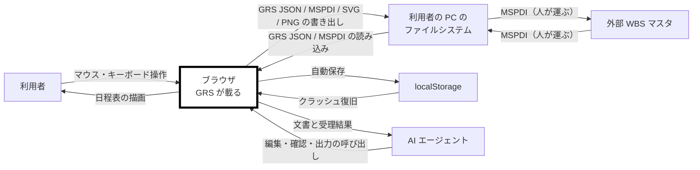

# gr-scheduler 仕様書 — 要求

**Grammar**: spec.sgra
**UID**: DOC-REQUIREMENTS
**Version**: 0.4

本書は第 1 部（Chapter 1 〜 4）である。仕様形式は **ANPS-part**（4 枚）。
書き方の規則は `previous-project-result/20-spec-template/spec-writing-rules.md`、
要望の入力は `previous-project-result/user-order.md` が正である。

> **Chapter 3 と 4 はまだ器である。** 未記入の節は引用で始まる行を持つ。
> `grep -n "^> 未記入" docs/spec/*.md` で残りを引ける。

## Chapter 1. Foundation (基本事項)

### 1.1 Background (背景)

**Type**: SECTION

日程表は、複数の対象と複数の工程が絡む仕事で最も広く使われる図の 1 つである。ところが、それを描く道具は 2 つに割れている。作図ソフト（`PowerPoint` など）と表計算ソフト（`Excel` など）は自由に描けるが、成果物は画像であって構造を持たない。日程管理ソフトは構造を持つが、調査した範囲ではいずれも 1 つの行に複数のタスクやマイルストーンを置けない。

そのため「1 対象を 1 行に置き、その対象の全工程を 1 枚で俯瞰する」形式の日程表は、実際には作図ソフトで描かれている。**描いた図は日付が動くたびに人が引き直すことになり、他の日程管理ソフトへ渡すこともできない。**

**問題は道具の出来ではなく、用途の違う道具が使われていることにある。** 現状を表 T-001 に示す。

**表 T-001 — 現状**

| 行 ID | 現状 | 何が起きるか |
| --- | --- | --- |
| PLM-1 | 日程表を作図ソフト（`PowerPoint` など）や表計算ソフト（`Excel` など）で描いている | 日付が 1 つ動くたびに、図形と線を人が引き直す。更新が滞り、図と実態が離れる。他の日程管理ソフトへ日程をデータとして渡せず、機械が読めない |
| PLM-2 | （欠番） | —— |
| PLM-3 | 日程管理ソフトは 1 行に 1 つのタスクしか置けない | 対象ごとの俯瞰ができない。行数が対象数と工程数の積まで膨らむ |
| PLM-4 | 全体日程が 1 画面に収まらない | スクロールしながら記憶で繋ぐことになり、工程の前後関係を見落とす |
| PLM-5 | 操作感が重たいソフトがある | 日程を検討するあいだ待たされるので、良い日程を引くことに集中できない |
| PLM-6 | 初見者に使いづらいソフトがある | 日程の検討とは別に習熟の工数がかかり、使う人の賛同を得た導入が難しい |
| PLM-7 | ソフト自体が重く、配布が難しい場合がある | 導入と初期設定の手間が、使う人の賛同を得る妨げになる |

### 1.2 Challenges (課題)

**Type**: SECTION

**背景の現状を解くために何を成すかを表 T-054 に示す。** どこまで成せば足りるかは 1.3 の目標が持つ。

**表 T-054 — 課題**

| 行 ID | 課題 | 価値のことば | 受ける目標 |
| --- | --- | --- | --- |
| CH-1 | 作図ソフトと同じ操作感で描きながら、構造化した日程データを出す | —— | `GL-004` |
| CH-2 | 縮めたときに出す情報を絞り、全体を 1 枚で俯瞰させる | **ペライチ** | `GL-001` / `GL-002` |
| CH-3 | 軽快に動かす | **ぬるサク** | `GL-003` |
| CH-4 | 説明を読まずに操作できるようにする | **すぐわか** | `GL-006` |
| CH-5 | 単一の `.html` で完結させ、特定の業種にも製品にも依存しない | —— | `GL-005` |

**価値のことばの語義は `_assets/tbl-glossary.md` の表 T-106 が持つ。**

### 1.3 Goals (目標)

#### 1 つの行に複数のタスクを置いて俯瞰できる

**Type**: GOAL
**UID**: GL-001

**STATEMENT**: 利用者が、1 つの行に複数のタスクとマイルストーンを置き、1 つの対象の全工程を 1 行で見渡せる状態になること。

#### 全体日程を 1 画面で見られる

**Type**: GOAL
**UID**: GL-002

**STATEMENT**: 利用者が、プロジェクトの全体日程をスクロールせずに 1 画面で見られる状態になること。

#### 操作が引っかからない

**Type**: GOAL
**UID**: GL-003

**STATEMENT**: 利用者が、**どの操作を行っても**、操作が引っかからずに追従する状態（**ぬるサク**）になること。**外部の応答を待つ時間と、大量のデータを読み書きする時間はこれに含めない。**

#### 成果物が構造化データである

**Type**: GOAL
**UID**: GL-004

**STATEMENT**: 描いた日程表が、画像ではなく機械が読める構造化データとして出し入れでき、外部 WBS マスタとの間を情報を落とさずに往復できる状態になること。

#### 1 つのファイルだけで動く

**Type**: GOAL
**UID**: GL-005

**STATEMENT**: 利用者が、1 つの `.html` をブラウザで開くだけで、サーバーもインストールも無しに日程表を編集できる状態になること。

#### マニュアルを読まずに使える

**Type**: GOAL
**UID**: GL-006

**STATEMENT**: 初めて触る利用者が、マニュアルを読まずに主要な操作へ到達できる状態になること。

#### 秘密の日程を画面に出した証跡が残る

**Type**: GOAL
**UID**: GL-007

**STATEMENT**: 利用者が秘密の日程を画面に出すとき、誰がいつ出していたかが画面上に残る状態になること。

### 1.4 Approach (解決方針)

**Type**: SECTION

実装言語は TypeScript とする。ビルドは Vite で行い、生成した JavaScript と CSS を 1 つの `.html` へ埋め込んで出力する。テストは、値だけで決まる層を Vitest で、利用者の操作を通した確認と性能の計測を Playwright で行う。テストコードの置き場と Chapter 8 〜 10 の対応は Chapter 7 が定める。

⚠️ **Vite は型を検査しない。** TypeScript から型注釈を落とすだけなので、型エラーがあってもビルドは通る。型検査は `tsc --noEmit` として別に実行する。

**描画方式と層の分け方は本章では決めない。Chapter 5 で決める。** 方式の理由と代償は `previous-project-result/04-performance/performance-notes-ja.md` §1 E-1 にあり、Chapter 5.1 はそれを読んだうえで決める。

**性能は骨格の段階で実測してから機能を積む。** 前プロジェクトは骨格に性能ゲートを置くところまでは正しく行い、そこで 1 度測ったきり完成版を一度も測らなかった。Chapter 10 の非機能テストは節目ごとに再計測して結果を足す。

### 1.5 Scope (範囲)

**Type**: SECTION

本プロジェクトの範囲を表 T-002 に示す。

**表 T-002 — 範囲**

| 行 ID | 区分 | 内容 |
| --- | --- | --- |
| SO-1 | In-scope | 日程表の作成・編集・表示。1 行に複数のタスクを置くこと（マルチバー）。行の階層と畳み。異方性ズームと表示量の増減 |
| SO-2 | In-scope | 予定と実績の管理・表示。進捗の可視化 |
| SO-3 | In-scope | タスク間の依存関係の表現と自動配線 |
| SO-4 | In-scope | 注記・強調・カーソル・透かし |
| SO-5 | In-scope | `GRS JSON` と MSPDI XML の双方向 Import / Export。複数ファイルの合流（形式は問わない） |
| SO-6 | In-scope | SVG と PNG の出力 |
| SO-7 | In-scope | 人間向け UI と同格の `Agent API` |
| SO-8 | Out-of-scope | 資源管理（工数・割当率・稼働率）。ただし担当者の表示と割当の追加・編集・解除は行う |
| SO-9 | Out-of-scope | コスト管理・EVM・出来高管理・資源平準化 |
| SO-10 | Out-of-scope | クリティカルパス計算とスケジューラ。日付は人が決める |
| SO-11 | Out-of-scope | カスタムフィールドの汎用機構 |
| SO-12 | Out-of-scope | サーバー通信・認証・共同編集。**設計の余地を残す判断は `NFR-012` が持つ** |
| SO-13 | Out-of-scope | 絵文字アイコンの対応。アイコンの外部からの取り込み |
| SO-14 | Out-of-scope | タッチ操作とモバイル表示 |

### 1.6 Constraints (制約事項)

**Type**: SECTION

破ることのできない制約を表 T-003 に示す。

**表 T-003 — 制約事項**

| 行 ID | 制約 | 内容 |
| --- | --- | --- |
| CN-1 | 単一ファイル | 成果物は 1 つの `.html` とする。サーバーを必要とせず、ネットワークから切り離した状態で全機能が動くこと |
| CN-2 | 対応ブラウザ | Chromium 系（Chrome / Edge）を基準とする。Firefox は動作確認に留め、Safari は対象外とする |
| CN-3 | 対応 OS | 問わない。単一ファイルでネットワークを持たないため、OS 差は実質フォントだけである |
| CN-4 | 入力機器 | マウスとキーボードのみとする。タッチは対象外とする |
| CN-5 | 文字コード | UTF-8・BOM なしとする。JSON は RFC 8259 が BOM の付加を禁じており、MSPDI XML も同じ扱いとする |
| CN-6 | 外部通信 | 実行時に外部へ通信しない。外部から取得する資源を持たない |
| CN-7 | 第三者著作物 | **第三者の素材**（フォント・アイコン・画像・データ）を成果物にもリポジトリにも同梱しない。**実行時に必要な第三者ライブラリは、許諾条件を満たす帰属表示を成果物へ埋め込んだうえで同梱してよい**（`FR-069`）。**例外 —— 交換相手のスキーマのうち、本ソフトウェアが実際に読み書きする要素名と列挙値は、本仕様書に引用してよい。引用するときは出典をファイル名と行番号で書くこと（MUST）。読み書きしないものを網羅的に写してはならない（MUST NOT）** |
| CN-8 | 内容セキュリティ方針 | 単一 HTML に対する内容セキュリティ方針（`CSP`）を持つ。`img-src` は `data:` とする |
| CN-9 | **画面とデータモデルの分離** | **画面（GUI）とデータモデルを層として分離する。** 層の具体は Chapter 5 が決めるが、**分離すること自体は破れない制約**とする。**同じものを 2 つの語で呼ばない命名の規則は 1.9 が持つ** |

### 1.7 Limitations (制限事項)

**Type**: SECTION

要求を完全には満たさないが、許容すると決めた既知の妥協点を表 T-004 に示す。

**表 T-004 — 制限事項**

| 行 ID | 制限 | なぜ許容するか |
| --- | --- | --- |
| LM-1 | 透かしの除去は暗号的に防げない。クライアント単体で動く単一 HTML であるため、DOM を直接編集すれば透かしは消せる | 目的は撮影されたときの証跡であり、弱い抑止で足りる。強制するにはサーバー配備が要る |
| LM-2 | 「WCAG 2.1 AA 適合」とは名乗らない | 支援技術による読み上げを対象外にしたため。条文に部分適合の概念が無く、1 つでも外せば適合とは言えない。AA は指針として使い、**色覚とコントラスト・フォーカスの判別・文字サイズと言語・エラー表示**に絞る |
| LM-2b | **すべての操作をキーボードだけで完了することはできない**（WCAG 2.1 の 2.1.1 を適合範囲から外す） | **中核がドラッグで日程を描くことだからである**（`CN-4` はマウスとキーボード）。バーを引く・範囲を囲う・依存線を結ぶは、いずれもポインタの連続した位置を入力とする操作であり、鍵に写しても同じ道具にならない。**キーボードは速さの手段として残す**（`FR-070` の表 T-036）。⚠️ **これにより、ポインタを使えない利用者は本ツールを使えない。** 受け入れたうえで名乗らない |
| LM-2a | 1.4.12（行間・字間の上書き）は**参考に留め、適合範囲に数えない** | **ラベル幅を概算する方針（実測もキャッシュもしない）と両立しない。** 概算は文字の実寸を見ないので、読む人が字間を広げた瞬間に見積もりが外れる。実測へ切り替えると描画のたびに計測が走り、`GL-003`（操作が引っかからない）を直接崩す。**最優先事項を守るほうを選ぶ** |
| LM-3 | 書き出した担当者を外部ツールがどう扱うかは未検証である | 実機での確認が要る。開発を止める理由にはならないが、検証するまで断定しない |
| LM-4 | 扱える文書の大きさはブラウザのメモリに収まる範囲に限られる | サーバーもデータベースも持たない構成の帰結である。上限に達したときは人に知らせる |
| LM-5 | **往復無損失を保証するのは、1 つのファイルを合流させずに未編集で往復した場合に限る** | 範囲を限定する理由は `FR-021` が持つ。**合流の利点（`FR-056`）と引き換えに受け入れる** |
| LM-6 | **自動保存は、同じ機の他のローカルページからも読める** | 単一ファイルをローカルで開く形では、保管庫が機ごとに 1 つしかない。**共有 PC では他者が読みうる**ことを利用者に示す（`FR-061`） |
| LM-7 | 完了率が 100 を超える値を相手のツールがどう扱うかは**未検証である** | 丸めない方針（`FR-012`）は本ツール側の決定であり、相手側の挙動は実機で確かめるまで断定しない |
| LM-8 | 書き出した SVG / PNG にも透かしが載るため、**開いた者の名前が第三者へ伝わりうる** | 透かしの目的（誰がいつ画面に出していたか）と、画像を配る用途が衝突する。**利用者に示したうえで可否を選ばせる**（`FR-020`） |
| LM-11 | **異常終了すると、直近の数秒ぶんの編集が失われる** | 自動保存を操作の切れ目にまとめる帰結である。まとめる規則と理由は `FR-026` が持つ。**`GL-003` を守るほうを選んだ結果として受け入れる** |
| LM-10 | **再取込の照合が成り立つ前提は、1 つの対向ツールでの実機挙動でしか確かめられていない** | 前プロジェクトが特定製品で検証した挙動を、役割名へ置き換えたことで一般論のように読める形になっている。**接続先ごとに実機確認が要る**（表 T-032 の MG-3） |
| LM-9 | **自動保存から復旧したとき、取り消しの履歴は戻らない** | 履歴を保管庫に入れないと決めたことの帰結である。入れると容量と書き込み回数が跳ね上がる。**復旧したときに利用者へ示す**（`FR-076` の NT-4） |
| LM-12 | **既定の透かし解除パスワードは秘密として機能しない** | **既定値そのものが本仕様書に書いてある**（表 T-207 の `S-100`）。成果物に埋め込まれるのは SHA-256（`S-101`）だが、既定値が公開されている以上どちらにせよ秘密として機能しない。**透かしはアクセス制御ではなく証跡である**（`FR-020` が画面上でもそう示すことを求めている）。**この機能が意味を持つのは将来サーバーと接続したときである** |
| LM-14 | **ファイルを直接開いた状態（`file://`）では、上書き保存と自動保存が働かないことがある** | 単一ファイルをローカルで開く形では保存先への権限が保たれず（`FR-060`）、保管庫の読み出しを拒否するブラウザもある（`FR-038`）。**表 T-003 の `CN-1` と `NFR-004` の「全機能が動く」判定からは、上書き保存・自動保存に加えて、`localStorage` を保管先とする値（表 T-206 の別枠）も除く** —— 全数は表 T-206 の別枠の行（⛔ の付いた `S-99` 系）である。 代わりに `FR-060` が起動時に権限の復帰を申し出る |
| LM-15 | **表示量のしきい値を変えると、版数を上げずに書き出した画像からタスクと行が消える** | しきい値は見せ方の群であり（`FR-063`）、`FR-077` は可読の下限を割るとき行の量を減らすと定める。⚠️ **`WY-1` は破れていない** —— 同じ JSON を往復させれば同じ絵に戻る。破れるのは「同じ版数なら同じ絵」という別の読みであり、本仕様書はそれを約束していない |
| LM-13 | **透かしはコントラストの適合範囲に数えない** | 透かしは薄く重ねると定めており（`FR-020`）、`NFR-007` の 4.5 : 1 と両立しない。外す判断とその理由は `NFR-007` が持つ。濃さは表 T-207 の `watermarkOpacity` |

### 1.8 Glossary (用語集)

**Type**: SECTION

**確定名の全数は `_assets/tbl-glossary.md`（`DOC-TBL-GLOSSARY`）が持つ。本書と合わせて、そこが用語の正である。** データの語・プロパティ・UI パーツ・設定値のキー・直訳しない語の 5 つの表からなる。**他所で違う名前を見たら、あちらが勝つ。**

辞書を開かずに本書の散文を読むための語だけを表 T-005 に示す。**表 T-005 は辞書からの抜粋であり、正ではない。食い違ったら辞書が勝つ。**

**表 T-005 — 本書を読むための語**

| 行 ID | 語 | 意味 |
| --- | --- | --- |
| G-1 | `Task` | 日程要素。バーもマイルストーンも `Task` である。**マイルストーンかどうかは `Task.milestone`（真偽値）が持ち、これを交換相手へ書き出す。どう描くかは `TaskVisual.shapeKind` が持ち、書き出さない。** 2 つは別の概念であり、**形を変えても `Task.milestone` は変わらない** |
| G-2 | `TaskGroup` | `Task` が載る器。入れ子で階層になる（**深さの上限は `FR-004` が持つ**）。画面に描いたものは行（`Rows`）。⚠️ **WBS の深さはこれと別物で、上限を持たない** |
| G-3 | `TaskGroupMember` | どの `Task` がどの `TaskGroup` に載るかの対応 |
| G-4 | `stackOrder`（積み順） | 1 つの `TaskGroup` の中で縦に積む順。**人が指定できるかどうかは表 T-014 の `ST-6` が定める** |
| G-5 | マルチバー | 1 つの行に複数の `Task` が載っている状態。`TaskGroup` と `TaskGroupMember` がその実体である |
| G-6 | WBS | タスクの親子の木。`Task.wbsParentUid` が持つ。MSPDI へ書き出す |
| G-7 | 外部 WBS マスタ | 本ソフトウェアの外側で WBS を持ち、MSPDI を生成・再取込する対向ツール。特定の製品を指す語ではない |
| G-8 | MSPDI | 外部 WBS マスタとの交換に用いる XML 形式。事実の正は公式スキーマ（XSD）である |
| G-9 | 予定 / 実績 | 同じ 1 つの `Task` が両方を持つ。別の `Task` にも別の行にもしない |
| G-10 | `Progress Marker`（進捗マーカー） | 実績バーの右端の外側に出る、状態を変える入口。形が意味を担う |
| G-11 | `Progress Line`（イナズマ線） | 遅れの分布を 1 本の折れ線で示す重ね描き。ボトルネックの可視化に使う |
| G-12 | LOD | ズームに応じて描く要素を増減させる仕組み。**3 つある**（時間軸 LOD / タスク LOD / グループ LOD）。表 T-005a で言い分ける |
| G-13 | Carry | 取り込んだ MSPDI の項目を、そのまま持ち回って書き戻す仕組み。対象は、**本ソフトウェアが使わない項目**と、**算出で置き換えうるが原値を保つ項目**（`Stop`）である。後者の規則は表 T-019 の注記が持つ |
| G-14 | `GRS JSON` | 本ソフトウェア自身の文書形式（JSON）。**単独で `JSON` と書いたらこれを指す。交換相手のものは必ず `MSPDI` と書く**。⚠️ **1 つの文書を指すときは「`GRS JSON`」ではなく「JSON」と書いてよい** —— 形式の名であってファイルの名ではない |

**LOD は 3 つある。混ぜて書いてはならない（MUST NOT）。** 内訳を表 T-005a に示す。

**表 T-005a — LOD の 3 種**

| 行 ID | 名前 | 何を増減するか | 駆動 |
| --- | --- | --- | --- |
| L-1 | 時間軸 LOD | `Time Ruler` の粒度（年 → 年 ＋ 月 → 年 ＋ 月 ＋ 週 → 年 ＋ 月 ＋ 日 ＋ 曜日） | 横（`zoomX`） |
| L-2 | タスク LOD | 深い **WBS** の `Task` を描かない | 横（`zoomX`）＝ 幅 |
| L-3 | グループ LOD | 深い **`TaskGroup`** の行を描かない | 縦（`zoomY`）＝ 高さ |

### 1.9 Notation (表記規約)

**Type**: SECTION

本書は RFC 2119 / RFC 8174 に従う。SHALL / MUST は必須、SHOULD は推奨、MAY は任意を表す。規範語として扱うのは大文字で書かれた場合に限る。

**例外:** EARS 構文中の小文字 `shall` は、本書では大文字の SHALL と同じ拘束力を持つものとする。

**文体:** 記述文では主語と他動詞の目的語を省略しない。指示文（「〜する（MUST）」の形）はこの限りでない。

**EARS 構文パターンを表 T-006 に示す。**

**表 T-006 — EARS 構文パターン**

| 行 ID | パターン | 英語構文 | 日本語の形 | 用途 |
| --- | --- | --- | --- | --- |
| E-1 | Ubiquitous | The [System] shall [Response]. | [System] は、[Response] すること。 | 常に成り立つ要求 |
| E-2 | Event-driven | **When** [Trigger], the [System] shall [Response]. | [Trigger] したとき、[System] は、[Response] すること。 | イベント起点の要求 |
| E-3 | State-driven | **While** [In State], the [System] shall [Response]. | [In State] の間、[System] は、[Response] すること。 | 状態依存の要求 |
| E-4 | Unwanted Behavior | **If** [Trigger], then the [System] shall [Response]. | もし [Trigger] ならば、[System] は、[Response] すること。 | 異常系・例外処理 |
| E-5 | Optional Feature | **Where** [Feature is included], the [System] shall [Response]. | [Feature] がある場合、[System] は、[Response] すること。 | オプション機能・条件付き機能 |
| E-6 | Complex | **While** [In State], **when** [Trigger], the [System] shall [Response]. | [In State] の間、[Trigger] したとき、[System] は、[Response] すること。 | 複合条件の要求。**状態が先、契機が後**（原論文の節順に従う） |

**条件は主語より先に書く（MUST）。これが EARS の要点である。**

**要求は必ず「〜すること。」で終える（MUST）。** 事実の記述は「〜する。」、推奨は「〜が望ましい。」で区別する。

> **`Where` は、製品にその機能が入っているかどうかで分ける。実行時に切り替わるものは State-driven である（MUST）。**

**`[System]` の定義。** EARS の `[System]` は **`GRS`（`GoodRelax Scheduler`。名前の正は `_assets/tbl-glossary.md` の `U-45`）** であり、**Chapter 2.2 で「対象ソフトが載る」と記した機器の上で動く。Chapter 2 を書かずに Chapter 4 を書いてはならない（MUST NOT）。**

**表と図の参照（本書の書き方の要）。**

**細目が表または図で表せるなら、要求は 1 文でそれを指すこと（MUST）。行ごとに要求ノードを作ってはならない（MUST NOT）。**

| 行 ID | 書き方 |
| --- | --- |
| WR-1 | 「〜の判定は表 T-XXX に従うこと。」／「〜を構成するクラスは図 F-XXX に従うこと。」（**番号は例示であり、実在の表や図を指していない**） |
| WR-2 | 「aaa は bbb であること。」「ccc は ddd であること。」…と細目を要求ノードで並べる |

要求ノードは 1 つずつが UID・理由・関係・検証するテストを連れてくる。表で表せる細目をノードに割ると、文書も追跡も重くなるだけで、得るものが無い。

- **番号は席番号とする（MUST）。** 表は `表 T-001`、図は `図 F-001` の形で通し番号を振り、途中の表や図を削っても残りの番号を詰め直してはならない（MUST NOT）。
- **要求の `UID` も席番号とする（MUST）。番号を振り直してはならない（MUST NOT）。** 一度振った `FR-xxx` / `NFR-xxx` / `UC-xxx` / `GL-xxx` は、要求を書き換えても、間の要求を削っても、そのまま保つ。**番号が動くとトレースの鎖が切れ、テストと結果の親子関係が黙って壊れる。** 要求を足すときは既存の最大値の次を使う。
- **番号の順と文書の並び順は別である（MUST）。** 新しい要求は**番号の順ではなく、関連する要求の隣へ置く**。色の要求は色の要求の隣、編集の要求は編集の要求の隣に置き、`FR-031` が `FR-007` の直後に並ぶことを正しいものとする。**同じことを述べる要求が文書の離れた場所に散ってはならない（MUST NOT）** —— 散ると、読む者が全体を読むまで重複と欠落に気づけない。
- **表の第 1 列は行 ID とする（MUST）。** テストが落ちたときに、行 ID がそのまま仕様の 1 行を指せるようにするためである。
- **表を指す要求を検証するテストは、表を写した固定データで駆動すること（SHOULD）。** 行ごとにテストを書くのではなく、1 つのテストが表の全行を回る形にする。
- **大きい図は `_assets/fig-<name>.md` へ出し、本文からは参照だけを書く（MUST）。** 図の行数はそのまま、その仕様書を読むすべての者の固定費になる。
- **推奨を決定として書いてはならない（MUST NOT）。** 出典が「推奨する」までしか述べていないことを、本書が「決めた」と書き換えない —— 後から出典に当たった者が、誰がいつ決めたのかを探して見つけられなくなる。**本書で決めるなら、決める理由を本書が持つこと（MUST）。**

**図:** 判定の閾値を変更した場合はここに記す。

**規則と理由の置き場。**

**規則と理由は、それを課す要求が持つこと（MUST）。値の表は値だけを持ち、規則には行 ID で指すこと（MUST）。値の表に MUST / MUST NOT を書いてはならない（MUST NOT）。** 例外は 2 つある —— **その値の範囲そのものの根拠**（「範囲の理由」列）と、**その値の由来の記録**（🔎 を付けた注）である。どちらも値についての記述であって、規則ではない。

**同じことを 2 度書きたくなったら、置き場を 1 つ決め、他方は行 ID か `UID` で指すこと（MUST）。指す先の文を書き写してはならない（MUST NOT）** —— 写しは、元を直したときに一緒に腐る。

⚠️ **規則が 2 か所にあると、片方を直したときにもう片方が残り、そこで 2 つの文が食い違う。重複は必ず矛盾に育つ。** **`_assets/tbl-settings.md` の `S-105` が正しい書き方の例である** —— 規則を持たず「派生する色は保存しない方針（§4）に従う」と指すだけで済ませている。

⚠️ **本規約は名前と値についての規約（「名前と値を 2 か所で管理しない」）の続きである。** 名前の正は `_assets/tbl-glossary.md`、値の正は `_assets/tbl-settings.md`、**規則と理由の正は要求**である。

**命名の規約。**

**モデルの語彙に一本化する（MUST）。** UI の名前とデータの名前が食い違ったら、**UI の名前を変える**。同じものを画面側とデータ側で別の語で呼ぶことが、前プロジェクトで不具合が止まらなかった根因である。1 つの概念には 1 つの語しか与えない。`type` `data` `info` `value` のような無意味な汎用語を使ってはならない（MUST NOT）。

**面ごとの記法を表 T-006a に示す。同じ概念でも面が違えば記法が違う。矛盾ではない。ただし語幹は必ず一致させること（MUST）** —— `stackOrder` ↔ `stack_order` は正しく、`laneIndex` ↔ `stack_order` は禁止である。

**同表が縛るのは、本仕様書が定めるソフトウェアの中の名前である（MUST）** —— `src/` のコードと、本ソフトウェアが読み書きする鍵（`GRS JSON` と、交換相手に由来して `W-8` が記法を与えるもの）である。⚠️ **本仕様書を組み立てる道具は同表の対象外とする** —— `_assets/source/` の原稿と生成器、および検査のスクリプトである。**それらは成果物ではなく、本書を作るための足場だからである。**

**表 T-006a — 面ごとの記法**

| 行 ID | 面 | 記法 | 例 |
| --- | --- | --- | --- |
| W-1 | 型・クラス | PascalCase | `TaskGroup` |
| W-2 | 関数・変数・JSON プロパティ | camelCase | `stackOrder` |
| W-3 | 定数 | SCREAMING_SNAKE_CASE | `MAX_GROUP_DEPTH` |
| W-4 | 文字列判別値・`data-role`・CSS クラス | kebab-case | `toggle-plan` |
| W-5 | i18n キー・プロパティパネルの項目名 | snake_case | `stack_order` |
| W-6 | UI パーツ（散文で指すとき） | PascalCase の複合語（空白あり） | `Row Title Panel` |
| W-7 | データの属性（散文で指すとき） | `Entity.field` 形式 | `TaskGroupMember.stackOrder` |
| W-8 | 交換相手に由来する列 | **語幹は相手のまま、記法は `W-2` に従う** | `StatusDate` → `statusDate` |
| W-9 | `carry` / `carryElements` の中身 | **相手の綴りをそのまま保つ** | `Cost` / `SaveVersion` |
| W-10 | 真偽値 | **本ソフトウェア固有のものは `is` / `has` / `can` で始める。交換相手に由来するものは語幹を変えない** | `isCollapsed` / `milestone` |
| W-11 | ファイル名・ディレクトリ名 | kebab-case（`W-4` と同じ記法）。語幹は中身の型名・層名と一致する | `ScheduleLayout` → `schedule-layout.ts` ／ `UseCase` → `use-case/` |

> **`W-8` で相手の名前が禁止語（`type` `data` `info` `value`）になるときは、意味を足した複合語にすること（MUST）。** 交換相手には `Type` という名の要素が複数あり、そのまま写すと何の種別かが読めなくなる。
>
> **交換相手の綴りが現れてよいのは `carry` と `carryElements` の内側だけである（MUST）。本ソフトウェアが解釈する列に相手の綴りを混ぜてはならない（MUST NOT）** —— 混ぜると、どこまでを本ソフトウェアが理解しているのかが読めなくなる。

**大文字の略語を識別子に入れてはならない（MUST NOT）。** camelCase に落ちた瞬間に意味が消えるためである。`LOD` は識別子では `LevelOfDetail` と全部書く（`Lod` は無意味な語になる）。裸の `H` / `W` も同じで、`Height` / `Width` と書く。**散文では `LOD` と書いてよい**（大文字なら読める）。

**接続語は意味で使い分ける。`Of` は比率（X ÷ Y）に限ること（MUST）。変換と導出は `From`、引き当ては `By` を使うこと（MUST）** —— `Of` を変換にも使うと、`actualOfPlan`（実績 ÷ 予定）と同じ形が別の意味を持つ。例 —— `jsonFromDocument`（変換）／ `taskByUid`（引き当て）／ `fontOfActual`（比率）。

> ⚠️ **`LevelOfDetail` は略語を展開した綴りであり、接続語の `Of` ではない**（すぐ上の規則が `LOD` を全部書くよう定めている）。
>
> ⚠️ **`Of` の直後にドットが来る形は、比の値を鍵で引く連想であり、接続語の `Of` ではない** —— `_assets/tbl-glossary.md` の表 T-104 の `K-13` 〜 `K-17`（`shapeHeightOf.<形状>`）がこれである。**比率の名は 1 つもドットを持たないので、形で見分けられる。**

**概念に記号のラベルを与えてはならない（MUST NOT）。** 比較しているあいだの一時的な番号（案 A / 案 B）と比較表の行ラベルは許すが、**決着したあとの散文では中身の名前で呼ぶ**。却下案も同じである。判定は 1 つ —— **その記号を知らない者が、その 1 文だけを読んで意味が取れるか。** 取れないなら記号ではなく中身で呼ぶ。

**曖昧な日本語を単独で使ってはならない（MUST NOT）。** 同じ日本語が複数の概念を指す語がある。単独で書いたら誤りとする。全数を表 T-006b に示す。⚠️ **`A-17` だけは複合語であっても使ってはならない。** 併記では曖昧さが解けないためである（理由は同行が持つ）。

**表 T-006b — 単独で使ってはならない日本語**

| 行 ID | 語 | 書き方 |
| --- | --- | --- |
| A-1 | 段 | **7 義ある。** ①積み順 ②WBS の深さ ③`TaskGroup` の深さ ④ズームのノッチ ⑤目盛の帯の中の段（`rulerHeight` の内訳）⑥取り消しの 1 段（`FR-031`）**⑦文字サイズの段（`fontScale` の S / M / L）**。必ずどれかを併記する。「N 段」と単独で書かない |
| A-2 | 行 | `Rows`（UI パーツ）か「タスクグループ（`TaskGroup`）」（データ）かを明示する |
| A-3 | レベル | `OutlineLevel` / `TaskGroup` の深さ / LOD のどれかを明示する |
| A-4 | 深さ | WBS か `TaskGroup` かを必ず併記する |
| A-5 | マーカー | 単独で書いたら `Progress Marker` を指す。期限の印は「期限の印」（`deadline`）、マイルストーンの図形は「マイルストーン形状（`milestoneGlyph`）」と書く。「マーク」とも書かない |
| A-6 | 進捗 | **3 つが別物。** `Progress Marker`（状態の記号）／ `Progress Line`（イナズマ線）／ 完了率（`percentComplete`）。ラベルを指すなら「完了率ラベル」 |
| A-7 | ベースライン | **2 義ある。** ①変更前の予定（`baselineVisible`）②文字のベースライン（`labelBaseline`）。前者は「変更前の予定」と書く |
| A-8 | キャンバス | `Schedule Canvas`（UI 領域）／ 出力サイズ（`exportCanvas`）／ 余白（`canvasPadding`）を区別する |
| A-9 | 基準線 | 変更前の予定の訳語に限る。性能の実測値は「基準値」と書く |
| A-10 | 太さ | 英語は用途で分かれる。`Width` は寸法（幅）に使い、太さには使わない。日本語で「幅」と「太さ」を取り違えない |
| A-11 | 幅 | 「日付の幅」と「占有幅」（ラベル込み）を区別する |
| A-12 | 期間 | 「予定の期間」／ 実績期間（`actualDuration`）／ 表示期間 を明示する |
| A-13 | 端点 | 単独で書いたら**バーの端の掴み点**（全形状が持つ）。形状名は必ず「端点スパン」と 4 文字で書く。⚠️ **フェードの掴み点（表 T-023d の `GR-1` / `GR-2`）は別物なので「フェードの掴み点」と書く** |
| A-14 | バー | `Task Bars`（総称）／ `Plan Bar` ／ `Actual Bar` のどれかを明示する。形状の 1 値は矩形（`rectangle`）であって「バー」ではない |
| A-15 | カーソル | 単独で書いたら `Cursors`（日付を指す線の総称）を指す。マウスが指す点は必ず「ポインタ」と書く |
| A-16 | 頂点 | 単独で書いたら `Progress Line Vertex`（イナズマ線の頂点）を指す。描くものの座標点は `ScheduleGeometry` が持つものであり、「描くものの頂点」と書く |
| A-17 | 部品 | ⚠️ **複合語であっても使ってはならない（MUST NOT）。本表で唯一、単独か否かを問わない行である。** 名指しできる語が 4 つあるので、どれかを書く —— **構造の単位**なら「コンポーネント」「モジュール」「ユニット」のどれか（定義と入れ子は Chapter 5.3 の表 T-074。⚠️ **本設計にモジュールは 0 である**）、**画面の要素**なら「UI パーツ」（記法は `W-6`）。⚠️ **出典の語を引くときは出典の語のままとする** —— 引用を本仕様書の確定名に置き替えると、出典が意味する範囲と表 T-103 の全数がずれる。⚠️ **本行のように禁止語として名指しする箇所は対象外である** |

**文中で属性に触れるときは所属を付ける（MUST）** —— `stackOrder` ではなく `TaskGroupMember.stackOrder` と書く。表 T-006a により、形で面が見分けられる。

## Chapter 2. System Overview (システム概要)

### 2.1 Overview Diagram (概要図)

**Type**: SECTION

**本ソフトウェアの名称と略称は `_assets/tbl-glossary.md` の `U-45` が持つ。以降 EARS の主語はすべてその略称である**（1.9 の `[System]` の定義）。

構成の概要を図 F-001 に示す。対象ソフトが載る機器を太枠で示す。色は使わない。線のラベルには何が流れるかを書く。

**図 F-001 — 構成の概要**

**外部 WBS マスタとの間にネットワークの線は無い。** ファイルを人が運ぶ。これは制約 CN-1 と CN-6 の帰結である。

### 2.2 Devices (機器)

**Type**: SECTION

構成する機器を表 T-007 に示す。

**表 T-007 — 機器**

| 行 ID | 機器 | 種別 | 対象ソフトが載るか | 供給元 | こちらで変えられるか |
| --- | --- | --- | --- | --- | --- |
| D-1 | 利用者の PC のブラウザ | Chromium 系 Web ブラウザ | **載る** | 既存 | 変えられない |
| D-2 | 利用者の PC のファイルシステム | ローカル記憶 | 載らない | 既存 | 変えられない |
| D-3 | ブラウザの localStorage | ブラウザ内蔵の記憶 | 載らない | 既存 | 変えられない |
| D-4 | 外部 WBS マスタが動く環境 | 対向ツール | 載らない | 既存 | 変えられない |
| D-5 | AI エージェントの実行環境 | 自動化の主体。利用者の PC 上で動く | 載らない | 既存 | 変えられない |

> **EARS の `[System]` は `GRS` である** —— D-1 の上で動く単一 `.html` の本ソフトウェアを指す。
> 以降の要求で主語となるのはこれだけである。D-2 から D-5 は本ソフトウェアの外側にあり、
> **こちらで挙動を変えられない**。それらに対する要求を書いてはならない（MUST NOT）。

### 2.3 Routes (経路)

**Type**: SECTION

機器の間を流れるものを表 T-008 に示す。

**表 T-008 — 経路**

| 行 ID | from | to | 運ぶもの | 方式 | 入力として信頼できるか |
| --- | --- | --- | --- | --- | --- |
| R-1 | D-2 | D-1 | `GRS JSON` / MSPDI XML | ファイル選択またはドラッグ＆ドロップ | **信頼できない** |
| R-2 | D-1 | D-2 | `GRS JSON` / MSPDI XML / SVG / PNG | ダウンロード | 該当なし（送信のみ） |
| R-3 | D-3 | D-1 | 自動保存された文書 | Web Storage の読み出し | **信頼できない** |
| R-4 | D-1 | D-3 | 同上 | Web Storage の書き込み | 該当なし（送信のみ） |
| R-5 | D-5 | D-1 | 編集・確認・出力の指示 | 単一 `.html` が公開する関数の呼び出し | **信頼できない** |
| R-6 | D-1 | D-5 | 文書と受理結果 | 同上の戻り値 | 該当なし（送信のみ） |
| R-7 | D-4 | D-2 | MSPDI XML | 人が運ぶ（共有フォルダ・メール等） | 該当なし（本ソフトウェアの外） |
| R-9 | D-1 | OS のクリップボード（**機器ではない。経路の相手として書く**） | 画像、および `Agent API` へ渡す文書（`FR-068`） | 書き出し（`FR-033` / 表 T-024 の IO-6） | **送信のみ・読まない**（検証の対象にならない）。⚠️ **出て行く経路なので `LM-8`（透かしに載る名前が第三者へ伝わりうる）はここにも効く** |
| R-8 | D-2 | D-4 | MSPDI XML | 同上 | 該当なし（本ソフトウェアの外） |

> **ネットワークを通る経路は 1 本も無い。**
> **自分が書いたものを読み戻す R-3 も「信頼できない」に数える。** localStorage は
> 同じブラウザの他のページからも書き換えられるので、出所を自分だと仮定できない。

### 2.4 Exclusions (持たないもの)

**Type**: SECTION

構成に含まれないものを表 T-009 に示す。

**表 T-009 — 持たないもの**

| 行 ID | 持たないもの | 理由 |
| --- | --- | --- |
| XO-1 | サーバーとネットワーク通信 | 範囲外である（表 T-002 の `SO-12`）。単一 `.html` で完全にオフラインで動くこと（`CN-1` / `CN-6`） |
| XO-2 | 利用者アカウントと認証 | XO-1 と同じ。共同編集と権限設定は将来拡張である |
| XO-3 | データベース | 文書はファイル（D-2）と localStorage（D-3）だけで持つ |
| XO-4 | AI 推論の実行系 | 本ソフトウェアは AI を持たない。`Agent API` を持つだけである |
| XO-5 | 日付を自動で決める計算系 | 日付は人が決める。クリティカルパス計算は範囲外であり（表 T-002 の `SO-10`）、資源平準化も範囲外である（表 T-002 の `SO-9`） |
| XO-6 | タッチ入力とモバイル表示 | 入力機器をマウスとキーボードに限る（CN-4） |

## Chapter 3. Use Cases (ユースケース)

### 3.1 Actors (アクター)

**Type**: SECTION

アクターを表 T-010 に示す。人は 2 種いる。**同じ `.html` を開くが、達成したいことが違う。**

**表 T-010 — アクター**

| 行 ID | アクター | 種別 | 対応する機器 | 何を得たいか |
| --- | --- | --- | --- | --- |
| AC-1 | 作成者 | 人 | D-1 | 日程を描き、動いたら直し、他者へ配りたい |
| AC-2 | 閲覧者 | 人 | D-1 | 全体を俯瞰し、どこが遅れているかを見つけたい |
| AC-3 | AI エージェント | 外部システム | D-5 | 人が UI で行える編集・確認・出力を、API で行いたい |
| AC-4 | 外部 WBS マスタ | 外部システム | D-4 | WBS と日付を MSPDI で受け渡し、自分の側の構造を保ちたい |

> **AC-4 は自動では動かない。** 表 T-008 の R-7 / R-8 のとおり、両者の間はファイルを人が運ぶ。

### 3.2 Use Cases (ユースケース)

**Type**: SECTION

ユースケースは、**要望の 66 項目を機能ごとに 1 件ずつ立てず、アクターが 1 度に達成する目標の単位でまとめた**ものである。 どのユースケースがどの要望を吸収したかを表 T-011 に示す。**この表が要望の取りこぼしを防ぐ唯一の手段である。**

**表 T-011 — ユースケースと要望の対応**

**項番はすべて要望の入力（[`user-order.md`](../../previous-project-result/user-order.md)）の該当節へのリンクである。** ⚠️ **このリンクが解決するのは `.md` を直に読むときだけである** —— 宛先は `docs/spec` の外にあり、StrictDoc は `_assets/` の外を出力へ複製しないので、書き出した HTML では開けない。

| 行 ID | ユースケース | 吸収した要望の項番 | 主なアクター |
| --- | --- | --- | --- |
| V-1 | UC-001 タスクを置いて期間を決める | [10](../../previous-project-result/user-order.md#アイテムタスク--マイルストーン) / [15](../../previous-project-result/user-order.md#アイテムタスク--マイルストーン) / [17](../../previous-project-result/user-order.md#アイテムタスク--マイルストーン) / [18](../../previous-project-result/user-order.md#アイテムタスク--マイルストーン) / [30](../../previous-project-result/user-order.md#行と階層)（一部） / [31](../../previous-project-result/user-order.md#行と階層)（一部） | AC-1 |
| V-2 | UC-002 行を階層で組み立てる | [26](../../previous-project-result/user-order.md#行と階層) / [27](../../previous-project-result/user-order.md#行と階層) / [28](../../previous-project-result/user-order.md#行と階層) | AC-1 |
| V-3 | UC-003 タスクの属性を編集する | [12](../../previous-project-result/user-order.md#アイテムタスク--マイルストーン) / [13](../../previous-project-result/user-order.md#アイテムタスク--マイルストーン) / [16](../../previous-project-result/user-order.md#アイテムタスク--マイルストーン) / [19](../../previous-project-result/user-order.md#プロパティ) / [20](../../previous-project-result/user-order.md#プロパティ) / [21](../../previous-project-result/user-order.md#プロパティ) / [22](../../previous-project-result/user-order.md#プロパティ) / [23](../../previous-project-result/user-order.md#色) / [24](../../previous-project-result/user-order.md#色) / [25](../../previous-project-result/user-order.md#色) / [69](../../previous-project-result/user-order.md#プロパティ) | AC-1 |
| V-4 | UC-004 タスク間の依存を示す | [46](../../previous-project-result/user-order.md#依存関係) / [47](../../previous-project-result/user-order.md#依存関係)（**表 T-026 の `RC-6` により 2 種へ縮小**） / [48](../../previous-project-result/user-order.md#依存関係) / [49](../../previous-project-result/user-order.md#依存関係) | AC-1 |
| V-5 | UC-005 実績を記録する | [50](../../previous-project-result/user-order.md#予定と実績) / [51](../../previous-project-result/user-order.md#予定と実績) / [39](../../previous-project-result/user-order.md#時間軸ズーム)（暦。`FR-054`） / [52](../../previous-project-result/user-order.md#予定と実績)（**モード切替のみ取り下げ。重ね順と局所分離は `FR-011` と表 T-020 が受ける**） | AC-1 |
| V-6 | UC-006 遅れを見つける | [53](../../previous-project-result/user-order.md#予定と実績) / [54](../../previous-project-result/user-order.md#予定と実績) / [40](../../previous-project-result/user-order.md#カーソル)（基準日線。`FR-046`） | AC-2 |
| V-7 | UC-007 見たい範囲を出す | [6](../../previous-project-result/user-order.md#画面)（6-1・6-2 のみ） / [8](../../previous-project-result/user-order.md#画面) / [9](../../previous-project-result/user-order.md#画面) / [29](../../previous-project-result/user-order.md#行と階層) / [32](../../previous-project-result/user-order.md#時間軸ズーム) / [33](../../previous-project-result/user-order.md#時間軸ズーム) / [34](../../previous-project-result/user-order.md#時間軸ズーム) / [35](../../previous-project-result/user-order.md#時間軸ズーム) / [36](../../previous-project-result/user-order.md#時間軸ズーム)（**素の左ドラッグは範囲選択へ変更。パンは `Ctrl`・中ボタン・スクロールバーに残す**） / [37](../../previous-project-result/user-order.md#時間軸ズーム) / [38](../../previous-project-result/user-order.md#時間軸ズーム) / [41](../../previous-project-result/user-order.md#カーソル) / [42](../../previous-project-result/user-order.md#カーソル) / [43](../../previous-project-result/user-order.md#カーソル) | AC-2 |
| V-8 | UC-008 注記で伝える | [44](../../previous-project-result/user-order.md#注記強調) / [45](../../previous-project-result/user-order.md#注記強調) | AC-1 |
| V-9 | UC-009 秘密の日程を画面に出す | [55](../../previous-project-result/user-order.md#透かし) | AC-1 / AC-2 |
| V-10 | UC-010 外部 WBS マスタとやりとりする | [56](../../previous-project-result/user-order.md#入出力) / [62](../../previous-project-result/user-order.md#入出力) | AC-1 / AC-4 |
| V-11 | UC-011 文書を保存して配る | [57](../../previous-project-result/user-order.md#入出力) / [58](../../previous-project-result/user-order.md#入出力) / [59](../../previous-project-result/user-order.md#入出力) / [60](../../previous-project-result/user-order.md#入出力) / [63](../../previous-project-result/user-order.md#入出力) | AC-1 |
| V-11a | UC-014 複数の日程を 1 つにまとめる | [61](../../previous-project-result/user-order.md#入出力)（**合流は形式に依らないため、`UC-010` にも `UC-011` にも属さない**） | AC-1 |
| V-12 | UC-012 AI エージェントに編集させる | （要望の項番に対応するものは無い。前プロジェクトの AI 共同編集トライアルの成果から起こした） | AC-3 |
| V-12a | UC-013 AI と相談しながら日程を直す | （要望の項番に対応するものは無い。前プロジェクトの AI 共同編集トライアルの成果から起こした） | AC-1 / AC-3 |
| V-13a | （ユースケースを持たない項番。将来の拡張） | [65](../../previous-project-result/user-order.md#作り方の原則)（5 つ。`NFR-012` が受ける） | — |
| V-13 | （ユースケースを持たない項番） | [1](../../previous-project-result/user-order.md#最優先事項ここを外すと作る意味がない) 〜 [5](../../previous-project-result/user-order.md#最優先事項ここを外すと作る意味がない)（最優先事項）／ [66](../../previous-project-result/user-order.md#作り方の原則) / [67](../../previous-project-result/user-order.md#作り方の原則) / [68](../../previous-project-result/user-order.md#作り方の原則)（作り方の原則）／ [6](../../previous-project-result/user-order.md#画面)（6-3 〜 6-6。**`GL-006` 配下の横断要求が受ける**） / [7]（コマンドパレットの薄さ。`FR-053`） / [64]（ショートカット。`FR-070`）／ [11](../../previous-project-result/user-order.md#アイテムタスク--マイルストーン) / [14](../../previous-project-result/user-order.md#アイテムタスク--マイルストーン) / [52](../../previous-project-result/user-order.md#予定と実績)（欠番） | — |

> **V-13 は取りこぼしではない。** 最優先事項のうち **1 〜 4 は目標**として Chapter 1.3 が、**5（WYSIWYG）は `FR-080`** が受ける（同要求の `ORIGIN` がそう宣言している）。作り方の原則は**表記と命名の規約**として Chapter 1.9 が、**層の分離**は制約として表 T-003 の CN-9 が、**提案すること（項 68）**は製品への要求ではなく**進め方**なので、仕様書のどの要求も受けない —— 本プロジェクトの進め方として、レビューのたびに提案を出すことで果たす。⚠️ **受け手を要求側に作らないこと（MUST NOT）** —— 製品の振る舞いではないので、要求に置くと検証できない項目が増える。欠番 3 件のうち [11](../../previous-project-result/user-order.md#アイテムタスク--マイルストーン) と [14](../../previous-project-result/user-order.md#アイテムタスク--マイルストーン) は取り下げられたもの、[52](../../previous-project-result/user-order.md#予定と実績) は本文の決定が生きている（`V-5` を見よ）。
>
> ⚠️ **将来の拡張（項 65）にユースケースを立てないのは、いま作らないものにユースケースを立てないという判断である**（受け手は `NFR-012`。行は `V-13a`）。

> ⚠️ **リンクは節の見出しを指しており、項番そのものを指してはいない。** 要望の入力は番号付きの箇条書きで書かれていて、項ごとの錨を持たないためである。**錨が外れた場合でもファイルの先頭には着く**ので、リンクが黙って壊れることはない。

#### タスクを置いて期間を決める

**Type**: USE_CASE
**UID**: UC-001

**STATEMENT**: 作成者が行の上で期間を示し、`GRS` がそこにタスクまたはマイルストーンを作って、名称が読める形で描くこと。

**SCENARIO**:

1. 作成者が形状を構え、どのアイテムにも当たらない場所を始点から終点までドラッグする。
2. `GRS` はその期間のタスクを作り、構えている形状で描く。
3. 作成者がタスクに名称を入力する。
4. `GRS` は名称ラベルを、形状が隠れない位置へ自動で置く。
5. `GRS` は同じ行で時間が重なるタスクを、決まった順序で縦に積む。

**EXTENSIONS**:

- 2a. ドラッグの幅が 1 日に満たない。
  - タスク形状を構えているなら、`GRS` は**開始日と終了日が同じタスク**を作る。マイルストーンには変えない。
  - マイルストーン形状を構えているなら、`GRS` はその日のマイルストーンを作る。
- 3a. 作成者が既存のタスクを複製して隣へ置く。
  - `GRS` は複製を作り、複製したことが分かる位置に置く。
- 4a. 名称が形状の幅に収まらない。
  - `GRS` は表示だけを打ち切り、全文をツールチップで出す。データは切らない。
- 4b. 作成者が名称ラベルの位置をずらす。
  - `GRS` は指定を保持し、以後その位置に置く。
- 5a. 積み順が安全弁の上限に達した。
  - `GRS` は積むのをやめ、上限に達したことを作成者に知らせる。

**Relations**:

- **Type**: `Parent`
  **ID**: `GL-001`
  **Role**: `Satisfies`

#### 行を階層で組み立てる

**Type**: USE_CASE
**UID**: UC-002

**STATEMENT**: 作成者が行見出しの木を編集し、`GRS` が階層に従って行を並べ替え、畳みと表示の切り替えを反映すること。

**SCENARIO**:

1. 作成者が行見出しパネルで `TaskGroup` を作り、名前を付け、必要なら行の色と高さを整える。
2. 作成者が `TaskGroup` を別の `TaskGroup` の下へ移す。
3. `GRS` は階層を組み替え、その変更を元データの階層にも反映する。ただし `UID` は保持する。
4. 作成者が階層の単位で畳む、または非表示にする。
5. `GRS` は畳んだ `TaskGroup` の配下の行を隠し、非表示にしたものは親の非表示グループタブから戻せるようにする。

**EXTENSIONS**:

- 2a. 移そうとした先が深さの上限より深い。
  - `GRS` は移動を受け付けず、深さの上限に達したことを知らせる。
- 3a. 作成者が移したのは `TaskGroup` ではなくタスクバーである。
  - `GRS` は行の所属だけを変え、元データの階層は変えない。

**Relations**:

- **Type**: `Parent`
  **ID**: `GL-001`
  **Role**: `Satisfies`

#### タスクの属性を編集する

**Type**: USE_CASE
**UID**: UC-003

**STATEMENT**: 作成者がタスクを選び、`GRS` が属性を編集する面を出して、変更を描画に反映すること。

**SCENARIO**:

1. 作成者がタスクを選ぶ。
2. `GRS` はプロパティパネルに、そのタスクの属性を英語の項目名で出す。
3. 作成者が日付・形状・色・線の太さ・担当者のいずれかを変える。
4. `GRS` は描画を更新し、担当ラベルと完了率ラベルを表示の設定に従って出す。
5. 作成者が表示と書式の設定を開き、表示の切り替えとテーマを整える。
6. `GRS` は指定に従って描き直す。

**EXTENSIONS**:

- 3a. 作成者が塗りと輪郭を同時に透明にしようとした。
  - `GRS` は受け付けず、理由を示す。
- 3b. 作成者が担当者を新たに割り当てた。
  - `GRS` は資源と割当を作り、書き出したときに相手のツールで担当者として現れる形にする。
- 3c. 作成者が名簿を開いて担当者を消した。
  - `GRS` はその担当者の割当を解いてから消し、解いたタスクを知らせる。
- 4a. 作成者が画面上でタスクを動かした。
  - `GRS` はプロパティの日付を追随させる。

**Relations**:

- **Type**: `Parent`
  **ID**: `GL-004`
  **Role**: `Satisfies`

#### タスク間の依存を示す

**Type**: USE_CASE
**UID**: UC-004

**STATEMENT**: 作成者が 2 つのタスクを結び、`GRS` が依存の種別に応じた経路で線を引くこと。

**SCENARIO**:

1. 作成者がパレットで依存線を構える。
2. 作成者が先行タスクの左右どちらかの辺から矢印を引き出し、後続タスクの左右どちらかの辺へ引き入れる。
3. `GRS` は、引き出した辺と引き入れた辺の組合せから種別を決めて依存を作り、ラグを既定値で置く。
4. `GRS` は種別から両端のアンカーを決め、表 T-018a の規則で線を引く。手順 2 へ戻り、続けて引ける。
5. 作成者が構えを解いて、ラグを変える。**種別を変えるときは依存を引き直す**（辺の組合せが種別を決めるため、種別だけを選ぶ入口は設けない）。
6. `GRS` は経路を引き直す。

**EXTENSIONS**:

- 2a. 引き入れる先が受け付けられない（全数は `FR-009`）。
  - `GRS` は依存を作らず、理由を示して引きかけの矢印を捨てる。構えは解かない。
- 2b. 作成者が引き出した後、引き入れる前に `Esc` を押す。
  - `GRS` は引きかけの矢印だけを捨てる。構えは解かない（表 T-028 の IN-4）。
- 4a. 2 つのタスクの日程が重なっている。
  - `GRS` は折れ点を増やして引く。経路は人が調整せず、保存もしない。

**Relations**:

- **Type**: `Parent`
  **ID**: `GL-004`
  **Role**: `Satisfies`

#### 実績を記録する

**Type**: USE_CASE
**UID**: UC-005

**STATEMENT**: 作成者が実績の日付と状態を入力し、`GRS` が予定と同じ形状で実績を描いて完了率を算出すること。

**SCENARIO**:

1. 作成者が実績バーの端を掴んで置く。
2. `GRS` は実績開始日と実績期間を更新し、完了率を日付から算出して格納する。
3. 作成者が進捗マーカーを押して状態を進める。
4. `GRS` は状態を巡らせ、形が意味を担う記号で示す。

**EXTENSIONS**:

- 1a. 予定と実績が重なって端を掴めない。
  - `GRS` は予定バーを実績バーより高く描き、上下に露出した帯で予定を掴ませる。
- 1b. 形状に上下の幅が無い（矢印・端点スパン）。
  - `GRS` は実績を下へずらして描く。マイルストーンは実績日の位置へ横にずらす。
- 3a. 作成者が状態を中断にし、再開日を決めない。
  - `GRS` は再開可否を偽として扱う。中止は中断の一種であり、別の概念を作らない。

**Relations**:

- **Type**: `Parent`
  **ID**: `GL-004`
  **Role**: `Satisfies`

#### 遅れを見つける

**Type**: USE_CASE
**UID**: UC-006

**STATEMENT**: 閲覧者が基準日を指定し、`GRS` がイナズマ線と、タスクごとの遅れの印で、どこが遅れているかを示すこと。

**SCENARIO**:

1. 閲覧者が基準日を置く。
2. `GRS` は、動いているべき日を過ぎているタスクと進行中のタスクに頂点を打ち、上端から下端まで途切れない 1 本の折れ線を引く。
3. `GRS` は遅れているタスクの印を、遅れを表す形にする。未着手のタスクでは実績入力の入口がその形をとる。
4. 閲覧者は、遅れているタスクの遅れの量を日数で読む。
5. 閲覧者は変更前の予定を重ねて、計画がどう動いたかを見る。

**EXTENSIONS**:

- 2a. 同じ段に複数のタスクがあり、頂点が競合する。
  - `GRS` は最も遅れた頂点を採る。
- 2b. 段に頂点が 1 つも無い。
  - `GRS` はその段で基準日の位置を通す。線は途切れさせない。
- 5a. 重ねる変更前の予定が読み込まれていない。
  - `GRS` は別ファイルとして読み込ませる。

**Relations**:

- **Type**: `Parent`
  **ID**: `GL-002`
  **Role**: `Satisfies`

#### 見たい範囲を出す

**Type**: USE_CASE
**UID**: UC-007

**STATEMENT**: 閲覧者がズームとスクロールを行い、`GRS` が目盛の粒度と描くタスクの量を追随させて、狙った範囲を 1 画面に出すこと。

**SCENARIO**:

1. 閲覧者がポインタを目的の位置へ置き、修飾キーとホイールでズームする。
2. `GRS` はポインタの下の日付と行を動かさずに倍率を変える。
3. `GRS` はタイムルーラーの粒度を、1 日あたりの表示幅から決めた段階へ切り替える。
4. `GRS` は描くタスクと行の量を、表 T-005a の 3 つの LOD に従って増減させる。
5. 閲覧者が `Ctrl` ＋ ドラッグまたは中ボタンドラッグで、見たい位置まで等倍で動かす。
6. 閲覧者が、離れた位置と見比べたい行をピン止めする。`GRS` は縦にスクロールしてもその行を描き続ける。

**EXTENSIONS**:

- 1a. 閲覧者が修飾キーを押していない。
  - `GRS` は縦にスクロールする。ズームしない。
- 5a. 閲覧者が修飾キーを押さずに、何にも当たらない場所をドラッグする。
  - `GRS` は範囲選択を始める。パンはしない（表 T-023a の PD-5）。

**Relations**:

- **Type**: `Parent`
  **ID**: `GL-002`
  **Role**: `Satisfies`
- **Type**: `Parent`
  **ID**: `GL-003`
  **Role**: `Satisfies`

#### 注記で伝える

**Type**: USE_CASE
**UID**: UC-008

**STATEMENT**: 作成者が日程表の任意の場所にコメントボックスとハイライトボックスを置き、`GRS` がそれらを行の識別子で結び付けて描くこと。

**SCENARIO**:

1. 作成者がコメントボックスを置き、指す先を決める。
2. `GRS` は位置を日付と行の識別子で持ち、吹き出しのずれだけを画面上の距離で持つ。
3. 作成者が強調したい範囲を角丸四角で囲う。
4. `GRS` は範囲を日付の範囲と行の範囲で持ち、角丸の大きさをズームによらず一定に描く。

**EXTENSIONS**:

- 1a. 作成者がコメントボックスの本文を入力する、または後から書き換える。
  - `GRS` は本文を保持し、コメントボックスの中に描く。
- 2a. 指している行が畳まれた、または非表示になった。
  - `GRS` はコメントボックスも一緒に隠す。
- 4a. 囲んだ範囲の一部の行が非表示になった。
  - `GRS` は見えている行だけを囲う。枠は縮む。

**Relations**:

- **Type**: `Parent`
  **ID**: `GL-002`
  **Role**: `Satisfies`

#### 秘密の日程を画面に出す

**Type**: USE_CASE
**UID**: UC-009

**STATEMENT**: 作成者が秘密の日程を画面に出すとき、`GRS` が誰がいつ出していたかを示す透かしを重ね、消すには透かし解除パスワードを求めること。

**SCENARIO**:

1. 作成者が日程表を開く。
2. `GRS` は、開いた者の名前と実行時の日時を薄く斜めに、`Row Area` へ繰り返し重ねる。
3. 作成者が透かしを消そうとする。
4. `GRS` は透かし解除パスワードを求め、ハッシュを照合して一致したときだけ消す。

**EXTENSIONS**:

- 2a. 開いた者の名前が設定されていない。
  - `GRS` は名前の設定を促す。透かしの設定は文書に保存しない。
- 4a. 透かし解除パスワードが一致しない。
  - `GRS` は透かしを消さない。

**Relations**:

- **Type**: `Parent`
  **ID**: `GL-007`
  **Role**: `Satisfies`

#### 外部 WBS マスタとやりとりする

**Type**: USE_CASE
**UID**: UC-010

**STATEMENT**: 作成者が外部 WBS マスタの出力を取り込み、編集し、書き戻して、`GRS` が取り込んだときに持っていた情報を落とさずに返すこと。

**SCENARIO**:

1. 作成者が MSPDI ファイルを開く。
2. `GRS` は信頼できない入力として検証し、使わない項目もそのまま保持する。
3. `GRS` は現在の文書を置き換えるか合流させるかを問い、作成者が選ぶ。
4. 作成者が日程を編集する。
5. 作成者が MSPDI として書き出す。
6. `GRS` は保持していた項目を戻して書き出す。編集していなければ、元と同じものが出る。

**EXTENSIONS**:

- 3a. 作成者が置き換えではなく合流を選ぶ。
  - 以降は `UC-014`（複数の日程を 1 つにまとめる）へ移る。
- 2a. 入力が壊れている、または想定した構造でない。
  - `GRS` は取り込まず、どこが受け付けられなかったかを示す。

**Relations**:

- **Type**: `Parent`
  **ID**: `GL-004`
  **Role**: `Satisfies`

#### 複数の日程を 1 つにまとめる

**Type**: USE_CASE
**UID**: UC-014

**STATEMENT**: 作成者が別の日程のファイルを開いて合流を選び、`GRS` が現在の文書へ足して、同じものが両側にあるときの扱いを作成者に決めさせること。

**SCENARIO**:

1. 作成者がファイルを開き、置き換えではなく合流を選ぶ。
2. `GRS` は、取り込んだファイルの出自を判別する。
3. `GRS` は、対応するかもしれないタスクを集め、扱いを問う。
4. 作成者が、示された扱いのどれかを選ぶ。
5. `GRS` は現在の文書へ足し、上書きしたもの・残したもの・届かなかったものを知らせる。

**EXTENSIONS**:

- 1a. 開いたのが `GRS JSON` である。
  - `GRS` はタスクだけでなく、行の器・依存・注記・担当者も足す。文書の設定が食い違うときは、タスクとは別に問う。
- 3a. 前回「別のものとして取り込む」を選んだタスクが、また届いた。
  - `GRS` は再び複製せず、前回と同じものとして扱う。
- 4a. 作成者が取込をやめた。
  - `GRS` は文書を取込前と完全に同じ状態へ戻す。
- 5a. 前回は届いていたのに、今回届かなかったタスクがある。
  - `GRS` は一覧で示し、作成者が選んで消せるようにする。

> **合流は `UC-010`（外部 WBS マスタとやりとりする）には属さない。**
> **合流は形式に依らない** —— 入口は「開く」1 つで、`MSPDI` も `GRS JSON` も同じ経路から入る（`FR-087` の `OP-2`）。
> `UC-010` に置くと、**`GRS JSON` の合流まで「外部 WBS マスタとのやりとり」に紐づいてしまう。**
> `UC-010` を形式に依らない書き方へ広げる案は採らない —— **広げると `FR-021`（往復無損失）・`FR-057`・`FR-058` が
> 持っていた「外部 WBS マスタとの往復が目的」という根拠が薄くなる。**

**Relations**:

- **Type**: `Parent`
  **ID**: `GL-004`
  **Role**: `Satisfies`

#### 文書を保存して配る

**Type**: USE_CASE
**UID**: UC-011

**STATEMENT**: 作成者が日程表を保存し、画像として書き出し、`GRS` が同じ文書から同じ見た目を再現できる形で配れるようにすること。

**SCENARIO**:

1. 作成者が JSON として保存する。
2. `GRS` は、その JSON から同じ見た目が再現できるだけの情報を書く。
3. 作成者が画像として書き出す。
4. `GRS` は出力サイズと文字サイズを文書に保存し、同じ画面環境なら同じ文書から同じ出力を返す。
5. `GRS` は操作の切れ目に自動保存し、異常終了した次の起動で復旧を申し出る。

**EXTENSIONS**:

- 3a. 縮めた絵が出力サイズに収まらない。
  - `GRS` は縮めずに、収まらない `TaskGroup` を描かず、描かなかった件数を知らせる。
- 5a. 自動保存された内容が壊れている。
  - `GRS` は黙って捨てず、復旧できないことを知らせる。
- 1a. 作成者がまだ何も持っていない。
  - `GRS` は初期表示用のテンプレートを 1 つ出す。
- 1b. 作成者が、開いている文書を捨てて新しく始める。
  - `GRS` は未保存の編集を確認したうえで文書を捨て、初期表示用のテンプレートを出す。

**Relations**:

- **Type**: `Parent`
  **ID**: `GL-005`
  **Role**: `Satisfies`

#### AI エージェントに編集させる

**Type**: USE_CASE
**UID**: UC-012

**STATEMENT**: AI エージェントが `Agent API` を通じて、人が UI で行えるのと同じ編集・確認・出力を行い、`GRS` が受理したか否かを値で返すこと。

**SCENARIO**:

1. 人が `Agent API` を有効にする。
2. AI エージェントが版数を読み、自分の知っている版かを確かめる。
3. AI エージェントが文書を読み、編集を申し込む。
4. `GRS` は受理したか、受理しなかった理由と、現在の文書を値で返す。例外は投げない。

**EXTENSIONS**:

- 1a. `Agent API` が有効化されていない。
  - `GRS` は `Agent API` を公開しない。既定では公開しない。
- 3a. 申し込みが受け付けられない内容である。
  - `GRS` は構造化した拒否として返し、そのまま再試行に使える形にする。

**Relations**:

- **Type**: `Parent`
  **ID**: `GL-004`
  **Role**: `Satisfies`

#### AI と相談しながら日程を直す

**Type**: USE_CASE
**UID**: UC-013

**STATEMENT**: 作成者が画面上で AI に相談し、AI が申し込んだ変更を確かめて受け入れること。

**SCENARIO**:

1. 作成者が `Agent API` を有効にする。
2. 作成者が画面上の対話欄で、直したいことを言葉で伝える。
3. AI が文書を読み、変更を申し込む。
4. `GRS` は変更を適用し、**変更の理由だけ**を文書に残す。
5. 作成者は結果を見て、必要なら取り消す。

**EXTENSIONS**:

- 3a. 申し込みが受け付けられない内容である。
  - `UC-012` 拡張 3a と同じ扱いとする。
- 4a. 会話そのもの。
  - `GRS` は**保存しない**。文書に残るのは変更の理由だけである。

> **本ユースケースは仕様と設計まで書き、実装は後の節目へ回す。**
> 要求として書いておかないと、`Agent API` の形が対話を後から載せられないものになる。

**Relations**:

- **Type**: `Parent`
  **ID**: `GL-004`
  **Role**: `Satisfies`

## Chapter 4. Requirements (要求)

### 4.1 Functional Requirements (機能要求)

**Type**: SECTION

**細目は表に置き、要求はその表を指す**（1.9）。**本節の件数を散文に書かない** —— 数は増減するので、書くと必ず腐る。

#### 形状を選んでタスクを作る

**Type**: FUNC_REQ
**UID**: FR-001

**STATEMENT**: 作成者がタスク形状を構えた状態で、どのアイテムにも当たらない場所をドラッグしたとき、`GRS` は、構えている形状でその期間のタスクを作ること（表 T-023a の PD-4）。**構えている形状がマイルストーンのときは `Task.milestone` を真、それ以外の形状のときは偽として作ること（MUST）。作ったあとに真偽値だけを変える入口を設けてはならない（MUST NOT）** —— 形の乗り換えは `FR-083` が禁じており、真偽値だけを変えられると、形と事実がずれた状態を人が作れる。**新しい `Task` の `UID` は `Project.uidHighWaterMark` に従って採ること（MUST）。実在する `UID` の最大値から採ってはならない（MUST NOT）** —— 最大値から採ると、取り消しで消えた `UID` を採り直すことになり、やり直したときに同じ `UID` が 2 つになる。**作ったタスクは、ドラッグを始めた縦位置が指す `TaskGroup` に載せること（MUST）。指す `TaskGroup` が無いときは行を 1 つ作ってそこへ載せること（MUST）** —— `FR-032` は行を 1 つも無い状態にできる —— `TaskGroupMember` を作る契機はここである。**タスク形状の全数は表 T-012 に従うこと。** ドラッグせずにクリックしたとき、および**期間が 1 日に満たないドラッグ**のときは、**開始日と終了日が同じタスクを作ること（MUST）。**

**ORIGIN**: UC-001 手順 1 〜 2

**RATIONALE**: 形状は 1 つずつが別の要求ではなく、同じ描き分けの値である。表で持つ。**作るものはコマンドパレットで構えているものが決める。`GRS` が形状を勝手に読み替えてはならない（MUST NOT）** —— 期間がゼロでもタスクはタスクであり、`minShapeWidth` の幅で描く。

**表 T-012 — タスク形状（`shapeKind`）**

| 行 ID | 表記 | 値 | 日本語 | 上下の幅 | 実績の置き方 |
| --- | --- | --- | --- | :--: | --- |
| SH-1 | `===` | `'rectangle'` | 矩形 | あり | 内側に重ねる |
| SH-2 | `>===>` | `'chevron'` | 矢羽根 | あり | 内側に重ねる |
| SH-3 | `--->` | `'arrow'` | 矢印 | なし | 下へずらす |
| SH-4 | `*----*` | `'endpointSpan'` | 端点スパン | なし | 下へずらす |
| SH-5 | 〇 六角形 五角形 ◇ □ ☆ △ ▽ | `'milestone'` | マイルストーン | なし | 実績日の位置へ横にずらす |

**実績は予定と同じ形状で描くこと（MUST）。** 予定が矢羽根なら実績も矢羽根である。実績だけ矩形にしてはならない（MUST NOT）。

**Relations**:

- **Type**: `Parent`
  **ID**: `UC-001`
  **Role**: `Satisfies`

#### 置いたあとで形状を変える

**Type**: FUNC_REQ
**UID**: FR-083

**STATEMENT**: 作成者がタスクまたはマイルストーンを選んだ状態でパレットの形状を押したとき、`GRS` は、**選んでいるものすべての形状をその形状に変えること。** ただし**表 T-012 の `SH-1` 〜 `SH-4` と `SH-5`（マイルストーン）の間で変えてはならない（MUST NOT）。**

**ORIGIN**: UC-001 手順 1 / UC-003 手順 3

**RATIONALE**: 形は最初から決まっているとは限らず、描いてから読み直して変える作業は普通に起きる。**マイルストーンとタスクを跨がせないのは、点と期間で持つデータが違うためである** —— 期間を持つタスクをマイルストーンにすると終了日の行き先が無く、逆は期間が決まらない。**実績の形状は変えられない。予定と必ず同じである**（`FR-001`）。

**パレットの形状を押したときの意味は、選択の有無で決まること（MUST）。**

| 行 ID | 選択の状態 | 押したときの結果 |
| --- | --- | --- |
| SP-1 | 何も選んでいない | **その形状を構える**（表 T-023b） |
| SP-2 | 1 つ選んでいる | **その 1 つの形状を変える。構えは変えない** |
| SP-3 | 複数選んでいる | **選んでいる全部の形状を変える。構えは変えない** |
| SP-4 | 構えている入口を再び押した（何も選んでいない） | **構えを解く**（表 T-023b の注） |

⚠️ **描いた直後のタスクは選択されたまま残る。** したがって続けて別の形を描きたいときは、**`Esc` で構えを解いてから**、何にも当たらない場所をクリックして選択を外し（表 T-023 の `MK-11`）、パレットを押す。⚠️ **構えたまま何にも当たらない場所をクリックすると、`PD-4` により期間 0 のタスクが作られる。** `MK-11` は構えていないときにだけ効く。**描いた直後に別の形を押す操作は「形を間違えたので変える」を意味する。** **選択されていることは色以外の手掛かりでも見えている**（`FR-081` の `SL-8`）ので、押す前にどちらが起きるかを読める。

**Relations**:

- **Type**: `Parent`
  **ID**: `UC-001`
  **Role**: `Satisfies`
- **Type**: `Parent`
  **ID**: `UC-003`
  **Role**: `Satisfies`

#### マイルストーンの図形を選ぶ

**Type**: FUNC_REQ
**UID**: FR-078

**STATEMENT**: 作成者がマイルストーンを置くとき、`GRS` は、表 T-012 の `SH-5` が挙げる図形から選べるようにすること。

**ORIGIN**: UC-001 手順 1 / UC-003 手順 3

**RATIONALE**: マイルストーンは日程表で最も注目される印であり、**種類を描き分けられないと、節目の意味の違いを形で伝えられない**（`FR-030` が求める「色だけで伝えない」の実現手段でもある）。

**Relations**:

- **Type**: `Parent`
  **ID**: `UC-001`
  **Role**: `Satisfies`
- **Type**: `Parent`
  **ID**: `UC-003`
  **Role**: `Satisfies`

#### ズームしても形が歪まない

**Type**: FUNC_REQ
**UID**: FR-079

**STATEMENT**: 縦と横で別々の倍率が掛かっているとき、`GRS` は、**マイルストーンの図形・矢じり・角丸・破線・透かしを歪ませてはならない（MUST NOT）。**

**ORIGIN**: UC-007 手順 1 〜 2 ／ GL-002

**RATIONALE**: 異方性ズームは本ツールの機能なので、**素直に図形へ倍率を掛けると、◇ が潰れて菱形になり、円が楕円になる。** 形が意味を担う（`FR-030`）以上、形が歪むことは意味が壊れることである。

**Relations**:

- **Type**: `Parent`
  **ID**: `UC-007`
  **Role**: `Satisfies`
- **Type**: `Parent`
  **ID**: `GL-002`
  **Role**: `Satisfies`

#### 描画の寸法を 1 つの表から決める

**Type**: FUNC_REQ
**UID**: FR-094

**STATEMENT**: `GRS` は、日程表を描くときの寸法 —— バーの縦幅・形状ごとの縦幅の比・段と行の間隔・依存線・進捗マーカーと再開アイコン・ラベル・形状の細部・イナズマ線・余白 —— を、**`_assets/tbl-settings.md` の表 T-201 に従って決めること（MUST）。** 同表に無い寸法を実装が独自に持ってはならない（MUST NOT）。**依存線と進捗マーカーと再開アイコンの寸法は、ズームに追随させてはならない（MUST NOT）** —— 低いズームで潰れると、線の種別も状態の記号も読めなくなる。 進捗マーカーの径は表 T-201 の `S-22` が固定値で持ち、再開アイコンの寸法は同表の `S-25` 〜 `S-29` が持つ。

**ORIGIN**: UC-007 手順 4 ／ GL-002

**RATIONALE**: **寸法の正は表 T-201 であり、要求がそれを名指しで指さないと、実装が独自の値を持つ余地が残る。** 同じ図が場所によって違う寸法で描かれたとき、原因を表からも要求からも辿れなくなる。

**とくに次の 3 つが宙に浮いていた。**

| 浮いていたもの | 無いと何が決まらないか |
| --- | --- |
| 形状ごとの縦幅の比（`shapeHeightOf.*`） | 表 T-012 は「上下の幅 あり / なし」しか持たないので、**段の高さが求まらない**（`FR-003` の `ST-9`） |
| 予定の縦幅（`basePlanHeight`） | **ラベルの文字サイズがバーの高さから導かれること**（`FR-077`） |
| 依存線の寸法（太さ・矢じり・走り） | **太さ・矢じり・走りの値を持つのは表 T-201 だけであり、ここを指さないと非追随の対象が決まらない**（`FR-079`） |

⚠️ **寸法の正を表 T-201 に置くことは、1.9 の「細目は表に置き、要求は 1 文でその表を指す」を同表にも適用しただけである。**

**縦の寸法を止める床は、形状の比を掛ける前の予定の縦幅に 1 度だけ当てること（MUST）。実績の縦幅に別の床を当ててはならない（MUST NOT）** —— 2 か所で止めると、止まった側と止まらない側で実績 ÷ 予定が `S-5` から離れる。**文字の床（`S-8`）は別に当てる** —— 細線の倍率（`S-9`）が掛かるので、比のままでは可読の下限を割る。床に届いてなお縮めるときの扱いは `FR-077` が持つ。

**Relations**:

- **Type**: `Parent`
  **ID**: `UC-007`
  **Role**: `Satisfies`
- **Type**: `Parent`
  **ID**: `GL-002`
  **Role**: `Satisfies`

#### 日付の曖昧さを端のぼかしで表す

**Type**: FUNC_REQ
**UID**: FR-075

**STATEMENT**: `Task` にフェードイン日数またはフェードアウト日数が入っているとき、`GRS` は、**表 T-012a の形**でバーの端を細らせて描くこと。作成者がその日数を、表 T-023d の `GR-1` / `GR-2` の掴み点で編集できるようにすること。**掴み点は選択しているタスクにだけ出すこと（MUST）** —— 常時出すと、フェードを使っていないタスクにも点が並ぶ。寸法と条件の値は表 T-210。

**ORIGIN**: UC-001 / UC-003

**RATIONALE**: 「この辺りから始まる」「この辺りで終わる」という**確定していない日付**を表す唯一の手段である。表 T-016 の PR-14 がデータ項目として持ち、**拡張領域を使う 2 つはこれだけである。**⚠️ **「ぼかす」は視覚効果（blur）とも読めるが、そうではない。** 端を斜めに落として細らせる —— **形が意味を担う**ので、ぼかしでは低いズームやモノクロで消える（`FR-030`）。

**表 T-012a — フェードの形**

`start` / `end` は日、`上` / `下` はバーの上端 / 下端とする。多角形は 4 点を次の順に結ぶ。

| 点 | 横（日） | 縦 |
| :--: | --- | :--: |
| 1 | `start` | 下 |
| 2 | `end − fadeOut` | 下 |
| 3 | `end` | 上 |
| 4 | `start + fadeIn` | 上 |

| 行 ID | 状態 | 形 |
| --- | --- | --- |
| FD-1 | フェードインのみ | 開始側の左辺が下から上へ傾く**台形** |
| FD-2 | フェードアウトのみ | 終了側の右辺が上から下へ傾く**台形** |
| FD-3 | 両方 | **平行四辺形**（`fadeIn` = `fadeOut` のとき厳密に平行四辺形） |
| FD-4 | どちらも 0 または未設定 | 矩形。**フェードがあるときだけ多角形に切り替える** |
| FD-5 | 適用する形状 | **矩形と矢羽根のみ**（表 T-012 の SH-1 / SH-2）。矢羽根では**フェード長が切り込みの深さを置き換える** |
| FD-6 | 切り詰め（矩形） | `fadeIn` を `[0, 期間]` に丸めた後、`fadeOut` を `[0, 期間 − fadeIn]` に丸める（**`fadeIn` が勝つ**） |
| FD-6b | 切り詰め（矢羽根） | `fadeIn` と `fadeOut` を同じ比で縮める。⚠️ **矩形と規則が違うことに根拠は無い**（表 T-026 の `RC-7`。骨格で実物を見て揃える） |
| FD-6a | 実績バー | **実績バーにはフェードを適用しない（MUST NOT）** —— フェードは**予定の日付が確定していない**ことを表す印であり、実績は起きた事実なので曖昧さを持たない。予定が平行四辺形でも実績は矩形で描く。⚠️ `FR-001` の「実績は予定と同じ形状」は表 T-012 の 5 形状についての規定であり、フェードは形状ではない |
| FD-7 | 取り込み時 | **丸めずに拒否する。** 「フェードを持つタスクは終了日を持つこと」「`fadeIn + fadeOut` が期間を超えないこと」「いずれも 0 以上」に反する入力を受け付けない（`FR-023`） |

**既定値は `null` とし、`0` と区別すること（MUST）** —— `null` は「元のファイルに無い」を表し、書き出しで拡張領域を出さない。`0` は明示的なゼロである。**掴み点の寸法は `_assets/tbl-settings.md` の表 T-210 が持つ。**

⚠️ **矩形と矢羽根で切り詰めの規則が違うのは、参照した実装がそうなっているだけで根拠が無い。** 骨格で実物を見て**どちらかに揃える**（表 T-026 の `RC-7`）。

**Relations**:

- **Type**: `Parent`
  **ID**: `UC-001`
  **Role**: `Satisfies`
- **Type**: `Parent`
  **ID**: `UC-003`
  **Role**: `Satisfies`

#### タスクの名称を入力し、変更する

**Type**: FUNC_REQ
**UID**: FR-091

**STATEMENT**: 作成者がタスクを作った直後、およびあとから求めたとき、`GRS` は、そのタスクの名称をその場で入力・変更できるようにすること。

**ORIGIN**: UC-001 手順 3

**RATIONALE**: **名前の無いタスクは日程表として読めない。** 入口は表の行（表 T-023 の `MK-13`、表 T-023d の `GR-10`）と表 T-016 の `PR-1` である。

**作った直後に入力できること（MUST）** —— `UC-001` は「置く → 名前を付ける」を 1 つの流れとしており、**選び直してからプロパティパネルを開く 2 手にしない。** 入口は `FR-085`（行の名前）と揃えて**その場で編集する形**とし、同じ機能の入口を増やさない（`FR-029`）。

⚠️ **名称ラベルをどこへ描くかは `FR-002` が定める。本要求は値を入れる手段だけを定める。**

**Relations**:

- **Type**: `Parent`
  **ID**: `UC-001`
  **Role**: `Satisfies`

#### 名称ラベルを形状が隠れない位置へ置く

**Type**: FUNC_REQ
**UID**: FR-002

**STATEMENT**: `GRS` は、**`nameAnchor` / `nameAlign` の指定が無いとき**、タスクの名称ラベルを**表 T-013 の順で最初に成立した置き方**で配置すること。**指定があるときはその指定に従うこと。**

**ORIGIN**: UC-001 手順 4、拡張 4a

**RATIONALE**: 考え方は「ラベルを表示しても形状が見える、触れる」である。順序が決まっていないと配置が非決定になる。

**打ち切りは本表の前に行う前処理である（MUST）。** ラベルがタスクの幅に収まらないときは、`truncateUnits`（`_assets/tbl-settings.md` の表 T-201 の `S-35`）で打ち切ってから本表を評価すること。**打ち切りは置き場所を決めないので、本表の行にしてはならない（MUST NOT）** —— 行にすると、**打ち切ったら収まる**という最も普通の場合に、`NL-1`（評価済み）も `NL-3`（条件が偽）も成立せず、置き場所が決まらなくなる。

**表 T-013 — 名称ラベルの配置の決定順**

| 行 ID | 条件 | 置き方 |
| --- | --- | --- |
| NL-1 | 打ち切った後のラベルがタスクの幅に収まる | 形状の中に書く |
| NL-3 | 収まらない | 形状の右に出す |

**右に出したラベルが他の `Task` と干渉しても、ここでずらす規則を置いてはならない（MUST NOT）。** 干渉は段割当が解く —— 外へ出したラベルは表 T-038 の `OC-1` により占有幅に入っているので、`ST-3` の貪欲割当が干渉しない段を選ぶ。**ここでずらす規則を別に置くと、ラベル配置 → 占有幅 → 段割当 → 干渉判定 → ラベル配置 の循環になる。** ⚠️ **この規則を表の行にしてはならない（MUST NOT）** —— 置き場所は `NL-1` か `NL-3` のどちらかで必ず確定するので、**その後ろに置いた行は評価されない。**

**打ち切るのは表示だけであり、データを切ってはならない（MUST NOT）。** 切ると往復無損失が壊れる。**打ち切ったときは全文をツールチップで出すこと（MUST）。**

**位置の指定は 9 点アンカーと左詰め / 中央 / 右詰めで持つこと（MUST）。既定は自動配置とし、人が動かしたときだけ指定が残る。ピクセル座標で持ってはならない（MUST NOT）** —— 縦横独立ズームでずれる。

**Relations**:

- **Type**: `Parent`
  **ID**: `UC-001`
  **Role**: `Satisfies`

#### ラベルの幅を概算で求める

**Type**: FUNC_REQ
**UID**: FR-093

**STATEMENT**: `GRS` は、ラベルが占める幅を、**全角 2・半角 1 で数えた単位数 × フォントサイズ × `labelCoef`** で概算すること。**文字の実寸を測ってはならない（MUST NOT）。測った結果を蓄えてはならない（MUST NOT）。**

**ORIGIN**: UC-001 手順 4 ／ GL-003

**RATIONALE**: **この方針は `LM-2a`・表 T-026 の `RC-3`・`_assets/tbl-settings.md` の `S-30` の 3 か所が前提としている。**

⚠️ **とくに `LM-2a` は、WCAG 2.1 の 1.4.12（行間・字間の上書き）を適合範囲から外す唯一の根拠としてこの方針を挙げている。**

**実測へ切り替えてはならない理由と、その代償は `LM-2a` が持つ。** **蓄えることも禁じるのは、蓄えると最初の 1 回で必ず計測が走るからである。**

⚠️ **係数 `labelCoef` の 1 値がレイアウト精度を単独で決める**ので、骨格で測って選び直す（表 T-026 の `RC-3`）。

**Relations**:

- **Type**: `Parent`
  **ID**: `UC-001`
  **Role**: `Satisfies`
- **Type**: `Parent`
  **ID**: `GL-003`
  **Role**: `Satisfies`

#### 重なるタスクを縦に積む

**Type**: FUNC_REQ
**UID**: FR-003

**STATEMENT**: 1 つの `TaskGroup` の中で時間が重なる `Task` があるとき、`GRS` は、**表 T-014 の規則**でそれらを縦に積むこと。

**ORIGIN**: UC-001 手順 5、拡張 5a

**RATIONALE**: マルチバーは本ツール最大の差別化である。勝手に重ねてはならない。

**積む向きを文書全体で選べるようにすること（MUST）**（表 T-014 の `ST-5`）—— **`FR-049` は表 T-202 のうち表示の可否を持つ項目だけを扱い、積む向きを明示的に対象から外している。** 外した側を受ける要求が無いと、値だけがあって変える手段の無い設定になる。

**表 T-014 — 積み順の自動割当**

| 行 ID | 規則 |
| --- | --- |
| ST-1 | 重なり判定は**描画上の占有幅**で行う。**占有に算入するものは表 T-038 が持つ（MUST）** |
| ST-2 | 積む順序は決定的とする —— `start` 昇順 → `finish` 降順 → `uid` 昇順。決定的でないと再描画のたびに段が入れ替わる |
| ST-3 | 各 `Task` を、その段の既存 `Task` と重ならない**最も浅い段**へ置く（貪欲割当） |
| ST-4 | **マイルストーンを特別扱いしない。** 1 か所へ集めたいときは、人が専用の行を作る（`FR-085`） |
| ST-5 | 積む向きは文書全体で選ぶ（`stackDirection`。既定は表 T-202 の `S-58`） |
| ST-6 | **積み順は自動割当のみとし、人が段を手で指定する手段を設けない（MUST NOT）。** ⚠️ **要望 30-6「人が `stackOrder` を指定したら優先する」を取り下げた結果である**（表 T-011 の `V-1`） —— 日付が動くたびに破綻する指定であり、ST-2 の決定的な順序があれば足りる |
| ST-7 | 段数に機能上の上限を設けない。**ただし 1 つの `TaskGroup` あたりの段数に安全弁を置き、達したらエラーを出して処理を止めること（MUST）。** 黙って切り捨てても、重ねて押し込んでもならない（MUST NOT）。**数えるのは、その `TaskGroup` の行に載っている `Task` が同時に重なる段数である**（取込で載せたもの（`FR-058`）を含む）—— 畳んだ配下は描かないので（表 T-015 の `HR-1a`）、畳みで段数が増えることはない。⚠️ **人が置いたものに限ってはならない（MUST NOT）** —— 段が最も膨らむのは深い WBS を取り込んだときであり、そこで安全弁が働かなくなる。段数は `_assets/tbl-settings.md` の `S-89` が持つ |
| ST-8 | **最終段を再利用して重なりを許す挙動を実装してはならない（MUST NOT）** |
| ST-9 | 行の帯高は段数で決まる。**行高固定を前提にしてはならない（MUST NOT）** |
| ST-10 | **前のタスクの終了日と次のタスクの開始日が同じ日でも、重なりと見なしてはならない（MUST NOT）。** 区間の判定は終端を含めない。**画素で見れば接触は重なるので、この規則が無いと直列に並ぶ工程が必ず 2 段になる** |

**表 T-038 — 占有幅に算入するもの**

**段割当（`FR-003`）と全体表示の測定（`FR-055`）は、同じ本表を使うこと（MUST）。2 か所で別々に数え上げてはならない（MUST NOT）。**

| 行 ID | 算入するもの | 向き |
| --- | --- | --- |
| OC-1 | 名称ラベル（形状の外へ出したぶん） | 左右 |
| OC-2 | 担当ラベルと完了率ラベル | 左（バーの外側へ張り出す）。**表示しているときだけ算入すること（MUST）。非表示のときは算入してはならない（MUST NOT）** |
| OC-3 | 進捗マーカー | **算入してはならない（MUST NOT）。** 場所は実績バーの右端の外側 |
| OC-4 | 再開アイコン | **算入してはならない（MUST NOT）**（`OC-3` と同じ表示の切り替えに従うため）。場所はマーカーのさらに外側 |
| OC-5 | 予定の範囲から外れた実績バー | **左右** —— 予定より早く終われば左へ、着手が遅れれば右へ出る（`FR-084`） |
| OC-7 | 予実の補助線（`FR-084`） | 左右 |
| OC-8 | 遅れの日数の表示（`FR-047`） | 右 |
| OC-9 | 期限の印（`FR-045`） | **左右** —— 期限は終了日とは別の約束なので、`finish` より前に置かれることが本来の用途上ふつうに起きる。そのとき印はバーの左に出る |
| OC-6 | 下へずらした実績バー（矢印・端点スパン） | **横は算入しない。縦の占有としてのみ数える** ⚠️ 重なり判定（`ST-1`）は横の量なので本行を当てはめない |

**日付の範囲だけで数えてはならない（MUST NOT）。** 算入を漏らすと、段割当では重なりを見逃し、全体表示では画面外へ切り落とす。

**算入するかどうかは、表示の切り替えでタスクの位置が動くかどうかで決めている。**

| | なぜ |
| --- | --- |
| 進捗マーカーと再開アイコン（`OC-3` / `OC-4`） | **表示を切り替えてもタスクの位置が動かないようにするため。** イナズマ線を占有幅に数えないのと同じ考え方である |
| 担当ラベルと完了率ラベル（`OC-2`） | **担当者名・完了率・タスク名は重要な情報であり、重なると極端に読みにくくなる。** 出しているあいだは場所を確保する |

⚠️ **占有幅の算入はレイアウトの中で最も複雑になる部分である。影響範囲を限定する形に設計すること（MUST）** —— 設計の基準は `FR-092` の `EZ-5` が持つ。

**Relations**:

- **Type**: `Parent`
  **ID**: `UC-001`
  **Role**: `Satisfies`

#### 行を作り、名前を付け、名前を変える

**Type**: FUNC_REQ
**UID**: FR-085

**STATEMENT**: 作成者が行見出しパネルで操作したとき、`GRS` は、`TaskGroup` を新しく作り、名前を付け、あとから名前を変えられるようにすること。**作った行は既存のどの `TaskGroup` の子にもでき、どこにも属さない最上位にもできること（MUST）。**

**ORIGIN**: UC-002 手順 1

**RATIONALE**: **行を作れなければタスクを置く場所が無い。** 1 行 ＝ 1 対象がマルチバーの中核であり、器を作る手段が無ければ日程表が始まらない。表 T-014 の `ST-4`（1 か所へ集めたいときは人が専用の行を作る）と `FR-058`（上限が掛かるのは人が階層を作るとき）は、本要求が与える経路を前提にしている。

**深さの上限は `FR-004` に従う（値は表 T-211 の `S-125`）。上限に達している親の下に作らせてはならない（MUST NOT）。**

**行見出しパネルで行（`TaskGroup`）を選べること（MUST）。複数を選べること、および選択を解除できること。順序と範囲での選択は定めない（実装の裁量とする）。** ⚠️ **これは表 T-023c が定める描画領域の選択とは別の集合である**（同表の `SL-1` が行を対象から外している）。表 T-015 の `HR-3` 〜 `HR-5`・`FR-032`・`FR-033`・`FR-042` が前提にしている「選ばれた行」は本規則が与える。

**行の名前が、行見出しパネルで名前に使える幅に収まらないときは、末尾を打ち切り、全文をツールチップで出すこと（MUST）。** 使える幅は、`rowTitlePanelWidth`（`_assets/tbl-settings.md` の表 T-203 の `S-79`）から、その行の深さぶんのインデント（`rowTitleIndent`。同書の表 T-201 の `S-37`）と、行の操作子（`Row Expander` / `Row Pin`。置き方は表 T-051 の `HF-4` 〜 `HF-6`）に確保した場所を引いた残りとすること（MUST）。**確保する場所を、操作子を描くかどうかで変えてはならない（MUST NOT）** —— 書き出しでは操作子を描かないので（表 T-076 の `EP-4`）、変えると画面と書き出しで打ち切りの位置が食い違う。**幅の判定は `FR-093` の概算で行うこと（MUST）。** ⚠️ **`truncateUnits`（表 T-201 の `S-35`）で打ち切ってはならない（MUST NOT）** —— あれは名称ラベルがタスクの幅に収まらないときの前処理であり（`FR-002`）、パネルの幅で決まる本規則とは基準が違う。 パネルの幅は文書に保存されるので（`S-79`）、**渡した相手も同じ位置で打ち切られた絵を見る。** 全文を見たい者はパネルを広げる（`FR-052`）。

**Relations**:

- **Type**: `Parent`
  **ID**: `UC-002`
  **Role**: `Satisfies`

#### 行を階層で編集する

**Type**: FUNC_REQ
**UID**: FR-004

**STATEMENT**: 作成者が行見出しパネルを操作したとき、`GRS` は、**表 T-015 の操作体系**で `TaskGroup` の階層を畳み、展開し、表示を切り替えること。**行ごとの操作面は表 T-051 に従うこと。**

**ORIGIN**: UC-002 手順 4 〜 5

**RATIONALE**: 畳みの操作体系は編集器のツリーと同じにする。初見で使えることが目標 `GL-006` の中身である。

**表 T-015 — 階層の操作**

| 行 ID | 操作 | 効果 |
| --- | --- | --- |
| HR-1 | 全展開 | すべての `TaskGroup` を開く |
| HR-2 | 全畳み | すべての `TaskGroup` を閉じる |
| HR-3 | 子を全展開 | 選択した `TaskGroup` の配下をすべて開く |
| HR-4 | 子を全畳み | 選択した `TaskGroup` の配下をすべて閉じる |
| HR-5 | 自分を畳む | 選択した `TaskGroup` を閉じる |
| HR-1a | 畳んだときの中身 | **畳んだ `TaskGroup` の配下の行と、その行に載っている `Task` を描いてはならない（MUST NOT）** —— 畳み / 展開は編集器のツリーと同じ操作体系であり（`HR-1` 〜 `HR-5`）、隠すことがその意味である。**配下の `Task` を親の行に載せ替えて描いてはならない（MUST NOT）** —— 載せ替えると、全畳みや縦ズームの縮小で 1 つの行に文書中のほぼ全 `Task` が集まり、`ST-7` の安全弁に達する。**縦ズームが駆動するグループ LOD（表 T-005a の `L-3`）と同じ絵になること（MUST）** —— 手で畳んだときと自動で畳まれたときで絵が違うと、どちらの状態か読めない。段割当（`FR-003`）と全体表示の測定（`FR-055`）は、**描いている行だけ**を対象に行う |
| HR-6 | 非表示 | 行を隠す。親の非表示グループタブから戻せること。**隠した状態を文書に保存すること（MUST）** —— 保存しないと、書き出して読み直したときに隠した行が戻り、`WY-1` が成立しない |

**表 T-051 — 行ごとの折り畳みの操作面**

| 行 ID | 規則 |
| --- | --- |
| HF-1 | 行見出しパネルの各行に、**開く操作子と閉じる操作子を 1 つずつ**置く |
| HF-2 | **開く操作子は、その行の配下を 1 段だけ開く（MUST）。** 配下をすべて開く操作は表 T-015 の `HR-3` が持つ |
| HF-3 | **閉じる操作子は、その行の配下をすべて閉じる** |
| HF-4 | **行の名前の長さにかかわらず、操作子を行見出しパネルの右端に揃えること（MUST）** —— 名前ごとに位置が変わると狙えない |
| HF-5 | **行の名前の文字サイズにかかわらず、操作子を同じ大きさで描くこと（MUST）。** 名前が操作子より大きいときは**上端で揃える** |
| HF-6 | **操作子は薄く描き、ポインタが乗っているあいだだけ濃くすること** —— 常に濃いと、日程より操作子が目立つ |
| HF-7 | **人が畳んだ状態は、表示量の増減（`FR-018`）より優先する。** 人の指定を倍率が上書きしてはならない（MUST NOT） |
| HF-8 | **全体表示（`FR-055`）を行ったとき、人が畳んだ状態をすべて捨てること（MUST）** —— これが自動の表示量へ戻す唯一の操作である |
| HF-9 | **操作子を並べた結果が画面に収まらないときは、行見出しパネルを縦にスクロールできるようにすること（MUST）** |

**`HF-7` と `HF-8` は対である。** 人の指定を倍率より強くする以上、**それを捨てる操作を 1 つ用意しなければ、畳んだまま戻れなくなる。**

**階層の深さに上限を課すこと（MUST）。上限と推奨の深さは `_assets/tbl-settings.md` の表 T-211 の `S-125` が持つ。** 「大 / 中 / 小」という専用語を持たず、**深さで表す**。

⚠️ **`S-125` は `TaskGroup` の深さである。WBS の深さではない**（表 T-006b の A-4 に従って併記する）。

**WBS の深さをクランプしてはならない（MUST NOT）。** 取り込んだ元データが 6 段以上でも、階層は `Task.wbsParentUid` がそのまま持ち、書き出すときに深さから算出して戻す。**浅くすると往復で構造が壊れ、`FR-021` と正面から衝突する。** `S-125` で頭打ちにしてよいのは **LOD の判定のときだけ**である（`FR-018`）。**非表示が増えてもグループ罫線を太くしてはならない（MUST NOT）。**

**Relations**:

- **Type**: `Parent`
  **ID**: `UC-002`
  **Role**: `Satisfies`

#### 階層の移動を元データへ反映し、行の移動は反映しない

**Type**: FUNC_REQ
**UID**: FR-005

**STATEMENT**: 作成者が行見出しパネルで階層を移したとき、`GRS` は、**表 T-015a の規則**に従うこと。

**表 T-015a — 階層の移動の規則**

| 行 ID | 規則 |
| --- | --- |
| HM-1 | 階層の変更を WBS へ反映する |
| HM-2 | 移しても `UID` を保つ（MUST） |
| HM-3 | **タスクバーを別の行へ移す操作では WBS を変えてはならない（MUST NOT）** —— 行の移動と階層の移動は別の操作である |
| HM-3a | **移動後の深さが `FR-004` の上限を超える移動を受け付けてはならない（MUST NOT）。** 部分木は**移動後の最深部**で測る。拒んだことを人に知らせる（`FR-076` の NT-1） |
| HM-4 | **自分の子孫を親にする移動を受け付けてはならない（MUST NOT）** —— 循環になる。外から来た循環は `FR-023` が別に弾く |
| HM-5 | **行の器を作り直してはならない（MUST NOT）。** 更新するのは親だけとする —— 作り直すと、階層を 1 段動かすたびに見た目が失われる |
| HM-6 | **行の名前・色・高さ・畳み状態を保つこと（MUST）** |
| HM-7 | 人が手で作った器は WBS の移動に追随しない |
| HM-8 | **兄弟どうしの並べ替えができること（MUST）** —— 親子の変更だけでは、同じ親の下の順番を直せない。**入口は行見出しパネルでのドラッグである**（表 T-023a は日程の描画領域だけに適用される） |
| HM-9 | 並べ替えた順序も WBS へ伝わること（MUST） |
| HM-10 | **タスクバーを別の行へ移したとき、WBS の子は元の行に残る。** 移るのは掴んだ `Task` だけである（`HM-3` の帰結）—— 行の器は 1 つの `Task` ごとに紐づくためであり、子には子自身の紐づけがある |

**ORIGIN**: UC-002 手順 3、拡張 3a

**RATIONALE**: **この非対称が要である。** WBS は外部 WBS マスタと共有する構造であり、`TaskGroup` は本ツール専用の器で export しない。`UID` を保持しないと相手ツールで新規タスクとして現れる。

**Relations**:

- **Type**: `Parent`
  **ID**: `UC-002`
  **Role**: `Satisfies`

#### タスクの属性を編集する

**Type**: FUNC_REQ
**UID**: FR-006

**STATEMENT**: 作成者がタスクを選んだとき、`GRS` は、**表 T-016 の項目**をプロパティパネルに出し、**同表が読み取り専用と記した項目を除いて**編集できるようにすること。

**ORIGIN**: UC-003 手順 1 〜 3

**RATIONALE**: 細目は表に置く（1.9）。**画面上でタスクを動かしたときは、プロパティの日付を追随させること（MUST）** —— 同じ値を 2 つの面から編集できる以上、片方だけが動く状態を作らない。

**表 T-016 — プロパティ項目**

⚠️ **「日本語」の列は用語辞書（`_assets/tbl-glossary.md` の表 T-102）からの抜粋であり、正ではない。食い違ったら辞書が勝つ。** 表 T-005 と同じ扱いである。**本表が正であるのは、画面に出す項目の全数と、備考・MSPDI の対応である。**

| 行 ID | 項目名（英語・画面表示） | 日本語 | 備考 | MSPDI |
| --- | --- | --- | --- | --- |
| PR-1 | `name` | 名称 | バーに描くラベル | `Task/Name` |
| PR-2 | `notes` | 備考 | | `Task/Notes` |
| PR-3 | `start` / `finish` | 開始日 / 終了日 | **予定**の日付 | `Task/Start` `Task/Finish` |
| PR-4 | `actualStart` | 実績開始日 | | `Task/ActualStart` |
| PR-5 | `actualDuration` | 実績期間 | 実績バーの長さそのもの（稼働日数） | `Task/ActualDuration` |
| PR-6 | `actualFinish` | 実績終了日 | 完了したときだけ入る | `Task/ActualFinish` |
| PR-7 | `resume` | 再開予定日 | 中断したときだけ入る | `Task/Resume` |
| PR-8 | `resumeValid` | 再開可否 | `false` = 再開日未定の中断 | `Task/ResumeValid` |
| PR-9 | `percentComplete` | 完了率 | **読み取り専用。** 型と算出は `FR-012` | `Task/PercentComplete` |
| PR-10 | `deadline` | 期限 | 終了日とは別の独立マーカー | `Task/Deadline` |
| PR-11 | `shapeKind` | タスク形状 | 表 T-012 | 無い（`GRS JSON` のみ） |
| PR-17 | `milestoneGlyph` | マイルストーン形状 | `shapeKind` が `'milestone'` のときだけ有効。置いた後も変えられること（`FR-078`） | 無い（`GRS JSON` のみ） |
| PR-12 | `strokeColor` / `fillColor` / `lineWeight` | 線色 / 塗り色 / 線の太さ | FR-007 | 無い（`GRS JSON` のみ） |
| PR-13 | `nameAnchor` / `nameAlign` | 名称アンカー / 名称の揃え | FR-002 | 無い（`GRS JSON` のみ） |
| PR-14 | `fadeInDays` / `fadeOutDays` | フェードイン日数 / フェードアウト日数 | 日付の曖昧さを端のぼかしで表す | 無い（**拡張領域はこの 2 つだけ**） |
| PR-15 | `wbsParentUid` | WBS の親 | 階層の深さはここから導出する | `Task/OutlineLevel` へ導出 |
| PR-18 | `milestone` | マイルストーンか | **交換相手へ書き出す。描画の形（`TaskVisual.shapeKind`）とは別であり、形を変えても本項目は変わらない** | `Task/Milestone`（`mspdi_pj12.xsd:1782`・`xsd:boolean`） |
| PR-16 | （`Task` の列ではない） | 担当者 | **読み取り専用**（割当から資源名を導出して表示）。編集は `FR-008` | `Resource/Name` |

**項目名は英語表記とすること（MUST）。** **`stop`（中断日）をモデルの列として持ってはならない（MUST NOT）** —— 中断したときの実績バーの右端と同じ値なので、書き出すときに算出する。⚠️ **取り込んだ `Stop` は Carry として保つこと（MUST）。規則は表 T-019 の注記が持つ。**

**Relations**:

- **Type**: `Parent`
  **ID**: `UC-003`
  **Role**: `Satisfies`

#### プロパティパネルが出す中身を決める

**Type**: FUNC_REQ
**UID**: FR-072

**STATEMENT**: 利用者が選択または設定の入口を操作したとき、`GRS` は、プロパティパネルに出す中身を**最後に行われた操作**で決めること。**選択が解除されたときは、直前に出していた中身を残し、見出しで「選択なし」と示すこと（MUST）。** 設定を開いても選択を解除せず、もう一度同じ入口を押したら直前の選択物へ戻すこと。**選択を解除しても設定へは移らないこと（MUST NOT）。** いま何を出しているかを、押下状態とパネル先頭の見出しで示すこと。

**ORIGIN**: UC-003 手順 1 〜 2

**RATIONALE**: 1 枚のパネルが選択物の属性と文書の設定の両方を出すので、**どちらを出しているかの規則が無いと、押すたびに違うものが出る道具になる。** 後勝ちにすると規則が 1 つで済み、利用者は「最後に触ったもの」だけを覚えていればよい。

**Relations**:

- **Type**: `Parent`
  **ID**: `UC-003`
  **Role**: `Satisfies`

#### 色と線の太さを選ぶ

**Type**: FUNC_REQ
**UID**: FR-007

**STATEMENT**: 作成者が色を選ぶとき、`GRS` は、**表 T-017 のパレット色**から選ばせ、線色と塗り色を個別に指定できるようにすること。**塗りと輪郭を同時に透明にすることを許してはならない（MUST NOT）。**

**ORIGIN**: UC-003 手順 3、拡張 3a

**RATIONALE**: 色弱の利用者のため原色を使わない。線の太さは色に頼らない識別手段として必須である。

**表 T-017 — パレット色と線の太さ**

| 行 ID | 種別 | 値 |
| --- | --- | --- |
| CL-1 | パレット色 | 白 / 黒 / 濃い灰色 / 薄い灰色 / 赤 / 青 / 黄 / 緑 / オレンジ / 紫 / **透明** |
| CL-2 | 線の太さ | 細 / 中 / 太 |

**原色を使ってはならない（MUST NOT）。** **色を指定しなければテーマ色に追随する。** パレットから選べば上書きになり、`themeHue` や明暗を変えても動かなくなる。**モノクロの効き方は `FR-041` が持つ。**

**テーマ色の解き方は `themeHue` からの算出とし、表 T-017a の条件をすべて満たすこと（MUST）。** 係数そのものは Chapter 5 が定める（`previous-project-result/08-poc/poc-integrated.html` の「色と縁取り」タブが参照実装である）。

**表 T-017a — テーマ色が満たす条件**

| 行 ID | 条件 |
| --- | --- |
| CT-1 | 文字 ÷ 予定バー ≧ 4.5 : 1 |
| CT-2 | 文字 ÷ 実績バー ≧ 4.5 : 1（ラベルは予定と実績の両方にまたがって載る） |
| CT-3 | 実績 ÷ 予定 ≧ 3 : 1 |
| CT-4 | 予定の輪郭線 ÷ 背景 ≧ 3 : 1（形を担保するのは線である） |
| CT-5 | 予定の塗り ÷ 背景 ≧ 1.3 : 1（塗りが背景に溶けると帯として読めない） |

⚠️ **`NFR-007` はこの表を測る。** 条件を満たせない色相があるときは、縁取り（`labelHaloOfFont`）で `CT-1` / `CT-2` を外す。

**実績の色は予定と同じ色相から導き、実績を濃く描くこと（MUST）。予定と実績で別の色相を選べてはならない（MUST NOT）** —— 青い予定に緑の実績のような組は、同じタスクの 2 つの面に見えない。

**指定した色をテーマ追随へ戻せること（MUST）。** `Task` の線色・塗り色と行の色のいずれもである。**戻す入口が無いと色は片道になり、一度でも触った要素はテーマを変えても永久に取り残される。** 「透明」は選んだ値であって「指定していない」とは別物なので、**透明を選ぶことは戻すことにならない。**

**Relations**:

- **Type**: `Parent`
  **ID**: `UC-003`
  **Role**: `Satisfies`

#### 文書のテーマ色を選ぶ

**Type**: FUNC_REQ
**UID**: FR-041

**STATEMENT**: 作成者がテーマの色相・明暗・モノクロを選んだとき、`GRS` は、**色を指定していない `Task` と `TaskGroup`・行の帯・地の色・依存線とイナズマ線の固定色**をそれに追随させて描くこと。**注記の固定色は追随させない（MUST NOT）** —— `FR-019` がテーマの色相から離した色を求めている。**依存線とイナズマ線は同じ固定色とし、文書に保存しないこと（MUST NOT）。**

**ORIGIN**: UC-003

**派生する色を保存してはならない（MUST NOT）。** 保存するのは `themeHue` / `themeMonochrome` / `themePreference` の 3 つだけとし、地の彩度・予定と実績と輪郭線の明度の寄せ幅・行の帯の色は、そこから規則で解いて求めること（MUST）—— **解いた結果を保存すると、規則を直したときに古い値が残って規則と絵が食い違う。** 解き方と値は `_assets/tbl-settings.md` の §5 が持つ。

**RATIONALE**: **色のテーマはプロジェクトのテーマカラーであり、作った人の決めごとである。** 明暗と同じ枠に入るので文書に保存する。**モノクロは描画の段で効くので、人が指定した色も無彩色で描かれる。保存値は変わらないので、戻せば色も戻る。**

**Relations**:

- **Type**: `Parent`
  **ID**: `UC-003`
  **Role**: `Satisfies`

#### 行に色を指定する

**Type**: FUNC_REQ
**UID**: FR-042

**STATEMENT**: 作成者が行見出しパネルで行（`TaskGroup`）を選んだとき、`GRS` は、その行の色と高さをプロパティパネルに出して編集できるようにし、指定されたらその指定で帯を描くこと。⚠️ **行の名前はここで扱わない** —— 名前を付ける・変える入口は `FR-085` の行見出しパネル 1 つとする（`FR-029`）。**色**の指定が無い行は、**深さと行の位置**からテーマ色に基づいて解いた帯色で描くこと。**高さ**の指定が無い行は、段数から自動で決めること（`FR-003` の ST-9）。

**ORIGIN**: UC-002 手順 1

**RATIONALE**: **`TaskGroup` の境界にはグループ罫線を描くこと（MUST）** —— 1 行 ＝ 1 対象がマルチバーの中核なので、境界が見えないとどこまでが 1 行か読めない。

**指定した高さは、ズーム等倍を基準とした論理的な値として持ち、ズームに比例して伸縮させること（MUST）** —— 画面上の画素で持つと、ズームした瞬間に指定の意味が変わる。

色の解決に使う入力は 2 つある —— 深さは構造（見出しの行かどうか）、行の位置は縞である。**縞は行の位置で数えること（MUST）。上書きの有無で数えてはならない（MUST NOT）** —— 指定の無い行だけで数えると、**1 行に色を付けた瞬間にその下の全行の縞が反転し**、操作と結果が対応しなくなる。

**Relations**:

- **Type**: `Parent`
  **ID**: `UC-002`
  **Role**: `Satisfies`

#### 担当者を編集する

**Type**: FUNC_REQ
**UID**: FR-008

**STATEMENT**: 作成者が担当者を追加・編集・解除したとき、`GRS` は、資源と割当を作り替え、MSPDI へ書き出したときに相手のツールで担当者として現れる形にすること。

**ORIGIN**: UC-003 拡張 3b

**RATIONALE**: 編集できるのは担当者の名前と割当先だけである。**資源の種類・費用資源かどうか・暦・割当率を編集してはならない（MUST NOT）** —— 資源管理は範囲外である（表 T-002 の SO-8）。

**担当者の名前を変えたときは、その担当者が付いている全タスクの表示が変わることを、対象の件数とともに知らせること（MUST）** —— 1 か所を直したつもりで日程表の各所が変わるのは、知らせなければ事故である。**割当を解除しても担当者そのものは残すこと（MUST）。参照されなくなった担当者を自動で消してはならない（MUST NOT）** —— 消すと、割当をやり直すたびに名前を打ち直すことになる。**ただし、どの割当からも参照されていない担当者を作成者が明示して削除できること（MUST）** —— 自動で消さないと決めた以上、**打ち間違えた名前や合流で流れ込んだ不要な担当者を消す手段が無いと、候補の一覧が永久に汚れたまま残る。**

**Relations**:

- **Type**: `Parent`
  **ID**: `UC-003`
  **Role**: `Satisfies`

#### 編集を取り消し、やり直せる

**Type**: FUNC_REQ
**UID**: FR-031

**STATEMENT**: 作成者が取り消しを求めたとき、`GRS` は、直前の編集を取り消し、取り消した編集をやり直せるようにすること。**取り消しの対象は表 T-027 に従うこと。段数と合計メモリに上限を持ち、上限を超えたときは最も古い段から捨てること（MUST）。値は表 T-206 の `S-94` / `S-95`。**

**ORIGIN**: UC-001 / UC-002 / UC-003 / UC-005 の全手順（横断） / UC-012 手順 4 / UC-013 手順 5

**RATIONALE**: **誤操作への備えは取り消しの 1 本に絞る。** 確認ダイアログを増やす代わりにこれが要る。**例外は `FR-032` が確認を求めると定めた削除だけである**—— 連鎖して消える範囲が大きく、取り消しで戻せても「何が消えたか」を人が把握できないため。**例外を増やさない（MUST NOT）。**破壊的な操作を戻せることは `GL-006` のためであって、`LM-2` が絞った適合範囲には含めない。**`Agent API` 経由の変更も同じ履歴に積み、呼び出し 1 回を 1 段とすること（MUST）** —— 入口が UI と `Agent API` の 2 つあっても、履歴は 1 つである。**何を積み、何を積まないかは表 T-035 の `AG-10` が定める。**

**表 T-027 — 取り消しの対象と対象外**

| 行 ID | 区分 | 操作 |
| --- | --- | --- |
| UN-1 | 対象 | タスクの追加・削除・移動 |
| UN-2 | 対象 | 日付・進捗・状態の変更 |
| UN-3 | 対象 | `Task` のプロパティの変更（表 T-016） |
| UN-13 | 対象 | **文書全体の設定の変更** —— テーマ（`FR-041`）・文字サイズ（`FR-039`）・暦（`FR-088`）・文書名（`FR-035`）・文書の基本情報（`FR-074`）・基準日（`FR-046`。出す / 動かす / 消すのいずれも）。**`UN-7` の「表示の切り替え」とは別である** —— あちらは `FR-049` が扱う表 T-202 のトグルに限る |
| UN-4 | 対象 | 階層の変更 |
| UN-14 | 対象 | **行（`TaskGroup`）の追加・削除・名前の変更**（`FR-085` / `FR-032`）。⚠️ `UN-1` は `Task`、`UN-4` は階層であり、器そのものの生成と消滅を含まない |
| UN-15 | 対象 | **担当者（資源）と割当の追加・改名**（`FR-008`）**と削除**（`FR-099`）。⚠️ `UN-3` は `Task` のプロパティなので、資源そのものの変更を含まない |
| UN-5 | 対象 | 注記（コメントボックス・ハイライトボックス）の追加・変更・削除 |
| UN-6 | 対象 | **合流での上書き**（表 T-032a の `MM-1`）。⚠️ **置き換え（`OP-3`）は対象外** —— 取り消しの履歴を引き継がないので戻せない（`OP-4`） |
| UN-6a | 対象 | **依存線の追加・削除・ラグの変更** —— `FR-032` と `SK-3` が依存線を消せると定めている以上、戻せなければならない |
| UN-7 | 対象外 | 表示の切り替え（各トグル） |
| UN-8 | 対象外 | ズーム・スクロール・パン |
| UN-9 | 対象外 | 選択 |
| UN-10 | 対象外 | 表示言語の切替 |
| UN-11 | 対象外 | 構えの変更と解除（表 T-023b） |
| UN-12 | 対象外 | `Dual Cursor` の位置の変更 |

**対象外の操作で文書が戻ってはならない（MUST NOT）。** 表示を切り替えただけで前の編集が復活すると、利用者は何が起きたか説明できない。

**文書を変えるドラッグ 1 回を 1 段にまとめること（MUST）。** 押してから離すまでの途中経過を段に刻むと、1 本のバーを動かしただけで履歴が数十段埋まる。**文書を変えないドラッグ（パン・範囲選択）は段を作らない** —— 表 T-027 の UN-8 / UN-9 が既に対象外としている。**「ドラッグ」で一括りにすると、同じ操作に「1 段にまとめよ」と「対象外」が同時に立つ。**

**Relations**:

- **Type**: `Parent`
  **ID**: `UC-001`
  **Role**: `Satisfies`
- **Type**: `Parent`
  **ID**: `UC-003`
  **Role**: `Satisfies`
- **Type**: `Parent`
  **ID**: `UC-005`
  **Role**: `Satisfies`
- **Type**: `Parent`
  **ID**: `UC-002`
  **Role**: `Satisfies`
- **Type**: `Parent`
  **ID**: `UC-012`
  **Role**: `Satisfies`
- **Type**: `Parent`
  **ID**: `UC-013`
  **Role**: `Satisfies`

#### 選択を作り、広げ、解除する

**Type**: FUNC_REQ
**UID**: FR-081

**STATEMENT**: 作成者が選択の操作を行ったとき、`GRS` は、**表 T-023c の規則**で選択を作り、広げ、解除すること。

**ORIGIN**: UC-001 手順 5 / UC-003 手順 1 / UC-004 手順 2

**RATIONALE**: **`FR-032`（削除）・`FR-033`（複製）・`FR-034`（整列）・表 T-036 の `SK-3` はいずれも「選ばれた」複数を前提とする。** 一部を選ぶ手段が無ければ、それらはどれも全選択でしか使えない。

**表 T-023c — 選択の規則**

| 行 ID | 事項 | 規則 |
| --- | --- | --- |
| SL-1 | 対象 | **タスク・依存線・ハイライトボックス・コメントボックス・基準日線。** 行（`TaskGroup`）は対象に含めない。⚠️ **基準日線は `SL-3`（範囲選択）と `SL-7`（まとめて動かす）の対象外とすること（MUST NOT）** —— 1 本しかない線が範囲選択に巻き込まれると、タスクをまとめて動かすたびに基準日が動く。削除は `FR-046` の「消す」に当たる。⚠️ **本表が定めるのは日程の描画領域での選択である。行の選択は別の集合であり、規則は `FR-085` が持つ** |
| SL-2 | 1 つ選ぶ | 対象をクリックする。**それまでの選択は置き換える** |
| SL-3 | 範囲で選ぶ | 何にも当たらない場所からドラッグし、**矩形に完全に囲まれた対象だけを取ること（MUST）。** 触れただけのものを取ってはならない（MUST NOT） —— 日程表は横に長いバーが並ぶので、触れたものを取ると画面外まで伸びたバーが巻き込まれる |
| SL-4 | 広げる | `Shift` を併用する。クリックなら 1 つずつ増減し、範囲選択なら囲んだものを既存の選択に足す |
| SL-5 | 全部選ぶ | 表 T-036 の `SK-2` |
| SL-6 | 解除する | 表 T-023 の `MK-11` |
| SL-7 | まとめて動かす | **選択に含まれる対象の本体をドラッグしたとき、選択されている全部を動かすこと（MUST）** |
| SL-7a | 端をドラッグしたとき | **選択を掴んだ 1 つに絞り、そのタスクだけをリサイズすること（MUST）** —— 開始日をまとめて動かす平行移動には意味があるが、**期間をまとめて伸ばすのは意味を持たない**（それぞれ期間が違うので、何日伸ばすのか何倍にするのかが決まらない） |
| SL-7b | 順序 | **選んだ順序を保つこと（MUST）** —— `FR-034`（整列）が「最後に選んだタスク」を基準にするため。**範囲選択（SL-3）と全選択（SL-5）は順序を作らない**ので、それだけで整列を実行させてはならない（MUST NOT） |
| SL-8 | 見せ方 | **選択されていることを、色以外の手掛かりでも示すこと（MUST）**（`FR-030`） |

⚠️ **行は範囲選択で選べないので、行の削除と上下移動は行見出しパネルからの操作に限る**（`FR-032` / `FR-005`）。**選択の対象集合と削除の対象集合は一致しない。**

**Relations**:

- **Type**: `Parent`
  **ID**: `UC-001`
  **Role**: `Satisfies`
- **Type**: `Parent`
  **ID**: `UC-003`
  **Role**: `Satisfies`
- **Type**: `Parent`
  **ID**: `UC-004`
  **Role**: `Satisfies`

#### タスクと注記を削除する

**Type**: FUNC_REQ
**UID**: FR-032

**STATEMENT**: 作成者が削除を求めたとき、`GRS` は、選ばれたタスク・依存線・注記・行を削除し、**一緒に消えるものを表 T-050 に従って消し、消えたものを知らせること。** 行を削除するとき、および WBS の子孫を持つ `Task` を削除するときは確認を求めること。

**ORIGIN**: UC-001 / UC-002

**RATIONALE**: **連鎖して消えるものを黙って消すと、利用者は何が失われたかを知る手段を持たない。** 行と階層は利用者にとって同じものに見えるので、**行を消したら、そこに見えているものが消える**のが直感に合う。

**表 T-050 — 削除の連鎖**

| 行 ID | 消すもの | 一緒に消えるもの |
| --- | --- | --- |
| CD-1 | `Task` | **その `Task` の WBS の子孫**、`TaskVisual`、`TaskOrigin`、`TaskGroupMember`、その `Task` を端点とする依存、その `Task` を指す割当、その `Task` に付いた注記 |
| CD-2 | 行（`TaskGroup`） | **その行に載っているすべての `Task`**（`CD-1` が各 `Task` に連鎖する）、配下の行、**その行を指す注記**（`CommentBox` / `HighlightBox`）、**およびその行を指すピン止め**（`_assets/tbl-settings.md` の `S-126`）—— 残すと、指す先の無い参照が文書に残る。⚠️ **その行を指す表示位置（同 `S-78`）は消さず `null` へ戻す** —— `null` は「人がまだ場所を決めていない」を表す値であり、その扱いは表 T-024a の `OP-10` が持つ |
| CD-5 | 担当者（`Resource`） | **その担当者を指す割当**（`Assignment`）。⚠️ **タスクは消えない** —— 担当が外れるだけである。規則は `FR-099` |
| CD-3 | 依存線 | 無し |
| CD-4 | 注記 | 無し |

**`CD-2` が消す範囲は、その行に載る各 `Task` に `CD-1` を適用した和と一致すること（MUST）** —— 経路によって結果が変わってはならない。

**行を削除するときの確認では、消える `Task` の名前を示すこと（MUST）。件数だけを示してはならない（MUST NOT）** —— 何が消えるかを読めなければ、確認を求める意味がない。**消える `Task` のうち他の行に表示されているものには、その旨を示すこと（MUST）** —— 画面上その行に見えていないためである。**別の行に見えるのは 表 T-015a の `HM-10` による**（バーを別の行へ移しても WBS の子は元の行に残る）。

⚠️ **本表が持つのは `FR-032` が消すものの連鎖だけである。** 日程表の上で消せるものの全数は 表 T-023c の `SL-1` が持ち、基準日線を消す規則は `FR-046` が持つ。

**行の削除は交換相手へ伝播する**（`Task` を消すため）。⚠️ **視覚の操作ではない。**

**Relations**:

- **Type**: `Parent`
  **ID**: `UC-001`
  **Role**: `Satisfies`
- **Type**: `Parent`
  **ID**: `UC-002`
  **Role**: `Satisfies`

#### 担当者の名簿を出して消す

**Type**: FUNC_REQ
**UID**: FR-099

**STATEMENT**: 作成者が名簿を求めたとき、`GRS` は、文書が持つ担当者の一覧を出し、そこから担当者を消せるようにすること。**入口はコマンドパレットとすること（MUST）。** 消し方は、**どの割当からも参照されていない担当者をまとめて消すこと**と、**選んだ担当者を消すこと**の 2 つとすること（MUST）。**選ぶ面には、すべて選ぶ操作とすべて解く操作を添えること（MUST）。** **一覧のすべてを 1 つの操作で消す入口を設けてはならない（MUST NOT）** —— すべて選んでから消せば同じことができ、入口を 2 つ置くと `FR-029` に触れる。

**ORIGIN**: UC-003 拡張 3c

**RATIONALE**: **担当者は、割当を解いても文書に残る。** タスクから名前を外す操作が解くのは割当だけなので（`FR-008`）、**消す入口が無いと、どのタスクにも就いていない担当者が文書に溜まり続け、交換相手へ書き出すたびに相手のツールにも現れる。** ⚠️ **資源管理（工数・割当率・稼働率）は範囲外である**（表 T-002 の `SO-8`）。本要求が足すのは名簿の表示と削除だけであり、種類・費用資源かどうか・暦・割当率は編集させない（`FR-008`）。

**消すことで解かれる割当があるときは、そのタスクの名前を示して確認を求めること（MUST）。件数だけを示してはならない（MUST NOT）** —— 一緒に消えるものは表 T-050 の `CD-5` が持つ。

⚠️ **取り込んだ担当者も消せる。** `FR-021` の往復無損失は**編集していない往復**についての保証であり、消すことは編集である。

**Relations**:

- **Type**: `Parent`
  **ID**: `UC-003`
  **Role**: `Satisfies`

#### コピーして貼り付ける

**Type**: FUNC_REQ
**UID**: FR-033

**STATEMENT**: 作成者がタスクを選んでコピーし貼り付けたとき、`GRS` は、**選ばれた `Task` とその WBS の子孫を部分木ごと**複製すること。行見出しパネルでは、選ばれた `TaskGroup` を**部分木ごと**複製すること。

**ORIGIN**: UC-001 / UC-002

**RATIONALE**: 同じ形の工程を対象ごとに横へ並べるのが日程表の主要な作業である。1 つずつ引き直させると、作図ソフトに対する利点が消える。

**複製した `Task` は、複製元と同じ行に載せること（MUST）** —— 載る行が決まらないと、表 T-050 の `CD-2` が消す範囲も決まらない。**段が表 T-014 の `ST-7` の安全弁に達したときは、貼り付けを受け付けずに知らせること（MUST）** —— 貼り付けだけに逃げ道を作ると、安全弁が場所によって効いたり効かなかったりする。

**貼り付け後の `TaskGroup` の深さが `FR-004` の上限を超える複製を受け付けてはならない（MUST NOT）。** 部分木は**貼り付け後の最深部**で測る（`HM-3a` と同じ数え方）。⚠️ **WBS の深さには上限が無い**（`FR-004` の下の MUST NOT）。

**複製した部分木の内側で閉じている依存だけを複製すること（MUST）。部分木の外へ出る依存を複製してはならない（MUST NOT）** —— 外へ出る依存を写すと、貼り付けるたびに同じ先行へ依存線が増える。

**複製した `Task` に、複製元と同じ `UID` を使ってはならない（MUST NOT）。** 採る `UID` の決め方は `FR-001` が持つ。 **複製に `TaskOrigin` を付けてはならない（MUST NOT）** —— 交換相手から来たものではないので、合流の照合対象にしない。

**複製に使う置き場はアプリの中に持つこと（MUST）。OS のクリップボードから読み込んではならない（MUST NOT）** —— **外から来た文字列をタスクとして解釈すると、データの正確性を保証できない。** 表 T-008 の経路が増えないので、検証の対象も増えない（`FR-023`）。⚠️ **禁じているのは読むことだけである** —— クリップボードへ送る経路は表 T-008 の `R-9` が持つ（画像は表 T-024 の `IO-6`、`Agent API` へ渡す文書は `FR-068`）。

**Relations**:

- **Type**: `Parent`
  **ID**: `UC-001`
  **Role**: `Satisfies`
- **Type**: `Parent`
  **ID**: `UC-002`
  **Role**: `Satisfies`

#### 同じ日付へ揃える

**Type**: FUNC_REQ
**UID**: FR-034

**STATEMENT**: 作成者が整列を求めたとき、`GRS` は、選ばれたタスクの開始日または終了日を、**最後に選んだタスクの日付へ**揃えること。**`GRS` が自動で横へ動かしてはならない（MUST NOT）。**

**ORIGIN**: UC-001

**RATIONALE**: **縦と横で仕組みが違う。** 縦は段割当（FR-003）の結果として自動で揃うが、**横は人が実行する。** 日付は人が決めるものであり、`GRS` が動かしてよいものではない。**揃え先を「最後に選んだタスク」とするのは、選ぶ順序で人が基準を決められるからである** —— 最も早い日や最も遅い日に寄せると、どれに揃うかを人が選べない。**選択が順序を保つことと、順序を作らない選択で整列を実行させないことは、表 T-023c の `SL-7b` が定める。**

**Relations**:

- **Type**: `Parent`
  **ID**: `UC-001`
  **Role**: `Satisfies`

#### 文書名を編集する

**Type**: FUNC_REQ
**UID**: FR-035

**STATEMENT**: 作成者が文書名を選んだとき、`GRS` は、その場で編集できるようにすること。

**ORIGIN**: UC-011

**RATIONALE**: 文書名は保存にも出力にも出る。画面から変えられないと、別の手段が要ることになる。**ブラウザのタブにも、いま開いている日程表が判る文書名を出すこと（MUST）** —— 同じ機で 2 つの文書を同時に開くことが実際に起きる構成なので、タブの見出しが同じだと選べない。

**Relations**:

- **Type**: `Parent`
  **ID**: `UC-011`
  **Role**: `Satisfies`

#### 依存の種別に応じた経路で線を引く

**Type**: FUNC_REQ
**UID**: FR-009

**STATEMENT**: 作成者が依存線を構えて 2 つのタスクを結んだとき、`GRS` は、**引き出した辺と引き入れた辺の組合せから表 T-018 の種別を決め**、同表のアンカーで線を引くこと。経路は表 T-018a に従うこと。

**ORIGIN**: UC-004 手順 1 〜 4、拡張 2a・2b・4a

**RATIONALE**: アンカーは 2 種類しかなく、種別が組合せを決める。**表引き 1 回と分岐 2 つで直接計算でき、候補列挙も採点も探索も要らない。**

**表 T-018 — 依存の種別とアンカー**

| 行 ID | `linkType` | 名 | 出口（先行の） | 入口（後続の） | 族 | 折れ点 |
| --- | :--: | --- | --- | --- | --- | :--: |
| DP-1 | 1 | FS（完了 → 開始） | 右辺の中央 | 左辺の中央 | 対向 | 0 / 2 / 4 |
| DP-2 | 2 | SF（開始 → 完了） | 左辺の中央 | 右辺の中央 | 対向 | 0 / 2 / 4 |
| DP-3 | 0 | FF（完了 → 完了） | 右辺の中央 | 右辺の中央 | 同側 | 2 / 4 |
| DP-4 | 3 | SS（開始 → 開始） | 左辺の中央 | 左辺の中央 | 同側 | 2 / 4 |

**依存線を構えているときの当たり判定は、タスクの左半分と右半分のどちらに当たったかを返すこと（MUST）。** 左半分が開始側、右半分が終了側である。**端点の掴み代で判定してはならない（MUST NOT）** —— 低いズームでバーが数 px まで縮むと掴めなくなる。半分で割れば、どれだけ細くても必ずどちらかに落ちる。

**次の依存を作ってはならない（MUST NOT）** —— 同じタスクを先行と後続の両方にするもの（自己参照）、既に同じ 2 つの間にある依存と同じ組、タスクでもマイルストーンでもないものを端点にするもの。**拒んだときは理由を示し、引きかけの矢印だけを捨てて構えは解かない**（`UC-004` 拡張 2a、`FR-076` の NT-1）。

**引き出した辺と引き入れた辺の組合せは、4 つの種別と 1 対 1 に対応する（MUST）。** したがって**種別を選ぶ入口を別に設けない** —— 引いた線の形がそのまま種別を表す。左右のどちらの辺から引き出したかで出口が、どちらの辺へ引き入れたかで入口が決まり、表 T-018 の 4 行のいずれか 1 つに必ず落ちる。

**マイルストーンが端に来る依存は、画面上で作るとき FS とすること（MUST）。** マイルストーンは点であり開始と完了が同じ日なので、4 種の日付関係が畳まれる。引き出しは点から右へ、引き入れは左から点へ描く。
⚠️ **取り込んだ依存の種別は書き換えてはならない（MUST NOT）。** 取り込んだ MSPDI がマイルストーン間に FS 以外を持っていたら、その種別のまま保つ。**人がその依存を編集したときに限り FS へ寄せる** —— `FR-012` の完了率と同じ規則である（未編集のものに触れない）。書き換えると `FR-021` の往復無損失が壊れる。

**依存の種別ごとにラグを保持し、作成者が編集できること（MUST）。既定値と単位は `_assets/tbl-settings.md` の表 T-213 が持つ。** **依存線を選んだときにプロパティパネルへ出す項目は、種別・ラグ・両端とすること（MUST）** —— 表 T-016 は `Task` の属性表であり依存線の行を持たないので、`FR-072` の解決先がこれになる。 ⚠️ **ラグは値として保持するだけで、日付を自動で動かさない** —— 日付を動かす計算系は範囲外である（表 T-009 の `XO-5`）。経路の規則も増やさない。

**依存線は予定の幾何に付くこと（MUST）。予定を表示していないときに限り、実績の幾何に付ける。** どちらの辺かだけを定めてどちらのバーかを定めないと、予実の表示を切り替えたときに絵が決まらない。

**走りは常にバーの外へ向けること（MUST）。** 内へ向けると走りが自分のバーの上に乗り、どちらの端に付いた依存なのかが読めなくなる（FS と FF、SS と SF が絵で区別できなくなる）。

**表 T-018a — 依存線の経路**

| 行 ID | 規則 |
| --- | --- |
| RT-1 | 出口と入口のアンカー、および折れ点の本数は表 T-018 に従う |
| RT-2 | 走りは常にバーの外へ向ける |
| RT-3 | **同じ入力に対して同じ経路を出すこと（MUST）** —— 決定的でないと再描画のたびに線が動く |
| RT-4 | **経路を保存してはならない（MUST NOT）。** 人が経路を調整する入口も設けない |
| RT-4a | **端点のいずれかが描かれていないときは、その依存線を描かない（MUST NOT）** —— 畳んだ行・非表示の行・LOD で間引いた `Task` が端点になる場合。注記が同じ状況で隠れるのと揃える（`UC-008` 拡張 2a） |
| RT-5 | **他の図形との交差は許容する** —— 交差を避ける探索は再レイアウトの予算に収まらない（表 T-026 の RC-6） |
| RT-6 | **端点の一方がピン止めした行（`FR-098`）にあるときも、依存線を描くこと（MUST）** —— ピン止めした行は描かれているので `RT-4a` の対象外である。⚠️ **縦にスクロールしているあいだは経路を算出し直さなくてよい。止まってから引き直す** —— ピン止めした行は画面に固定されるので、スクロール中は端点の一方だけが動く。毎フレーム引き直すと `NFR-002` を割る |

⚠️ **「他の図形と極力かぶらない経路」は要求として書けない。** 「極力」には合否の線が引けず、RC-6 が交差の増加を既に受け入れているため上限を置く道も無い。**意図としては残すが、検証するのは RT-1 〜 RT-4 である。**

**折れ点の上限は非対称である。** 前進依存は 0 〜 2 に収まるが、**日程が重なる場合は幾何学的に 4 が必要**である。**「0 〜 3」と書いてはならない（MUST NOT）。**

**経路は完全自動とすること（MUST）。人が手で調整せず、経路を保存もしないこと（MUST NOT）。** ラグは日付に効くので経路の規則を増やさない。

**依存線どうしが交差したとき、どちらが手前かが読める形で描くこと（MUST）。** 交差は 0 にできないと実測されているので、**減らす努力ではなく読ませる手当てで解く。**

**同じ文書・同じ日付なら、パンやズームをしても同じ経路になること（MUST）。** 経路を可視の障害物だけから決めると視界に依存し、**日付を触っていないのに絵が変わる。**

**Relations**:

- **Type**: `Parent`
  **ID**: `UC-004`
  **Role**: `Satisfies`

#### 予実の状態を 5 つに保つ

**Type**: FUNC_REQ
**UID**: FR-010

**STATEMENT**: `GRS` は、`Task` の予実の状態を**表 T-019a の手順**で判別し、状態を変えるときは**表 T-019 の値**を置くこと。

**ORIGIN**: UC-005 手順 2 〜 4、拡張 3a

**RATIONALE**: 状態を列の組合せで判別することで、拡張領域を 1 枠も使わずに MSPDI と往復できる。

⚠️ **「表 T-019 の 5 つから外れる入力を受け付けない」という形にしてはならない（MUST NOT）** —— **表 T-019 は `GRS` が置く値の表であって、交換相手が書きうる組み合わせの全数ではない。** 交換相手は**途中で中断して完了したタスク**に `Stop` / `Resume` / `ResumeValid` を残すので（`Resume` は過去の日付である）、表 T-019 のどの行にも当たらない実在の形がある。**`FR-012` が「中身のない行」で同じ罠に落ちており、そこでも「1 つあるだけで取込が丸ごと失敗し、`FR-021` の往復無損失も同時に落ちる」と記している。**

**本表は、`GRS` がその状態にするときに置く値である。読むときの判別は表 T-019a が持つ。**

**表 T-019 — 予実の 5 状態**

| 行 ID | 状態 | `actualStart` | `actualDuration` | `actualFinish` | `resume` | `resumeValid` | `Stop`（書き出し） |
| --- | --- | --- | --- | --- | --- | --- | --- |
| PA-1 | 未着手 | 空 | 空 | 空 | 空 | — | 書かない |
| PA-2 | 進行中 | あり | あり | 空 | 空 | `true` | 書かない |
| PA-3 | 中断・再開予定あり | あり | あり | 空 | **日付** | `true` | **書く** |
| PA-4 | 中断・再開日未定 | あり | あり | 空 | 空 | **`false`** | **書く** |
| PA-5 | 完了 | あり | あり | **あり** | 空 | `false` | 書かない |

**「中止」は中断・再開日未定と同じものである。専用の概念を作ってはならない（MUST NOT）。**
**「遅れ」は状態ではなく導出である。** 上の 5 状態のどれとも並ばない（FR-013）。

**判別は上から順に当て、最初に当たった行の状態とすること（MUST）。** ⭐ **表 T-019a は全域である** —— `PS-5` があるので、列がどう組み合わさっても必ず 1 つの状態に落ちる。**「どの状態でもない `Task`」は存在しない。**

**表 T-019a — 予実の状態の判別**

| 行 ID | 順 | 条件 | 状態 |
| --- | :-: | --- | --- |
| PS-1 | 1 | `actualStart` が空 | 未着手 |
| PS-2 | 2 | `actualFinish` がある | 完了 |
| PS-3 | 3 | `resumeValid` が `false` | 中断・再開日未定 |
| PS-4 | 4 | `resume` に日付がある | 中断・再開予定あり |
| PS-5 | 5 | 上のどれにも当たらない | 進行中 |

⚠️ **`PS-2` が `resume` / `resumeValid` より先に来ることが要である** —— 交換相手は途中で中断して完了したタスクにその 2 つを残すので、後に置くと実在するファイルが取り込めなくなる。
⚠️ **`PS-3` が `PS-4` より先に来ることが要である** —— 「再開できない」は明示された意思であり、残っている日付より強い。**そのため `FR-044` は日付を置くときに `resumeValid` を `true` にする。**
**`resumeValid` が判別に効くのは `PS-3` の 1 か所だけである** —— `PA-3` は `resume` の有無で、`PA-5` は `actualFinish` の有無で既に一意に決まる。

⚠️ **最終列は算出して書くときの値である。取り込んだ原値があり、そのタスクの実績を人が編集していないあいだは、最終列によらず原値をそのまま書き戻すこと（MUST）** —— Carry である（表 T-005 の `G-13`）。算出値が原値と 1 日でも違うと、**編集していないタスクの値を書き換える**ことになり（表 T-033 の `EX-2`）、未編集の往復も壊れる（`FR-021`）。**人がそのタスクの実績を編集したときに限り、最終列の値へ置き換える** —— `FR-012` の完了率と同じ規則である。

**Relations**:

- **Type**: `Parent`
  **ID**: `UC-005`
  **Role**: `Satisfies`

#### 実績バーの両端を人が置いた日付に保つ

**Type**: FUNC_REQ
**UID**: FR-011

**STATEMENT**: `GRS` は、実績バーの左端を `actualStart`、右端を `actualStart` に `actualDuration` を稼働日で加えた日とし、**人が置いていない限り両端を動かさないこと（MUST NOT）。** 実績の置き方は表 T-012 の最終列に、**重ね順は表 T-020 に従うこと。**

**ORIGIN**: UC-005 手順 1、拡張 1a・1b

**RATIONALE**: **完了にしても実績バーの右端は 1 日も動かない**（`actualFinish` に右端の日付がそのまま入る）。**基準日を動かしても、バー・日付・完了率のどれも動かない。**

**タスクの本体をドラッグしたとき、予定の日付だけをずらし、実績の日付を変えてはならない（MUST NOT）。** 行をまたぐ移動では予定も実績も新しい行へ移るが、**どちらの日付も変わらない（MUST NOT）。** —— **一度入力された実績は、担当者が置いた事実である。** 予定を動かす操作で書き換わると、それを置いた者以外が気づかないうちに履歴が変わる。**画面上で直接掴んで実績の日付を書き込む経路の全数は表 T-023d が持つ。****それ以外の直接操作で実績の日付を変えてはならない（MUST NOT）。** ⚠️ **プロパティパネル（`FR-006` の表 T-016）と `Agent API`（`FR-028`）は値として編集する別の面であり、この禁止の対象ではない** —— 禁じているのは**掴んだつもりが実績を動かす**事故であって、値を明示して入れる操作ではない。

**進捗マーカーの操作（`FR-013`）による状態の確定は「人が置いた」に数える（MUST）** —— 上の MUST NOT は**既に実績を持つタスク**について述べたもので、実績がまだ無いタスクには当てはまらない。**未着手のタスクを 1 押しで完了にできること（MUST）** —— 1 日で終わる作業は日程表で頻出するので、2 手を要求すると道具として重い。⚠️ **未着手の印は `FR-043` が定める。選択してからマーカーを探す 2 手にしない。置く値は表 T-021a に従うこと。**

**表 T-020 — 重ね順（背面から前面へ）**

| 行 ID | 順 | 要素 |
| --- | :--: | --- |
| ZO-1 | 1（最背面） | 予定バー |
| ZO-1a | 1.5 | **予実の補助線**（`FR-084`）。バーの付属物なので、マーカーや依存線より手前に出さない |
| ZO-2 | 2 | 実績バー |
| ZO-3 | 3 | 進捗マーカー（**不透明な下地を持つ**） |
| ZO-4 | 4 | 依存線 |
| ZO-5 | 5（最前面） | 名称ラベル |

**実績バーが名称ラベルを覆ってはならない（MUST NOT）。** 依存線を背面に置くと交差部分が消えて線が途切れて見えるので、バーより前面に置く。

**Relations**:

- **Type**: `Parent`
  **ID**: `UC-005`
  **Role**: `Satisfies`

#### 予定と実績が離れたときに繋いで見せる

**Type**: FUNC_REQ
**UID**: FR-084

**STATEMENT**: 予定と実績が時間軸上で重ならなくなったとき、`GRS` は、**表 T-020a の規則**で実績から予定へ補助線を引くこと。

**ORIGIN**: UC-005 手順 1 / UC-006 手順 1（本体のドラッグが予定だけを動かす帰結として生じる）

**RATIONALE**: **タスクの本体をドラッグしても実績の日付は変わらない**（`FR-011`）ので、予定を大きくずらすと**実績バーが予定バーから離れ、1 つのタスクに見えなくなる。** 補助線が無いと、離れた 2 本が別のタスクなのか同じタスクの予実なのかを絵から読めない。**離れること自体は正しい状態である** —— 予定より早く終わった、あるいは終了予定を過ぎても着手していない、という事実がそのまま絵になる。

**表 T-020a — 予実の補助線**

| 行 ID | 事項 | 規則 |
| --- | --- | --- |
| GD-1 | 引く条件 | 予定と実績が**時間軸上で重ならない**とき。重なっているあいだは引かない。**`planActualDisplay` が `'both'` のときだけ引く** —— 片方しか描いていなければ結ぶ相手が無い |
| GD-2 | 上下の幅がある形状（表 T-012 の `SH-1` / `SH-2`） | **実績バーの上端と下端の高さから、予定側へ水平な細い点線を 2 本**引く |
| GD-3 | 上下の幅が無い形状（矢印・端点スパン） | **実績線の端から予定側へ細い点線を 1 本**引く |
| GD-4 | マイルストーン | **実績日が予定日と違うとき**、予定のマイルストーンと実績のマイルストーンを細い点線 1 本で結ぶ。点なので「重なる」概念を持たない |
| GD-5 | 引く範囲 | **実績の予定に近い側の端から、予定の実績に近い側の端まで。** 離れている隙間だけを埋める |
| GD-6 | 依存線との区別 | **依存線は実線で矢じりを持ち、補助線は点線で矢じりを持たない（MUST）。** 色だけで区別してはならない（`FR-030`）。**太さと刻みをズームに追随させてはならない（MUST NOT）** —— 低いズームで刻みが潰れると実線に見え、依存線と区別できなくなる |
| GD-7 | 重ね順 | 表 T-020 の `ZO-1a`（予定バーと実績バーの間） |

**線の太さ・破線の刻み・色は `_assets/tbl-settings.md` の表 T-208 が持つ。**

**Relations**:

- **Type**: `Parent`
  **ID**: `UC-005`
  **Role**: `Satisfies`
- **Type**: `Parent`
  **ID**: `UC-006`
  **Role**: `Satisfies`

#### 実績がまだ無いタスクにも入力の入口を出す

**Type**: FUNC_REQ
**UID**: FR-043

**STATEMENT**: `Task` が未着手であるあいだ、`GRS` は、実績の入力を始める入口を**未着手と分かる見た目**でタスクの上に示し、掴まれたときに**実績開始日と `resumeValid`（`true`）を**置き、**押されたときに状態を巡らせること（MUST）。**

**ORIGIN**: UC-005 手順 1 / UC-006 手順 3

**RATIONALE**: 実績が無いタスクには掴むものが何も無く、**どこを触れば実績を入れられるのかが画面から読めない。** 週次で進捗を更新する使い方では、未着手のタスクこそ最初に触る対象になる。入口が見えていることが `GL-006` の具体でもある。

**本要求の入口は、未着手のあいだ進捗マーカーの役も兼ねる**（表 T-021 の `PM-1a`）。したがって**未着手のタスクの状態を変える経路は、画面上で直接掴む経路のうちでは本要求の入口が唯一である**（表 T-023d の `GR-9`）。⚠️ **値として編集する面（プロパティパネル・`Agent API`）を経路に数えない切り分けは `FR-011` が定める。**

**そのタスクが遅れていると判定されたときは、入口を `(!)`（表 T-021 の `PM-4`）の形にすること（MUST）** —— 未着手のまま `start` を過ぎたタスクは `UC-006`（遅れを見つける）が最も見つけたい対象である。⚠️ **`(!)` は進行中・中断の遅れと同じ記号なので、未着手であることは位置が担う** —— 本要求の入口はタスクの上にあり（表 T-023d の `GR-9`）、進捗マーカーは実績バーの右端の外側にある（`GR-7`）。

**掴むことと押すことを 1 つの入口が受けるのも、遅れをマーカーではなく入口の形で表すのも、理由は同じである** —— **未着手のあいだ画面に出る印を 1 つに保つため**（`FR-029`）。押して状態を確定したときに置く値は表 T-021a に従うこと。

**Relations**:

- **Type**: `Parent`
  **ID**: `UC-005`
  **Role**: `Satisfies`
- **Type**: `Parent`
  **ID**: `UC-006`
  **Role**: `Satisfies`

#### 再開予定日を置く

**Type**: FUNC_REQ
**UID**: FR-044

**STATEMENT**: `Task` が中断しているあいだ、`GRS` は、作成者が再開予定日を画面上で置き、置いた後に動かせるようにすること。**再開予定日を置いたとき、`resumeValid` を `true` にすること（MUST）** —— 置かないと表 T-019a の `PS-3` が先に当たり、日付を置いても状態が変わらない。**再開日を未定のままにもできること。** **置いた再開日を消したときは、`resumeValid` を `false` に戻すこと（MUST）** —— 戻さないと表 T-019a の `PS-5` に落ち、**日付を消しただけで中断が黙って解ける。** **中断のあいだは再開アイコンを描くこと（MUST）。再開日が未定のときは表 T-201 の `S-25` に従って別の見た目にすること（MUST）** —— 表 T-021 の `PM-3` が中断の 2 種を 1 つの記号に畳んでいるので、`PA-3` と `PA-4` を絵で見分ける手段は再開アイコンしか無い（`FR-030`）。

**ORIGIN**: UC-005 拡張 3a

**RATIONALE**: 表 T-019 の 5 状態のうち 2 つ（PA-3 / PA-4）は再開予定日の有無で分かれるので、**その日付を人が置く手段が要る。** 未定のままにできることが「中止」を表す唯一の経路である（専用の概念を作らないため）。

**Relations**:

- **Type**: `Parent`
  **ID**: `UC-005`
  **Role**: `Satisfies`

#### 完了率を日付から算出して格納する

**Type**: FUNC_REQ
**UID**: FR-012

**STATEMENT**: `GRS` は、完了率を `round(actualDuration ÷ (finish − start) × 100)`（いずれも稼働日）で算出して格納し、**人に直接入力させないこと（MUST NOT）。** 日付を編集したときは再計算すること。

**ORIGIN**: UC-005 手順 2

**RATIONALE**: 分母は予定の期間である。`actualStart` が `start` より後でも分母は変わらない。型は整数とし、**0 〜 100 に丸めてはならない（MUST NOT）** —— 予定 100 日のタスクを 80 日で終えれば 80、120 日かかれば 120 である。**完了したかどうかは `actualFinish` の有無が表すのであって、完了率が 100 かどうかではない**（表 T-019）。**これにより予定と実績の工数の差が完了率から直に読める。**

⚠️ **本要求の算出規則は、変更耐性を特に高く保つこと（MUST）** —— **書き出した完了率を受け取った側がどう解釈するかは未検証であり**（`LM-7`）、**後から式を変える判断があり得る。** 設計は、この式を 1 か所に閉じ込め、**呼ぶ側が式の中身に依存しない形にすること**（設計の基準は `FR-092` の `EZ-5` が持つ）。

⚠️ **`start` または `finish` を持たない `Task` を、画面に出す `Task` として受け付けてはならない（MUST NOT）** —— 積み順（`ST-2`）・遅れの量（表 T-021b）・完了率のいずれもが両方の存在を前提にしている。取り込む入力は `FR-023` の検証で弾く。

⚠️ **表 T-033 の `EX-5` が定める「中身のない行」は、この禁止の対象外とすること（MUST）。** `EX-5` が定める扱いでは日付が動かないので、上の 3 つのどれも走らない。**中身のない行が含まれることを理由にファイルごと拒んではならない（MUST NOT）** —— `FR-023` は超えた入力を部分適用せずに拒むと定めており、対象外にしておかないと**中身のない行が 1 つあるだけで取込が丸ごと失敗し、`FR-021` の往復無損失も同時に落ちる。**

⚠️ **`finish` が `start` より前の入力を受け付けてはならない（MUST NOT）。** 画面での入力は `FR-076` の NT-1 で知らせ、外から来た入力は `FR-023` の検証で弾く。**負の期間は完了率の分母・イナズマ線の頂点・積み順の重なり判定をすべて壊す。** 丸めて `finish` = `start` にしてはならない（MUST NOT） —— データを黙って変えることになる。

⚠️ **予定の期間が 0 の `Task` では割り算を行ってはならない（MUST NOT）。`actualFinish` があれば 100、無ければ 0 を格納すること（MUST）** —— 完了かどうかは `actualFinish` の有無が表す。 対象はマイルストーンに限らない —— **`UC-001` 拡張 2a が作る「開始日 ＝ 終了日のタスク」も期間 0 である。** 期間は開始日と終了日の差とし、**端を含む日数と取り違えないこと（MUST NOT）** —— 含めると期間 0 が存在しなくなり、この規定が空振りする。

**Relations**:

- **Type**: `Parent`
  **ID**: `UC-005`
  **Role**: `Satisfies`

#### 進捗マーカーで状態を示し、状態を変える入口にする

**Type**: FUNC_REQ
**UID**: FR-013

**STATEMENT**: `GRS` は、実績バーの右端の外側に進捗マーカーを出し、**表 T-021 の記号**で状態を示すこと。**予定だけを表示しているときは、予定バーの右端の外側に出すこと（MUST）** —— 依存線がどちらのバーに付くかの定め（`FR-009`）と同じ形である。表 T-038 の `OC-3` と表 T-023d の `GR-7` の場所も同じに読み替える。押されたときは、**表 T-021a に従って状態を巡らせること。**

⚠️ **未着手の扱いは表 T-021 の `PM-1a` が持つ。**

**ORIGIN**: UC-005 手順 3 〜 4

**RATIONALE**: **状態は 5 つ、記号は 4 つである。混同しないこと。** 未着手は記号を持たず（`PM-1a`）、中断 2 種が 1 つの記号に畳まれ、遅れは導出で足される。

**表 T-021 — 進捗マーカーの記号**

| 行 ID | 記号 | 意味 | 対応する状態 |
| --- | :--: | --- | --- |
| PM-1 | `( )` | 未完了 | 進行中 |
| PM-1a | （マーカーを出さない） | 未着手 | **入口とその形は `FR-043` が定める**（遅れているときを含む） |
| PM-2 | `(✓)` | 完了 | 完了 |
| PM-3 | `( \ )` | 中断 | 中断・再開予定あり ＋ 中断・再開日未定 |
| PM-4 | `(!)` | 遅れ | **導出**。**条件の全数は表 T-021b が持つ。** **完了したものを遅れとしない** —— 条件はいずれも状態を名指しする |

**`PM-4` は他の行と必ず同時に成立する。** 3 つの条件はいずれも `PM-1` / `PM-1a` / `PM-3` のどれかに当てはまる状態を名指ししているためである。**印は 1 つしか出ないので、`PM-4` が成立したときは `PM-4` を出すこと（MUST）。** 遅れの発見は独立したユースケース（`UC-006`）として立っており、状態の表示より優先される。

**表 T-021a — 印を押して状態を確定したときに置く値**

| 行 ID | 押す前の状態 | 押した後の状態 | 置く値 |
| --- | --- | --- | --- |
| PV-1 | 未着手 | 完了 | `actualStart` ＝ `start`、`actualFinish` ＝ `finish`、`actualDuration` ＝ 予定の期間、**`resumeValid` ＝ `false`** |
| PV-2 | 進行中 | 完了 | `actualFinish` ＝ 実績バーの右端、**`resumeValid` ＝ `false`**。**左端も右端も動かさない** |
| PV-3 | 完了 | 中断 | **`actualFinish` と `resume` を空にし、`resumeValid` を `false` にする**（再開日未定）。⚠️ **`resume` を空にするのは、取り込んだ完了タスクが過去の再開日を持ちうるためである** —— 残すと完了を解いた瞬間に「中断・再開予定あり（過去の日付）」になる |
| PV-4 | 中断 | **進行中** | **`resume` を空にし、`resumeValid` を `true` にする。実績は `FR-011` のとおり動かさない。** ⚠️ **未着手へ戻してはならない（MUST NOT）** —— 未着手はマーカーを持たない状態なので（`PM-1a`）、押した瞬間に押した対象が消える。実績を消すのは取り消し（`FR-031`。表 T-027 の `UN-2`）とプロパティパネル（表 T-016）の仕事である |

**PV-1 で置いた値は「人が置いた」に数える（`FR-011`）。** 以後その両端は`GRS` が動かさない。

**色だけで区別してはならない（MUST NOT）。形が意味を担うこと（MUST）。**

**進捗マーカーの寸法は `FR-094` が持つ。本要求は寸法を持たない。**

**Relations**:

- **Type**: `Parent`
  **ID**: `UC-005`
  **Role**: `Satisfies`

#### 期限の印を描く

**Type**: FUNC_REQ
**UID**: FR-045

**STATEMENT**: `Task` に期限（`deadline`）が入っているとき、`GRS` は、それを**終了日とは別の印**として日程表の上に示すこと。

**ORIGIN**: UC-003

**RATIONALE**: 期限は「この日までに終える」という独立した約束であり、予定の終了日とは別物である。**期限の超過を遅れの判定に含めない** —— 遅れは表 T-021 の `PM-4` と表 T-021b の 3 条件だけで判定する。期限は外部との約束であって進捗の遅れとは別の量であり、混ぜると `UC-006` の判定が二重になる。

**Relations**:

- **Type**: `Parent`
  **ID**: `UC-003`
  **Role**: `Satisfies`

#### 基準日を置いて動かす

**Type**: FUNC_REQ
**UID**: FR-046

**STATEMENT**: 閲覧者が基準日を置いたとき、`GRS` は、その日付を基準として遅れを判定し、**基準日線（表 T-029 の `CU-1`）をその位置に引くこと**。**基準日線を出す操作は、その時点の本日を `statusDate` に書くこととすること（MUST）。基準日線を消す操作は `statusDate` を `null` にすることとすること（MUST）。基準日線をドラッグしたときは `statusDate` を追随させること（MUST）。**⚠️ **表示状態を別に持ってはならない（MUST NOT）** —— 描くかどうかは `statusDate` が `null` かどうかで決まる。

**ORIGIN**: UC-006 手順 1

**RATIONALE**: **基準日を動かしたときに何が動かないかは `FR-011` が定める。** 動くのはイナズマ線と遅れ判定だけである。**基準日は設定値ではなく文書のデータである。**

**縦線を 1 本にする理由** —— 本日線と基準日線を別に持つと縦線が増えて意味が読めなくなる。**MSPDI も `Project/StatusDate` だけを持ち、`Project/CurrentDate` は使わない**（本日は実行時に取るものなので保存値にしない）ので、統合しても交換形式と食い違わない。

⚠️ **これにより `WY-2`（同じ JSON から同じ SVG / PNG）が成立する** —— 本日を線の位置に使うと実行時のシステム日付に依存し、同じ JSON を翌日開くと線が動く。

**Relations**:

- **Type**: `Parent`
  **ID**: `UC-006`
  **Role**: `Satisfies`

#### 遅れの量を日数で示す

**Type**: FUNC_REQ
**UID**: FR-047

**STATEMENT**: `Task` が遅れていると判定されたとき、`GRS` は、遅れの量を**表 T-021b の起点と終点**から**稼働日**で数えて示すこと。

**ORIGIN**: UC-006 手順 4

**RATIONALE**: 進捗マーカーの `(!)` は遅れの**有無**しか伝えない。どれだけ遅れているかは、イナズマ線の頂点の位置と、この日数が担う。⚠️ **起点と単位を定めないと、同じタスクでも実装ごとに違う日数が出る。** 基準日から数えるのか実績バーの右端から数えるのかで値が変わり、暦日か稼働日かでも変わる。**稼働日で数えるのは `FR-011` と `FR-012` が同じ単位を使っているからである。**

**表 T-021b — 遅れの量の数え方**

| 行 ID | 状態 | 起点 | 終点 |
| --- | --- | --- | --- |
| DL-1 | 進行中のまま `finish` を過ぎている | `finish` | 基準日 |
| DL-2 | 未着手のまま `start` を過ぎている | `start` | 基準日 |
| DL-3 | 中断のまま `resume` を過ぎている | `resume` | 基準日 |

**本表の 3 行が、表 T-021 の `PM-4`（遅れ）が成立する条件の全数である。**

⚠️ **イナズマ線の頂点と、この日数は別の量である。** 頂点は実績の位置に打つ（表 T-022 の `PL-5` ほか）が、日数は予定の日付と基準日の差である。**進行中のタスクで実績が `finish` を越えていれば、頂点は基準日より右にありながら日数は正の遅れを示す。** どちらも正しく、見ているものが違う。 基準日が置かれていないときは遅れを判定しないので、遅れの量も出ない（`FR-046`）。

**Relations**:

- **Type**: `Parent`
  **ID**: `UC-006`
  **Role**: `Satisfies`

#### イナズマ線で遅れの分布を示す

**Type**: FUNC_REQ
**UID**: FR-014

**STATEMENT**: 基準日が置かれているとき、`GRS` は、**表 T-022 の規則**で頂点を打ち、上端から下端まで途切れない 1 本の折れ線としてイナズマ線を描くこと。

**ORIGIN**: UC-006 手順 1 〜 3、拡張 2a・2b

**RATIONALE**: 規則の芯は **「動いているべき日を過ぎているものに、その日の頂点を打つ」** ことである。⚠️ **進行中のタスクは例外で、遅れていなくても実績バーの右端に頂点を打つ**（表 T-022 の PL-5）—— 進んでいる段の頂点を落とすと、折れ線が遅れ側にしか振れず、**遅れの分布が読めなくなる。**

**表 T-022 — イナズマ線の頂点**

| 行 ID | 状態 | 頂点 |
| --- | --- | --- |
| PL-1 | 完了 | **打たない** |
| PL-2 | 中断・再開日未定 | **打たない**（止めると決めたものを遅れとして数えない） |
| PL-3 | 中断・再開予定あり | `resume` < 基準日 なら `resume` に打つ。まだ来ていなければ打たない |
| PL-4 | 未着手 | `start` < 基準日 なら `start` に打つ。まだ来ていなければ打たない |
| PL-5 | 進行中 | 実績バーの右端（`actualStart` ＋ `actualDuration`）に打つ |

**頂点は段ごとに分けて計算すること（MUST）。行ごとに 1 頂点にしてはならない（MUST NOT）** —— 段は画面上の高さが違うので、丸めるとどのタスクを指しているか読めなくなる。**同じ段に複数の `Task` があるときは、最も遅れた頂点（最も左）が勝つ。**

**頂点のない段は基準日の位置を通すこと（MUST）。** 線を途切れさせない。

**完了したタスクを尖らせないのは意図的な判断である。** 「完了なら右端に点を打つ」という作図慣行をそのまま実装すると、完了したタスクが左へ尖って遅れているように見える。

**Relations**:

- **Type**: `Parent`
  **ID**: `UC-006`
  **Role**: `Satisfies`

#### 変更前の予定を重ねる

**Type**: FUNC_REQ
**UID**: FR-015

**STATEMENT**: 閲覧者が変更前の予定を読み込んだとき、`GRS` は、それを別ファイルとして**グレーで、かつ破線の輪郭**で重ねて描くこと。**色だけで区別してはならない（MUST NOT。`FR-030` / `NFR-006`）** —— 刻みは予実の補助線（表 T-208 の `planActualGuidePattern`）と別の値にする。**現在の文書との対応は `UID` で照合すること（MUST）。片側にしか存在しない `Task` は描いてはならない（MUST NOT）。** 重ねる相手の `TaskGroup` の構造が違うときは、現在の文書の行に従うこと。

**ORIGIN**: UC-006 手順 5、拡張 5a

**RATIONALE**: 計画がどう動いたかを可視化する。既定では重ねない（新規文書には重ねる相手が無い）。

**重ねる相手を文書に持つこと（MUST）。交換相手へ書き出してはならない（MUST NOT）** —— 持たないと、書き出して読み直したときに重ねが消え、`WY-1` が成立しない。**持つのは重ねて描くのに要るものだけとし、依存・暦・担当者・割当を持ってはならない（MUST NOT）** —— 本要求が求めるのは輪郭を重ねることだけであり、丸ごと持つと成果物の大きさが倍に近づく（`CN-1` により単一 `.html` で配る）。

**現在の文書のタスクとの対応づけは `UID` の一致で行うこと（MUST）。対応するタスクが無い重ねる側のタスクは、描かずに知らせること（MUST）** —— ⚠️ **`FR-022` の「同じか別かを自動で確定してはならない（MUST NOT）」は合流についての規則であり、重ねには掛からない**（`FR-087` の `OP-9` が合流でないと定める）。

**Relations**:

- **Type**: `Parent`
  **ID**: `UC-006`
  **Role**: `Satisfies`

#### マウスとキーボードの割当

**Type**: FUNC_REQ
**UID**: FR-016

**STATEMENT**: `GRS` は、ポインタとキーボードの操作を**表 T-023 の割当**で受け付けること。**ズームの倍率は表 T-203 の `S-75` / `S-76` が持つ範囲へ収めること（MUST）** —— しきい値の丸め（`FR-018`）とは別の操作である。**1 ノッチで動く倍率は表 T-201 の `S-53` に従うこと。**

**ORIGIN**: UC-007 手順 1・5、拡張 1a・5a

**RATIONALE**: 細目は表に置く（1.9）。**同じ操作に 2 つの答えが立たないよう、割当の前に判定順序（表 T-023a）を置く。**

**表 T-023a — ポインタを押したときの判定順序**

**上から評価し、最初に成立した行で確定すること（MUST）。**

| 行 ID | 条件 | 結果 |
| --- | --- | --- |
| PD-1 | 中ボタンドラッグ、または **`Ctrl` だけを伴う**左ドラッグ | **パン。** 構えと当たりによらず優先する |
| PD-2 | `Dual Cursor` モード中 | **当たり判定を行わない。** クリックはカーソルの固定に使う（表 T-029 の CU-2） |
| PD-3 | **何かに当たった**（判定の順と優先は MK-9a） | **そのものへの操作。** ⚠️ **構えが依存線のときは表 T-023d を適用せず**、当たったタスクの**左半分 / 右半分**で依存の端点を決める（規則と理由は `FR-009`） |
| PD-4 | 何にも当たらない かつ **図形または注記を構えている**（表 T-023b の AR-2 / AR-3 / AR-5 / AR-6） | 構えているものを**作る** |
| PD-4a | 何にも当たらない かつ **依存線を構えている**（AR-4） | **何もしない。** 引きかけの矢印があれば捨てる。構えは解かない |
| PD-5 | 何にも当たらない かつ 構えていない（AR-1） | **範囲選択**（`Shift` 併用で既存の選択に追加） |

**第 1 の分岐は「当たったか」であり、「構えているか」は当たらなかったときにだけ効く（MUST）。** これにより「アイテムを掴んだつもりで別のことが起きる」事故が構造的に起きない。

**構えが図形のときは既存が勝ち、構えが依存線のときは当たった対象が端点になる。** 分かれる理由は、**図形は空きを要する**（そこで期間を引くため）のに対し、**依存は既存を要する**（結ぶ相手だから）である。

**判定順序を適用するのは日程の描画領域だけとすること（MUST）。** 次の面には適用しない。

| 面 | 何が定めるか |
| --- | --- |
| 行見出しパネルとキャンバスの境界 | `FR-052`（幅を変える） |
| 行見出しパネルの本体 | `FR-005`（階層の移動と兄弟の並べ替え）。**行の上下移動はここだけで行う** |
| 浮遊するコマンドパレット | `FR-053`（掴んで動かす） |
| スクロールバー | `FR-037`（速い操作を教える） |
| タイムルーラー | **ポインタ操作を持たない（MUST NOT）。** 目盛の粒度は `FR-017` がズームから決めるので、ルーラーを掴んで動かす操作は要らない —— 同じことはズーム（`MK-2`〜`MK-4`）とパン（`MK-7`）でできる |

**当たり判定の対象は、そのフレームで描いた編集対象の要素に限ること（MUST）。** 変更前の予定（`FR-015`）は表示のみで編集できないので対象外とする。LOD で描かなかった `Task`・非表示にした行・畳まれて隠れたコメントボックスも対象外である。**描いていないものが当たると、何も無い場所でドラッグしたのに既存の要素が動く。**

**表 T-023b — 構え（パレットで選んでいるもの）**

| 行 ID | 構え | 何にも当たらずにドラッグしたとき | 当たったとき |
| --- | --- | --- | --- |
| AR-1 | なし（既定） | 範囲選択 | そのものへの既定操作 |
| AR-2 | タスク形状 | その形状でタスクを作る | そのものへの既定操作（既存が勝つ） |
| AR-3 | マイルストーン形状 | その図形でマイルストーンを作る | そのものへの既定操作（既存が勝つ） |
| AR-4 | 依存線 | 何もしない | **依存の引き出し / 引き入れ**（`FR-009`） |
| AR-5 | コメントボックス | **その位置にコメントボックスを置く**（`FR-019`） | そのものへの既定操作（既存が勝つ）。⚠️ **当たった対象を指す先にしてコメントボックスを置く経路は持たない** —— `PD-3` の例外は依存線の構えだけである。コメントボックスの指す先は日付と行の識別子で持つ（`FR-019`）ので、対象を指名する必要がない |
| AR-6 | ハイライトボックス | **ドラッグした範囲を囲う**（`FR-019`） | そのものへの既定操作（既存が勝つ） |

**構えは持続すること（MUST）。** 続けて何本も引けなければ道具として重い。**解除は `Esc`、または何も選んでいないときのパレットの同じ入口の再押下とすること（MUST）** —— 選んでいるものがあるときにパレットを押した意味は `FR-083` の `SP-1` 〜 `SP-3` が持つ。 構えの各値は排他であり、依存線を構えれば図形の構えは外れる。**`Dual Cursor` モード（表 T-029a）に入るときも構えを外すこと（MUST）** —— 同モードは作成・移動・編集を受け付けないので、構えたまま入れると何も起きない構えが残る。

**表 T-023 — ポインタとキーボードの割当**

| 行 ID | 操作 | 動作 |
| --- | --- | --- |
| MK-1 | ホイール（修飾なし） | **縦スクロール**（ズームではない） |
| MK-2 | Ctrl（Cmd）＋ ホイール | 両軸ズーム（ポインタ中心） |
| MK-3 | Shift ＋ ホイール | 時間軸（横）のみズーム |
| MK-4 | Alt ＋ ホイール | 行軸（縦）のみズーム |
| MK-5 | Ctrl ＋ Shift ＋ ホイール | 横スクロール |
| MK-6 | 何にも当たらない場所での素の左ドラッグ（構えなし） | 表 T-023a の `PD-5` |
| MK-7 | **`Ctrl` だけを伴う**ドラッグ / 中ボタンドラッグ | 表 T-023a の `PD-1` |
| MK-8 | **アイテム**の上での素の左ドラッグ | 表 T-023a の `PD-3`。**選択に含まれるものをまとめて動かす規則は表 T-023c の `SL-7`** |
| MK-9 | ホイールを持たない環境 | **横ズームと縦ズームを画面上のボタンでも操作できること。** ホイールを唯一の経路にしてはならない（MUST NOT） |
| MK-9a | 掴む対象が重なった | **優先順位を定めること（MUST）** —— 掴み領域の全数と優先順位は表 T-023d が持つ。定めないと、同じ場所を押すたびに違うものを掴む。⚠️ **掴みの優先順は重ね順（表 T-020 の `ZO-4`）と一致しない。これは意図した設計である** —— 依存線を引くときは依存線を構えている（表 T-023b の `AR-4`）ので前面の線を掴む必要がなく、構えていないときはタスクを調整したい場面のほうが多い。**依存線を選ぶときは、タスクと重なっていない部分を掴む** |
| MK-10 | **本ツールが割り当てた**修飾キーの付いた入力 | **ブラウザの既定動作を画面全体で止めること（MUST）。割り当てていない組合せを止めてはならない（MUST NOT）** —— `Ctrl+P`（印刷）や `Ctrl+F`（検索）まで奪うと、ブラウザの機能が使えなくなる。 キャンバスの上だけでは足りない —— `Ctrl+S` が素通りすると、利用者の保存操作がブラウザの HTML 保存にすり替わる。⚠️ **例外は表 T-028 の `IN-5a`**（その場の編集中の `Ctrl+C` / `Ctrl+V`） |
| MK-11 | 何にも当たらない場所での素の左クリック（構えなし） | 選択を解除する。パネルの表示は `FR-072` に従う |
| MK-12 | 割当の無い修飾キー付きドラッグ（`Alt` ＋ ドラッグ、`Ctrl` ＋ `Shift` ＋ ドラッグ） | **この組合せに本ツールの割当を与えない。ブラウザの既定動作はそのまま委ねる** —— `MK-10` が、割り当てていない組合せを止めることを禁じている。⚠️ **単位は修飾キーではなく組合せである**（`MK-10` と同じ）—— 同じ修飾キーでも `Alt` ＋ ホイールは `MK-4`、`Ctrl` ＋ `Shift` ＋ ホイールは `MK-5` で割当を持つ。⚠️ **何が起きるかは表 T-023a の判定順序が決める** —— 当たっていれば `PD-3` によりそのものへの操作になる。**「何もしない」と書いてはならない（MUST NOT）** —— `PD-3` と正面から衝突する |
| MK-13 | ダブルクリック | **対象ごとに定めること（MUST）** —— コメントボックス ＝ 本文の編集（`FR-097`）／名称ラベル ＝ 名称の編集／担当ラベル ＝ 担当者名の変更／タスク本体 ＝ プロパティパネルを開く／行見出し ＝ 行名の編集 |

**表 T-023d — 掴み領域と優先順位**

**上の行ほど優先すること（MUST）。** 掴み代と当たり判定の値は `_assets/tbl-settings.md` の表 T-206 が持つ。

| 行 ID | 掴み領域 | 場所 | 操作 |
| --- | --- | --- | --- |
| GR-1 | フェードイン | **予定バーの左上の角** | `fadeInDays` を変える（矩形と矢羽根のみ） |
| GR-2 | フェードアウト | **予定バーの右下の角** | `fadeOutDays` を変える（矩形と矢羽根のみ） |
| GR-3 | 予定の開始点 | 予定バーの左端 | `start` を変える |
| GR-4 | 予定の終了点 | 予定バーの右端 | `finish` を変える |
| GR-5 | 実績の開始点 | 実績バーの左端 | `actualStart` を変える |
| GR-6 | 実績の終了点 | 実績バーの右端 | `actualDuration` を変える（置いた日付から稼働日数を算出する） |
| GR-7 | 進捗マーカー | 実績バーの右端の外側 | 状態を巡らせる（`FR-013`） |
| GR-8 | 再開アイコン | マーカーのさらに外側 | `resume` を変える（`FR-044`） |
| GR-9 | 実績入力の入口 | 未着手のタスクの上（当たり判定の大きさは `_assets/tbl-settings.md` の `S-93`） | 掴めば `actualStart` を置き、押せば状態を巡らせる（`FR-043`） |
| GR-10 | 名称ラベル | ラベルの描画位置 | ラベルだけをずらす。ダブルクリックで名称を編集（`MK-13`） |
| GR-11 | 担当ラベル | バーの外側へ張り出した位置 | ダブルクリックで担当者名を変える（`MK-13`） |
| GR-15 | 実績のマイルストーン | 実績の図形の上 | `actualStart` を動かす。**マイルストーンは実績バーを持たないので `GR-5` / `GR-6` に当たらない。** 予定と実績が同じ日で重なったとき、実績を掴めるようにするため `GR-12` より上に置く |
| GR-12 | 予定バー本体 | 端点を除いた中間 | 予定の平行移動（`FR-011`）と、縦に動かしたときの行の載せ替え（表 T-015a の `HM-3`） |
| GR-13 | 依存線 | 線の上 | 選ぶ |
| GR-14 | コメントボックス / ハイライトボックス | 本体・アンカー・四隅 | 動かす / 大きさを変える |
| GR-16 | 基準日線 | 線の上 | 左右に動かして `statusDate` を変える（`FR-046`） |

⚠️ **`GR-9` はタスク全体ではなく `S-93` の大きさに限ること（MUST）** —— タスクの上を丸ごと占めると、未着手のタスクで `GR-12`（予定バー本体の平行移動と行の載せ替え）に手が届かなくなる。

⚠️ **実績バーの本体を掴み領域にしてはならない（MUST NOT）。** 矩形と矢羽根では実績を予定の内側に重ねる（表 T-012）ので、**実績バー本体を優先すると予定バーの中間を掴めなくなる。** 予定のほうが上下に広いので、重なった範囲では予定を掴む。**実績を動かす経路は端点（`GR-5` / `GR-6`）だけである。**

**ズームはポインタ位置を中心とし、カーソル下の日付と行が動かないこと（MUST）。**
**パンは等倍とすること（MUST）** —— ポインタが動いた距離だけ日程表が動く。倍率を掛けない。
**ドラッグの最中はホイールによるズームとスクロールを受け付けないこと（MUST NOT）** —— 受け付けると、ドラッグがポインタ下の日付を変える一方でズームがそれを動かさないと定めており、両方を同時に満たせない。

**MK-9a の優先順位は、Chapter 4 が入口を要求している対象を全数含むこと（MUST）。** 進捗マーカー（`FR-013`）と再開アイコン（`FR-044`）は**バーの外側**にあり（表 T-038 の OC-3 / OC-4）、実績入力の入口（`FR-043`）は**タスクの上**にある。**いずれもバー本体の当たり判定では拾えない。**

**Relations**:

- **Type**: `Parent`
  **ID**: `UC-007`
  **Role**: `Satisfies`

#### 見出しと目盛を流さずに連動させる

**Type**: FUNC_REQ
**UID**: FR-051

**STATEMENT**: `GRS` は、画面の各部を**表 T-031 の規則**でスクロールさせること。**スクロールバーの操作でも表示位置を変えられるようにすること（MUST）。**

**ORIGIN**: UC-007 手順 5

**RATIONALE**: 見出しと目盛が本体と一緒に流れると、**どの行のどの日付を見ているのかが分からなくなる。** 拡大したときこそ手がかりが要る。**行見出しパネルは日程の描画領域の左側に置くこと（MUST）。** **`App Header` の高さは、`_assets/tbl-settings.md` の表 T-212 が持つ上限を超えないこと（MUST）** —— 上部に使った高さはそのまま日程表から引かれる。

**表 T-031 — 何がスクロールし、何がしないか**

| 行 ID | 対象 | 規則 |
| --- | --- | --- |
| SC-1 | 行見出しパネル | 縦は本体と連動する。**横には流れない** |
| SC-2 | タイムルーラー | 横は本体と連動する。**縦には流れない** |
| SC-3 | `App Header` と行見出しパネル | **拡大しても常に表示されている** |
| SC-4 | スクロールバー | **横・縦とも常時表示する。内容が収まっていても消さない。掴んで動かすと表示位置が変わる** |
| SC-5 | プロパティパネル | 縦は中身だけが流れる。**日程の描画領域とは連動しない** |
| SC-6 | 浮遊するコマンドパレット | **流れない**（画面に対して位置を保つ） |

**常時表示の規則は表 T-031 の `SC-4` が持つ** —— 消えるとキャンバスの幅が変わり、再レイアウトが走る。

⚠️ **本表が定めるのは画面の規則である。** 書き出しで何を描くかは表 T-076 が持つ。

**Relations**:

- **Type**: `Parent`
  **ID**: `UC-007`
  **Role**: `Satisfies`

#### パネルの幅を変える

**Type**: FUNC_REQ
**UID**: FR-052

**STATEMENT**: 利用者がパネルの境界をドラッグしたとき、`GRS` は、行見出しパネルとプロパティパネルの幅を変えること。**2 つの幅の上限は互いに依存するので、片方だけを見て判定してはならない（MUST NOT）。** **行見出しパネルの幅を 0 にできてはならない（MUST NOT）** —— 表 T-031 の SC-3 が常時表示を求めており、幅 0 はそれを破る。

**ORIGIN**: UC-007

**RATIONALE**: 合計がキャンバスの幅から余白を引いた値を下回る必要がある。**片方だけ見る実装は矛盾した組を通す。**

**Relations**:

- **Type**: `Parent`
  **ID**: `UC-007`
  **Role**: `Satisfies`

#### コマンドパレットを浮遊させる

**Type**: FUNC_REQ
**UID**: FR-053

**STATEMENT**: `GRS` は、コマンドパレットを浮遊させ、作成者がドラッグで動かせるようにすること。**ポインタが乗っていないあいだは薄く透明に描くこと。** ⚠️ **「選択」とは書かない** —— コマンドパレットは表 T-023c の `SL-1` が挙げる選択の対象ではないので、選択で条件を書くと解除される状態が存在しない。

**ORIGIN**: UC-007

**RATIONALE**: 狭い画面に最大の情報量を出すための判断である。固定すると、その幅ぶんだけ日程表が狭くなる。

**いま構えているものが画面上で読めること（MUST）。** 構えの全数は表 T-023b が持ち、**依存線は図形ではない。** 依存線を構えていることが読めないと、`AR-4` の「当たった対象が依存の端点になる」が予告なく起きる。構えたまま置く操作（表 T-036 の SK-1）もあるので、何を構えているかが読めないと置くまで分からない。

**表示と非表示を切り替える入口を、パレットの外に持つこと（MUST）。** パレット自身の中に置くと、**非表示にした瞬間に押す面が消えて戻せなくなる。**

**Relations**:

- **Type**: `Parent`
  **ID**: `UC-007`
  **Role**: `Satisfies`

#### ショートカットキーで操作する

**Type**: FUNC_REQ
**UID**: FR-070

**STATEMENT**: `GRS` は、**表 T-036 の割当**でショートカットキーを受け付けること。

**ORIGIN**: UC-007（要望 64）

**RATIONALE**: 細目は表に置く（1.9）。**修飾キーの付いた入力についてブラウザの既定動作をどう扱うかは、表 T-023 の `MK-10` が持つ。**

**表 T-036 — ショートカットキーの割当**

| 行 ID | 操作 | 割当 |
| --- | --- | --- |
| SK-1 | **キーボードだけで図形を置く経路は持たない**（表 T-026 の `RC-10`） | — |
| SK-1a | （同上） | — |
| SK-19 | **その場の編集を確定する**（名称・担当者名・行名・文書名・プロパティの入力） | `Enter` |
| SK-2 | 選択できるものをすべて選択する（表 T-023c の SL-1） | `Ctrl+A` |
| SK-3 | 選択しているものを削除する（対象の全数は表 T-023c の SL-1） | `Delete` / `Backspace` |
| SK-4 | コピーする | `Ctrl+C` |
| SK-5 | 貼り付ける | `Ctrl+V` |
| SK-6 | 元に戻す | `Ctrl+Z` |
| SK-7 | やり直す | `Ctrl+Y` / `Ctrl+Shift+Z` |
| SK-8 | 取り消す / 閉じる | `Esc`（規則は表 T-028 の IN-4） |
| SK-9 | 文書名を編集する | `F2` |
| SK-10 | 開く | `Ctrl+O` |
| SK-11 | 保存する | `Ctrl+S` |
| SK-12 | 書き出しを開く（形式の選択から始まる。`FR-096`） | `Ctrl+Shift+E` |
| SK-13 | ヘルプを開く | `F1` |
| SK-14 | コマンドパレットの表示を切り替える | `P` |
| SK-15 | 全画面表示を切り替える | `F11` |
| SK-16 | 時間軸（横）を拡大 / 縮小する | `Shift` ＋ `+` / `Shift` ＋ `-` |
| SK-16a | 行軸（縦）を拡大 / 縮小する | `Alt` ＋ `+` / `Alt` ＋ `-` |
| SK-17 | 等倍へ戻す | `Ctrl` ＋ `0` |
| SK-18 | 全体を収める（`FR-055`） | `F` |
| SK-20 | **基準日線を出す / 消す**（`FR-046`。出すと本日が `statusDate` に入り、消すと `null` になる） | `Ctrl` ＋ `Shift` ＋ `D` |

> ⚠️ **本表がショートカットキーの割当の全数である。** 行数は本表が持ち、散文に書かない。
> **割当の欄が `—` の行は、その経路を持たないと定めた記録であって、割当ではない。**

**Relations**:

- **Type**: `Parent`
  **ID**: `UC-007`
  **Role**: `Satisfies`

#### 目盛の粒度をズームに追随させる

**Type**: FUNC_REQ
**UID**: FR-017

**STATEMENT**: **表示倍率または実効フォントサイズが変わったとき**、`GRS` は、タイムルーラーの粒度を 1 日あたりの表示幅から決まる 4 段階へ切り替えること。**1 日あたりの表示幅は、表 T-201（`_assets/tbl-settings.md`）の `S-1` に `zoomX` を掛けた値とすること（MUST）。** **しきい値は表 T-205 のしきい値の行（`S-83` 〜 `S-85`）に従うこと。**

**ORIGIN**: UC-007 手順 3

**RATIONALE**: **単調であること（MUST）** —— 拡大すると細かくなる一方で、粗くなる逆転を起こさない。日と曜日の段はラベルが重なるので N 日ごとに間引く。**年月と週の段を間引いてはならない（MUST NOT）。** ⚠️ **契機に実効フォントサイズを含めるのは、倍率を触らずに `fontScale` を変えるだけで段階が変わるためである**（下の判定式）。

**しきい値の 3 本は固定値とし、実行時に導出してはならない（MUST NOT）。** 実装が値を書き換えてはならない（MUST NOT）。**しきい値を 1 つの配列にまとめてはならない（MUST NOT）** —— 隣どうしが互いを縛る（Month ≦ Week ≦ Day）ので、どの要素にどの範囲が掛かるかを書く場所が無くなる。**しきい値は目盛のフォントが 12px であるときの px/day であり、判定は実効フォントサイズを 12 で割った比で行うこと（MUST）。この 12 は固定の基準であり、表 T-201 の `S-8` と一致していること（MUST）** —— 判定式は `pxPerDay ÷ (実効フォントサイズ ÷ `S-8`) ≧ しきい値` とする。**実効フォントサイズとは、そのとき目盛を描いている `rulerFont` の px** である。⚠️ **これは値を導出することではない** —— 保存する 3 本は固定のままで、判定に入る前に文字倍率を打ち消すだけである。

**目盛の帯の高さは、目盛の段階が変わっても動かさないこと（MUST）。** 段階が変わっても外枠の高さは同じで、中の組み方だけが変わる。**高さが段階で変わると `zoomX` → 目盛の段階 → 帯の高さ → `Row Area` の高さ → `zoomY` という循環がもう 1 本増える。** ⚠️ **`fontScale` で帯の高さが変わることはこの禁止に当たらない** —— 禁じているのは**目盛の段階**による変化であり、`fontScale` はズームと独立なので循環を作らない。

**Relations**:

- **Type**: `Parent`
  **ID**: `UC-007`
  **Role**: `Satisfies`

#### 暦を編集する

**Type**: FUNC_REQ
**UID**: FR-088

**STATEMENT**: 作成者が暦を編集したとき、`GRS` は、**稼働する曜日・例外日（休業日）・週の始まり**を変えられるようにし、変更を文書の暦へ反映すること。

**ORIGIN**: UC-007

**RATIONALE**: **設定値表の `S-107`（必要なら MSPDI を取り込むか、非稼働日として個別に置く）は、本要求が与える経路を前提にしている。** 既定の暦は祝日を持たない（持つと特定の地域を前提にすることになる）ので、**自社の休業日を入れる手段が無いと、既定のままでは日数が実態と合わない。**

**変更は取り消しの対象とすること（MUST）**（表 T-027 の `UN-13`）。**暦を変えると期間の計算がすべて動く**ので、影響する `Task` の件数を知らせること（MUST）。

**Relations**:

- **Type**: `Parent`
  **ID**: `UC-007`
  **Role**: `Satisfies`

#### 稼働日と非稼働日を区別する

**Type**: FUNC_REQ
**UID**: FR-054

**STATEMENT**: `GRS` は、文書が持つ暦に従って非稼働日（週末・祝日）を稼働日と区別して描くこと。**期間の計算に用いる「稼働日」も同じ暦に従うこと。1 日を何時間と決め打ちしてはならない（MUST NOT）。**

**ORIGIN**: UC-007（要望 39） ／ UC-005

**RATIONALE**: **`FR-011` と `FR-012` はどちらも「稼働日」で計算するので、稼働日が何かを定める要求が要る。** 暦は取り込んだ MSPDI が持っており、曜日ごとの稼働可否と例外日からなる。**MSPDI を取り込んでいない文書にも暦があること（MUST）** —— 表 T-033 の EX-1 は取り込まずに作った文書も相手のツールで開ける形で書き出すことを求めており、**MSPDI には暦が要る。** 既定の暦は `_assets/tbl-settings.md` の表 T-209 が持つ。**取り込んだ暦があればそれを文書の暦とする。** **繰り返し指定の例外日（毎年の元日など）は実日付へ展開しないので、未対応であることを利用者に知らせること。** **週の目盛は週の始まりの日付を書き、週の始まりも文書の暦に従うこと（MUST）** —— 曜日を決め打ちしない。

**Relations**:

- **Type**: `Parent`
  **ID**: `UC-007`
  **Role**: `Satisfies`
- **Type**: `Parent`
  **ID**: `UC-005`
  **Role**: `Satisfies`

#### 日付の縦線を目盛の段階に連動させて描く

**Type**: FUNC_REQ
**UID**: FR-089

**STATEMENT**: 日付罫線を表示しているとき、`GRS` は、**タイムルーラーが出している最も細かい段階と同じ間隔**で縦線を引くこと。**1 日あたりの表示幅によらず一定の間隔で引いてはならない（MUST NOT）。**

**ORIGIN**: UC-007 手順 3

**RATIONALE**: 連動させないと `px/day` が 1 を割った時点で 1px ごとに線が立ち、**線が面になって日程が読めなくなる。**

**間隔は `FR-017` が決めた段階に従うこと（MUST）** —— 目盛が「年 ＋ 月」を出しているなら月の変わり目に、「年 ＋ 月 ＋ 日 ＋ 曜日」を出しているなら日ごとに引く。**目盛が間引いた段では、罫線も同じだけ間引くこと（MUST）** —— 目盛に無い日付に線だけが立つと、その線が何の日付か読めない。

**グループ罫線（`FR-042`）とは別の要素である。** 一方は時間軸、他方は行の境界であり、**表示の切り替えも別に持つ**（`S-67` と `S-68`）。

⚠️ **既定値を `true` に変えてよいかは、この連動が実物で確かめられてから決める**（表 T-026 の `RC-5`）。

**Relations**:

- **Type**: `Parent`
  **ID**: `UC-007`
  **Role**: `Satisfies`

#### 表示するタスクと行をズームに応じて増減させる

**Type**: FUNC_REQ
**UID**: FR-018

**STATEMENT**: 表示倍率が変わったとき、`GRS` は、描く `Task` と行の量を**表 T-005a の 3 つの LOD** に従って増減させること。**縮小したのに表示が増える逆転を起こしてはならない（MUST NOT）。**

**ORIGIN**: UC-007 手順 4

**RATIONALE**: タスク LOD の判定は WBS の階層の深さで行い、**しきい値は表 T-205 の `S-86` に従うこと（MUST）**。**倍率を刻む箇所（ホイール・ボタン・保存値の丸め）は、しきい値をまたぐ側へ丸めてはならない（MUST NOT）** —— 1 刻みで表示量が跳ねる。実測では 1 ノッチで行が 9 から 21 に増えている。**判定では深さを `S-125` で頭打ちにしてよいが、書き戻す値を頭打ちにしてはならない（MUST NOT）** —— 階層が壊れる。

**「一定数以下なら全部描く」というしきい値を設けてはならない（MUST NOT）** —— 本プロジェクトは起動の手順で根治する。設定として残すと根治しない。

**人が畳んだ行は、本要求より優先する（表 T-051 の `HF-7`）。** **グループ LOD は深いほうから順に畳むこと（MUST）。** 縦の倍率を下げるにつれ、`TaskGroup` の深さが**深い段から順に**描かれなくなる。**下限は `FR-055` が、畳まれた行の描き方は表 T-015 の `HR-1a` が持つ。** しきい値は `_assets/tbl-settings.md` の表 T-205 の `S-87` / `S-88` が持ち、**公比が 1 を超えることがこの順序を保証する**（`S-88`）。⚠️ **式の定義域は深さ 2 以上とすること（MUST）。深さ 1 を LOD の対象にしてはならない（MUST NOT）** —— 対象にすると最小倍率で深さ 1 も消え、`FR-055` の下限を破る。

**Relations**:

- **Type**: `Parent`
  **ID**: `UC-007`
  **Role**: `Satisfies`

#### 行をピン止めして表示し続ける

**Type**: FUNC_REQ
**UID**: FR-098

**STATEMENT**: 閲覧者が行をピン止めして日程表を縦にスクロールしたとき、`GRS` は、ピン止めした行を画面に表示し続けること。**同時にピン止めできる数の上限は表 T-203 の `S-127` が持つ。** **ピン止めした行は、スクロールする領域から抜いて画面の上端へ固定すること（MUST）。同じ行を本来の縦位置にも描いてはならない（MUST NOT）** —— 二重に描くと、段の割当（`FR-003`）と全体表示の判定（`FR-055`）が同じ行を 2 回数える。**ピン止めした行どうしに優劣を設けてはならない（MUST NOT）** —— 固定した順に上から並べる。**ピン止めした行が画面に収まらないときは、ピン止めした行の並びを縦にスクロールできるようにすること（MUST）。**

**ORIGIN**: UC-007 手順 6

**RATIONALE**: **拡大してスクロールすると、詳細を見たいタスクと、それが繋がる先のマイルストーンや主要な行が同時に見えなくなる。** 日程を検討する作業は「この工程がその期日に間に合うか」を見比べることなので、**繋がる先を画面に残せないと拡大が使えなくなる。** 上限を設けるのは、ピン止めが増えるほど日程を描く領域が減り、拡大の利点そのものが消えるためである。

**表示量の増減（`FR-018`）でピン止めした行が描かれなくなることを許すこと。** ピン止めは表示量の増減より優先しない —— **優先させると、縮小しても消えない行が残り、`FR-018` が保証する量の上限を破る。**

**ピン止めの操作子（`Row Pin`）を、行見出しパネルの各行に 1 つ置くこと（MUST）。** 置き方・大きさ・濃さと、並べた結果が収まらないときの扱いは、折り畳みの操作子と同じとする（表 T-051 の `HF-4` 〜 `HF-6` と `HF-9`）。**図形で描くこと（MUST）** —— 絵文字への対応は範囲外である（表 T-002 の `SO-13`）。

**ピン止めの状態は表 T-203 が持つ**（`S-126` / `S-127`）ので、見せ方の群に属する（`FR-063`）。**指す行が消えたときの扱いは表 T-050 の `CD-2` が持つ。**

**Relations**:

- **Type**: `Parent`
  **ID**: `UC-007`
  **Role**: `Satisfies`

#### 画面の文字を可読の下限より小さくしない

**Type**: FUNC_REQ
**UID**: FR-077

**STATEMENT**: `GRS` は、画面に描く文字を可読の下限より小さくしないこと。**下限を割るときは、文字を縮めるのではなく、表示する行の量を減らすこと（MUST）。**

**ORIGIN**: UC-007 手順 4 ／ GL-002

**RATIONALE**: 縦のズームを縮めると、タスクの高さに比例させた文字はいくらでも小さくなる。**読めない文字で埋まった画面は、情報量が多いのではなく 0 である。** **本要求が定めるのは画面の下限である。書き出した画像の文字はこれより小さくなる**（比は `FR-080` が定める）。⚠️ **画像の側に下限を課してはならない（MUST NOT）** —— 比は画面の幅だけで決まって文書の内容では変わらないので、課すと `FR-080` の定める比を崩すしかなくなる。

**Relations**:

- **Type**: `Parent`
  **ID**: `UC-007`
  **Role**: `Satisfies`
- **Type**: `Parent`
  **ID**: `GL-002`
  **Role**: `Satisfies`

#### 全体を 1 画面に収める

**Type**: FUNC_REQ
**UID**: FR-055

**STATEMENT**: 閲覧者が全体表示を求めたとき、`GRS` は、1 つの操作で、縦横の倍率と表示位置を全体が収まる側へ合わせること。**ただし必ず収まることを保証しない。収まらない軸にはスクロールを残すこと。** **描くものが 1 つも無い文書では、倍率を等倍に戻し、表示位置を `scrollDate` に合わせること（MUST）。`scrollDate` が `null` のときは実行日に合わせてよい（MAY）** —— 実寸が 0 だと収める倍率が決まらない。⚠️ **実行日を使うのはこの場合だけであり、`WY-2` の判定はその文書を対象にしない** —— 使うと同じ JSON から日ごとに違う絵が出る。

**ORIGIN**: UC-007 ／ GL-002

**RATIONALE**: `GL-002`（全体日程を 1 画面で見られる）を 1 つの操作で果たすための要求である。 **本要求は、人が畳んだ状態をすべて捨てる（表 T-051 の `HF-8`）** —— 捨てないと、畳まれた行のぶんだけ「全体」が縮み、収める対象が人の操作で変わってしまう。**測る対象は描画の実寸とし、算入するものは表 T-038 に従うこと（MUST）** —— 同表の見出しが、段割当（`FR-003`）と本要求で数え上げを分けないことを定めている。**日付の範囲だけで測ると、左の張り出しが行見出しパネルに隠れ、どのスクロール位置でも見えなくなる。**

**保証しないのは全体についてである。下限は別に定める。表示を最も縮めたとき、描くものが `TaskGroup` の深さ 1 と WBS の深さ 1 だけになること（MUST）** —— LOD がこれ以上は落とさない下限であり、`FR-018` の単調性と対になる。

⚠️ **そこまで落としても 1 画面に収まるとは限らない** —— 深さ 1 の `TaskGroup` が多い文書や、1 つの行に人が多くの `Task` を積んだ文書では、**どの倍率でも収まりようがない。** そのときスクロールを残すことは STATEMENT が既に定めている。 **`GL-002` の達成は、表 T-025 の `MC-7` が定める目標規模の文書で収まることをもって判定する。** **保証しないと明記するのは、保証しようとすると LOD の段階を無限に下げることになり、読めない絵で「収まった」と主張することになるためである。**

**Relations**:

- **Type**: `Parent`
  **ID**: `UC-007`
  **Role**: `Satisfies`
- **Type**: `Parent`
  **ID**: `GL-002`
  **Role**: `Satisfies`

#### 全画面表示に入り、同じ操作で出る

**Type**: FUNC_REQ
**UID**: FR-071

**STATEMENT**: 利用者が求めたとき、`GRS` は、全画面表示に入ること。**同じ入口で解除できること。** 入口は画面上のボタンとキーの両方に持つこと。

**ORIGIN**: UC-007

**RATIONALE**: 狭い画面に最大の情報量を出すという方針（`GL-002`）の最も直接的な手段である。**入って戻れないと道具として使えない**ので、同じ入口で解除できることを要求に含める。**`Esc` で戻る経路は表 T-028 の `IN-4` / `IN-4a` が定める。**

**Relations**:

- **Type**: `Parent`
  **ID**: `UC-007`
  **Role**: `Satisfies`

#### 注記を行の識別子で結び付ける

**Type**: FUNC_REQ
**UID**: FR-019

**STATEMENT**: 作成者がコメントボックスまたはハイライトボックスを構えて置いたとき、`GRS` は、それを作り、その位置を日付と**行の識別子**で持つこと。**置く手段は表 T-023b の構え（AR-5 / AR-6）とする。** **行を順番で参照してはならない（MUST NOT）。**

**ORIGIN**: UC-008 手順 1 〜 4、拡張 2a・4a

**RATIONALE**: **ハイライトボックスの線色を指定でき、指定が無ければ注記用の固定色で描くこと（MUST）。** その固定色は、テーマの色相・依存線・イナズマ線のいずれからも離した色とする —— 注記が日程の要素と見分けられなくなる。**ハイライトボックスに透明を選ばせてはならない（MUST NOT）** —— 枠線が唯一の表現なので、透明にすると何も残らない。**コメントボックスは引出し四角と折れ線の 2 種から選べること（MUST）** —— 指す先が近いときと遠いときで、読みやすい形が違う。順番で持つと並べ替えで別の行を指す。**コメントボックスは点を指し、ハイライトボックスは範囲を囲む。必要な情報が違うので別のものとして持つ。** 吹き出しのずれだけは画面上の距離で持ち、ズームしても見た目の距離が変わらないようにする。角丸の半径もズームによらず一定に描く。指している行が畳まれたらコメントボックスも隠し、囲んだ範囲の一部が非表示になったら見えている行だけを囲う。

**Relations**:

- **Type**: `Parent`
  **ID**: `UC-008`
  **Role**: `Satisfies`

#### カーソルで日付を指し、日数を測る

**Type**: FUNC_REQ
**UID**: FR-048

**STATEMENT**: 閲覧者がカーソルを有効にしたとき、`GRS` は、**表 T-029 の 3 種**をそれぞれ独立に出し分けること。

**ORIGIN**: UC-007（要望 40〜43）

**RATIONALE**: **デュアルカーソルは計測、ガイドカーソルは視線誘導であり、同じ「縦 2 本」の見た目でも役割が違う。** 総称の `Cursors` と個々を混同しないこと。

**表 T-029 — カーソルの 3 種**

| 行 ID | 名前 | 何をするもの | 備考 |
| --- | --- | --- | --- |
| CU-1 | `Status Line`（基準日線） | `Project.statusDate` の位置に縦線を 1 本引く | **`statusDate` が `null` のときは描かない。** 出す・動かす・消すの規則と、表示状態を別に持たないことは `FR-046` が持つ。表 T-202 に行を持たないので `FR-049` の対象ではない |
| CU-2 | `Dual Cursor`（デュアルカーソル） | 任意の縦線を 2 本立て、**その間の日数を測る** | **2 本の日付を持つ**（持たないと測った日数が再現しない） |
| CU-3 | `Guide Cursor`（ガイドカーソル） | ポインタに追従する補助線 | **4 モード排他** —— なし / 十字 / 縦 1 本 / 縦 2 本。**閲覧者が選べること（MUST）。値は表 T-202 の `S-66`** |

**描き直しの一般則は `NFR-010` が持つ。** 本要求に固有の帰結として、**ポインタに追従する線が 1 本も無いとき、ポインタの移動で描き直してはならない（MUST NOT）** —— 追従するのはガイドカーソル、および `Dual Cursor` の追従している側だけである（表 T-029a の `DC-1`）。

⚠️ **スクロール・ズーム・パン・ドラッグは描く内容を変えるので描き直す。** 契機を「ポインタが動いたか」で書くと、**ポインタが動き、かつ内容も変わるパンとドラッグまで禁じているように読める。** 判定はポインタではなく描く内容に置くこと（`NFR-010` と同じ軸）。

**`CU-2` と `CU-3` の「縦 2 本」は別のものである（MUST）。** `CU-3` の縦 2 本はポインタに追従する視線誘導で、日付を持たない。`CU-2` は**測るための 2 本**であり、日付を文書が持つ（`dualCursor`）。**同じ見た目なので、どちらが出ているかを画面上で区別できるようにすること（MUST）。**

**Relations**:

- **Type**: `Parent`
  **ID**: `UC-007`
  **Role**: `Satisfies`

#### デュアルカーソルの 2 本を置いて動かす

**Type**: FUNC_REQ
**UID**: FR-082

**STATEMENT**: 閲覧者が `Dual Cursor` を有効にしたとき、`GRS` は、**表 T-029a の規則**で 2 本の縦線を置き、動かせるようにすること。

**ORIGIN**: UC-007

**RATIONALE**: **測る道具なので、測る位置を人が決める手段が要る。** `dualCursor` が持つ 2 つの日付（`tbl-settings.md` の `S-65`）は、本要求の操作で入る。

**表 T-029a — `Dual Cursor` の操作**

| 行 ID | 事項 | 規則 |
| --- | --- | --- |
| DC-1 | 入る | パレットの `Dual Cursor` の入口を押す。**既定では `date1` がポインタに追従し、`date2` は画面の中央に置く** |
| DC-2 | 置く | **追従している側をクリックするとその位置で固定し、もう一方が追従に切り替わること（MUST）。** 以降これを繰り返す |
| DC-3 | 測る | 2 本の間の日数を示す |
| DC-4 | 出る | 同じ入口の再押下、または `Esc`。⚠️ **ガイドカーソルの「なし」（`CU-3`）で出てはならない（MUST NOT）** —— 3 種は独立に出し分ける（`FR-048`）ので、1 つの入口が 2 つを同時に消してはならない |
| DC-5 | 排他 | **このモード中はタスクの作成・移動・編集を受け付けないこと（MUST NOT）**（表 T-023a の PD-2）。クリックはカーソルの固定に使う |
| DC-6 | 取り消し | **位置の変更は取り消しの対象としない**（表 T-027 の UN-12）。測る位置は読む人の都合であり、文書の内容ではない |

⚠️ **`+`（十字）と `|`（縦 1 本）のガイドカーソルは表示だけであり、編集を妨げない。** 排他になるのは `Dual Cursor` だけである。

**Relations**:

- **Type**: `Parent`
  **ID**: `UC-007`
  **Role**: `Satisfies`

#### 表示する要素を切り替える

**Type**: FUNC_REQ
**UID**: FR-049

**STATEMENT**: 利用者が表示の切り替えを求めたとき、`GRS` は、**`_assets/tbl-settings.md` の表 T-202 のうち、表示の可否を持つ項目**をそれぞれ切り替えられるようにすること。**あわせて、予実の表示（`S-59`）を 3 値から選べるようにすること（MUST）** —— `FR-009` / `FR-013` と表 T-020a の `GD-1` がこの値で分岐する。⚠️ **同表には切り替えでない項目も含まれる**ので、**全項目をトグルとして扱ってはならない（MUST NOT）** —— 対象は**型が真偽である行だけ**とすること（MUST）。多値（`S-59` / `S-66`）も、値そのものを持つ行（積む向き・文字サイズ・取込の連番・デュアルカーソルの 2 日付）も対象外である。

**ORIGIN**: UC-003 / UC-005 / UC-006 / UC-008

**表 T-202 の表示可否は、当該の要素を描くすべての要求の状態条件に加わること（MUST）。ただし操作の入口を閉じてはならない（MUST NOT）** —— 隠した要素を編集する経路まで消えると、`progressMarkerVisible` を `false` にしただけで着手済みタスクの状態を変える手段が無くなる。**隠している要素の掴み領域は、表 T-023a の当たり判定の規則により残らない。** **代わりに、隠した要素が持っていた操作を、プロパティパネル（表 T-016）または当該要素を対象とする別の面から行えるようにすること（MUST）。面の形は Chapter 5 が決める。** ⚠️ **表 T-016 は `Task` の属性表であり、依存線の行を持たない。** したがって `dependencyVisible` を `false` にしたときは、依存線を選ぶ（表 T-023c の `SL-1`）・ラグを編集する（`FR-009`）・削除する（表 T-036 の `SK-3`）経路を別の面に残すこと（MUST）。 表示の切り替えは取り消しの対象外（`UN-7`）なので、失った操作を履歴から戻せない。 例えば `FR-014`（イナズマ線）は「基準日が置かれているとき」と書いているが、`progressLineVisible` が `false` のあいだは描かない。**この 1 文で一括して閉じる** —— 個別の要求文に条件を書き足すと、表 T-202 に行を足すたびに要求の追記が要る。

**RATIONALE**: 切り替えの対象は表 T-202 が持つ。細目は表に置く（1.9）。

**予定と実績の表示は 3 値の列挙とし、両方を非表示にできてはならない（MUST NOT）** —— バーが 1 本も出ない画面は故障に見える。**実績を下へずらして描く形状（矢印・端点スパン）では実績ぶんの高さを常に確保し、予実の表示を切り替えても行の高さを変えてはならない（MUST NOT）** —— トグルを押すたびに行が伸び縮みすると、見ている場所が動く。**担当ラベルと完了率ラベルの既定が非表示である**のは、低ズームでの段数膨張の主因がこの 2 つだと実測されたためで、`GL-002` を守るための判断である。

**Relations**:

- **Type**: `Parent`
  **ID**: `UC-006`
  **Role**: `Satisfies`
- **Type**: `Parent`
  **ID**: `UC-003`
  **Role**: `Satisfies`
- **Type**: `Parent`
  **ID**: `UC-005`
  **Role**: `Satisfies`
- **Type**: `Parent`
  **ID**: `UC-008`
  **Role**: `Satisfies`

#### 透かしに出す名前と解除パスワードを設定する

**Type**: FUNC_REQ
**UID**: FR-086

**STATEMENT**: 閲覧者が透かしの設定を求めたとき、`GRS` は、**透かしに出す名前**を入力させ、`localStorage` へ保存すること。**名前は表 T-206 の `S-99a` の既定値から始めること（MUST）。入力を求めてから日程表を出してはならない（MUST NOT）** —— 名前が空のままになる経路を作らないためである。⚠️ **OS のログイン名は使えない** —— ブラウザにそれを返す API が無く、`CN-1`（単一 `.html`・サーバー不要）を保つ限り取得できない。**将来サーバーと接続したときは、そこが持つ利用者名で置き換える**（`LM-12` と同じ見通し）。 作成者が**透かし解除パスワード**を設定したときは、その SHA-256 だけを保存すること（生の値の扱いは `FR-020`）。

**ORIGIN**: UC-009 拡張 2a

**RATIONALE**: **`tbl-settings.md` の `S-99a` は名前の保管先を定めるだけで、名前が入る経路は本要求が与える。** `GL-007`（秘密の日程を画面に出した証跡が残る）は `FR-020` 1 本で支えられているので、**名前が入る経路が無ければ目標がそのまま未達になる。**

**名前を文書に保存しない規則と理由は `FR-020` が持つ**（置き場は `S-99a`）。**既定の透かし解除パスワードは表 T-207 が持ち、利用者が設定しなければそれを使う。**

**Relations**:

- **Type**: `Parent`
  **ID**: `UC-009`
  **Role**: `Satisfies`

#### 透かしを重ねる

**Type**: FUNC_REQ
**UID**: FR-020

**STATEMENT**: `GRS` は、開いた者の名前と実行時の日時を、`Row Area`（`_assets/tbl-glossary.md` の `U-50`）へ斜めに繰り返し薄く重ねること。**日時は UTC とし、`ISO 8601`（`RFC 3339` の書式。`YYYY-MM-DDThh:mm:ssZ`）で秒まで示すこと（MUST）** —— 地域時刻で示すと、画面を複写した者と受け取った者で読みが変わる。**透かしの設定を文書に保存してはならない（MUST NOT）。** **`Row Area` の外へ重ねてはならない（MUST NOT）。**

**ORIGIN**: UC-009 手順 1 〜 4、拡張 4a

**RATIONALE**: 証跡として意味があるのは「誰がいつ画面に出していたか」である。**作者の名前が他人の画面に出るのは誤りである。** **書き出した SVG / PNG にも透かしは載るので、開いた者の名前が第三者へ伝わりうる。そのことを利用者に示し、画像に載せるかどうかを選ばせること（MUST）**（制限事項 LM-8）。**透かしがアクセス制御ではなく証跡であることを画面上でも示すこと（MUST）** —— 見えているものを守っていると誤解させない。 日時は `YYYY-MM-DDThh:mm:ssZ`（UTC）で書く。**MSPDI 内部の日付はタイムゾーンを持たないローカル時刻なので別扱いであり、混同してはならない（MUST NOT）。** 非表示にするには透かし解除パスワードを求め、SHA-256 のハッシュ比較で照合する。**生の透かし解除パスワードをコード・モデル・出力に保存してはならない（MUST NOT）。** **既定の透かし解除パスワードを定め、その SHA-256 だけを成果物へ定数として埋め込むこと（MUST）。** 値は `_assets/tbl-settings.md` の表 T-207 が持つ。 **重ねる範囲を `Row Area` に限るのは、証跡が要るのが日程の絵だからである。** 日程の絵を写した画像には必ず `Row Area` が入るので、外側まで重ねても証跡としては足さない。**範囲を限っても `LM-1` と `LM-8` は変わらない** —— どちらも範囲の広さで決まる制限ではない。

**Relations**:

- **Type**: `Parent`
  **ID**: `UC-009`
  **Role**: `Satisfies`

#### MSPDI を情報を落とさずに往復する

**Type**: FUNC_REQ
**UID**: FR-021

**STATEMENT**: **1 つの MSPDI を取り込み、合流させずに、編集せずに書き出したとき**、`GRS` は、元のファイルと同じものを出すこと。本ツールが使わない項目もそのまま持ち回って書き戻すこと。**持ち回る形と置き場は表 T-053 に従うこと（MUST）。**

**ORIGIN**: UC-010 手順 1 〜 6

**RATIONALE**: **往復無損失は後付けできない。** 使わない項目を捨てると、外部 WBS マスタ側の情報が本ツールを通るたびに失われる。**入出力の形式は表 T-024 に従う。**

> ⚠️ **保証の範囲を限定しているのは、守れない約束を置かないためである。**
> **合流（`FR-056`）を行った時点で、この保証は外れる** —— 2 つのファイルが同じ要素について
> 別々の持ち回り分を抱えていると、片方しか書き戻せない場面が生じる。
> **合流したあとの書き出しについては、無損失を主張しない。** 制限事項の LM-5 に記す。

**表 T-024 — 入出力の形式**

| 行 ID | 形式 | 方向 | 用途 | 備考 |
| --- | --- | --- | --- | --- |
| IO-1 | MSPDI XML | 取込 / 書出 | 外部 WBS マスタとの交換 | **往復無損失**（`FR-021`）。文字コードは表 T-003 の `CN-5` |
| IO-2 | `GRS JSON` | 取込 / 書出 | 本ツールの主データ形式。機械連携 | 再現の規則は `FR-024`。文字コードは表 T-003 の `CN-5` |
| IO-3 | SVG | 書出のみ | 画面の出力 | 出力サイズは表 T-204 の `S-81` |
| IO-4 | PNG | 書出のみ | 画面の出力 | 倍率は表 T-204 の `S-82` |
| IO-5 | localStorage | 保存 / 復旧 | 自動保存とクラッシュ復旧 | **復旧する内容も信頼できない入力として扱う** |
| IO-7 | 単一 `.html` | 書出のみ | 本体と文書をまとめて 1 つのファイルで渡す（`FR-067`） | 読む側は表 T-034 の `BT-1` |
| IO-6 | クリップボード | 書出のみ | 現在の画面を画像として他のアプリへ渡す | ダウンロードを経由しない。資料へ貼る用途 |

**「Excel 互換のため BOM を付ける」実装を入れてはならない（MUST NOT）** —— MSPDI が壊れる。ブラウザのファイル API は既定で BOM を付けないので、何もしなければ正しい。

**表 T-053 — 文書の形**

| 行 ID | 事項 | 規則 |
| --- | --- | --- |
| DF-1 | 解釈する要素 | **交換相手の木の中で本ソフトウェアが解釈する要素は、相手と同じ位置に置くこと（MUST）。平らな表へ移してはならない（MUST NOT）** —— 位置を変えると、位置が担っていた意味を列として持ち直すことになる |
| DF-2 | 解釈しない要素 | **その親の `carryElements` に、原形のまま置くこと（MUST）。文書ルート直下に集めてはならない（MUST NOT）** —— 集めると、どの要素が誰のものかを表す列が新しく要る |
| DF-3 | `carryElements` の置き場 | **所有者の兄弟の鍵とすること（MUST）。** 行にならなかったもの（値を持たない空の要素など）は、**その要素を束ねている親の `carryElements` に付く** —— 交換相手の木では `Tasks` と `Resources` を束ねているのが `Project` なので、`schedule.project.carryElements` に付く |
| DF-4 | 依存 | **後続タスクの下に入れ子で持つこと（MUST）。後続を指す列を持ってはならない（MUST NOT）** —— 交換相手は依存を後続タスクの子として持ち、**後続を指す要素を持たない**（`mspdi_pj12.xsd:2162` 〜 `:2235`。子は 6 つで全部）。**出現順を表す列も持ってはならない（MUST NOT）** —— 配列の順がそのまま元の順である |
| DF-5 | 本ソフトウェア固有のもの | **交換相手の木に対応が無いものは、新しいまとまりとして足すこと（MUST）。相手の要素の位置を借りてはならない（MUST NOT）** —— 借りると、往復のときに相手の要素と見分けられなくなる |

**構造から決まるものを列にしないこと（MUST）** —— 列にすると、その列と構造のどちらが正かを決める規則が新しく要る。**構造を変えた箇所と、変えた理由の有無は `docs/review/mspdi-vs-grs-erd-comparison-ja.md` が持つ。**

**Relations**:

- **Type**: `Parent`
  **ID**: `UC-010`
  **Role**: `Satisfies`

#### 複数のファイルを合流させる

**Type**: FUNC_REQ
**UID**: FR-022

**STATEMENT**: 合流が選ばれ（`FR-087` の `OP-3`）、読んだファイルのタスクが現在の文書のタスクに対応するかもしれないとき、`GRS` は、**表 T-032a の選択肢**から選ばせること。**同じか別かを`GRS` が自動で確定してはならない（MUST NOT）。取込側に無かったタスクを消してはならない（MUST NOT）。** **対応の候補は `UID` の一致で集めること（MUST）。`UID` が一致しないものを候補に含めるかどうかは表 T-032 の `MG-1`（出自の判別）に従う。**

**ORIGIN**: UC-014 手順 3 〜 4

**RATIONALE**: 残したうえで知らせるだけにする。勝手に消すと、合流のたびに他の担当者の作業が失われる。本要求が受け持つのは、**合流を選んだ後の対応付け**である（入口は `FR-087` の `OP-2` / `OP-3`）。

**一括と 1 件ずつの軸を持たせる理由** —— 相手のツールが識別子を振り直すと対応付けが一意に決まらない。そのようなタスクが 100 件あるときに 100 回問うのは道具として使えないが、**黙って倒すと、外部 WBS マスタへ戻せないタスクが人の知らないうちに増える**（`MG-10`）。

**「取込をやめる」を必ず残すこと（MUST）** —— 選択肢を見て初めてファイルの取り違えに気づく場面があり、そこに出口が無いと `MG-6`（取込前と完全に同じ状態へ戻す）へ到達できない。

**表 T-032a — 対応付けの選択肢**

| 行 ID | 選択肢 | 動作 |
| --- | --- | --- |
| MM-1 | 全件を同じものとして扱う | 対応付けの候補すべてを上書きする |
| MM-2 | 全件を別のものとして取り込む | 候補すべてを新しいタスクとして足す。**`MG-10` の告知の対象** |
| MM-3 | 1 件ずつ決める | 候補を 1 件ずつ示し、**同じ / 別 / 以降すべて同じ / 以降すべて別** から選ばせる |
| MM-4 | 取込をやめる | `MG-6` に従って取込前の状態へ戻す |

**Relations**:

- **Type**: `Parent`
  **ID**: `UC-014`
  **Role**: `Satisfies`

#### 合流の規則

**Type**: FUNC_REQ
**UID**: FR-056

**STATEMENT**: 読んだファイルを現在の文書へ合流させるとき（`FR-087` の `OP-3`）、`GRS` は、**表 T-032 の規則**に従うこと。

**ORIGIN**: UC-014 手順 1 〜 5、拡張 1a・3a・4a・5a

**RATIONALE**: `FR-022` は対応付けの選ばせ方しか定めていない。**合流は 1 つの操作ではなく、判別・衝突・重複・取消のそれぞれに規則が要る。** 細目は表に置く（1.9）。**間違えると外部 WBS マスタ側のデータを壊す。**

**表 T-032 — 合流の規則**

| 行 ID | 場面 | 規則 |
| --- | --- | --- |
| MG-1 | 取り込んだファイルの出自 | 同じ外部 WBS マスタの再取込か、別のマスタかを判別する。**判別できないときは人に問うこと（MUST）** —— 選択肢と選ばせ方は `FR-022`。**既定の選択肢は「別のものとして取り込む」に合わせる**（安全側） |
| MG-2 | 対応するかもしれないタスクが来た | 選択肢は表 T-032a（`FR-022`） |
| MG-3 | 前回「別のものとして取り込む」を選んだタスク | **再取込で再び複製してはならない（MUST NOT）。** 取込元での出自を保って照合する |
| MG-4 | プロジェクトの基本情報が衝突した | **タスクとは別に**「上書き / 既存を保持 / 取込をやめる」から選ばせる |
| MG-5 | 内容が同じ暦・同名の担当者・同じ組の割当 | **利用者に問わず 1 つに統合する。** 問うと合流のたびに同じ確認が積み上がる |
| MG-6 | 取込をやめた | **文書が取込前と完全に同じ状態であること（MUST）。** 暦や資源だけが統合済みで残ってはならない |
| MG-7 | 取込側に無かったタスク | 消さずに残し、そのことを知らせるだけにする（`FR-022`） |
| MG-8 | **MSPDI で**「上書き」を選んだ | **見た目（色・形状・名称ラベルの位置）と、どの行に載っているかを保つこと（MUST）。** 置き換えるのは取込元が持つ値だけであり、MSPDI はこれらを持たない。**行をまるごと差し替えると、マルチバーの配置が取込のたびに失われる** |
| MG-8a | **`GRS JSON` で**「上書き」を選んだ | **見た目と行の所属も取込元の値で置き換えること（MUST）** —— `GRS JSON` はこれらを持つので「取込元が持つ値だけを置き換える」に含まれる。対象の全数は `MG-12` |
| MG-9a | 取込の最中に次のファイルが来た | **受け付けない。規則は `FR-087` の `OP-8` が持つ** —— 入口が「開く」1 つになったので、`OP-8` が別の開く操作も含めて上位で定めている |
| MG-9 | 問う粒度 | **既定は一括とし、取込 1 回につき 1 度だけ問うこと（MUST）。** 表 T-032a の `MM-3` を選んだときだけ 1 件ずつ問う。**1 件ずつを既定にしてはならない（MUST NOT）** —— 数百件を 1 件ずつ問うと、答え切る前に人が諦める |
| MG-10 | 「別のものとして取り込む」を選ばせる前（表 T-032a の `MM-2` / `MM-3`） | **そのタスクが元の外部 WBS マスタへ戻せなくなることを示すこと（MUST）** |
| MG-11 | 前回は届いていて、今回届かなかったタスク | **一覧で示し、作成者が選んで消せるようにすること。** 知らせないまま残すと、書き出したときに相手側で復活する |
| MG-13 | 取込ごとの通し番号 | **取込 1 回につき `importSeq`（`_assets/tbl-settings.md` の `S-71`）を 1 つ進め、その回に取り込んだものへ記録すること（MUST）。** `MG-3`（前回「別のものとして取り込む」を選んだタスク）と `MG-11`（前回は届いていて今回届かなかったタスク）の照合は、この番号で「前回」を特定する —— **他に前回を知る手段が無い** |
| MG-12 | `GRS JSON` を合流させた | **本ツール固有のもの（`TaskGroup`・`TaskGroupMember`・依存・注記・担当者）も合流の対象とすること（MUST）** —— MSPDI が持たないものなので、`MG-1` 〜 `MG-11` だけでは受け皿が無い。**文書の設定（`documentSettings`）が衝突したときは、タスクとは別に `MG-4` と同じ選択肢から選ばせること（MUST）**。⚠️ **設定の項目ごとに問うてはならない（MUST NOT）** —— 問う粒度は `MG-9` に従い、`documentSettings` 全体へ一括して適用する |

**Relations**:

- **Type**: `Parent`
  **ID**: `UC-014`
  **Role**: `Satisfies`

#### 書き出しの規約

**Type**: FUNC_REQ
**UID**: FR-057

**STATEMENT**: MSPDI を書き出すとき、`GRS` は、**表 T-033 の規約**に従うこと。

**ORIGIN**: UC-010 手順 5 〜 6

**RATIONALE**: `FR-021` が述べるのは「情報を落とさない」ことだけであり、**相手のツールが開けるかどうか**と**編集していない部分を触らないこと**は本要求が定める。往復無損失は、この 2 つが揃って初めて成立する。

**表 T-033 — 書き出しの規約**

| 行 ID | 規約 |
| --- | --- |
| EX-1 | 書き出したものが公式スキーマに妥当であること。**MSPDI を取り込まずに新規作成した文書でも、相手のツールが開ける形で出ること（MUST）** |
| EX-2 | **一部のタスクを編集して書き出したとき、編集していないタスクの値を書き換えてはならない（MUST NOT）。** 派生量の再計算は編集したタスクに限る |
| EX-3 | 工数を持つファイルで進捗を編集したとき、**工数を書き換えず、消しもせず**、相手側での更新が要ることを知らせること |
| EX-4 | 取り込んだ値の書式を踏襲すること（単位・日付の形式を勝手に変えない） |
| EX-5 | 取り込んだ文書に**中身のない行**が含まれるとき、タスクとして画面に出さず、書き出しでは**元の位置と形のまま戻すこと** |
| EX-6 | フェード日数を書き出す拡張領域の枠を取込元が既に使っているとき、**相手の値を上書きしてはならない（MUST NOT）。** 空き枠へ移して知らせ、空き枠が無ければ書き出さずに知らせること |

**Relations**:

- **Type**: `Parent`
  **ID**: `UC-010`
  **Role**: `Satisfies`

#### 取り込んだタスクを行に載せる

**Type**: FUNC_REQ
**UID**: FR-058

**STATEMENT**: MSPDI を取り込んだとき、`GRS` は、タスクが**自動的に行に載って見える状態**にすること。

**ORIGIN**: UC-010 手順 2 ／ UC-002

**RATIONALE**: `TaskGroup` は本ツール専用の器であり、MSPDI には存在しない。**取り込んだだけでは載る器が無く、画面に何も出ない。** 器の生成は取込の一部である。

**取り込みでは `TaskGroup` の深さ上限で受け付けを拒んではならない（MUST NOT）。** 上限を超える階層には**器を作らず、その配下のタスクを最も深い段の行に載せること（MUST）**。上限が掛かるのは人が階層を作るときだけである（`FR-004`）。**WBS の深さはそのまま保たれる**ので、書き出せば元の階層が戻る。

**器の名前を指定しなかった行は、その行の導出元となったタスクの名前を表示すること（MUST）。指定も導出元も無い行を作ってはならない（MUST NOT）** —— 名前の決まらない行ができる。

**Relations**:

- **Type**: `Parent`
  **ID**: `UC-010`
  **Role**: `Satisfies`
- **Type**: `Parent`
  **ID**: `UC-002`
  **Role**: `Satisfies`

#### 担当ラベルに出すものを絞る

**Type**: FUNC_REQ
**UID**: FR-059

**STATEMENT**: 担当ラベルを描くとき、`GRS` は、**作業資源だけ**を対象とし、材料資源・費用資源・名前が空の資源を出さないこと。複数が割り当てられているときは、**資源名の昇順で先頭 1 名と残りの人数**で示すこと（同名は `UID` の昇順）。

**ORIGIN**: UC-003 手順 4

**RATIONALE**: 資源管理は範囲外だが、取り込んだファイルには材料や費用の資源が入っている。**そのまま名前を並べると、担当者でないものが担当者として画面に出る。**

**Relations**:

- **Type**: `Parent`
  **ID**: `UC-003`
  **Role**: `Satisfies`

#### 完了率ラベルに出すものを決める

**Type**: FUNC_REQ
**UID**: FR-090

**STATEMENT**: 完了率ラベルを描くとき、`GRS` は、`percentComplete` の値を**整数と百分率の記号**で示すこと。**丸めて示してはならない（MUST NOT）。**

**ORIGIN**: UC-003 手順 4

**RATIONALE**: **`UC-003` 手順 4 は担当ラベルと完了率ラベルを並べており、担当ラベルは `FR-059`、完了率ラベルは本要求が受ける。** 表 T-038 の `OC-2` は 2 つを占有幅に算入し、`S-61` が既定値を持つので、**出す場所と値の形をここで決める。**

**`FR-012` が格納した値をそのまま出すこと（MUST）。丸めてはならない（MUST NOT）** —— 丸めると、`FR-012` が下限も上限も課さないと決めた意味が画面で失われる。

**期間 0 のタスクでは 0 か 100 のどちらかだけを出すこと**（`FR-012`）。**未着手のタスクにラベルを出してはならない（MUST NOT）** —— 完了率は 0 であり、**0% の表示は「測って 0 だった」と読めてしまう。** 未着手であることは `FR-043` の入口が示す。

**位置は表 T-038 の `OC-2` に従う**（バーの外側左）。**既定が非表示である根拠は `FR-049` が持つ。**

**Relations**:

- **Type**: `Parent`
  **ID**: `UC-003`
  **Role**: `Satisfies`

#### 外部から読み込むファイルを検証する

**Type**: FUNC_REQ
**UID**: FR-023

**STATEMENT**: 外部からファイルを読み込むとき、`GRS` は、それを信頼できない入力として厳格に検証すること。**XML 外部エンティティを無効化すること（MUST）。`innerHTML` への直挿しを行ってはならない（MUST NOT）。**

**ORIGIN**: UC-010 拡張 2a

**RATIONALE**: 検証の対象は表 T-008 の R-1・R-3・R-5 —— `GRS JSON`、MSPDI XML、localStorage からの復旧、`Agent API` からの入力である。**画像の取り込みは範囲外なので、攻撃面はこれだけである。**

**階層の循環（あるタスクの親が、その子孫である状態）を検出して取り込まないこと（MUST NOT）** —— `FR-005` が禁じているのは作成者が画面で行う移動だけで、**外から来た循環は素通りする。循環では深さが確定しないので、ネストの深さの上限でも検出できない。** **受け入れる日付の範囲を表 T-214 に従って持ち、範囲の外にある日付を含む入力を取り込まないこと（MUST NOT）。** **資源の上限（ファイルサイズ・件数・ネストの深さ）を `_assets/tbl-settings.md` の表 T-211 に従って持ち、超えた入力は取り込まずに知らせること（MUST）。部分的に適用してはならない（MUST NOT）** —— 途中まで取り込んだ状態は、利用者から見て「壊れた文書」と区別がつかない。

**Relations**:

- **Type**: `Parent`
  **ID**: `UC-010`
  **Role**: `Satisfies`

#### `GRS JSON` で見た目まで再現する

**Type**: FUNC_REQ
**UID**: FR-024

**STATEMENT**: 作成者が `GRS JSON` を書き出したとき、`GRS` は、その JSON から同じ見た目が再現できるだけの情報を書くこと。**文書ルートの形は表 T-052 に従うこと（MUST）。設定値は既定値と一致していても省略せず、常に全項目を書き出すこと（MUST）** —— この規約が掛かるのは見せ方の群である。**日程データの群では、値が `null` の列も鍵ごと書き出すこと（MUST）。鍵ごと省いてはならない（MUST NOT）** —— 省くと「元のファイルにその項目が無かった」と「値が `0` である」が読み分けられなくなり、往復で情報が落ちる（`FR-021`）。**文書の形式の版を載せること（MUST）** —— 載せないと `FR-073` の判別が空振りする。⚠️ **`FR-063` の版数（更新回数）とは別物である。**

**ORIGIN**: UC-011 手順 1 〜 2

**RATIONALE**: 作成した時点の値を凍結するためである。既定値を後から変えても既存の文書の絵が動かない。値は `_assets/tbl-settings.md` が持つ。

**表 T-052 — 文書ルートの群**

| 行 ID | 事項 | 規則 |
| --- | --- | --- |
| DR-1 | ルートに置くもの | **日程データの群・見せ方の群・文書の刻印の 3 つだけとすること（MUST）。どちらかの群に属する値をルート直下へ直に置いてはならない（MUST NOT）** —— 直に置くと、その値がどちらの群の規則に従うのかを読む手掛かりが無くなる |
| DR-2 | 日程データの群 | **鍵を `schedule` とし、その下に `project` / `calendars` / `tasks` / `resources` / `assignments` / `taskGroups` / `taskGroupMembers` / `taskVisuals` / `commentBoxes` / `highlightBoxes` / `taskOrigins` / `baselineTasks` の 12 を置くこと（MUST）。** ⚠️ **依存の鍵は無い** —— 依存は後続タスクの下に入れ子で持つ（表 T-053 の `DF-4`） |
| DR-3 | 見せ方の群 | **鍵を `documentSettings` とすること（MUST）。** 何がこの群に属するかは `FR-063` が定める |
| DR-4 | 文書の刻印 | **どちらの群にも入れず、ルート直下に `schemaVersion` / `revisionStamp` / `changeLog` の 3 つを置くこと（MUST）** —— 順に、文書の形式の版（`FR-024`。文字列とすること）、版数と最後に書いた者と時刻（`FR-063`）、変更の理由（`UC-013`）である。**見せ方の群に混ぜてはならない（MUST NOT）** —— 絵に影響しないものを混ぜると、`FR-024` の「常に全項目を書き出す」が何に掛かるのかが濁る。**刻印そのものを、版数を上げるかどうかの判定の対象にしてはならない（MUST NOT）** —— 刻印が版数を上げると、上げる操作が自分自身を呼ぶ |
| DR-5 | テーマの色相 | **日程データの群の `project` が持つこと（MUST）。見せ方の群が持ってはならない（MUST NOT）** —— **そのプロジェクトの属性であって、読む人の好みではない。** これに追随する保存値は日程データの群にあるので、群をまたぐと、版数を上げない値を変えたときに版数を上げる値の見え方が変わる。値は `_assets/tbl-settings.md` の表 T-216 が持つ |

**群を分けるのは、版数を上げるかどうかを鍵ごとに議論せずに済ませるためである**（`FR-063`）。**判定は、その鍵がどちらの枝に載っているかだけで行うこと（MUST）。個々の鍵に例外を設けてはならない（MUST NOT）** —— 例外を 1 つ認めると、鍵を足すたびにどちらかを議論することになる。

**Relations**:

- **Type**: `Parent`
  **ID**: `UC-011`
  **Role**: `Satisfies`

#### 画面の全体を、同じ比で縮めて書き出す

**Type**: FUNC_REQ
**UID**: FR-080

**STATEMENT**: 画像として書き出したとき、`GRS` は、**`GRS` が占める画面の全体を、`exportCanvas`（`_assets/tbl-settings.md` の表 T-204 の `S-81`）の幅 ÷ 画面の幅 の比で縮めた絵**を出すこと。**縦にも横にも同じ比を掛けること（MUST）。縦と横に別の比を掛けてはならない（MUST NOT）。** 表示の切り替え・ズームの段階・LOD による増減の結果を、書き出しでも同じにすること。**どの UI パーツを描き、どの UI パーツを描かないかは、表 T-076 に従うこと（MUST）。縮めた絵の高さが `S-81` の高さに収まらない分の扱いは `FR-025` が持つ。**

**ORIGIN**: 最優先事項 5（WYSIWYG） ／ GL-004 ・ UC-011

**RATIONALE**: **見えているものが成果物になることが、この道具の前提である。** 書き出しで別の絵が出るなら、画面で整える作業そのものに意味が無くなる。

**達成は表 T-041 で判定すること（MUST）** —— 3 行とも機械で確かめられる。**本表にいう「書き出しの基準環境」とは、表 T-025 の `MC-6` が定める画面環境で、プロパティパネルとコマンドパレットを閉じた状態をいう。**

**表 T-041 — WYSIWYG の達成判定**

| 行 ID | 判定 | 判定に含めないもの |
| --- | --- | --- |
| WY-1 | **編集 → JSON へ書き出し → 初期化（`FR-095`）→ その JSON を読み込み** を行ったとき、**日程の描画領域が書き出す前と同じになること。** 倍率と表示位置を含む | **読む人の環境に属する表示状態**（全数は表 T-206）。⚠️ **基準日線は対象に含める** —— 位置も描くかどうかも `Project.statusDate` が決める文書のデータなので再現する（`FR-046`） |
| WY-2 | **同じ JSON を書き出しの基準環境で読み込み、全体表示（`FR-055`）を行ってから書き出したとき、透かしの層を除いた描画が同じ SVG / PNG になること** | **透かしの層**（`FR-020`）。開いた者の名前と実行時の日時を載せるので、実行のたび・機ごとに必ず変わる |
| WY-3 | **書き出しの基準環境で全体表示（`FR-055`）を行い、表 T-076 が「描く」とした UI パーツについて、画面上の外接矩形に `exportCanvas` の幅 ÷ 画面の幅 の比を掛けた値と、同じ状態から書き出した SVG / PNG の中の同じ UI パーツの外接矩形とが、位置も寸法も一致すること** | 表 T-076 が**描かない**とした UI パーツ —— 写し取った側にはあり、書き出した側には無い。**透かしの層** —— `WY-2` に同じ。**丸めによる 1 px 未満の差** —— 写し取った側は像を縮め、書き出した側は縮めた寸法で描き直すので、端数の処理が一致しない |

⚠️ **`WY-1` は JSON が縦横の倍率と縦横の表示位置を持つことを要する** —— `zoomX` / `zoomY`（`S-75` / `S-76`）と `scrollDate` / `scrollGroupId`（`S-77` / `S-78`）がそれに当たり、`FR-024` が全項目を書き出すと定めているので満たされる。**この 4 つを保存対象から外してはならない（MUST NOT）。スクロール位置を px で持ってはならない（MUST NOT）** —— ズームや画面幅が変わると別の場所を指すので、日付と行の識別子で持つ。**切り出す範囲は `GRS` が占める画面の全体とすること（MUST）。画面より狭い矩形を切り出してはならない（MUST NOT）** —— 狭く取ると `S-81` の縦横比と合わなくなり、縦と横に別の比を掛けるしかなくなる。**描かない UI パーツは、その場所を空白として残すこと（MUST）。空いた場所を詰めてはならない（MUST NOT）** —— 詰めると、その場所より後ろにあるものが動き、画面と別の絵になる。⚠️ **これにより、縮める比はスクロールバーの太さに依らない** —— バーを描かなくても場所は残るので、分母は画面の幅のままである。

⚠️ **プロパティパネルとコマンドパレットだけは例外とし、閉じた状態として書き出すこと（MUST）。空白として残してはならない（MUST NOT）** —— どちらも編集のあいだ一時的に出す面であり、閉じ忘れたまま書き出されたものを絵に残さない。**閉じたぶんの場所は日程に使う** —— 画面で閉じたときと同じ絵になる。

**出力の縁に余白を足してはならない（MUST NOT）** —— 足すと比が `S-81` の幅 ÷ 画面の幅 から外れる。画面の中の余白（`canvasPadding`。`_assets/tbl-settings.md` の表 T-201 の `S-56`）は画面の一部なので、そのまま縮んで入る。

**表 T-076 — 書き出しで描く UI パーツと描かない UI パーツ**

| 行 ID | UI パーツ | 描くか | 理由と扱い |
| --- | --- | --- | --- |
| EP-1 | `App Header`（`U-31`）と その中身 —— `Document Title`（`U-27`）／ `Branding` ・ `Header Commands`（`U-35`）／ `Autosave Status`（`U-28`） | 帯と `Document Title` を描く。ほかは描かない | **帯の高さを画面のまま保つこと（MUST）。詰めてはならない（MUST NOT）** —— 詰めると帯より下の全部が上へずれる。**`Document Title` の位置を動かしてはならない（MUST NOT）** |
| EP-2 | `Time Ruler`（`U-19`） | 描く | 日付が読めないと日程表として成り立たない |
| EP-3 | `Row Title Panel`（`U-22`）と `Row Title Tree`（`U-23`） | 描く | どの対象の日程かが読めないと 1 行 ＝ 1 対象が成り立たない。**書き出し専用の幅を設けてはならない（MUST NOT）** —— 設けると名前の打ち切りの位置が画面と食い違う（`FR-085`） |
| EP-4 | 行の操作子 —— `Row Expander`（`U-47`）／ `Row Pin`（`U-48`）／ `Hidden Group Tab`（`U-29`） | 描かない | 押す相手のいない絵に操作の入口を描かない |
| EP-5 | `Row Area`（`U-50`）の中身 —— `Rows`（`U-1`）／ `Task Bars`（`U-2`。`U-3` / `U-4`）／ `Progress Marker`（`U-5`）／ `Resume Icon`（`U-6`）／ `Name Label`（`U-7`）／ `Assignee Label`（`U-8`）／ `Percent Complete Label`（`U-41`）／ `Progress Line`（`U-9`）／ `Dependency Lines`（`U-16`）／ `Date Grid Lines`（`U-17`）／ `Group Grid Lines`（`U-18`）／ `Annotations`（`U-15a`。`U-14` / `U-15`）／ `Pinned Row`（`U-46`） | 描く | 日程そのものである。個々を描くかどうかは表 T-202 の表示の切り替えに従う |
| EP-6 | `Cursors`（`U-10`）の 3 種 —— `Status Line`（`U-11`）／ `Dual Cursor`（`U-12`）／ `Guide Cursor`（`U-13`） | `Status Line` と `Dual Cursor` を描く。`Guide Cursor` は描かない | 前の 2 つは日付を文書が持つ（表 T-029 の `CU-1` / `CU-2`）。`Guide Cursor` はポインタに追従する補助線であり（同表の `CU-3`）、書き出した時点のポインタの位置に意味が無い |
| EP-7 | `Watermark`（`U-20`） | `Row Area` の中だけ描く | 重ねる範囲の規則と理由は `FR-020` が持つ |
| EP-8 | `Properties Panel`（`U-25`） | 描かない | 選んでいるものに依る面であり、日程ではない。**閉じた状態として扱う**（本要求の前段） |
| EP-9 | `Panel Divider`（`U-24`） | 操作子としては描かない。境界の線を描く | 境界が消えると行見出しと日程の境目が読めない。**`Group Grid Lines`（`U-18`）と同じ線を 1 本引くこと（MUST）** —— 新しい確定名も新しい設定値のキーも作らない |
| EP-10 | `Scrollbars`（`U-21`） | 描かない | バーは操作の入口であり、押す相手のいない絵には要らない |
| EP-11 | 重ねて出す面 —— `Command Palette`（`U-26`。`Palette Groups` / `Palette Commands` は `U-34`）／ `Help Modal` ・ `AI Export Modal`（`U-30`）／ `Dialogue Field`（`U-44`）／ `Resource Roster`（`U-49`） | 描かない | 道具の操作面であり、日程ではない。**`Command Palette` は閉じた状態として扱う**（本要求の前段） |
| EP-12 | 操作の状態 —— `Pointer`（`U-42`）／ `ArmedShape`（`U-38`）／ `Selection`（`U-39`）／ `Marquee`（`U-40`）／ `Grab Region` ・ `Grab Point`（`U-43`） | 描かない | 指している場所と構えを表すものであり、日程ではない |
| EP-13 | 入れ物 —— `Schedule Canvas`（`U-32`）／ `Canvas Overlays`（`U-33`） | それ自身は描かない | 中身をどうするかは本表の他の行が持つ |

⚠️ **本表が分類するのは、画面に描く UI パーツである。** `Agent API`（`U-36`）・`WatermarkUnlockPassword`（`U-37`）・`GoodRelax Scheduler`（`U-45`）は画面に描くものではないので、本表に行を持たない。

**Relations**:

- **Type**: `Parent`
  **ID**: `UC-011`
  **Role**: `Satisfies`
- **Type**: `Parent`
  **ID**: `GL-004`
  **Role**: `Satisfies`

#### 画像として書き出す

**Type**: FUNC_REQ
**UID**: FR-025

**STATEMENT**: 作成者が画像を書き出したとき、`GRS` は、表 T-024 の `IO-3`・`IO-4`・`IO-6` に従って出力し、出力サイズと文字サイズを文書に保存すること。**出力サイズは表 T-204 の `S-81` に固定し、書き出しのたびに選ばせてはならない（MUST NOT）。** PNG の倍率は表 T-204 の `S-82` から選べるようにすること（MUST）。**縮めた絵の高さが `S-81` の高さを超えるときは、超えた分を下端側から `TaskGroup` 単位で落とすこと（MUST）** —— `S-81` の下端をまたぐ `TaskGroup` と、それより下の `TaskGroup` を描かない。**`TaskGroup` の途中で切ってはならない（MUST NOT）** —— 途中で切ると、その `TaskGroup` に積んだ `Task` の一部だけが出て、積み順（`FR-003`）が読めなくなる。⚠️ **画面の上端で既に切れて見えている `TaskGroup` は、画面のとおりに切れたまま描くこと（MUST）** —— 上端の切れは画面がそう見えていることであって、本規則が作る切れではない。**収めるために縮める比を変えてはならない（MUST NOT）** —— 比は `FR-080` が画面の幅から決めており、変えると画面と別の絵になる。**縮めた絵の高さが `S-81` の高さに満たないときは、余りを空白のままとすること（MUST）。行を足して埋めてはならない（MUST NOT）** —— 画面に無いものが出る。**描かなかった `TaskGroup` と `Task` の件数を知らせること（MUST）。作法は表 T-037 の `NT-5` に従うこと（MUST）。**

⚠️ **クリップボードへ送る経路（`IO-6`）も本要求の対象である。** ダウンロードのダイアログを経由しないだけで、出る絵は同じである（`FR-080`）。**`LM-8` はこの経路にも掛かるので、`FR-020` が求める「画像に載せるかどうかを選ばせる」をここでも通すこと（MUST）** —— 表 T-008 の `R-9` は出て行く経路である。

**ORIGIN**: UC-011 手順 3 〜 4、拡張 3a

**RATIONALE**: サイズを文書に保存するのは、同じ JSON から同じ出力を得るためである。**選ばせずに固定するのも同じ理由である** —— 選べると、同じ JSON から選び方の数だけ絵が出る。**固定と保存は両立する** —— 書き出すたびに選ばせないだけであって、値そのものは見せ方の群として文書が持つ（`FR-063`）。**`S-81` の縦横比は、表 T-025 の `MC-6` が定める画面と同じである** —— 書き出しの基準環境（`FR-080`）ではちょうど収まり、それより縦長の画面では下から溢れる。**溢れた分を縮めずに `TaskGroup` 単位で落とすのは、縮める比を変えると画面と別の絵になるからである**（`FR-080`）—— 残りが要るときは `GRS JSON` を渡せばよい（表 T-024 の `IO-2`）。

**Relations**:

- **Type**: `Parent`
  **ID**: `UC-011`
  **Role**: `Satisfies`

#### 文書を開く

**Type**: FUNC_REQ
**UID**: FR-087

**STATEMENT**: 利用者が文書を開いたとき、`GRS` は、**表 T-024a の規則**でそのファイルを読み、現在の文書をどうするかを決めること。

**ORIGIN**: UC-011 手順 1 / UC-010 手順 1

**RATIONALE**: 表 T-034 は**起動時**の順序だけを扱い、合流の規則（`FR-022` / `FR-056`）は**合流を選んだ後**を扱う。**編集途中の文書を開いたまま別のファイルを開いたとき、未保存の編集をどう扱うかは本要求が決める。** ⚠️ **本要求が合流への入口も兼ねる**（`OP-2` / `OP-3`）ので、`UC-010` 手順 1「作成者が MSPDI ファイルを開き…」を受けるのも本要求である。

**表 T-024a — 開くときの規則**

| 行 ID | 事項 | 規則 |
| --- | --- | --- |
| OP-1 | 受け付ける形式 | `GRS JSON` と MSPDI XML（表 T-024 の IO-1 / IO-2） |
| OP-2 | 経路 | ファイル選択、およびドラッグ＆ドロップ（表 T-008 の R-1）。**ドロップは日程の描画領域の判定順序（表 T-023a）を適用しない面として扱う。** ⚠️ **入口は本要求の「開く」1 つとし、取込（合流）に別の入口を設けてはならない（MUST NOT）** —— **1 つ目のファイルも 2 つ目以降も同じ経路で入る。** アイコンの正（`FR-029`）が持つ「開く」も 1 つである |
| OP-3 | 現在の文書 | **読んだ内容をどう扱うかを人に選ばせること（MUST）** —— **置き換える**（現在の文書を捨てて新しい日程を出す）か、**合流させる**（現在の文書へ足す）か、**重ねる**（`FR-015`。現在の文書を変えずに変更前の予定として重ねて描く）かの 3 つとする。**どちらになるかを`GRS` が勝手に決めてはならない（MUST NOT）。** 合流を選んだ後の規則は `FR-022` と `FR-056` が持つ |
| OP-4 | 未保存の編集 | **置き換えを選んだときは、捨てる前に確認を求めること（MUST）。** 黙って捨ててはならない（MUST NOT）。取り消しの履歴は引き継がない（`LM-9` と同じ理由）。**合流を選んだときは現在の文書を捨てないので、この確認は要らない** |
| OP-5 | 検証 | 経路によらず `FR-023` の検証を通すこと（MUST）。**`OP-3` を問う前に通すこと（MUST）** —— 後に回すと、検証で弾かれる入力のために現在の文書を先に捨てることになり、`FR-023` の「部分的に適用してはならない」が破れる |
| OP-6 | **置き換えを選んで** `GRS JSON` を読んだとき | 文書のデータと `documentSettings` を復元すること。**欠けている設定値は既定値で補い、知らないキーは捨てずに保つ**（往復で失わないため）。⚠️ **合流を選んだときは復元しない** —— 現在の文書へ足す動作と両立しないので、表 T-032 の `MG-12` に従う |
| OP-7 | 版の判別 | 形式の版は `FR-073` に従って判別する |
| OP-10 | **表示位置が `null`、または指す行が存在しないとき** | **`FR-055` の全体表示が選ぶ位置にすること（MUST）** —— `null` は「人がまだ場所を決めていない」を表す値であって、欠けているのではない（`OP-6` の補完に当たらない） |
| OP-9 | **重ねる用途で開いたとき** | **現在の文書を置き換えも合流もしないこと（MUST NOT）。** 選ぶ入口は `OP-3` の第 3 の選択肢である。**合流させず、重ね専用の枠へ入れること（MUST）** —— 枠を分けないと、現在の日程と混ざって「どちらが変更前か」が読めなくなる。以後の扱いは `FR-015` が持つ |
| OP-8 | 取込の最中 | **取込または別の開く操作が進行中のあいだは受け付けないこと（MUST NOT）** —— 「取込前の状態」が決まらなくなる（表 T-032 の MG-6） |

⚠️ **`FR-024`（`GRS JSON` の書き出し）の対になる要求である。**

**Relations**:

- **Type**: `Parent`
  **ID**: `UC-011`
  **Role**: `Satisfies`
- **Type**: `Parent`
  **ID**: `UC-010`
  **Role**: `Satisfies`

#### 自動保存し、壊れていたら知らせる

**Type**: FUNC_REQ
**UID**: FR-026

**STATEMENT**: `GRS` は、**操作の切れ目に、溜まった編集をまとめて 1 回**自動保存し、異常終了した次の起動で復旧を申し出ること。**編集のたびに書いてはならない（MUST NOT）。** **「操作の切れ目」は、編集が 1 つ以上溜まった状態で無操作が続いた時間で定めること（MUST）。** その時間は `_assets/tbl-settings.md` の表 T-211 が持つ。**ここでいう「編集」に、表 T-027 の `UN-8` に当たる操作を数えてはならない（MUST NOT）** —— 自動保存は全項目を書き出すので（`FR-024`）、身振りの切れ目ごとに文書の全体を直列化することになる。**ただし「無操作」の判定では、それらも操作として数え、待ち時間を計り直すこと（MUST）** —— 計り直さないと、身振りの最中に書き込みが割り込む。**保存された内容が壊れているとき、黙って破棄してはならない（MUST NOT）** —— 復旧できないことを人に知らせること。

**ORIGIN**: UC-011 手順 5、拡張 5a

**RATIONALE**: 黙って捨てると、利用者は作業が消えた理由を知る手段を持たない。localStorage のキーには本ツール固有の接頭辞を付ける。**秘密情報を置いてはならない（MUST NOT）。**

**編集のたびに書くと、スクロールやドラッグの最中に書き込みが割り込んで必ずフレームを落とす**（`GL-003`）。まとめて 1 回にする代わりに、**異常終了で直近の数秒ぶんの編集が失われることを受け入れる**（制限事項 LM-11）。

**Relations**:

- **Type**: `Parent`
  **ID**: `UC-011`
  **Role**: `Satisfies`

#### 開いたファイルへ上書き保存する

**Type**: FUNC_REQ
**UID**: FR-060

**STATEMENT**: 作成者が開いたファイルを保存するとき、`GRS` は、**同じファイルへ上書きできるようにすること。**

**ORIGIN**: UC-011 手順 1

**RATIONALE**: ダウンロードは保存先を制御できず、**同じ名前のファイルが枝番付きで増えていく。** 往復が同じファイルで閉じないと、どれが最新かを人が管理することになる。

**前回開いていたファイルへの権限が失われているときは、起動時にその復帰を申し出ること（MUST）。** 単一ファイルをローカルで開く形では権限が保たれないことがあり、**申し出が無いと上書き先を取り戻す経路が無い。**

**Relations**:

- **Type**: `Parent`
  **ID**: `UC-011`
  **Role**: `Satisfies`

#### 自動保存の状態を示し、文書を取り違えない

**Type**: FUNC_REQ
**UID**: FR-061

**STATEMENT**: `GRS` は、自動保存の成否を画面上で示すこと。**同じ機で別の文書や複製を開いても、自動保存が互いを取り違えてはならない（MUST NOT）。**

**ORIGIN**: UC-011 手順 5

**RATIONALE**: `FR-026` が扱うのは保存と復旧だけであり、**状態が画面から読めることは本要求が定める。** 保存されているかどうかが分からない編集は、利用者に保存操作を繰り返させる。取り違えについては、**単一ファイルをローカルで開く形では、同じ機の全ローカルページが同じ保管庫を共有する**という制約が効く（制限事項 LM-6）。

**状態は 3 種を区別すること（MUST）** —— 保存済み（時刻を併記）／保存中／保存失敗。**保存失敗のときは状態表示に加えて通知も出すこと。** 2 値では「保存中」と「失敗」が同じ見た目になり、待てばよいのか操作が要るのかが読めない。**自動保存の内容が平文で端末に残ることも利用者に示すこと。**

**Relations**:

- **Type**: `Parent`
  **ID**: `UC-011`
  **Role**: `Satisfies`

#### 起動時に文書を決める順序

**Type**: FUNC_REQ
**UID**: FR-062

**STATEMENT**: 起動したとき、`GRS` は、**表 T-034 の順**で最初に開く文書を決めること。**負けた自動保存を黙って捨ててはならない（MUST NOT）。**

**ORIGIN**: UC-011 拡張 1a・5a

**RATIONALE**: `FR-027`（テンプレート）と `FR-026`（復旧）が別々に「最初に出るもの」を定めているので、**どちらが勝つかを本要求が決める。** 順序が決まっていないと、復旧できたはずの作業がテンプレートに上書きされる。

**表 T-034 — 起動時に開く文書の決め方**

| 行 ID | 順 | 出どころ |
| --- | :--: | --- |
| BT-1 | 1 | ファイルに埋め込まれた文書 |
| BT-2 | 2 | 起動時に渡された文書。**渡す経路は表 T-008 の `R-1`、開いた後の扱いは `FR-087`** |
| BT-3 | 3 | 自動保存された文書 |
| BT-4 | 4 | 初期表示用のテンプレート（`FR-027`） |

**負けた自動保存の扱い**: 同じ文書で自動保存のほうが新しければ確認を求める。**別の文書なら触らない。** 壊れていれば知らせたうえで退避する。

**Relations**:

- **Type**: `Parent`
  **ID**: `UC-011`
  **Role**: `Satisfies`

#### 文書の形式の版を判別する

**Type**: FUNC_REQ
**UID**: FR-073

**STATEMENT**: 文書を読み込んだとき、`GRS` は、**その文書の形式の版**を判別し、読めない版であればその旨を知らせること。

**ORIGIN**: UC-011 手順 1 / 拡張 5a

**RATIONALE**: **`FR-063` の版数は更新のたびに 1 ずつ増える回数であって、形式の版ではない。混同してはならない。** 形式の版が無いと、以前の版が書いた自動保存を読めるかどうか判定できず、**壊れた文書と古い文書の区別がつかない。**

**Relations**:

- **Type**: `Parent`
  **ID**: `UC-011`
  **Role**: `Satisfies`

#### 文書の基本情報を見て直す

**Type**: FUNC_REQ
**UID**: FR-074

**STATEMENT**: 作成者が求めたとき、`GRS` は、文書の基本情報（作成者・会社・改訂番号・全体の開始日など）を画面で確認でき、編集できるようにすること。⚠️ **文書名は対象に含めない（MUST NOT）** —— 入口は `FR-035` 1 つとする（`FR-029`）。

**ORIGIN**: UC-011 / UC-010

**RATIONALE**: 表 T-032 の MG-4 は「プロジェクトの基本情報が衝突したら選ばせる」と定めており、**その基本情報を人が見る・直す経路は本要求が与える。** 透かしと版の管理にも使う値である。**どの項目を出すかは Chapter 5 で絞る。**

**Relations**:

- **Type**: `Parent`
  **ID**: `UC-011`
  **Role**: `Satisfies`
- **Type**: `Parent`
  **ID**: `UC-010`
  **Role**: `Satisfies`

#### 初期表示用のテンプレートを 1 つ持つ

**Type**: FUNC_REQ
**UID**: FR-027

**STATEMENT**: 作成者がまだ文書を持っていないとき、`GRS` は、初期表示用のテンプレートを 1 つ出すこと。

**ORIGIN**: UC-011 拡張 1a

**RATIONALE**: **新規に作ること（MUST）。** 前プロジェクトのテンプレートは廃止済みのモデルで書かれているので使わない。

**テンプレートと画面に出す例示は、特定の業種・特定の製品を前提としない語で書くこと（MUST）。識別子の値も対象である（MUST）** —— 前プロジェクトは散文を中立化したときに JSON 実例の識別子を見落とした。**目に入りにくいのは値のほうである。**

**Relations**:

- **Type**: `Parent`
  **ID**: `UC-011`
  **Role**: `Satisfies`

#### コメントボックスの本文を編集する

**Type**: FUNC_REQ
**UID**: FR-097

**STATEMENT**: 作成者がコメントボックスの本文を入力または変更したとき、`GRS` は、それを保持してコメントボックスの中に描くこと。**入口は表 T-023 の `MK-13` に従うこと（MUST）。**

**ORIGIN**: UC-008 拡張 1a

**RATIONALE**: 本文の無いコメントボックスでは `UC-008`（注記で伝える）を達成できない。入口を `MK-13` 1 つに寄せるのは `FR-029`（同じ機能の入口を 2 か所に置かない）に従うためである。

**Relations**:

- **Type**: `Parent`
  **ID**: `UC-008`
  **Role**: `Satisfies`

#### 文書を書き出す

**Type**: FUNC_REQ
**UID**: FR-096

**STATEMENT**: 作成者が書き出しを選んだとき、`GRS` は、**表 T-024 のうち書出の方向を持つ形式**から選ばせ、選ばれた形式の規約に従って書き出すこと。**入口を 1 つとすること（MUST）。形式ごとに別の入口を設けてはならない（MUST NOT）。**

**ORIGIN**: UC-010 手順 5 ／ UC-011 手順 1

**RATIONALE**: **開く側の入口が 1 つである（`FR-087`）のと対に、出す側の入口も 1 つとする。** `FR-024`（`GRS JSON`）も `FR-057`（MSPDI）も「書き出したとき」から始まる規約なので、**どちらが起きるかは本要求が決める。** 表 T-036 の `SK-11`（保存する）が MSPDI から開いた文書に対して何をするかも、ここで決まる。上書き保存との関係は `FR-060` が持つ。

**Relations**:

- **Type**: `Parent`
  **ID**: `UC-010`
  **Role**: `Satisfies`
- **Type**: `Parent`
  **ID**: `UC-011`
  **Role**: `Satisfies`

#### 文書を新しく始める

**Type**: FUNC_REQ
**UID**: FR-095

**STATEMENT**: 作成者が新しく始めることを選んだとき、`GRS` は、**開いている文書を捨てて表 T-034 の `BT-4` と同じ状態に戻すこと**。捨てる前に、未保存の編集について表 T-024a の `OP-4` と同じ確認を行うこと（MUST）。

**ORIGIN**: UC-011 拡張 1b

**RATIONALE**: **表 T-041 の `WY-1` は判定の手順に「初期化」を置いており、それを行うのが本要求である。** 判定条件が指す操作が存在しないと、`GL-004`（WYSIWYG）の達成を確かめられない。出すものは `FR-027` のテンプレートであり、本要求は別のテンプレートを持たない。

**Relations**:

- **Type**: `Parent`
  **ID**: `UC-011`
  **Role**: `Satisfies`

#### `Agent API` を人間向け UI と同格に持つ

**Type**: FUNC_REQ
**UID**: FR-028

**STATEMENT**: `Agent API` が有効化されているとき、`GRS` は、人が UI で行える編集・確認・出力と同じことを関数の呼び出しで行えるようにし、**受理したか否かを値で返すこと。例外を投げてはならない（MUST NOT）。**

**ORIGIN**: UC-012 手順 1 〜 4、拡張 1a・3a

**RATIONALE**: **入口は 2 つあるが、文書は 1 つである。** 「AI 向けの別機能」を作るのではない。例外の文字列を解釈させると失敗の分類が実装依存になる。**既定では公開しないこと（MUST）** —— 起動側のフラグか、人による画面での有効化で公開する。版数を持ち、非互換な変更で上げること。

**Relations**:

- **Type**: `Parent`
  **ID**: `UC-012`
  **Role**: `Satisfies`

#### 文書に版数と最後に書いた者を持つ

**Type**: FUNC_REQ
**UID**: FR-063

**STATEMENT**: 文書が更新されたとき、`GRS` は、**1 ずつ増える整数**と、最後に書いた者と時刻を文書に持たせ、書き出す JSON にも載せること。**文書の分かれ方は表 T-052 に従う。版数を上げるのは、日程データの群を変える更新とすること（MUST）。見せ方の群だけを変える更新で版数を上げてはならない（MUST NOT）** —— 保存されるかどうかとは別である。見せ方は文書に保存され（`WY-1` が再現を求める）、しかし版数は上げない。**見せ方の群の全数は `_assets/tbl-settings.md` が持つ**（同書の表 T-216 だけは日程データの群である。表 T-052 の `DR-5`）。**最後に書いた者と時刻は、見せ方の群だけを変えたときも更新すること（MUST）** —— 版数だけでは見せ方の群の衝突を検出できず、`Agent API` の楽観ロック（表 T-035 の `AG-2`）が人の直前の操作を黙って消す。**この全数を散文で持ってはならない（MUST NOT）** —— 表に行を足すたびにここが腐る。**「見せ方」とは、同じ版数の日程データから、全体を収める表示（`FR-055`）と表示の切り替え（表 T-202）を揃えれば同じ描画に戻せるもののことである。** 取り消しの対象かどうかとも別である。**取り消しは「人が戻したい編集か」、版数は「読んだ日程が古くなったか」を判定しており、目的が違う。**

**ORIGIN**: UC-012 手順 2 〜 4 / UC-013 手順 4

**RATIONALE**: **人と AI が同じ文書を触る以上、「いま読んでいるものが最新か」を判定する手段が要る。** 版数が無いと、AI は古い前提のまま書き込む。UC-013 で文書に残す「変更の理由」も、どの版に対する理由かが分からなければ意味を持たない。

**Relations**:

- **Type**: `Parent`
  **ID**: `UC-012`
  **Role**: `Satisfies`
- **Type**: `Parent`
  **ID**: `UC-013`
  **Role**: `Satisfies`

#### `Agent API` の規約

**Type**: FUNC_REQ
**UID**: FR-064

**STATEMENT**: `GRS` は、`Agent API` を**表 T-035 の規約**を満たす形で提供すること。

**ORIGIN**: UC-012 手順 2 〜 4、拡張 3a

**RATIONALE**: `FR-028` が定めるのは「値で返す」ことだけである。細目は表に置く（1.9）。 前プロジェクトの実測で、基準版の食い違いは 1 セッションに 6 回起きている。

**表 T-035 — `Agent API` の規約**

| 行 ID | 規約 |
| --- | --- |
| AG-1 | 版数を持ち、非互換な変更で上げること。**呼び出す側は最初に版数を読む** |
| AG-2 | 書き込む側が「どの版を読んで書いているか」を申告でき、**食い違えば書き込みを拒否して現在の文書を返すこと（MUST）。照合は刻印の 3 つすべてで行うこと（MUST）** —— 版数だけでは見せ方の群の衝突を見落とす（`FR-063`） |
| AG-3 | 一括の書き込みは**原子的であること（MUST）** —— 途中で 1 つでも拒否されたら全部を元に戻し、半端に適用された文書を残さない |
| AG-4 | 読み出しは**凍結された複製**を返すこと。受け取った側がそれを書き換えても本体が変わらない |
| AG-5 | **UI と同じ検証・同じ制限を通ること（MUST）。** 透かし解除パスワードの照合を迂回できてはならない |
| AG-6 | 監視は「**自分がまだ受け取っていない、自分以外の書き手が確定した変更と発話だけ**」を通知すること。**日程データの変更は版数で選び、確定した発話（`AG-11`）は版数に依らず選ぶ（MUST）** —— 人は「待った」「なぜそうしたか」とだけ言うこともあり、そのときも起きなければ `UC-013` の手順 2 から 3 へ進まない。**自分の書き込みで自分が起きてはならない（MUST NOT）。確定していない下書きで起きてはならない（MUST NOT）** |
| AG-11 | **対話欄で人が確定した発話を読めること（MUST）。** 発話は日程データではないので**版数を上げない**（`FR-063`）。**それでも監視は起きること**（`AG-6`）—— 版数で選べないので、**監視は発話を版数とは別の順序で数えること（MUST）。** **確定していない入力途中の文字を読めてはならない（MUST NOT）** |
| AG-7 | 書き出しは、ダウンロードのダイアログを出さずに値で返せること |
| AG-8 | 画像化に失敗したときも、呼び出した側が**失敗を値で受け取れること** |
| AG-9a | **拒否の値には、拒否された対象・理由の区分・現在の版数を含めること（MUST）。** 人向けには「どの項目が、なぜ誤りか」を示すと定めている（`FR-076` の NT-1）ので、**同格を謳う機械向けにも対応物が要る。** そのまま再試行に使える形にする（`UC-012` 拡張 3a） |
| AG-10 | **表 T-027 の対象外に当たる呼び出しは、拒否せずに実行するが履歴に残さないこと（MUST）。** 「拒否されなかったのに取り消せない呼び出し」があることを規約として明示する —— 書かないと、呼び手は全ての呼び出しが戻せると誤解する |
| AG-9 | **人が画面で文書を変えるドラッグをしている間は、書き込みを拒否すること（MUST）。** 途中の状態へ書き込むと、離した瞬間に人の操作が上書きする。**パンと範囲選択は文書を変えないので拒否しない** —— 対象は表 T-027 の取り消し対象行と一致させる。閲覧者が画面を送っている間ずっと `Agent API` が止まると、`FR-028` の「人間向け UI と同格」が成り立たない。**人が編集入力を確定していない間（プロパティパネルで入力中など）も同じく拒否すること（MUST）** |

**Relations**:

- **Type**: `Parent`
  **ID**: `UC-012`
  **Role**: `Satisfies`

#### `Agent API` を人が有効にし、有効中と分かる

**Type**: FUNC_REQ
**UID**: FR-065

**STATEMENT**: `GRS` は、人が `Agent API` を画面上で有効にできるようにし、**有効であるあいだ、そのことを画面上に示すこと（MUST）。**

**ORIGIN**: UC-012 手順 1、拡張 1a / UC-013 手順 1

**RATIONALE**: 既定で公開しないという判断は、**開いたことが人に見えて初めて意味を持つ。** 見えなければ、閉じているつもりで開いている状態を区別できない。

**有効化は文書ごとに記憶すること（MUST）** —— 1 つの文書で開いたことが、別の文書を開いたときにも効いていてはならない。**無効にしても、既に渡した参照は取り消せないことを利用者に示すこと（MUST）** —— 無効化を「渡した先から取り上げること」と誤解させない。

**Relations**:

- **Type**: `Parent`
  **ID**: `UC-012`
  **Role**: `Satisfies`
- **Type**: `Parent`
  **ID**: `UC-013`
  **Role**: `Satisfies`

#### AI と画面上で対話する

**Type**: FUNC_REQ
**UID**: FR-066

**STATEMENT**: `Agent API` が有効であるあいだ、`GRS` は、画面上で AI と言葉をやり取りする欄を出すこと。**会話そのものを文書に保存してはならない（MUST NOT）。** 文書に残すのは変更の理由だけとし、**その理由を、適用された版数（`FR-063`）と対にして持つこと（MUST）。書き出す JSON にも載せること（MUST）。**

**ORIGIN**: UC-013 手順 2・4、拡張 4a

**RATIONALE**: 会話を保存すると、文書が対話の履歴で膨らみ、往復無損失の対象にも入ってしまう。**残す価値があるのは「なぜその版でその変更をしたか」だけである。** ⚠️ **本要求の実装は後の節目へ回す。** 仕様と設計を先に置くのは、`Agent API` の形が対話を後から載せられるものであることを保証するためである。

**Relations**:

- **Type**: `Parent`
  **ID**: `UC-013`
  **Role**: `Satisfies`

#### 単一ファイルへ文書を埋め込む

**Type**: FUNC_REQ
**UID**: FR-067

**STATEMENT**: `GRS` は、本体と文書を合わせた 1 つの `.html` を作れるようにすること。

**ORIGIN**: UC-011 / UC-012

**RATIONALE**: サーバーを持たない構成で、**本体と中身をまとめて 1 つ渡せる唯一の経路**である。起動時に開く文書の決め方は表 T-034 が持つ（BT-1）。**埋め込んだ内容が本文へ漏れないこと。**

**埋め込まれた文書が読み取れないとき、または入れ口が 1 つでないときは、黙って捨てずに知らせること（MUST）。** そのうえで**表 T-034 の次の順位へ降りる** —— 空で起動するのではない。黙って捨てると、渡した側は届いたと思い、受け取った側は空だと思う。

**Relations**:

- **Type**: `Parent`
  **ID**: `UC-011`
  **Role**: `Satisfies`
- **Type**: `Parent`
  **ID**: `UC-012`
  **Role**: `Satisfies`

#### AI へ渡す文書を画面で確かめる

**Type**: FUNC_REQ
**UID**: FR-068

**STATEMENT**: 作成者が求めたとき、`GRS` は、AI へ渡す文書を画面上で確認できるようにし、それをクリップボードへ複写できるようにすること。

**ORIGIN**: UC-012 / UC-013

**RATIONALE**: 何を渡しているか分からないまま渡すのは、`Agent API` を既定で公開しないという判断と釣り合わない。

**Relations**:

- **Type**: `Parent`
  **ID**: `UC-012`
  **Role**: `Satisfies`
- **Type**: `Parent`
  **ID**: `UC-013`
  **Role**: `Satisfies`

#### ライセンスと帰属表示を成果物に埋め込む

**Type**: FUNC_REQ
**UID**: FR-069

**STATEMENT**: `GRS` は、**本体のライセンス全文・著作権表示・第三者ライブラリの帰属表示**を成果物の `.html` の中に持ち、ヘルプから読めるようにすること。

**ORIGIN**: `GL-005`（1 つのファイルだけで動く）

**RATIONALE**: **完全にオフラインで動く単一ファイルなので、リンクでは頒布の義務を満たせない。** 外部へ取りに行けない以上、全文が中に無ければ利用者は読めない。**実装後に足すことができない性質のもの**であり、依存ライブラリを選ぶ前に決めておく必要がある。

**Relations**:

- **Type**: `Parent`
  **ID**: `GL-005`
  **Role**: `Satisfies`

#### マニュアルを読まずに使えるようにする手立てを持つ

**Type**: FUNC_REQ
**UID**: FR-092

**STATEMENT**: `GRS` は、**表 T-040 の手立て**をすべて備えること。

**ORIGIN**: `GL-006`

**RATIONALE**: **`GL-002` は「表 T-025 の `MC-7` が定める目標規模で収まること」という判定条件を持つが、`GL-006` の判定条件は本要求が与える。** 「マニュアルを読まずに主要な操作へ到達できる」は、そのままでは合否を決められない。**手立てを全数で挙げ、1 つずつ在ることを確かめる形にする。**

**表 T-040 — マニュアルを読まずに使えるようにする手立て**

| 行 ID | 手立て | 定めている場所 |
| --- | --- | --- |
| EZ-1 | アイコンの形と配置で用途を伝える | `FR-029` |
| EZ-2 | **アイコンにポインタを合わせて一定時間が経ったら、そのアイコンの説明を出すこと（MUST）。** 待ち時間は `_assets/tbl-settings.md` の `S-124` が持つ | 本要求。作法は表 T-028 の `IN-3` |
| EZ-3 | ヘルプ 1 画面で機能を説明する。**ヘルプ 1 画面はマニュアルではない** | `FR-036` |
| EZ-4 | **作図ソフトや表計算ソフトの操作感に近づけること（SHOULD）** —— 利用者がいま日程表を描いている道具であり（Chapter 1.1）、**そこで身に付いた手が通じることが、読まずに使える最短の道である** | 本要求 |
| EZ-5 | **試用して改良できる形に設計すること（MUST）** —— 改良に耐える設計の基準は `previous-project-result/21-review-standard/review-standards.md` の `R2` とする | 本要求。Chapter 5 が具体を決める |

⚠️ **`EZ-4` で製品名を挙げるのは操作感の参照先としてであって、依存でも評価でもない**（Chapter 1.1 と同じ扱い）。**特定の業種や製品を前提としない方針は変えない。**

**Relations**:

- **Type**: `Parent`
  **ID**: `GL-006`
  **Role**: `Satisfies`

#### 用途をアイコンと形で伝える

**Type**: FUNC_REQ
**UID**: FR-029

**STATEMENT**: `GRS` は、各種メニューの用途を言葉ではなくアイコンで伝え、**掴めない端点を薄く描いて理由をツールチップで示すこと（MUST）。** **アイコンの図形と画面上の配置は `previous-project-result/03-ui-naming/appheader-palette-icons.html` を正とすること（MUST）。**

**ORIGIN**: `GL-006`（横断。特定のユースケースから来ていない）

**RATIONALE**: **無反応だと故障に見える。** 操作できるものが操作できるように見えること、操作できないものがその理由を示すことは、アフォーダンスとシグニファイアの基本である。コマンドパレットを群に分けるのは、選択肢の数が判断時間を押し上げるためである。

**同じ機能の入口を画面上の 2 か所に置いてはならない（MUST NOT）。** どちらを押しても同じことが起きる面が 2 つあると、利用者は違いを探して迷う。**例外は表示言語の切替だけである** —— 理由は `FR-038` が持つ。 例外を増やすときは、ここに理由を書いて足すこと。

⚠️ **「入口が 2 か所」に当たらないものを先に区別する。** **同じ値を、画面上で直接掴む面と、値として編集する面（プロパティパネル（表 T-016）・`Agent API`（`FR-028`））の両方から編集できることは、本禁止の対象外とする（MUST NOT 適用しない）。** 本書はこれを各所で明示的に許している（`FR-011` / `FR-006` / `FR-049`）—— `shapeKind` は `PR-11` とパレット（`FR-083`）、`start` / `finish` は `PR-3` と掴み領域（表 T-023d）、`nameAnchor` / `nameAlign` は `PR-13` と `GR-10` から編集できる。**禁じているのは、同じ面の同じ操作が 2 か所にあることである。** 対象外をここに書かないと、**意図した二面編集と本当の違反を読者が区別できない。**

**アイコンを本仕様書に写さないのは、絵だからである。** 22 個の図形と 5 群の並び順を文字で書き取ると、原本と写しのどちらが正か分からなくなる。**図形と配置について外部の文書を正とするのは本仕様書でここだけである。**⚠️ **外部を正とする箇所は他にもある** —— 書き方の規則と要望の入力（本書の冒頭）、および改良に耐える設計の基準（`FR-092` の `EZ-5`）。振る舞いの要求は本書が持つ。

**Relations**:

- **Type**: `Parent`
  **ID**: `GL-006`
  **Role**: `Satisfies`

#### 人に知らせるときの作法

**Type**: FUNC_REQ
**UID**: FR-076

**STATEMENT**: `GRS` が利用者に何かを知らせるとき、**表 T-037 の作法**に従うこと。

**ORIGIN**: `GL-006`（横断）

**RATIONALE**: 本仕様書には「知らせる」と書いた要求が 10 件以上あり、`NFR-008` は適合の対象に「エラー表示」を挙げている。**知らせ方を各所で個別に決めると、同じ製品の中で伝え方が食い違う。**

**表 T-037 — 知らせるときの作法**

| 行 ID | 場面 | 作法 |
| --- | --- | --- |
| NT-1 | 入力を受け付けないとき | **どの項目が、なぜ誤りかを文字で示すこと（MUST）。** 訂正の手がかりを添えること。**色や枠だけで示してはならない（MUST NOT）** |
| NT-2 | 時間で消える通知 | **読み終える前に消えないようにするか、止める・延ばす・無効にする手段を持つこと（MUST）** |
| NT-3 | 破壊的な結果を伴うとき | 対象の**件数**を添えること（例: 連鎖削除・取込による上書き・担当者名の波及・暦の変更（`FR-088`）） |
| NT-3a | 失敗の通知 | **次に取れる手段を添えること（MUST）** —— 再試行・手動保存・古い自動保存の破棄など。**失敗したことだけを伝えて手段を示さない通知を出してはならない（MUST NOT）** |
| NT-4 | 起動時の保留中の用件 | **1 枚に集約して出すこと（全数）。** 復帰・復旧の確認・`Agent API` の有効化・**透かしに出す名前の設定**（`FR-086`）を別々の面で順に出さない |
| NT-6 | **資源の上限に達したとき** | **続けられないことと、いま何ができるかを示すこと（MUST）** —— 表 T-004 の `LM-4` が「上限に達したときは人に知らせる」と約束している。次の手段は `NT-3a` に従う |
| NT-5 | **受け付けたうえで注意を伝えるとき** | **操作を止めないこと（MUST）。** 受け付けた事実と注意を同じ面で示し、**`NT-1`（受け付けないとき）と見分けがつく形にすること（MUST）** —— 同じ見た目だと、通ったのか弾かれたのかが読めない。⚠️ **`NT-2` の対象とする** —— 読み終える前に消えてはならない。対象は「知らせる」「示す」とだけ書いた要求のうち、入力を受け付けているもの（例: `FR-054` の繰り返し例外日、表 T-033 の `EX-3`、`FR-061` の平文で残ること、`FR-065` の渡した参照、`FR-020` の証跡であること、表 T-032 の `MG-10` / `MG-11`） |

**Relations**:

- **Type**: `Parent`
  **ID**: `GL-006`
  **Role**: `Satisfies`

#### 色だけで状態を伝えない

**Type**: FUNC_REQ
**UID**: FR-030

**STATEMENT**: `GRS` は、状態と種別の区別を、**色以外の手段（形状・線の太さ・記号）でも同時に伝えること。色だけで伝えてはならない（MUST NOT）。**

**ORIGIN**: `GL-006`（横断）

**RATIONALE**: WCAG 2.1 の 1.4.1（色の使用）に対応する。色弱の利用者に加え、モノクロ表示と白黒印刷でも意味が保たれる。進捗マーカーの 4 記号（表 T-021）がこの原則の具体である。

**Relations**:

- **Type**: `Parent`
  **ID**: `GL-006`
  **Role**: `Satisfies`

#### ヘルプで操作の一覧に到達できる

**Type**: FUNC_REQ
**UID**: FR-036

**STATEMENT**: 利用者がヘルプを開いたとき、`GRS` は、キーボードショートカットとポインタ操作の一覧を画面上で示すこと。

**ORIGIN**: `GL-006`（横断。特定のユースケースから来ていない）

**RATIONALE**: `GL-006` を受ける経路はアイコンとツールチップだけでは足りず、**操作の全体像に到達する道が要る。** 一覧は下の MUST が挙げる表と同じ内容を人が読む形で出すものであり、別の規則を作らない。**最も誤解を招くのは、何にも当たらない場所のドラッグが範囲選択になることと、当たったものが常に勝つことである。**

**ヘルプは、表 T-023a（判定順序）・表 T-023b（構え）・表 T-023c（選択）・表 T-023d（掴み領域）・表 T-023（割当）・表 T-036（ショートカット）・コマンドパレットの全項目を示すこと（MUST）。** 「全機能」と書くと、何を数えれば充足かが決まらない。**基準環境（表 T-025 の MC-6）では 1 画面に収め、スクロールを要さないこと。** それより低い画面ではスクロールを許す。**「全機能」と「1 画面」は両立しうると実測されている**ので、どちらかを諦める前に割り付けを見直すこと。

**Relations**:

- **Type**: `Parent`
  **ID**: `GL-006`
  **Role**: `Satisfies`

#### 速い操作を、遅い操作へ手を伸ばしたときに教える

**Type**: FUNC_REQ
**UID**: FR-037

**STATEMENT**: 利用者がスクロールバーへポインタを乗せたとき、`GRS` は、同じことをより速く行える操作割当をその場に示し、ポインタが離れたら消すこと。**常時表示してはならない（MUST NOT）。**

**ORIGIN**: `GL-006`（横断）

**RATIONALE**: マニュアルを読まない利用者は、**遅い手段で目的を達したまま、速い手段を知らずに終わる。** 教えるべき瞬間は、遅い手段へ手を伸ばしたときである。常時表示は画面を狭め、`GL-002`（1 画面で見られる）に反する。

**Relations**:

- **Type**: `Parent`
  **ID**: `GL-006`
  **Role**: `Satisfies`

#### 表示言語を選べる

**Type**: FUNC_REQ
**UID**: FR-038

**STATEMENT**: 利用者が表示言語を選んだとき、`GRS` は、メニューとパネルの文字をその言語で示すこと。対象は `ja` と `en` の 2 言語とする。**タスク名と行名、および表 T-016 の項目名は翻訳の対象ではない（項目名を英語に保つ理由は同表が持つ）。**

**ORIGIN**: `GL-006`

**RATIONALE**: **どの言語で開くかは読む人の環境であり、文書に保存しない（MUST NOT）。** 保存すると、日本語で作った文書を英語の利用者が開いたときにメニューまで日本語になる。日程表の出力に言語は含まれない。

**切替の入口は、画面の上部とヘルプの中の 2 か所に置くこと（MUST）。** 言語は**メニューが読めない人が探す機能**なので、入口が 1 か所では届かない。**押す前に現在どちらの言語かが読めること（MUST）** —— 押してみないと分からない切替は、読めない言語の中では試行になる。

**言語の状態は 1 つとし、画面全体に効くこと（MUST）。ヘルプだけを別の言語にできてはならない（MUST NOT）** —— 分けると、ヘルプが説明しているボタン名と画面のボタン名が食い違う。

**起動したときは前回選ばれた言語で開き、それを読み出せないときはブラウザの言語設定に従うこと（MUST）。** 単一ファイルをローカルで開く形では**保管庫の読み出しを拒否するブラウザがある**ので、代替を必ず持つ。

**Relations**:

- **Type**: `Parent`
  **ID**: `GL-006`
  **Role**: `Satisfies`

#### 読む人が表示の設定を変えられる

**Type**: FUNC_REQ
**UID**: FR-039

**STATEMENT**: 読む人が文字サイズまたは明暗テーマを変えたとき、`GRS` は、その指定で描くこと。**文字サイズの 3 段階が何 px かは `_assets/tbl-settings.md` の表 T-215 が持つ。** **文書に保存された値が読む人の指定を強制してはならない（MUST NOT）。**

**ORIGIN**: `GL-006`

**RATIONALE**: WCAG 2.1 の 1.4.3（コントラスト）と 1.4.4（文字サイズ）は、**強制されないこと**を要求する。**保存値は初期値である。** 変更した結果は文書の編集として保存される。

**文字サイズの変更は目盛にも及ぶこと（MUST）** —— 目盛の文字と目盛の帯の高さがこれに追随し、**その保存値が書き換わる**（値は `_assets/tbl-settings.md` の `S-3` / `S-2`）。⚠️ **目盛だけ据え置くと、読む人が文字を大きくする手段が目盛に無くなる。** 目盛の粒度の判定もこれに従う（`FR-017`）。

⚠️ **保存値は初期値であり、`fontScale` を変えたときに追随して書き換わることが「文書の編集」になる** —— 既定値の欄にだけ書くと、一度書き出した文書は実値を持つので追随せず、上の MUST NOT を破る。**目盛の文字と帯の高さは、それぞれ独立したキーとして保つこと（MUST）** —— UI を試したうえで固定の定数へ戻す道を残すためである。

**Relations**:

- **Type**: `Parent`
  **ID**: `GL-006`
  **Role**: `Satisfies`

#### 入力の作法

**Type**: FUNC_REQ
**UID**: FR-040

**STATEMENT**: `GRS` は、ポインタとキーボードの入力を**表 T-028 の作法**で扱うこと。

**ORIGIN**: `GL-006`（横断）

**RATIONALE**: 細目は表に置く（1.9）。

**表 T-028 — 入力の作法**

| 行 ID | 作法 |
| --- | --- |
| IN-1 | ポインタ操作は押した時点で実行せず、**離した時点で確定すること。** 中断は `Esc` で行い、**ポインタが描画領域の外へ出たことを中断としてはならない（MUST NOT）** —— 画面の端まで囲む範囲選択も、表示範囲の外まで伸ばす作成ドラッグも正常な操作である |
| IN-1a | **ボタンを離す前に窓の外でポインタが失われたときは、ドラッグを中断として終わらせること（MUST）。** 終わらせないと「ドラッグ中」が解けず、`Agent API` の書き込みが以後ずっと拒否される（表 T-035 の AG-9） |
| IN-2 | ポインタの形が、その場所で何ができるかを示すこと（**何にも当たらない場所は範囲選択の合図、`Ctrl` 併用と中ボタンのパン中は握った手、構えているときは作図の合図**） |
| IN-3 | ツールチップは、消せること・ポインタを乗せられること・**勝手に消えないこと** |
| IN-4 | `Esc` は閉じる対象または取り消す対象があるときだけ 1 階層ぶん消費し、無ければブラウザへ渡すこと。**消費する階層は 開いている面 → 進行中のドラッグ・引きかけの矢印 → 構え → `Dual Cursor` モード の順とすること（MUST）** |
| IN-4a | **消費する対象が 1 つも無いときは、必ずブラウザへ渡すこと（MUST）** —— 全画面表示から `Esc` で戻る経路（`FR-071`）はブラウザ側の挙動なので、渡さないと戻れなくなる。⚠️ **構えているあいだは消費対象があるので渡らない** —— 構えたまま全画面にした利用者は `Esc` を 2 回押すことになる |
| IN-5 | 単文字キーのショートカットは、無効化できる・再割当できる・フォーカスがあるときだけ有効、のいずれかを満たすこと |
| IN-5a | **単文字キーと `Delete` / `Backspace` は、文字入力を確定していない間は効かないこと（MUST NOT）** —— 名称・担当者名・行名・文書名はその場で入力するので、`SK-3`（選択の削除）と 1 文字消す操作が同じキーに重なる。状態の呼び名は表 T-035 の `AG-9` と同じである。⚠️ **`SK-4` / `SK-5`（`Ctrl+C` / `Ctrl+V`）も同様に効かせず、文字への操作としてブラウザへ渡すこと（MUST）** —— 表 T-023 の `MK-10` の例外である。渡さないと、その場で入力している文字をコピーも貼り付けもできない |

**Relations**:

- **Type**: `Parent`
  **ID**: `GL-006`
  **Role**: `Satisfies`

### 4.2 Non-Functional Requirements (非機能要求)

**Type**: SECTION

**性能の数値は目標値であり、実測の基準日線ではない。** 前プロジェクトが持つ実測は骨格時点の 1 組だけで、**測定条件を定める前に測られており、基準機と基準ブラウザの記録が無い。** 元文書自身が「基準日線と直接比べてはならない」と警告している。**したがって本節が定めるのは目標値と測定条件であり、基準日線は本プロジェクトの骨格で取り直す。**

**表 T-025 — 性能の測定条件**

| 行 ID | 事項 | 値 |
| --- | --- | --- |
| MC-1 | OS | Windows 11 Pro build 26200 |
| MC-2 | CPU | 12th Gen Intel Core i7-12650H（10 コア / 16 論理） |
| MC-3 | メモリ | 64GB |
| MC-4 | **GPU（基準）** | **内蔵 GPU（Intel UHD Graphics）** |
| MC-5 | 基準ブラウザ | Chrome。Edge は同じ Chromium なので代替可 |
| MC-6 | 画面環境 | 1920 × 1080 / ブラウザ全画面 / 拡大率 100% |
| MC-7 | **目標規模** | **50 行 / 1000 `Task`** |
| MC-8 | **測る区間** | ズーム・スクロール・パン・ドラッグ・範囲選択を行っている間、および**ポインタの移動が描き直しを起こしている間**。⚠️ **追従する線が 1 本も無いときのポインタの移動は含めない**（`NFR-010` により描き直しが起きず、測る母数が無い） |
| MC-9 | 計算量の伸び方（`NFR-013`）を測る規模 | タスク数を `1×` / `2×` / `4×` / `8×` の 4 段階に変え、同じ操作を 1 段階ごとに 3 回測って中央値を採る |

**測る前にブラウザを内蔵 GPU に固定すること（MUST）。** 2 つの GPU を持つ機は既定で場面ごとに切り替えるので、固定しないと数字が揺れる。**ディスクリート GPU を基準にしてはならない（MUST NOT）** —— 一般的な事務機の水準を大きく上回るため、そこで目標を満たしても事務機で満たす保証にならず、**ゲートを通ったこと自体が意味を持たなくなる。**

**機を買い換えたら基準日線を取り直すこと。古い数字と新しい数字を同じ表に混ぜてはならない（MUST NOT）。**

#### 初期描画を待たせない

**Type**: NON_FUNC_REQ
**UID**: NFR-001

**STATEMENT**: 表 T-025 の条件で目標規模の文書を開いたとき、`GRS` は、初期描画を 1500 ミリ秒以内に完了すること。**完了とは、`NFR-011` が求める「欠けていない最初の 1 枚」が画面に出た時点をいう。**

**ORIGIN**: GL-003 / 表 T-007 の D-1（基準機）

**RATIONALE**: 開いた瞬間の待ちは、道具として使う気を失わせる最初の点である。表 T-007 の D-1 に効く。

**Relations**:

- **Type**: `Parent`
  **ID**: `GL-003`
  **Role**: `Satisfies`

#### 操作中のフレームを落とさない

**Type**: NON_FUNC_REQ
**UID**: NFR-002

**STATEMENT**: 表 T-025 の条件と `MC-8` の区間で、`GRS` は、平均フレームレートを毎秒 60 フレーム以上に保つこと。

**ORIGIN**: GL-003（測定条件は表 T-025）

**RATIONALE**: **操作が引っかかった時点で日程表ツールとして失格である。** これが最優先事項である。**当たり判定は毎フレーム走りうるが、描き直しが起きなければ測る母数が無い**（`NFR-010`）。**そのため測る区間は表 T-025 の `MC-8` が定める** —— 当たり判定の負荷はドラッグと範囲選択の区間で現れる。

**Relations**:

- **Type**: `Parent`
  **ID**: `GL-003`
  **Role**: `Satisfies`

#### 引っかかりを外れ値として出さない

**Type**: NON_FUNC_REQ
**UID**: NFR-003

**STATEMENT**: 表 T-025 の条件と `MC-8` の区間で、`GRS` は、フレーム時間の 95 パーセンタイルを 16.7 ミリ秒以内に保つこと。

**ORIGIN**: GL-003（測定条件は表 T-025）

**RATIONALE**: 平均だけでは滑らかさを保証できない。**人が「引っかかった」と感じるのは平均ではなく外れ値である。** NFR-002 と対で測る。

**Relations**:

- **Type**: `Parent`
  **ID**: `GL-003`
  **Role**: `Satisfies`

#### 操作していない間は描き直さない

**Type**: NON_FUNC_REQ
**UID**: NFR-010

**STATEMENT**: 利用者が操作していない間、`GRS` は、画面を描き直さないこと。

**ORIGIN**: GL-003 / 表 T-029 の CU-3

**RATIONALE**: **素直に「ポインタが動いたら描き直す」と実装すると、ポインタを動かしているだけで毎秒 60 回描き続ける。** 電池と発熱に直に効き、他の要求をすべて満たしていても道具として使いづらくなる。ガイドカーソルが無効なときにポインタ移動で描き直さないこと（`FR-048`）は、この要求の具体である。

**Relations**:

- **Type**: `Parent`
  **ID**: `GL-003`
  **Role**: `Satisfies`

#### 最初の 1 枚から正しく描く

**Type**: NON_FUNC_REQ
**UID**: NFR-011

**STATEMENT**: 起動して最初に表示するとき、`GRS` は、**空白のまま残る画面も、内容が欠けたまま出る画面も出さないこと（MUST NOT）。**

**ORIGIN**: GL-003 / 表 T-007 の D-1（基準機）

**操作中も同じである。速いパンの最中に、まだ描いていない空白の帯が画面の端から覗いてはならない（MUST NOT）。**

**RATIONALE**: 前プロジェクトで実際に起きた 2 つの事象に対応する —— **寸法が確定する前の 1 フレームで 0×0 の窓が出ること**と、**全体を収める位置が決まる前の初期表示が出ること**である。どちらも「一瞬の見た目」であって機能テストには映らないが、利用者には壊れて見える。**起動の順序を設計で決めることでしか防げない。**

**Relations**:

- **Type**: `Parent`
  **ID**: `GL-003`
  **Role**: `Satisfies`

#### 入力の量に対して計算量が跳ね上がらない

**Type**: NON_FUNC_REQ
**UID**: NFR-013

**STATEMENT**: `GRS` は、タスク数 `n` に対して、レイアウトの算出・当たり判定・依存線の経路の計算量を **`O(n log n)` 以下**とすること。**`O(n²)` の算法を用いてはならない（MUST NOT）。**

**ORIGIN**: GL-003

**RATIONALE**: **`NFR-001` 〜 `NFR-003` は決めた規模での時間を測るが、規模を変えたときの伸び方を測らない。** 測る規模で通っても、`O(n²)` の算法は規模が 2 倍になると 4 倍遅くなるので、**利用者の手元で「ぬるサク」（`GL-003`）が崩れる。** 時間ではなく伸び方を縛るのは、測定機の速さに依らずに判定できるためである。

**測り方は表 T-025 の `MC-9` が持つ。**

**Relations**:

- **Type**: `Parent`
  **ID**: `GL-003`
  **Role**: `Satisfies`

#### 後からサーバーを足せる

**Type**: NON_FUNC_REQ
**UID**: NFR-012

**STATEMENT**: `GRS` は、**表 T-039 に挙げる将来の拡張**を、既存の構造を作り直さずに足せる形であること。

**ORIGIN**: GL-004 / 表 T-002 の SO-12（範囲外だが設計の余地は残す）

**RATIONALE**: いずれも範囲外だが（表 T-002 の SO-12）、**設計の余地だけは残すと決めている。** `Agent API` が 1 つに揃っていれば、サーバー側はその薄い包みで済む。**逆に UI が直接ストアを書き換える形にすると、後から `Agent API` を生やすことになり、そこは取り返せない。**

**表 T-039 — 後から足せるようにしておくもの**

| 行 ID | 拡張 | 何を壊さないでおくか |
| --- | --- | --- |
| FU-1 | サーバーとブラウザ間の暗号通信による共同編集 | `Agent API` の関数群が包める形であること |
| FU-2 | `TaskGroup` ごとの公開・編集の権限 | 権限の単位が `TaskGroup` に取れること（器が行の実体であること） |
| FU-3 | 複数プロジェクトの統合 | 文書が 1 つのプロジェクトに固定された構造でないこと |
| FU-4 | 1 つのプロジェクトからサブプロジェクトを作る | 同上 |
| FU-5 | 一覧モード（分類 / タスク / 担当 / 期限 / 状態 / 備考の列）への切替 | 描画がデータから導出される形であること（CN-9） |

**Relations**:

- **Type**: `Parent`
  **ID**: `GL-004`
  **Role**: `Satisfies`

#### 1 つのファイルで完結する

**Type**: NON_FUNC_REQ
**UID**: NFR-004

**STATEMENT**: `GRS` は、1 つの `.html` ファイルとして配布され、**実行時に外部へ通信せず、外部から取得する資源を持たないこと（MUST NOT）。**

**ORIGIN**: GL-005 / 表 T-003 の CN-1・CN-6（単一ファイル・オフライン）

**RATIONALE**: 表 T-003 の CN-1・CN-6 を要求として置いたものである。ネットワークを遮断した状態で、**表 T-023a・表 T-023b・表 T-023c・表 T-023d・表 T-023・表 T-036 が挙げる操作と、表 T-024 の書出の形式**が動くことをもって満たしたと判定する（`FR-036` と同じ母数。`LM-14` が除くものを除く）。**判定は、ファイルを直接開いた状態でも行うこと（MUST）** —— 内容セキュリティ方針と単一ファイルの組み合わせには、その開き方でだけ落ちる形がある。

**Relations**:

- **Type**: `Parent`
  **ID**: `GL-005`
  **Role**: `Satisfies`

#### 基準ブラウザで動く

**Type**: NON_FUNC_REQ
**UID**: NFR-005

**STATEMENT**: `GRS` は、Chromium 系ブラウザ（Chrome / Edge）で `NFR-004` と同じ母数の操作が動作すること。Firefox では動作確認に留め、**Safari を対象としないこと。**

**ORIGIN**: GL-005 / 表 T-003 の CN-2

**RATIONALE**: 表 T-003 の CN-2 を要求として置いたものである。Safari を入れると Mac 実機での回帰検証と SVG のテキスト幅の差分検証が恒常的に必要になり、検証費用が製品の規模に見合わない。

**Relations**:

- **Type**: `Parent`
  **ID**: `GL-005`
  **Role**: `Satisfies`

#### 見分けを色に頼らない

**Type**: NON_FUNC_REQ
**UID**: NFR-006

**STATEMENT**: `GRS` は、WCAG 2.1 の 1.4.1（色の使用）を満たすこと —— **色を、情報を伝える唯一の視覚的手段として用いないこと（MUST NOT）。**

**ORIGIN**: GL-006 / 表 T-010 の AC-2（閲覧者）

**RATIONALE**: FR-030 を測る側から書いたものである。判定はモノクロ表示で意味が保たれるかで行う。

**Relations**:

- **Type**: `Parent`
  **ID**: `GL-006`
  **Role**: `Satisfies`

#### 文字と図形のコントラストを保つ

**Type**: NON_FUNC_REQ
**UID**: NFR-007

**STATEMENT**: `GRS` は、文字について 4.5 : 1、図形と操作できる要素について 3 : 1 のコントラスト比を満たすこと（WCAG 2.1 の 1.4.3 / 1.4.11）。

**ORIGIN**: GL-006 / WCAG 2.1 の 1.4.3・1.4.11

**RATIONALE**: テーマの色相を変えても満たすこと。**重ね描きの文字のうちコメントボックスは対象に含める（MUST）。透かしは対象から外す** —— 透かしは薄く重ねると定めており（`FR-020`）、両立しない。**外す判断の理由は、透かしが求めるのが可読性ではなく証跡だからである** —— 画面を複写されたときに「いつ誰が出していた画面か」が判別できればよく、通常の閲覧では気にならない濃さが正しい。適合範囲から外したことは制限事項（`LM-13`）に記す。**濃さは `_assets/tbl-settings.md` の表 T-207 が値として持つ**ので、後から実物を見て調整できる。**モノクロ表示時のコントラストは未検証であり、本プロジェクトで測る**（彩度を落とすと色相差が明度差に化けないため、人の指定色と地の明度が近いと 3 : 1 を割りうる）。

**Relations**:

- **Type**: `Parent`
  **ID**: `GL-006`
  **Role**: `Satisfies`

#### フォーカスの位置が見える

**Type**: NON_FUNC_REQ
**UID**: NFR-008

**STATEMENT**: `GRS` は、キーボードでフォーカスを移せる要素について、**フォーカスの位置が視覚的に判別できること**（WCAG 2.1 の 2.4.7）。**対象は、表 T-036 が割当を持つ操作の画面上の入口と、その場の編集に入るすべての入力欄とすること（MUST）** —— `RC-10` が全数表を廃したのは全操作を鍵で行う要求についてであって、フォーカスの対象を空にする意味ではない。

**ORIGIN**: GL-006 / WCAG 2.1 の 2.4.7 / 表 T-004 の LM-2

**RATIONALE**: **「WCAG 2.1 AA 適合」とは名乗らない。適合範囲は表 T-004 の `LM-2` が持つ。** 条文に部分適合が無いため、名乗らずに指針として使う。

⚠️ **2.1.1（キーボード操作可能）を適合範囲から外す理由と、代わりに残る手段は `LM-2b` が持つ。** 本要求はフォーカスの判別（2.4.7）だけを扱う。

**Relations**:

- **Type**: `Parent`
  **ID**: `GL-006`
  **Role**: `Satisfies`

#### 信頼できない入力で壊れない

**Type**: NON_FUNC_REQ
**UID**: NFR-009

**STATEMENT**: 表 T-008 で「信頼できない」と記した経路から入力を受けたとき、`GRS` は、**不正な入力によって任意のコードが実行される状態にならないこと（MUST NOT）。**

**ORIGIN**: GL-005 / 表 T-008 の R-1・R-3・R-5（信頼できない 3 経路）

**RATIONALE**: FR-023 を測る側から書いたものである。内容セキュリティ方針は表 T-003 の `CN-8` が持つ。

**Relations**:

- **Type**: `Parent`
  **ID**: `GL-005`
  **Role**: `Satisfies`

### 4.3 Reduction Candidates (削減候補)

**Type**: SECTION

**すべての UID が親または子を持つ。** すべての `GOAL` が `USE_CASE` または `FUNC_REQ` に受けられ、すべての `USE_CASE` と `FUNC_REQ` と `NON_FUNC_REQ` が親を持つ。**この性質は機械で検査する**（`docs/spec` を export して親を持たないノードを数える）。

削減の判断が要るものを表 T-026 に示す。**いずれも「紐づけ先が無い」ものではなく、「根拠が弱い」ものである。**

**表 T-026 — 削減・見直しの候補**

| 行 ID | 対象 | 理由 | 外すと何が起きるか | 判断 |
| --- | --- | --- | --- | --- |
| RC-1 | `_assets/tbl-settings.md` の 🔎 付き既定値（全件） | 由来が記録されていない。測って決めた値ではない | 値が無いと描けない。外すのではなく**選び直す**対象である | **残す。骨格で測って選び直す** |
| RC-2 | `actualOfPlan` = 0.73 | 由来の記録が無い（詳細は `_assets/tbl-settings.md` の表 T-201 の注） | 実績と予定の高さの比が決まらない | **残す。Chapter 5 で決め直す** |
| RC-3 | `labelCoef` = 0.5 | 実測しない方針の帰結として**この 1 値がレイアウト精度を単独で決める**のに、値自体の実測が無い | ラベル幅が概算できず、積み順の割当（FR-003）が成立しない | **残す。骨格で測る** |
| RC-5 | ~~`dateGridLinesVisible` の既定 `false`~~ | **決着（2026-08-13）。** 連動の規定は `FR-089` として置いた | — | **解決済み。既定値を `true` に変えてよいかは `FR-089` が判断を持つ** |
| RC-7 | **フェードの切り詰めが矩形と矢羽根で違う**（矩形は `fadeIn` を先に丸めて残りを `fadeOut` に、矢羽根は両方を比例縮小）| 参照した実装がそうなっているだけで、**どちらが正しいという根拠が無い** | どちらでも描けるが、**同じ日数を入れた 2 つの形で端の角度が変わる** | **骨格で実物を見てどちらかに揃える**（表 T-012a の FD-6） |
| RC-8 | **行 ID の接頭辞が文書をまたいで衝突している** —— `S-` が範囲の表（表 T-002）と設定値の表（表 T-201 ほか）の両方に、`X-` が範囲外の表と用語の由来の表の両方にある | 「表の第 1 列は行 ID であり、テストが落ちたとき行 ID が仕様の 1 行を指す」という方針が、この 2 系統では成り立たない | テストが `S-1` と書いても、どちらの表の 1 行かが決まらない | **決着（2026-08-13）。範囲の表を `SO-`、範囲外の表を `XO-` へ改名した**（設定値の `S-` は行数が多く参照も多いので残した）。**行 ID の重複を機械検査に加えた** —— この誤りは執筆中に 2 度踏んだ（`GL-` と `GOAL`、`SC-` とスクロール表） |
| RC-10 | ~~キーボードだけで完了できることの全数（旧 `FR-050` と、それが指していた全数表）~~ | **中核がドラッグで日程を描くことなので、すべてを鍵で完了させられない**（利用者判断、2026-08-13） | ポインタを使えない利用者が本ツールを使えない。**受け入れた**（`LM-2b`） | **廃止（2026-08-13）。要求と全数表を削除し、`NFR-008` をフォーカスの判別だけに絞った。番号は席番号なので `FR-050` は欠番のまま残す** |
| RC-6 | 依存線の**自動配線**が使うアンカーを 2 種に絞ったこと（要望 47 は 9 点を求めている） | **性能を理由に狭めた。** 9 点から候補を探索する方式は横切り 0 / 交差 9 で最良だったが、**再レイアウトが 13.3ms** かかり、`NFR-002` / `NFR-003` が定めるフレームの予算に余裕が残らなかった。2 種なら表引き 1 回と分岐 2 つで直接計算でき、探索が要らない | 交差の本数が増える。ただし**どちらが手前かが読めれば実用上は成立する**（`FR-009`） | **2 種のまま進める。** ⚠️ **`Task` が 9 点のアンカーを表現できること自体は残す** —— 表現力を捨てると、後から探索方式へ戻す道が閉じる |
| RC-11 | `markerSize` = 16px（`S-22`。`actualMin` と同値に置いた） | **実物で読めるかどうかを見ていない。** 由来は「実績バーの床と同じ値なら比較が要らない」ことであって、視認性の実測ではない | 径が決まらないと進捗マーカーを描けない。外すのではなく**選び直す**対象である | **残す。骨格で実物を見て選び直す** |
