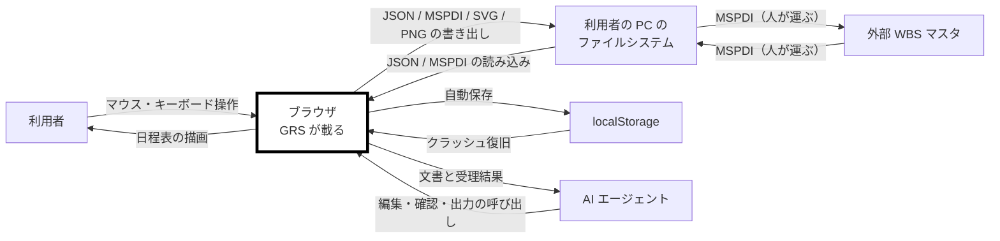

# gr-scheduler 仕様書 — 要求

**Grammar**: spec.sgra
**UID**: DOC-REQUIREMENTS
**Version**: 0.2

本書は第 1 部（Chapter 1 〜 4）である。仕様形式は **ANPS-part**（4 枚）。
書き方の規則は `previous-project-result/20-spec-template/spec-writing-rules.md`、
要望の入力は `previous-project-result/user-order.md` が正である。

> **Chapter 3 と 4 はまだ器である。** 未記入の節は引用で始まる行を持つ。
> `grep -n "^> 未記入" docs/spec/*.md` で残りを引ける。

## Chapter 1. Foundation (基本事項)

### 1.1 Background (背景)

**Type**: SECTION

日程表は、複数の対象と複数の工程が絡む仕事で最も広く使われる図の 1 つである。ところが、それを描く道具は 2 つに割れている。作図ソフトと表計算ソフトは自由に描けるが、成果物は画像であって構造を持たない。日程管理ソフトは構造を持つが、調査した範囲ではいずれも 1 つの行に複数のタスクやマイルストーンを置けない。

そのため「1 対象を 1 行に置き、その対象の全工程を 1 枚で俯瞰する」形式の日程表は、実際には作図ソフトで描かれている。描いた図は日付が動くたびに人が引き直すことになり、他の道具へ渡すこともできない。

本ソフトウェアは、作図ソフトと同じ操作感で日程表を描きながら、成果物として構造化データを持つことを目指す。特定の業種や特定の製品を前提としない、汎用の日程表作成ツールである。

### 1.2 Challenges (課題)

**Type**: SECTION

現状の問題点を表 T-001 に示す。

**表 T-001 — 現状の課題**

| 行 ID | 現状 | 何が起きるか |
| --- | --- | --- |
| C-1 | 日程表を作図ソフトで描いている | 日付が 1 つ動くたびに、図形と線を人が引き直す。更新が滞り、図と実態が離れる |
| C-2 | 成果物が画像である | 他の道具へ渡せず、機械が読めない。同じ日程を別の場所でもう一度入力することになる |
| C-3 | 日程管理ソフトは 1 行に 1 つのタスクしか置けない | 対象ごとの俯瞰ができない。行数が対象数と工程数の積まで膨らむ |
| C-4 | 全体日程が 1 画面に収まらない | スクロールしながら記憶で繋ぐことになり、工程の前後関係を見落とす |

### 1.3 Goals (目標)

#### 1 つの行に複数のタスクを置いて俯瞰できる

**Type**: GOAL
**UID**: GL-001

**STATEMENT**: 利用者が、1 つの行に複数のタスクとマイルストーンを置き、1 つの対象の全工程を 1 行で見渡せる状態になること。

#### 全体日程を 1 画面で見られる

**Type**: GOAL
**UID**: GL-002

**STATEMENT**: 利用者が、プロジェクトの全体日程をスクロールせずに 1 画面で見られる状態になること。

#### 操作が引っかからない

**Type**: GOAL
**UID**: GL-003

**STATEMENT**: 利用者が、ズーム・パン・ドラッグのいずれを行っても、操作が引っかからずに追従する状態になること。

#### 成果物が構造化データである

**Type**: GOAL
**UID**: GL-004

**STATEMENT**: 描いた日程表が、画像ではなく機械が読める構造化データとして出し入れでき、外部 WBS マスタとの間を情報を落とさずに往復できる状態になること。

#### 1 つのファイルだけで動く

**Type**: GOAL
**UID**: GL-005

**STATEMENT**: 利用者が、1 つの `.html` をブラウザで開くだけで、サーバーもインストールも無しに日程表を編集できる状態になること。

#### マニュアルを読まずに使える

**Type**: GOAL
**UID**: GL-006

**STATEMENT**: 初めて触る利用者が、マニュアルを読まずに主要な操作へ到達できる状態になること。

### 1.4 Approach (解決方針)

**Type**: SECTION

実装言語は TypeScript とする。ビルドは Vite で行い、生成した JavaScript と CSS を 1 つの `.html` へ埋め込んで出力する。テストは、値だけで決まる層を Vitest で、利用者の操作を通した確認と性能の計測を Playwright で行う。テストコードの置き場と Chapter 8 〜 10 の対応は Chapter 7 が定める。

⚠️ **Vite は型を検査しない。** TypeScript から型注釈を落とすだけなので、型エラーがあってもビルドは通る。型検査は `tsc --noEmit` として別に実行する。

**描画方式と層の分け方は本章では決めない。Chapter 5 で決める。** 前プロジェクトは描画方式を決めているが、その決定記録は引継ぎ資産に含まれておらず、残っているのは「次期にも同じ選択を推奨する」という推奨までである（`previous-project-result/09-architecture/architecture-entry-ja.md` §1）。**推奨を決定として書かない。** 方式の理由と代償は `previous-project-result/04-performance/performance-notes-ja.md` §1 E-1 にあり、Chapter 5.1 はそれを読んだうえで決める。

**性能は骨格の段階で実測してから機能を積む。** 前プロジェクトは骨格に性能ゲートを置くところまでは正しく行い、そこで 1 度測ったきり完成版を一度も測らなかった。Chapter 10 の非機能テストは節目ごとに再計測して結果を足す。

### 1.5 Scope (範囲)

**Type**: SECTION

本プロジェクトの範囲を表 T-002 に示す。

**表 T-002 — 範囲**

| 行 ID | 区分 | 内容 |
| --- | --- | --- |
| S-1 | In-scope | 日程表の作成・編集・表示。1 行に複数のタスクを置くこと（マルチバー）。行の階層と畳み。異方性ズームと表示量の増減 |
| S-2 | In-scope | 予定と実績の管理・表示。進捗の可視化 |
| S-3 | In-scope | タスク間の依存関係の表現と自動配線 |
| S-4 | In-scope | 注記・強調・カーソル・透かし |
| S-5 | In-scope | JSON と MSPDI XML の双方向 Import / Export。複数 MSPDI の合流 |
| S-6 | In-scope | SVG と PNG の出力 |
| S-7 | In-scope | 人間向け UI と同格の機械向けインターフェース |
| S-8 | Out-of-scope | 資源管理（工数・割当率・稼働率）。ただし担当者の表示と割当の追加・編集・解除は行う |
| S-9 | Out-of-scope | コスト管理・EVM・出来高管理・資源平準化 |
| S-10 | Out-of-scope | クリティカルパス計算とスケジューラ。日付は人が決める |
| S-11 | Out-of-scope | カスタムフィールドの汎用機構 |
| S-12 | Out-of-scope | サーバー通信・認証・共同編集。設計の余地だけ残す |
| S-13 | Out-of-scope | 絵文字アイコンの対応。アイコンの外部からの取り込み |
| S-14 | Out-of-scope | タッチ操作とモバイル表示 |

### 1.6 Constraints (制約事項)

**Type**: SECTION

破ることのできない制約を表 T-003 に示す。

**表 T-003 — 制約事項**

| 行 ID | 制約 | 内容 |
| --- | --- | --- |
| CN-1 | 単一ファイル | 成果物は 1 つの `.html` とする。サーバーを必要とせず、ネットワークから切り離した状態で全機能が動くこと |
| CN-2 | 対応ブラウザ | Chromium 系（Chrome / Edge）を基準とする。Firefox は動作確認に留め、Safari は対象外とする |
| CN-3 | 対応 OS | 問わない。単一ファイルでネットワークを持たないため、OS 差は実質フォントだけである |
| CN-4 | 入力機器 | マウスとキーボードのみとする。タッチは対象外とする |
| CN-5 | 文字コード | UTF-8・BOM なしとする。JSON は RFC 8259 が BOM の付加を禁じており、MSPDI XML も同じ扱いとする |
| CN-6 | 外部通信 | 実行時に外部へ通信しない。外部から取得する資源を持たない |
| CN-7 | 第三者著作物 | 第三者の著作物を成果物にもリポジトリにも同梱しない |
| CN-8 | 内容セキュリティ方針 | 単一 HTML に対する CSP を持つ。`img-src` は `data:` とする |

### 1.7 Limitations (制限事項)

**Type**: SECTION

要求を完全には満たさないが、許容すると決めた既知の妥協点を表 T-004 に示す。

**表 T-004 — 制限事項**

| 行 ID | 制限 | なぜ許容するか |
| --- | --- | --- |
| LM-1 | 透かしの除去は暗号的に防げない。クライアント単体で動く単一 HTML であるため、DOM を直接編集すれば透かしは消せる | 目的は撮影されたときの証跡であり、弱い抑止で足りる。強制するにはサーバー配備が要る |
| LM-2 | 「WCAG 2.1 AA 適合」とは名乗らない | 支援技術による読み上げを対象外にしたため。条文に部分適合の概念が無く、1 つでも外せば適合とは言えない。AA は指針として使い、視覚と操作に絞る |
| LM-3 | 書き出した担当者を外部ツールがどう扱うかは未検証である | 実機での確認が要る。開発を止める理由にはならないが、検証するまで断定しない |
| LM-4 | 扱える文書の大きさはブラウザのメモリに収まる範囲に限られる | サーバーもデータベースも持たない構成の帰結である。上限に達したときは人に知らせる |

### 1.8 Glossary (用語集)

**Type**: SECTION

本書で使う語を表 T-005 に示す。**用語の正は引継ぎ資産の 4 文書にあり、本表はそこからの引用である。食い違ったら正の側が勝つ。**

**表 T-005 — 用語**

| 行 ID | 語 | 意味 | 正の所在 |
| --- | --- | --- | --- |
| G-1 | `Task` | 日程要素。バーもマイルストーンも `Task` であり、`Task.milestone`（真偽値）で区別する | `03-ui-naming/ui-parts-ja.md` |
| G-2 | `TaskGroup` | `Task` が載る器。入れ子で階層になる（最大 5 段）。画面に描いたものは行（`Rows`） | 同上 |
| G-3 | `TaskGroupMember` | どの `Task` がどの `TaskGroup` に載るかの対応 | 同上 |
| G-4 | `stackOrder`（積み順） | 1 つの `TaskGroup` の中で縦に積む順。`null` は自動を表す | 同上 |
| G-5 | マルチバー | 1 つの行に複数の `Task` が載っている状態。`TaskGroup` と `TaskGroupMember` がその実体である | 同上 |
| G-6 | WBS | タスクの親子の木。`Task.wbs_parent_uid` が持つ。MSPDI へ書き出す | `02-data-model/grs-native-erd-ja.md` |
| G-7 | 外部 WBS マスタ | 本ソフトウェアの外側で WBS を持ち、MSPDI を生成・再取込する対向ツール。特定の製品を指す語ではない | `user-order.md` |
| G-8 | MSPDI | 外部 WBS マスタとの交換に用いる XML 形式。事実の正は公式スキーマ（XSD）である | `01-mspdi/mspdi-pitfalls-ja.md` |
| G-9 | 予定 / 実績 | 同じ 1 つの `Task` が両方を持つ。別のアイテムにも別の行にもしない | `07-plan-actual/plan-actual-decisions-ja.md` |
| G-10 | Progress Marker（進捗マーカー） | 実績バーの右端の外側に出る、状態を変える入口。形が意味を担う | 同上 |
| G-11 | Progress Line（イナズマ線） | 遅れの分布を 1 本の折れ線で示す重ね描き。ボトルネックの可視化に使う | 同上 |
| G-12 | LOD | ズームに応じて表示する `Task` を増減させる仕組み。判定は WBS の階層の深さで行う | `user-order.md` 36 |
| G-13 | Carry | 本ソフトウェアが使わない MSPDI の項目を、そのまま持ち回って書き戻す仕組み | `02-data-model/grs-native-erd-ja.md` |

### 1.9 Notation (表記規約)

**Type**: SECTION

本書は RFC 2119 / RFC 8174 に従う。SHALL / MUST は必須、SHOULD は推奨、MAY は任意を表す。規範語として扱うのは大文字で書かれた場合に限る。

**例外:** EARS 構文中の小文字 `shall` は、本書では大文字の SHALL と同じ拘束力を持つものとする。

**文体:** 記述文では主語と他動詞の目的語を省略しない。指示文（「〜する（MUST）」の形）はこの限りでない。

**EARS 構文パターンを表 T-006 に示す。**

**表 T-006 — EARS 構文パターン**

| 行 ID | パターン | 英語構文 | 日本語の形 | 用途 |
| --- | --- | --- | --- | --- |
| E-1 | Ubiquitous | The [System] shall [Response]. | [System] は、[Response] すること。 | 常に成り立つ要求 |
| E-2 | Event-driven | **When** [Trigger], the [System] shall [Response]. | [Trigger] したとき、[System] は、[Response] すること。 | イベント起点の要求 |
| E-3 | State-driven | **While** [In State], the [System] shall [Response]. | [In State] の間、[System] は、[Response] すること。 | 状態依存の要求 |
| E-4 | Unwanted Behavior | **If** [Trigger], then the [System] shall [Response]. | もし [Trigger] ならば、[System] は、[Response] すること。 | 異常系・例外処理 |
| E-5 | Optional Feature | **Where** [Feature is included], the [System] shall [Response]. | [Feature] がある場合、[System] は、[Response] すること。 | オプション機能・条件付き機能 |
| E-6 | Complex | **While** [In State], **when** [Trigger], the [System] shall [Response]. | [In State] の間、[Trigger] したとき、[System] は、[Response] すること。 | 複合条件の要求。**状態が先、契機が後**（原論文の節順に従う） |

**条件は主語より先に書く（MUST）。これが EARS の要点である。**

**要求は必ず「〜すること。」で終える（MUST）。** 事実の記述は「〜する。」、推奨は「〜が望ましい。」で区別する。

> **`Where` は、製品にその機能が入っているかどうかで分ける。実行時に切り替わるものは State-driven である（MUST）。**

**`[System]` の定義。** EARS の `[System]` は、**Chapter 2.2 で「対象ソフトが載る」と記した機器の上で動くソフトウェアを指す。Chapter 2 を書かずに Chapter 4 を書いてはならない（MUST NOT）。**

**表と図の参照（本書の書き方の要）。**

**細目が表または図で表せるなら、要求は 1 文でそれを指すこと（MUST）。行ごとに要求ノードを作ってはならない（MUST NOT）。**

| | 書き方 |
| --- | --- |
| 良い | 「〜の判定は表 T-012 に従うこと。」／「〜を構成するクラスは図 F-004 に従うこと。」 |
| 悪い | 「aaa は bbb であること。」「ccc は ddd であること。」…と細目を要求ノードで並べる |

要求ノードは 1 つずつが UID・理由・関係・検証するテストを連れてくる。表で表せる細目をノードに割ると、文書も追跡も重くなるだけで、得るものが無い。

- **番号は席番号とする（MUST）。** 表は `表 T-001`、図は `図 F-001` の形で通し番号を振り、途中の表や図を削っても残りの番号を詰め直してはならない（MUST NOT）。
- **表の第 1 列は行 ID とする（MUST）。** テストが落ちたときに、行 ID がそのまま仕様の 1 行を指せるようにするためである。
- **表を指す要求を検証するテストは、表を写した固定データで駆動すること（SHOULD）。** 行ごとにテストを書くのではなく、1 つのテストが表の全行を回る形にする。
- **大きい図は `_assets/fig-<name>.md` へ出し、本文からは参照だけを書く（MUST）。** 図の行数はそのまま、その仕様書を読むすべての者の固定費になる。

**図:** 判定の閾値を変更した場合はここに記す。

## Chapter 2. System Overview (システム概要)

### 2.1 Overview Diagram (概要図)

**Type**: SECTION

構成の概要を図 F-001 に示す。対象ソフトが載る機器を太枠で示す。色は使わない。線のラベルには何が流れるかを書く。

**図 F-001 — 構成の概要**

**外部 WBS マスタとの間にネットワークの線は無い。** ファイルを人が運ぶ。これは制約 CN-1 と CN-6 の帰結である。

### 2.2 Devices (機器)

**Type**: SECTION

構成する機器を表 T-007 に示す。

**表 T-007 — 機器**

| 行 ID | 機器 | 種別 | 対象ソフトが載るか | 供給元 | こちらで変えられるか |
| --- | --- | --- | --- | --- | --- |
| D-1 | 利用者の PC のブラウザ | Chromium 系 Web ブラウザ | **載る** | 既存 | 変えられない |
| D-2 | 利用者の PC のファイルシステム | ローカル記憶 | 載らない | 既存 | 変えられない |
| D-3 | ブラウザの localStorage | ブラウザ内蔵の記憶 | 載らない | 既存 | 変えられない |
| D-4 | 外部 WBS マスタが動く環境 | 対向ツール | 載らない | 既存 | 変えられない |
| D-5 | AI エージェントの実行環境 | 自動化の主体。利用者の PC 上で動く | 載らない | 既存 | 変えられない |

> **EARS の `[System]` は、D-1 の上で動く単一 `.html` の本ソフトウェアを指す。**
> 以降の要求で主語となるのはこれだけである。D-2 から D-5 は本ソフトウェアの外側にあり、
> **こちらで挙動を変えられない**。それらに対する要求を書いてはならない（MUST NOT）。

### 2.3 Routes (経路)

**Type**: SECTION

機器の間を流れるものを表 T-008 に示す。

**表 T-008 — 経路**

| 行 ID | from | to | 運ぶもの | 方式 | 入力として信頼できるか |
| --- | --- | --- | --- | --- | --- |
| R-1 | D-2 | D-1 | JSON / MSPDI XML | ファイル選択またはドラッグ＆ドロップ | **信頼できない** |
| R-2 | D-1 | D-2 | JSON / MSPDI XML / SVG / PNG | ダウンロード | 該当なし（送信のみ） |
| R-3 | D-3 | D-1 | 自動保存された文書 | Web Storage の読み出し | **信頼できない** |
| R-4 | D-1 | D-3 | 同上 | Web Storage の書き込み | 該当なし（送信のみ） |
| R-5 | D-5 | D-1 | 編集・確認・出力の指示 | 単一 `.html` が公開する関数の呼び出し | **信頼できない** |
| R-6 | D-1 | D-5 | 文書と受理結果 | 同上の戻り値 | 該当なし（送信のみ） |
| R-7 | D-4 | D-2 | MSPDI XML | 人が運ぶ（共有フォルダ・メール等） | 該当なし（本ソフトウェアの外） |
| R-8 | D-2 | D-4 | MSPDI XML | 同上 | 該当なし（本ソフトウェアの外） |

> **ネットワークを通る経路は 1 本も無い。**
> **自分が書いたものを読み戻す R-3 も「信頼できない」に数える。** localStorage は
> 同じブラウザの他のページからも書き換えられるので、出所を自分だと仮定できない。

### 2.4 Exclusions (持たないもの)

**Type**: SECTION

構成に含まれないものを表 T-009 に示す。

**表 T-009 — 持たないもの**

| 行 ID | 持たないもの | 理由 |
| --- | --- | --- |
| X-1 | サーバーとネットワーク通信 | 単一 `.html` で完全にオフラインで動くこと（CN-1・CN-6）。将来拡張として設計の余地だけ残す |
| X-2 | 利用者アカウントと認証 | X-1 と同じ。共同編集と権限設定は将来拡張である |
| X-3 | データベース | 文書はファイル（D-2）と localStorage（D-3）だけで持つ |
| X-4 | AI 推論の実行系 | 本ソフトウェアは AI を持たない。機械向けの口を持つだけである |
| X-5 | 日付を自動で決める計算系 | 日付は人が決める。クリティカルパス計算と資源平準化は範囲外である（S-10） |
| X-6 | タッチ入力とモバイル表示 | 入力機器をマウスとキーボードに限る（CN-4） |

## Chapter 3. Use Cases (ユースケース)

### 3.1 Actors (アクター)

**Type**: SECTION

> 未記入。アクター・種別・対応する機器・関心の表。D-5 の AI エージェントを外部システムのアクターとして含める。

### 3.2 Use Cases (ユースケース)

**Type**: SECTION

> 未記入。`USE_CASE` ノード（`UC-xxx`）を並べる。目標を動詞句で書き、`SCENARIO` と `EXTENSIONS` を持たせ、`GL-xxx` を親に取る。

## Chapter 4. Requirements (要求)

### 4.1 Functional Requirements (機能要求)

**Type**: SECTION

> 未記入。`FUNC_REQ` ノード（`FR-xxx`）を並べる。EARS 1 文・`ORIGIN`（どの手順または拡張から来たか）・`RATIONALE` を持たせ、`UC-xxx` を親に取る。細目は表に置き、要求はその表を指す（1.9）。

### 4.2 Non-Functional Requirements (非機能要求)

**Type**: SECTION

> 未記入。`NON_FUNC_REQ` ノード（`NFR-xxx`）を並べる。測定可能な数値基準を含めること。基準線は `04-performance/performance-notes-ja.md` §2-0 の基準機・基準ブラウザの条件で測った数字だけを使う。

### 4.3 Reduction Candidates (削減候補)

**Type**: SECTION

> 未記入。親も子も持たない UID を並べ、外すと何が起きるかとユーザーの判断を書く。Chapter 4 を書き終えてから埋める。
