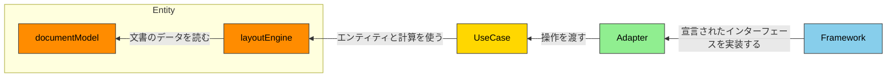
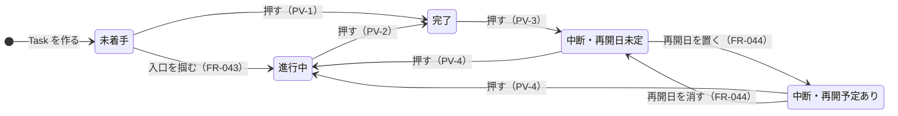

# gr-scheduler 仕様書 — 設計

**Grammar**: spec.sgra \
**UID**: DOC-DESIGN \
**Version**: 0.4

本書は第 2 部（Chapter 5 〜 7）である。

> **この文書はまだ器である。** 未記入の節は引用で始まる行を持つ。

## Chapter 5. Design (設計)

**Type**: SECTION

### 5.1 Architecture Concept (アーキテクチャ方式)

**Type**: SECTION

**Clean Architecture を採る。** 層は `Entity` / `UseCase` / `Adapter` / `Framework` の 4 つとし、既定の名前をそのまま使う。**`Entity` の内側は、さらに `documentModel` と `layoutEngine` に分ける。**

**層の凡例と依存の向きを 図 F-012 に、各層に置くものを 表 T-060 に、依存の規則を 表 T-061 に示す。**

**図 F-012 — 層と依存の向き**



**矢印は依存の向きを表し、ラベルはその依存が何のためかを表す。外向きの辺は 1 本も無い。** 本図は層の凡例であり、**コンポーネントどうしの辺は Chapter 5.2 が持つ。** 層を飛び越す例（`LR-1`）—— SVG を作るコンポーネントは `Adapter` にあるが、`UseCase` を通らずに `layoutEngine` を直接読む。

**表 T-060 — 層**

| 行 ID | 層 | 置くもの | 純粋性 |
| --- | --- | --- | --- |
| LY-1 | `Entity` / `documentModel` | 表 T-052 が定める文書ルートの 3 群すべて（日程データの群のエンティティは 表 T-056）と、その不変条件（全数は Chapter 6.1 が持つ）。および**文書に保存しない実行時の値**（取り消しの履歴・選択・確定した発話・画面の使い方の値。いずれも不変の値として持ち、丸ごと置き換える） | すべて `pure` |
| LY-2 | `Entity` / `layoutEngine` | 画面の各部の矩形、日付と座標の対応、`Rows` の配置、描くものの頂点、表示量の増減、当たり判定 | すべて `pure` |
| LY-3 | `UseCase` | 文書を変える操作と、確定までの手順。取り込みの検証。変更の通知 | 操作と検証は `pure`、確定と通知は `non-pure` |
| LY-4 | `Adapter` | `Agent API`、SVG の生成、日程表の外側の UI パーツの記述の生成、交換形式との相互変換、画面の入力を操作へ変えること、および**外側の道具を使うためのインターフェースの宣言** | 変換と直列化は `pure`、外を読むものは `semi-pure-b`、残りは `non-pure` |
| LY-5 | `Framework` | **`Adapter` が宣言したインターフェースの実装**（ブラウザの DOM・SVG・File System Access API・`localStorage` を使う）と、単一 `.html` のシェル。**現在値を保持するのはこの層だけである** —— 内側の 3 層はすべて値を引数で受け取る | 外を読むものは `semi-pure-b`、残りは `non-pure` |

**表 T-061 — 依存の規則**

| 行 ID | 規則 |
| --- | --- |
| LR-1 | **層をまたぐ依存は内向きだけとすること（MUST）。外向きの依存を作ってはならない（MUST NOT）。** 内向きであれば層を飛び越してよい |
| LR-2 | **同じ層の中で呼び合ってよい。ただし相手が Chapter 5.3 で宣言したインターフェースを介すること（MUST）。他のコンポーネントの内部へ直に触れてはならない（MUST NOT）** |
| LR-3 | **層の中の呼び出しを非巡回に保つこと（MUST）** —— 巡回すると、どちらが先に成り立つのかを決められなくなる |
| LR-4 | **`layoutEngine` は `documentModel` を読んでよい。`documentModel` が `layoutEngine` を知ってはならない（MUST NOT）** |
| LR-5 | **外側の道具は、内側が宣言したインターフェースを介して使うこと（MUST）。その実装は外側の層が持つこと（MUST）** —— これがあるので `LR-1` に例外が要らない |
| LR-6 | **`Entity` と `UseCase` が、ブラウザの供給する型に触れてはならない（MUST NOT）** |

**本表が規則を持つのは、`R2.16` が層の定義と依存の向きを Chapter 5.1 に置くよう要求しているためである。** 依存の向きは実行して確かめる性質ではなく、構造を静的に見て確かめる性質なので、テストを持つ要求としてではなく本章が持つ。

**`Entity` を 2 つに割るのは、レイアウトがこの道具の価値そのものでありながら、ブラウザを必要としないためである。** 価値は「ペライチ」（`_assets/tbl-glossary.md` の `VK-3`）であり、**それを成り立たせているのが `layoutEngine` の算法である。座標と当たり判定は手段ではなく本質であり、手段はむしろ描き方のほうである** —— 描き方は `Adapter` が持ち、`layoutEngine` は座標までしか持たない。そして `FR-093` が文字の実測を禁じているので、**レイアウトの計算は文字の実寸をブラウザに訊かずに済む。** 画面の寸法は引数として受け取る。割っておくと `NFR-013` の計算量をブラウザ無しで測れる（測り方は表 T-025 の `MC-9` が持つ）。

⚠️ **この方針の代償は `LM-2a` が持つ。** レイアウトを純粋に保てることと、`LM-2a` が適合範囲を絞っていることは、**同じ 1 つの決定の表と裏である。** 片方だけを変えることはできない。

**文書への書き込みの経路は 1 本である。** 人が UI で行えることを `Agent API` でも行えることは `FR-028` が要求し、**双方が同じ経路を通る形は表 T-042 の `MS-1` が定めている。** **入口が 2 つに分かれると、片方にしか掛からない検証や履歴が生まれる。**

**描画はその経路を通らない。** 描画は文書を読むだけで変えないので、書き込みの経路に載せる理由が無い。**載せると、画面を描くたびに書き込みの経路が起動する。**

**設計の合否は `docs/development-rules/07-review-standards.md` の `R2` で判定する**（`FR-092` の `EZ-5`）。**同書は `R7`（純粋性・構造）も Chapter 5 〜 6 を対象と定めている。** `R2.6`（DIP）は `LR-5` が満たす。

### 5.2 Components (コンポーネント)

**Type**: SECTION

**コンポーネントを 表 T-062 に、全体を 図 F-013 に、経路ごとの詳細を 図 F-014 〜 図 F-017 に示す。** 層の定義と依存の規則は 5.1 が持つ。

**コンポーネントはすべて機器 `D-1` に載る。** 表 T-007 で「対象ソフトが載る」機器は `D-1` だけであり、`D-2` 〜 `D-5` に載るコンポーネントは 1 つも無い。

**コンポーネントを分ける基準は 1 つである** —— **同じ表・同じ要求が寸法と規則を持っているなら 1 コンポーネント、別々の要求が持っているなら別コンポーネントとする。** `ScheduleGeometry` が予定・実績・依存線・注記をまとめて持つのは、それらの寸法を 表 T-201 が 1 枚で持ち `FR-094` が縛っているからであり、逆に `Framework` の 7 コンポーネントが分かれているのは、実装するインターフェースが別だからである。

**表 T-062 — コンポーネント**

| 行 ID | 層 | コンポーネント | 責務 | 正 |
| --- | --- | --- | --- | --- |
| CP-1 | `documentModel` | `Schedule` | 日程データの群と、その不変条件。**予実の状態と遅れの判別。暦に従った稼働日の数え上げ** | 表 T-052 の `DR-2` / `FR-010`（表 T-019a）/ `FR-047`（表 T-021b）/ `FR-054` |
| CP-2 | `documentModel` | `DocumentSettings` | 見せ方の群。保存する値と、その下限・上限 | 表 T-052 の `DR-3` / `FR-063` |
| CP-3 | `documentModel` | `DocumentStamp` | 文書の刻印と、版を進める純粋関数 | 表 T-052 の `DR-4` / `FR-063` |
| CP-4 | `documentModel` | `EditHistory` | 取り消しの履歴。不変の値として持つ | `FR-031` |
| CP-5 | `layoutEngine` | `ScheduleLayout` | 時間軸、ラベル幅の概算、`Rows` の配置、表示量の増減、全体を収める表示 | `FR-017` / `FR-093` / `FR-003` / `FR-018` / `FR-055` |
| CP-6 | `layoutEngine` | `ScheduleGeometry` | 描くものの頂点。バー・依存線・イナズマ線・カーソル・注記・透かし | `FR-094` / `FR-009` / `FR-014` |
| CP-7 | `layoutEngine` | `ItemHitArea` | ポインタが指すアイテムの判定 | 表 T-023c の `SL-1` |
| CP-8 | `UseCase` | `ApplyDocumentChange` | **文書への書き込みの唯一の経路。** 照合・全か無か・履歴・刻印・通知 | 表 T-042 の `MS-1` / `FR-028` / `AG-2` / `AG-3` / `FR-031` / `FR-063` |
| CP-9 | `UseCase` | `EditDocument` | 集約ごとの編集。検証して新しい文書を返すだけで、確定させない | 表 T-027 / `FR-088` |
| CP-10 | `UseCase` | `ImportDocument` | 取り込みと合流 | `FR-087` / `FR-022` |
| CP-11 | `UseCase` | `UndoEdit` | 履歴を 1 段戻す | `FR-031` |
| CP-12 | `UseCase` | `RedoEdit` | 履歴を 1 段進める | `FR-031` |
| CP-13 | `UseCase` | `ValidateImportedDocument` | 信頼できない入力の検証。取り込みの 3 経路が共有する | `FR-023` / `NFR-009` |
| CP-14 | `UseCase` | `ChooseStartupDocument` | 起動時に開く文書を決める | `FR-062` / 表 T-034 |
| CP-15 | `UseCase` | `NotifyChangeWatchers` | 確定を購読者へ配る | 表 T-035 の `AG-6` |
| CP-16 | `UseCase` | `PostDialogueMessage` | 確定した発話を `DialogueLog` へ積み、配る。文書に保存しない | `FR-066` / 表 T-035 の `AG-11` |
| CP-17 | `Adapter` | `AgentApiEndpoint` | `Agent API` を設置する。既定で公開しない。`SnapshotSource` を宣言する | `FR-028` / `FR-065` / 表 T-035 / 表 T-107 |
| CP-18 | `Adapter` | `InputCommandTranslator` | 画面の入力を操作へ変える。`InputSource` を宣言する | `FR-016` / `FR-070` |
| CP-19 | `Adapter` | `SvgRenderer` | 幾何から SVG 文字列を作る。`SvgSurface` を宣言する | `FR-080` |
| CP-20 | `Adapter` | `DocumentCodec` | `GRS JSON`・`MSPDI`・単一 `.html` を文書と相互変換する。`AppShellSource` を宣言する | `FR-024` / `FR-021` / `FR-056` / `FR-057` / `FR-067` |
| CP-21 | `Adapter` | `ImageExporter` | 画像として書き出す。**表 T-076 が「描く」と定めた UI パーツを組み立てる。⛔ 縦に収まらないときは、絵を返さずに拒む**（`FR-025`、利用者の裁定 2026-09-02）—— **2026-09-02 まで「収まらない `TaskGroup` を落とす」と書いていた。** `Rasterizer` を宣言する | `FR-025` / `FR-080` |
| CP-22 | `Adapter` | `FileGateway` | ファイルの読み書き。`FileStore` を宣言する | `FR-060` / 表 T-024 |
| CP-24 | `Adapter` | `ClipboardGateway` | クリップボードへ出す。`Clipboard` を宣言する | `FR-033` / `FR-068` |
| CP-25 | `Framework` | `SingleHtmlShell` | 起動と結線。**起動の順序は 表 T-077、フレームを起こす契機の観測は 表 T-078 に従う。** **現在値を保持する。** **フレームの先頭で画面の矩形とレイアウトと幾何を 1 回計算して配り**、描画を回し、入力を渡す。埋め込みの入れ物を持ち、公開点を置く。`SnapshotSource` と `AppShellSource` の実装 | `FR-067` / `FR-065` / `NFR-011` / 5.6 の ADR-001 |
| CP-26 | `Framework` | `DomSvgSurface` | `SvgSurface` の実装 | — |
| CP-27 | `Framework` | `DomInputSource` | `InputSource` の実装 | — |
| CP-28 | `Framework` | `FileSystemAccessFileStore` | `FileStore` の実装。**ファイルのハンドルを保持する** | `FR-060` |
| CP-30 | `Framework` | `BrowserClipboard` | `Clipboard` の実装 | `FR-033` |
| CP-31 | `Framework` | `CanvasRasterizer` | `Rasterizer` の実装 | `FR-025` |
| CP-32 | `documentModel` | `Selection` | 選ばれている対象の集合と、選んだ順序。文書に保存しない | 表 T-023c の `SL-1` / `SL-7b` / `SL-8` |
| CP-33 | `documentModel` | `DialogueLog` | 確定した発話と、刻印とは別の順序。文書に保存しない | `FR-066` / 表 T-035 の `AG-11` / `AG-6` |
| CP-34 | `documentModel` | `Document` | **文書ルートの合成と、`DR-1` の不変条件**（ルートに 3 群だけを置く／群に属する値をルート直下へ直に置かない） | 表 T-052 の `DR-1` |
| CP-35 | `layoutEngine` | `ScreenRegions` | **画面の各部の矩形**（各部の名は 表 T-103 が持つ）と、ポインタがどの領域にあるかの判定 | `FR-051` |
| CP-36 | `documentModel` | `ScreenState` | **文書に保存しない画面の値** —— 構え（全数は 表 T-023b）と、表 T-206 の `S-99e` / `S-99f` / `S-99g` | `FR-053` / `FR-071` / 表 T-023b |
| CP-37 | `Adapter` | `ScreenRenderer` | 日程表の外側の UI パーツの記述を作り、対話欄で確定した発話を渡す。`ScreenSurface` を宣言する | `FR-051` / `FR-006` / `FR-036` / `FR-053` / `FR-076` / `FR-066` |
| CP-38 | `Framework` | `DomScreenSurface` | `ScreenSurface` の実装 | — |

**各コンポーネントの内側のユニットと、公開するインターフェースは Chapter 5.3 が宣言する。** 本表が定めるのはコンポーネントの境界だけである。

**規約のうち、意図して満たさないものが 2 つある。**

> **`R2.13`（CQS・SHOULD）** —— `ApplyDocumentChange` は文書を変え、かつ結果を値で返す。**`FR-028` が「受理したか否かを値で返すこと」を、`AG-9a` が拒否の値の中身を、それぞれ MUST で定めているためである。** 状態変更とその結果通知を分けると、2 回の呼び出しの間に別の書き込みが入り、`AG-3` の原子性が保てない。

> **`R2.5`（ISP・SHOULD）** —— `Agent API` は 18 のメンバを 1 つの面に載せ、用途別に分けない。**`FR-028` が入口を 1 つと定めているためである。** 呼ぶ側が複数の面を持つと「人間向け UI と同格」が崩れる。**同条項が禁じているのは「使わないメソッドを実装させられること」であり、実装は 1 つなのでその害は生じない。**

**図の原稿は `_source/components.json` である**（コンポーネント・辺・層の木）。**`_source/build.py` が `.svg` と `docs/review/components/components.md` を書き出す。`.svg` と `.drawio` を手で直してはならない（MUST NOT）** —— 次の生成で消える。**図とその一覧を同じ原稿から起こすことで、両者の食い違いが起きないようにしている。**

**箱はコンポーネントである。** 層ごとに枠で囲み、**内側の層ほど上に置いた。矢印はすべて上を向く。** **本図の矢印は層と層の間だけを結ぶ。** コンポーネントどうしの辺は経路ごとの図（図 F-014 〜 図 F-017）が持つ。**層をまたぐ矢印は、それを裏づけるコンポーネントどうしの辺が 1 本以上あるときにだけ描かれる**（`build.py` が検算する）。

**図 F-013 — コンポーネントと層**

[](_assets/fig-components.svg)

**図をクリックすると原寸で開く。**

**人向けの画面と `Agent API` が同じ入口へ入り、確定して配るまでを 図 F-014 に示す。** 入口が 1 つであることは `FR-028` と 表 T-042 の `MS-1` が定める。

**図 F-014 — 書き込みの経路**

[](_assets/view-write.svg)

**描画が書き込みの経路を通らないことを 図 F-015 に示す。** SVG を作るコンポーネントは `Adapter` にあるが、`UseCase` を通らずに `layoutEngine` を直接読む。

**図 F-015 — 読み取りの経路**

[](_assets/view-read.svg)

**ファイル・保管庫・クリップボード・画像と、取り込みの検証を 図 F-016 に示す。** 取り込みの 3 経路が同じ検証を通ることは `FR-023` が要求する。

**図 F-016 — 出し入れの経路**

[](_assets/view-io.svg)

**シェルが結線し、開く文書を決め、`Agent API` を公開し、発話を配るまでを 図 F-017 に示す。** 開く文書の順は 表 T-034 が持つ。

**図 F-017 — 起動の経路**

[](_assets/view-startup.svg)

### 5.3 File Structure (ファイル構成)

**Type**: SECTION

**本節が宣言するのは公開インターフェースである** —— **コンポーネントの外から呼んでよい名前の全数**のことである。**`R2.19` が各コンポーネントの公開面を本節に置くよう要求しており、その定義の正とする用語集がこのリポジトリに無いので、本節が定義を持つ。** 表 T-061 が規則を持つのと同じ事情である。

⚠️ **これを「面」と呼ばない。** 表 T-006a の「面ごとの記法」・画面の面・前面と背面で 3 義あるためである。**層をまたぐ 8 本だけは「層をまたぐインターフェース」と呼び分け（表 T-065）、裸の「インターフェース」を書かない。**

**構造の単位を 3 語で呼び分ける。全数と定義を 表 T-074 に示す。** 本節が定義を持つ事情は公開インターフェースと同じである。⚠️ **「部品」を使ってはならないことは 表 T-006b の `A-17` が定める。**

**表 T-074 — 構造の単位**

| 行 ID | 語 | 定義 | 本設計での全数 |
| --- | --- | --- | --- |
| SU-1 | **コンポーネント** | **フォルダの外へ見せる公開エントリを 1 つ持つもの**（規則は本節が MUST で定める）。⚠️ **公開メンバを持たないものもある** —— `CP-25` は Vite の入口であり、他から呼ばれるメンバを持たない（`PI-25`） | **36。** 全数は 表 T-062、公開する名前は 表 T-064 |
| SU-2 | **モジュール** | **複数のユニットを束ねた、コンポーネントの一部。** 外へは公開しない | ⭐ **0** |
| SU-3 | **ユニット** | **1 ファイル。** 公開エントリもユニットである | **68。** 全数は 表 T-075、割った理由は 表 T-063 |

**入れ子は コンポーネント ＞ モジュール ＞ ユニット である。** **モジュールは任意の中間段であり、無いときはコンポーネントが直にユニットを持つ。**

⚠️ **本設計にモジュールは 1 つも無い。** 表 T-075 のとおり `ScreenRenderer` と `EditDocument` が最も多くのユニットを持つが、**どちらも平らに並べている。** 束ねる必要が出たときに階層を足す —— **要らないうちは作らない**（`R2.9`）。

**コンポーネントごとにフォルダを作り、コンポーネント名と語幹が同じ 1 ファイルだけを公開エントリとすること（MUST）。フォルダの外から、公開エントリ以外のファイルを読んではならない（MUST NOT）** —— 読めてしまうと、`LR-2` の「他のコンポーネントの内部へ直に触れてはならない」を検査できない。記法は 表 T-006a の `W-11` である。

**どのコンポーネントもインスタンスを作らない。公開するのは型と関数だけである。** 表 T-060 の `LY-5` が「現在値を保持するのは `Framework` だけである」と定めたことの帰結であり、**内側の 3 層には漏らせる可変状態がそもそも無い。**

**ユニットを割る基準は純粋性である**（`R7.9`）—— **純粋な側と非純粋な側が同じコンポーネントにあるとき、別のファイルへ出す。** それ以外の理由で割ったものは 表 T-063 が行ごとに理由を持つ。**ユニットの全数と、どのコンポーネントに属するかは 表 T-075 が持つ。**

**`UseCase` のコンポーネント名は動詞句であり**（`R2.1` の層別表）、**そのコンポーネントが公開する操作はコンポーネント名を camelCase にしたものとする** —— 同じ概念に 2 つの語を与えないためである。**記法が違うだけで、食い違いではない**（表 T-006a の `W-1` と `W-2`）。⚠️ **外側の状態を読むメンバだけは動詞＋目的語とする** —— 名詞にすると、遅さと失敗しうることが名前から消える。

**`main.ts` を作らない。** Vite の入口は `single-html-shell.ts` である —— 表 T-062 の `CP-25` が「起動と結線」を負う。**テストコードの置き場は Chapter 7 が持つ。本節は `src/` だけを持つ。**

**ディレクトリ構成を次に示す。36 のフォルダは 表 T-062 の 36 コンポーネントと 1 対 1 である。**

```text
src/
  entity/
    document-model/   document/ · schedule/ · document-settings/ · document-stamp/
                      edit-history/ · selection/ · dialogue-log/ · screen-state/
    layout-engine/    schedule-layout/ · schedule-geometry/ · item-hit-area/
                      screen-regions/
  use-case/           apply-document-change/ · edit-document/ · import-document/
                      undo-edit/ · redo-edit/ · validate-imported-document/
                      choose-startup-document/ · notify-change-watchers/
                      post-dialogue-message/
  adapter/            agent-api-endpoint/ · input-command-translator/ · svg-renderer/
                      document-codec/ · image-exporter/ · file-gateway/
                      clipboard-gateway/ · screen-renderer/
  framework/          single-html-shell/ · dom-svg-surface/ · dom-input-source/
                      file-system-access-file-store/ · browser-clipboard/
                      canvas-rasterizer/ · dom-screen-surface/
```

**ユニットを割った理由を 表 T-063 に、ユニットの全数を 表 T-075 に、36 コンポーネントの公開インターフェースを 表 T-064 に、層をまたぐ 8 本を 表 T-065 に示す。**

**表 T-063 が持つのは、割った理由だけである。** ⚠️ **層をまたぐインターフェースの 8 ファイルは本表に行を持たない** —— 割った理由が「宣言の置き場」の 1 つしか無く、その規則を 表 T-065 の後で本節が定めるからである。**ユニットの全数を数える表は 表 T-075 である。**

**表 T-063 — ユニットを割った理由**

| 行 ID | コンポーネント | ユニット | 割った理由 |
| --- | --- | --- | --- |
| UT-1 | `ApplyDocumentChange` | `apply-document-change.ts` ／ `document-change-plan.ts` | **純粋性。** 表 T-060 の `LY-3` が「操作と検証は `pure`、確定と通知は `non-pure`」と定めている |
| UT-2 | `EditDocument` | `edit-document.ts` と、集約ごとの 8 ファイル | **純粋性ではない** —— 表 T-075 のとおり 9 つとも同じである。**集約ごとに変更の理由が別なので割った** —— タスクの規則が変わっても暦の規則は変わらない |
| UT-3 | `NotifyChangeWatchers` | `notify-change-watchers.ts` ／ `change-notice.ts` | **純粋性**（`LY-3`）。⚠️ 選び方の規則は 表 T-035 の `AG-6` にあり、日程データと発話で違う。値だけで決まる |
| UT-4 | `AgentApiEndpoint` | `agent-api-endpoint.ts` ／ `agent-api-members.ts` | **純粋性ではない** —— 表 T-075 のとおり どちらも同じである。**設置は `FR-065`（既定で公開しない）が、18 メンバは 表 T-107 が縛るので、変更の理由が別である** |
| UT-5 | `DocumentCodec` | `document-codec.ts` ／ `json-codec.ts` ／ `mspdi-codec.ts` ／ `embedded-html-codec.ts` | **一部は純粋性** —— 単一 `.html` だけが `AppShellSource` を呼ぶ。**残りは形式ごとに正が別だからである** —— `GRS JSON` は `FR-024`、`MSPDI` は交換相手のスキーマ、単一 `.html` は `FR-067` |
| UT-6 | `SingleHtmlShell` | `single-html-shell.ts` ／ `frame-loop.ts` | **純粋性ではない** —— 表 T-075 のとおり どちらも同じである。**起動は `FR-067` と `FR-065` が、フレームの走行は 表 T-060 の `LY-5` と 5.6 の ADR-001 が縛るので、変更の理由が別である。** ⚠️ **割らないと 1 つのユニットが 8 つの事柄を負い、`R2.2` に反する** —— 5.2 の分割基準「別々の要求が寸法と規則を持っているなら別コンポーネントとする」が、ユニットの側でも同じことを言う |
| UT-7 | `ScreenRenderer` | `screen-renderer.ts` と、UI パーツごとの 9 ファイル | **純粋性ではない** —— 表 T-075 のとおり 10 とも同じである。**UI パーツごとに縛る要求が別なので割った**（`UT-2` と同じ形である）—— ヘルプの規則が変わってもプロパティパネルの規則は変わらない |

**ユニットの全数を 表 T-075 に示す。行は 表 T-062 の `CP-n` の順に並べ、コンポーネントの中では公開エントリを先に置く。**

**責務の欄が `CP-n` を指しているとき、そのユニットは 表 T-062 のその行の責務をそのまま負う** —— **「の残り」と書いたものは、同じコンポーネントの別のユニットが負う分を除いた残りである。**

⚠️ **純粋性は関数ごとの分類である**（`R7.1`）。**本欄はそのユニットが持つ関数の純粋性を重複なく並べたものであり、メンバごとの値は 表 T-064 が持つ。** ⚠️ **層をまたぐインターフェースの 8 ファイルは型の宣言だけを持ち、関数を持たないので、純粋性を持たない（`—`）。**⚠️ **表 T-065 は 8 行であり、同じ章の後段も 8 つの `UF-` を並べている。**⛔⛔ **2026-09-03 まで 9 と書いていた** —— **2026-09-03 に 9 を 8 へ直したときの取り残しである。**

**表 T-075 — ユニット**

| 行 ID | コンポーネント | ユニット | 純粋性 | 責務 |
| --- | --- | --- | --- | --- |
| UF-1 | `Schedule` | `schedule.ts` | `pure` | `CP-1` |
| UF-2 | `DocumentSettings` | `document-settings.ts` | `pure` | `CP-2` |
| UF-3 | `DocumentStamp` | `document-stamp.ts` | `pure` | `CP-3` |
| UF-4 | `EditHistory` | `edit-history.ts` | `pure` | `CP-4` |
| UF-5 | `ScheduleLayout` | `schedule-layout.ts` | `pure` | `CP-5` |
| UF-6 | `ScheduleGeometry` | `schedule-geometry.ts` | `pure` | `CP-6` |
| UF-7 | `ItemHitArea` | `item-hit-area.ts` | `pure` | `CP-7` |
| UF-8 | `ApplyDocumentChange` | `apply-document-change.ts` | `non-pure` | 確定と通知 |
| UF-9 | `ApplyDocumentChange` | `document-change-plan.ts` | `pure` | 照合と、全か無かの組み立て |
| UF-10 | `EditDocument` | `edit-document.ts` | `pure` | 集約ごとの 8 ファイルを束ねて公開する |
| UF-11 | `EditDocument` | `edit-task.ts` | `pure` | `Task` の編集 |
| UF-12 | `EditDocument` | `edit-task-group.ts` | `pure` | `TaskGroup` の編集 |
| UF-13 | `EditDocument` | `edit-dependency.ts` | `pure` | `Dependency` の編集 |
| UF-14 | `EditDocument` | `edit-annotation.ts` | `pure` | 注記（`CommentBox` と `HighlightBox`）の編集 |
| UF-15 | `EditDocument` | `edit-resource.ts` | `pure` | `Resource` と `Assignment` の編集 |
| UF-16 | `EditDocument` | `edit-calendar.ts` | `pure` | `Calendar` の編集 |
| UF-17 | `EditDocument` | `edit-project.ts` | `pure` | `Project` の編集 |
| UF-18 | `EditDocument` | `edit-document-settings.ts` | `pure` | `DocumentSettings` の編集 |
| UF-19 | `ImportDocument` | `import-document.ts` | `pure` | `CP-10` |
| UF-20 | `UndoEdit` | `undo-edit.ts` | `pure` | `CP-11` |
| UF-21 | `RedoEdit` | `redo-edit.ts` | `pure` | `CP-12` |
| UF-22 | `ValidateImportedDocument` | `validate-imported-document.ts` | `pure` | `CP-13` |
| UF-23 | `ChooseStartupDocument` | `choose-startup-document.ts` | `pure` | `CP-14` |
| UF-24 | `NotifyChangeWatchers` | `notify-change-watchers.ts` | `non-pure` | 購読の登録・解除と、配ること |
| UF-25 | `NotifyChangeWatchers` | `change-notice.ts` | `pure` | まだ受け取っていない変更と発話を選ぶ |
| UF-26 | `PostDialogueMessage` | `post-dialogue-message.ts` | `non-pure` | `CP-16` |
| UF-27 | `AgentApiEndpoint` | `agent-api-endpoint.ts` | `non-pure` | 設置と公開点の管理 |
| UF-28 | `AgentApiEndpoint` | `agent-api-members.ts` | `non-pure` | 表 T-107 の 18 メンバの結線 |
| UF-29 | `AgentApiEndpoint` | `snapshot-source.ts` | `—` | `SnapshotSource` の宣言（`IF-7`） |
| UF-30 | `InputCommandTranslator` | `input-command-translator.ts` | `pure` | `CP-18` の残り |
| UF-31 | `InputCommandTranslator` | `input-source.ts` | `—` | `InputSource` の宣言（`IF-2`） |
| UF-32 | `SvgRenderer` | `svg-renderer.ts` | `pure` | `CP-19` の残り |
| UF-33 | `SvgRenderer` | `svg-surface.ts` | `—` | `SvgSurface` の宣言（`IF-1`） |
| UF-34 | `DocumentCodec` | `document-codec.ts` | `pure` | 3 つの符号器を束ねて公開する |
| UF-35 | `DocumentCodec` | `json-codec.ts` | `pure` | `GRS JSON` と文書の相互変換 |
| UF-36 | `DocumentCodec` | `mspdi-codec.ts` | `pure` | `MSPDI` と文書の相互変換 |
| UF-37 | `DocumentCodec` | `embedded-html-codec.ts` | `semi-pure-b` | 単一 `.html` の書き出し |
| UF-38 | `DocumentCodec` | `app-shell-source.ts` | `—` | `AppShellSource` の宣言（`IF-8`） |
| UF-39 | `ImageExporter` | `image-exporter.ts` | `semi-pure-b` | `CP-21` の残り |
| UF-40 | `ImageExporter` | `rasterizer.ts` | `—` | `Rasterizer` の宣言（`IF-6`） |
| UF-41 | `FileGateway` | `file-gateway.ts` | `semi-pure-b` ／ `non-pure` | `CP-22` の残り |
| UF-42 | `FileGateway` | `file-store.ts` | `—` | `FileStore` の宣言（`IF-3`） |
| UF-45 | `ClipboardGateway` | `clipboard-gateway.ts` | `non-pure` | `CP-24` の残り |
| UF-46 | `ClipboardGateway` | `clipboard.ts` | `—` | `Clipboard` の宣言（`IF-5`） |
| UF-47 | `SingleHtmlShell` | `single-html-shell.ts` | `non-pure` | 起動と結線（順序は 表 T-077）、埋め込みの入れ物、公開点を置くこと、`AppShellSource` の実装 |
| UF-48 | `SingleHtmlShell` | `frame-loop.ts` | `non-pure` | 現在値の保持、フレームを起こす契機の観測（表 T-078）、フレーム先頭の収集と計算、描画と入力への配り、`SnapshotSource` の実装 |
| UF-49 | `DomSvgSurface` | `dom-svg-surface.ts` | `non-pure` | `CP-26` |
| UF-50 | `DomInputSource` | `dom-input-source.ts` | `non-pure` | `CP-27` |
| UF-51 | `FileSystemAccessFileStore` | `file-system-access-file-store.ts` | `semi-pure-b` ／ `non-pure` | `CP-28` |
| UF-53 | `BrowserClipboard` | `browser-clipboard.ts` | `non-pure` | `CP-30` |
| UF-54 | `CanvasRasterizer` | `canvas-rasterizer.ts` | `semi-pure-b` | `CP-31` |
| UF-55 | `Selection` | `selection.ts` | `pure` | `CP-32` |
| UF-56 | `DialogueLog` | `dialogue-log.ts` | `pure` | `CP-33` |
| UF-57 | `Document` | `document.ts` | `pure` | `CP-34` |
| UF-58 | `ScreenRegions` | `screen-regions.ts` | `pure` | `CP-35` |
| UF-59 | `ScreenState` | `screen-state.ts` | `pure` | `CP-36` |
| UF-60 | `ScreenRenderer` | `screen-renderer.ts` | `pure` | UI パーツごとの 9 ファイルを束ねて公開し、画面全体に効く表示言語を運ぶ（`FR-038`） |
| UF-61 | `ScreenRenderer` | `screen-frame.ts` | `pure` | `App Header`・`Panel Divider`・`Scrollbars` の割り付けと、全画面表示（`FR-051` / `FR-052` / `FR-071`） |
| UF-62 | `ScreenRenderer` | `app-header-items.ts` | `pure` | `Document Title`（`FR-035`）・`Opened File Name` と `File Saved At`（`FR-101`）・`Agent API` が有効であることの表示（`FR-065`）・表示言語の切替（`FR-038`）。⚠️ **`FR-101` の「名前を時刻の上に置く」は本ユニットの責務ではない** —— 本ユニットは 2 つの値を運ぶだけであり、**順序を運ぶ欄を持たない**。上下の関係を負うのは `UF-71` である |
| UF-63 | `ScreenRenderer` | `row-title-panel.ts` | `pure` | `Row Title Panel` と `Row Title Tree`（`FR-085` / `FR-005` / `FR-098`） |
| UF-64 | `ScreenRenderer` | `properties-panel.ts` | `pure` | `Properties Panel`（`FR-006` / `FR-072`） |
| UF-65 | `ScreenRenderer` | `command-palette.ts` | `pure` | `Command Palette`（`FR-053` / `FR-083`） |
| UF-66 | `ScreenRenderer` | `open-modals.ts` | `pure` | 重ねて開く面（定義は 表 T-028 の `IN-4`）—— `FR-036` / `FR-074` / `FR-099` / `FR-088` / `FR-068` |
| UF-67 | `ScreenRenderer` | `notices.ts` | `pure` | 通知と確認（`FR-076`。作法は 表 T-037） |
| UF-68 | `ScreenRenderer` | `dialogue-field.ts` | `pure` | `Dialogue Field`（`FR-066`。順序は 表 T-035 の `AG-11`） |
| UF-69 | `ScreenRenderer` | `tooltips.ts` | `pure` | ツールチップ（`FR-029` / `FR-037` / `FR-092`） |
| UF-70 | `ScreenRenderer` | `screen-surface.ts` | `—` | `ScreenSurface` の宣言（`IF-9`） |
| UF-71 | `DomScreenSurface` | `dom-screen-surface.ts` | `non-pure` | `CP-38`。⭐ **`FR-101` の「名前を時刻の上に置く」を満たすのは本ユニットである** —— `Opened File Name` を `File Saved At` の上に置く。⛔ **記述の側に順序の欄を作って満たしてはならない** —— 作ると同じ配置が 2 か所で決まり、`UF-62` と本ユニットのどちらが正かが読めなくなる |

⚠️ **`semi-pure-b` と `non-pure` が同じユニットに載ることは `R7.9` に反しない。** 同条項が別ファイルへ分けよと求めるのは**純粋な側と非純粋な側**であり、`semi-pure-b` は非純粋な側だからである。**外を読むだけのメンバと外へ書くメンバが同じ入口に並ぶのは、表 T-065 のインターフェース 1 本が両方を持つときである。**

**表 T-064 の `PI-n` は、表 T-062 の `CP-n` と同じコンポーネントである。純粋性を添えていないメンバは `pure` である。**
**本表は名前と、それが何を担うかだけを持つ。引数・戻り値は `src/` の公開エントリが持ち、境界値は Chapter 6.1 が持つ**（表 T-107 と同じ扱いである）。⭐ **`src/` を正とするのは、署名に型検査が当たる場所がそこだけだからである** —— 実装言語と `tsc --noEmit` は Chapter 1.4 が、`src/` の木と公開エントリを 1 ファイルに限る MUST は本節が持つ。

**表 T-064 — 公開インターフェース**

| 行 ID | 層 | コンポーネント | 公開するメンバ |
| --- | --- | --- | --- |
| PI-1 | `documentModel` | `Schedule` | `Schedule`（型。12 の鍵は 表 T-052 の `DR-2`）／ `DATE_COLUMNS`（表 T-058 の型の欄が日付とする列の全数。`IV-14` が名指さずに指すので、写しではなく生成する）／ `scheduleViolations`（不変条件に反する箇所）／ `taskByUid`（`uid` で引く。`FR-022` の照合が使う）／ `planActualState`（表 T-019a の判別）／ `isDelayed`（表 T-021b の 3 条件）／ `delayWorkingDays`（表 T-021b の起点と終点）／ `workingDaysBetween`（2 つの日付のあいだの稼働日数。暦は `FR-054`）／ `calendarDaysBetween`（2 つの日付のあいだの**暦日**数。表 T-012a の `FD-6` がフェードの単位として定め、`IV-12` が同じ数え方に従う）／ `dateFromWorkingDays`（起点の日付に稼働日を加えた日）／ `nextWorkingDay`（起点の**翌稼働日**。`FR-043` の掴みシロが立つ日で、⛔ **`dateFromWorkingDays` の半開区間の終端とは別物である**）／ `workingCalendarOf`（文書の暦を解く。順は `FR-054`）／ `dayOf`（日付の字面を日にする。規則は `FR-054`）／ `textOfDay`（日を日付の字面に戻す）／ `compareDays`（2 つの日の前後） |
| PI-2 | `documentModel` | `DocumentSettings` | `DocumentSettings`（型。鍵は 表 T-104、値は `_assets/tbl-settings.md`）／ `clampedSettings`（下限・上限に収める）／ 原稿を刷った 3 つの定数（既定値・単独の下限と上限・他の鍵の式で書かれた既定値） |
| PI-3 | `documentModel` | `DocumentStamp` | `DocumentStamp`（型。3 つは `DR-4`）／ `advancedStamp`（版を進める）／ `isStampMatched`（照合。表 T-035 の `AG-2`） |
| PI-4 | `documentModel` | `EditHistory` | `EditHistory`（型）／ `historyWithStep`（1 段積む）／ `previousStep` ／ `nextStep` |
| PI-5 | `layoutEngine` | `ScheduleLayout` | `ScheduleLayout`（型）／ `layoutFromSchedule` ／ `dateAtX`（時間軸の対応。`FR-017`）／ `xFromDay`（その逆向き。日から横の位置を出す）／ `tickStrideOf`（目盛の間引き。`LF-1`）／ `fitZoom`（`FR-055`）／ `taskPlacement`（どこに載るか）／ `labelUnits`（`FR-093` の「全角 2・半角 1 で数えた単位数」。⭐ **`FR-006` が入力欄の要る幅を同じ数え方で求めるので、両側が同じ 1 本を使う**）／ `groupDepthLimit`（いまの詳しさの段が描く最も深い段。`FR-018`）／ `groupDepthThresholdOf`（その段を描くのに要る倍率。`FR-018`）—— ⭐ **2 つとも 表 T-051 の `HF-14` のために公開した**（利用者の裁定 2026-09-03）。**同行は「立てた行が落ちる深さになるなら、描かれるまで詳しさの段を開くこと（MUST）」と定めるので、行を立てる側が、立てる前に落ちるかどうかを問えなければならない。**⛔ **式を写して持たせてはならない（MUST NOT）** —— **`groupDepthThresholdOf` の注が自ら 2 つ目の写しを禁じている。**|
| PI-6 | `layoutEngine` | `ScheduleGeometry` | `ScheduleGeometry`（型）／ `geometryFromLayout` |
| PI-7 | `layoutEngine` | `ItemHitArea` | `itemAtPointer`（対象は 表 T-023c の `SL-1`）／ `itemsInMarquee`（`SL-3`。完全に囲まれたものだけ） |
| PI-8 | `UseCase` | `ApplyDocumentChange` | `DocumentCommand`（型。**全数は 表 T-108 が持つ**）／ `applyDocumentChange`（`non-pure`。命令の列で書き込む）／ `replaceDocument`（`non-pure`。`ApplyDocumentChange` の外で組み立てた文書を現在値にする。手順は 表 T-067、呼び手ごとの扱いは 表 T-230） |
| PI-9 | `UseCase` | `EditDocument` | `editDocument`（表 T-108 の命令を集約へ振り分ける。表 T-067 の `WS-3` が呼ぶ。集約ごとの割りは 表 T-063 の `UT-2`）／ `Refusal`（型。拒んだ理由。表 T-035 の `AG-9a`）／ `SettingsLimits`（型。`editDocument` に渡す下限・上限）／ `DEFAULT_ROW_NAME`（行を既定の名前で立てるときの語。表 T-051 の `HF-14`）—— ⭐ **公開したのは、綴りを `src/` の 2 か所に置かないためである** —— **同行は「既定の名前は表示語として持つこと（MUST）。仕様書に綴りを刷ってはならない（MUST NOT）」と定める。** |
| PI-10 | `UseCase` | `ImportDocument` | `importDocument`（合流の選択肢は 表 T-032a） |
| PI-11 | `UseCase` | `UndoEdit` | `undoEdit` |
| PI-12 | `UseCase` | `RedoEdit` | `redoEdit` |
| PI-13 | `UseCase` | `ValidateImportedDocument` | `validateImportedDocument`（`FR-023` / `NFR-009`） |
| PI-14 | `UseCase` | `ChooseStartupDocument` | `chooseStartupDocument`（順は 表 T-034） |
| PI-15 | `UseCase` | `NotifyChangeWatchers` | `watchChanges`（`non-pure`）／ `unwatchChanges`（`non-pure`）／ `notifyChangeWatchers`（`non-pure`） |
| PI-16 | `UseCase` | `PostDialogueMessage` | `postDialogueMessage`（`non-pure`） |
| PI-17 | `Adapter` | `AgentApiEndpoint` | `installAgentApi`（`non-pure`。既定で公開しない。`FR-065`）／ `SnapshotSource`（表 T-065）。⚠️ **外へ公開する 18 メンバの名前は `_assets/tbl-glossary.md` の 表 T-107 が持つ。本表に書き写さない（MUST NOT）** |
| PI-18 | `Adapter` | `InputCommandTranslator` | `InputSource`（表 T-065）／ `PressRow`（型。表 T-023a の行 ID）／ `pressRowOf`（押下がどの行で始まったかを答える。呼び手が押下の時に解決して `PointerPress` へ載せる）／ `commandFromInput`（割当は 表 T-023 と 表 T-036）／ `commandFromFieldCommit`（プロパティパネルで確定した値を 表 T-108 の命令にする。割当は 表 T-016 の「入力の型」の欄と 表 T-104）／ `selectionFromInput`（規則は 表 T-023c。取り消しの対象外＝`UN-9`）／ `screenStateFromInput`（`Esc` の階層は 表 T-028 の `IN-4`。置き場は `CP-36`）／ `SpentEntranceSituation`（型。押された入口が何を持たないのかを名乗る。⭐ **場面から 表 T-233 の行への写しは殻が持つ** —— 訳出の側は通知の語彙を知らない） |
| PI-19 | `Adapter` | `SvgRenderer` | `SvgSurface`（表 T-065）／ `svgFromSchedule`（`FR-080`） |
| PI-20 | `Adapter` | `DocumentCodec` | `AppShellSource`（表 T-065）／ `documentFromJson` ／ `jsonFromDocument` ／ `documentFromMspdi` ／ `mspdiFromDocument` ／ `exportEmbeddedHtml`（`semi-pure-b`。表 T-024 の `IO-7`）／ `formatFromFile`（どちらの形式として読むかを答える。規則は 表 T-024a の `OP-12`） |
| PI-21 | `Adapter` | `ImageExporter` | `Rasterizer`（表 T-065）／ `exportSvg`（表 T-076 が「描く」とした UI パーツを組み立てて返す。⛔ 高さの天井に収まらないときは絵を返さず、拒みを返す —— 規則は `FR-025`）／ `exportPng`（`semi-pure-b`。失敗も値で返す。表 T-035 の `AG-8`） |
| PI-22 | `Adapter` | `FileGateway` | `FileStore`（表 T-065）／ `openDocumentFile`（`semi-pure-b`）／ `saveDocumentFile`（`non-pure`） |
| PI-24 | `Adapter` | `ClipboardGateway` | `Clipboard`（表 T-065）／ `writeClipboard`（`non-pure`。表 T-024 の `IO-6` と `FR-033`） |
| PI-25 | `Framework` | `SingleHtmlShell` | **他のコンポーネントから呼ばれるメンバを持たない。** Vite の入口である。`SnapshotSource` と `AppShellSource` の実装を、宣言したコンポーネントへ渡す |
| PI-26 | `Framework` | `DomSvgSurface` | `domSvgSurface`（`SvgSurface` の実装 1 つを返す） |
| PI-27 | `Framework` | `DomInputSource` | `domInputSource`（`InputSource` の実装 1 つを返す） |
| PI-28 | `Framework` | `FileSystemAccessFileStore` | `fileSystemAccessFileStore`（`FileStore` の実装 1 つを返す） |
| PI-30 | `Framework` | `BrowserClipboard` | `browserClipboard`（`Clipboard` の実装 1 つを返す） |
| PI-31 | `Framework` | `CanvasRasterizer` | `canvasRasterizer`（`Rasterizer` の実装 1 つを返す） |
| PI-32 | `documentModel` | `Selection` | `Selection`（型。順序は 表 T-023c の `SL-7b`）／ `selectionWith` ／ `selectionWithout` ／ `emptySelection` ／ `isSelected` |
| PI-33 | `documentModel` | `DialogueLog` | `DialogueLog`（型。刻印とは別の順序は 表 T-035 の `AG-11`）／ `logWithMessage`（1 件積む）／ `messagesSince`（`AG-6` の選び方） |
| PI-34 | `documentModel` | `Document` | `Document`（型。5 つの鍵は 表 T-052 の `DR-1` 〜 `DR-4`）／ `documentViolations`（`DR-1` に反する箇所） |
| PI-35 | `layoutEngine` | `ScreenRegions` | `ScreenRect`（型。矩形。左上の座標と幅と高さの数値 4 つを自前で宣言し、**ブラウザの供給する型に触れない**（`LR-6`））／ `ScreenRegions`（型。各部の矩形。各部の名は 表 T-103 が持つ）／ `regionsFromScreen`（画面の寸法と `DocumentSettings` から各部の矩形を出す）／ `regionAtPointer`（ポインタがどの領域にあるか） |
| PI-36 | `documentModel` | `ScreenState` | `ScreenState`（型。構えは 表 T-023b、ほかは 表 T-206 の `S-99e` / `S-99f` / `S-99g`）／ `DualCursorSide`（型。`date1` と `date2` のどちらが追従しているか。表 T-029a の `DC-2`。⚠️ **文書には持たない** —— 一過性の状態であり、`DC-8` の印は書き出しに出さない）／ `emptyScreenState` ／ `screenStateWithArmed` ／ `screenStateWithSurface`（開いている面）／ `screenStateWithPalette`（`S-99e`）／ `screenStateWithFullScreen`（`S-99f`）／ `screenStateWithWatermark`（`S-144`。⭐ **2026-09-02 に足した** —— **同行が 表 T-202 から 表 T-206 へ移り、文書ではなく画面の値になったので、書き手をここが公開しないと `IC-41` の両方向がどこからも書けない**）／ `escapeTarget`（`Esc` が次に消費するもの。階層は 表 T-028 の `IN-4`） |
| PI-37 | `Adapter` | `ScreenRenderer` | `ScreenSurface`（表 T-065）／ `ScreenView`（型。日程表の外側の UI パーツの記述）／ `screenViewFromRegions` ／ `dialogueMessageFromInput`（対話欄で確定した発話。順序の規則は 表 T-035 の `AG-11`）／ `dismissKeyOf`（表 T-037 の `NT-8` で人が消した告げを名指す鍵）／ `rulerWeekdayWords`（目盛の第 4 段が刷る曜日 7 語。表示言語ごと。`FR-017` ／ `FR-038`） |
| PI-38 | `Framework` | `DomScreenSurface` | `ScreenSurface` の実装 1 つ ／ `pageGroundStyle`（地の色の宣言）／ `ScreenTheme`（型） —— ⭐ **地を塗るのはシェルである** —— 本コンポーネントの根は日程の上に重なって敷かれており、そこに地を塗ると日程が隠れる。⛔ **`FR-041` は地を塗ることを MUST で求めるので、塗る側が宣言を受け取れなければ満たせない** |

**層をまたぐインターフェースは、宣言するコンポーネントのフォルダに、その名前の語幹で置くこと（MUST）**（例 —— `adapter/svg-renderer/svg-surface.ts`）。**実装を外側の層が持つことは `LR-5` が定めている。**

⚠️ **この 8 ファイルもユニットである**（表 T-074 の `SU-3`）—— 表 T-075 の `UF-29` / `UF-31` / `UF-33` / `UF-38` / `UF-40` / `UF-42` / `UF-46` / `UF-70` がそれである。**宣言だけを別ファイルにするのは、実装する側が公開エントリを丸ごと取り込まずに型を得られるようにするためである。** ⚠️ **公開エントリは、そのインターフェースを再び公開すること（MUST）** —— さもないと外側の層が公開エントリ以外のファイルを読むことになり、本節の MUST NOT に反する。**再び公開した名前は 表 T-064 が持つ。**

**表 T-065 — 層をまたぐインターフェース**

| 行 ID | インターフェース | 宣言するコンポーネント | 実装するコンポーネント | 何を供給するか |
| --- | --- | --- | --- | --- |
| IF-1 | `SvgSurface` | `SvgRenderer`（`CP-19`） | `DomSvgSurface`（`CP-26`） | 作った SVG 文字列を画面に載せる |
| IF-2 | `InputSource` | `InputCommandTranslator`（`CP-18`） | `DomInputSource`（`CP-27`） | ポインタとキーの出来事 |
| IF-3 | `FileStore` | `FileGateway`（`CP-22`） | `FileSystemAccessFileStore`（`CP-28`） | ファイルの読み書き。ハンドルは実装が保持する（`FR-060`） |
| IF-5 | `Clipboard` | `ClipboardGateway`（`CP-24`） | `BrowserClipboard`（`CP-30`） | クリップボードへの書き出し（`IO-6`） |
| IF-6 | `Rasterizer` | `ImageExporter`（`CP-21`） | `CanvasRasterizer`（`CP-31`） | SVG から画像へ（`IO-4`） |
| IF-7 | `SnapshotSource` | `AgentApiEndpoint`（`CP-17`） | `SingleHtmlShell`（`CP-25`） | 凍結された現在値（表 T-035 の `AG-4`）と、**どの身振りの最中か**（`AG-9`。表 T-023a の行 ID を運び、最中でなければ「無し」を運ぶ） |
| IF-8 | `AppShellSource` | `DocumentCodec`（`CP-20`） | `SingleHtmlShell`（`CP-25`） | アプリ自身の HTML。`IO-7` を作るのに要る |
| IF-9 | `ScreenSurface` | `ScreenRenderer`（`CP-37`） | `DomScreenSurface`（`CP-38`） | 作った記述を画面に載せ、対話欄で確定した発話を返し、**プロパティパネルの欄で確定した値を、その欄が名乗る行 ID とともに返し**、**まだ確定していない文字入力があるかを答え**、**画面上の点がどの UI パーツ（表 T-103）のどの入口（表 T-109）の上か、および書き出しの選択面では 表 T-024 のどの形式の上かを答える** —— ⚠️ **入口と形式は別の表の行であり、一方の上にあるとき他方は `null` である**。⭐ **確定していない文字入力の有無は真偽 1 つとし、どの欄が保持しているかを返してはならない（MUST NOT）**（利用者の裁定 2026-08-27）—— **これを問う 3 つの規則（`IN-4` の第 1 階層・`IN-5a`・表 T-035 の `AG-9` を受ける `WS-2`）は、どれも「入力中か」しか読まない。**⛔ **欄を名指すと、読む側がそれを使い始めて継ぎ目が太る。**⚠️ **状態の呼び名は `IN-5a` が自ら `AG-9` と同じであると書いており、答える場所も 1 つでよい** |

**`SvgRenderer` が SVG の文字列を作り、`DomSvgSurface` がそれを画面に載せる** —— 名前が近い 2 つを別のフォルダへ分けたのは、**前者が `pure` で後者が `non-pure` だからである。**

⛔ **点がどの入口の上かは、その入口を描いた側が答えること（MUST）。他所で同じ矩形を計算し直してはならない（MUST NOT）** —— 描き方を変えた瞬間に 2 つの答えがずれ、どちらが正かを読む者が決められなくなる。⚠️ **`ScreenView` の各部に矩形を持たせる形は採らない** —— 記述を組み立てる 9 ユニットはどれも寸法を測る手段を持たない（`LR-6`）。**同じ判断を 表 T-070 の `MN-6` が計算の側で下している**（1 回だけ計算して配る）。

### 5.4 Domain Model (ドメインモデル)

**Type**: SECTION

**文書の全体像を 図 F-010 に示す**（`_assets/fig-erd-overview.md`）。 → [LINK: DOC-FIG-ERD-OVERVIEW]
**エンティティの全数は 表 T-056 が持つ**（`_assets/fig-erd-detail.md`）。 → [LINK: DOC-FIG-ERD-DETAIL]
**ルートを日程データの群・見せ方の群・文書の刻印に分ける規則は 表 T-052 が、交換相手の木をそのまま持つ規則は 表 T-053 が持つ。**

**図 F-010 の箱は JSON のオブジェクトであり、箱の名前はその鍵である。** 列は左から型・鍵・意味である。
**入れ子でしか現れないものは、どの鍵の下に入るかを辺のラベルに書いた。**
**鍵に入るのがエンティティであれば、意味の欄にその名前を置いた。**
**多重度は線の端の記号が表す** —— 記法は 図 F-011 と同じである。

⚠️ **ルートの箱だけは鍵を持たない** —— 文書そのものであり、どの鍵の下にも無いためである。
**この箱には型の名（`Document`。表 T-062 の `CP-34`）を置いた。**

⚠️ **`documentSettings` から `schedule` への 2 本は、指す先の行が消えても
`documentSettings` を 1 文字も変えない。** ⛔ **2 本の扱いは同じではない。**
**表示位置は、指す先が無くなってよい** —— そのときの扱いは表 T-024a の `OP-10` が持つ。
**ピン止めは、指す先が無くなってはならない（MUST NOT）** —— 消すときに一緒に外すことを
表 T-050 の `CD-2` が定めており、宙吊りは文書が壊れていることを表す。

**縦の並びを決める軸が 2 本ある。** 一方は WBS で、`Task.wbsParentUid` が持ち、深さに上限を課さず、
交換相手へ書き出す。もう一方は行で、`TaskGroup` と `TaskGroupMember` が持ち、深さに上限を課し、
交換相手へ書き出さない。**どちらの深さをどう扱うかは `FR-004` が定める。**

**2 本に分けたのは、交換相手が木を 1 本しか持たないためである。** 縦積みを交換相手の木へ載せると、
往復のたびに縦積みの形が WBS の形へ潰れる。**分けておけば、往復で保証するのは WBS の側だけで済む**（`FR-021`）。

**識別子は交換相手のものをそのまま使い、代理キーを作らない。** 代理キーを作ると、取り込みと書き出しのたびに
対応表が要り、その対応表を失うと往復が成立しなくなる。**合流の照合が `UID` の一致で行われること**（`FR-022`）も、
同じ前提の上に立っている。

⚠️ **`Project` だけは識別子を主キーにしない** —— 交換相手のスキーマがこれを省略でき、省略された文書が実在するためである。
**文書が持つ `Project` は 1 つなので、識別に使う必要が無い。**

### 5.5 Behavior (振る舞い)

**Type**: SECTION

**本節が定めるのは順序である** —— 何を先に読み、何を先に計算し、何を先に配るか。**コンポーネントの境界は 5.2 が、公開する名前は 5.3 が持つ。**

**一貫性の単位を 表 T-066 に、文書を変える手順を 表 T-067 に、まるごと差し替えるときの呼び手ごとの扱いを 表 T-230 に、予実の状態遷移を 図 F-018 に、レイアウトの計算順序を 表 T-068 に、描くときに求める値を 表 T-069 に、起動の順序を 表 T-077 に、フレームが走る契機を 表 T-078 に示す。**

**`R7.4`（MUST）が「処理の途中で新たな外部読取を行わない。読取は処理開始前に完結させる」と定め、全件収集が不可能なときは一貫性の単位を成果物に明示することを求めている。** 本節の 表 T-066 がそれである。

**表 T-066 — 一貫性の単位**

| 行 ID | 単位 | 一度に集めるもの | 集める時点 | 破ると何が起きるか |
| --- | --- | --- | --- | --- |
| CS-1 | **1 フレーム**（描く） | 文書の凍結された複製（基準日 `Project.statusDate` を含む）・画面の寸法 | **フレームの先頭で 1 回** | 1 枚の絵の中で座標系が変わり、上半分と下半分が違う寸法で描かれる |
| CS-2 | **身振り 1 回**（掴む） | 身振りを始めた時点の文書 | **ポインタを押した時点** | 途中の状態へ他者が書き込み、離した瞬間に人の操作がそれを上書きする（表 T-035 の `AG-9`） |
| CS-3 | **1 回の書き込み**（確定する） | 照合する刻印 3 つと、変更の全体 | **`applyDocumentChange` を呼んだ時点** | 半端に適用された文書が残る（`AG-3`） |
| CS-4 | **人の応答を待つ 1 回のファイル操作**（開く・書き出す） | その操作が現在値から要るものの全部 | **操作を始めた時点** | 待っているあいだに動いた値と、始めた時点の値とが混ざった文書が着地する |

**`CS-1` 〜 `CS-3` は入れ子である。** 身振り 1 回は多数のフレームを含み、1 回の書き込みは身振りの中でも外でも起こる。**身振りが何かは `AG-9` が定めており、対象は表 T-027 の取り消し対象行と一致する。**

⚠️ **`CS-4` だけは入れ子ではない。** 人の応答を待つ操作はフレームをまたぐので、待っているあいだに `CS-1` が何度も走る。**待っているあいだ、現在値を読み直してはならない（MUST NOT）。着地は `replaceDocument` で行うこと（MUST）** —— 呼び手ごとの扱いは 表 T-230 が持つ。⛔ **待つことそのものは画面を何も変えない** —— 表 T-078 に契機が無いからである。**待っていることを示す表示を出してはならない（MUST NOT）。** ⭐ **待ちが終わって問いが立つときのフレームは 表 T-078 の `FT-1` である** —— その押下の、遅れて来た残りだからである。 ⭐ **凍らせるのではない** —— 待っているあいだに寸法が変われば `FT-3` が走る（`NFR-011`）。

⚠️ **`CS-1` はシステムの時計を集めない。** 基準日は文書の中にあり、そこへ本日を書くのは `FR-046` が定める操作の側である。**フレームの先頭で時計を読むと、日付をまたいだ瞬間に 表 T-069 の `RV-3` / `RV-4` とイナズマ線が動き、`WY-2` が崩れる。**

⭐ **外を読むのは `Framework` だけである**（表 T-060 の `LY-5`）。**内側の 3 層は値を引数で受け取るので、処理の途中で外を読むことが構造上できない。****`R7.4` は層の分け方によって既に満たされており、本表はその単位に名前を与えたものである。** ⚠️ **ただし `Framework` 自身が人の応答を待つあいだは、層の分け方では守れない** —— そこを覆うのが `CS-4` である。

**`R4.3`（MUST）が、複数フィールドの更新を原子的に行って観測できる中間状態を作らないことと、通知の前／後を定めることを求めている。** 手順を 表 T-067 に示す。

**表 T-067 — 文書を変える手順**

| 行 ID | 順 | すること | 純粋性 | 正 |
| --- | :-: | --- | --- | --- |
| WS-1 | 1 | 刻印 3 つを照合する。食い違えば拒否し、現在の文書を返す | `pure` | 表 T-035 の `AG-2` |
| WS-2 | 2 | 書ける時機かを見る。**身振りの最中・編集入力の確定前・通知の配布中は拒否する** | `pure` | `AG-9` ／ 本節 |
| WS-3 | 3 | 操作を検証し、新しい文書を組み立てる。**1 つでも拒まれたら全部を捨てる** | `pure` | `AG-3` ／ 表 T-063 の `UT-1` |
| WS-4 | 4 | 取り消しの履歴に 1 段積む。表 T-027 の対象外なら積まない | `pure` | `FR-031` ／ `AG-10` |
| WS-5 | 5 | 刻印を進める。**日程データの群の刻を動かすのは、その群を変えたときだけ。どちらの群であれ動いた刻と、最後に書いた者は必ず更新する** ⚠️ **まるごと差し替える道では 表 T-230 の刻印の欄に従う** | `pure` | `FR-063` |
| WS-6 | 6 | ⭐ **現在値を差し替える** | `non-pure` | 表 T-060 の `LY-5` |
| WS-7 | 7 | ⭐ **差し替えの後に通知を配る** | `non-pure` | `AG-6` |

**`WS-1` 〜 `WS-5` は純粋である** —— 外を読まず、現在値も変えない。**`WS-6` だけが変え、`WS-7` だけが外へ出す。** 表 T-063 の `UT-1` が `ApplyDocumentChange` を 2 ユニットに割っているのは、この境目である。

**通知は差し替えの後とすること（MUST）。前に配ってはならない（MUST NOT）** —— 前に配ると購読者が読む文書がまだ古い。**`AG-6` が「確定した変更」と書いているのは、この順序のことである。**

**差し替えは 1 つの参照の置き換えとすること（MUST）** —— 途中まで書き換わった文書を誰にも読ませない。`AG-4` の凍結された複製は、差し替えの前か後のどちらかを返し、混ざったものを返さない。

⚠️ **通知を配っているあいだの書き込みは拒否すること（MUST）** —— 購読者が通知を受けてそのまま書き込むと、**どの版に対する通知だったのかが決まらなくなる。** 拒否は `WS-2` で行い、**値の中身は `AG-9a` に従う。** 待ち行列を作らないのは、`FR-028` が受理したか否かをその場で値で返すと定めているためである。

**自分の書き込みで自分が起きてはならない（`AG-6`）。** 発話は日程データの群の刻を動かさないが通知は起きる（`AG-11`）—— 選び方は `AG-6` が持ち、判定するのは表 T-063 の `UT-3` が分けた純粋な側（表 T-075 の `UF-25`）である。

**文書をまるごと差し替える道も、本表の 7 つの順を踏む** —— 表 T-064 の `PI-8` が公開する `replaceDocument` がそれである。⭐ **呼び手ごとに違うのは履歴・刻印・取り消しの 1 段の 3 つだけであり、それを 表 T-230 に示す。**

**表 T-230 — まるごと差し替えるときの呼び手ごとの扱い**

| 行 ID | 呼び手 | `WS-3` の位置に立つもの | 履歴 | 刻印 | 取り消しの 1 段 | 正 |
| --- | --- | --- | --- | --- | --- | --- |
| RD-1 | 取り消し | `UndoEdit`（`PI-11`） | 問う先が答えたものを据える | 入ってきたまま | 積まない | `FR-031` ／ `FR-063` |
| RD-2 | やり直し | `RedoEdit`（`PI-12`） | 問う先が答えたものを据える | 入ってきたまま | 積まない | `FR-031` |
| RD-3 | 取り込み（合流と重ね） | `ImportDocument`（`PI-10`） | いまのものを残す | 進める | 表 T-027 に従う | `FR-022` ／ `FR-056` ／ `UN-6` |
| RD-4 | `OP-3` の置き換え | `ImportDocument`（`PI-10`） | 捨てる | 入ってきたまま | 積まない | `OP-4` ／ `UN-6` |
| RD-6 | 起動時の文書 | 呼び手が持って来る | 空にする | 入ってきたまま | 積まない | `FR-062` ／ 表 T-034 |

**本表の 5 つが、まるごと差し替える呼び手の全数である。呼び手は、自分がどの行かを名乗ること（MUST）。名乗らない差し替えを受け付けてはならない（MUST NOT）** —— 履歴を捨てるか残すかが呼び手の心得になると、`OP-4` が MUST で定めた履歴の扱いを経路の中で誰も検査しなくなる。

**`WS-1` が照合するのは、呼び手が申告した「読んだ刻印」と現在の文書の刻印である（MUST）。入ってくる文書の刻印と照合してはならない（MUST NOT）** —— 入ってくる文書の刻印は**定義により**現在のものと違うので、照合するとあらゆる差し替えが拒否される。**申告が無いことだけを理由に拒否してはならない（MUST NOT）** —— `AG-2` の申告は能力であって義務ではない。

**`WS-3` の位置に立つのは本表がその欄に名指したものである（MUST）** —— 命令を組み立てる `editDocument` はこの道では呼ばれない。**「呼び手が持って来る」の行では、呼び手が渡した文書がそのまま `WS-3` の答えである。**

**この道で入ってくる文書を検証し直してはならない（MUST NOT）** —— 外から来た文書の検証は `OP-5` と `FR-023` が既に負っており、**取り消しの履歴が持つ文書はその対象ではない。**

**`WS-5` は、本表の刻印の欄が「進める」の行でだけ刻印を進めること（MUST）。「入ってきたまま」の行で進めてはならない（MUST NOT）** —— 取り消しは以前の文書を刻印ごと復元し（`FR-063`）、ファイルと起動テンプレートから来る文書は、書かれたときの刻印を持っていなければ `FR-063` の等値の判定が意味を成さない。

**`WS-4` は、本表の欄が「積まない」の行で取り消しの 1 段を積んではならない（MUST NOT）** —— 表 T-027 が分類しているのは人が文書に対して行う操作であり、**履歴を歩くこと自体はその対象ではない。**

**`WS-7` へ渡す「日程データの群が動いたか」は、出て行く文書と入ってくる文書の `scheduleUpdatedUtc` の等値で導くこと（MUST）** —— **`WS-5` が判定を下さない行があるためである。** 等値で判定するのは `FR-063` の定めに従う。

**予実の状態遷移を 図 F-018 に示す。箱は 表 T-019 の 5 行、辺は 表 T-021a の 4 行と `FR-043` / `FR-044` である。**

**図 F-018 — 予実の状態遷移**



**状態は列の組み合わせから判別する。判別の手順は 表 T-019a が、置く値は 表 T-019 と 表 T-021a、および `FR-043` / `FR-044` が持つ。**

⚠️ **遅れは状態ではない。** 導出であり、上のどの箱とも並ばない（表 T-021 の `PM-4`。条件の全数は 表 T-021b）。

**記号の巡回は閉じている** —— `( )` → `(✓)` → `( \ )` → `( )`。**未着手はこの巡回の外にあり、`PV-1` で完了へ、`FR-043` の掴みシロで進行中へ出る**（図 F-018）。**この巡回のどの辺も未着手へは戻らない**（`PV-4`。規則の正は `FR-013` と 表 T-021a）。**着手を取り消したいときは取り消しが受ける**（表 T-027 の `UN-2`）。

**レイアウトの計算順序を 表 T-068 に示す。**

**表 T-068 — レイアウトの計算順序**

| 行 ID | 順 | 計算 | 主な入力 | 正 |
| --- | :-: | --- | --- | --- |
| LC-1 | 1 | 人が畳んだ行と非表示の行を落とす | 畳みの状態 | 表 T-051 の `HF-7` |
| LC-2 | 2 | 表示量を増減し、描く対象を決める | 縦横の倍率 | `FR-018` ／ 表 T-005a |
| LC-3 | 3 | 時間軸を敷く（日付 → x） | 倍率・表示位置 | `FR-017` |
| LC-4 | 4 | ラベルを打ち切る | `truncateUnits` | 表 T-013 の前書き |
| LC-5 | 5 | ラベルの幅を概算する | 単位数 × フォント × `labelCoef` | `FR-093` |
| LC-6 | 6 | ラベルの置き場所を決める | 幅とタスクの幅 | 表 T-013 |
| LC-7 | 7 | 占有幅を合算する | 外へ出したラベル・担当・完了率 | 表 T-038 |
| LC-8 | 8 | 段を割り当てる | 占有幅 | 表 T-014 の `ST-2` / `ST-3` |
| LC-9 | 9 | 行を木の順に並べ、帯高と縦位置を決める | 段数・行の親子 | 表 T-014 の `ST-9` ／ `AT-55` |
| LC-10 | 10 | 依存線の経路を引く | 端点の座標 | 表 T-018a |
| LC-11 | 11 | 描くものの頂点を作る | 上のすべて | `FR-094` |

**上から順に 1 度だけ通ること（MUST）。後の段の結果を前の段へ戻してはならない（MUST NOT）** —— 表 T-013 が既に理由を書いている。**外へ出したラベルが他の `Task` と干渉しても、そこでずらす規則を置かない。** 置くと **ラベル配置 → 占有幅 → 段割当 → 干渉判定 → ラベル配置** の循環になる。**干渉は `LC-8` の貪欲割当が解く。**

**`LC-1` が `LC-2` より先なのは `HF-7` が定めている** —— 人が畳んだ状態は表示量の増減より強い。
**`LC-10` が `LC-2` より後なのは `RT-4a` が定めている** —— 端点のどちらかが描かれていない依存線は引かない。

**`LC-9` が行を並べる順は木の順とすること（MUST）** —— 親の行の直下にその配下を置き、同じ親の下では `_assets/fig-erd-detail.md` の `AT-55` の昇順に並べる。**深さの順に並べてはならない（MUST NOT）** —— 同じ深さの行が塊になり、**親とその配下が画面の離れた場所に出る。**行が画面に収まりきらないとき、上端に来るのが根ばかりになり、**木を持つ文書が階層の無い一覧に見える。** ⚠️ **`LC-1` と `LC-2` が落とした行は、この順から抜けるだけである** —— 残った行どうしの前後は変わらない。**行の縞（`FR-042`）が数える「行の位置」も、この順での位置とすること（MUST）** —— 別の順で数えると、同じ文書で縞の向きと並びが食い違う。

⭐ **全体を収める表示（`FR-055`）だけが本表を 2 回まで走らせる。**

| 回 | すること |
| --- | --- |
| 1 | 人が畳んだ状態をすべて捨て（表 T-051 の `HF-8`）、**帯の高さが `FR-094` の床に達する倍率で、その文書が持つすべての深さを通して** `LC-1` 〜 `LC-9` を走らせ、**表 T-038 の実寸を段ごとに得る**。⭐ **その床より下では絵が倍率に依らないので、1 回測れば床の内側に収まる段の縦幅は算術で出る** |
| — | **採った段が床の内側の倍率で描けるなら、それで決まる** |
| 2 | **採った段が床より上の倍率を要するときだけ**もう 1 度通し、その倍率での実寸を見て、**収まらなければ 1 つ浅い段へ退く** |

**3 回目を走らせてはならない（MUST NOT）** —— 反復が終わる保証が無く、**表示量が行き来すると振動する。** **収まらない軸にスクロールを残すことは `FR-055` が既に定めている。**

⚠️ **本表をフレームごとに全部通す必要はない。** 何をどこまで作り直すかは Chapter 5.6 のキャッシュの判断が持つ。**ただし作り直す範囲を変えても、順序を変えてはならない（MUST NOT）。**

**描くときに求める値を 表 T-069 に示す。文書には書かない値である。交換相手にも、実績バーの右端（`RV-1`）のほかは書かない**（Chapter 6.2 と 表 T-059）。

**表 T-069 — 描くときに求める値**

| 行 ID | 値 | 求め方 | 求めるコンポーネント | 正 |
| --- | --- | --- | --- | --- |
| RV-1 | 実績バーの右端 | `actualStart` に `actualDuration` を稼働日で加えた日 | `ScheduleLayout` | `FR-011` |
| RV-2 | 予実の状態 | 表 T-019a の 5 段を上から当て、最初に当たった行 | `Schedule` | `FR-010` |
| RV-3 | 遅れかどうか | 表 T-021b の 3 条件のいずれかに当たるか | `Schedule` | 表 T-021 の `PM-4` |
| RV-4 | 遅れの量 | 表 T-021b の起点と終点から稼働日で数える | `Schedule` | `FR-047` |
| RV-5 | 進捗の記号 | 表 T-021。`PM-4` が成立するときは `PM-4` を出す | `ScheduleGeometry` | `FR-013` |

**これらを文書に持ってはならない（MUST NOT）** —— 持つと、元になった列と食い違ったときにどちらが正かを決める規則が要る（表 T-059 と同じ理由である）。

⚠️ **完了率は本表に含まない。** 算出して**文書に格納する**値だからである（`FR-012`）。**求めた値を保存するかどうかで置き場が分かれる。**

**`RV-2` 〜 `RV-4` を `Schedule`（`CP-1`）が持つのは、いずれも日程データの群の列だけから決まる純粋な判定だからである。** 公開する名前は 表 T-064 の `PI-1` が持つ。

⚠️ **稼働日の数え上げも同じ理由で `Schedule`（`CP-1`）が持つ**（`FR-054`）—— 暦は日程データの群の中にある（表 T-052 の `DR-2`）。**`RV-1` を求める `ScheduleLayout` も、完了率を格納する `EditDocument`（`FR-012`）も、実績の終了点を置き直す 表 T-023d の `GR-6` も、同じメンバを呼ぶこと（MUST）。数え方を 3 か所に書いてはならない（MUST NOT）** —— 同じタスクで違う日数が出る。

**起動の順序を 表 T-077 に示す。正は `NFR-011` である。**

**表 T-077 — 起動の順序**

| 行 ID | 順 | すること | 正 |
| --- | :-: | --- | --- |
| BO-1 | 1 | 画面の寸法を確定させ、`ScreenRegions`（`CP-35`）を求める。**寸法が確定するまで 1 枚も描かない** | `NFR-011` |
| BO-2 | 2 | 表 T-034 の順で最初に開く文書を決める | `FR-062` |
| BO-3 | 3 | 見せ方の群から倍率と表示位置を読む。**表 T-024a の `OP-10` に当たるときは、この 2 つを `BO-4` が決める** | `FR-055` ／ `FR-087` |
| BO-4 | 4 | 表 T-068 を通し、レイアウトと幾何を作る。**`OP-10` に当たるときの走行回数は 表 T-068 の後の規則に従う** | 表 T-068 ／ `FR-055` |
| BO-5 | 5 | 最初の 1 枚を出す | `NFR-011` |

**上から順に通すこと（MUST）。前の段が済む前に次の段へ進んではならない（MUST NOT）** —— `BO-1` を飛ばすと寸法の無い 1 枚が、`BO-3` を飛ばすと位置の決まらない 1 枚が出る。**どちらも `NFR-011` が禁じている。**

⚠️ **本表が定めるのは最初の 1 枚に至る描画の順序である。** 表示言語（`FR-038`）・権限の復帰の申し出（`FR-060`）・起動時の用件をまとめた 1 枚（表 T-037 の `NT-4`）は、この順序の外にある。

⚠️ **起動の収集は 表 T-066 の 4 単位のどれでもない。** `BO-1` 〜 `BO-5` を通すあいだが起動の一貫性の単位であり、最初の 1 枚が出た後は `CS-1` に移る。

**フレームが走る契機の全数を 表 T-078 に示す。**

**表 T-078 — フレームが走る契機**

| 行 ID | 契機 | 気づくもの | 正 |
| --- | --- | --- | --- |
| FT-1 | 人の入力（ポインタとキー）。⭐ **その入力の、待ち（表 T-066 の `CS-4`）をまたいだ続きを含む** | `DomInputSource`（`CP-27`）が 表 T-065 の `IF-2` で渡す。⚠️ **待ちをまたいだ続きを起こすのはシェル自身である** —— `IF-2` の供給物は広げない | `NFR-010` |
| FT-2 | 現在値の差し替え（表 T-067 の `WS-6`） | `SingleHtmlShell`（`CP-25`） | 表 T-067 |
| FT-3 | **画面の寸法が変わったこと** | `SingleHtmlShell`（`CP-25`）が自分で観測する | `NFR-011` ／ 表 T-066 の `CS-1` |
| FT-4 | **時間が来たこと** | `SingleHtmlShell`（`CP-25`）が自分で計る | `FR-092` の `EZ-2` と `EZ-6` ／ 表 T-037 の `NT-2` |
| FT-5 | **日程データの群の刻を動かさずに届いた発話** | `PostDialogueMessage`（`CP-16`）が配る | 表 T-035 の `AG-11` |

**本表に無い契機でフレームを起こしてはならない（MUST NOT）** —— これが `NFR-010` の具体である。⚠️ **最初の 1 枚は 表 T-077 の `BO-5` が起こす。**

⚠️ **`FT-4` が数えるのは 2 つである** —— アイコンの説明を出すまでの待ち時間（`S-124`）と、時間で消える通知の期限（`NT-2`）。**時計を読むのはシェルであり、`CS-1` の収集には入らない** —— 基準日と混同しないこと。

⚠️ **`IF-2` の供給物を広げない（表 T-065）** —— 寸法も時間も入力機器の出来事ではなく、宿主が持つ値だからである。`FT-3` と `FT-4` を観測するのはシェルである（表 T-060 の `LY-5`）。**`layoutEngine` は寸法を引数で受け取る**（5.1）。

### 5.6 Decisions (設計判断)

**Type**: SECTION

**本節は設計の判断を記録する。採番は ADR-000 から始め、前プロジェクトの記録番号は引き継がない**（`previous-project-result/README.md` の §0-4）。**書式は `docs/development-rules/08-spec-template/spec-template.md` の 4 項目（`Context` / `Decision` / `Status` / `Consequences`）に従う。**

⚠️ **4 項目は散文で書き、表にしない。** 1.9 が「表の第 1 列は行 ID とする（MUST）」と定めており、**`項目` / `内容` の 2 列表は行 ID を持てない。** 数え上げられる中身だけを番号付きの表にする。

**`R2.18`（MUST）が ADR-000「最小構成との比較」を本節に置くことを求めている** —— 同規約は、**無ければ即違反**と明記している。

**ADR-000 — 最小構成との比較**

**Context** —— **要求をすべて満たす最小の構成は、1 つのコンポーネントが `GRS JSON` を読み、レイアウトを計算し、SVG を組み立ててブラウザへ載せる形である。** 層も、コンポーネントの境界も、宣言されたインターフェースも要らない。

**Decision** —— **表 T-070 の 8 つを増やした。**

**Status** —— `Accepted`。

**Consequences** —— **増やした理由と代償は 表 T-070 が行ごとに持つ。** 意図して払う代償の全数は 表 T-073 が持つ。

**表 T-070 — 最小構成に対して増やしたもの**

| 行 ID | 増やしたもの | 最小構成では | 増やした理由 | 代償 |
| --- | --- | --- | --- | --- |
| MN-1 | 層を 4 つに分け、`Entity` をさらに 2 つに割った（表 T-060） | 1 コンポーネント | `FR-092` の `EZ-5` が設計の合否を `R2` で判定すると定め、`R2.16` が CA を求める。**割った側の理由は 5.1 が持つ** | 構造を保つ手間。**非巡回であることを毎回検算する** |
| MN-2 | コンポーネントを 36 に分けた（表 T-062） | 分けない | 分ける基準は 5.2 が持つ | コンポーネントをまたぐ呼び出しが 表 T-064 の宣言を介する（`LR-2`） |
| MN-3 | 層をまたぐインターフェースを 8 本宣言した（表 T-065） | ブラウザの API を直に呼ぶ | `LR-5`。**これがあるので `LR-1` に例外が要らない** | `Framework` に実装だけのコンポーネントが 7 つ増えた |
| MN-4 | 文書への書き込みの経路を 1 本にした（`CP-8`） | 呼ぶ側が直に書き換える | `FR-028` と 表 T-042 の `MS-1`。**入口が 2 つに分かれると、片方にしか掛からない検証や履歴が生まれる** | 描画がこの経路を通らないことを別に定める必要があった（5.1） |
| MN-5 | 文書ルートをコンポーネントとして立てた（`CP-34`） | ルートに型を与えない | **表 T-052 の `DR-1` は 3 群すべてに同時に掛かる規則であり、どの 1 群からも検査できない** | コンポーネントが 1 つ増えた。⚠️ **辺はむしろ 6 本減った** |
| MN-6 | ⭐ **画面の矩形とレイアウトと幾何をフレーム先頭で 1 回だけ計算して配る**（ADR-001） | 必要になったコンポーネントが各々計算する | 4 本の経路が `ScheduleLayout` を必要とし、**ポインタが動くたびに 表 T-068 の 11 段が 4 回走る**。`NFR-002` / `NFR-003` の予算に収まらない | `Framework` から `layoutEngine` への辺が 3 本増え、図 F-013 にクラスタ対が 1 つ増えた |
| MN-7 | ⭐ **画面のモデルを `Entity` に置いた**（`CP-35` / `CP-36`） | 描く直前にその場で割り付ける | **`LR-6` により、矩形も画面の値もブラウザ無しで決まる。** 書き出しが文書だけの純粋関数になり、書き出しが通る値（`CP-35`）と画面にしか要らない値（`CP-36`）が 2 小層の境目で分かれる | 現在値は `Framework` が持つので（`LY-5`）、毎フレーム引数で内側へ渡す |
| MN-8 | ⭐ **日程表の外側の UI パーツを組み立てるコンポーネントを立てた**（`CP-37` / `CP-38`） | 描画が 1 つで日程表も外側も描く | **表 T-075 の `UF-61` 〜 `UF-69` が受ける要求を、組み立てる側で受けるコンポーネントが 1 つも無かった。** `FR-080` の `WY-2` が除外を持つのは透かしの層だけなので、外側を日程表と同じ出口に混ぜられない | コンポーネントが 2 つ、層をまたぐインターフェースが 1 本増えた |

**`R2.20`（MUST）が、キャッシュを用いる場合に 4 点を本節の ADR に置くことを求めている。**

**ADR-001 — 画面の矩形とレイアウトと幾何をフレーム先頭で 1 回だけ計算する**

**Context** —— **表 T-068 の 11 段を必要とする経路が 1 フレームに 4 本ある** —— `SvgRenderer`（目盛と行）／ `ScheduleGeometry`（座標）／ `InputCommandTranslator`（ポインタ → 日付）／ `ItemHitArea`（当たり判定）。**どのコンポーネントもインスタンスを持たないので**（5.3）、各々が自分で計算すると同じ 11 段が 4 回走る。

**Decision** —— **`SingleHtmlShell` がフレームの先頭で 1 回計算し、そのフレームのあいだ配る。** 4 点は 表 T-071 が持つ。**持ち主をシェルにするのは、表 T-060 の `LY-5` が「現在値を保持するのは `Framework` だけ」と定めているためである。**

**Status** —— `Accepted`。

**Consequences** —— `Framework` から `layoutEngine` への辺が 3 本増えた。図 F-013 にクラスタ対が 1 つ、図 F-015 にシェルが現れる。⚠️ **計算する場所が `Framework` になるが、計算そのものは `layoutEngine` の純粋関数のままである** —— **シェルは呼んで結果を持つだけで、算法を持たない。** 表 T-068 の順序も変わらない。

**表 T-071 — キャッシュの 4 点**

| 行 ID | 事項 | 内容 |
| --- | --- | --- |
| CA-1 | 何をキャッシュするか | **そのフレームの `ScreenRegions` と `ScheduleLayout` と `ScheduleGeometry`**（後の 2 つは 表 T-068 の結果）。⚠️ **文書そのものはキャッシュではない** —— 現在値であり、持ち主は `LY-5` が定めている |
| CA-2 | 無効化の契機 | **フレームの先頭。** そのフレームのあいだは作り直さない。⚠️ **`NFR-010` により、表 T-078 の契機が 1 つも無いフレームはそもそも走らない** |
| CA-3 | 許容する陳腐化 | **1 フレームぶん。** ⚠️ **フレームの途中で文書が変わることは無い** —— 身振りの最中の書き込みは 表 T-035 の `AG-9` が、通知の配布中の書き込みは 表 T-067 の `WS-2` が拒否する。⚠️ **人の応答を待つファイル操作（表 T-066 の `CS-4`）はフレームをまたぐが、着地は `WS-6` なので、やはりフレームの途中では変わらない** |
| CA-4 | 同時失効時の挙動 | **同時に失効する複数のキャッシュを持たない。** 持ち主は `SingleHtmlShell` ただ 1 つで、`CA-1` の 3 つは同じ契機で同時に作り直される。**1 つだけが古いという状態を作ってはならない（MUST NOT）** |

**描かなかった図とその理由を 表 T-072 に示す。**

**表 T-072 — 描かなかった図とその理由**

| 行 ID | 描かなかった図 | 理由 |
| --- | --- | --- |
| NF-1 | Chapter 5.3（ファイル構成）の図 | **ディレクトリ木はコードブロックで足りる。** 図にすると生成物が 1 つ増え、原稿と食い違う余地が生まれる |
| NF-2 | Chapter 5.5 の相互作用のシーケンス図 | **表 T-067 と 表 T-077 が順序を持つ。** どちらも順ごとに担い手を書いているので、**図にしても表以上の情報が出ない** |
| NF-3 | `Agent API` の 18 メンバの図 | **表 T-107 が全数を持つ。** 図に書き写すと 2 か所で管理することになる（表 T-064 の `PI-17` が MUST NOT で禁じている） |
| NF-4 | 図の席番号 F-008 と F-009 | ⚠️ **欠番のままとする。** 使われないまま残った席番号であり、**別のものに割り当て直してはならない（MUST NOT）** —— F-002 〜 F-007 の封印と同じ扱いである |

**意図して払う代償の全数を 表 T-073 に示す。**

⚠️ **本表は索引である。理由と規則は「正」の欄が持つ。書き写してはならない（MUST NOT）。**

**表 T-073 — 意図して払う代償**

| 行 ID | 代償 | 何と引き換えか | 正 |
| --- | --- | --- | --- |
| TR-1 | WCAG 2.1 の 1.4.12 を適合範囲に数えない | ラベル幅を実測しないこと | `LM-2a` ／ 5.1 |
| TR-3 | `R2.13`（CQS）と `R2.5`（ISP）を意図して満たさない | 書き込みの入口を 1 つに保つこと | 5.2 |
| TR-4 | `AgentApiEndpoint` が現在値を持たず、呼ばれるたびに引く | 現在値の持ち主を `Framework` だけに限ること | 表 T-065 の `IF-7` |

## Chapter 6. Software Specification (ソフトウェア仕様)

**Type**: SECTION

### 6.1 Software Specifications (ソフトウェア仕様)

**Type**: SECTION

**文書の不変条件の全数を 表 T-220 に示す** —— 表 T-060 の `LY-1` が、その全数を本節が持つと定めている。**`scheduleViolations`（表 T-064 の `PI-1`）は本表を駆動して回ること（MUST）。行ごとに条件を書き下してはならない（MUST NOT）** —— 表を指す要求を検証するテストの駆動の仕方は 1.9 が持つ。

⚠️ **本表は、生成したスキーマが持てない条件だけを持つ** —— `_source/grs-document.schema.json` は、列ごとの型と、`null` を許すかと、文字列の長さと、数値の範囲と、原稿が値を綴った列挙を既に強制する。**1 つの列だけで決まる条件を本表に書いてはならない（MUST NOT）** —— 二重に持つことになる。⭐ **足りないものは原稿の側を直し、スキーマに強制させること（MUST）。**
⭐ **そのスキーマを、`GRS JSON` を読む路で実際に走らせること（MUST）。走らせずに上の免除を根拠にしてはならない（MUST NOT）** —— 免除は「別の者が強制している」ことを前提にしており、**誰も走らせなければ、その列は誰にも見られない。**⭐ **走らせるのは文書を組み立てる側（Chapter 5.2 の `CP-20`）とする（MUST）** —— 列の形が違うものは、文書になる前に落ちるべきだからである。⛔ **`documentSettings` の群に、知らないキーを拒む条件と、欠けているキーを拒む条件を当ててはならない（MUST NOT）** —— 表 T-024a の `OP-6` が「欠けている設定値は既定値で補い、知らないキーは捨てずに保つ」と読む側に命じており、**当てると、同じ文書を一方が受け入れ他方が拒む。**⭐ **同群に当てるのは鍵ごとの型と、原稿が値を綴った列挙だけとする（MUST）。下限・上限に反することを拒む条件を当ててはならない（MUST NOT）** —— ⛔ **範囲は 表 T-064 の `PI-2` が持つ `clampedSettings` の仕事であり、それは範囲外の値を拒まずに動かして収める。**⚠️ **拒めば、見せ方の 1 鍵が範囲を外れただけで文書全体が開けなくなる** —— `OP-6` が読む側に求めている寛さと逆になる。⚠️ **`MSPDI` の路には当てない** —— あちらは文書を自分で組み立てるので、**当てても自作物の自己点検にしかならない。**

**表 T-220 — 文書の不変条件**

| 行 ID | 不変条件 | 判定に要るもの | 種別 |
| --- | --- | --- | --- |
| IV-1 | 主キーの値が、それが並ぶ配列の中で重複しないこと | 表 T-058 の鍵の欄が `PK` または `PK,FK` とする列 | 一意 |
| IV-2 | 外部キーが非 `null` のとき、それが指す先の行が同じ文書にあること | 表 T-058 の鍵の欄が `FK` または `PK,FK` とする列と、表 T-057 が定めるその指し先 | 参照 |
| IV-3 | ピン止めした行が、実在する `TaskGroup` を指すこと。⚠️ **表示位置は対象外** —— 指す先が無いときの扱いは表 T-024a の `OP-10` が持ち、2 本の違いは 5.4 が持つ | `_assets/tbl-settings.md` の `S-126` と、`TaskGroup` の主キーの集合 | 参照 |
| IV-4 | `Task.wbsParentUid` がたどる親子に輪が無いこと | `Task` の主キーと `wbsParentUid` | 構造 |
| IV-5 | `TaskGroup.parentId` がたどる入れ子の深さが、行の深さの上限を超えないこと。⚠️ **WBS の深さは対象外** —— 上限を持たない | `TaskGroup` の主キーと `parentId`、`_assets/tbl-settings.md` の `S-125` | 構造 |
| IV-6 | どの `Task` も、ちょうど 1 つの `TaskGroupMember` から指されること | `Task` の主キーと `TaskGroupMember.taskUid` | 構造 |
| IV-7 | 暦が 1 つ以上あること | `Calendar` の並び | 構造 |
| IV-17 | `FR-054` が解いた文書の暦が、稼働する曜日を 1 つ以上持つこと。⚠️ **解かれなかった暦は対象外** —— 数え上げに使わない暦は、稼働する曜日を 1 つも持たなくてよい | `FR-054` の解き方と、その暦の `WeekDay` の並び | 構造 |
| IV-8 | `TaskGroup` の `label` と `derivedFromTaskUid` が同時に `null` でないこと | その 2 列 | 組合せ |
| IV-9 | `TaskVisual` の `fillColor` と `strokeColor` が同時に透明でないこと | その 2 列と、透明を表す値（`_assets/tbl-glossary.md` の `P-19`） | 組合せ |
| IV-10 | `start` と `finish` がともに非 `null` の `Task` で、`finish` が `start` より前でないこと | その 2 列 | 組合せ |
| IV-11 | `fadeInDays` または `fadeOutDays` を持つ `Task` が、`finish` を持つこと | その 3 列 | 組合せ |
| IV-12 | `fadeInDays` と `fadeOutDays` の和が、その `Task` の期間を超えないこと。⭐⭐ **日数は暦日で数えること（MUST）**（利用者の裁定 2026-09-03）—— ⛔⛔ **2026-09-03 まで本行は稼働日で数えており、`FD-6`（暦日）と食い違っていた。`FD-6` が正である。**⛔ **ここでいう「期間」は、表 T-012a の `FD-6` と同じく暦日で数えること（MUST）** | その 2 列と `start` ／ `finish` | 組合せ |
| IV-13 | デュアルカーソルが非 `null` のとき、2 つの日付がどちらも非 `null` であること | `_assets/tbl-settings.md` の `S-65` | 組合せ |
| IV-14 | 日付の列が、日として読め、受け入れる日付の範囲に収まること。⚠️ **空文字は「読めない」側である** —— 空を許す列の空は `null` である | 表 T-058 の型の欄が日付または日時とする列と、表 T-214 | 範囲 |
| IV-15 | `TaskOrigin.lastSeenImportSeq` が `Project.importSeq` を超えないこと | その 2 列 | 範囲 |
| IV-16 | 下限または上限の欄が別の設定値を名指している設定値が、その欄の式を満たすこと。⚠️ **欄が画面の寸法を指すものは対象外** —— 静止した文書だけでは判定できない | `_assets/tbl-settings.md` の下限・上限の欄 | 範囲 |
| IV-19 | ハイライトボックスの `startDate` が `endDate` より後でないこと、および `topGroupId` が `bottomGroupId` より下でないこと。⭐ **`IV-10` が `Task` の 2 列について定めるものを、注記の 4 列について定める。**⚠️ **ドラッグから来た値は本行の対象ではない** —— `FR-019` が離した時点で正規化すると定めており、正規化された値は本行を必ず満たす。⛔ **打ち込みと取り込みから来た値には効かせること（MUST）** —— そちらに向きが無いとは言えない | その 4 列 | 組合せ |
| IV-18 | `TaskGroup.parentId` がたどる親子に輪が無いこと。⚠️ **`IV-4` は `Task.wbsParentUid` だけを見る** —— 表 T-015a の `HM-4` が禁じるのは画面の上での移動、`FR-023` が見るのは取り込みの WBS であり、この輪はどちらにも掛からない | `TaskGroup` の主キーと `parentId` | 構造 |

**判定に要るものを、列の名前で並べていない（MUST NOT）** —— 列を足すたびに本表と原稿の 2 か所を直すことになる。⭐ **鍵の欄と型の欄を指しておけば、原稿から引ける。**

**レイアウトの計算（表 T-068）のうち、要求が材料までしか持たないものの算式を 表 T-221 に示す。**

**表 T-221 — レイアウトの算式**

| 行 ID | 求めるもの | 算式 |
| --- | --- | --- |
| LF-1 | 目盛の刻みの間隔 | 段階ごとに固定とする。⭐⭐ **刻むのは段ではなく行であり、その行が刷る単位に 1 つ刻むこと（MUST）** —— **どの行が何を刷るかは `FR-017` の 表 T-238 が持つ。**⇒ **年を刷る行は 1 年、月を刷る行は 1 か月、週の始まりの日を刷る行は 7 日、日と曜日を刷る行は 1 日に 1 つである。**⭐ **日の段と曜日の段が同じ間隔なのは、同じ軸を 2 段に割ったものだからである**（`FR-017`。利用者の裁定 2026-08-27）—— **別の間隔にすると、その日のものでない曜日が日の下に並ぶ。**⚠️⚠️ **2026-09-04 まで、本行は段ごとに 1 つの間隔を与え「年と月の段は 1 か月」と書いていた** —— **その段が 1 行だった頃の文である。**⛔ **同日に 表 T-238 がその段を 2 行に割ったので、1 つの段が 2 通りに刻むようになり、上の行について述べる文が無くなった。**⭐ **実測（2026-09-04、出荷ビルド）: 月の段の年の行は 1 回、月の行は 12 回刻んだ。**⇒ **行を単位にすれば、次に段が割れても文を書き足さずに済む。**⛔ **これ以外の間隔を採ってはならない（MUST NOT）**（利用者の裁定 2026-08-26）—— **間引いた段では読む人が刻みの単位を数え直すことになり、2 日おきと 3 日おきが倍率で入れ替わる。** ⭐ **週の段の起点は `Project.weekStartDay` が持つ**（`FR-054`）。**ラベルが 1 刻みに収まることは段階の側が保証する** —— しきい値の導き方は 表 T-205 の注が持つ |
| LF-2 | 行の帯高 | 段ごとに、その段に載る `Task` が縦に取る高さの最大を採り、それらを合計して、段と段のあいだに `stackGap` を段数から 1 を引いた数だけ加える。**`Task` を 1 つも持たない段は、矩形が縦に取る高さとする** |
| LF-3 | 行の縦位置 | 前の行の縦位置に、前の行の帯高と `rowGap` を加える。**帯高は矩形が縦に取る高さを下回らず、かつ、その行の操作子（表 T-051 の `HF-1` の格子）が縦に取る高さも下回らない**（利用者の裁定 2026-09-03）—— ⛔ **下回ると、格子の下段が次の行の帯へ落ち、押しがその行の操作子に取られる。**⚠️ **床を数で書かない** —— 操作子 1 つの外形は `_assets/tbl-settings.md` の 表 T-206 の `S-138` と `S-141` が決めており、格子はその 2 段ぶんである。⛔ **同表の値を写してはならない。**⚠️ **この床は閲覧者の文字サイズに追随しない** —— `S-138` がそう定めている |
| LF-4 | 依存線の走りの長さ | 入口の走りは `dependencyArrowLength` に `dependencyRunOfArrow` を掛けた長さ、出口の走りはそこから `dependencyArrowLength` を 1 つ引いた長さとする。⚠️ **出口と入口に別々の設定値を持たない** —— 別々に持つと必ず食い違う |
| LF-5 | 段間の通路の高さ | 下へ向かうときは先行の下端と後続の上端の中点、上へ向かうときは後続の下端と先行の上端の中点、同じ段どうしのときはその段の下端に `stackGap` の半分を加えた高さ |
| LF-6 | 矢羽根の切り欠き | 予定側は、横幅に `chevronNotchOfWidth` を掛けた値と、縦幅に `chevronNotchOfHeight` を掛けた値の小さいほう。実績側は予定側に `actualOfPlan` を掛けた値とし、**2 度目の頭打ちを当ててはならない（MUST NOT）** |
| LF-7 | 矢じりと端点の点 | 矢じりの長さは、線の太さに `arrowHeadOfStroke` を掛けた値と、横幅に `arrowHeadOfSpan` を掛けた値の小さいほう。端点スパンの点の半径は、線の太さに `spanDotOfStroke` を掛けた値 |
| LF-8 | 細線の太さ | 予定の縦幅に `thinStrokeOfPlan` を掛け、`thinStrokeMin` と `thinStrokeMax` に収める |
| LF-9 | 実績バーの縦の置き場 | 内側に重ねる形状は、予定の縦幅から実績の縦幅を引いた差の半分だけ下げる。下へずらす形状は、予定の縦幅に `actualGap` を加えただけ下げる |
| LF-10 | マイルストーンの図形の大きさ | 予定は、その `Task` の予定の縦幅を一辺とする図形とし、`start` の位置を中心に置く。実績はそれに `actualOfPlan` を掛けた大きさとし、実績の日付を中心に置く。**上下の中心は予定と同じとする** |
| LF-11 | マーカーと再開アイコンの置き場 | マーカーは、`FR-013` が定める側のバーの右端から `markerGap` だけ離した位置に、`markerSize` を一辺とする正方形で置く。縦は予定バーの中心。⛔ **再開アイコンはマーカーに付けない** —— **`resume` の日に置く**（横は その日の位置、縦は予定バーの中心）。⭐ **`resume` を持たないとき**（表 T-019 の `PA-4` の、再開日が未定の中断）**だけ、マーカーの右端からさらに `markerGap` 離した位置に置く。**⚠️ **表 T-022 の `PL-3`（イナズマ線の頂点）が既に `resume` の日に描かれており、本行はそれに揃えたものである。**⛔ **マーカーに釘付けにすると、掴んで動かしても 1px も動かない** —— マーカーの位置は `actualStart` ＋ `actualDuration` の関数であって `resume` を読まないので、**表 T-023d の `GR-8`（掴めば `resume` を変える）が成り立たなくなる。**⚠️ **代償**: 再開アイコンが実績バーから離れて立つので、マーカーとの視覚的な繋がりは弱くなる |
| LF-12 | イナズマ線の頂点の縦位置 | 段ごとに、その段の上端に**矩形**の予定の縦幅の半分を加えた高さ。線の上端と下端は基準日の位置とし、最初の行の上と最後の行の下へ `progressLineOverhang` だけ伸ばす |
| LF-13 | 再開アイコンの形 | 下端をマーカーの下端に、矢先の高さをマーカーの中心に置いた L 字の折れ矢印とする。腕の長さは図形の一辺に `resumeArmOfMarker` を、矢じりの大きさに `resumeHeadOfMarker` を掛けた値。`resumeValid` が偽のときは一辺に `resumeScaleInvalid` を掛ける |
| LF-14 | ピン止めした行の帯（`FR-098`）| 帯の高さは、帯に置く行の帯高（`LF-2`）を合計し、行と行のあいだに `rowGap` をその数から 1 を引いた数だけ加えたものとする。**帯へ上げた行は `LF-3` の連なりから除き、抜けた場所は詰める。** スクロールする行が並ぶのは、`Row Area` の高さから帯の高さと `rowGap` 1 つぶんを引いた残りとする |

⚠️ **`Task` が 1 つで縦に取る高さは本表が持たない** —— 表 T-012 の「実績の置き方」の欄と、`FR-094` の床の規則が既に持っている。
⚠️ **`TaskGroup.height` の指定があるときは `FR-042` が優先する** —— 指定は下限であり、段数がそれより高い帯を要するときは超えて広げる。
⚠️ **`LF-12` が矩形の縦幅を使うのは、段に載る `Task` の形状によらず同じ高さに頂点を打つためである** —— 形状で高さが変わると、同じ行の段どうしで頂点の高さが揃わない。

**依存線の経路の分岐を 表 T-222 に示す。**

**表 T-222 — 依存線の経路の分岐**

**出口が右辺の向きで書く。出口が左辺のとき（`SF` / `SS`）は x の符号を反転して同じ規則を当てること（MUST）。規則を 2 組持ってはならない（MUST NOT）。**
**`x1` は出口辺に出口の走り（`LF-4`）を足した位置とする。`x2` は、対向族では入口辺から入口の走りを引いた位置、同側族では入口辺に入口の走りを足した位置とする。族は 表 T-018 が持つ。**

| 行 ID | 族 | 状況 | 折れ点 | 経路 |
| --- | --- | --- | :-: | --- |
| RP-1 | 対向 | 同じ段で、入口辺と出口辺の間隔が入口の走り以上 | 0 | 出口辺から入口辺へ水平に 1 本 |
| RP-2 | 対向 | 下の段で、`x2` が `x1` 以上 | 2 | 出口辺 → 中点 → 下降 → 入口辺。**中点は `x1` と `x2` に収める** |
| RP-3 | 対向 | 上の段で、`x2` が `x1` 以上 | 2 | `RP-2` の上下を返したもの |
| RP-4 | 対向 | 下の段で `x2` が `x1` を下回る、または同じ段で `RP-1` に当たらない | 4 | 出口辺 → `x1` → 通路（`LF-5`）→ `x2` → 入口辺 |
| RP-5 | 対向 | 上の段で、`x2` が `x1` を下回る | 4 | `RP-4` の上下を返したもの |
| RP-6 | 同側 | 下の段 | 2 | 出口辺 → `x1` と `x2` の大きいほう → 下降 → 入口辺 |
| RP-7 | 同側 | 上の段 | 2 | `RP-6` の上下を返したもの |
| RP-8 | 同側 | 同じ段 | 4 | 出口辺 → `x1` → 通路（`LF-5`）→ `x2` → 入口辺。⚠️ **`x1` と `x2` の差が出口の走りを下回るときは、`x1` を `x2` に出口の走りを足した位置へ押し出す** —— 2 本の垂直線が重なると、行きと帰りの区別が付かない |

**0 折れは対向族にしかない。** 同側族は 2 本の走りが同じ向きを向くので、水平 1 本にならない。
**`RP-1` のしきい値が入口の走りだけなのは、水平 1 本の経路には離すべき垂直線が無いからである。** 出口の走りは垂直線を出口辺から離すためにある。
⚠️ **垂直に動く部分が他の図形を横切ることは 表 T-018a の `RT-5` が既に許容している。** 避ける経路は存在しないことがある —— `Task` の横位置は日付が決めるので動かせない。

**MSPDI を比べる前の正規化の全数を 表 T-228 に示す。** **双方へ同じ段取りを当てること（MUST）。片側だけに当ててはならない（MUST NOT）** —— 揃えずに比べると、通るかどうかがその日の実装で決まる。⚠️ **本表が持つのは規格に足す分だけである** —— **属性の並びと自己終了タグの綴り方は `NR-1` の規格が既に揃えるので、本表に書いてはならない（MUST NOT）。** 写すと、規格が改訂されたとき仕様書だけが古くなる。

**表 T-228 — MSPDI を比べる前の正規化**

| 行 ID | 段取り | 規則 |
| --- | --- | --- |
| NR-1 | 規格を当てる | **W3C Canonical XML 1.1**（`https://www.w3.org/TR/2008/REC-xml-c14n11-20080502/`）を当て、**注釈を含めない形**を用いる。⚠️ **短縮名の URL は版の指定にならない** —— `xml-c14n` は 1.0 ではなく 1.1 を返す |
| NR-2 | 要素の間の空白を落とす | `NR-1` の**前に**、要素の子を持つ要素の直下にある、空白だけの文字ノードを落とす。⛔ **葉の要素の中の空白は落とさない** —— そちらは値である。⚠️ 根拠は、交換相手が混在内容を持つ型を 1 つも持たないことである |
| NR-3 | 接頭辞を合否から外す | `NR-1` の**あと**に、要素名と属性名を、名前空間 URI と局所名の対として読む。⚠️ **規格の出力を書き換えるのではなく、比べ方を定める** —— 規格が接頭辞を守るのは、内容や属性値の中の `XPath` が接頭辞を参照しうるためであり、交換相手はその型を持たない |
| NR-4 | 型付きの値の綴りを揃える | `NR-1` の**前に**、交換相手のスキーマが型を与える要素の値を、`XML Schema Part 2` がその型に定める**標準字句表現**へ揃える。⛔ **標準字句表現を持たない型と、型が与えられていない要素の値は書き換えない** —— 型を知らないものを揃えると、値そのものを変える |
| NR-5 | 時間の量を比べる | 交換相手のスキーマが `xsd:duration` を与える要素は、**字句ではなく時間の量として**比べる。⛔ **年と月を持つ値は量として読まない** —— 長さが数え始めに依るので、比べようがない。⚠️ `NR-4` ではなく別の段取りにしているのは、この型に標準字句表現が無く、揃える先が存在しないためである |

⚠️ **`xsd:duration` は `NR-4` の外である** —— `XML Schema Part 2` がこの型に標準字句表現を定めていないので、揃える先が無い。**そのため `NR-5` が、字句ではなく量として比べる。** ⭐ **`GRS` がこの型を書き出すときの綴りは 表 T-033 の `EX-9` が持つ。**
**正は W3C の公式文書であり、事実はローカル複製で確かめる**（`docs/reference/README.md`）。**突き合わせの記録は `docs/review/c14n-vs-fr021-2026-08-22.md` が持つ。**

**書き出した絵を比べる前の正規化と、一致の判定の全数を 表 T-231 に示す。** **双方へ同じ段取りを当てること（MUST）。片側だけに当ててはならない（MUST NOT）。** ⚠️ **本表が持つのは規格に足す分と、判定の境だけである** —— **属性の並びと自己終了タグの綴り方は `NS-1` の規格が既に揃えるので、本表に書いてはならない（MUST NOT）。**

**表 T-231 — 書き出した絵を比べる前の正規化と、一致の判定**

| 行 ID | 段取り | 規則 |
| --- | --- | --- |
| NS-1 | 規格を当てる | **W3C Canonical XML 1.1**（`https://www.w3.org/TR/2008/REC-xml-c14n11-20080502/`）を当て、**注釈を含めない形**を用いる。⚠️ **短縮名の URL は版の指定にならない** —— `xml-c14n` は 1.0 ではなく 1.1 を返す |
| NS-2 | 要素の間の空白を落とす | `NS-1` の**前に**、要素の子を持つ要素の直下にある、空白だけの文字ノードを落とす。⛔ **葉の要素の中の空白は落とさない** —— そちらは値である |
| NS-3 | 数の綴りを揃える | `NS-1` の**前に**、座標と寸法を **0.01 px の格子**へ丸めた綴りにする。⛔ **書き出す側と写し取った側の両方に当てること（MUST）** —— 片側だけを丸めると、判定に含めない差との境が引けない |
| NS-4 | `id` を定数に限る | 書き出す `SVG` の `id` は、**成果物の中で不変の定数だけとすること（MUST）。走るたびに変わる値から作ってはならない（MUST NOT）** —— 変えると `NS-1` の出力が毎回変わり、`WY-2` が決して通らない |
| NS-5 | `WY-2` の相手を定める | **同じ走りの中で 2 回書き出したもの同士**とする。⛔ **版元に置いた見本と比べてはならない（MUST NOT）** —— `WY-2` が測るのは書き出しの経路が決定的かどうかであり、機と版をまたぐ浮動小数の再現性はその射程に無い |
| NS-6 | `WY-3` の許容差を定める | **双方を `NS-3` の格子へ丸めたうえで、外接矩形の各辺の差の絶対値が `1.0` px 未満であれば一致とする。** ⚠️ **端数が必ず出る理由は 表 T-041 の `WY-3` の欄が持つ** |

⚠️ **本表は 表 T-228 の兄弟である。** ⛔ **あちらを広げてはならない** —— 表 T-228 の親は `FR-021`（交換相手との往復）であり、`NR-4` と `NR-5` は交換相手のスキーマに固有である。⭐ **`NS-1` と `NS-2` が同じ規格と同じ段取りを採るのは、どちらも `XML` だからにすぎない。**

**単一 HTML の内容セキュリティ方針の全数を 表 T-232 に示す。** ⛔ **本表に無い指令を足してはならない（MUST NOT）** —— 開けた取得元は、開けた理由が読めなければならない。

**表 T-232 — 単一 HTML の内容セキュリティ方針**

| 行 ID | 指令 | 値と理由 |
| --- | --- | --- |
| PO-1 | `default-src` | `'none'`。**土台を閉じ、要るものだけを個別に開ける。** ⛔ 開けていない取得元は、すべて本行が拒む |
| PO-2 | `img-src` | `data:`。**値は 表 T-003 の `CN-8` が持つ。** ⛔ `blob:` を足さない —— 絵を `` へ渡す道は `data:` の URL である |
| PO-3 | `style-src` | `'unsafe-inline'`。⚠️ **成果物は 1 枚なので、様式は要素に直に載る。** ⛔ 外部の様式表は `PO-1` が拒む |
| PO-4 | `script-src` | **埋め込んだスクリプトの `sha256` を 1 つだけ置くこと（MUST）。`'unsafe-inline'` を書いてはならない（MUST NOT）** —— それでは注入されたスクリプトも走る。⛔ `nonce` は採れない —— サーバーが要り、`NFR-004` はファイルを直接開いた状態での判定を MUST としている |
| PO-5 | `base-uri` | `'none'`。⚠️ **`PO-1` は本指令に及ばない** —— 足さないと、注入された基底 URL が相対参照の行き先を変えられる |
| PO-6 | `form-action` | `'none'`。⚠️ **`PO-1` は本指令にも及ばない** |

**ハッシュは、埋め込んだスクリプトの本文そのものから作ること（MUST）。** ⚠️ **本文に制御文字が 1 つ混じるとブラウザの読む字面が変わり、ハッシュが合わずに画面全体が出なくなる。**

#### 目盛の刻みの間隔を決める

**Type**: SW_SPEC
**UID**: SWS-1

**STATEMENT**: 目盛を描くとき、`GRS` は、刻みの間隔を 表 T-221 の `LF-1` に従って決めること。

**RATIONALE**: `FR-017` が 4 段階を定めた、その各段の刻みを与えるものである。**罫線が同じ間隔で立つことは `FR-089` が定めており、同じ数を使う。**

**Relations**:

- **Type**: `Parent`
  **ID**: `FR-017`
  **Role**: `Satisfies`

#### 行の帯高と縦位置を決める

**Type**: SW_SPEC
**UID**: SWS-2

**STATEMENT**: 段を割り当てたあと、`GRS` は、行の帯高と縦位置を 表 T-221 の `LF-2` と `LF-3` に従って決めること。

**RATIONALE**: 表 T-014 の `ST-9` が「行の帯高は段数で決まる」と定めた、その決まり方である。⚠️ **空の段と空の行が矩形 1 段ぶんを取るのは、行の帯が消えて行見出しと縦位置がずれるのを防ぐためである。**

**Relations**:

- **Type**: `Parent`
  **ID**: `FR-003`
  **Role**: `Satisfies`

#### 依存線の経路を引く

**Type**: SW_SPEC
**UID**: SWS-3

**STATEMENT**: 依存線を引くとき、`GRS` は、経路を 表 T-222 の分岐で選び、走りの長さと段間の通路を 表 T-221 の `LF-4` と `LF-5` に従って決めること。

**RATIONALE**: 表 T-018a の `RT-1` が「折れ点の本数は 表 T-018 に従う」と定めた、その本数をどの場面で採るかである。⚠️ **分岐が入力だけから決まる形にしてあるのは、同表の `RT-3` が「同じ入力に対して同じ経路を出すこと（MUST）」を定めているためである。** 可視の障害物を見ないので、`FR-009` の「パンやズームをしても同じ経路になること」も同時に満たす。

**Relations**:

- **Type**: `Parent`
  **ID**: `FR-009`
  **Role**: `Satisfies`

#### 描くものの頂点を作る

**Type**: SW_SPEC
**UID**: SWS-4

**STATEMENT**: 日程表を描くとき、`GRS` は、形状の細部・実績バーの置き場・マイルストーンの図形・マーカーと再開アイコンの置き場を、表 T-221 の `LF-6` 〜 `LF-11` と `LF-13` に従って決めること。

**RATIONALE**: `FR-094` が寸法の正を 表 T-201 に置いた、その値を何に掛けるかである。⚠️ **矢羽根の切り欠きに 2 度目の頭打ちを当てないのは、予定と実績で頭打ちに入る倍率が別々に来るためである** —— 予定と実績は横幅も縦幅も違うので、独立に頭打ちさせると角度が割れる（前プロジェクトの実測で 26.6 度 対 22.3 度）。

**Relations**:

- **Type**: `Parent`
  **ID**: `FR-094`
  **Role**: `Satisfies`

#### イナズマ線の頂点を打つ

**Type**: SW_SPEC
**UID**: SWS-5

**STATEMENT**: 基準日が置かれているとき、`GRS` は、イナズマ線の頂点の縦位置を 表 T-221 の `LF-12` に従って決めること。

**RATIONALE**: 表 T-022 が横位置（どの日に打つか）を定めているが、縦位置を定めていない。⚠️ **段の上端に矩形の縦幅の半分を足すのは、`FR-014` が求める「段ごとに 1 頂点」を、段に載る `Task` の形状によらず同じ高さで満たすためである。**

**Relations**:

- **Type**: `Parent`
  **ID**: `FR-014`
  **Role**: `Satisfies`

#### MSPDI を比べる前の正規化

**Type**: SW_SPEC
**UID**: SWS-6

**STATEMENT**: 2 つの MSPDI を比べるとき、`GRS` は、表 T-228 に従って双方を正規化してから比べること。

**RATIONALE**: `FR-021` が挙げる 5 つの揺れに対して、**発明せずに既にある規格を採る。** ⚠️ **ただし規格だけでは足りない** —— **W3C の Canonical XML は要素の間の空白を保存し、名前空間の接頭辞を書き換えない。** 表 T-228 が持つのは、その足りない分である。**正は W3C の公式文書**（`https://www.w3.org/TR/2008/REC-xml-c14n11-20080502/`）**であり、事実はローカル複製**（`docs/reference/w3c/`）**で確かめる**（`docs/reference/README.md`）。⚠️ **本仕様書に原文を写さない** —— 第三者著作物の扱いは 表 T-003 の `CN-7` が持つ。**突き合わせの記録は `docs/review/c14n-vs-fr021-2026-08-22.md` が持つ。**

**Relations**:

- **Type**: `Parent`
  **ID**: `FR-021`
  **Role**: `Satisfies`

#### 書き出した絵を比べる前の正規化

**Type**: SW_SPEC
**UID**: SWS-7

**STATEMENT**: 2 つの `SVG` を比べるとき、`GRS` は、表 T-231 に従って双方を正規化してから比べること。

**RATIONALE**: `FR-080` が「正規化と丸めの規則そのものは Chapter 6.1 が持つ」と委任した先である。⚠️ **規格だけでは足りない** —— **W3C の Canonical XML は要素の間の空白を保存し、小数の桁を揃えない。** 表 T-231 が持つのは、その足りない分と、`WY-2` と `WY-3` が「同じ」と言える境である。**正は W3C の公式文書であり、事実はローカル複製**（`docs/reference/w3c/`）**で確かめる**（`docs/reference/README.md`）。⚠️ **本仕様書に原文を写さない** —— 第三者著作物の扱いは 表 T-003 の `CN-7` が持つ。**突き合わせの記録は `docs/review/c14n-vs-fr021-2026-08-22.md` が持つ。**

**Relations**:

- **Type**: `Parent`
  **ID**: `FR-080`
  **Role**: `Satisfies`

#### 単一 HTML の内容セキュリティ方針

**Type**: SW_SPEC
**UID**: SWS-8

**STATEMENT**: 成果物を組み立てるとき、`GRS` は、表 T-232 の指令を持つ内容セキュリティ方針を成果物へ埋め込むこと。

**RATIONALE**: 表 T-003 の `CN-8` が方針を持つことを定め、`NFR-009` がその方針を担保として名指している。⚠️ **`CN-8` が値を持つのは `img-src` だけであり、残りの指令はどこにも無かった。** ⛔ **方針が無いあいだ、成果物に混じった参照は実際に外へ出る。** **裁定の記録は `docs/review/rulings-2026-08-23/RULINGS.md` が持つ。**

**Relations**:

- **Type**: `Parent`
  **ID**: `NFR-009`
  **Role**: `Satisfies`

### 6.2 Data Schema (データスキーマ)

**Type**: SECTION

**設定値（`documentSettings`）の既定値と範囲は `_assets/tbl-settings.md`（`DOC-TBL-SETTINGS`）が持つ。本節はそこを指し、値を再掲しないこと（MUST NOT）。** 名前の正は `_assets/tbl-glossary.md` の表 T-104 である。名前と値を 2 か所で管理しない。

**交換相手のスキーマからの引用は、表 T-003 の `CN-7` に従うこと。** 本ソフトウェアが実際に読み書きする要素名と列挙値だけを、出典つきで引く。**正は公式 XSD**（`https://schemas.microsoft.com/project/2007/mspdi_pj12.xsd`）であり、**事実はローカル複製（`docs/reference/mspdi/mspdi_pj12.xsd`）で確かめる**（`docs/reference/README.md`）。

**エンティティ・関係・列の全数を 図 F-011 と 表 T-056・表 T-057・表 T-058 に示す**（`_assets/fig-erd-detail.md`）。 → [LINK: DOC-FIG-ERD-DETAIL]
**文書が持たず、書き出すときに作る値は 表 T-059 が持つ。** 概念と 2 本の軸は Chapter 5.4 が持つ。

**表 T-058 が、文書が持つ列の全数である。** ⚠️ **ただしルート直下の `schemaVersion` は、どのエンティティの列でもない**（1 つのスカラーである）。**型と置き場は表 T-052 の `DR-4` が持つ。** 文書ぜんたいの形は `_assets/fig-erd-overview.md`（`DOC-FIG-ERD-OVERVIEW`）が持ち、
**ルートの群の規則は `01-04-requirements.md` の表 T-052 が、持ち回りの形は表 T-053 が持つ。**

**名前の正は `_assets/tbl-glossary.md`、値の正は `_assets/tbl-settings.md`、規則と理由の正は要求である。** 図と表が持つのは**列の構成**である。

**`GRS JSON` には、どのエンティティも書き出す（`FR-024`）。** 表 T-056 が数えているのは `MSPDI` への書き出しだけである。

⚠️ **`carry` の器を持たないものは、交換相手に対応が無いか、対応があっても解釈しない要素を持たない。** 持たせると、書き戻す先が無い値を抱えることになる。

⚠️ **`carry` の中身を表に写してはならない（MUST NOT）。** 交換相手のスキーマの事実であり、正は公式 XSD である（表 T-003 の `CN-7`）。

**図 F-011 の列の欄は左から型・名前・鍵・出自である。** 鍵の欄の `PK` が主キー、`FK` が外部キー、`PK,FK` が主キーを兼ねる外部キーである。
**鍵を持つ列は、名前を太字にしている。**
**多重度は線の端の記号が表す。** 丸が 0 でもよいこと、縦棒が 1 であること、鳥の足が多であることを表す。**辺のラベルには、その線が何を表すかだけを書く。**

⚠️ **型の括弧の中身（範囲・値の数・単位）は、図では出自の欄に回している。** 図の型の欄には 1 語しか置けないためである。**型の全数は表 T-058 が持つ。**

⚠️ **交換相手へ書き出すときに作る列は、図に描いていない。** 文書が持たないためである。全数は表 T-059 が持つ。

**出自の 4 区分** —— `Own` は交換相手から取り込んでそのまま書き戻すもの、`Consume` は取り込んで解釈し、
書き出すときに作り直すもの、`GRS` は本ソフトウェアが新たに持つもの、`Carry` は解釈せずに持ち回る器である。

⚠️ **`ET-` と `AT-` の番号は表の中の位置である。エンティティや列を足すと、それ以降の番号が動く。**
**外から指すときは名前で指すこと** —— エンティティは名前で、列はエンティティ名と列名の対で指す（`Task.wbsParentUid` の形。表 T-006a の `W-7`）。

**表 T-059 のものを文書は持たない。** 持つと、元になった列と食い違ったときにどちらが正かを決める規則が要る。

⚠️ **予実の状態・遅れ・進捗の記号は 表 T-059 に含まない** —— いずれも
文書にも交換相手にも書かないためである。**それらは Chapter 5.5 が持つ。** ⚠️ **実績バーの右端（`RV-1`）だけは、交換相手へ書き出す行を持つ** —— それが 表 T-059 の `DV-9` である（文書の列に持たない規則は `FR-006`）。

**永続ストアは持たない**（Chapter 2.4 の表 T-009 の `XO-3`）。

**`GRS JSON` のスキーマは、原稿から起こす生成物とする（MUST）** —— 本節はスキーマ本体を持たない。図と表が持つ列の構成を 2 か所で抱えることになるためである。

**起こす原稿は 2 つとする（MUST）** —— **日程データの群は `_source/erd.json`、見せ方の群は `_source/settings.json` である**。前者は 図 F-011 と 表 T-056・表 T-057・表 T-058・表 T-059 を書き出している原稿であり、後者は値の正であって 表 T-201 以降を書き出している。⚠️ **どちらも既にあるものであり、値を写した 3 つ目の原稿を作ってはならない（MUST NOT）**。

⭐ **原稿は `_source/` に置くこと（MUST）。`_assets/` に置いてはならない（MUST NOT）** —— **原稿は言語に属さないからである。** 刊行物を日英で出すとき `_assets/` は言語ごとに分かれるので、そこに原稿を置けば原稿そのものが 2 つに割れ、値が 2 か所に在ることになる。⚠️ **散文のうち刊行される欄は、言語ごとの辞書として持つこと（MUST）** —— 後から言語を足す作業を、書き直しではなく記入にするためである。⛔ **分類を述べる欄を辞書にしてはならない（MUST NOT）** —— 表 T-058 の型の欄と `null` の欄がそれである。**日本語で書かれていても散文ではない。** ⚠️ **辞書にすると「可」という表示の語を原稿へ焼き付けることになる** —— 分類は分類として持ち、言語ごとの表示は生成器が刷ること（MUST）。

⭐ **交換相手から借りる拡張領域の枠の原稿は `_source/mspdi-custom-fields.json` とする（MUST）** —— 表 T-033 の `EX-6` と `EX-8` が規則を持ち、**番号と `Alias` と型はこの原稿が持つ。** ⛔ **番号を本仕様書へ写してはならない（MUST NOT）。コードに打ってもならない（MUST NOT）** —— **同じ数を 2 か所に書けば、片方が必ず腐る**（表 T-038 の前文）。⚠️ **番号は `GRS` の決定ではなく、Microsoft の `PjCustomField` 列挙からの引用である** —— その旨と出典は原稿自身が名乗る。⭐ **正は外部の列挙表であり、手元の正典で裏付けられるのは `Text1` の 1 件だけであることも、原稿に書かせる（MUST）。**

⭐ **画面に刷る語の原稿は `_source/display-words.json` とする（MUST）** —— `FR-038` が「画面に刷る語は言語ごとの辞書として 1 か所に持つ」と課したものの置き場である。⛔ **同原稿は語だけを持ち、どの語が要るかの名簿を持ってはならない（MUST NOT）** —— 名簿は 表 T-109・表 T-037・表 T-233・表 T-234・表 T-023・表 T-023b・**表 T-104** と `FR-072` が既に持っており、**生成器が毎回そこから起こして原稿と突き合わせる。**⚠️ **表 T-104 は 2026-09-03 に加わった** —— 設定の面が出す名の在り処であり、2026-09-03 に「同じ面が文書の設定を出すときも辞書から引くこと（MUST）」と定めたときに、生成器がそこから起こすようになった。 ⚠️ **本原稿は `GRS JSON` のスキーマを起こさない** —— 上の「起こす原稿は 2 つ」はスキーマの原稿の数であり、本原稿はそこに数えない。⛔ **語を仕様書の表へ刷ってはならない（MUST NOT）** —— 空の欄が並ぶだけで、規則を 1 つも述べない表になる。**語が届く先は `src/` の生成物 1 本とし（MUST）**、その素性は下の道標の規則に従う。

**日程データの群の原稿は、生成に要る型と、値の範囲と、空を許すかどうかを、機械が読める形で持つこと（MUST）** —— いまはそれらを日本語の散文で書いており、列挙の中には値そのものを持たない行がある。⚠️ **どの鍵をどう足すかは原稿の作りであり、本節は定めない**。

⭐ **見せ方の群の原稿も機械が読める形とし、`_assets/tbl-settings.md` はそこから起こす生成物とする（MUST）。同文書を手で直してはならない（MUST NOT）。**

⚠️ **本節は以前これを「得るものに見合わない」として退けていた。覆したのは、当時は無かった事実が 2 つ出たためである** —— **(1)** 仕様書を日英で刊行すると表も行も 2 倍になり、値が 2 か所に在ることになる。**(2)** 値の打ち直しが実際に起きた —— `S-49` を 2 から 6 へ変えたとき、生成物も型もテストも 1 つとして知らせなかった。⭐ **移し替えは往復のバイト一致で検証すること（MUST）** —— 原稿から起こした文書が元の文書と 1 バイトも違わないことが、移し替えで何も落ちていないことの証明である。

**生成物は、原稿から作り直した結果と一致すること（MUST）** —— **生成物を手で直してはならない（MUST NOT）**。5.2 が `_source/components.json` の生成物に同じ MUST NOT を定めている。

⭐ **生成物は、自分がどの原稿から起こされたかと、作り直し方を、自ら述べること（MUST）** —— **述べていない生成物は、いずれ手で直される。** ⚠️ **`_assets/tbl-settings.md` は「本書が設定値の正である」と書いたまま生成物になり、その 1 文が偽になっていた** —— 道標が無いことより、古い道標が残っていることのほうが危ない。**述べる内容は、生成物であること・原稿の名前・作り直す手順の 3 つとする。**

⭐ **起こしたスキーマは言語に属さない（MUST）。日本語を持ってはならない（MUST NOT）。言語ごとに 2 つ持ってはならない（MUST NOT）** —— **`FR-024` の文書形式の契約であり、機械と交換相手が読むものであって、読み物ではないからである。** ⚠️ **説明の欄は原稿の `en` から採る** —— 原稿は 表 T-056 に刷る `ja` と対で持ち、**同じ事実を 2 か所に書かない。** ⛔ **刊行物を日英で分けるとき、本ファイルを分けてはならない（MUST NOT）。**

**起こしたスキーマの置き場は `_source/grs-document.schema.json` とする（MUST）** —— **言語に属さないものは `_source/` に置く**という上の規則の帰結である。⚠️ **`_source/` は原稿だけの場所ではない** —— `overview.json` と `.drawio` も `components.json` から起こした生成物である。⛔ **だからフォルダ名では素性が分からない。各ファイルが自分で名乗ること（MUST）** —— 原稿なら「編集せよ」、生成物なら「手で直すな」と、**どこから起こしたかと作り直し方を添えて。** ⚠️ **README で代えてはならない（MUST NOT）** —— 検索結果からファイルを直接開いた者には届かない。2 つの原稿を `_source/erd_json_to_schema.py` が読んで書き出す。⚠️ **中身をここへ写してはならない（MUST NOT）** —— 写しは、原稿を直したときに一緒に腐る（1.9）。

**スキーマは、原稿が綴っていない値を作らないこと（MUST）** —— 列挙の値を原稿が綴っていない列は、素の文字列に広がる。どれを広げたかは生成物自身が残す。⚠️ **スキーマ検証を通ったことをもって、本仕様書に適合したとみなしてはならない（MUST NOT）** —— スキーマが見るのは形であり、規則と理由の正は要求の側である。

## Chapter 7. Test Strategy (テスト戦略)

**Type**: SECTION

**性能ゲートだけを先に置く。** 系統・テストレベル・ツール・合格基準は、コンポーネントの分割（Chapter 5.2）とソフトウェア仕様（Chapter 6.1）が決まってからでないと書けない —— 何と何を統合するのかが決まらないうちに結合の方針を書いても、内容を持たないためである。

**ゲートを先に置く理由は、前プロジェクトがここで落ちたからである。** 計測の仕組みを作ったものの、それを「診断のための道具であってゲートではない」と自ら定めたため工程に載らず、**最初の節目より後で一度も測り直されないまま完成した**（`previous-project-result/04-performance/performance-notes-ja.md` の記録 N-1）。**測る動機は、合否が工程を止めるときにしか続かない。**

**節目は、その節目で測り直しが済み、合格条件を満たすまで閉じないこと（MUST）。**

**合格条件は `NFR-001` 〜 `NFR-003` が、測定条件は表 T-025 が持つ。本章に数値を書いてはならない（MUST NOT）** —— 二重に持つと、正を直したときここが腐る。**測る仕組みを「診断ツール」と呼んではならない（MUST NOT）。**

**表 T-042 — 節目**

| 行 ID | 節目 | 何を作るか |
| --- | --- | --- |
| MS-0 | M0 設計 | 画面の見た目・図形・表示言語の対応表・初期テンプレートを絵として決める。**実装しない** |
| MS-1 | M1 骨格 | **機能を持たない骨格。** `Schedule Canvas`・`Time Ruler`・時間軸・ズーム・`UseCase` 層・文書の保持。⚠️ **描画方式はここで決まる**（Chapter 5.1）。⚠️ **`UseCase` 層を 1 つに保ち、人向けの画面と `Agent API` の双方がそれを呼ぶ形を、ここで作る**（`FR-028`）—— 後から作り直せない唯一の分岐である |
| MS-2 | M2 データと入出力 | 文書の形・`MSPDI` の往復・取り込んだ内容の検証・担当者の割当 |
| MS-3 | M3 核となる機能 | 縦積み・整列・表示量の増減・依存線の経路・全体を収める表示 |
| MS-4 | M4 予実と注記 | 予定と実績・進捗の印・遅れの表示・注記・透かし |
| MS-5 | M5 仕上げ | 見分けと読みやすさ・表示言語の切替・画像の書き出し・`Agent API` |

**どの要求をどの節目で満たすかは、本仕様書は定めない。** 仕様書は「何を満たすか」を持ち、「いつ満たすか」は工程の側が持つ。**本表が定めるのは、ゲートを適用する単位だけである。**

**表 T-043 — 節目ごとに測るもの**

| 行 ID | 測るもの | M1 | M2 | M3 | M4 | M5 | 合否 | 正 |
| --- | --- | :-: | :-: | :-: | :-: | :-: | --- | --- |
| PG-1 | 初期描画に要する時間 | ● | ● | ● | ● | ● | ゲート | `NFR-001` |
| PG-2 | 平均フレームレート | ● | ● | ● | ● | ● | ゲート | `NFR-002` |
| PG-3 | フレーム時間の 95 パーセンタイル | ● | ● | ● | ● | ● | ゲート | `NFR-003` |
| PG-4 | 欠けた画面が出ないこと | ● | ● | ● | ● | ● | ゲート | `NFR-011` |
| PG-5 | 操作していない間の描き直しの回数 | ● | ● | ● | ● | ● | ゲート | `NFR-010` |
| PG-6 | 画面に出している描画要素の実数 | ● | ● | ● | ● | ● | 記録のみ | `FR-018`（間引きが効いているかを見る） |
| PG-7 | 成果物の `.html` のバイト数 | ● | ● | ● | ● | ● | 記録のみ | `NFR-004`（上限は定めない。増え方を見る） |
| PG-8 | 掴んで動かしている間のフレーム時間 | — | — | ● | ● | ● | ゲート | `NFR-002` / `NFR-003` |
| PG-9 | ポインタが乗っている間の当たり判定 | — | — | ● | ● | ● | ゲート | `NFR-002` |
| PG-10 | 依存線が密集したときの経路の算出 | — | — | ● | ● | ● | ゲート | `NFR-002` |
| PG-11 | 重ね描きの層を作り直すときの時間 | — | — | — | ● | ● | ゲート | `NFR-002` |
| PG-12 | 文字数の多いラベルが密集したとき | — | — | ● | ● | ● | ゲート | `NFR-002` |
| PG-14 | 規模を変えたときの伸び方 | — | — | ● | ● | ● | ゲート | `NFR-013`（測り方は表 T-025 の `MC-9`） |

**毎回同じものを測ること（MUST）。** 節目ごとに測る対象を変えると、前回との差が読めなくなる。**合否だけでなく前回との差を残すこと（MUST）** —— 落ちてから探すより、増え方を見ている方が原因の範囲が狭い。

⚠️ **`PG-8` 〜 `PG-12` は、前プロジェクトが「測る」と決めて測らずに終わった 5 つである**（同 §2-5）。**測る担当と期限を、その節目を開く前に決めること（MUST）** —— 「測ってから決める」は、担当と期限を同時に決めないと永久に保留になる（同記録 N-3）。

**落ちたときは次の節目へ進まないこと（MUST）。** `M1` で落ちたときは描画方式を選び直す —— **`M1` を機能無しで置くのは、そのためである。** `M2` より後で落ちたときは、直前の節目で足したものを疑う。

⚠️ **`PG-14` が `M3` から始まるのは、`NFR-013` が挙げる 3 つのうち、当たり判定と依存線の経路がその節目で揃うためである** —— `PG-9` と `PG-10` が同じ節目から始まっている。

**テストの系統は 3 つとする（MUST）** —— 系統と、それを受ける章と、テストコードの置き場を 表 T-218 に示す。

**表 T-218 — テストの系統**

| 行 ID | 系統 | 受け皿 | 親に取るもの | テストレベル | 置き場 | ツール |
| --- | --- | --- | --- | --- | --- | --- |
| TS-1 | ユースケーステスト | Chapter 8 の `USE_CASE_TEST` | `UC-xxx` | System | `tests/usecase/` | Playwright |
| TS-2 | ソフトウェア仕様テスト | Chapter 9 の `SW_SPEC_TEST` | `SWS-xxx` | Integration | `tests/integration/` | Vitest |
| TS-3 | ソフトウェア仕様テスト | Chapter 9 の `SW_SPEC_TEST` | `SWS-xxx` | System | `tests/system/` | Playwright |
| TS-4 | 非機能テスト | Chapter 10 の `NON_FUNC_TEST` | `NFR-xxx` | —— | `tests/nfr/` | Playwright |
| TS-5 | 契約テスト | 持たない | —— | Unit | `tests/contract/` | Vitest |
| TS-6 | 単体テスト | 持たない | —— | Unit | `tests/unit/` | Vitest |

⚠️ **テストレベルを欄として持つのは `TS-2` と `TS-3` だけである** —— 文法が `TEST_LEVEL` を `SW_SPEC_TEST` にしか置いておらず、そこでも `Unit` は選べない。**他の行の欄は読む者のための注記であって、書き込む先を持たない。**

**`TS-5` と `TS-6` が仕様書に受け皿を持たないのは、それが理由である** —— 単体の水準は仕様書の外で実施する。⚠️ **受け皿が無いことは、書かなくてよいという意味ではない** —— 契約テストは継ぎ目を守り、単体テストはユニットの内側を守る。**どちらも落ちれば工程が止まる**。

**テストコードは 表 T-218 が挙げる置き場にだけ置くこと（MUST）。ほかの置き場を作ってはならない（MUST NOT）** —— 置き場が系統を決めているので、増やすと系統の読めないテストが生まれる。⚠️ **`src/` の木は Chapter 5.3 が持つ。そこにテストを置かない。**

**表を指す要求を検証するテストの駆動の仕方は 1.9 が持つ。**

**ケースの起こし方と合格基準を 表 T-219 に示す。**

**表 T-219 — 章ごとの方針と合格基準**

| 行 ID | 章 | ケースの起こし方 | 合格基準 |
| --- | --- | --- | --- |
| TW-1 | Chapter 8 | 手で書く | `UC-xxx` のすべてが 1 件以上のケースに受けられ、その `TEST_RESULT` が `PASS` であること |
| TW-2 | Chapter 9 | テストコードから起こす | `SWS-xxx` のすべてが 1 件以上のケースに受けられ、その `TEST_RESULT` が `PASS` であること |
| TW-3 | Chapter 10 | 手で書く | `NFR-xxx` のすべてが 1 件以上のケースに受けられ、表 T-043 のゲート行が `PASS` であること |

**Chapter 8 と Chapter 10 のケースは手で書くこと（MUST）** —— ユースケースは人の手順であり、非機能の合格条件は要求の側にある。**どちらもテストコードから復元できない。**

**Chapter 9 のケースは、テストコードから起こす生成物とすること（MUST）。手で書いてはならない（MUST NOT）** —— 手で書けば同じ主張が仕様書とテストコードの 2 か所に載り、**仕様書の側は落ちない**。1.9 がこの形を禁じている。

**`tests/integration/` と `tests/system/` のテストは、起こすのに要るものを機械が読める形で持つこと（MUST）** —— 親に取る `SWS-xxx` と、`GIVEN` と `WHEN` と `THEN` と、テストレベルである。⚠️ **どの鍵をどう足すかはテストコードの作りであり、本章は定めない。**

**生成物は、テストコードから起こし直した結果と一致すること（MUST）。生成物を手で直してはならない（MUST NOT）** —— 6.2 が `GRS JSON` のスキーマに同じ 2 つを課している。
