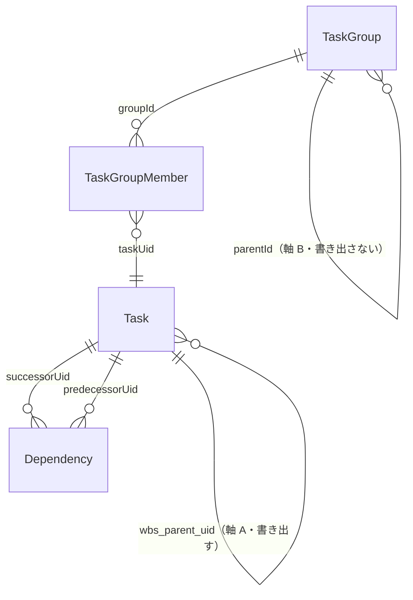

# gr-scheduler 仕様書 — 設計

**Grammar**: spec.sgra
**UID**: DOC-DESIGN
**Version**: 0.2

本書は第 2 部（Chapter 5 〜 7）である。

> **この文書はまだ器である。** 未記入の節は引用で始まる行を持つ。

## Chapter 5. Design (設計)

### 5.1 Architecture Concept (アーキテクチャ方式)

**Type**: SECTION

#### 5.1.1 描画方式

**Type**: SECTION

**描画方式を `SVG` とする。**

⚠️ **この決定は `M1` の測り直しで覆りうる**（表 T-042 の `MS-1`）。**機能を持たない骨格で測ってから方式を確定するのが節目の並びの目的であり、`M1` が表 T-043 のゲートを通らなければ選び直す。** 本節が定めるのは、測る前に採る方式である。

**採る理由を表 T-044 に示す。**

**表 T-044 — `SVG` を採る理由**

| 行 ID | 理由 | 効く先 |
| --- | --- | --- |
| AH-1 | **画面に出しているものと書き出すものが同じ形になる。** 別の形で描いてから書き出す形にすると、画面と出力を一致させる仕組みを二重に持つことになる | `FR-080`（見えているものをそのまま書き出す）／ 表 T-041 の `WY-2` |
| AH-2 | **図形と文字が拡大縮小で歪まない。** 画素の格子ではなく形として持つため | `FR-079` |
| AH-3 | **文字を文字として持てる。** 画素へ焼くと、読み上げにも文字の探索にも渡せなくなる | `NFR-006` / `NFR-008` |
| AH-4 | **要素ごとに当たり判定を持てる。** 画素の色から対象を逆に求める必要が無い | 表 T-023a（当たり判定の判定順序） |
| AH-5 | **外部の資源を持たずに 1 つのファイルへ収まる** | 表 T-003 の `CN-1` / `CN-6` |

**代償は、要素の数がそのまま重さになることである。** 画素へ描く方式は要素の数に鈍いが、`SVG` は鈍くない。**したがって表示する量を絞る仕組み（`FR-018`）が、見た目の都合ではなく性能の要件になる。** 表 T-043 の `PG-6` が「画面に出している描画要素の実数」を毎回記録するのは、この代償を見張るためである。

#### 5.1.2 座標の扱い

**Type**: SECTION

**拡大の倍率は、描く前の座標に掛け込むこと（MUST）。描画の側で拡大縮小を掛けてはならない（MUST NOT）。** 送りは平行移動だけで表す。

**理由は、描画の側で拡大縮小を掛けると、線の太さ・文字の大きさ・矢じり・角の丸み・破線の間隔がすべて倍率で歪み、それを打ち消す処理が全ての層へ伝染するからである。** 掛け込んでおけば**描く前の 1 単位と画面上の 1 画素が常に等しくなり**、当たり判定の許容幅がそのまま画面上の掴み代になる。**座標系の取り違えが構造として消える。**

⚠️ **代償を明示する。倍率を変えるたびに、表示しているもの全部の配置を計算し直すことになる。** 送りだけのときは計算し直さず平行移動で済むので、**この 2 つは重さが釣り合わない。** 前プロジェクトはこの代償を承知で選び、次も同じ選択を推奨すると記録している（`previous-project-result/04-performance/performance-notes-ja.md` の `E-1`）。

**座標の空間に名前を与え、変換はその名前どうしの往復として書くこと（MUST）。** 前プロジェクトは、見た目が同じで指す空間が違う 2 系統の変換を持ってしまい、**試験は通るのに実機で横方向だけずれる**という形の誤りを出している（同 `E-2`）。**空間の命名は骨格の最初に行うこと** —— 後から入れると全ての層を直すことになる。

#### 5.1.3 層の仕訳

**Type**: SECTION

**中核の計算を中心に置き、人向けの画面と `Agent API` を同格の外側に置く。**

**問いは「1 行に複数のタスクを並べる配置・整列・表示量の増減・依存線の経路・時刻と座標の変換は、画面の都合か、それとも中心に置く価値か」であった。** これは**操作層をどこに置くかという問いと同じもの**である —— 中核の計算を中心に置けば、その上に生える操作層も中心側になり、画面も `Agent API` も等しく外側から呼ぶ形になる。**画面を外側に置いたまま操作層を画面の側に作ると、`Agent API` が画面に生える。そこが取り返しのつかない分岐である。**

**表 T-045 — 層の仕訳**

| 行 ID | 層 | 置くもの |
| --- | --- | --- |
| AH-6 | **中核** | 文書のモデル（表 T-302）／時刻と座標の変換／行の中での縦積みと行の高さ／整列／表示量の選別／依存線の経路／遅れの表示の頂点／全体を収める倍率の算出 |
| AH-7 | **操作層** | 命令の実行（1 回の呼び出しが取り消しの 1 段）／基準の版の照合／版数の更新／取り消しとやり直しの履歴／取り込んだ内容の検証／変更の通知 |
| AH-8 | **接続** | 画面の接続（入力を命令へ、幾何を画面へ）／`Agent API`／`SVG` の直列化／`JSON` と `MSPDI` の変換／ファイル入出力／自動保存 |
| AH-9 | **土台** | ブラウザと文書オブジェクトモデル／ファイルへの読み書き／保管庫／単一の `.html` の殻 |

**依存の向きはすべて内向きとすること（MUST）。外側の層を内側の層が知ってはならない（MUST NOT）。** これは表 T-003 の `CN-9`（画面とデータモデルの分離）を層として具体にしたものである。

**中核の計算は、文書オブジェクトモデルにも入出力にも触れない関数として書くこと（MUST）。** そうしておくと、同じ計算を画面の描画にも書き出しにも使える。**`SVG` の直列化が操作層を通らずに中核の幾何だけを読むのは、描画が読み取りの経路であって書き込みの経路ではないからである。**

⚠️ **層の仕訳は推奨案として引き継がれていたが、決定ではなかった**（`previous-project-result/09-architecture/architecture-layering-draft-ja.md` は `status: draft`）。**本節がそれを決定にする。** 形そのものは、前プロジェクトの共同編集の試作で実際に動いている（Chapter 5.2）。

### 5.2 Components (コンポーネント)

**Type**: SECTION

**部品の全体は `_assets/fig-components.md` の 図 F-005 が、書き込みの経路は 図 F-006 が持つ。** 本節は責務と機器の対応を表として持つ。

**すべての部品が表 T-007 の `D-1`（利用者の PC のブラウザ）に載る。** 本製品は単一の `.html` であり（表 T-003 の `CN-1`）、載る機器はほかに無い。**`D-2` から `D-5` は本製品の外側なので、そこに載る部品を書いてはならない（MUST NOT）** —— `Agent API` を呼ぶのは `D-5` だが、**呼ばれる面は `D-1` の上にある。**

**表 T-046 — 部品と責務**

| 行 ID | 部品 | 層 | 責務 | 他へ出す面 |
| --- | --- | --- | --- | --- |
| CP-1 | 文書のモデル | 中核 | 保存される事実を保持する。形は `_assets/tbl-datamodel.md` | 読み取りは凍結した複製、書き込みは `CP-7` からのみ |
| CP-2 | 幾何 | 中核 | 時刻と座標の変換／行の中での縦積みと行の高さ／整列／表示量の選別／依存線の経路／遅れの表示の頂点／全体を収める倍率 | 入力を受けて値を返す関数だけ。**状態を持たない** |
| CP-3 | 画面の接続 | 接続 | 入力を命令へ翻訳し、幾何を画面へ描く | `CP-7` を呼ぶ。`CP-2` を読む |
| CP-4 | `Agent API` | 接続 | 外から呼べる面。規約は表 T-035 | `CP-7` を呼ぶ。**既定では公開しない**（`FR-028`） |
| CP-5 | `SVG` の直列化 | 接続 | 幾何を `SVG` の文字列にする | `CP-2` だけを読む。**操作層を通らない** |
| CP-6 | `JSON` と `MSPDI` の変換 | 接続 | 外の形と文書のモデルを相互に写す。対応は `_assets/tbl-mspdi.md` | `CP-7` へ取り込みを依頼する |
| CP-7 | **命令の実行** | 操作層 | **書き込みの唯一の関門。** 検証・履歴・版数・通知をこの順で行う | 受理したか否かを値で返す。**例外を投げない**（`FR-028`） |
| CP-8 | 履歴 | 操作層 | 取り消しとやり直しの段を保持する | `CP-7` からのみ積む |
| CP-9 | 取り込みの検証 | 操作層 | 外から来たものを受け入れてよいか判定する | `CP-7` から呼ばれる |
| CP-10 | 変更の通知 | 操作層 | 変わったことを購読している側へ知らせる | `CP-3` と `CP-4` が購読する |
| CP-11 | 入出力の門 | 接続 | ファイルと保管庫への読み書き | `CP-6` へ渡す |

#### 5.2.1 落としてはならない 1 つの形

**Type**: SECTION

**人が画面から行う編集と、`Agent API` から行う編集が、同じ `CP-7` を通ること（MUST）。** そして **`CP-7` を通らずに `CP-1` を書き換える経路を持ってはならない（MUST NOT）。**

**これが後から作り直せない唯一の分岐である。** 画面が文書のモデルを直に書き換える形で作ると、`Agent API` は画面の側に生えることになり、**そのとき初めて「同じ検証を通す」「同じ履歴に積む」「同じ版数を上げる」を全部あとから揃える羽目になる。** 表 T-035 の `AG-3`（一括の書き込みが原子的であること）・`AG-5`（`UI` と同じ検証を通ること）・`AG-6`（自分の書き込みで自分が起きないこと）は、**関門が 1 つであれば自然に満たされ、2 つあれば個別に作り込むことになる。**

**`CP-7` が 1 回の呼び出しで行うことを、表 T-047 に順序として示す。**

**表 T-047 — 命令の実行の順序**

| 行 ID | 順 | 行うこと | 対応する規約 |
| --- | :-: | --- | --- |
| CX-1 | 1 | 呼び出した者が申告した基準の版と、いまの版数を照合する。食い違えば**文書を変えずに拒否し、いまの文書を返す** | 表 T-035 の `AG-2` |
| CX-2 | 2 | 命令の中身を検証する。**一括の命令は 1 つでも通らなければ全部を取りやめる** | 表 T-035 の `AG-3` |
| CX-3 | 3 | 直前の状態を履歴へ積む。**取り消しの対象外の命令では積まない** | 表 T-027 ／ 表 T-035 の `AG-10` |
| CX-4 | 4 | 文書のモデルを**不変の更新**で置き換える | — |
| CX-5 | 5 | 版数を 1 つ上げ、最後に書いた者を記す | `FR-063` ／ `DM-46` ／ `DM-49` |
| CX-6 | 6 | 変わったことを知らせる。**知らせる相手から、その変更を出した本人を除く** | 表 T-035 の `AG-6` |

⚠️ **`CX-5` と `CX-6` を `CP-7` の外で行ってはならない（MUST NOT）。** 外で行える経路を 1 本でも作ると、**版数が上がったのに誰も知らない状態**が生まれ、表 T-035 の `AG-2` の照合が当てにならなくなる。

⚠️ **`CX-3` が `CX-4` より前にあるのは、取り消しを状態の複製で行うためである。** 命令の逆命令を作る方式は採らない —— **逆命令を持たない命令**（取り込み・合流）があり、そこだけ別の仕組みになる。

**この形は前プロジェクトの共同編集の試作で実際に動いている。** 人と AI の手が 1 本の履歴を通ること、受理した書き込みがすべて 1 つの関門を通るので**版数が上がったのに購読者が知らない状態が起きないこと**が、そこで確かめられている（`main` の `ai-cowork-trial/shogi`）。**その試作は本製品ではないので、実装を写してはならない（MUST NOT）** —— 確かめられているのは**形**である。

⚠️ **`Agent API` へ日本語を渡す経路を、シェルの引数に載せてはならない（MUST NOT）。** 同じ試作で、`Windows` の文字コードの扱いにより**引数の日本語が壊れる**ことが確認されている。**壊れたのは経路であって画面ではない。**

### 5.3 File Structure (ファイル構成)

**Type**: SECTION

> 未記入。ディレクトリ構成と、コンポーネントとフォルダの対応を書く。各コンポーネントの公開面を宣言する。`src/` の中身が確定するのはここである。

### 5.4 Domain Model (ドメインモデル)

**Type**: SECTION

**エンティティと列と制約の正は `_assets/tbl-datamodel.md`（`DOC-TBL-DATAMODEL`）である。本節はそこを指し、列を再掲しないこと（MUST NOT）。** 名前の正も同書が持つ。**全体の関係は `_assets/fig-domain-model.md` の 図 F-003 が持つ。**

#### 5.4.1 二つの軸

**Type**: SECTION

**本製品の構造の要は、日程を 2 つの独立した木で持つことである。**

**図 F-002 — 二つの軸の骨格**

| 軸 | 何の木か | 担う列 | 書き出すか |
| --- | --- | --- | --- |
| **軸 A** | 仕事の分解。外部の道具と共有する構造 | `Task.wbs_parent_uid`（`DM-2`） | **書き出す** |
| **軸 B** | 画面の行。1 つの行に複数のタスクを横並べするための器 | `TaskGroup`（表 T-304）と `TaskGroupMember`（表 T-305） | **書き出さない** |

**2 つの木が触れ合うのは `TaskGroupMember` の 1 か所だけである**（図 F-004）。**この形が「行を動かしても分解が動かない」ことを構造として保証している** —— 見た目の都合で行を並べ替えたことが、外部の道具へ書き出す構造に漏れない。

⚠️ **軸 B を軸 A に畳み込んではならない（MUST NOT）。** 1 つの行に複数のタスクを置くことが本製品の中核であり（`GL-001`）、行を分解の階層と同一視すると、**1 行に置けるタスクが 1 つに戻る。**

#### 5.4.2 識別

**Type**: SECTION

**外部と交換する識別子をそのまま主キーに使い、本製品だけが持つ代理の識別子を足さない。** 取り方の全数は `_assets/tbl-datamodel.md` の 表 T-317 が持つ。

**この方針が成立する条件は 1 つだけである** —— **合流のときに識別子の食い違いを必ず解消すること。** 解消すれば文書の中では常に一意なので、代理の識別子も複合の識別子も要らない。**照合の規則は 表 T-319 が、人に何を尋ねるかは `01-04-requirements.md` の 表 T-032a が持つ。**

**軸 B の器（`TaskGroup`）と注記だけは、本製品が識別子を発番する。** 外部に対応が無いためである。**この 2 つは番号空間が別なので、合流で `Task` の識別子を振り直しても壊れない。**

#### 5.4.3 持たないもの

**Type**: SECTION

**算出できるものを列として持たない。** 二重に持つと、片方だけが古くなったときにどちらが正しいかを決められなくなる。

| 持たないもの | 何から算出するか | 定めている場所 |
| --- | --- | --- |
| 依存線の経路 | 端点と障害物から毎回求める | 表 T-306 の注 |
| 実績の置き方 | `shapeKind` | `_assets/tbl-glossary.md` の `P-17` |
| 全体の終了 | すべての `Task` の最も遅い終わり | 表 T-307 の注 |
| 表示する量の増減 | 軸 A の木の深さ | `FR-018` |

⚠️ **算出して書き出すものの全数は `_assets/tbl-mspdi.md` が持つ。**

#### 5.4.4 解釈しないものを失わない

**Type**: SECTION

**外部から取り込んだもののうち、本製品が意味を使わない部分は、解釈せずそのまま保持する。** 器は `carry` と `carryElements`（`DM-18` / `DM-19` ほか）である。

**この形を採ったので、対応表に載っていない要素があっても往復で失われない。** したがって **「何も失っていない」は主張ではなく、取り込みと書き出しの検査が通ったことで示される。** 検査の中身は `_assets/tbl-mspdi.md` が持つ。

⚠️ **`carry` の中身を解釈してはならない（MUST NOT）。** 解釈した瞬間、その要素は `carry` ではなく列として持つべきものになる。**どちらつかずにすると、同じ値の持ち主が 2 つになる。**

### 5.5 Behavior (振る舞い)

**Type**: SECTION

> 未記入。処理フローと相互作用を書く。予実の 5 状態は状態遷移図で描く（`07-plan-actual/plan-actual-decisions-ja.md` §1-3）。レイアウトの計算順序（制約 → ラベル幅 → 積み順 → 依存線の経路）もここに置く。

### 5.6 Decisions (設計判断)

**Type**: SECTION

> 未記入。ADR-000 に「要求を満たす最小の構成と比べて何を増やしたか」を書く。以降は ADR-001 から採番する。前プロジェクトの記録番号は引き継がない（`previous-project-result/README.md` §0-4）。描かなかった図とその理由もここに書く。

## Chapter 6. Software Specification (ソフトウェア仕様)

### 6.1 Software Specifications (ソフトウェア仕様)

**Type**: SECTION

> 未記入。`SW_SPEC` ノード（`SWS-xxx`）を並べる。符号・状態遷移・境界値などの手段を EARS 1 文で書き、`FR-xxx` を親に取る。

### 6.2 Data Schema (データスキーマ)

**Type**: SECTION

**設定値（`documentSettings`）の既定値と範囲は `_assets/tbl-settings.md`（`DOC-TBL-SETTINGS`）が持つ。本節はそこを指し、値を再掲しないこと（MUST NOT）。** 名前の正は `_assets/tbl-glossary.md` の表 T-104 である。名前と値を 2 か所で管理しない。

**MSPDI の要素と列挙値は本仕様書に写さない（MUST NOT）。** それは本プロジェクトの決定ではなく Microsoft のスキーマの事実であり、正は公式 XSD（`https://schemas.microsoft.com/project/2007/mspdi_pj12.xsd`）である。**事実はローカル複製で確かめ、出典には公式 URL を書く**（`docs/reference/README.md`）。

> 未記入。文書の形（エンティティと関係）を JSON Schema として置く。永続ストアを持たない場合は「持たない」と書き、Chapter 2.4 の表 T-009（X-3）と揃える。出どころは `previous-project-result/02-data-model/grs-native-erd-ja.md`。

## Chapter 7. Test Strategy (テスト戦略)

**Type**: SECTION

**性能ゲートだけを先に置く。** 系統・テストレベル・ツール・合格基準は、部品の分割（Chapter 5.2）とソフトウェア仕様（Chapter 6.1）が決まってからでないと書けない —— 何と何を統合するのかが決まらないうちに結合の方針を書いても、内容を持たないためである。

**ゲートを先に置く理由は、前プロジェクトがここで落ちたからである。** 計測の仕組みを作ったものの、それを「診断のための道具であってゲートではない」と自ら定めたため工程に載らず、**最初の節目より後で一度も測り直されないまま完成した**（`previous-project-result/04-performance/performance-notes-ja.md` の記録 N-1）。**測る動機は、合否が工程を止めるときにしか続かない。**

**節目は、その節目で測り直しが済み、合格条件を満たすまで閉じないこと（MUST）。**

**合格条件は `NFR-001` 〜 `NFR-003` が、測定条件は表 T-025 が持つ。本章に数値を書いてはならない（MUST NOT）** —— 二重に持つと、正を直したときここが腐る。**測る仕組みを「診断ツール」と呼んではならない（MUST NOT）。**

**表 T-042 — 節目**

| 行 ID | 節目 | 何を作るか |
| --- | --- | --- |
| MS-0 | M0 設計 | 画面の見た目・図形・表示言語の対応表・初期テンプレートを絵として決める。**実装しない** |
| MS-1 | M1 骨格 | **機能を持たない骨格。** 描画面・時間軸・拡大縮小・操作層・文書の保持。⚠️ **描画方式はここで決まる**（Chapter 5.1）。⚠️ **操作層を 1 つに保ち、人向けの画面と `Agent API` の双方がそれを呼ぶ形を、ここで作る**（`FR-028`）—— 後から作り直せない唯一の分岐である |
| MS-2 | M2 データと入出力 | 文書の形・`MSPDI` の往復・取り込んだ内容の検証・担当者の割当 |
| MS-3 | M3 核となる機能 | 縦積み・整列・表示量の増減・依存線の経路・全体を収める表示 |
| MS-4 | M4 予実と注記 | 予定と実績・進捗の印・遅れの表示・注記・透かし |
| MS-5 | M5 仕上げ | 見分けと読みやすさ・表示言語の切替・画像の書き出し・`Agent API` |

**どの要求をどの節目で満たすかは、本仕様書は定めない。** 仕様書は「何を満たすか」を持ち、「いつ満たすか」は工程の側が持つ。**本表が定めるのは、ゲートを適用する単位だけである。**

**表 T-043 — 節目ごとに測るもの**

| 行 ID | 測るもの | M1 | M2 | M3 | M4 | M5 | 合否 | 正 |
| --- | --- | :-: | :-: | :-: | :-: | :-: | --- | --- |
| PG-1 | 初期描画に要する時間 | ● | ● | ● | ● | ● | ゲート | `NFR-001` |
| PG-2 | 平均フレームレート | ● | ● | ● | ● | ● | ゲート | `NFR-002` |
| PG-3 | フレーム時間の 95 パーセンタイル | ● | ● | ● | ● | ● | ゲート | `NFR-003` |
| PG-4 | 欠けた画面が出ないこと | ● | ● | ● | ● | ● | ゲート | `NFR-011` |
| PG-5 | 操作していない間の描き直しの回数 | ● | ● | ● | ● | ● | ゲート | `NFR-010` |
| PG-6 | 画面に出している描画要素の実数 | ● | ● | ● | ● | ● | 記録のみ | `FR-018`（間引きが効いているかを見る） |
| PG-7 | 成果物の `.html` のバイト数 | ● | ● | ● | ● | ● | 記録のみ | `NFR-004`（上限は定めない。増え方を見る） |
| PG-8 | 掴んで動かしている間のフレーム時間 | — | — | ● | ● | ● | ゲート | `NFR-002` / `NFR-003` |
| PG-9 | ポインタが乗っている間の当たり判定 | — | — | ● | ● | ● | ゲート | `NFR-002` |
| PG-10 | 依存線が密集したときの経路の算出 | — | — | ● | ● | ● | ゲート | `NFR-002` |
| PG-11 | 重ね描きの層を作り直すときの時間 | — | — | — | ● | ● | ゲート | `NFR-002` |
| PG-12 | 文字数の多いラベルが密集したとき | — | — | ● | ● | ● | ゲート | `NFR-002` |

**毎回同じものを測ること（MUST）。** 節目ごとに測る対象を変えると、前回との差が読めなくなる。**合否だけでなく前回との差を残すこと（MUST）** —— 落ちてから探すより、増え方を見ている方が原因の範囲が狭い。

⚠️ **`PG-8` 〜 `PG-12` は、前プロジェクトが「測る」と決めて測らずに終わった 5 つである**（同 §2-5）。**測る担当と期限を、その節目を開く前に決めること（MUST）** —— 「測ってから決める」は、担当と期限を同時に決めないと永久に保留になる（同記録 N-3）。

**落ちたときは次の節目へ進まないこと（MUST）。** `M1` で落ちたときは描画方式を選び直す —— **`M1` を機能無しで置くのは、そのためである。** `M2` より後で落ちたときは、直前の節目で足したものを疑う。

> 未記入。系統・テストレベル・方針・ツール・合格基準の表を書く。系統は 3 つ（ユースケーステスト / ソフトウェア仕様テスト / 非機能テスト）。ソフトウェア仕様テストの `Unit` は**仕様書の外で実施する**ため Chapter 9 にケースを書かない。文法もそれを強制しており、`SW_SPEC_TEST` の `TEST_LEVEL` は `Integration` と `System` しか受け付けない。テストコードの置き場は `tests/usecase/` `tests/integration/` `tests/system/` `tests/nfr/` で、Chapter 8 〜 10 の `File` 関係が指す先になる。
