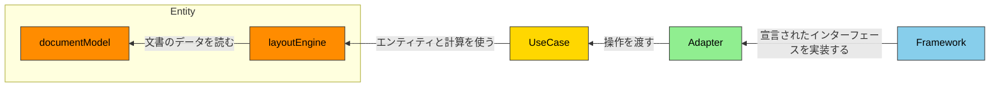
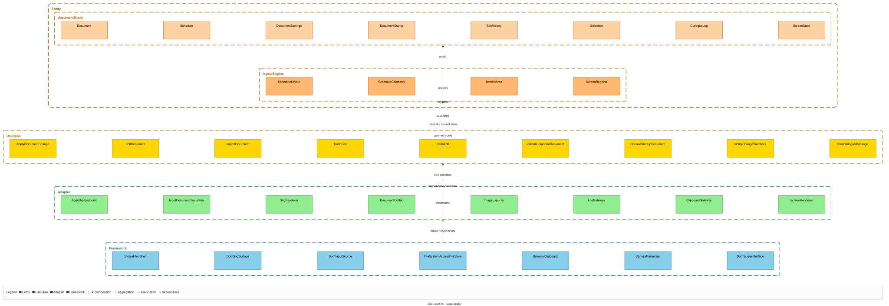
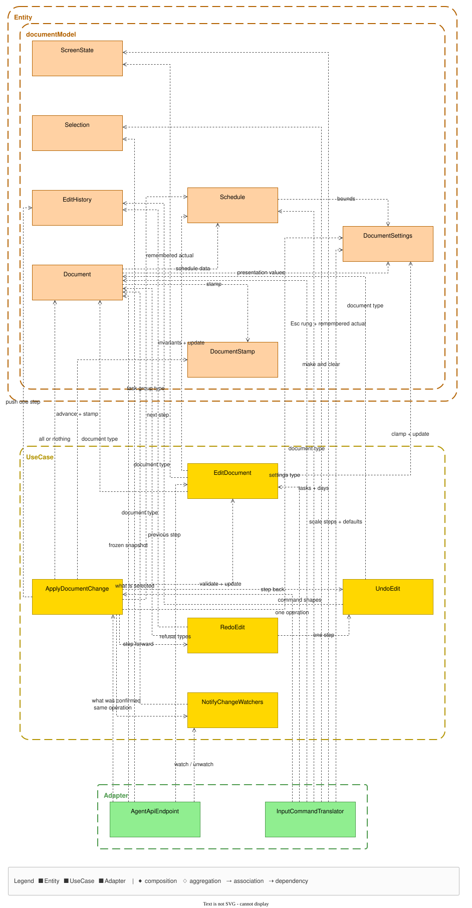
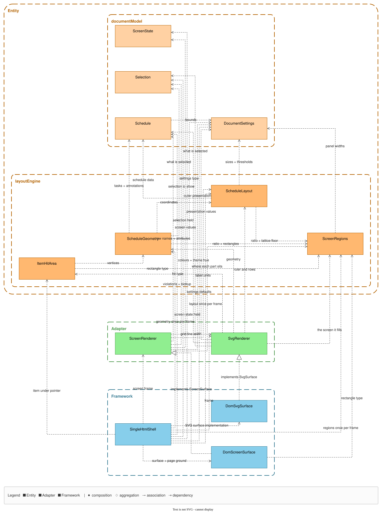
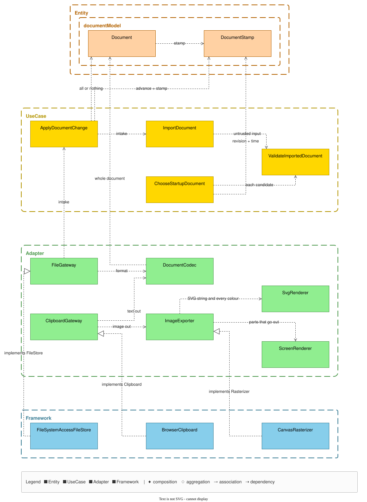
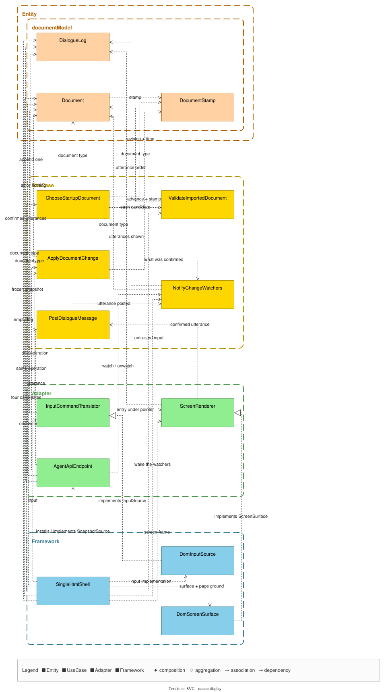

# gr-scheduler 仕様書 — 設計

**Grammar**: spec.sgra \
**UID**: DOC-DESIGN \
**Version**: 0.4

本書は第 2 部（Chapter 5 〜 7）である。

> **この文書はまだ器である。** 未記入の節は引用で始まる行を持つ。

## Chapter 5. Design (設計)

**Type**: SECTION

### 5.1 Architecture Concept (アーキテクチャ方式)

**Type**: SECTION

**Clean Architecture を採る。** 層は `Entity` / `UseCase` / `Adapter` / `Framework` の 4 つとし、既定の名前をそのまま使う。**`Entity` の内側は、さらに `documentModel` と `layoutEngine` に分ける。**

**層の凡例と依存の向きを 図 F-012 に、各層に置くものを 表 T-060 に、依存の規則を 表 T-061 に示す。**

**図 F-012 — 層と依存の向き**



**矢印は依存の向きを表し、ラベルはその依存が何のためかを表す。外向きの辺は 1 本も無い。** 本図は層の凡例であり、**部品どうしの辺は Chapter 5.2 が持つ。** 層を飛び越す例（`LR-1`）—— SVG を作る部品は `Adapter` にあるが、`UseCase` を通らずに `layoutEngine` を直接読む。

**表 T-060 — 層**

| 行 ID | 層 | 置くもの | 純粋性 |
| --- | --- | --- | --- |
| LY-1 | `Entity` / `documentModel` | 表 T-052 が定める文書ルートの 3 群すべて（日程データの群のエンティティは 表 T-056）と、その不変条件（全数は Chapter 6.1 が持つ）。および**文書に保存しない実行時の値**（取り消しの履歴・選択・確定した発話。いずれも不変の値として持ち、丸ごと置き換える） | すべて `pure` |
| LY-2 | `Entity` / `layoutEngine` | 日付と座標の対応、`Rows` の配置、描くものの頂点、表示量の増減、当たり判定 | すべて `pure` |
| LY-3 | `UseCase` | 文書を変える操作と、確定までの手順。取り込みの検証。変更の通知 | 操作と検証は `pure`、確定と通知は `non-pure` |
| LY-4 | `Adapter` | `Agent API`、SVG の生成、交換形式との相互変換、画面の入力を操作へ変えること、および**外側の道具を使うためのインターフェースの宣言** | 変換と直列化は `pure`、外を読むものは `semi-pure-b`、残りは `non-pure` |
| LY-5 | `Framework` | **`Adapter` が宣言したインターフェースの実装**（ブラウザの DOM・SVG・File System Access API・`localStorage` を使う）と、単一 `.html` のシェル。**現在値を保持するのはこの層だけである** —— 内側の 3 層はすべて値を引数で受け取る | 外を読むものは `semi-pure-b`、残りは `non-pure` |

**表 T-061 — 依存の規則**

| 行 ID | 規則 |
| --- | --- |
| LR-1 | **層をまたぐ依存は内向きだけとすること（MUST）。外向きの依存を作ってはならない（MUST NOT）。** 内向きであれば層を飛び越してよい |
| LR-2 | **同じ層の中で呼び合ってよい。ただし相手が Chapter 5.3 で宣言したインターフェースを介すること（MUST）。他の部品の内部へ直に触れてはならない（MUST NOT）** |
| LR-3 | **層の中の呼び出しを非巡回に保つこと（MUST）** —— 巡回すると、どちらが先に成り立つのかを決められなくなる |
| LR-4 | **`layoutEngine` は `documentModel` を読んでよい。`documentModel` が `layoutEngine` を知ってはならない（MUST NOT）** |
| LR-5 | **外側の道具は、内側が宣言したインターフェースを介して使うこと（MUST）。その実装は外側の層が持つこと（MUST）** —— これがあるので `LR-1` に例外が要らない |
| LR-6 | **`Entity` と `UseCase` が、ブラウザの供給する型に触れてはならない（MUST NOT）** |

**本表が規則を持つのは、`R2.16` が層の定義と依存の向きを Chapter 5.1 に置くよう要求しているためである。** 依存の向きは実行して確かめる性質ではなく、構造を静的に見て確かめる性質なので、テストを持つ要求としてではなく本章が持つ。

**`Entity` を 2 つに割るのは、レイアウトがこの道具の価値そのものでありながら、ブラウザを必要としないためである。** 価値は「ペライチ」（`_assets/tbl-glossary.md` の `VK-3`）であり、**それを成り立たせているのが `layoutEngine` の算法である。座標と当たり判定は手段ではなく本質であり、手段はむしろ描き方のほうである** —— 描き方は `Adapter` が持ち、`layoutEngine` は座標までしか持たない。そして `FR-093` が文字の実測を禁じているので、**レイアウトの計算は文字の実寸をブラウザに訊かずに済む。** 画面の寸法は引数として受け取る。割っておくと `NFR-013` の計算量をブラウザ無しで測れる（測り方は表 T-025 の `MC-9` が持つ）。

⚠️ **この方針の代償は `LM-2a` が持つ。** レイアウトを純粋に保てることと、`LM-2a` が適合範囲を絞っていることは、**同じ 1 つの決定の表と裏である。** 片方だけを変えることはできない。

**文書への書き込みの経路は 1 本である。** 人が UI で行えることを `Agent API` でも行えることは `FR-028` が要求し、**双方が同じ経路を通る形は表 T-042 の `MS-1` が定めている。****入口が 2 つに分かれると、片方にしか掛からない検証や履歴が生まれる。**

**描画はその経路を通らない。** 描画は文書を読むだけで変えないので、書き込みの経路に載せる理由が無い。**載せると、画面を描くたびに書き込みの経路が起動する。**

**設計の合否は `previous-project-result/21-review-standard/review-standards.md` の `R2` で判定する**（`FR-092` の `EZ-5`）。**同書は `R7`（純粋性・構造）も Chapter 5 〜 6 を対象と定めている。** `R2.6`（DIP）は `LR-5` が満たす。

### 5.2 Components (コンポーネント)

**Type**: SECTION

**部品を 表 T-062 に、全体を 図 F-013 に、経路ごとの詳細を 図 F-014 〜 図 F-017 に示す。** 層の定義と依存の規則は 5.1 が持つ。

**部品はすべて機器 `D-1` に載る。** 表 T-007 で「対象ソフトが載る」機器は `D-1` だけであり、`D-2` 〜 `D-5` に載る部品は 1 つも無い。

**部品を分ける基準は 1 つである** —— **同じ表・同じ要求が寸法と規則を持っているなら 1 部品、別々の要求が持っているなら別部品とする。** `ScheduleGeometry` が予定・実績・依存線・注記をまとめて持つのは、それらの寸法を 表 T-201 が 1 枚で持ち `FR-094` が縛っているからであり、逆に `Framework` の 6 部品が分かれているのは、実装するインターフェースが別だからである。

**表 T-062 — コンポーネント**

| 行 ID | 層 | 部品 | 責務 | 正 |
| --- | --- | --- | --- | --- |
| CP-1 | `documentModel` | `Schedule` | 日程データの群と、その不変条件 | 表 T-052 の `DR-2` |
| CP-2 | `documentModel` | `DocumentSettings` | 見せ方の群。保存する値と、その下限・上限 | 表 T-052 の `DR-3` / `FR-063` |
| CP-3 | `documentModel` | `DocumentStamp` | 文書の刻印と、版を進める純粋関数 | 表 T-052 の `DR-4` / `FR-063` |
| CP-4 | `documentModel` | `EditHistory` | 取り消しの履歴。不変の値として持つ | `FR-031` |
| CP-5 | `layoutEngine` | `ScheduleLayout` | 時間軸、ラベル幅の概算、`Rows` の配置、表示量の増減、全体を収める表示 | `FR-017` / `FR-093` / `FR-003` / `FR-018` / `FR-055` |
| CP-6 | `layoutEngine` | `ScheduleGeometry` | 描くものの頂点。バー・依存線・イナズマ線・カーソル・注記・透かし | `FR-094` / `FR-009` / `FR-014` |
| CP-7 | `layoutEngine` | `ItemHitArea` | ポインタが指すアイテムの判定 | 表 T-023c の `SL-1` |
| CP-8 | `UseCase` | `ApplyDocumentChange` | **文書への書き込みの唯一の経路。** 照合・全か無か・履歴・版数・刻印・通知 | 表 T-042 の `MS-1` / `FR-028` / `AG-2` / `AG-3` / `FR-031` / `FR-063` |
| CP-9 | `UseCase` | `EditDocument` | 集約ごとの編集。検証して新しい文書を返すだけで、確定させない | 表 T-027 |
| CP-10 | `UseCase` | `ImportDocument` | 取り込みと合流 | `FR-087` / `FR-022` |
| CP-11 | `UseCase` | `UndoEdit` | 履歴を 1 段戻す | `FR-031` |
| CP-12 | `UseCase` | `RedoEdit` | 履歴を 1 段進める | `FR-031` |
| CP-13 | `UseCase` | `ValidateImportedDocument` | 信頼できない入力の検証。取り込みの 3 経路が共有する | `FR-023` / `NFR-009` |
| CP-14 | `UseCase` | `ChooseStartupDocument` | 起動時に開く文書を決める | `FR-062` / 表 T-034 |
| CP-15 | `UseCase` | `NotifyChangeWatchers` | 確定を購読者へ配る | 表 T-035 の `AG-6` |
| CP-16 | `UseCase` | `PostDialogueMessage` | 確定した発話を `DialogueLog` へ積み、配る。文書に保存しない | `FR-066` / 表 T-035 の `AG-11` |
| CP-17 | `Adapter` | `AgentApiEndpoint` | `Agent API` を設置する。既定で公開しない。`SnapshotSource` を宣言する | `FR-028` / `FR-065` / 表 T-035 / 表 T-107 |
| CP-18 | `Adapter` | `InputCommandTranslator` | 画面の入力を操作へ変え、対話欄で確定した発話を渡す。`InputSource` を宣言する | `FR-016` / `FR-070` / `FR-066` |
| CP-19 | `Adapter` | `SvgRenderer` | 幾何から SVG 文字列を作る。`SvgSurface` を宣言する | `FR-080` |
| CP-20 | `Adapter` | `DocumentCodec` | JSON・`MSPDI`・単一 `.html` を文書と相互変換する。`AppShellSource` を宣言する | `FR-024` / `FR-021` / `FR-056` / `FR-057` / `FR-067` |
| CP-21 | `Adapter` | `ImageExporter` | 画像として書き出す。`Rasterizer` を宣言する | `FR-025` |
| CP-22 | `Adapter` | `FileGateway` | ファイルの読み書き。`FileStore` を宣言する | `FR-060` / 表 T-024 |
| CP-23 | `Adapter` | `AutosaveGateway` | 自動保存と復元。`DocumentStore` を宣言する | `FR-026` / `FR-061` |
| CP-24 | `Adapter` | `ClipboardGateway` | クリップボードへ出す。`Clipboard` を宣言する | `FR-033` / `FR-068` |
| CP-25 | `Framework` | `SingleHtmlShell` | 起動と結線。**現在値を保持する。** フレームごとに描画を回し、入力を渡す。埋め込みの入れ物を持ち、公開点を置く。`SnapshotSource` と `AppShellSource` の実装 | `FR-067` / `FR-065` |
| CP-26 | `Framework` | `DomSvgSurface` | `SvgSurface` の実装 | — |
| CP-27 | `Framework` | `DomInputSource` | `InputSource` の実装 | — |
| CP-28 | `Framework` | `FileSystemAccessFileStore` | `FileStore` の実装。**ファイルのハンドルを保持する** | `FR-060` |
| CP-29 | `Framework` | `LocalStorageDocumentStore` | `DocumentStore` の実装 | `FR-026` |
| CP-30 | `Framework` | `BrowserClipboard` | `Clipboard` の実装 | `FR-033` |
| CP-31 | `Framework` | `CanvasRasterizer` | `Rasterizer` の実装 | `FR-025` |
| CP-32 | `documentModel` | `Selection` | 選ばれている対象の集合と、選んだ順序。文書に保存しない | 表 T-023c の `SL-1` / `SL-7b` / `SL-8` |
| CP-33 | `documentModel` | `DialogueLog` | 確定した発話と、版数とは別の順序。文書に保存しない | `FR-066` / 表 T-035 の `AG-11` / `AG-6` |

**各部品の内側のユニットと、公開するインターフェースは Chapter 5.3 が宣言する。** 本表が定めるのは部品の境界だけである。

**規約のうち、意図して満たさないものが 2 つある。**

> **`R2.13`（CQS・SHOULD）** —— `ApplyDocumentChange` は文書を変え、かつ結果を値で返す。**`FR-028` が「受理したか否かを値で返すこと」を、`AG-9a` が拒否の値の中身を、それぞれ MUST で定めているためである。** 状態変更とその結果通知を分けると、2 回の呼び出しの間に別の書き込みが入り、`AG-3` の原子性が保てない。

> **`R2.5`（ISP・SHOULD）** —— `Agent API` は 18 のメンバを 1 つの面に載せ、用途別に分けない。**`FR-028` が入口を 1 つと定めているためである。** 呼ぶ側が複数の面を持つと「人間向け UI と同格」が崩れる。**同条項が禁じているのは「使わないメソッドを実装させられること」であり、実装は 1 つなのでその害は生じない。**

**図の原稿は `_assets/source/model.json` である**（部品・辺・層の木）。**`_assets/source/build.py` が `.svg` と部品表を書き出す。`.svg` と `.drawio` を手で直してはならない（MUST NOT）** —— 次の生成で消える。**図と部品表を同じ原稿から起こすことで、両者の食い違いが起きないようにしている。**

**箱は部品である。** 層ごとに枠で囲み、**内側の層ほど上に置いた。矢印はすべて上を向く。** **本図の矢印は層と層の間だけを結ぶ。** 部品どうしの辺は経路ごとの図（図 F-014 〜 図 F-017）が持つ。**層をまたぐ矢印は、それを裏づける部品どうしの辺が 1 本以上あるときにだけ描かれる**（`build.py` が検算する）。

**図 F-013 — コンポーネントと層**

[](_assets/fig-components.svg)

**図をクリックすると原寸で開く。**

**人向けの画面と `Agent API` が同じ入口へ入り、確定して配るまでを 図 F-014 に示す。** 入口が 1 つであることは `FR-028` と 表 T-042 の `MS-1` が定める。

**図 F-014 — 書き込みの経路**

[](_assets/view-write.svg)

**描画が書き込みの経路を通らないことを 図 F-015 に示す。** SVG を作る部品は `Adapter` にあるが、`UseCase` を通らずに `layoutEngine` を直接読む。

**図 F-015 — 読み取りの経路**

[](_assets/view-read.svg)

**ファイル・保管庫・クリップボード・画像と、取り込みの検証を 図 F-016 に示す。** 取り込みの 3 経路が同じ検証を通ることは `FR-023` が要求する。

**図 F-016 — 出し入れの経路**

[](_assets/view-io.svg)

**シェルが結線し、開く文書を決め、`Agent API` を公開し、発話を配るまでを 図 F-017 に示す。** 開く文書の順は 表 T-034 が持つ。

**図 F-017 — 起動の経路**

[](_assets/view-startup.svg)

### 5.3 File Structure (ファイル構成)

**Type**: SECTION

**本節が宣言するのは公開インターフェースである** —— **部品の外から呼んでよい名前の全数**のことである。**`R2.19` が各コンポーネントの公開面を本節に置くよう要求しており、その定義の正とする用語集がこのリポジトリに無いので、本節が定義を持つ。** 表 T-061 が規則を持つのと同じ事情である。

⚠️ **これを「面」と呼ばない。** 表 T-006a の「面ごとの記法」・画面の面・前面と背面で 3 義あるためである。**層をまたぐ 8 本だけは「層をまたぐインターフェース」と呼び分け（表 T-065）、裸の「インターフェース」を書かない。**

**部品ごとにフォルダを作り、部品名と語幹が同じ 1 ファイルだけを公開エントリとすること（MUST）。フォルダの外から、公開エントリ以外のファイルを読んではならない（MUST NOT）** —— 読めてしまうと、`LR-2` の「他の部品の内部へ直に触れてはならない」を検査できない。記法は 表 T-006a の `W-11` である。

**どの部品もインスタンスを作らない。公開するのは型と関数だけである。** 表 T-060 の `LY-5` が「現在値を保持するのは `Framework` だけである」と定めたことの帰結であり、**内側の 3 層には漏らせる可変状態がそもそも無い。**

**ユニットを割る基準は純粋性である**（`R7.9`）—— **純粋な側と非純粋な側が同じ部品にあるとき、別のファイルへ出す。** それ以外の理由で割ったものは 表 T-063 が行ごとに理由を持つ。**本表に無い部品は 1 ユニットであり、公開エントリがそのままユニットである。**

**`UseCase` の部品名は動詞句であり**（`R2.1` の層別表）、**その部品が公開する操作は部品名を camelCase にしたものとする** —— 同じ概念に 2 つの語を与えないためである。**記法が違うだけで、食い違いではない**（表 T-006a の `W-1` と `W-2`）。⚠️ **外側の状態を読むメンバだけは動詞＋目的語とする** —— 名詞にすると、遅さと失敗しうることが名前から消える。

**`main.ts` を作らない。** Vite の入口は `single-html-shell.ts` である —— 表 T-062 の `CP-25` が「起動と結線」を負う。**テストコードの置き場は Chapter 7 が持つ。本節は `src/` だけを持つ。**

**ディレクトリ構成を次に示す。33 のフォルダは 表 T-062 の 33 部品と 1 対 1 である。**

```text
src/
  entity/
    document-model/   schedule/ · document-settings/ · document-stamp/ · edit-history/
                      selection/ · dialogue-log/
    layout-engine/    schedule-layout/ · schedule-geometry/ · item-hit-area/
  use-case/           apply-document-change/ · edit-document/ · import-document/
                      undo-edit/ · redo-edit/ · validate-imported-document/
                      choose-startup-document/ · notify-change-watchers/
                      post-dialogue-message/
  adapter/            agent-api-endpoint/ · input-command-translator/ · svg-renderer/
                      document-codec/ · image-exporter/ · file-gateway/
                      autosave-gateway/ · clipboard-gateway/
  framework/          single-html-shell/ · dom-svg-surface/ · dom-input-source/
                      file-system-access-file-store/ · local-storage-document-store/
                      browser-clipboard/ · canvas-rasterizer/
```

**1 つより多いユニットを持つ部品を 表 T-063 に、33 部品の公開インターフェースを 表 T-064 に、層をまたぐ 8 本を 表 T-065 に示す。**

**表 T-063 — 1 つより多いユニットを持つ部品**

| 行 ID | 部品 | ユニット | 割った理由 |
| --- | --- | --- | --- |
| UT-1 | `ApplyDocumentChange` | `apply-document-change.ts`（`non-pure`。確定と通知）／ `document-change-plan.ts`（`pure`。照合と、全か無かの組み立て） | **純粋性。** 表 T-060 の `LY-3` が「操作と検証は `pure`、確定と通知は `non-pure`」と定めている |
| UT-2 | `EditDocument` | `edit-document.ts`（公開エントリ）と、集約ごとの 8 ファイル —— `edit-task.ts` / `edit-task-group.ts` / `edit-dependency.ts` / `edit-annotation.ts` / `edit-resource.ts` / `edit-calendar.ts` / `edit-project.ts` / `edit-document-settings.ts` | **純粋性ではない。8 つとも `pure` である。** 集約ごとに変更の理由が別なので割った —— タスクの規則が変わっても暦の規則は変わらない |
| UT-3 | `NotifyChangeWatchers` | `notify-change-watchers.ts`（`non-pure`。購読の登録・解除と配ること）／ `change-notice.ts`（`pure`。まだ受け取っていない変更と発話を選ぶ） | **純粋性**（`LY-3`）。⚠️ 選び方の規則は 表 T-035 の `AG-6` にあり、日程データと発話で違う。値だけで決まる |
| UT-4 | `AgentApiEndpoint` | `agent-api-endpoint.ts`（公開エントリ。設置と公開点の管理）／ `agent-api-members.ts`（表 T-107 の 18 メンバの結線） | **純粋性ではない。どちらも `non-pure` である。** 設置は `FR-065`（既定で公開しない）が、18 メンバは 表 T-107 が縛るので、変更の理由が別である |
| UT-5 | `DocumentCodec` | `document-codec.ts`（公開エントリ）／ `json-codec.ts`（`pure`）／ `mspdi-codec.ts`（`pure`）／ `embedded-html-codec.ts`（`semi-pure-b`） | **一部は純粋性** —— 単一 `.html` だけが `AppShellSource` を呼ぶ。**残りは形式ごとに正が別だからである** —— JSON は `FR-024`、`MSPDI` は交換相手のスキーマ、単一 `.html` は `FR-067` |

**表 T-064 の `PI-n` は、表 T-062 の `CP-n` と同じ部品である。純粋性を添えていないメンバは `pure` である。**
**本表は名前と、それが何を担うかだけを持つ。引数・戻り値・境界値は Chapter 6.1 が持つ**（表 T-107 と同じ扱いである）。

**表 T-064 — 公開インターフェース**

| 行 ID | 層 | 部品 | 公開するメンバ |
| --- | --- | --- | --- |
| PI-1 | `documentModel` | `Schedule` | `Schedule`（型。12 の鍵は 表 T-052 の `DR-2`）／ `scheduleViolations`（不変条件に反する箇所）／ `taskOf`（`uid` で引く。`FR-022` の照合が使う） |
| PI-2 | `documentModel` | `DocumentSettings` | `DocumentSettings`（型。鍵は 表 T-104、値は `_assets/tbl-settings.md`）／ `clampedSettings`（下限・上限に収める） |
| PI-3 | `documentModel` | `DocumentStamp` | `DocumentStamp`（型。3 つは `DR-4`）／ `advancedStamp`（版を進める）／ `isStampMatched`（照合。表 T-035 の `AG-2`）／ `isNewerStamp`（起動時の比較。表 T-034） |
| PI-4 | `documentModel` | `EditHistory` | `EditHistory`（型）／ `historyWithStep`（1 段積む）／ `previousStep` ／ `nextStep` |
| PI-5 | `layoutEngine` | `ScheduleLayout` | `ScheduleLayout`（型）／ `layoutOfSchedule` ／ `dateAtX`（時間軸の対応。`FR-017`）／ `fitZoom`（`FR-055`）／ `taskPlacement`（どこに載るか） |
| PI-6 | `layoutEngine` | `ScheduleGeometry` | `ScheduleGeometry`（型）／ `geometryOfLayout` |
| PI-7 | `layoutEngine` | `ItemHitArea` | `itemAtPointer`（対象は 表 T-023c の `SL-1`）／ `itemsInMarquee`（`SL-3`。完全に囲まれたものだけ） |
| PI-8 | `UseCase` | `ApplyDocumentChange` | `DocumentCommand`（型。**全数は Chapter 6.1 が持つ**）／ `applyDocumentChange`（`non-pure`。唯一の書き込みの経路） |
| PI-9 | `UseCase` | `EditDocument` | `editTask` / `editTaskGroup` / `editDependency` / `editAnnotation` / `editResource` / `editCalendar` / `editProject` / `editDocumentSettings` |
| PI-10 | `UseCase` | `ImportDocument` | `importDocument`（合流の選択肢は 表 T-032a） |
| PI-11 | `UseCase` | `UndoEdit` | `undoEdit` |
| PI-12 | `UseCase` | `RedoEdit` | `redoEdit` |
| PI-13 | `UseCase` | `ValidateImportedDocument` | `validateImportedDocument`（`FR-023` / `NFR-009`） |
| PI-14 | `UseCase` | `ChooseStartupDocument` | `chooseStartupDocument`（順は 表 T-034） |
| PI-15 | `UseCase` | `NotifyChangeWatchers` | `watchChanges`（`non-pure`）／ `unwatchChanges`（`non-pure`）／ `notifyChangeWatchers`（`non-pure`） |
| PI-16 | `UseCase` | `PostDialogueMessage` | `postDialogueMessage`（`non-pure`） |
| PI-17 | `Adapter` | `AgentApiEndpoint` | `installAgentApi`（`non-pure`。既定で公開しない。`FR-065`）／ `SnapshotSource`（表 T-065）。⚠️ **外へ公開する 18 メンバの名前は `_assets/tbl-glossary.md` の 表 T-107 が持つ。本表に書き写さない（MUST NOT）** |
| PI-18 | `Adapter` | `InputCommandTranslator` | `InputSource`（表 T-065）／ `commandOfInput`（割当は 表 T-023 と 表 T-036）／ `selectionOfInput`（規則は 表 T-023c。取り消しの対象外＝`UN-9`） |
| PI-19 | `Adapter` | `SvgRenderer` | `SvgSurface`（表 T-065）／ `svgOfSchedule`（`FR-080`） |
| PI-20 | `Adapter` | `DocumentCodec` | `AppShellSource`（表 T-065）／ `documentOfJson` ／ `jsonOfDocument` ／ `documentOfMspdi` ／ `mspdiOfDocument` ／ `exportEmbeddedHtml`（`semi-pure-b`。表 T-024 の `IO-7`） |
| PI-21 | `Adapter` | `ImageExporter` | `Rasterizer`（表 T-065）／ `exportPng`（`semi-pure-b`。失敗も値で返す。表 T-035 の `AG-8`） |
| PI-22 | `Adapter` | `FileGateway` | `FileStore`（表 T-065）／ `openDocumentFile`（`semi-pure-b`）／ `saveDocumentFile`（`non-pure`） |
| PI-23 | `Adapter` | `AutosaveGateway` | `DocumentStore`（表 T-065）／ `saveDocumentSnapshot`（`non-pure`）／ `restoreDocumentSnapshot`（`semi-pure-b`） |
| PI-24 | `Adapter` | `ClipboardGateway` | `Clipboard`（表 T-065）／ `writeClipboard`（`non-pure`。表 T-024 の `IO-6` と `FR-033`） |
| PI-25 | `Framework` | `SingleHtmlShell` | **他の部品から呼ばれるメンバを持たない。** Vite の入口である。`SnapshotSource` と `AppShellSource` の実装を、宣言した部品へ渡す |
| PI-26 | `Framework` | `DomSvgSurface` | `SvgSurface` の実装 1 つ |
| PI-27 | `Framework` | `DomInputSource` | `InputSource` の実装 1 つ |
| PI-28 | `Framework` | `FileSystemAccessFileStore` | `FileStore` の実装 1 つ |
| PI-29 | `Framework` | `LocalStorageDocumentStore` | `DocumentStore` の実装 1 つ |
| PI-30 | `Framework` | `BrowserClipboard` | `Clipboard` の実装 1 つ |
| PI-31 | `Framework` | `CanvasRasterizer` | `Rasterizer` の実装 1 つ |
| PI-32 | `documentModel` | `Selection` | `Selection`（型。順序は 表 T-023c の `SL-7b`）／ `selectionWith` ／ `selectionWithout` ／ `emptySelection` ／ `isSelected` |
| PI-33 | `documentModel` | `DialogueLog` | `DialogueLog`（型。版数とは別の順序は 表 T-035 の `AG-11`）／ `logWithMessage`（1 件積む）／ `messagesSince`（`AG-6` の選び方） |

**層をまたぐインターフェースは、宣言する部品のフォルダに、その名前の語幹で置く**（例 —— `adapter/svg-renderer/svg-surface.ts`）。**実装を外側の層が持つことは `LR-5` が定めている。**

**表 T-065 — 層をまたぐインターフェース**

| 行 ID | インターフェース | 宣言する部品 | 実装する部品 | 何を供給するか |
| --- | --- | --- | --- | --- |
| IF-1 | `SvgSurface` | `SvgRenderer`（`CP-19`） | `DomSvgSurface`（`CP-26`） | 作った SVG 文字列を画面に載せる |
| IF-2 | `InputSource` | `InputCommandTranslator`（`CP-18`） | `DomInputSource`（`CP-27`） | ポインタとキーの出来事 |
| IF-3 | `FileStore` | `FileGateway`（`CP-22`） | `FileSystemAccessFileStore`（`CP-28`） | ファイルの読み書き。ハンドルは実装が保持する（`FR-060`） |
| IF-4 | `DocumentStore` | `AutosaveGateway`（`CP-23`） | `LocalStorageDocumentStore`（`CP-29`） | 自動保存の置き場（表 T-024 の `IO-5`） |
| IF-5 | `Clipboard` | `ClipboardGateway`（`CP-24`） | `BrowserClipboard`（`CP-30`） | クリップボードへの書き出し（`IO-6`） |
| IF-6 | `Rasterizer` | `ImageExporter`（`CP-21`） | `CanvasRasterizer`（`CP-31`） | SVG から画像へ（`IO-4`） |
| IF-7 | `SnapshotSource` | `AgentApiEndpoint`（`CP-17`） | `SingleHtmlShell`（`CP-25`） | 凍結された現在値（表 T-035 の `AG-4`）と、身振りの最中かどうか（`AG-9`） |
| IF-8 | `AppShellSource` | `DocumentCodec`（`CP-20`） | `SingleHtmlShell`（`CP-25`） | アプリ自身の HTML。`IO-7` を作るのに要る |

**`SvgRenderer` が SVG の文字列を作り、`DomSvgSurface` がそれを画面に載せる** —— 名前が近い 2 つを別のフォルダへ分けたのは、**前者が `pure` で後者が `non-pure` だからである。**

### 5.4 Domain Model (ドメインモデル)

**Type**: SECTION

**文書の全体像を 図 F-010 に、エンティティを 表 T-056 に示す**（`_assets/fig-erd-overview.md`）。 → [LINK: DOC-FIG-ERD-OVERVIEW]
**ルートを日程データの群・見せ方の群・文書の刻印に分ける規則は 表 T-052 が、交換相手の木をそのまま持つ規則は 表 T-053 が持つ。**

**縦の並びを決める軸が 2 本ある。** 一方は WBS で、`Task.wbsParentUid` が持ち、深さに上限を課さず、
交換相手へ書き出す。もう一方は行で、`TaskGroup` と `TaskGroupMember` が持ち、深さに上限を課し、
交換相手へ書き出さない。**どちらの深さをどう扱うかは `FR-004` が定める。**

**2 本に分けたのは、交換相手が木を 1 本しか持たないためである。** 縦積みを交換相手の木へ載せると、
往復のたびに縦積みの形が WBS の形へ潰れる。**分けておけば、往復で保証するのは WBS の側だけで済む**（`FR-021`）。

**識別子は交換相手のものをそのまま使い、代理キーを作らない。** 代理キーを作ると、取り込みと書き出しのたびに
対応表が要り、その対応表を失うと往復が成立しなくなる。**合流の照合が `UID` の一致で行われること**（`FR-022`）も、
同じ前提の上に立っている。

⚠️ **`Project` だけは識別子を主キーにしない** —— 交換相手のスキーマがこれを省略でき、省略された文書が実在するためである。
**文書が持つ `Project` は 1 つなので、識別に使う必要が無い。**

### 5.5 Behavior (振る舞い)

**Type**: SECTION

> 未記入。処理フローと相互作用を書く。予実の 5 状態は状態遷移図で描く（`07-plan-actual/plan-actual-decisions-ja.md` §1-3）。レイアウトの計算順序（制約 → ラベル幅 → 積み順 → 依存線の経路）もここに置く。

### 5.6 Decisions (設計判断)

**Type**: SECTION

> 未記入。ADR-000 に「要求を満たす最小の構成と比べて何を増やしたか」を書く。以降は ADR-001 から採番する。前プロジェクトの記録番号は引き継がない（`previous-project-result/README.md` §0-4）。描かなかった図とその理由もここに書く。

## Chapter 6. Software Specification (ソフトウェア仕様)

**Type**: SECTION

### 6.1 Software Specifications (ソフトウェア仕様)

**Type**: SECTION

> 未記入。`SW_SPEC` ノード（`SWS-xxx`）を並べる。符号・状態遷移・境界値などの手段を EARS 1 文で書き、`FR-xxx` を親に取る。

### 6.2 Data Schema (データスキーマ)

**Type**: SECTION

**設定値（`documentSettings`）の既定値と範囲は `_assets/tbl-settings.md`（`DOC-TBL-SETTINGS`）が持つ。本節はそこを指し、値を再掲しないこと（MUST NOT）。** 名前の正は `_assets/tbl-glossary.md` の表 T-104 である。名前と値を 2 か所で管理しない。

**交換相手のスキーマからの引用は、表 T-003 の `CN-7` に従うこと。** 本ソフトウェアが実際に読み書きする要素名と列挙値だけを、出典つきで引く。**正は公式 XSD**（`https://schemas.microsoft.com/project/2007/mspdi_pj12.xsd`）であり、**事実はローカル複製（`docs/reference/mspdi/mspdi_pj12.xsd`）で確かめる**（`docs/reference/README.md`）。

**列と関係の全数を 図 F-011・表 T-057・表 T-058 に示す**（`_assets/fig-erd-detail.md`）。 → [LINK: DOC-FIG-ERD-DETAIL]
**文書が持たず、書き出すときに作る値は 表 T-059 が持つ。** 概念と 2 本の軸は Chapter 5.4 が持つ。

**永続ストアは持たない**（Chapter 2.4 の表 T-009 の `XO-3`）。

> 未記入。上の図と表から JSON Schema を起こす。

## Chapter 7. Test Strategy (テスト戦略)

**Type**: SECTION

**性能ゲートだけを先に置く。** 系統・テストレベル・ツール・合格基準は、部品の分割（Chapter 5.2）とソフトウェア仕様（Chapter 6.1）が決まってからでないと書けない —— 何と何を統合するのかが決まらないうちに結合の方針を書いても、内容を持たないためである。

**ゲートを先に置く理由は、前プロジェクトがここで落ちたからである。** 計測の仕組みを作ったものの、それを「診断のための道具であってゲートではない」と自ら定めたため工程に載らず、**最初の節目より後で一度も測り直されないまま完成した**（`previous-project-result/04-performance/performance-notes-ja.md` の記録 N-1）。**測る動機は、合否が工程を止めるときにしか続かない。**

**節目は、その節目で測り直しが済み、合格条件を満たすまで閉じないこと（MUST）。**

**合格条件は `NFR-001` 〜 `NFR-003` が、測定条件は表 T-025 が持つ。本章に数値を書いてはならない（MUST NOT）** —— 二重に持つと、正を直したときここが腐る。**測る仕組みを「診断ツール」と呼んではならない（MUST NOT）。**

**表 T-042 — 節目**

| 行 ID | 節目 | 何を作るか |
| --- | --- | --- |
| MS-0 | M0 設計 | 画面の見た目・図形・表示言語の対応表・初期テンプレートを絵として決める。**実装しない** |
| MS-1 | M1 骨格 | **機能を持たない骨格。** `Schedule Canvas`・`Time Ruler`・時間軸・ズーム・`UseCase` 層・文書の保持。⚠️ **描画方式はここで決まる**（Chapter 5.1）。⚠️ **`UseCase` 層を 1 つに保ち、人向けの画面と `Agent API` の双方がそれを呼ぶ形を、ここで作る**（`FR-028`）—— 後から作り直せない唯一の分岐である |
| MS-2 | M2 データと入出力 | 文書の形・`MSPDI` の往復・取り込んだ内容の検証・担当者の割当 |
| MS-3 | M3 核となる機能 | 縦積み・整列・表示量の増減・依存線の経路・全体を収める表示 |
| MS-4 | M4 予実と注記 | 予定と実績・進捗の印・遅れの表示・注記・透かし |
| MS-5 | M5 仕上げ | 見分けと読みやすさ・表示言語の切替・画像の書き出し・`Agent API` |

**どの要求をどの節目で満たすかは、本仕様書は定めない。** 仕様書は「何を満たすか」を持ち、「いつ満たすか」は工程の側が持つ。**本表が定めるのは、ゲートを適用する単位だけである。**

**表 T-043 — 節目ごとに測るもの**

| 行 ID | 測るもの | M1 | M2 | M3 | M4 | M5 | 合否 | 正 |
| --- | --- | :-: | :-: | :-: | :-: | :-: | --- | --- |
| PG-1 | 初期描画に要する時間 | ● | ● | ● | ● | ● | ゲート | `NFR-001` |
| PG-2 | 平均フレームレート | ● | ● | ● | ● | ● | ゲート | `NFR-002` |
| PG-3 | フレーム時間の 95 パーセンタイル | ● | ● | ● | ● | ● | ゲート | `NFR-003` |
| PG-4 | 欠けた画面が出ないこと | ● | ● | ● | ● | ● | ゲート | `NFR-011` |
| PG-5 | 操作していない間の描き直しの回数 | ● | ● | ● | ● | ● | ゲート | `NFR-010` |
| PG-6 | 画面に出している描画要素の実数 | ● | ● | ● | ● | ● | 記録のみ | `FR-018`（間引きが効いているかを見る） |
| PG-7 | 成果物の `.html` のバイト数 | ● | ● | ● | ● | ● | 記録のみ | `NFR-004`（上限は定めない。増え方を見る） |
| PG-8 | 掴んで動かしている間のフレーム時間 | — | — | ● | ● | ● | ゲート | `NFR-002` / `NFR-003` |
| PG-9 | ポインタが乗っている間の当たり判定 | — | — | ● | ● | ● | ゲート | `NFR-002` |
| PG-10 | 依存線が密集したときの経路の算出 | — | — | ● | ● | ● | ゲート | `NFR-002` |
| PG-11 | 重ね描きの層を作り直すときの時間 | — | — | — | ● | ● | ゲート | `NFR-002` |
| PG-12 | 文字数の多いラベルが密集したとき | — | — | ● | ● | ● | ゲート | `NFR-002` |

**毎回同じものを測ること（MUST）。** 節目ごとに測る対象を変えると、前回との差が読めなくなる。**合否だけでなく前回との差を残すこと（MUST）** —— 落ちてから探すより、増え方を見ている方が原因の範囲が狭い。

⚠️ **`PG-8` 〜 `PG-12` は、前プロジェクトが「測る」と決めて測らずに終わった 5 つである**（同 §2-5）。**測る担当と期限を、その節目を開く前に決めること（MUST）** —— 「測ってから決める」は、担当と期限を同時に決めないと永久に保留になる（同記録 N-3）。

**落ちたときは次の節目へ進まないこと（MUST）。** `M1` で落ちたときは描画方式を選び直す —— **`M1` を機能無しで置くのは、そのためである。** `M2` より後で落ちたときは、直前の節目で足したものを疑う。

> 未記入。系統・テストレベル・方針・ツール・合格基準の表を書く。系統は 3 つ（ユースケーステスト / ソフトウェア仕様テスト / 非機能テスト）。ソフトウェア仕様テストの `Unit` は**仕様書の外で実施する**ため Chapter 9 にケースを書かない。文法もそれを強制しており、`SW_SPEC_TEST` の `TEST_LEVEL` は `Integration` と `System` しか受け付けない。テストコードの置き場は `tests/usecase/` `tests/integration/` `tests/system/` `tests/nfr/` で、Chapter 8 〜 10 の `File` 関係が指す先になる。
