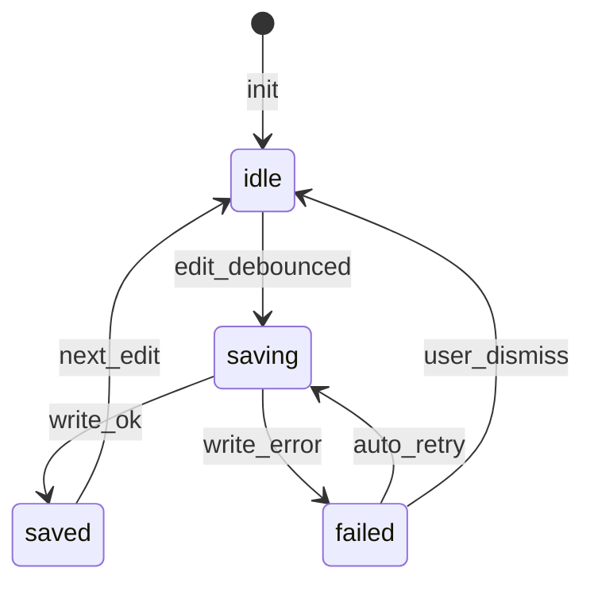

# Autosave FSM (localStorage) — SSOT

State machine for the localStorage autosave adapter (ARCH-C-025), referenced from
`docs/spec/30-architecture.sdoc` §7 (concurrency / state-transition triage, R4).
The execution model is single-threaded (ADR-002); state is swapped atomically as an
immutable snapshot + command apply (ARCH-C-019).

On `failed`, the observability base (ARCH-C-034) raises a user-facing toast and an
auto-retry (`failed --> saving`) is attempted. When the retry limit is reached the
machine keeps `failed` until the user explicitly dismisses (`user_dismiss`); the
in-progress edits stay in memory, so a localStorage write failure never loses edits.

