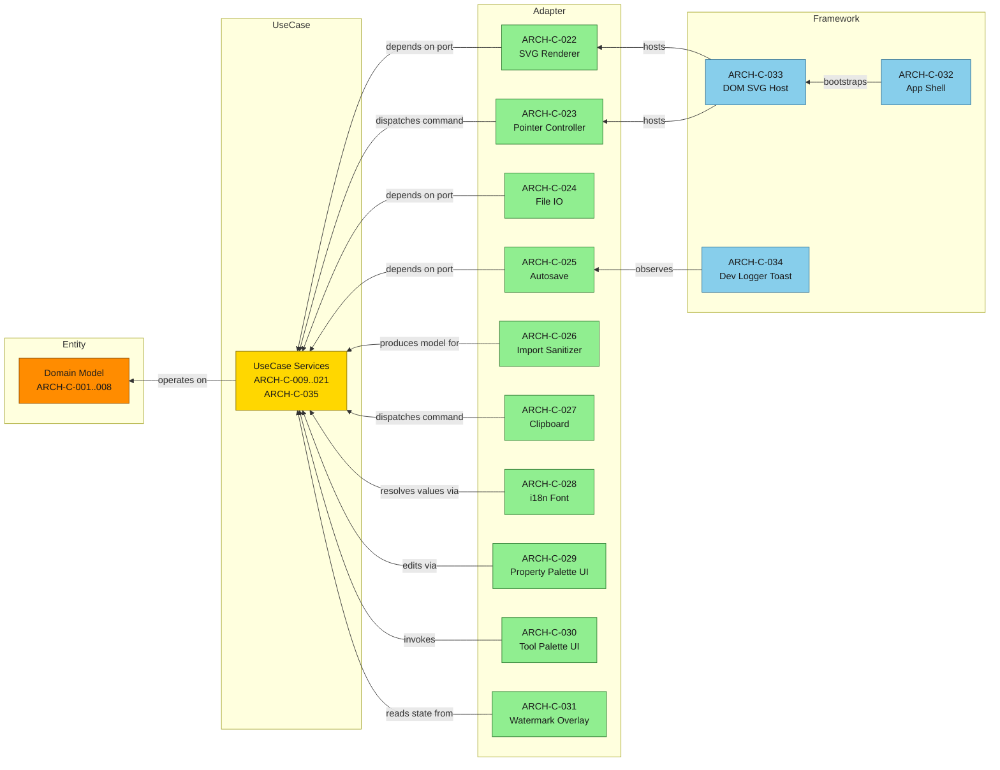

# Component / DIP Overview (15-node) — SSOT

Reduced dependency overview for `docs/spec/30-architecture.sdoc` §3. It shows the
Dependency-Inversion direction between the four Clean-Architecture layers: edges
point **inward** (Framework -> Adapter -> UseCase -> Entity); the core
(Entity / UseCase) never references Adapter / Framework, and Adapters implement
the ports the UseCase layer exposes. UseCase services (ARCH-C-009..021, C035) and
the Entity models (ARCH-C-001..008) are collapsed into single nodes here; the full
per-component map lives in `component-architecture-full.md`.

Layer colors follow the project default legend (Entity #FF8C00, UseCase #FFD700,
Adapter #90EE90, Framework #87CEEB).

> The import sanitizer (ARCH-C-026) spans two files in the real tree: the pure
> `src/domain/usecase/import-sanitizer.ts` (validation/sanitize) and the orchestrating
> `src/adapters/io/import-service.ts` (file wiring). The Framework layer has no separate
> directory in the real tree; ARCH-C-032/033 host wiring is folded into `src/app/main.ts`
> and the dev logger / toast (ARCH-C-034) lives in `src/app/logger.ts` + `src/app/benchmark.ts`.
