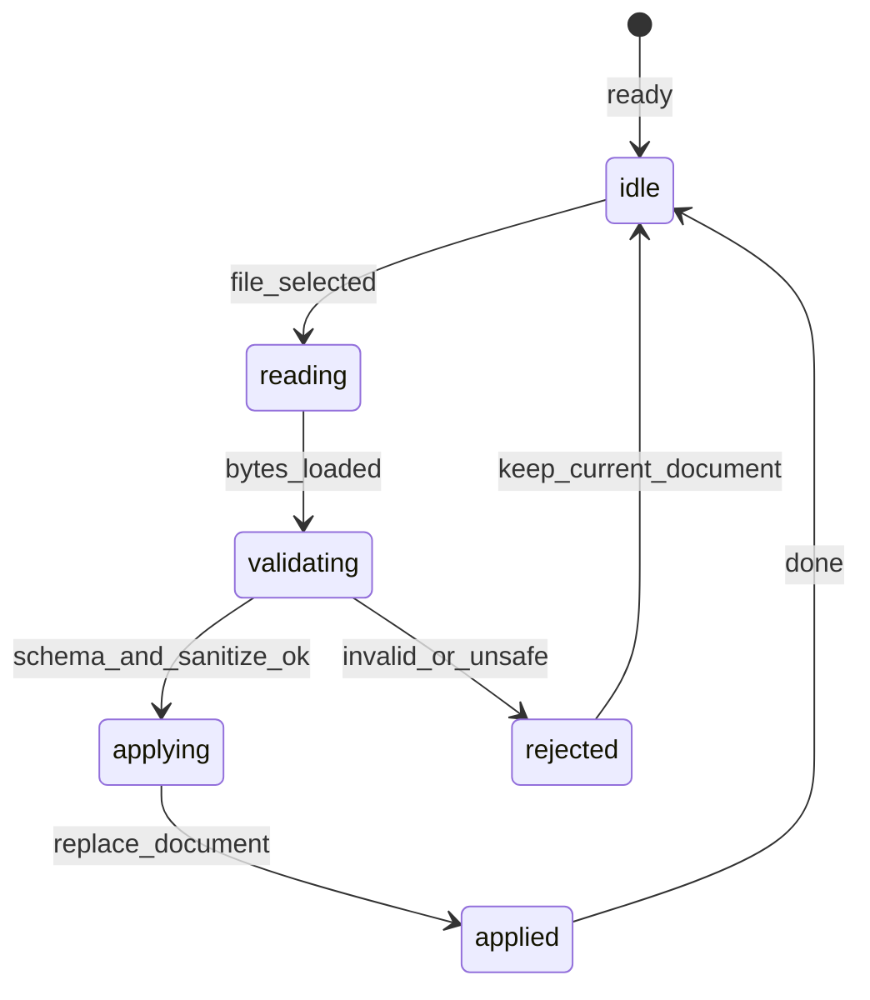

# Import FSM — SSOT

State machine for the import flow (ARCH-C-026, sanitizer), referenced from
`docs/spec/30-architecture.sdoc` §7 (concurrency / state-transition triage, R4).
The sanitizer spans `src/domain/usecase/import-sanitizer.ts` (validation/sanitize)
and `src/adapters/io/import-service.ts` (file wiring).

On `rejected` (validation/sanitize failure) the in-memory document is left entirely
unchanged (rollback = no-op apply). The document is replaced (`replace_document`)
only after validation passes, in the `applying` state, so a rejection can never leave
a partially applied, inconsistent document. If unsaved edits exist before replacement,
the user is asked to confirm (see 40-data-format DATA-JSON-001 reconciliation rule).
Conflicts with user edits during import are avoided by the replace strategy (no merge).

