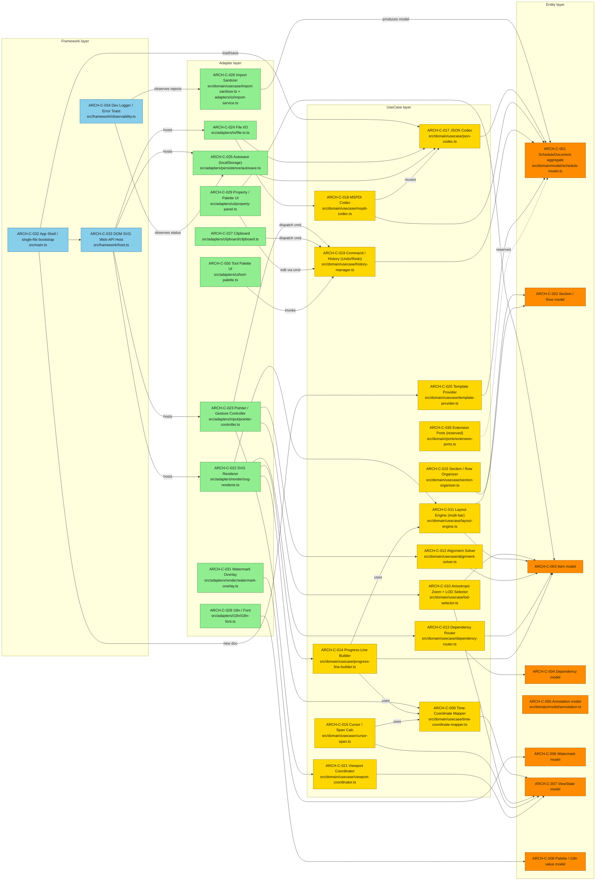
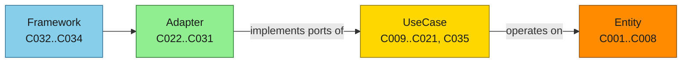

# Component Architecture (full, ~35 components) — SSOT

Comprehensive Clean-Architecture component map for gr-scheduler, covering all
components ARCH-C-001..035 from `docs/spec/30-architecture.sdoc`, grouped by
layer (Entity / UseCase / Adapter / Framework). Dependencies point **inward**
(DIP): Framework -> Adapter -> UseCase -> Entity; the core (Entity / UseCase)
never references Adapter / Framework. This is the detailed map the 15-node
overview in 30-architecture.sdoc §3 lacks. Layer colors follow the project
default legend (Entity #FF8C00, UseCase #FFD700, Adapter #90EE90,
Framework #87CEEB).

Node ids are ASCII (`Cnnn` = ARCH-C-nnn). Labels carry the component name and
its `src/` module path.

## A. Full component map (all 35 nodes, DIP-respecting edges)



> Note: ARCH-C-005 (Annotation) has no inbound edge in this view because the M-series
> annotation editor/renderer wiring (comment + rounded-box) is drawn by the SVG Renderer
> (C022) and edited via the command store (C019); the explicit C022->C005 / C029->C005
> edges are omitted to reduce clutter. The aggregation of C002..C008 under the
> ScheduleDocument root (C001) is shown in `domain-model-class.md`, not here.

## B. Layer-level DIP invariant (reading aid)



> Ambiguity flagged (not guessed): `30-architecture.sdoc` proposes module paths
> under `src/adapter/...` and `src/domain/{geometry,zoom,layout,...}`, but the ACTUAL
> tree uses `src/adapters/...` and flattens the UseCase services under
> `src/domain/usecase/...` (e.g. `time-coordinate-mapper.ts`, `layout-engine.ts`,
> `import-sanitizer.ts`). The paths above are taken from the real source tree; the
> `.sdoc` proposed paths are noted where they differ. The sanitizer (ARCH-C-026)
> spans two files in practice: the pure `domain/usecase/import-sanitizer.ts` and the
> orchestrating `adapters/io/import-service.ts`.
```
