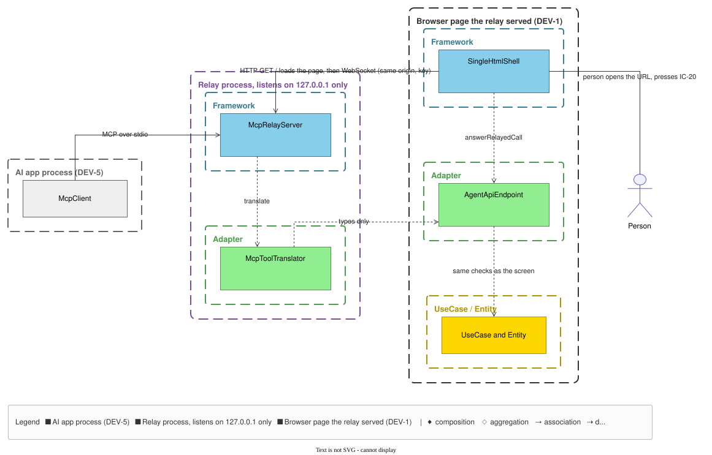

# MCP の取次 — 設計

**UID**: DOC-DESIGN-MCP-RELAY
**Version**: 0.1

> ⭐ 本書は手で書く原稿であり、MCP の取次の組み方の正である。  
> 取次が何をしなければならないかは `01-04-requirements.md` の `FR-150` と 表 T-035 の `AG-12` が持つ。  
> 本書はそれをどう組むかだけを持ち、要求・表の行を写さずに指す。

## 1. 目的と置き場所

**Type**: SECTION

取次は、MCP の客（AI のアプリ）が呼んだ `Agent API` のメンバを、人がブラウザで開いている `GRS` のページへ運び、ページの答えを客へ返す別のプロセスである。  
文書の唯一の正は開いているページのままであり（`FR-150`）、取次は文書もドメインの規則も持たない（`AG-12` の結び）。  
取次は `GRS` のページを `127.0.0.1` で自分で配り、そのページと同じ origin の WebSocket で繋ぐ（`AG-12` の ①）。

置き場所を 図 F-045 に示す。  
箱はコンポーネント、枠はプロセスと層である。  
ページの側は既にあるコンポーネントにユニットを 1 つずつ足すだけで、`UseCase` と `Entity` は変えない。

**図 F-045 — MCP の取次の置き場所**

[](fig-mcp-relay.svg)

図の原稿は `_source/fig-mcp-relay.json` である。  
`.drawio` と `.svg` はそこから生成したものであり、手で直さない —— 次の生成で消える。

## 2. コンポーネントと層

**Type**: SECTION

取次のプロセスに載るコンポーネントは `05-07-design.md` の 表 T-062 の `CP-40`（`McpToolTranslator`）と `CP-41`（`McpRelayServer`）である。  
ページの側は、同表の `CP-17`（`AgentApiEndpoint`）と `CP-25`（`SingleHtmlShell`）に、表 T-075 の `UF-185` と `UF-188` を足す。  
取次の側のユニットは同表の `UF-186` と `UF-187` である。  
層・責務・負う要求は 表 T-062 と 表 T-075 が持ち、公開する名前は `tbl-published-entries.md` の 表 T-064 の `PI-17` ・ `PI-40` ・ `PI-41` が持つ。  
本書はそれらを写さない。

層の割り方の理由は次のとおりである。

- 呼び出しと答えを MCP の形と `Agent API` の形のあいだで写すことは、値から値への変換なので `Adapter` の `pure` とする（表 T-060 の `LY-4`）。
- 待ち受ける口・繋いだページ・待っている呼び出し・溜めた変更の通知は現在値なので、`Framework` だけが持つ（`LY-5`）。
- 取次には `UseCase` と `Entity` のコンポーネントを置かない —— 取次が持つ規則は運び方だけであり、文書の規則はページの `Agent API` が 表 T-035 の `AG-5` のとおり当てる。
- ⭐ 取次のコンポーネントから出る辺は、`McpRelayServer` から `McpToolTranslator` への 1 本と、`McpToolTranslator` から `AgentApiEndpoint` の型だけを読む 1 本に限る（`_source/components.json` の `edges`。表 T-247 の `EG-5` が、ここに無い辺をコードに作ることを禁じる）。  
  型だけの辺は、呼び出しと答えの型を 2 か所で書かないためである（`R2.21`）。  
  これで「取次は文書もドメインの規則も持たない」（`AG-12` の結び）を検査が見張る。

## 3. インターフェース

**Type**: SECTION

### 3.1 MCP の客と取次のあいだ

取次は MCP の stdio の運び方で客と話す。  
標準出力は MCP の文だけに使い、取次の記録は標準エラーへ書く。

- **道具の一覧** —— 道具は `tbl-glossary.md` の 表 T-107 のメンバと 1 対 1 であり、名は同じ確定名である（`AG-12` の ④）。  
  道具の説明は同表の「何を担うか」の欄から刷り、手で書かない。
- **道具の入力** —— 1 つのオブジェクトとし、鍵はそのメンバの引数の名とする。  
  引数の名と型は `src/` の公開エントリが持つ `AgentApi` の署名である（表 T-064 の `PI-17`）。  
  引数を持たないメンバとプロパティ（`agentApiVersion` ・ `schemaVersion`）は空のオブジェクトを受ける。  
  ⚠️ `watchChanges` だけは受け手の代わりに待つ長さ `waitMs` を受ける（`AG-12` の ⑤）。  
  渡さなければ待たずに答える。  
  ⛔ 取次は入力の中身を検めない —— 検めるのはページの `Agent API` である（`AG-12` の結び、`AG-5`）。
- **道具の答え** —— メンバが返した値を、そのまま構造のある値として返す。  
  拒否も値のまま返し、MCP の誤りにしない（表 T-035 の `AG-9a`）。  
  画像（`exportPng`）は MCP の画像として返す。  
  MCP の誤りにするのは、ページがメンバを呼べずに例外で終わったときだけである。

### 3.2 取次とページのあいだ

- **ページを配る** —— `GET /` に、同じ版で作った単一 `.html` と同じバイト列を返す。  
  内容セキュリティ方針（`05-07-design.md` の 表 T-232）はページの中にあるので、取次は足しも削りもしない。  
  ほかの道は断る。
- **繋ぐ** —— ページは同じ origin の WebSocket で繋ぎ、最初の文で、URL の断片から読んだ鍵を渡す（`AG-12` の ⑦）。  
  WebSocket への接続は 表 T-232 の `PO-7` が許す。
- **運ぶ** —— 鍵を受けた後の文は JSON-RPC 2.0 とする。  
  取次が呼び、ページが答える。  
  `method` は 表 T-107 の確定名、`params` は 3.1 の道具の入力と同じオブジェクトである。  
  `result` はメンバの答えであり、画像のバイト列だけは base64 の文字列にする。  
  型は `relayed-call.ts` が持つ `RelayedCall` と `RelayedAnswer` である（表 T-064 の `PI-17`）。
- **知らせる** —— ページは、購読した変更と発話を `changeNoticed` の通知として取次へ送る（3.3）。

```text
page  -> relay   {"jsonrpc":"2.0","method":"relayKeyPresented","params":{"key":"<key from #fragment>"}}
relay -> page    {"jsonrpc":"2.0","id":7,"method":"readStamp","params":{}}
page  -> relay   {"jsonrpc":"2.0","id":7,"result":<the value readStamp returned>}
page  -> relay   {"jsonrpc":"2.0","method":"changeNoticed","params":<one change notice>}
```

### 3.3 待つ道具

`watchChanges` の購読は、ページが繋がってから最初に `watchChanges` が呼ばれたとき、取次がページに 1 度だけ求める。  
届いた変更と発話は取次が届いた順に溜め、`watchChanges` の呼び出しは、溜まっていればすぐに、無ければ `waitMs` だけ待って、溜まっていたものをすべて返す。  
待つあいだに何も届かなければ空の並びを返す —— これが `AG-12` の ⑤ の「まだ無い」である。  
ページが切れたら購読と溜めたものを捨て、次に繋いだページで購読し直す。  
何が届くかは `AG-6` がページの側で決める。

## 4. データの流れ

**Type**: SECTION

1. AI のアプリが取次を起動する。  
   取次は `127.0.0.1` の、OS が選んだ空いた口で待ち受け、起動ごとの鍵を暗号学的な乱数から作り、`http://127.0.0.1:<口>/#<鍵>` を標準エラーへ書く。
2. 人がその URL をブラウザで開き、文書を「開く」（`FR-087`）で開き、`IC-20` で `Agent API` を有効にする（`FR-065`）。
3. ページは、`Agent API` が有効であり、URL の断片に鍵があるあいだだけ、取次へ繋ぐ（`AG-12` の ②）。
4. 取次は origin と鍵を照らし、まだページが繋がっていなければ受ける（`AG-12` の ③ ⑦）。
5. 客が道具を呼ぶ。  
   取次は `McpToolTranslator` で呼び出しを写し、ページへ送る。
6. ページは `answerRelayedCall` で同じ名のメンバを呼び、答えを返す。  
   検証・拒否・刻印の照合は、画面からの書き込みと同じ道を通る（`AG-5`）。
7. 取次は答えを `McpToolTranslator` で MCP の答えに写し、客へ返す。

## 5. 断る道と異常

**Type**: SECTION

- **ページが繋がっていない**（開いていない・`Agent API` が無効・閉じられた） —— 取次は道具の呼び出しに拒否を値で返す（`AG-12` の ②）。  
  理由の区分は `pageNotConnected` とし、開く URL を添える —— AI が人に開き方を伝えられるようにするためである。  
  ⚠️ ページが無いので現在の刻印は無く、刻印の欄は空とする。
- **呼び出しの途中でページが切れた** —— 答えを待っていた呼び出しにも、同じ拒否を返す。  
  ページで既に確定した書き込みは戻さない。
- **2 つ目のページ・origin の違う接続・鍵の無い接続・鍵の違う接続** —— WebSocket を閉じて断る（`AG-12` の ③ ⑦）。  
  繋がっているページは変わらない。
- **ページの `Agent API` が断った** —— 刻印の食い違い・人のドラッグ中・読み取り専用の行（`FR-111` の 表 T-275 の `GP-1` ・ `GP-7`、理由は 表 T-233 の `RS-61` ・ `RS-62`）など、どの拒否も取次は写さずにそのまま運ぶ。
- **合流の 3 択** —— 人が `U-61` で答えるまで、呼び出しは答えを待ったままでいる（`AG-12` の ⑥、`FR-022`）。  
  取次は待つ長さを持たない。
- **客が呼び出しを取り消した** —— 取次は後から来た答えを捨てる。  
  ページで起きたことは戻さない。

## 6. 配り方

**Type**: SECTION

配り方は `AG-12` の ① が持つ —— AI のアプリが MCP の相手として入れる 1 つのファイルと、同じ中身をコマンド行の JavaScript の実行環境で動かす形である。  
どちらの形も、同じ版で作った単一 `.html` を中に持ち、3.2 のとおりそのまま配る。  
取次を使わない人の `GRS` は、今までどおり単一 `.html` を開くだけで動く（`FR-150`）。  
⭐ 前者の形は MCP の束（`grs-relay.mcpb`）とする —— `manifest.json` と、取次を 1 つに束ねた JavaScript と、同じ版の単一 `.html` を入れた zip であり、`manifest.json` の実行の土台は `node` とする。  
束を入れる人は Node も何も入れなくてよい —— 実行の土台は AI のアプリが持つ（`AG-12` の ①）。  
後者の形は、同じ JavaScript のファイル 1 つ（`grs-relay.mjs`）である。  
どちらも公開する単一 `.html` と同じ組み立てで作り、最新版を入手する所（`_assets/tbl-settings.md` の 表 T-206 の `S-350`）の頁に置く —— `GRS` はその頁を、ヘルプの備考と `IC-20` のツールチップで案内するだけで、自分では取得しない（`FR-036`、表 T-003 の `CN-6`）。  
⛔ バッチファイル・シェルのスクリプト・実行ファイルでは配らない —— インターネットから落とした署名の無いこれらを OS の保護が止め、止まらない機械でも利用者に警告を越えさせる。  
取次を別の言語でもう 1 つ書くことにもなり、`AG-12` の ① の「同じ中身」を破る。  
束に署名は付けない —— 付けるときは束の形式の署名であり、OS の保護には関係しない。

## 7. 守り

**Type**: SECTION

- 待ち受けるのは `127.0.0.1` だけであり、ほかの機器からは繋げない（`AG-12` の ①）。
- `Host` が `127.0.0.1:<口>` でない要求は、ページを配る道でも WebSocket でも断る。  
  別の名前を `127.0.0.1` へ向ける手（DNS の張り替え）で、別の origin のページに取次を読ませないためである。
- 接続を受けるのは、取次が配ったページの origin で、起動ごとの鍵を渡したものだけである（`AG-12` の ⑦）。  
  origin を照らすので、別の名前を `127.0.0.1` へ向けたページからも繋げない。  
  ⛔ `Origin` が `null` の接続も断る —— 手元のファイルで開いたページやサンドボックスの枠は、どれも `null` を名乗るので、受ければどのページからでも繋げてしまう。
- 名簿も認証も持たない（`FR-111` の RATIONALE）—— 鍵が守るのは「同じ機械の別のページ」からであり、人を見分けることではない。
- 取次は文書を保存しない。  
  書き込みはいつもページが確定する。

## 8. 本書が持たないもの

**Type**: SECTION

- 道具の一覧と、各メンバが何を担うか —— `tbl-glossary.md` の 表 T-107。
- 取次とページが従う規則 —— 表 T-035 の `AG-12`。
- 引数と戻り値の型 —— `src/` の公開エントリ（表 T-064 の `PI-17`）。
- コンポーネントとユニットの責務 —— 表 T-062 と 表 T-075。
- サーバーとの連携・名簿・認証 —— 範囲外である（`01-04-requirements.md` の 表 T-002 の `SO-12`）。
- MCP の HTTP の運び方・ブラウザを取次が自分で開くこと・道具を束ねること —— 持たない（束ねないことは `AG-12` の ④）。
