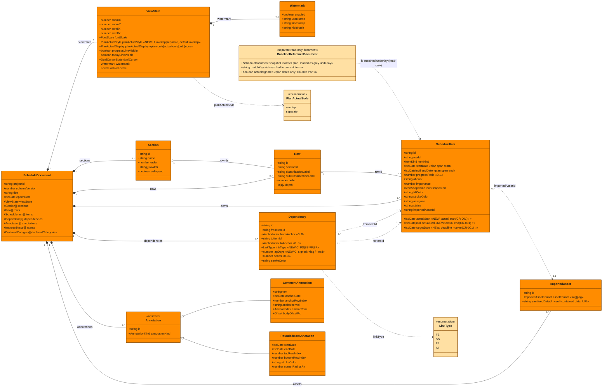

# Domain Model — Class Diagram (CR-001/CR-002 target — actual-date fields)

Entity-layer domain model of gr-scheduler in its **CR-001/CR-002 target state
(actual-date fields)**. This is a `classDiagram` derived from
`src/domain/model/schedule-model.ts` + `src/domain/model/annotation.ts`, with the
CR-001 (actual-date / dependency / deadline) and CR-002 (previousPlan abolished,
baseline moved to a separate reference document) changes applied (see
`project-records/change-requests/change-request-001-20260719-230349.md` and
`project-records/change-requests/change-request-002-20260720-054132.md`).

All classes below live in the **Entity** layer (Clean Architecture), so they all
carry the Entity color (#FF8C00) per the project legend.

> IMPORTANT (spec-ahead-of-code): this diagram reflects the **CR-001/CR-002
> target (actual-date fields)**, which the code has NOT yet adopted. Versus the
> current source `ScheduleItem` (which still carries `planActualKind` /
> `planGroupId` and `previousPlan`): `ScheduleItem` GAINS `actualStart`,
> `actualEnd`, `targetDate`, DROPS `planActualKind` / `planGroupId`, and (per
> CR-002 Part 3) DROPS `previousPlan` — baseline (former plan) is now a separate,
> id-matched, read-only reference document, not a field. `Dependency` GAINS
> `linkType` + signed `lagDays`; `ViewState` GAINS `planActualStyle`
> (overlap|separate). Per CR-001 §8 / CR-002 §8 the schema.json and `src/**` are
> changed only in the implementation session, so until then this is a design
> target, not the running code.



Notes and flagged ambiguities:

- `ScheduleItem` shows a curated field set. The real type also carries the full
  PROP-L1-002 property fields (`fullName`, `description`, `major/middle/minorCategory`,
  `remarks`, `lineWeight`, `labelPosition`, `labelOffset`, `fadeInDays`, `fadeOutDays`,
  `milestoneShape`, `taskShape`, `fillColorExplicit`) — omitted here for readability,
  not dropped by CR-001/CR-002. `labelPosition` enum values include
  `inner-left` (in-bar left-aligned, the CR-003 default for task labels), distinct
  from the outside-the-bar `left`.
- Baseline (former/changed-from plan) is NOT a field on `ScheduleItem` anymore.
  Per CR-002 Part 3 it is a **separate reference document** (`BaselineReferenceDocument`
  above): a past-plan snapshot loaded (JSON only) with a "treat as baseline" flag,
  id-matched to the current items, rendered as a read-only grey underlay at the same
  row height (plan dates only; its actuals are ignored). This supersedes the CR-001
  `previousPlan` field.
- `AnnotationKind` = `callout-box | polyline | rounded-box`; `CommentAnnotation.annotationKind`
  is one of the two comment-leader kinds, `RoundedBoxAnnotation.annotationKind` is `rounded-box`.
- CR-001 does NOT specify where `planActualStyle` sits other than "viewState"; it is
  placed on `ViewState` alongside the existing `planActualDisplay`, consistent with the
  CR §2 diff. `LinkType` mnemonic order (FS/SS/FF/SF) is the GR-facing set; the MSPDI
  numeric mapping (FF=0/FS=1/SF=2/SS=3) is a codec concern shown in
  `sequence-io-roundtrip.md`, not stored on the enum.
```
