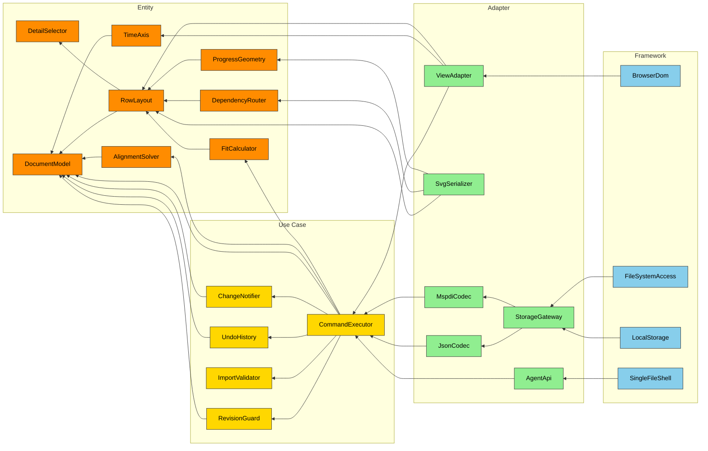

# 図 F-005 — コンポーネント

**UID**: DOC-FIG-COMPONENTS
**Version**: 0.1

**本書は 図 F-005 とその読み方だけを持つ。** 部品の責務は `05-07-design.md` の 表 T-046 が持ち、**ここに責務を書かない（MUST NOT）。** 層の凡例は同書の 図 F-007 が持つ。

本書は `05-07-design.md` の Chapter 5.2 から参照される。

## 1. 図

**Type**: SECTION

**色は 図 F-007 の凡例と同じである。** 矢印は「呼ぶ」向きであり、依存の向きと同じである。**すべての矢印が内側の層を向いていることが、この図で確かめるべきことである。**

**図 F-005 — コンポーネント**

## 2. この図で確かめること

**Type**: SECTION

| 確かめること | 図のどこに出ているか |
| --- | --- |
| 書き込みの入口が 1 つであること | `ViewAdapter` と `AgentApi` の矢印が、どちらも `CommandExecutor` へ入る |
| 書き込みの経路が 1 本であること | `DocumentModel` へ向かう `Use Case` の矢印のうち、値を変えるのは `CommandExecutor` からの 1 本だけである |
| 描画が書き込みの経路でないこと | `SvgSerializer` の矢印が `Use Case` を通らず `Entity` へ直接入る |
| 依存が内向きであること | `Entity` から外へ出る矢印が 1 本も無い |

⚠️ **`ChangeNotifier` から `ViewAdapter` と `AgentApi` への通知は、依存の向きと逆なので図に矢印として描いていない。** 実装では**外側が購読する形**にし、内側が外側の型を知らないままにすること（MUST）。順序は 図 F-006 が持つ。
