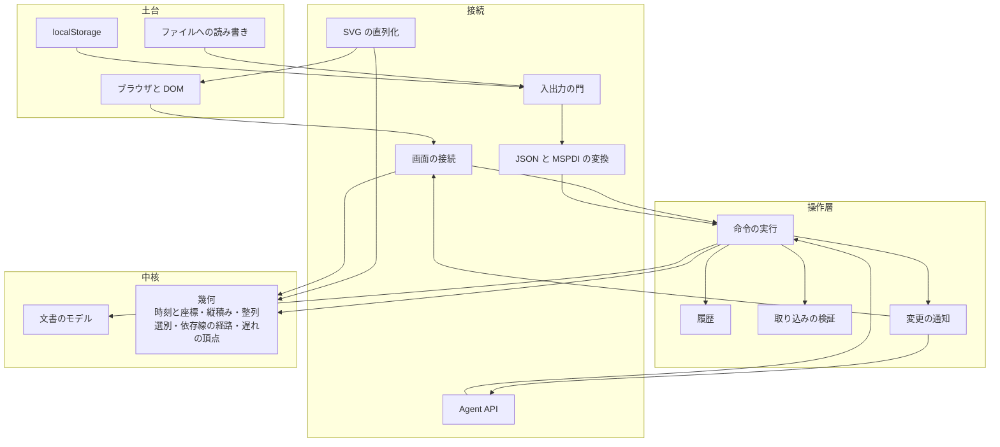
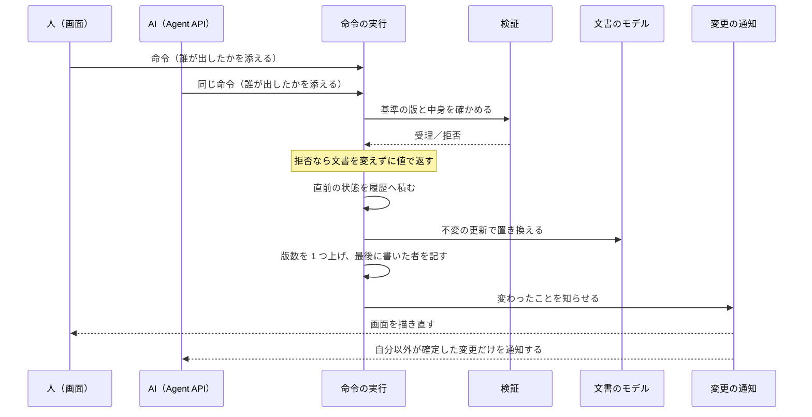

# 図 — コンポーネント

**UID**: DOC-FIG-COMPONENTS
**Version**: 0.1

**本書は図だけを持つ。** 部品の責務と機器の対応は `05-07-design.md` の Chapter 5.2 が表として持つ。**ここに責務を書かない（MUST NOT）。**

## 1. 全体

**Type**: SECTION

**図 F-005 — コンポーネントの全体**

**枠は層である**（`05-07-design.md` の 表 T-045）。**矢印は「呼ぶ」向きであり、依存の向きと同じである。** すべての矢印が内側を向いていることが、この図で確かめるべきことである。

⚠️ **`SVG の直列化` から `幾何` への矢印が操作層を通っていないことが、この図の要点である。** 描画は**読み取りの経路**であって書き込みの経路ではない。書き込みの経路は `命令の実行` の 1 本しかない。

## 2. 書き込みの経路

**Type**: SECTION

**図 F-006 — 書き込みは 1 本の関門を通る**

**人が画面から行う編集と、`Agent API` から行う編集は、同じ関門を通る。** 関門を通らない書き込みの経路は存在しない。

⚠️ **版数を上げることと知らせることを、この関門の外で行ってはならない（MUST NOT）。** 外で行える経路を 1 本でも作ると、**版数が上がったのに誰も知らない状態**が生まれる。前プロジェクトの共同編集の試作は、受理した書き込みをすべて 1 つの関門に通すことでこれを防いでいた。
