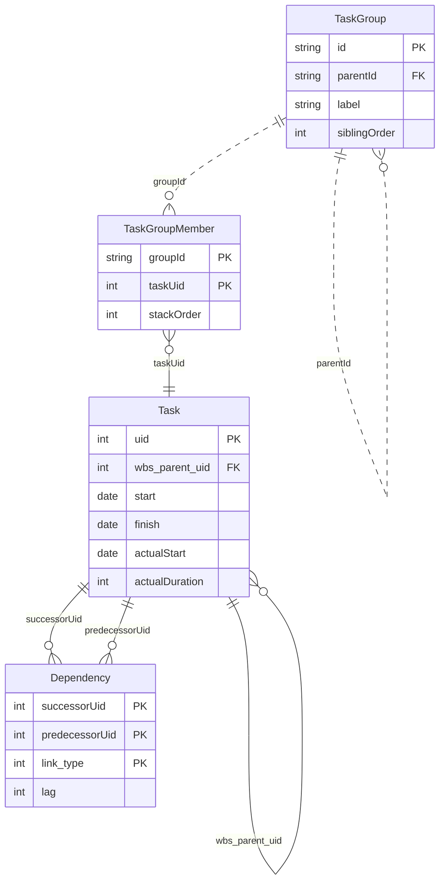

# 図 F-002 — コアのエンティティ

**UID**: DOC-FIG-CORE-ENTITIES
**Version**: 0.1

**本書は 図 F-002 とその読み方だけを持つ。** 全体は `fig-domain-model.md` の 図 F-003 が、列は `tbl-datamodel.md` が持つ。

本書は `05-07-design.md` の Chapter 5.4 から参照される。

## 1. 図

**Type**: SECTION

**表 T-302 の `EN-1` 〜 `EN-4` だけを描いた最小形である。** これが無いと本製品のデータ構造が成立しない。

**図 F-002 — コアのエンティティ**

⚠️ **列は抜粋である。全数は `tbl-datamodel.md` の 表 T-303 〜 表 T-306 が持つ。**

## 2. この 4 つで何が表せるか

**Type**: SECTION

| 表せるもの | 担う要素 |
| --- | --- |
| 仕事の分解 | `Task.wbs_parent_uid` の自己参照 |
| 1 つの行に複数のタスクを横並べすること | `TaskGroup` に `TaskGroupMember` で複数の `Task` を載せる |
| タスク間の依存 | `Dependency`（先行・後続・種別・ずらし量） |
| 予定と実績とマイルストーン | `Task` の日付の列と、`TaskVisual.shapeKind` |

**識別は `Task.uid` の 1 本だけである。** 本製品だけが持つ代理の識別子を足さない（`tbl-datamodel.md` の 表 T-317）。
