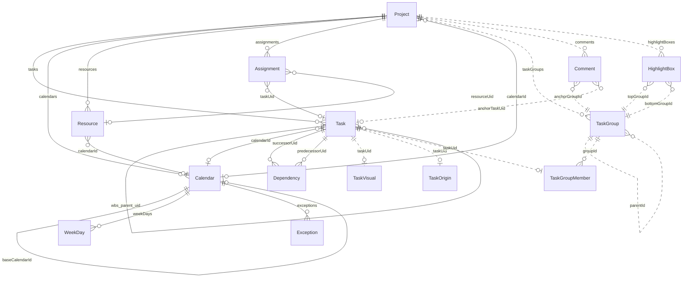

# 図 F-003 — ドメインモデル

**UID**: DOC-FIG-DOMAIN-MODEL
**Version**: 0.1

**本書は 図 F-003 とその読み方だけを持つ。** 列と型と制約は `tbl-datamodel.md`（`DOC-TBL-DATAMODEL`）が持ち、**ここに列を書かない（MUST NOT）。**

本書は `05-07-design.md` の Chapter 5.4 から参照される。

## 1. 図

**Type**: SECTION

**実線は MSPDI へ書き出すもの、破線は本製品の中にだけあるものである**（表 T-302 の `export` 欄）。線のラベルはその関係を担う列の名前である。

**図 F-003 — ドメインモデル**

## 2. 各要素

**Type**: SECTION

**層の意味。** **コア**は、それが無いと本製品のデータ構造が成立しないものである。**付随**は、外しても構造は壊れないが機能が減るものである。

**由来の意味。** `Own` は MSPDI の要素をそのままの形で持つもの、`Consume` は MSPDI の要素を別の構造に組み替えて持つもの、`GRS` は MSPDI に対応が無い本製品の新設である。

**表 T-302 — エンティティ**

| 行 ID | エンティティ | 層 | 由来 | export | 責務 | 列 |
| --- | --- | --- | --- | :-: | --- | --- |
| EN-1 | `Task` | コア | Own | ● | 日程要素の本体。予定・実績・中断の日付、WBS の親、暦の参照を持つ | 表 T-303 |
| EN-2 | `TaskGroup` | コア | GRS | — | **行の器**と見出しの階層、および行ごとの書式 | 表 T-304 |
| EN-3 | `TaskGroupMember` | コア | GRS | — | どの `Task` がどの行に載るかと、その行の中での縦の積み順 | 表 T-305 |
| EN-4 | `Dependency` | コア | Consume | ● | タスク間の依存。先行・後続・種別・ずらし量。**線の経路は保存しない** | 表 T-306 |
| EN-5 | `Project` | 付随 | Own | ● | 文書の根。文書の基本情報と、換算の基準と、既定の暦の参照 | 表 T-307 |
| EN-6 | `Calendar` | 付随 | Own | ● | 稼働日と非稼働日の暦 | 表 T-309 |
| EN-7 | `WeekDay` | 付随 | Own | ● | 曜日ごとの稼働の可否 | 表 T-310 |
| EN-8 | `Exception` | 付随 | Own | ● | 特定の日の稼働の可否 | 表 T-311 |
| EN-9 | `Resource` | 付随 | Own | ● | 担当者などの資源。**担当ラベルに出す名前の出どころ** | 表 T-312 |
| EN-10 | `Assignment` | 付随 | Consume | ● | `Task` と `Resource` の割当 | 表 T-313 |
| EN-11 | `TaskVisual` | 付随 | GRS | — | `Task` の見た目。形状・色・線の太さ・名称ラベルの位置 | 表 T-314 |
| EN-12 | `TaskOrigin` | 付随 | GRS | — | その `Task` がどの外部マスタから来たか。**合流の既定の判定に使う** | 表 T-308 |
| EN-13 | `Comment` | 付随 | GRS | — | 位置を指す注記 | 表 T-315 |
| EN-14 | `HighlightBox` | 付随 | GRS | — | 範囲を囲む注記 | 表 T-316 |

**`TaskVisual` と `TaskOrigin` を `Task` から分けてある理由は、`Task` を「MSPDI の `Own` だけを持つ器」に保つためである。** そうしておくと書き出しが「`Task` の全列をそのまま書く」で済み、**除外する列の一覧を作らなくてよい** —— 一覧を作れば、そこから漏れる誤りが必ず生まれる。
