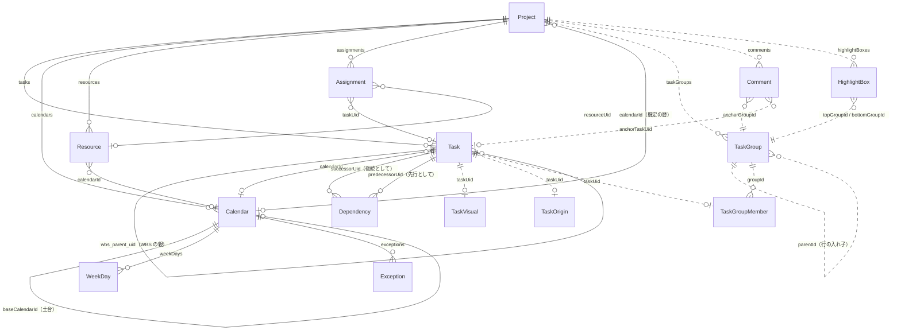
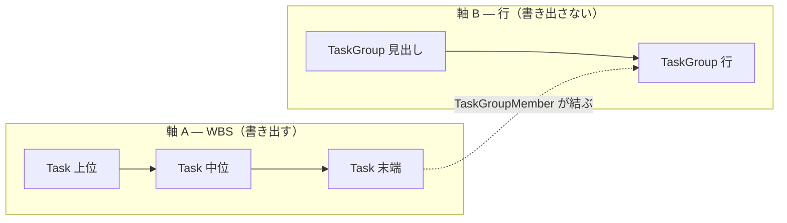

# 図 — ドメインモデル

**UID**: DOC-FIG-DOMAIN-MODEL
**Version**: 0.1

**本書は図だけを持つ。** 列と型と制約の正は `tbl-datamodel.md`（`DOC-TBL-DATAMODEL`）である。**ここに列を書かない（MUST NOT）** —— 図と表の両方に列を持つと、片方だけが古くなる。

本書は `05-07-design.md` の Chapter 5.4 から参照される。

## 1. 全体

**Type**: SECTION

**図 F-003 — ドメインモデルの全体**

線のラベルは、その関係を担う列の名前である。**破線で描いたものは MSPDI へ書き出さない**（表 T-302 の `export` 欄）。

## 2. 2 つの軸

**Type**: SECTION

**図 F-002 は Chapter 5.4 の本文が持つ。** 本節は、その 2 つの軸が交わる 1 点だけを図にする。

**図 F-004 — 同じ `Task` が 2 つの木に属する**

**軸 A の親子は `Task` どうしで、軸 B の親子は `TaskGroup` どうしである。** 交点は `TaskGroupMember` だけであり、**そこ以外で 2 つの木が触れ合わない。** この形が、行を動かしても WBS が動かないことを構造として保証している。
