# データモデル — 詳細（列と関係）

**UID**: DOC-FIG-ERD-DETAIL
**Version**: 0.1

> **本書は `docs/review/erd/build.py` が書き出す。手で直さない。**
> 直すのは `docs/review/erd/erd_model.py`（列と関係）と同フォルダの散文の型である。
> **図と表を同じ原稿から起こすことで、列の食い違いが起きないようにしている。**

**本書は文書が持つ列の全数である。** 文書ぜんたいの形は `fig-erd-overview.md`（`DOC-FIG-ERD-OVERVIEW`）が持ち、
**ルートの群の規則は `01-04-requirements.md` の表 T-052 が、持ち回りの形は表 T-053 が持つ。**

**名前の正は `tbl-glossary.md`、値の正は `tbl-settings.md`、規則と理由の正は要求である。**
本書が持つのは**列の構成**である。

## 1. 詳細 ERD

**Type**: SECTION

**赤の太字が主キー、緑の太字が外部キーである。** 主キーを兼ねる外部キーは赤で示し、鍵の欄に `PK/FK` と書く。
**辺のラベルは、その線が何を表すかと多重度である。** 多重度は「親側 ─ 子側」の順に書く。

⚠️ **交換相手へ書き出すときに作る列は、図に描いていない。** 文書が持たないためである。全数は表 T-059 が持つ。

**図 F-011 — データモデルの詳細**

```mermaid
---
config:
  flowchart:
    wrappingWidth: 1200
    htmlLabels: true
---
flowchart TB
    Project["<table style='white-space:nowrap'>
      <tr><td colspan='4'><b>Project</b></td></tr>
      <tr><td>id</td><td>文字列（16 字以下）</td><td>—</td><td>Own</td></tr>
      <tr><td>name</td><td>文字列</td><td>—</td><td>Own</td></tr>
      <tr><td>title</td><td>文字列</td><td>—</td><td>Own</td></tr>
      <tr><td>subject</td><td>文字列</td><td>—</td><td>Own</td></tr>
      <tr><td>category</td><td>文字列</td><td>—</td><td>Own</td></tr>
      <tr><td>company</td><td>文字列</td><td>—</td><td>Own</td></tr>
      <tr><td>manager</td><td>文字列</td><td>—</td><td>Own</td></tr>
      <tr><td>author</td><td>文字列</td><td>—</td><td>Own</td></tr>
      <tr><td>created</td><td>日時</td><td>—</td><td>Own</td></tr>
      <tr><td>revision</td><td>整数</td><td>—</td><td>Own</td></tr>
      <tr><td>lastSaved</td><td>日時</td><td>—</td><td>Own</td></tr>
      <tr><td>startDate</td><td>日付</td><td>—</td><td>Own</td></tr>
      <tr><td>statusDate</td><td>日付</td><td>—</td><td>Own</td></tr>
      <tr><td>minutesPerDay</td><td>整数</td><td>—</td><td>Own</td></tr>
      <tr><td>minutesPerWeek</td><td>整数</td><td>—</td><td>Own</td></tr>
      <tr><td>daysPerMonth</td><td>整数</td><td>—</td><td>Own</td></tr>
      <tr><td>weekStartDay</td><td>整数（0〜6）</td><td>—</td><td>Own</td></tr>
      <tr><td><b><span style='color:#008000'>calendarUid</span></b></td><td>整数</td><td>FK</td><td>Consume</td></tr>
      <tr><td>themeHue</td><td>整数（0〜359）</td><td>—</td><td>GRS</td></tr>
      <tr><td>uidHighWaterMark</td><td>整数</td><td>—</td><td>GRS</td></tr>
      <tr><td>carry</td><td>連想（文字列→文字列）</td><td>—</td><td>Carry</td></tr>
      <tr><td>carryElements</td><td>CarryElement[]</td><td>—</td><td>Carry</td></tr>
    </table>"]
    Task["<table style='white-space:nowrap'>
      <tr><td colspan='4'><b>Task</b></td></tr>
      <tr><td><b><span style='color:#C00000'>uid</span></b></td><td>整数</td><td>PK</td><td>Own</td></tr>
      <tr><td><b><span style='color:#008000'>wbsParentUid</span></b></td><td>整数</td><td>FK</td><td>Consume</td></tr>
      <tr><td>wbsOrder</td><td>整数</td><td>—</td><td>Consume</td></tr>
      <tr><td>name</td><td>文字列</td><td>—</td><td>Own</td></tr>
      <tr><td>start</td><td>日時</td><td>—</td><td>Own</td></tr>
      <tr><td>finish</td><td>日時</td><td>—</td><td>Own</td></tr>
      <tr><td>milestone</td><td>真偽</td><td>—</td><td>Own</td></tr>
      <tr><td>deadline</td><td>日時</td><td>—</td><td>Own</td></tr>
      <tr><td>notes</td><td>文字列</td><td>—</td><td>Own</td></tr>
      <tr><td><b><span style='color:#008000'>calendarUid</span></b></td><td>整数</td><td>FK</td><td>Consume</td></tr>
      <tr><td>actualStart</td><td>日時</td><td>—</td><td>Own</td></tr>
      <tr><td>actualDuration</td><td>整数（稼働日）</td><td>—</td><td>Own</td></tr>
      <tr><td>actualFinish</td><td>日時</td><td>—</td><td>Own</td></tr>
      <tr><td>resume</td><td>日時</td><td>—</td><td>Own</td></tr>
      <tr><td>resumeValid</td><td>真偽</td><td>—</td><td>Own</td></tr>
      <tr><td>percentComplete</td><td>整数（0 以上）</td><td>—</td><td>Own</td></tr>
      <tr><td>fadeInDays</td><td>整数（日数）</td><td>—</td><td>Consume</td></tr>
      <tr><td>fadeOutDays</td><td>整数（日数）</td><td>—</td><td>Consume</td></tr>
      <tr><td>dependencies</td><td>Dependency[]</td><td>—</td><td>Consume</td></tr>
      <tr><td>carry</td><td>連想（文字列→文字列）</td><td>—</td><td>Carry</td></tr>
      <tr><td>carryElements</td><td>CarryElement[]</td><td>—</td><td>Carry</td></tr>
    </table>"]
    Dependency["<table style='white-space:nowrap'>
      <tr><td colspan='4'><b>Dependency</b></td></tr>
      <tr><td><b><span style='color:#008000'>predecessorUid</span></b></td><td>整数</td><td>FK</td><td>Consume</td></tr>
      <tr><td>linkType</td><td>整数（0〜3）</td><td>—</td><td>Consume</td></tr>
      <tr><td>lag</td><td>整数</td><td>—</td><td>Consume</td></tr>
      <tr><td>lagFormat</td><td>整数</td><td>—</td><td>Consume</td></tr>
      <tr><td>carry</td><td>連想（文字列→文字列）</td><td>—</td><td>Carry</td></tr>
      <tr><td>carryElements</td><td>CarryElement[]</td><td>—</td><td>Carry</td></tr>
    </table>"]
    TaskGroup["<table style='white-space:nowrap'>
      <tr><td colspan='4'><b>TaskGroup</b></td></tr>
      <tr><td><b><span style='color:#C00000'>id</span></b></td><td>文字列（UUID）</td><td>PK</td><td>GRS</td></tr>
      <tr><td><b><span style='color:#008000'>parentId</span></b></td><td>文字列（UUID）</td><td>FK</td><td>GRS</td></tr>
      <tr><td>label</td><td>文字列</td><td>—</td><td>GRS</td></tr>
      <tr><td><b><span style='color:#008000'>derivedFromTaskUid</span></b></td><td>整数</td><td>FK</td><td>GRS</td></tr>
      <tr><td>order</td><td>整数</td><td>—</td><td>GRS</td></tr>
      <tr><td>isCollapsed</td><td>真偽</td><td>—</td><td>GRS</td></tr>
      <tr><td>color</td><td>文字列</td><td>—</td><td>GRS</td></tr>
      <tr><td>height</td><td>整数</td><td>—</td><td>GRS</td></tr>
    </table>"]
    TaskGroupMember["<table style='white-space:nowrap'>
      <tr><td colspan='4'><b>TaskGroupMember</b></td></tr>
      <tr><td><b><span style='color:#C00000'>taskUid</span></b></td><td>整数</td><td>PK/FK</td><td>GRS</td></tr>
      <tr><td><b><span style='color:#008000'>groupId</span></b></td><td>文字列（UUID）</td><td>FK</td><td>GRS</td></tr>
      <tr><td>stackOrder</td><td>整数</td><td>—</td><td>GRS</td></tr>
    </table>"]
    Calendar["<table style='white-space:nowrap'>
      <tr><td colspan='4'><b>Calendar</b></td></tr>
      <tr><td><b><span style='color:#C00000'>uid</span></b></td><td>整数</td><td>PK</td><td>Own</td></tr>
      <tr><td>name</td><td>文字列</td><td>—</td><td>Own</td></tr>
      <tr><td>isBaseCalendar</td><td>真偽</td><td>—</td><td>Own</td></tr>
      <tr><td><b><span style='color:#008000'>baseCalendarUid</span></b></td><td>整数</td><td>FK</td><td>Consume</td></tr>
      <tr><td>ordinal</td><td>整数</td><td>—</td><td>GRS</td></tr>
      <tr><td>carry</td><td>連想（文字列→文字列）</td><td>—</td><td>Carry</td></tr>
      <tr><td>carryElements</td><td>CarryElement[]</td><td>—</td><td>Carry</td></tr>
    </table>"]
    WeekDay["<table style='white-space:nowrap'>
      <tr><td colspan='4'><b>WeekDay</b></td></tr>
      <tr><td><b><span style='color:#C00000'>calendarUid</span></b></td><td>整数</td><td>PK/FK</td><td>GRS</td></tr>
      <tr><td><b><span style='color:#C00000'>ordinal</span></b></td><td>整数</td><td>PK</td><td>GRS</td></tr>
      <tr><td>dayType</td><td>整数（1〜7）</td><td>—</td><td>Own</td></tr>
      <tr><td>dayWorking</td><td>真偽</td><td>—</td><td>Own</td></tr>
      <tr><td>carry</td><td>連想（文字列→文字列）</td><td>—</td><td>Carry</td></tr>
      <tr><td>carryElements</td><td>CarryElement[]</td><td>—</td><td>Carry</td></tr>
    </table>"]
    Exception["<table style='white-space:nowrap'>
      <tr><td colspan='4'><b>Exception</b></td></tr>
      <tr><td><b><span style='color:#C00000'>calendarUid</span></b></td><td>整数</td><td>PK/FK</td><td>GRS</td></tr>
      <tr><td><b><span style='color:#C00000'>ordinal</span></b></td><td>整数</td><td>PK</td><td>GRS</td></tr>
      <tr><td>name</td><td>文字列</td><td>—</td><td>Own</td></tr>
      <tr><td>fromDate</td><td>日時</td><td>—</td><td>Own</td></tr>
      <tr><td>toDate</td><td>日時</td><td>—</td><td>Own</td></tr>
      <tr><td>dayWorking</td><td>真偽</td><td>—</td><td>Own</td></tr>
      <tr><td>recurrenceKind</td><td>整数（1〜9）</td><td>—</td><td>Consume</td></tr>
      <tr><td>carry</td><td>連想（文字列→文字列）</td><td>—</td><td>Carry</td></tr>
      <tr><td>carryElements</td><td>CarryElement[]</td><td>—</td><td>Carry</td></tr>
    </table>"]
    Resource["<table style='white-space:nowrap'>
      <tr><td colspan='4'><b>Resource</b></td></tr>
      <tr><td><b><span style='color:#C00000'>uid</span></b></td><td>整数</td><td>PK</td><td>Own</td></tr>
      <tr><td>name</td><td>文字列</td><td>—</td><td>Own</td></tr>
      <tr><td>resourceKind</td><td>整数</td><td>—</td><td>Own</td></tr>
      <tr><td>isCostResource</td><td>真偽</td><td>—</td><td>Own</td></tr>
      <tr><td><b><span style='color:#008000'>calendarUid</span></b></td><td>整数</td><td>FK</td><td>Consume</td></tr>
      <tr><td>carry</td><td>連想（文字列→文字列）</td><td>—</td><td>Carry</td></tr>
      <tr><td>carryElements</td><td>CarryElement[]</td><td>—</td><td>Carry</td></tr>
    </table>"]
    Assignment["<table style='white-space:nowrap'>
      <tr><td colspan='4'><b>Assignment</b></td></tr>
      <tr><td><b><span style='color:#C00000'>uid</span></b></td><td>整数</td><td>PK</td><td>Own</td></tr>
      <tr><td><b><span style='color:#008000'>taskUid</span></b></td><td>整数</td><td>FK</td><td>Consume</td></tr>
      <tr><td><b><span style='color:#008000'>resourceUid</span></b></td><td>整数</td><td>FK</td><td>Consume</td></tr>
      <tr><td>carry</td><td>連想（文字列→文字列）</td><td>—</td><td>Carry</td></tr>
      <tr><td>carryElements</td><td>CarryElement[]</td><td>—</td><td>Carry</td></tr>
    </table>"]
    TaskVisual["<table style='white-space:nowrap'>
      <tr><td colspan='4'><b>TaskVisual</b></td></tr>
      <tr><td><b><span style='color:#C00000'>taskUid</span></b></td><td>整数</td><td>PK/FK</td><td>GRS</td></tr>
      <tr><td>nameAnchor</td><td>整数（0〜8）</td><td>—</td><td>GRS</td></tr>
      <tr><td>nameAlign</td><td>列挙（'left' ほか 3 値）</td><td>—</td><td>GRS</td></tr>
      <tr><td>shapeKind</td><td>列挙（5 値）</td><td>—</td><td>GRS</td></tr>
      <tr><td>milestoneGlyph</td><td>列挙（8 値）</td><td>—</td><td>GRS</td></tr>
      <tr><td>fillColor</td><td>文字列</td><td>—</td><td>GRS</td></tr>
      <tr><td>strokeColor</td><td>文字列</td><td>—</td><td>GRS</td></tr>
      <tr><td>lineWeight</td><td>列挙（'thin' ほか 3 値）</td><td>—</td><td>GRS</td></tr>
    </table>"]
    TaskOrigin["<table style='white-space:nowrap'>
      <tr><td colspan='4'><b>TaskOrigin</b></td></tr>
      <tr><td><b><span style='color:#C00000'>taskUid</span></b></td><td>整数</td><td>PK/FK</td><td>GRS</td></tr>
      <tr><td>sourceProjectUid</td><td>文字列</td><td>—</td><td>GRS</td></tr>
      <tr><td>sourceUid</td><td>整数</td><td>—</td><td>GRS</td></tr>
      <tr><td>lastSeenImportSeq</td><td>整数</td><td>—</td><td>GRS</td></tr>
      <tr><td>importSessionId</td><td>文字列</td><td>—</td><td>GRS</td></tr>
    </table>"]
    CommentBox["<table style='white-space:nowrap'>
      <tr><td colspan='4'><b>CommentBox</b></td></tr>
      <tr><td><b><span style='color:#C00000'>id</span></b></td><td>文字列（UUID）</td><td>PK</td><td>GRS</td></tr>
      <tr><td>leaderShapeKind</td><td>列挙（2 値）</td><td>—</td><td>GRS</td></tr>
      <tr><td>text</td><td>文字列</td><td>—</td><td>GRS</td></tr>
      <tr><td>anchorDate</td><td>日時</td><td>—</td><td>GRS</td></tr>
      <tr><td><b><span style='color:#008000'>anchorGroupId</span></b></td><td>文字列（UUID）</td><td>FK</td><td>GRS</td></tr>
      <tr><td><b><span style='color:#008000'>anchorTaskUid</span></b></td><td>整数</td><td>FK</td><td>GRS</td></tr>
      <tr><td>anchorPoint</td><td>整数（0〜8）</td><td>—</td><td>GRS</td></tr>
      <tr><td>bodyOffsetPx</td><td>{ dx, dy }</td><td>—</td><td>GRS</td></tr>
    </table>"]
    HighlightBox["<table style='white-space:nowrap'>
      <tr><td colspan='4'><b>HighlightBox</b></td></tr>
      <tr><td><b><span style='color:#C00000'>id</span></b></td><td>文字列（UUID）</td><td>PK</td><td>GRS</td></tr>
      <tr><td>startDate</td><td>日時</td><td>—</td><td>GRS</td></tr>
      <tr><td>endDate</td><td>日時</td><td>—</td><td>GRS</td></tr>
      <tr><td><b><span style='color:#008000'>topGroupId</span></b></td><td>文字列（UUID）</td><td>FK</td><td>GRS</td></tr>
      <tr><td><b><span style='color:#008000'>bottomGroupId</span></b></td><td>文字列（UUID）</td><td>FK</td><td>GRS</td></tr>
      <tr><td>strokeColor</td><td>文字列</td><td>—</td><td>GRS</td></tr>
      <tr><td>cornerRadiusPx</td><td>数値</td><td>—</td><td>GRS</td></tr>
    </table>"]
    CarryElement["<table style='white-space:nowrap'>
      <tr><td colspan='4'><b>CarryElement</b></td></tr>
      <tr><td><b><span style='color:#C00000'>ordinal</span></b></td><td>整数</td><td>PK</td><td>GRS</td></tr>
      <tr><td>name</td><td>文字列</td><td>—</td><td>Carry</td></tr>
      <tr><td>fields</td><td>連想（文字列→文字列）</td><td>—</td><td>Carry</td></tr>
      <tr><td>children</td><td>CarryElement[]</td><td>—</td><td>Carry</td></tr>
    </table>"]
    Task -->|"WBS の親子（wbsParentUid）。**輪を禁じる規則は 表 T-015a の HM-4 と FR-023 が持つ**（0..n ─ 0..1）"| Task
    Task -->|"この依存の後続（入れ子の位置が表す）（1 ─ 0..n）"| Dependency
    Dependency -->|"この依存の先行（predecessorUid）（0..n ─ 1）"| Task
    TaskGroup -->|"行の親子（parentId）。深さの上限は FR-004（0..n ─ 0..1）"| TaskGroup
    TaskGroupMember -->|"どの行に載るか（groupId）（0..n ─ 1）"| TaskGroup
    TaskGroupMember -->|"どのタスクが載るか（taskUid）（1 ─ 1）"| Task
    TaskGroup -->|"行の名前の導出元（derivedFromTaskUid）（0..n ─ 0..1）"| Task
    Project -->|"文書の既定の暦（calendarUid）（1 ─ 0..1）"| Calendar
    Task -->|"このタスクが使う暦（calendarUid）（0..n ─ 0..1）"| Calendar
    Resource -->|"この担当者が使う暦（calendarUid）（0..n ─ 0..1）"| Calendar
    Calendar -->|"継承元の暦（baseCalendarUid）（0..n ─ 0..1）"| Calendar
    Calendar -->|"曜日ごとの稼働（弱エンティティ）（1 ─ 0..n）"| WeekDay
    Calendar -->|"例外日（弱エンティティ）（1 ─ 0..n）"| Exception
    Assignment -->|"就くタスク（taskUid）（0..n ─ 1）"| Task
    Assignment -->|"就く担当者（resourceUid）（0..n ─ 1）"| Resource
    TaskVisual -->|"そのタスクの見せ方（taskUid）（0..1 ─ 1）"| Task
    TaskOrigin -->|"そのタスクの取り込み元（taskUid）（0..1 ─ 1）"| Task
    CommentBox -->|"留めるタスク（anchorTaskUid）（0..n ─ 0..1）"| Task
    CommentBox -->|"留める行（anchorGroupId）（0..n ─ 0..1）"| TaskGroup
    HighlightBox -->|"囲む範囲の上端の行（topGroupId）（0..n ─ 0..1）"| TaskGroup
    HighlightBox -->|"囲む範囲の下端の行（bottomGroupId）（0..n ─ 0..1）"| TaskGroup
    CarryElement -->|"入れ子の子（children）（1 ─ 0..n）"| CarryElement
    Project -->|"carryElements の中身（1 ─ 0..n）"| CarryElement
    Task -->|"carryElements の中身（1 ─ 0..n）"| CarryElement
    Dependency -->|"carryElements の中身（1 ─ 0..n）"| CarryElement
    Calendar -->|"carryElements の中身（1 ─ 0..n）"| CarryElement
    WeekDay -->|"carryElements の中身（1 ─ 0..n）"| CarryElement
    Exception -->|"carryElements の中身（1 ─ 0..n）"| CarryElement
    Resource -->|"carryElements の中身（1 ─ 0..n）"| CarryElement
    Assignment -->|"carryElements の中身（1 ─ 0..n）"| CarryElement
```

## 2. 関係

**Type**: SECTION

**表 T-057 — エンティティのあいだの関係**

| 行 ID | 親 | 子 | 多重度 | 何を表すか |
| --- | --- | --- | --- | --- |
| RL-1 | `Task` | `Task` | 0..n ─ 0..1 | WBS の親子（`wbsParentUid`）。**輪を禁じる規則は 表 T-015a の `HM-4` と `FR-023` が持つ** |
| RL-2 | `Task` | `Dependency` | 1 ─ 0..n | この依存の後続（入れ子の位置が表す） |
| RL-3 | `Dependency` | `Task` | 0..n ─ 1 | この依存の先行（`predecessorUid`） |
| RL-4 | `TaskGroup` | `TaskGroup` | 0..n ─ 0..1 | 行の親子（`parentId`）。深さの上限は `FR-004` |
| RL-5 | `TaskGroupMember` | `TaskGroup` | 0..n ─ 1 | どの行に載るか（`groupId`） |
| RL-6 | `TaskGroupMember` | `Task` | 1 ─ 1 | どのタスクが載るか（`taskUid`） |
| RL-7 | `TaskGroup` | `Task` | 0..n ─ 0..1 | 行の名前の導出元（`derivedFromTaskUid`） |
| RL-8 | `Project` | `Calendar` | 1 ─ 0..1 | 文書の既定の暦（`calendarUid`） |
| RL-9 | `Task` | `Calendar` | 0..n ─ 0..1 | このタスクが使う暦（`calendarUid`） |
| RL-10 | `Resource` | `Calendar` | 0..n ─ 0..1 | この担当者が使う暦（`calendarUid`） |
| RL-11 | `Calendar` | `Calendar` | 0..n ─ 0..1 | 継承元の暦（`baseCalendarUid`） |
| RL-12 | `Calendar` | `WeekDay` | 1 ─ 0..n | 曜日ごとの稼働（弱エンティティ） |
| RL-13 | `Calendar` | `Exception` | 1 ─ 0..n | 例外日（弱エンティティ） |
| RL-14 | `Assignment` | `Task` | 0..n ─ 1 | 就くタスク（`taskUid`） |
| RL-15 | `Assignment` | `Resource` | 0..n ─ 1 | 就く担当者（`resourceUid`） |
| RL-16 | `TaskVisual` | `Task` | 0..1 ─ 1 | そのタスクの見せ方（`taskUid`） |
| RL-17 | `TaskOrigin` | `Task` | 0..1 ─ 1 | そのタスクの取り込み元（`taskUid`） |
| RL-18 | `CommentBox` | `Task` | 0..n ─ 0..1 | 留めるタスク（`anchorTaskUid`） |
| RL-19 | `CommentBox` | `TaskGroup` | 0..n ─ 0..1 | 留める行（`anchorGroupId`） |
| RL-20 | `HighlightBox` | `TaskGroup` | 0..n ─ 0..1 | 囲む範囲の上端の行（`topGroupId`） |
| RL-21 | `HighlightBox` | `TaskGroup` | 0..n ─ 0..1 | 囲む範囲の下端の行（`bottomGroupId`） |
| RL-22 | `CarryElement` | `CarryElement` | 1 ─ 0..n | 入れ子の子（`children`） |
| RL-23 | `Project` | `CarryElement` | 1 ─ 0..n | 解釈しない要素の退避先（`carryElements`） |
| RL-24 | `Task` | `CarryElement` | 1 ─ 0..n | 解釈しない要素の退避先（`carryElements`） |
| RL-25 | `Dependency` | `CarryElement` | 1 ─ 0..n | 解釈しない要素の退避先（`carryElements`） |
| RL-26 | `Calendar` | `CarryElement` | 1 ─ 0..n | 解釈しない要素の退避先（`carryElements`） |
| RL-27 | `WeekDay` | `CarryElement` | 1 ─ 0..n | 解釈しない要素の退避先（`carryElements`） |
| RL-28 | `Exception` | `CarryElement` | 1 ─ 0..n | 解釈しない要素の退避先（`carryElements`） |
| RL-29 | `Resource` | `CarryElement` | 1 ─ 0..n | 解釈しない要素の退避先（`carryElements`） |
| RL-30 | `Assignment` | `CarryElement` | 1 ─ 0..n | 解釈しない要素の退避先（`carryElements`） |

## 3. 列

**Type**: SECTION

**出自の 4 区分** —— `Own` は交換相手から取り込んでそのまま書き戻すもの、`Consume` は取り込んで解釈し、
書き出すときに作り直すもの、`GRS` は本ソフトウェアが新たに持つもの、`Carry` は解釈せずに持ち回る器である。

**表 T-058 — 列**

| 行 ID | エンティティ | 列 | 型 | `null` | 鍵 | 出自 | 交換相手の要素 | 意味 |
| --- | --- | --- | --- | --- | --- | --- | --- | --- |
| AT-1 | `Project` | `id` | 文字列（16 字以下） | 可 | — | Own | `Project/UID` | ⚠️ **主キーにしない**（理由は Chapter 5.4）。省略されたときは `TaskOrigin.importSessionId` が代わりを務める |
| AT-2 | `Project` | `name` | 文字列 | 可 | — | Own | `Project/Name` | プロジェクト名 |
| AT-3 | `Project` | `title` | 文字列 | 可 | — | Own | `Project/Title` | 表題 |
| AT-4 | `Project` | `subject` | 文字列 | 可 | — | Own | `Project/Subject` | 件名 |
| AT-5 | `Project` | `category` | 文字列 | 可 | — | Own | `Project/Category` | 分類 |
| AT-6 | `Project` | `company` | 文字列 | 可 | — | Own | `Project/Company` | 会社名 |
| AT-7 | `Project` | `manager` | 文字列 | 可 | — | Own | `Project/Manager` | 管理者名 |
| AT-8 | `Project` | `author` | 文字列 | 可 | — | Own | `Project/Author` | **作成者。最後に書いた者ではない** |
| AT-9 | `Project` | `created` | 日時 | 可 | — | Own | `Project/CreationDate` | 作成日時 |
| AT-10 | `Project` | `revision` | 整数 | 可 | — | Own | `Project/Revision` | ⚠️ **交換相手の保存回数。`revisionStamp.revision` とは別物** |
| AT-11 | `Project` | `lastSaved` | 日時 | 可 | — | Own | `Project/LastSaved` | 最後に保存した日時 |
| AT-12 | `Project` | `startDate` | 日付 | 可 | — | Own | `Project/StartDate` | プロジェクトの開始日 |
| AT-13 | `Project` | `statusDate` | 日付 | 可 | — | Own | `Project/StatusDate` | 基準日線が立つ日 |
| AT-14 | `Project` | `minutesPerDay` | 整数 | 可 | — | Own | `Project/MinutesPerDay` | 1 日あたりの分数。期間の換算に使う |
| AT-15 | `Project` | `minutesPerWeek` | 整数 | 可 | — | Own | `Project/MinutesPerWeek` | 1 週あたりの分数 |
| AT-16 | `Project` | `daysPerMonth` | 整数 | 可 | — | Own | `Project/DaysPerMonth` | 1 か月あたりの日数 |
| AT-17 | `Project` | `weekStartDay` | 整数（0〜6） | 可 | — | Own | `Project/WeekStartDay` | 週の始まりの曜日 |
| AT-18 | `Project` | `calendarUid` | 整数 | 可 | FK | Consume | `Project/CalendarUID` | 既定の暦 |
| AT-19 | `Project` | `themeHue` | 整数（0〜359） | 否 | — | GRS | — | テーマの色相。置き場は表 T-052 の `DR-5`、値は `tbl-settings.md` の `S-73` |
| AT-20 | `Project` | `uidHighWaterMark` | 整数 | 否 | — | GRS | — | 発番済みの `uid` の最大値。**複製（`FR-033`）の採番はここに従う** |
| AT-21 | `Project` | `carry` | 連想（文字列→文字列） | 否（空可） | — | Carry | — | 解釈しない `Project` 直下のスカラー |
| AT-22 | `Project` | `carryElements` | `CarryElement[]` | 否（空可） | — | Carry | — | 行にならなかった子要素（表 T-053 の `DF-3`） |
| AT-23 | `Task` | `uid` | 整数 | 否 | PK | Own | `Task/UID` | 文書内で一意・不変。**値から意味を読まない** |
| AT-24 | `Task` | `wbsParentUid` | 整数 | 可（`null` = 根） | FK | Consume | — | WBS の親。交換相手には対応要素が無く、深さと出現順から起こす |
| AT-25 | `Task` | `wbsOrder` | 整数 | 可 | — | Consume | — | 同じ親の下での並び |
| AT-26 | `Task` | `name` | 文字列 | 可 | — | Own | `Task/Name` | タスク名 |
| AT-27 | `Task` | `start` | 日時 | 可 | — | Own | `Task/Start` | 予定の開始 |
| AT-28 | `Task` | `finish` | 日時 | 可 | — | Own | `Task/Finish` | 予定の終了 |
| AT-29 | `Task` | `milestone` | 真偽 | 可 | — | Own | `Task/Milestone` | **マイルストーンかどうかの正。** 描画の形（`TaskVisual.shapeKind`）とは別（表 T-016 の `PR-18`） |
| AT-30 | `Task` | `deadline` | 日時 | 可 | — | Own | `Task/Deadline` | 期限 |
| AT-31 | `Task` | `notes` | 文字列 | 可 | — | Own | `Task/Notes` | 備考 |
| AT-32 | `Task` | `calendarUid` | 整数 | 可 | FK | Consume | `Task/CalendarUID` | このタスクが使う暦 |
| AT-33 | `Task` | `actualStart` | 日時 | 可 | — | Own | `Task/ActualStart` | 実績の開始。空 = 未着手 |
| AT-34 | `Task` | `actualDuration` | 整数（稼働日） | 可 | — | Own | `Task/ActualDuration` | 実績バーの長さ |
| AT-35 | `Task` | `actualFinish` | 日時 | 可 | — | Own | `Task/ActualFinish` | **完了したときだけ入る** |
| AT-36 | `Task` | `resume` | 日時 | 可 | — | Own | `Task/Resume` | 中断中に、残りが始まる予定の日 |
| AT-37 | `Task` | `resumeValid` | 真偽 | 可 | — | Own | `Task/ResumeValid` | 偽 = 再開日が未定の中断 |
| AT-38 | `Task` | `percentComplete` | 整数（0 以上） | 可 | — | Own | `Task/PercentComplete` | 完了率。**上限を型に持たせない**（`FR-012`） |
| AT-39 | `Task` | `fadeInDays` | 整数（日数） | 可 | — | Consume | `Task/ExtendedAttribute` | 左のぼかしの日数。`null` と `0` を区別する |
| AT-40 | `Task` | `fadeOutDays` | 整数（日数） | 可 | — | Consume | `Task/ExtendedAttribute` | 右のぼかしの日数。同上 |
| AT-41 | `Task` | `dependencies` | `Dependency[]` | 否（空可） | — | Consume | `Task/PredecessorLink` | **このタスクを後続とする依存**（表 T-053 の `DF-4`） |
| AT-42 | `Task` | `carry` | 連想（文字列→文字列） | 否（空可） | — | Carry | — | 解釈しない `Task` 直下のスカラー |
| AT-43 | `Task` | `carryElements` | `CarryElement[]` | 否（空可） | — | Carry | — | 行にならなかった子要素 |
| AT-44 | `Dependency` | `predecessorUid` | 整数 | 否 | FK | Consume | `PredecessorLink/PredecessorUID` | 先行タスク。**後続は入れ子の位置が表す** |
| AT-45 | `Dependency` | `linkType` | 整数（0〜3） | 否 | — | Consume | `PredecessorLink/Type` | 依存の種別。`0` = FF / `1` = FS / `2` = SF / `3` = SS |
| AT-46 | `Dependency` | `lag` | 整数 | 可 | — | Consume | `PredecessorLink/LinkLag` | ラグ。単位は `lagFormat` |
| AT-47 | `Dependency` | `lagFormat` | 整数 | 可 | — | Consume | `PredecessorLink/LagFormat` | ラグの単位 |
| AT-48 | `Dependency` | `carry` | 連想（文字列→文字列） | 否（空可） | — | Carry | — | `CrossProject` ほか、解釈しないスカラー |
| AT-49 | `Dependency` | `carryElements` | `CarryElement[]` | 否（空可） | — | Carry | — | 行にならなかった子要素 |
| AT-50 | `TaskGroup` | `id` | 文字列（UUID） | 否 | PK | GRS | — | 行の識別子 |
| AT-51 | `TaskGroup` | `parentId` | 文字列（UUID） | 可（`null` = 根） | FK | GRS | — | 親の行。深さの上限は `FR-004` |
| AT-52 | `TaskGroup` | `label` | 文字列 | 可（`null` = 導出） | — | GRS | — | 行の名前 |
| AT-53 | `TaskGroup` | `derivedFromTaskUid` | 整数 | 可 | FK | GRS | — | 名前の導出元。`label` と同時に `null` にできない |
| AT-54 | `TaskGroup` | `order` | 整数 | 可 | — | GRS | — | 同じ親の下での並び |
| AT-55 | `TaskGroup` | `isCollapsed` | 真偽 | 可 | — | GRS | — | 畳んでいるか |
| AT-56 | `TaskGroup` | `color` | 文字列 | 可（`null` = テーマから解く） | — | GRS | — | 行の帯の色 |
| AT-57 | `TaskGroup` | `height` | 整数 | 可（`null` = 自動） | — | GRS | — | 倍率 1 のときの論理の高さ |
| AT-58 | `TaskGroupMember` | `taskUid` | 整数 | 否 | PK/FK | GRS | — | 載るタスク。**1 つのタスクは 1 行にしか載らない**ので、これだけで一意である |
| AT-59 | `TaskGroupMember` | `groupId` | 文字列（UUID） | 否 | FK | GRS | — | 載せる行 |
| AT-60 | `TaskGroupMember` | `stackOrder` | 整数 | 可（`null` = 自動） | — | GRS | — | 段。人が指定できるかは表 T-014 の `ST-6` |
| AT-61 | `Calendar` | `uid` | 整数 | 否 | PK | Own | `Calendars/Calendar/UID` | 暦の識別子 |
| AT-62 | `Calendar` | `name` | 文字列 | 可 | — | Own | `Calendars/Calendar/Name` | 暦の名前 |
| AT-63 | `Calendar` | `isBaseCalendar` | 真偽 | 可 | — | Own | `Calendars/Calendar/IsBaseCalendar` | 基準の暦か |
| AT-64 | `Calendar` | `baseCalendarUid` | 整数 | 可 | FK | Consume | `Calendars/Calendar/BaseCalendarUID` | 継承元の暦 |
| AT-65 | `Calendar` | `ordinal` | 整数 | 否 | — | GRS | — | 出現順。書き出しで元の並びに戻す |
| AT-66 | `Calendar` | `carry` | 連想（文字列→文字列） | 否（空可） | — | Carry | — | 解釈しないスカラー |
| AT-67 | `Calendar` | `carryElements` | `CarryElement[]` | 否（空可） | — | Carry | — | `WorkWeeks` ほか、行にならなかった子要素 |
| AT-68 | `WeekDay` | `calendarUid` | 整数 | 否 | PK/FK | GRS | — | 親の暦 |
| AT-69 | `WeekDay` | `ordinal` | 整数 | 否 | PK | GRS | — | 親の中での出現順 |
| AT-70 | `WeekDay` | `dayType` | 整数（1〜7） | 可 | — | Own | `Calendars/Calendar/WeekDays/WeekDay/DayType` | 曜日 |
| AT-71 | `WeekDay` | `dayWorking` | 真偽 | 可 | — | Own | `Calendars/Calendar/WeekDays/WeekDay/DayWorking` | 稼働日か |
| AT-72 | `WeekDay` | `carry` | 連想（文字列→文字列） | 否（空可） | — | Carry | — | 解釈しないスカラー |
| AT-73 | `WeekDay` | `carryElements` | `CarryElement[]` | 否（空可） | — | Carry | — | `WorkingTimes` ほか |
| AT-74 | `Exception` | `calendarUid` | 整数 | 否 | PK/FK | GRS | — | 親の暦 |
| AT-75 | `Exception` | `ordinal` | 整数 | 否 | PK | GRS | — | 親の中での出現順 |
| AT-76 | `Exception` | `name` | 文字列 | 可 | — | Own | `Calendars/Calendar/Exceptions/Exception/Name` | 例外の名前 |
| AT-77 | `Exception` | `fromDate` | 日時 | 可 | — | Own | `…/Exception/TimePeriod/FromDate` | ⚠️ **繰り返しの起点であって実日付の範囲ではない** |
| AT-78 | `Exception` | `toDate` | 日時 | 可 | — | Own | `…/Exception/TimePeriod/ToDate` | 同上 |
| AT-79 | `Exception` | `dayWorking` | 真偽 | 可 | — | Own | `…/Exception/DayWorking` | 稼働日か |
| AT-80 | `Exception` | `recurrenceKind` | 整数（1〜9） | 可 | — | Consume | `…/Exception/Type` | **繰り返しの種別。これを読まないと毎年 1 日の祝日が何年ぶんも非稼働になる** |
| AT-81 | `Exception` | `carry` | 連想（文字列→文字列） | 否（空可） | — | Carry | — | 解釈しないスカラー |
| AT-82 | `Exception` | `carryElements` | `CarryElement[]` | 否（空可） | — | Carry | — | `WorkingTimes` ほか |
| AT-83 | `Resource` | `uid` | 整数 | 否 | PK | Own | `Resource/UID` | 担当者の識別子 |
| AT-84 | `Resource` | `name` | 文字列 | 可 | — | Own | `Resource/Name` | 担当者名 |
| AT-85 | `Resource` | `resourceKind` | 整数 | 可 | — | Own | `Resource/Type` | `0` = 材料 / `1` = 作業 / `2` = 費用 |
| AT-86 | `Resource` | `isCostResource` | 真偽 | 可 | — | Own | `Resource/IsCostResource` | 費用資源か |
| AT-87 | `Resource` | `calendarUid` | 整数 | 可 | FK | Consume | `Resource/CalendarUID` | この担当者が使う暦 |
| AT-88 | `Resource` | `carry` | 連想（文字列→文字列） | 否（空可） | — | Carry | — | 解釈しないスカラー 59 |
| AT-89 | `Resource` | `carryElements` | `CarryElement[]` | 否（空可） | — | Carry | — | 行にならなかった子要素 6 |
| AT-90 | `Assignment` | `uid` | 整数 | 否 | PK | Own | `Assignment/UID` | 割当の識別子 |
| AT-91 | `Assignment` | `taskUid` | 整数 | 可 | FK | Consume | `Assignment/TaskUID` | 就くタスク |
| AT-92 | `Assignment` | `resourceUid` | 整数 | 可 | FK | Consume | `Assignment/ResourceUID` | 就く担当者 |
| AT-93 | `Assignment` | `carry` | 連想（文字列→文字列） | 否（空可） | — | Carry | — | 解釈しないスカラー 58 |
| AT-94 | `Assignment` | `carryElements` | `CarryElement[]` | 否（空可） | — | Carry | — | 行にならなかった子要素 3 |
| AT-95 | `TaskVisual` | `taskUid` | 整数 | 否 | PK/FK | GRS | — | 対象のタスク |
| AT-96 | `TaskVisual` | `nameAnchor` | 整数（0〜8） | 可 | — | GRS | — | 名前を置く位置（表 T-019） |
| AT-97 | `TaskVisual` | `nameAlign` | 列挙（`'left'` ほか 3 値） | 可 | — | GRS | — | 名前の揃え |
| AT-98 | `TaskVisual` | `shapeKind` | 列挙（5 値） | 可 | — | GRS | — | **描画の形だけを決める。`Task.milestone` を変えない**（表 T-012） |
| AT-99 | `TaskVisual` | `milestoneGlyph` | 列挙（8 値） | 可 | — | GRS | — | `shapeKind` が `'milestone'` のときだけ見る |
| AT-100 | `TaskVisual` | `fillColor` | 文字列 | 可（`null` = テーマから解く） | — | GRS | — | 塗り。**輪郭と同時に透明にできない**（`FR-030`） |
| AT-101 | `TaskVisual` | `strokeColor` | 文字列 | 可（同上） | — | GRS | — | 輪郭。同上 |
| AT-102 | `TaskVisual` | `lineWeight` | 列挙（`'thin'` ほか 3 値） | 可 | — | GRS | — | 輪郭の太さ |
| AT-103 | `TaskOrigin` | `taskUid` | 整数 | 否 | PK/FK | GRS | — | 対象のタスク。**行が無い = 本ソフトウェア生まれ** |
| AT-104 | `TaskOrigin` | `sourceProjectUid` | 文字列 | 可 | — | GRS | — | 取り込み元のプロジェクト |
| AT-105 | `TaskOrigin` | `sourceUid` | 整数 | 否 | — | GRS | — | 取り込み元でのタスクの識別子 |
| AT-106 | `TaskOrigin` | `lastSeenImportSeq` | 整数 | 否 | — | GRS | — | 最後に見た取り込みの通し番号（`MG-13`） |
| AT-107 | `TaskOrigin` | `importSessionId` | 文字列 | 可 | — | GRS | — | 取り込み 1 回の識別子 |
| AT-108 | `CommentBox` | `id` | 文字列（UUID） | 否 | PK | GRS | — | 注記の識別子 |
| AT-109 | `CommentBox` | `leaderShapeKind` | 列挙（2 値） | 可 | — | GRS | — | 引き出し線の形 |
| AT-110 | `CommentBox` | `text` | 文字列 | 可 | — | GRS | — | **本文。「コメント」と略さない**（`U-14`） |
| AT-111 | `CommentBox` | `anchorDate` | 日時 | 可 | — | GRS | — | 留める日 |
| AT-112 | `CommentBox` | `anchorGroupId` | 文字列（UUID） | 可 | FK | GRS | — | 留める行 |
| AT-113 | `CommentBox` | `anchorTaskUid` | 整数 | 可 | FK | GRS | — | 留めるタスク |
| AT-114 | `CommentBox` | `anchorPoint` | 整数（0〜8） | 可 | — | GRS | — | タスクのどこに留めるか |
| AT-115 | `CommentBox` | `bodyOffsetPx` | `{ dx, dy }` | 可 | — | GRS | — | 留めた点から本文までのずれ |
| AT-116 | `HighlightBox` | `id` | 文字列（UUID） | 否 | PK | GRS | — | 注記の識別子 |
| AT-117 | `HighlightBox` | `startDate` | 日時 | 可 | — | GRS | — | 囲む範囲の左端 |
| AT-118 | `HighlightBox` | `endDate` | 日時 | 可 | — | GRS | — | 囲む範囲の右端 |
| AT-119 | `HighlightBox` | `topGroupId` | 文字列（UUID） | 可 | FK | GRS | — | 囲む範囲の上端の行 |
| AT-120 | `HighlightBox` | `bottomGroupId` | 文字列（UUID） | 可 | FK | GRS | — | 囲む範囲の下端の行 |
| AT-121 | `HighlightBox` | `strokeColor` | 文字列 | 可 | — | GRS | — | 枠の色 |
| AT-122 | `HighlightBox` | `cornerRadiusPx` | 数値 | 可 | — | GRS | — | 角の丸み |
| AT-123 | `CarryElement` | `ordinal` | 整数 | 否 | PK | GRS | — | 所有者の中での出現順。**所有者とこれで一意になる。これで元の位置に戻す** |
| AT-124 | `CarryElement` | `name` | 文字列 | 否 | — | Carry | — | 交換相手での要素名。**綴りを変えない**（`W-9`） |
| AT-125 | `CarryElement` | `fields` | 連想（文字列→文字列） | 否（空可） | — | Carry | — | その要素が持つ葉 |
| AT-126 | `CarryElement` | `children` | `CarryElement[]` | 否（空可） | — | Carry | — | 入れ子の子。**深さの上限は定めない** |
| AT-127 | `revisionStamp` | `revision` | 整数 | 否 | — | GRS | — | 1 ずつ増える。上げる条件は `FR-063` |
| AT-128 | `revisionStamp` | `lastEditedBy` | 文字列 | 否 | — | GRS | — | 最後に書いた者。人か、AI か |
| AT-129 | `revisionStamp` | `updatedAt` | 文字列（`ISO 8601`・UTC・秒） | 否 | — | GRS | — | 最後に書いた時刻。**秒までとする**（透かしと精度を揃える） |
| AT-130 | `changeLog` | `revision` | 整数 | 否 | PK | GRS | — | どの版に対する理由か |
| AT-131 | `changeLog` | `editedBy` | 文字列 | 否 | — | GRS | — | その版を書いた者 |
| AT-132 | `changeLog` | `explanation` | 文字列 | 否 | — | GRS | — | なぜそう変えたか（`UC-013`） |
| AT-133 | `changeLog` | `changedAt` | 文字列（`ISO 8601`・UTC・秒） | 否 | — | GRS | — | その版の時刻 |

## 4. 列にせず、書き出すときに作るもの

**Type**: SECTION

**文書はこれらを持たない。** 持つと、元になった列と食い違ったときにどちらが正かを決める規則が要る。

**表 T-059 — 書き出すときに作る値**

| 行 ID | エンティティ | 交換相手での名前 | 交換相手の要素 | 何から作るか |
| --- | --- | --- | --- | --- |
| DV-1 | `Project` | `finishDate` | `Project/FinishDate` | 最も遅い `Task.finish` |
| DV-2 | `Project` | `saveVersion` | `Project/SaveVersion` | 書き出す本ソフトウェアの版 |
| DV-3 | `Project` | `currencyCode` | `Project/CurrencyCode` | `carry` に控えた原値 |
| DV-4 | `Task` | `id` | `Task/ID` | 書き出す順に振り直す。**`uid` とは別物で、可変である** |
| DV-5 | `Task` | `outlineLevel` | `Task/OutlineLevel` | `wbsParentUid` の木の深さ。**浅く丸めない**（`FR-004`） |
| DV-6 | `Task` | `outlineNumber` | `Task/OutlineNumber` | 木の道すじ。**照合の鍵にしない** |
| DV-7 | `Task` | `summary` | `Task/Summary` | 子を持つかどうか |
| DV-8 | `Task` | `duration` | `Task/Duration` | `finish` − `start` と暦。**人が編集していないタスクは受け取った値をそのまま返す** |
| DV-9 | `Task` | `stop` | `Task/Stop` | `actualStart` ＋ `actualDuration`。**中断のときだけ書く** |
| DV-10 | `Resource` | `id` | `Resource/ID` | 書き出す順に振り直す。**`uid` とは別物** |

⚠️ **描くときに求める値は本表に含まない** —— 実績バーの右端・予実の状態・遅れ・進捗の記号は、
文書にも交換相手にも書かないためである。**それらは Chapter 5.5 が持つ。**
