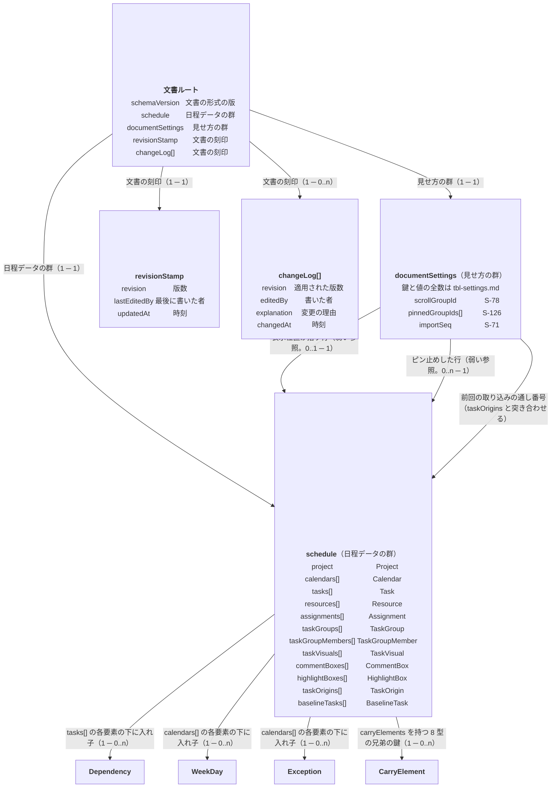

# データモデル — 概要（文書の全体像）

**UID**: DOC-FIG-ERD-OVERVIEW
**Version**: 0.3

> **本書は `_assets/source/erd.json` から `erd_json_to_md.py` が書き出す。手で直さない。**
> **直すのは `erd.json` である。** 説明の散文は `05-07-design.md` が持つ。

## 1. 文書の全体像

**Type**: SECTION

**図 F-010 — 文書の全体像**

