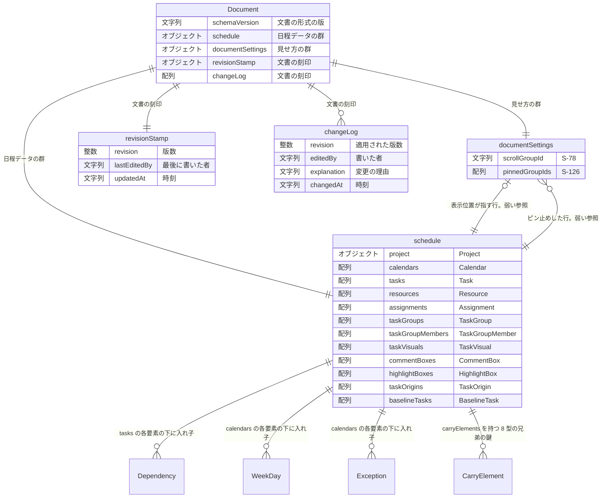

# データモデル — 概要（文書の全体像）

**UID**: DOC-FIG-ERD-OVERVIEW
**Version**: 0.3

> ⛔ **本書は生成物である。手で直さない —— 直しても次の `npm run gen` で消える。**
> **唯一の正は `_source/erd.json` であり、本書はそれを `_source/erd_json_to_md.py` が書き出したものである。**
> **作り直す**: `npm run gen` ／ **ズレを検出する**: `npm run gen:check`（検査 16 が呼ぶ）。説明の散文は `05-07-design.md` が持つ。

## 1. 文書の全体像

**Type**: SECTION

**図 F-010 — 文書の全体像**

