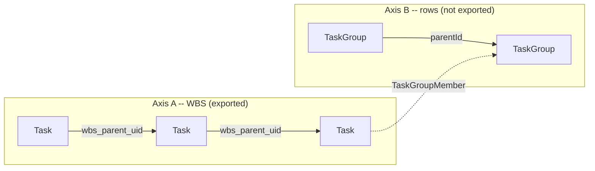

# 図 F-004 — 二つの軸

**UID**: DOC-FIG-TWO-AXES
**Version**: 0.1

**本書は 図 F-004 とその読み方だけを持つ。**

本書は `05-07-design.md` の Chapter 5.4 から参照される。

## 1. 図

**Type**: SECTION

**同じ `Task` が 2 つの木に属する。** 軸 A の親子は `Task` どうし、軸 B の親子は `TaskGroup` どうしであり、**交わるのは `TaskGroupMember` の 1 か所だけである。**

**図 F-004 — 二つの軸**

## 2. 読み方

**Type**: SECTION

| 軸 | 何の木か | 担う列 | 書き出すか |
| --- | --- | --- | --- |
| **軸 A** | 仕事の分解。外部の道具と共有する構造 | `Task.wbs_parent_uid`（`DM-2`） | **書き出す** |
| **軸 B** | 画面の行。1 つの行に複数のタスクを横並べするための器 | `TaskGroup`（表 T-304）と `TaskGroupMember`（表 T-305） | **書き出さない** |

**交点が 1 か所しかないことが、「行を動かしても分解が動かない」ことを構造として保証している。** 見た目の都合で行を並べ替えたことが、外部の道具へ書き出す構造に漏れない。

⚠️ **軸 B を軸 A に畳み込んではならない（MUST NOT）。** 1 つの行に複数のタスクを置くことが本製品の中核であり（`GL-001`）、行を分解の階層と同一視すると、**1 行に置けるタスクが 1 つに戻る。**

⚠️ **2 つの木は深さの規則も別である。** 軸 A は上限を持たず、軸 B の上限は `FR-004` が持つ。
