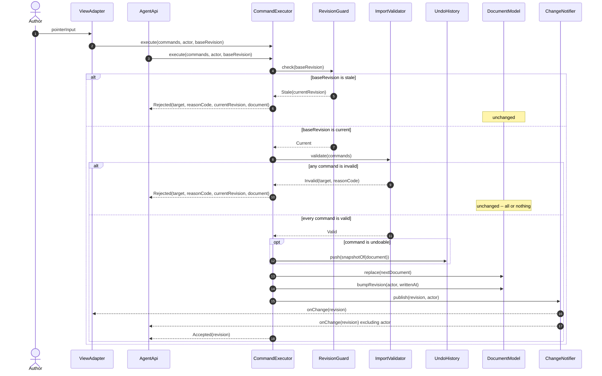

# 図 F-006 — 書き込みの経路

**UID**: DOC-FIG-WRITE-PATH
**Version**: 0.1

**本書は 図 F-006 とその読み方だけを持つ。** 順序の全数は `05-07-design.md` の 表 T-047 が持ち、**ここに順序を書かない（MUST NOT）。** 部品は同書の 表 T-046 が持つ。

本書は `05-07-design.md` の Chapter 5.2 から参照される。

## 1. 図

**Type**: SECTION

**人が画面から行う編集と、`Agent API` から行う編集は、同じ `CommandExecutor` を通る。** 通らない書き込みの経路は存在しない。

**図 F-006 — 書き込みの経路**

## 2. 読み方

**Type**: SECTION

| 図の要素 | 何を表すか | 定めている場所 |
| --- | --- | --- |
| `alt baseRevision is stale` | 申告された基準の版が古ければ、**文書を変えずに拒否して現在の文書を返す** | 表 T-035 の `AG-2` |
| `alt any command is invalid` | 一括の命令は**全部通るか、1 つも適用しないか**のどちらかである | 表 T-035 の `AG-3` |
| `Rejected(target, reasonCode, currentRevision, document)` | 拒否の値に、拒否された対象・理由の区分・現在の版数を含める | 表 T-035 の `AG-9a` |
| `opt command is undoable` | 取り消しの対象外の命令は、拒否せず実行するが履歴に積まない | 表 T-027 ／ 表 T-035 の `AG-10` |
| `push(snapshotOf(document))` が `replace` より前 | **取り消しは変更前の状態の複製で行う。** 置き換えた後では戻り先が取れない | 表 T-047 の `CX-3` |
| `onChange` から `excluding actor` | **自分の書き込みで自分が起きない** | 表 T-035 の `AG-6` |

⚠️ **`bumpRevision` と `publish` を `CommandExecutor` の外で行ってはならない（MUST NOT）。** 外で行える経路を 1 本でも作ると、**版数が上がったのに誰も知らない状態**が生まれ、`AG-2` の照合が当てにならなくなる。

⚠️ **`Author` から `ViewAdapter` への矢印と `AgentApi` からの矢印を、同時に起きるものとして読まないこと。** どちらか一方が起点であり、**どちらであっても以降の経路が同じである**ことを示すために並べてある。
