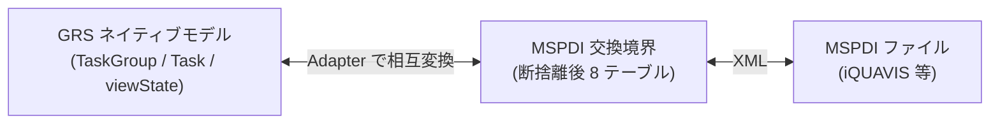
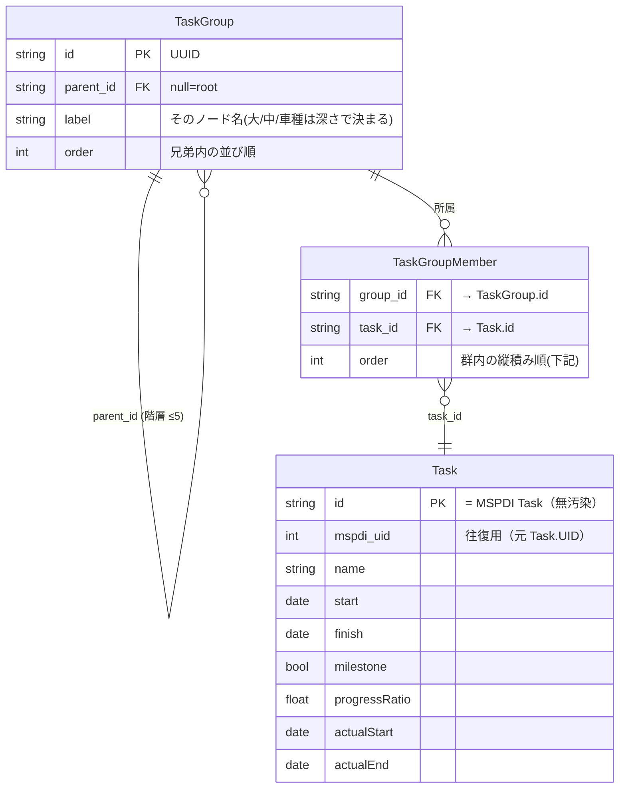

# GRS データモデル（MSPDI 断捨離からの再構築）

- 日付: 2026-07-25
- 位置づけ: **GRS ネイティブ・データモデルの設計中ドキュメント**。断捨離後の MSPDI サブセット（`../vendor/mspdi-tables.md`）を出発点に、GRS 固有の拡張を加えて組み直す。
- 方針: ゼロベース再構築（既存 PoC は参考に留め、**既存ファイルは変更しない**）。本書は設計ターゲットで、既存 `domain-model-class.md` / `schema.json` / `src/**` を上書きしない。
- 主言語 ja。識別子・コード・列名は英語 ASCII。

---

## 1. 2 層アーキテクチャ



- **ネイティブモデル**（本書）: アプリが編集・描画する本体。マルチバー・整列・視覚情報を一級で持つ。
- **MSPDI 交換境界**: `../vendor/mspdi-tables.md` の断捨離後 8 テーブル。Import/Export の契約。
- 両者は **Adapter** で写像。MSPDI 準拠は境界に閉じ込め、内部は軽量に保つ。

---

## 2. コア構造（確定）

**新設する GRS 固有エンティティは `TaskGroup`（＋ 所属を表す `TaskGroupMember`）のみ**。行の中身は MSPDI 由来の `Task` を**無汚染で継承**（GRS フィールドを一切足さない）。



```
TaskGroup       { id(UUID), parent_id FK→TaskGroup(null=root), label, order }   // 階層グルーピング（GRS 新設）
TaskGroupMember { group_id FK→TaskGroup, task_id FK→Task, order }               // 所属＋縦積み順（GRS 新設）
Task            { id, mspdi_uid, name, start, finish, milestone,                // = MSPDI Task（無汚染。階層フィールドは持たない）
                  progressRatio, actualStart, actualEnd, … }
viewState       { groupStates:{ [group_id]:{collapsed,height,color} }, zoom, … } // 表示状態は分離
```

- **依存の向き**: `TaskGroup / TaskGroupMember → Task`（GRS 拡張が MSPDI 核を参照）。逆は無い。`Task` は MSPDI のまま → export は Task をそのまま MSPDI Task に書き出すだけ（剥がす列ゼロ）。
- **マルチバー** = 1 つの `TaskGroup` に複数 Task が所属（`TaskGroupMember` が複数）。
- **並べ直し / 縦積み** = `TaskGroupMember.order`（下記）。

---

## 3. 用語

| GRS 用語 | 意味 | 出自 |
|---|---|---|
| `TaskGroup` | 行（タスクを束ねるグループ＋階層ノード。木で階層化） | **GRS 新設** |
| `TaskGroupMember` | どの Task がどの群に所属するか＋縦積み順 | **GRS 新設**（順序付き多対多） |
| `Task` | 群に載る日程要素（スパン or ◆マイルストーン） | MSPDI `Task` 継承（無汚染） |
| マルチバー | 1 群に複数 Task を横並べする**機能名** | 製品コンセプト |
| `viewState` | 表示状態（折り畳み・行高・色・ズーム） | GRS |

---

## 4. 確定した設計判断

### 4.1 どの群でも Task を載せられる（論点1 = 1b）

- どの `TaskGroup` も、子 `TaskGroup` を持ちつつ**自分自身に Task を所属させられる**。
- 理由: 入力データの階層は揃わない（あるタスクは Lv1、別は Lv3）。MSPDI のサマリタスクも**自分の日付=バーを持つ**（実質 1b）。
- 折り畳み: 群を畳むと子孫群を隠すが、その群自身の Task は残る（MSPDI サマリ折り畳みと同じ）。

### 4.2 ラベルは単一 `label` ＋ 木の深さ（論点2 = 2a）

- 各群は名前 `label` を 1 つ持つ。「大/中/小/車種」は `parent_id` の**木の深さ**で決まる（複数ラベル列は持たない）。正規化・5 段までスケール。

### 4.3 表示状態は `viewState` に group_id キーで分離（論点3 = 3b）

- `collapsed` / `height` / `color` は群（データ）に持たせず `viewState.groupStates[group_id]` に持つ。マージ時にデータだけ合流でき、UI 状態を引きずらない。

### 4.4 所属は順序付き中間テーブル `TaskGroupMember`（順序を明示）

- `Task` に `row_id`/`group_id` を**足さない**（MSPDI 核の汚染＋依存逆流を避ける）。所属は `TaskGroupMember{group_id, task_id, order}` で表す。
- **`order` の定義**: 群内で**時間が重なった Task の縦のスタック位置**（横位置は日付 start が支配、縦位置が order）。GRS の**自動縦積み**が既定値を計算し、ユーザーが上下を上書き可能。時間が重ならなければ order は無関係。
- JSON 配列位置に頼らず `order` を明示列で持つ（部分更新・マージに強い）。

### 4.5 階層は TaskGroup に一元化。MSPDI の Task-階層は境界専用

MSPDI は階層を **Task 上**（`OutlineLevel`＋document order から親を復元）で持つ＝**MSPDI の仕様**。GRS は階層を **TaskGroup 上**（`parent_id` の木）で持つ。**同じ階層を Adapter の両側で別表現**しているだけで、二重管理しなければ衝突しない。


- **Import**: MSPDI サマリタスク → `TaskGroup`、その葉の子タスク → その群の member Task（共通サマリ配下の葉が自動でマルチバーに）。`OutlineLevel` は群の深さに消費。
- **Export**: `TaskGroup` の木を深さ優先で並べ、`OutlineLevel`(=深さ)・`OutlineNumber`(=計算パス) を**再生成**。
- **GRS ネイティブの `Task` は `OutlineLevel` を保存しない**（保存すると TaskGroup の木＝真実 と二重管理になりドリフト＋マルチバーで別出自を1群に寄せた瞬間に食い違う）。必要なら read-only の「出自メモ」に留める（生きた階層ではない）。

| | 階層をどこに持つか | 誰の仕様 |
|---|---|---|
| 境界（b/c） | Task（`OutlineLevel`＋順序） | **MSPDI 仕様**。Adapter の入出力でのみ扱う |
| ネイティブ（d） | TaskGroup（`parent_id` 木） | **GRS の真実**。保存はこれ一本 |

### 4.6 階層の最大深さ

- **推奨 3 段（大・中・車種）、ハードキャップ 5 段**。UI/LOD は最大 5 段前提で設計（有界）。
- MSPDI import で 6 段以上: **5 段にクランプ＋警告トースト**（無警告クランプはしない）。

### 4.7 マージ（複数日程の合流）

- `TaskGroup` は UUID で安定識別。合流は label パスで突合 or 手動。
- `Task` は出自を保持できる想定（`source_id` 等、§5 で確定）。**Task は出自を持ち、TaskGroup は持たない**（群は合流先の器）。

### 4.8 ベースライン（変更前予定）

- インラインに持たない。**別ファイル baseline**（ScheduleDocument スナップショット・読取専用・id 突合でグレー下敷き）で「変更前予定グレー」を実現（P6 式）。

---

## 5. MSPDI データの5分類（Own / Consume / Reconstruct / Carry / Drop）

双方向 MSPDI 連携が必須のため、**情報欠落の最小化**を一級要件とする。MSPDI の全フィールドを「GRS がどう扱うか」で5分類し、**未分類をゼロにする**（＝逸脱の厳格チェック）。

判定リトマス: **「その列を読み飛ばしたら、GRS は復元不能な情報を失うか?」**

| 種別 | 意味 | import で読む? | GRS 保持 | export | 往復での欠落 |
|---|---|:--:|:--:|---|:--:|
| **Own** | 意味を理解し、同じ形で保持・編集する原本 | 読む | ○（同形） | 保存値を書く | なし |
| **Consume** | 読んで消費し、別の形（構造）で保持 | **読む（必須）** | ○（別形） | 構造から再生成 | なし |
| **Reconstruct** | 読まず、export で他 Own から組み直して出力 | **読まない** | ✗ | 部品から算出 | なし |
| **Carry** | 意味を理解しないが、往復のため不透明に温存（passthrough） | 読む | ○（不透明） | そのまま書き戻す | なし |
| **Drop** | 理解も保持もしない。捨てる | 読まない | ✗ | 書かない | **あり（要明示許容）** |

分類の軸: **理解する×保持する**（Own=理解+保持 / Reconstruct=理解+非保持 / Carry=非理解+保持 / Drop=非理解+非保持）。Consume は「理解+別形保持」で、Own の変形（構造化）。

### 各種の例

- **Own**: `Name`, `Start`, `Finish`, `Milestone`, `ActualStart`, `ActualFinish`, `progressRatio`(←PercentComplete), `Deadline`, `Notes`, `mspdi_uid`(←UID), 稼働日(Calendar), `StatusDate`
- **Consume**: `OutlineLevel`(→TaskGroup 木), `PredecessorLink`(→依存エッジ) — 読まないと階層/依存が失われる=必読
- **Reconstruct**: `OutlineNumber`, `ID`, `Summary`, `Duration`, `ActualDuration`, `RemainingDuration`, `PercentComplete` — 冗長。他 Own から復元可
- **Carry**: `Type`, `Work`, `DurationFormat`, `ConstraintType/Date`(未使用時), コスト/EVM 列, 未モデル化の Resource/Assignment 詳細
- **Drop**: 原則ゼロ。明示的に「捨てる」と宣言した項目のみ

### 欠落最小化 = Drop を最小化

- **損失は Drop でのみ発生**。Own/Consume/Reconstruct/Carry は無損失。
- **Carry = passthrough を実装**（以前の案c「枠だけ予約」→ 案b「実際に温存・再放出」へ格上げ）。GRS が理解しない MSPDI 要素をまるごと温存し、export で書き戻す → 未編集往復は無損失。
- **round-trip 同一性テスト**（CI）: サンプル MSPDI を import→export し、原 XML と差分ゼロ（未編集時）を検証。Reconstruct の算出ミス・Drop の欠落を機械検出。

### 正規形と発行（派生値の書くタイミング）

- **正規 JSON**（編集・autosave）= Own / Consume の保持分＋Carry のみ。**Reconstruct 値は持たない**（ドリフト防止）。
- **MSPDI 発行**（export）= Reconstruct 値を**その場で計算して焼き込む**（MSPDI は自己完結スナップショットの思想。iQUAVIS 等の素朴な読み手のため、Duration/OutlineNumber 等も計算して出力する＝安全側）。
- → 「派生を保存しない（ドリフトなし）」と「MSPDI は自己完結（派生を出す）」は**別成果物なので両立**。

---

## 6. iQUAVIS 双方向往復と WBS 保全（明示編集の定義）

主要ユースケース: **iQUAVIS（構造マスタ） → MSPDI export → GRS で編集 → MSPDI import → iQUAVIS**。この往復で iQUAVIS の WBS（`OutlineLevel`/`OutlineNumber`）を壊さないための規約。

### 往復処理の3原則

1. **突合は `UID`**: iQUAVIS は再インポートを **UID で照合**する。GRS は UID（`mspdi_uid`=Own）を**不変で保持**し、そのまま書き戻す。**OutlineNumber を突合キーにしない**（UID を振り直すと別タスク扱い＝DB 崩壊）。
2. **`OutlineNumber` は iQUAVIS が再計算**: `OutlineLevel`＋順序から導かれる**派生コード**。iQUAVIS は構造から計算し直すべきで、GRS の出力値を権威としない（GRS 側は Reconstruct）。「OutlineNumber の変更」は独立データではなく構造変更の結果。
3. **`OutlineLevel` は既定で保全**: GRS が**明示的に WBS を編集した節のみ**再生成して伝播。マルチバー等の**視覚操作では変えない**。

### 明示編集 vs 視覚操作（UI カタログ）

| UI 操作 | 何が変わる | WBS（OutlineLevel/順序） | iQUAVIS へ伝播? |
|---|---|---|:--:|
| インデント（Tab） | 直前行の子にする | OutlineLevel +1 | ○ 明示編集 |
| アウトデント（Shift+Tab） | 親を1段上げる | OutlineLevel −1 | ○ 明示編集 |
| 行を別の親へドラッグ（ツリー上） | 親を変える | OutlineLevel＋順序 | ○ 明示編集 |
| アウトラインで行を上下（兄弟並べ替え） | 兄弟の順序 | OutlineNumber（順序） | ○ 明示編集 |
| **バーを別レーンへドラッグ（マルチバー化）** | 表示レーン | **変わらない** | ✗ 視覚のみ |
| 群の折り畳み/展開・行高・色 | 表示状態 | 変わらない | ✗ viewState |
| バーを横ドラッグ | 日付 | （Own の日付） | ○ 日付として（WBS 編集ではない） |

**判定ルール**: 「**親子関係 or 兄弟順（＝WBS 構造）を変えたか?**」→ Yes（インデント/アウトデント/親変更/兄弟並べ替え）＝明示編集＝伝播 / No（バーのレーン移動=マルチバー、折り畳み、色）＝視覚のみ＝非伝播。

### 具体シナリオ

```
iQUAVIS: 車種A > 設計(L2) > 部品X(L3)

【視覚操作のみ】設計と部品X のバーを車種A行にマルチバー横並べ
  → WBS は不変。export の OutlineLevel も不変。iQUAVIS は構造変更を受けない。◎ 安全

【明示編集】部品X をアウトデント(L3→L2、設計の兄弟へ)
  → export で 部品X の OutlineLevel=2。iQUAVIS が UID 照合で設計の兄弟に再親付け。◎ 意図どおり伝播
```

### 構造上の含意（§2 / §4.5 の精緻化）

- **WBS 階層**（`OutlineLevel` が対応・明示編集でのみ伝播）と **マルチバー**（視覚・GRS 専用・export に出さない）は**別軸**。
- §4.5「フラット化許容」を精緻化: **フラット化は明示的 WBS 編集の時だけ**。マルチバー（バーのレーン移動）では `OutlineLevel` は不変。
- マルチバー用 `TaskGroup` は **export に出さない**（GRS 専用の視覚層）。iQUAVIS はマルチバーを知らない。

---

## 7. 未確定（次に詰める）

- **モデルの2軸整理（§2 見直し）**: §6 の帰結として、**WBS 階層**（`OutlineLevel` 対応・明示編集で伝播・MSPDI へ出す）と **マルチバー視覚層**（`TaskGroup`・GRS 専用・export に出さない）は**別軸**。§2 の「TaskGroup＝階層 単一」を、この2軸（WBS ツリー ＋ マルチバー視覚グルーピング）へ整理し直す。WBS ツリーの保持形（`Task.wbs_parent` 隣接リスト等）と、マルチバーの所属形を確定する。
- **Task の中身**: MSPDI Task から継承する内容列（start/finish/duration/milestone/actualStart/actualEnd/progressRatio/deadline/notes 等）。※階層列（OutlineLevel/OutlineNumber/Summary）は持たない（§4.5）。
- **GRS 固有の視覚**: 略称 `abbrev` / アイコン形 / 色 / labelPosition / importance 等（MSPDI に無い）。どこに持つか（Task に足すと MSPDI 汚染 → 別テーブル `TaskVisual{task_id, …}` に分離する案が有力）。
- **round-trip 忠実度**: 異なる MSPDI 階層の Task を GRS で同一群に入れた場合の export 挙動（フラット化 or 出自保持）。
- **依存（Dependency）**: MSPDI `PredecessorLink` を GRS でどう持つか（自動配線＝コアドメイン、9 点アンカー・折れ点）。Task 間参照なので TaskGroup とは独立。
- **Calendar / Resource / Assignment**: 断捨離 8 テーブルには残したが、GRS ネイティブで一級に持つか、Import 時のみ扱うか。
- **Section / annotation / 透かし / i18n** 等の周辺。

---

## 参照

- 断捨離後 MSPDI サブセット・全項目要否: `../vendor/mspdi-tables.md`
- MSPDI 断捨離の経緯・ERD: `../vendor/mspdi-declutter-erd-ja.md`
- MSPDI 解説（ツリー・依存・マイルストーン・マルチバーの正体）: `../vendor/mspdi-core-tree.md`
