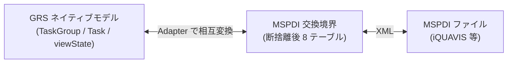
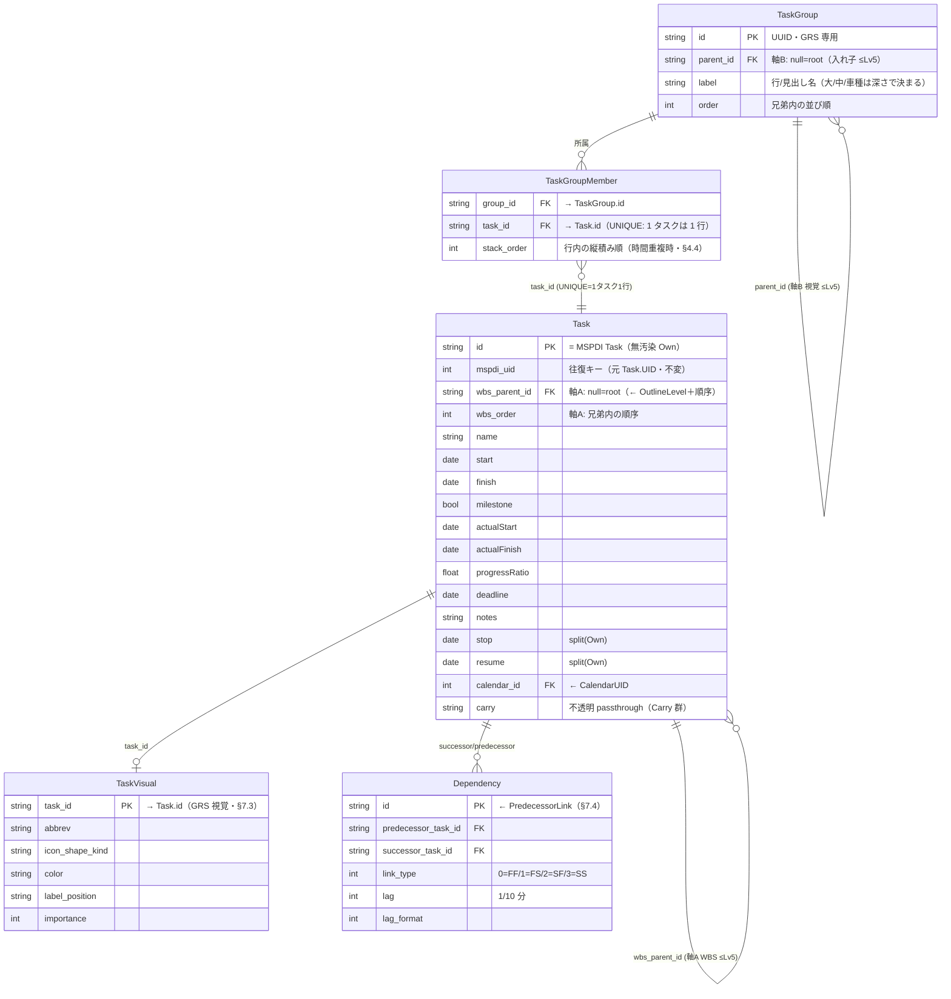

# GRS データモデル（MSPDI 断捨離からの再構築）

- 日付: 2026-07-25
- 位置づけ: **GRS ネイティブ・データモデルの設計中ドキュメント**。断捨離後の MSPDI サブセット（`../vendor/mspdi-tables.md`）を出発点に、GRS 固有の拡張を加えて組み直す。
- 方針: ゼロベース再構築（既存 PoC は参考に留め、**既存ファイルは変更しない**）。本書は設計ターゲットで、既存 `domain-model-class.md` / `schema.json` / `src/**` を上書きしない。
- 主言語 ja。識別子・コード・列名は英語 ASCII。

---

## 1. 2 層アーキテクチャ



- **ネイティブモデル**（本書）: アプリが編集・描画する本体。マルチバー・整列・視覚情報を一級で持つ。
- **MSPDI 交換境界**: `../vendor/mspdi-tables.md` の断捨離後 8 テーブル。Import/Export の契約。
- 両者は **Adapter** で写像。MSPDI 準拠は境界に閉じ込め、内部は軽量に保つ。

---

## 2. コア構造（確定）— 2 軸

GRS は階層を **2 つの独立した軸**で持つ（§6 の帰結。§7.1 で確定。旧 §4.5「TaskGroup に階層一元化」は**これで置換**）。

- **軸A: WBS 構造ツリー** — MSPDI `OutlineLevel` に対応。**`Task.wbs_parent_id`（隣接リスト）**で保持し、iQUAVIS へ **export する**。**明示的 WBS 編集のみ伝播**（§6）。深さ ≤ **Lv5**。
- **軸B: マルチバー視覚層** — 「1 行に複数タスク」を実現する**器**。**`TaskGroup`（入れ子 ≤Lv5）＋ `TaskGroupMember`**。**GRS 専用・export に出さない**。

両軸は**独立**。行に入れ直しても（軸B）WBS（軸A）は動かない。**`OutlineLevel` を `TaskGroup` から算出しない**（軸A の `Task.wbs_parent` が唯一の真実）ため、2 木があってもドリフトしない。行の器（TaskGroup）は MSPDI に対応概念が無い唯一の GRS 追加。



```
Task            { id, mspdi_uid, wbs_parent_id FK→Task(null=root), wbs_order,     // 軸A: WBS は Task 上（往復の真実）
                  name, start, finish, milestone, actualStart, actualFinish,      // Own（MSPDI Task 無汚染継承）
                  progressRatio, deadline, notes, stop, resume, calendar_id, carry }
TaskGroup       { id(UUID), parent_id FK→TaskGroup(null=root), label, order }      // 軸B: 行の器（GRS 専用・非export・≤Lv5）
TaskGroupMember { group_id FK→TaskGroup, task_id FK→Task(UNIQUE), stack_order }    // 軸B: 所属＋縦積み順
TaskVisual      { task_id FK→Task, abbrev, icon_shape_kind, color, … }             // GRS 視覚列（Task 汚染回避・§7.3）
Dependency      { id, predecessor_task_id, successor_task_id, link_type, lag, … }  // 依存エッジ（§7.4）
viewState       { groupStates:{ [group_id]:{collapsed,height,color} }, routes, zoom, … } // 表示状態は分離（§4.3）
```

- **依存の向き**: `TaskGroup / TaskGroupMember / TaskVisual / Dependency → Task`（GRS 拡張が MSPDI 核を参照）。逆は無い。`Task` は MSPDI Own のまま → **export は WBS 木を辿って MSPDI Task を再生成**（TaskGroup 等の GRS 層は落とす）。
- **マルチバー（1 行に複数タスク）** = 1 つの `TaskGroup`（＝行の器）に複数 Task を `TaskGroupMember` で入れる。**視覚のみ・非 export・WBS 不変**（§6 を自動で満たす）。
- **並べ直し / 縦積み** = `TaskGroupMember.stack_order`（§4.4）。**1 タスクは 1 行**（`task_id` UNIQUE）。どの行にも入っていない Task は自分の既定行に描画。

---

## 3. 用語

| GRS 用語 | 意味 | 出自 | 軸 |
|---|---|---|---|
| `Task` | 日程要素（スパン or ◆マイルストーン）。**WBS 親 `wbs_parent_id` を持つ** | MSPDI `Task` 継承（無汚染 Own） | 軸A |
| `Task.wbs_parent_id` | WBS 構造ツリーの親（`OutlineLevel` 対応・**export する**） | MSPDI `OutlineLevel` を Consume | 軸A |
| `TaskGroup` | **行の器**（タスクを入れる。入れ子 ≤Lv5）。**export しない** | **GRS 新設** | 軸B |
| `TaskGroupMember` | どの Task がどの行に入るか＋縦積み順（1 タスク 1 行） | **GRS 新設**（順序付き所属） | 軸B |
| マルチバー | 1 行に複数 Task を横並べする**機能名**（視覚のみ・非 export） | 製品コンセプト | 軸B |
| `TaskVisual` | GRS 固有の視覚列（略称/アイコン/色…）。Task と分離 | GRS 新設（§7.3） | — |
| `Dependency` | 依存エッジ（task↔task）。`PredecessorLink` を Consume | MSPDI 由来（§7.4） | — |
| `viewState` | 表示状態（折り畳み・行高・色・依存線経路・ズーム） | GRS | — |

---

## 4. 確定した設計判断

### 4.1 どの群でも Task を載せられる（論点1 = 1b）

- どの `TaskGroup` も、子 `TaskGroup` を持ちつつ**自分自身に Task を所属させられる**。
- 理由: 入力データの階層は揃わない（あるタスクは Lv1、別は Lv3）。MSPDI のサマリタスクも**自分の日付=バーを持つ**（実質 1b）。
- 折り畳み: 群を畳むと子孫群を隠すが、その群自身の Task は残る（MSPDI サマリ折り畳みと同じ）。

### 4.2 ラベルは単一 `label` ＋ 木の深さ（論点2 = 2a）

- 各群は名前 `label` を 1 つ持つ。「大/中/小/車種」は `parent_id` の**木の深さ**で決まる（複数ラベル列は持たない）。正規化・5 段までスケール。

### 4.3 表示状態は `viewState` に group_id キーで分離（論点3 = 3b）

- `collapsed` / `height` / `color` は群（データ）に持たせず `viewState.groupStates[group_id]` に持つ。マージ時にデータだけ合流でき、UI 状態を引きずらない。

### 4.4 所属は順序付き中間テーブル `TaskGroupMember`（順序を明示）

- `Task` に `row_id`/`group_id` を**足さない**（MSPDI 核の汚染＋依存逆流を避ける）。所属は `TaskGroupMember{group_id, task_id, stack_order}` で表す。**`task_id` は UNIQUE＝1 タスクは高々 1 行**（器に入っていなければ自分の既定行に描画）。
- **`stack_order` の定義**: 行内で**時間が重なった Task の縦のスタック位置**（横位置は日付 start が支配、縦位置が stack_order）。GRS の**自動縦積み**が既定値を計算し、ユーザーが上下を上書き可能。時間が重ならなければ stack_order は無関係。
- JSON 配列位置に頼らず `stack_order` を明示列で持つ（部分更新・マージに強い）。

### 4.5 【§7.1 で置換】WBS 階層は Task、視覚グルーピングは TaskGroup（2 軸）

> ⚠️ **本節の旧判断「階層は TaskGroup に一元化・Task は階層を持たない」は §7.1（§2 の 2 軸化）で置換された。** 以下は経緯として残す。確定版は §2 / §7.1 を見よ。

**確定版（§2）**: WBS 構造ツリー（`OutlineLevel` 対応・**export する**）は **`Task.wbs_parent_id`** に持つ＝**軸A・唯一の真実**。`TaskGroup` は**行の器＝視覚グルーピング専用（非 export）＝軸B**。両者は独立で、`OutlineLevel` を `TaskGroup` から算出しないためドリフトしない。

**旧判断（置換前・経緯）**: MSPDI は階層を **Task 上**（`OutlineLevel`＋document order から親を復元）で持つ＝**MSPDI の仕様**。旧案は GRS 階層を **TaskGroup 上**（`parent_id` の木）に一元化しようとしたが、§6 の UI カタログ（左カラム indent＝WBS 編集＝伝播 / バー移動＝視覚のみ＝非伝播）と突き合わせた結果、**WBS は Task 側に持ち、TaskGroup は純視覚**とするのが整合的と確定した（§7.1）。


- **Import**: MSPDI サマリタスク → `TaskGroup`、その葉の子タスク → その群の member Task（共通サマリ配下の葉が自動でマルチバーに）。`OutlineLevel` は群の深さに消費。
- **Export**: `TaskGroup` の木を深さ優先で並べ、`OutlineLevel`(=深さ)・`OutlineNumber`(=計算パス) を**再生成**。
- **GRS ネイティブの `Task` は `OutlineLevel` を保存しない**（保存すると TaskGroup の木＝真実 と二重管理になりドリフト＋マルチバーで別出自を1群に寄せた瞬間に食い違う）。必要なら read-only の「出自メモ」に留める（生きた階層ではない）。

| | 階層をどこに持つか | 誰の仕様 |
|---|---|---|
| 境界（b/c） | Task（`OutlineLevel`＋順序） | **MSPDI 仕様**。Adapter の入出力でのみ扱う |
| ネイティブ（d） | TaskGroup（`parent_id` 木） | **GRS の真実**。保存はこれ一本 |

### 4.6 階層の最大深さ

- **推奨 3 段（大・中・車種）、ハードキャップ 5 段**。UI/LOD は最大 5 段前提で設計（有界）。
- MSPDI import で 6 段以上: **5 段にクランプ＋警告トースト**（無警告クランプはしない）。

### 4.7 マージ（複数日程の合流）

- `TaskGroup` は UUID で安定識別。合流は label パスで突合 or 手動。
- `Task` は出自を保持できる想定（`source_id` 等、§5 で確定）。**Task は出自を持ち、TaskGroup は持たない**（群は合流先の器）。

### 4.8 ベースライン（変更前予定）

- インラインに持たない。**別ファイル baseline**（ScheduleDocument スナップショット・読取専用・id 突合でグレー下敷き）で「変更前予定グレー」を実現（P6 式）。

---

## 5. MSPDI データの5分類（Own / Consume / Reconstruct / Carry / Drop）

双方向 MSPDI 連携が必須のため、**情報欠落の最小化**を一級要件とする。MSPDI の全フィールドを「GRS がどう扱うか」で5分類し、**未分類をゼロにする**（＝逸脱の厳格チェック）。

判定リトマス: **「その列を読み飛ばしたら、GRS は復元不能な情報を失うか?」**

| 種別 | 意味 | import で読む? | GRS 保持 | export | 往復での欠落 |
|---|---|:--:|:--:|---|:--:|
| **Own** | 意味を理解し、同じ形で保持・編集する原本 | 読む | ○（同形） | 保存値を書く | なし |
| **Consume** | 読んで消費し、別の形（構造）で保持 | **読む（必須）** | ○（別形） | 構造から再生成 | なし |
| **Reconstruct** | 読まず、export で他 Own から組み直して出力 | **読まない** | ✗ | 部品から算出 | なし |
| **Carry** | 意味を理解しないが、往復のため不透明に温存（passthrough） | 読む | ○（不透明） | そのまま書き戻す | なし |
| **Drop** | 理解も保持もしない。捨てる | 読まない | ✗ | 書かない | **あり（要明示許容）** |

分類の軸: **理解する×保持する**（Own=理解+保持 / Reconstruct=理解+非保持 / Carry=非理解+保持 / Drop=非理解+非保持）。Consume は「理解+別形保持」で、Own の変形（構造化）。

### 各種の例

- **Own**: `Name`, `Start`, `Finish`, `Milestone`, `ActualStart`, `ActualFinish`, `progressRatio`(←PercentComplete), `Deadline`, `Notes`, `mspdi_uid`(←UID), 稼働日(Calendar), `StatusDate`
- **Consume**: `OutlineLevel`(→TaskGroup 木), `PredecessorLink`(→依存エッジ) — 読まないと階層/依存が失われる=必読
- **Reconstruct**: `OutlineNumber`, `ID`, `Summary`, `Duration`, `ActualDuration`, `RemainingDuration`, `PercentComplete` — 冗長。他 Own から復元可
- **Carry**: `Type`, `Work`, `DurationFormat`, `ConstraintType/Date`(未使用時), コスト/EVM 列, 未モデル化の Resource/Assignment 詳細
- **Drop**: 原則ゼロ。明示的に「捨てる」と宣言した項目のみ

### 欠落最小化 = Drop を最小化

- **損失は Drop でのみ発生**。Own/Consume/Reconstruct/Carry は無損失。
- **Carry = passthrough を実装**（以前の案c「枠だけ予約」→ 案b「実際に温存・再放出」へ格上げ）。GRS が理解しない MSPDI 要素をまるごと温存し、export で書き戻す → 未編集往復は無損失。
- **round-trip 同一性テスト**（CI）: サンプル MSPDI を import→export し、原 XML と差分ゼロ（未編集時）を検証。Reconstruct の算出ミス・Drop の欠落を機械検出。

### 正規形と発行（派生値の書くタイミング）

- **正規 JSON**（編集・autosave）= Own / Consume の保持分＋Carry のみ。**Reconstruct 値は持たない**（ドリフト防止）。
- **MSPDI 発行**（export）= Reconstruct 値を**その場で計算して焼き込む**（MSPDI は自己完結スナップショットの思想。iQUAVIS 等の素朴な読み手のため、Duration/OutlineNumber 等も計算して出力する＝安全側）。
- → 「派生を保存しない（ドリフトなし）」と「MSPDI は自己完結（派生を出す）」は**別成果物なので両立**。

---

## 6. iQUAVIS 双方向往復と WBS 保全（明示編集の定義）

主要ユースケース: **iQUAVIS（構造マスタ） → MSPDI export → GRS で編集 → MSPDI import → iQUAVIS**。この往復で iQUAVIS の WBS（`OutlineLevel`/`OutlineNumber`）を壊さないための規約。

### 往復処理の3原則

1. **突合は `UID`**: iQUAVIS は再インポートを **UID で照合**する。GRS は UID（`mspdi_uid`=Own）を**不変で保持**し、そのまま書き戻す。**OutlineNumber を突合キーにしない**（UID を振り直すと別タスク扱い＝DB 崩壊）。
2. **`OutlineNumber` は iQUAVIS が再計算**: `OutlineLevel`＋順序から導かれる**派生コード**。iQUAVIS は構造から計算し直すべきで、GRS の出力値を権威としない（GRS 側は Reconstruct）。「OutlineNumber の変更」は独立データではなく構造変更の結果。
3. **`OutlineLevel` は既定で保全**: GRS が**明示的に WBS を編集した節のみ**再生成して伝播。マルチバー等の**視覚操作では変えない**。

### 明示編集 vs 視覚操作（UI カタログ）

| UI 操作 | 何が変わる | WBS（OutlineLevel/順序） | iQUAVIS へ伝播? |
|---|---|---|:--:|
| インデント（Tab） | 直前行の子にする | OutlineLevel +1 | ○ 明示編集 |
| アウトデント（Shift+Tab） | 親を1段上げる | OutlineLevel −1 | ○ 明示編集 |
| 行を別の親へドラッグ（ツリー上） | 親を変える | OutlineLevel＋順序 | ○ 明示編集 |
| アウトラインで行を上下（兄弟並べ替え） | 兄弟の順序 | OutlineNumber（順序） | ○ 明示編集 |
| **バーを別レーンへドラッグ（マルチバー化）** | 表示レーン | **変わらない** | ✗ 視覚のみ |
| 群の折り畳み/展開・行高・色 | 表示状態 | 変わらない | ✗ viewState |
| バーを横ドラッグ | 日付 | （Own の日付） | ○ 日付として（WBS 編集ではない） |

**判定ルール**: 「**親子関係 or 兄弟順（＝WBS 構造）を変えたか?**」→ Yes（インデント/アウトデント/親変更/兄弟並べ替え）＝明示編集＝伝播 / No（バーのレーン移動=マルチバー、折り畳み、色）＝視覚のみ＝非伝播。

### 具体シナリオ

```
iQUAVIS: 車種A > 設計(L2) > 部品X(L3)

【視覚操作のみ】設計と部品X のバーを車種A行にマルチバー横並べ
  → WBS は不変。export の OutlineLevel も不変。iQUAVIS は構造変更を受けない。◎ 安全

【明示編集】部品X をアウトデント(L3→L2、設計の兄弟へ)
  → export で 部品X の OutlineLevel=2。iQUAVIS が UID 照合で設計の兄弟に再親付け。◎ 意図どおり伝播
```

### 構造上の含意（§2 / §4.5 の精緻化）

- **WBS 階層**（`OutlineLevel` が対応・明示編集でのみ伝播）と **マルチバー**（視覚・GRS 専用・export に出さない）は**別軸**。
- §4.5「フラット化許容」を精緻化: **フラット化は明示的 WBS 編集の時だけ**。マルチバー（バーのレーン移動）では `OutlineLevel` は不変。
- マルチバー用 `TaskGroup` は **export に出さない**（GRS 専用の視覚層）。iQUAVIS はマルチバーを知らない。

---

## 7. 詳細設計（確定）

前セッションで骨格（§1-§6）確定。本節は §7 未確定項目を確定する。

### 7.1 モデルの 2 軸（確定）

§2 に反映済み。要点:

- **軸A: WBS 構造ツリー = `Task.wbs_parent_id`（隣接リスト）**。`OutlineLevel`＋document order を Consume して構築。**export で `OutlineLevel`/`OutlineNumber`/`Summary`/`ID` を再生成**。明示的 WBS 編集（indent/outdent/親変更/兄弟並べ替え）でのみ伝播（§6）。深さ ≤ **Lv5**、import で 6 段以上は 5 段クランプ＋警告（§4.6）。
- **軸B: マルチバー視覚層 = `TaskGroup`（parent_id で入れ子 ≤Lv5）＋ `TaskGroupMember`**。行の器。**GRS 専用・非 export**。「1 行に複数タスク」＝ 1 器に複数 member。行に入れ直しても WBS 不変（視覚のみ・非伝播）。
- **保持形の確定**: 軸A は**隣接リスト**（`wbs_parent_id` + `wbs_order`）を採用（`OutlineLevel` の数値を保存すると木と二重管理になるため保存しない＝Reconstruct）。軸B は `TaskGroup` の木（`parent_id` + `order`）。両軸は独立、`OutlineLevel` を `TaskGroup` から導出しない（ドリフト構造的にゼロ）。
- **import 時の器の初期化（既定ポリシー）**: WBS サマリ配下の葉タスク群を、そのサマリに対応する `TaskGroup` の member として自動投入（＝「共通サマリ配下がそのまま 1 行のマルチバー」の初期姿）。以降ユーザーが器を自由に再編。器の再編は WBS を変えない。

### 7.2 split（Stop/Resume）・制約（ConstraintType/Date）の確定

| MSPDI | 確定 | 理由 |
|---|---|---|
| `Stop` / `Resume` | **Own（単一中断区間）** | 中断バー（1 本が割れる）は日程表の実描画要素。1 組で「1 回の中断」を素朴に保持。多重 split の厳密形（`TimephasedData` の作業ゼロ区間）は **Carry**（MVP は多重 split を描かず温存）。 |
| `ConstraintType` / `ConstraintDate` | **Carry** | GRS は明示日付（`start`/`finish` = Own）で位置決めし、制約はソルバ用ヒント＝GRS 非使用。往復のため不透明温存（Drop にしない）。 |

### 7.3 Task の中身（Own 列）と GRS 視覚（TaskVisual）

**Task（Own・MSPDI Task 無汚染継承）**:
`id`, `mspdi_uid`(←UID), `name`, `start`, `finish`, `milestone`, `actualStart`, `actualFinish`, `progressRatio`(←PercentComplete/100), `deadline`, `notes`, `stop`, `resume`(§7.2), `calendar_id`(←CalendarUID), `wbs_parent_id`/`wbs_order`(軸A), `carry`(不透明 passthrough)。

**Task が持たない列（Reconstruct・export でその場算出）**: `ID`, `OutlineLevel`, `OutlineNumber`, `Summary`, `Duration`, `ActualDuration`, `RemainingDuration`, `PercentComplete`（§5）。

**GRS 視覚は別テーブル `TaskVisual` に分離（確定）**— Task 汚染を避け、export 対象外を明確化:
`TaskVisual { task_id FK→Task, abbrev, icon_shape_kind, color, label_position, importance }`。MSPDI に対応が無いため **GRS JSON にのみ存在・非 export**。命名は言霊（`kind`→`icon_shape_kind` 等・item60）。

### 7.4 依存（Dependency）＝ コアドメイン自動配線

- **データ**: `Dependency { id, predecessor_task_id, successor_task_id, link_type(0=FF/1=FS/2=SF/3=SS), lag(1/10分), lag_format }`。MSPDI `PredecessorLink`（後続 Task 下・`PredecessorUID` で先行を指す）を **Consume** して task↔task の一級エッジへ。**TaskGroup / 軸B とは独立**（依存は WBS でも器でもなく Task 間の関係）。
- **export**: 各後続 Task 直下に `PredecessorLink` を再生成（`mspdi_uid` で id↔UID 解決）。`CrossProject`/`CrossProjectName` は Carry（MVP 単一 PJ）。
- **経路（描画・GRS 専用・非 export）**: 9 点アンカー（バー上の 3×3 グリッド 0-8）から引出し、他アイコンとの重なり最小の折れ点 0〜3 の経路を**自動配線**（コアドメイン）。既定はエンジンが算出し、ユーザー上書きを永続化:
  `viewState.routes[dependency_id] = { from_anchor:0-8, to_anchor:0-8, bends:[{x,y}…], manual_override:bool }`。MSPDI は線の幾何を持たないので **route は export しない**（依存の論理は `PredecessorLink` で往復、幾何は GRS 内のみ）。

### 7.5 Calendar / Resource / Assignment のネイティブ vs Carry（確定）

| クラスタ | 確定 | 理由・GRS の扱い |
|---|---|---|
| **Calendar** | **ネイティブ軽量（Own/Consume）** | GRS は稼働日粒度で描画（週末・祝日のグレー、稼働日での期間換算）＝**理解が必須**。`Calendar{id,name,is_base,base_calendar_id}` + `WeekDay{day_type,day_working}` + `Exception{name,from_date,to_date,day_working}` を Own。`Task.calendar_id`/`Project.CalendarUID` = Consume。勤務時刻 `WorkingTime`・`WorkWeek`・繰返し詳細は **Carry**（日粒度で不使用・温存で Drop=0）。 |
| **Resource** | **Carry（丸ごと passthrough）** | 資源管理（コスト/EVM/平準化）は非対象（CLAUDE.md ドメイン境界）。`UID`=Own（往復識別）、`ID`=Reconstruct（順序）、**他全列 Carry**。任意で `Name`/`Initials` を**読取専用の担当ラベル**として表示に流用（編集不可・真実は Carry 側）。 |
| **Assignment** | **Carry（丸ごと passthrough）** | 同上。`UID`=Own、`TaskUID`/`ResourceUID` は関係として温存、**他全列＋201 `f404xxx` 予約枠 Carry**。担当ラベルは Assignment→Resource から読取専用で導出可。 |

→ 台帳（field-ledger）の「条件付き Consume/Carry」は本節で確定: **Calendar=ネイティブ / Resource・Assignment=Carry**。

### 7.6 round-trip 忠実度（異 WBS タスクを同一行に入れた場合）

- **出自保持（フラット化しない）**。`TaskGroup` は視覚のみで各 Task の `wbs_parent` を触らないため、別々の WBS 枝のタスクを 1 行の器に混ぜても、**export は各 Task を自分の WBS 位置で出す**。器（TaskGroup）は落ちるので iQUAVIS は通常の WBS だけを受け取る（マルチバーの混在を知らない）。→ **§6 の非伝播原則を構造的に保証**。
- 未編集往復は無損失（§5 の round-trip 同一性テストで機械検証）。

### 7.7 台帳完成と Drop=0

- `grs-mspdi-field-ledger-ja.md` を XSD 実名で完成（Resource 75 列・Assignment 65 列＋201 予約枠を全分類）。§7.2/§7.5 の確定を反映。
- **Drop=0 を XSD 突合で検証**（未分類ゼロ・敵対的レビュー）。結果は台帳末尾に記録。

---

## 8. 残課題（周辺・後続）

- **Section / annotation / 透かし / i18n** 等の描画・製品層（本データモデルの外周。別途 40-data-format と i18n 仕様で扱う）。
- **Carry passthrough の実装**（案b）と **round-trip 同一性テスト**の CI 組込み（§5）。
- 本 2 軸確定を **change-manager 経由で正式仕様（40-data-format.sdoc / schema.json）へ反映**（旧 DEC-006・grs-table-erd-comparison は破棄・§4.5 は §7.1 で置換）。凍結中の既存 GRS 資産は本設計を承認後に更新。

---

## 参照

- 断捨離後 MSPDI サブセット・全項目要否: `../vendor/mspdi-tables.md`
- MSPDI 断捨離の経緯・ERD: `../vendor/mspdi-declutter-erd-ja.md`
- MSPDI 解説（ツリー・依存・マイルストーン・マルチバーの正体）: `../vendor/mspdi-core-tree.md`
