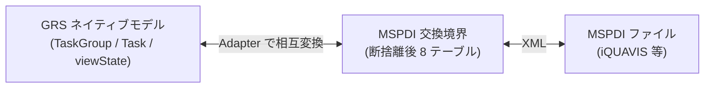
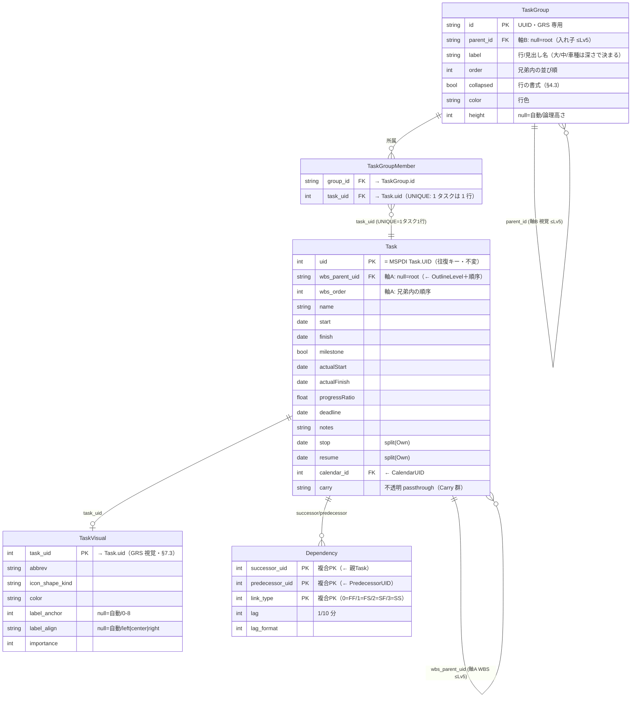

# GRS データモデル（MSPDI 断捨離からの再構築）

- 日付: 2026-07-25
- 位置づけ: **GRS ネイティブ・データモデルの設計中ドキュメント**。断捨離後の MSPDI サブセット（`../vendor/mspdi-tables.md`）を出発点に、GRS 固有の拡張を加えて組み直す。
- 方針: ゼロベース再構築（既存 PoC は参考に留め、**既存ファイルは変更しない**）。本書は設計ターゲットで、既存 `domain-model-class.md` / `schema.json` / `src/**` を上書きしない。
- 主言語 ja。識別子・コード・列名は英語 ASCII。

---

## 1. 2 層アーキテクチャ



- **ネイティブモデル**（本書）: アプリが編集・描画する本体。マルチバー・整列・視覚情報を一級で持つ。
- **MSPDI 交換境界**: `../vendor/mspdi-tables.md` の断捨離後 8 テーブル。Import/Export の契約。
- 両者は **Adapter** で写像。MSPDI 準拠は境界に閉じ込め、内部は軽量に保つ。

---

## 2. コア構造（確定）— 2 軸

GRS は階層を **2 つの独立した軸**で持つ（§6 の帰結。§7.1 で確定。旧 §4.5「TaskGroup に階層一元化」は**これで置換**）。

- **軸A: WBS 構造ツリー** — MSPDI `OutlineLevel` に対応。**`Task.wbs_parent_uid`（隣接リスト）**で保持し、iQUAVIS へ **export する**。**明示的 WBS 編集のみ伝播**（§6）。深さ ≤ **Lv5**。
- **軸B: マルチバー視覚層** — 「1 行に複数タスク」を実現する**器**。**`TaskGroup`（入れ子 ≤Lv5）＋ `TaskGroupMember`**。**GRS 専用・export に出さない**。

両軸は**独立**。行に入れ直しても（軸B）WBS（軸A）は動かない。**`OutlineLevel` を `TaskGroup` から算出しない**（軸A の `Task.wbs_parent` が唯一の真実）ため、2 木があってもドリフトしない。行の器（TaskGroup）は MSPDI に対応概念が無い唯一の GRS 追加。



> ⚠️ **識別子は置換済み**（変遷 §8-3, §8-4）。確定版の ERD は **`grs-native-erd-ja.md` §5**。

```
Task            { uid PK(=MSPDI UID), wbs_parent_uid FK→Task(null=root), wbs_order,  // 軸A: WBS は Task 上（往復の真実）
                  name, start, finish, milestone, actualStart, actualFinish,         // Own（MSPDI Task 無汚染継承）
                  progressRatio, deadline, notes, stop, resume, calendar_id, carry }
TaskGroup       { id(UUID), parent_id FK→TaskGroup(null=root), label, order,       // 軸B: 行の器（GRS 専用・非export・≤Lv5）
                  collapsed, color, height? }                                     //      ＋行の書式（保存・共有で再現・§4.3）
TaskGroupMember { group_id FK→TaskGroup, task_uid FK→Task(UNIQUE), stack_order? } // 軸B: 所属＋縦積み(null=自動/値=人の指定)
TaskVisual      { task_uid FK→Task, abbrev, icon_shape_kind, color, … }            // GRS 視覚列（Task 汚染回避・§7.3）
TaskOrigin      { task_uid FK→Task, source_project_uid, import_session_id }        // 出自（同上・マージ判定用・行なし=GRS生まれ）
Dependency      { successor_uid+predecessor_uid PK(複合), link_type, lag, … }      // 依存エッジ（§7.4）
documentSettings{ stack_direction:up|down, zoom:{x,y} }                            // 文書設定（保存・共有で見た目再現・§4.3/§4.4）
// ※ 一時 UI 状態（選択・ホバー・Undo履歴）は保存しない＝見た目を構成しないため
```

- **依存の向き**: `TaskGroup / TaskGroupMember / TaskVisual / Dependency → Task`（GRS 拡張が MSPDI 核を参照）。逆は無い。`Task` は MSPDI Own のまま → **export は WBS 木を辿って MSPDI Task を再生成**（TaskGroup 等の GRS 層は落とす）。
- **マルチバー（1 行に複数タスク）** = 1 つの `TaskGroup`（＝行の器）に複数 Task を `TaskGroupMember` で入れる。**視覚のみ・非 export・WBS 不変**（§6 を自動で満たす）。
- **縦積み** = 原則自動算出（milestone 優先＋開始日順＋文書設定の `stack_direction`・§4.4）＋ `stack_order`（null=自動 / 値=人の指定）。**1 タスクは 1 行**（`task_uid` UNIQUE）。どの行にも入っていない Task は自分の既定行に描画。

---

## 3. 用語

| GRS 用語 | 意味 | 出自 | 軸 |
|---|---|---|---|
| `Task` | 日程要素（スパン or ◆マイルストーン）。**WBS 親 `wbs_parent_uid` を持つ** | MSPDI `Task` 継承（無汚染 Own） | 軸A |
| `Task.wbs_parent_uid` | WBS 構造ツリーの親（`OutlineLevel` 対応・**export する**） | MSPDI `OutlineLevel` を Consume | 軸A |
| `TaskGroup` | **行の器**（タスクを入れる。入れ子 ≤Lv5）。**export しない** | **GRS 新設** | 軸B |
| `TaskGroupMember` | どの Task がどの行に入るか（1 タスク 1 行）＋縦積み順 `stack_order`（null=自動） | **GRS 新設**（所属） | 軸B |
| マルチバー | 1 行に複数 Task を横並べする**機能名**（視覚のみ・非 export） | 製品コンセプト | 軸B |
| `TaskVisual` | GRS 固有の視覚列（略称/アイコン/色…）。Task と分離 | GRS 新設（§7.3） | — |
| `Dependency` | 依存エッジ（task↔task）。`PredecessorLink` を Consume | MSPDI 由来（§7.4） | — |
| `documentSettings` | 文書全体の書式（積み方向・ズーム）。保存され共有で再現 | GRS 新設 | — |

---

## 4. 確定した設計判断

### 4.1 どの群でも Task を載せられる（論点1 = 1b）

- どの `TaskGroup` も、子 `TaskGroup` を持ちつつ**自分自身に Task を所属させられる**。
- 理由: 入力データの階層は揃わない（あるタスクは Lv1、別は Lv3）。MSPDI のサマリタスクも**自分の日付=バーを持つ**（実質 1b）。
- 折り畳み: 群を畳むと子孫群を隠すが、その群自身の Task は残る（MSPDI サマリ折り畳みと同じ）。

### 4.2 ラベルは単一 `label` ＋ 木の深さ（論点2 = 2a）

- 各群は名前 `label` を 1 つ持つ。「大/中/小/車種」は `parent_id` の**木の深さ**で決まる（複数ラベル列は持たない）。正規化・5 段までスケール。

### 4.3 【置換】行の書式は `TaskGroup` が持つ（JSON=見た目の完全再現）

> ⚠️ **置換済み**（変遷 §8-5）。確定版は `grs-native-erd-ja.md` §5.7。

**確定**: **GRS の JSON を渡せば GRS 同士で完全に同じ見た目が再現される**ことを要件とする。よって見た目に影響するものは全て文書データとして保存・共有する。
- 行の書式 `collapsed` / `color` / `height` は **`TaskGroup` が直接持つ**（`GroupViewState` は廃止）。`TaskGroup` は元から GRS 独自で、`TaskVisual` のような「MSPDI 核を汚さないための分離」が不要なため。
- **`height` は疎**（`null`=自動算出／値あり=所定フォーマット等で人が指定した場合のみ・**論理高さ**でズームに比例）。同様に `TaskVisual.label_anchor`/`label_align` も `null`=自動配置。→ 同 §5.6
- 保存しないのは**見た目を構成しない一時状態**のみ（選択・ホバー・Undo 履歴）。
- **マージ時**: 既存文書の書式・設定を維持（取込側の見た目設定は無視）。

### 4.4 所属は中間テーブル `TaskGroupMember`（縦積み順は疎な上書き）

- `Task` に `row_id`/`group_id` を**足さない**（MSPDI 核の汚染＋依存逆流を避ける）。所属は `TaskGroupMember{group_id, task_uid}` で表す。**`task_uid` は UNIQUE＝1 タスクは高々 1 行**（器に入っていなければ自分の既定行に描画）。
- **縦積みは原則自動・疎な上書き**: 既定は自動算出（**milestone 優先 → start 昇順 → finish 降順 → uid 昇順**）。ただし ALIGN-L2-004/L1-001/L2-001（承認済み Must）が縦位置の意図を要求するため、**`stack_order`（null=自動 / 値=人の指定）を持つ**。
- **向きだけ全体オプション**: `stack_direction`（`up`/`down`、既定 **`up`＝上に積む**）を**文書設定に 1 つ**持つ（`viewState` ではなく**文書設定**＝JSON 共有時に同じ見た目が再現される）。行ごと・バーごとには持たない。
- **算出規則（決定的）**: `stack_order` 指定 → **milestone 優先（ALIGN-L2-004）** → `start` 昇順 → `finish` 降順 → `uid` 昇順。→ `grs-native-erd-ja.md` §5.6
- ⚠️ **`stack_direction` は ALIGN-L2-004（「下から上」固定）と矛盾**するため要 change-manager。

### 4.5 【§7.1 で置換】WBS 階層は Task、視覚グルーピングは TaskGroup（2 軸）

> ⚠️ **置換済み**（変遷 §8-2）。確定版は §2 / §7.1 / `grs-native-erd-ja.md` §5。

**確定版（§2）**: WBS 構造ツリー（`OutlineLevel` 対応・**export する**）は **`Task.wbs_parent_uid`** に持つ＝**軸A・唯一の真実**。`TaskGroup` は**行の器＝視覚グルーピング専用（非 export）＝軸B**。両者は独立で、`OutlineLevel` を `TaskGroup` から算出しないためドリフトしない。

> **削除した旧記述について**: 本節にあった Mermaid 図と表（「Export は群の深さから `OutlineLevel` を再生成」「Task は階層を持たない」「保存は TaskGroup 一本」）は**確定版と正反対**のため削除した。誤って実装すると軸独立性が全否定され iQUAVIS の WBS を破壊する。

### 4.6 階層の最大深さ

- **推奨 3 段（大・中・車種）、ハードキャップ 5 段**。UI/LOD は最大 5 段前提で設計（有界）。
- MSPDI import で 6 段以上: **5 段にクランプ＋警告トースト**（無警告クランプはしない）。

### 4.7 【更新】マージ（複数日程の合流）

> ⚠️ **確定版は `grs-native-erd-ja.md` §5.4**（3 択ダイアログ・出自判定・衝突再採番・アトミック性）。本節が「§5 で確定」と予告した出自保持は、**`Task.source_project_uid`（案A）として実現**した（同 §5.3）。

- `TaskGroup` は UUID で安定識別。合流は label パスで突合 or 手動。
- 出自は **`TaskOrigin{task_uid, source_project_uid, import_session_id}`** に持つ（**`Task` には置かない**＝Task 無汚染の原則に従う・`grs-native-erd-ja.md` §5.3）。**行が無い＝GRS 生まれ**。**TaskGroup は出自を持たない**（群は合流先の器）。

### 4.8 ベースライン（変更前予定）

- インラインに持たない。**別ファイル baseline**（ScheduleDocument スナップショット・読取専用・id 突合でグレー下敷き）で「変更前予定グレー」を実現（P6 式）。

---

## 5. MSPDI データの5分類（Own / Consume / Reconstruct / Carry / Drop）

双方向 MSPDI 連携が必須のため、**情報欠落の最小化**を一級要件とする。MSPDI の全フィールドを「GRS がどう扱うか」で5分類し、**未分類をゼロにする**（＝逸脱の厳格チェック）。

判定リトマス: **「その列を読み飛ばしたら、GRS は復元不能な情報を失うか?」**

| 種別 | 意味 | import で読む? | GRS 保持 | export | 往復での欠落 |
|---|---|:--:|:--:|---|:--:|
| **Own** | 意味を理解し、同じ形で保持・編集する原本 | 読む | ○（同形） | 保存値を書く | なし |
| **Consume** | 読んで消費し、別の形（構造）で保持 | **読む（必須）** | ○（別形） | 構造から再生成 | なし |
| **Reconstruct** | 読まず、export で他 Own から組み直して出力 | **読まない** | ✗ | 部品から算出 | なし |
| **Carry** | 意味を理解しないが、往復のため不透明に温存（passthrough） | 読む | ○（不透明） | そのまま書き戻す | なし |
| **Drop** | 理解も保持もしない。捨てる | 読まない | ✗ | 書かない | **あり（要明示許容）** |

分類の軸: **理解する×保持する**（Own=理解+保持 / Reconstruct=理解+非保持 / Carry=非理解+保持 / Drop=非理解+非保持）。Consume は「理解+別形保持」で、Own の変形（構造化）。

### 各種の例

- **Own**: `Name`, `Start`, `Finish`, `Milestone`, `ActualStart`, `ActualFinish`, `progressRatio`(←**PercentComplete÷100**), `Deadline`, `Notes`, `uid`(←UID), 稼働日(Calendar), `StatusDate`
- **Consume**: `OutlineLevel`(→**`Task.wbs_parent_uid`**＝軸A), `PredecessorLink`(→依存エッジ) — 読まないと階層/依存が失われる=必読
- **Reconstruct**: `OutlineNumber`, `ID`, `Summary`, `Duration` — 冗長。他 Own から復元可
  （※ `ActualDuration`/`RemainingDuration` は進行中で復元不能のため **Carry**、`PercentComplete` は進捗の唯一の入力源のため **Own**（÷100 して `progressRatio`）に是正済み）
- **Carry**: `Type`, `Work`, `DurationFormat`, `ConstraintType/Date`(未使用時), コスト/EVM 列, 未モデル化の Resource/Assignment 詳細
- **Drop**: 原則ゼロ。明示的に「捨てる」と宣言した項目のみ

### 欠落最小化 = Drop を最小化

- **損失は Drop でのみ発生**。Own/Consume/Reconstruct/Carry は無損失。
- **Carry = passthrough を実装**（以前の案c「枠だけ予約」→ 案b「実際に温存・再放出」へ格上げ）。GRS が理解しない MSPDI 要素をまるごと温存し、export で書き戻す → 未編集往復は無損失。
- **round-trip 同一性テスト**（CI）: サンプル MSPDI を import→export し、原 XML と差分ゼロ（未編集時）を検証。Reconstruct の算出ミス・Drop の欠落を機械検出。

### 正規形と発行（派生値の書くタイミング）

- **正規 JSON**（編集・autosave）= Own / Consume の保持分＋Carry のみ。**Reconstruct 値は持たない**（ドリフト防止）。
- **MSPDI 発行**（export）= Reconstruct 値を**その場で計算して焼き込む**（MSPDI は自己完結スナップショットの思想。iQUAVIS 等の素朴な読み手のため、Duration/OutlineNumber 等も計算して出力する＝安全側）。
- → 「派生を保存しない（ドリフトなし）」と「MSPDI は自己完結（派生を出す）」は**別成果物なので両立**。

---

## 6. iQUAVIS 双方向往復と WBS 保全（明示編集の定義）

主要ユースケース: **iQUAVIS（構造マスタ） → MSPDI export → GRS で編集 → MSPDI import → iQUAVIS**。この往復で iQUAVIS の WBS（`OutlineLevel`/`OutlineNumber`）を壊さないための規約。

### 往復処理の3原則

1. **突合は `UID`**: iQUAVIS は再インポートを **UID で照合**する。GRS は UID（`uid`=Own）を**不変で保持**し、そのまま書き戻す。**OutlineNumber を突合キーにしない**（UID を振り直すと別タスク扱い＝DB 崩壊）。
2. **`OutlineNumber` は iQUAVIS が再計算**: `OutlineLevel`＋順序から導かれる**派生コード**。iQUAVIS は構造から計算し直すべきで、GRS の出力値を権威としない（GRS 側は Reconstruct）。「OutlineNumber の変更」は独立データではなく構造変更の結果。
3. **`OutlineLevel` は既定で保全**: GRS が**明示的に WBS を編集した節のみ**再生成して伝播。マルチバー等の**視覚操作では変えない**。

### 明示編集 vs 視覚操作（UI カタログ）

| UI 操作 | 何が変わる | WBS（OutlineLevel/順序） | iQUAVIS へ伝播? |
|---|---|---|:--:|
| インデント（Tab） | 直前行の子にする | OutlineLevel +1 | ○ 明示編集 |
| アウトデント（Shift+Tab） | 親を1段上げる | OutlineLevel −1 | ○ 明示編集 |
| 行を別の親へドラッグ（ツリー上） | 親を変える | OutlineLevel＋順序 | ○ 明示編集 |
| アウトラインで行を上下（兄弟並べ替え） | 兄弟の順序 | OutlineNumber（順序） | ○ 明示編集 |
| **バーを別レーンへドラッグ（マルチバー化）** | 表示レーン | **変わらない** | ✗ 視覚のみ |
| 群の折り畳み/展開・行高・色 | 表示状態 | 変わらない | ✗ viewState |
| バーを横ドラッグ | 日付 | （Own の日付） | ○ 日付として（WBS 編集ではない） |

**判定ルール**: 「**親子関係 or 兄弟順（＝WBS 構造）を変えたか?**」→ Yes（インデント/アウトデント/親変更/兄弟並べ替え）＝明示編集＝伝播 / No（バーのレーン移動=マルチバー、折り畳み、色）＝視覚のみ＝非伝播。

### 具体シナリオ

```
iQUAVIS: 車種A > 設計(L2) > 部品X(L3)

【視覚操作のみ】設計と部品X のバーを車種A行にマルチバー横並べ
  → WBS は不変。export の OutlineLevel も不変。iQUAVIS は構造変更を受けない。◎ 安全

【明示編集】部品X をアウトデント(L3→L2、設計の兄弟へ)
  → export で 部品X の OutlineLevel=2。iQUAVIS が UID 照合で設計の兄弟に再親付け。◎ 意図どおり伝播
```

### 構造上の含意（§2 / §4.5 の精緻化）

- **WBS 階層**（`OutlineLevel` が対応・明示編集でのみ伝播）と **マルチバー**（視覚・GRS 専用・export に出さない）は**別軸**。
- §4.5「フラット化許容」を精緻化: **フラット化は明示的 WBS 編集の時だけ**。マルチバー（バーのレーン移動）では `OutlineLevel` は不変。
- マルチバー用 `TaskGroup` は **export に出さない**（GRS 専用の視覚層）。iQUAVIS はマルチバーを知らない。

---

## 7. 詳細設計（確定）

前セッションで骨格（§1-§6）確定。本節は §7 未確定項目を確定する。

### 7.1 モデルの 2 軸（確定）

§2 に反映済み。要点:

- **軸A: WBS 構造ツリー = `Task.wbs_parent_uid`（隣接リスト）**。`OutlineLevel`＋document order を Consume して構築。**export で `OutlineLevel`/`OutlineNumber`/`Summary`/`ID` を再生成**。明示的 WBS 編集（indent/outdent/親変更/兄弟並べ替え）でのみ伝播（§6）。深さ ≤ **Lv5**、import で 6 段以上は 5 段クランプ＋警告（§4.6）。
- **軸B: マルチバー視覚層 = `TaskGroup`（parent_id で入れ子 ≤Lv5）＋ `TaskGroupMember`**。行の器。**GRS 専用・非 export**。「1 行に複数タスク」＝ 1 器に複数 member。行に入れ直しても WBS 不変（視覚のみ・非伝播）。
- **保持形の確定**: 軸A は**隣接リスト**（`wbs_parent_uid` + `wbs_order`）を採用（`OutlineLevel` の数値を保存すると木と二重管理になるため保存しない＝Reconstruct）。軸B は `TaskGroup` の木（`parent_id` + `order`）。両軸は独立、`OutlineLevel` を `TaskGroup` から導出しない（ドリフト構造的にゼロ）。
- **import 時の器の初期化（既定ポリシー）**: WBS サマリ配下の葉タスク群を、そのサマリに対応する `TaskGroup` の member として自動投入（＝「共通サマリ配下がそのまま 1 行のマルチバー」の初期姿）。以降ユーザーが器を自由に再編。器の再編は WBS を変えない。

### 7.2 split（Stop/Resume）・制約（ConstraintType/Date）の確定

| MSPDI | 確定 | 理由 |
|---|---|---|
| `Stop` / `Resume` | **Own（単一中断区間）** | 中断バー（1 本が割れる）は日程表の実描画要素。1 組で「1 回の中断」を素朴に保持。多重 split の厳密形（`TimephasedData` の作業ゼロ区間）は **Carry**（MVP は多重 split を描かず温存）。 |
| `ConstraintType` / `ConstraintDate` | **Carry** | GRS は明示日付（`start`/`finish` = Own）で位置決めし、制約はソルバ用ヒント＝GRS 非使用。往復のため不透明温存（Drop にしない）。 |

### 7.3 Task の中身（Own 列）と GRS 視覚（TaskVisual）

**Task（Own・MSPDI Task 無汚染継承）**:
`id`, `uid`(←UID), `name`, `start`, `finish`, `milestone`, `actualStart`, `actualFinish`, `progressRatio`(←PercentComplete/100), `deadline`, `notes`, `stop`, `resume`(§7.2), `calendar_id`(←CalendarUID), `wbs_parent_uid`/`wbs_order`(軸A), `carry`(不透明 passthrough)。

**Task が持たない列（Reconstruct・export でその場算出）**: `ID`, `OutlineLevel`, `OutlineNumber`, `Summary`, `Duration`（§5）。
※ `PercentComplete` は **Own**（÷100 して `progressRatio`・進捗の唯一の入力源）、`ActualDuration`/`RemainingDuration` は **Carry**（進行中は復元不能）。当初 Reconstruct としていたのを是正済み。

**GRS 視覚は別テーブル `TaskVisual` に分離（確定）**— Task 汚染を避け、export 対象外を明確化:
`TaskVisual { task_uid FK→Task, abbrev, icon_shape_kind, color, label_anchor, label_align, importance }`（`label_*` は `null`=自動の疎な上書き）。MSPDI に対応が無いため **GRS JSON にのみ存在・非 export**。命名は言霊（`kind`→`icon_shape_kind` 等・item60）。

### 7.4 依存（Dependency）＝ コアドメイン自動配線

- **データ**: `Dependency { successor_uid+predecessor_uid+link_type PK(複合), lag(1/10分), lag_format }`。**MSPDI は依存線に ID を振らない**（`PredecessorLink` の子は `PredecessorUID`/`Type`/`CrossProject`/`CrossProjectName`/`LinkLag`/`LagFormat` のみ・XSD 実測）ため代理キーを置かず自然キーとする。**`link_type` を複合 PK に含める**のは、同一ペアに種別違いの依存を 2 本張れるため（同一ペア・同一種別の重複は意味を持たないので序数は不要）。MSPDI `PredecessorLink`（後続 Task 下・`PredecessorUID` で先行を指す）を **Consume** して task↔task の一級エッジへ。**TaskGroup / 軸B とは独立**（依存は WBS でも器でもなく Task 間の関係）。
- **export**: 各後続 Task 直下に `PredecessorLink` を再生成（`uid` をそのまま使用）。`PredecessorUID` 省略のリンク（`minOccurs=0`）は依存エッジにせず **Carry で温存**する。`CrossProject`/`CrossProjectName` は Carry（MVP 単一 PJ）。
- **経路（描画・GRS 専用・非 export・非保存）**: 9 点アンカー（バー上の 3×3 グリッド 0-8）から引出し、他アイコンとの重なり最小の折れ点 0〜3 の経路を**自動配線**（コアドメイン）。**依存線は全て自動配線でユーザーは手操作しない**ため、**経路はデータとして保存しない**（描画のたびにエンジンが算出）。当初案の `DependencyRoute` / `viewState.routes` は**廃止**（保存すると自動算出結果との二重管理＝ドリフトになる）。MSPDI は線の幾何を持たないので、依存の論理のみ `PredecessorLink` で往復する。→ `grs-native-erd-ja.md` §5.6

### 7.5 Calendar / Resource / Assignment のネイティブ vs Carry（確定）

| クラスタ | 確定 | 理由・GRS の扱い |
|---|---|---|
| **Calendar** | **ネイティブ軽量（Own/Consume）** | GRS は稼働日粒度で描画（週末・祝日のグレー、稼働日での期間換算）＝**理解が必須**。`Calendar{id,name,is_base,base_calendar_id}` + `WeekDay{day_type,day_working}` + `Exception{name,from_date,to_date,day_working}` を Own。`Task.calendar_id`/`Project.CalendarUID` = Consume。勤務時刻 `WorkingTime`・`WorkWeek`・繰返し詳細は **Carry**（日粒度で不使用・温存で Drop=0）。 |
| **Resource** | **ネイティブ軽量（4列）＋残り Carry** | 資源管理（工数/コスト/EVM/平準化）は非対象。ただし**担当者名をバーに表示する**ため `UID`/`Name`/`Type`=Own、`CalendarUID`=Consume の**4 列のみ**理解。`ID`=Reconstruct、**他全列 Carry**。 |
| **Assignment** | **ネイティブ軽量（3列）＋残り Carry** | 同上。`UID`=Own、`TaskUID`/`ResourceUID`=**Consume**（担当者表示の経路 Task→Assignment→Resource）。割当率 `Units`・工数・コスト・201 `f404xxx` 予約枠は **Carry**。 |

→ 台帳（field-ledger）の「条件付き Consume/Carry」は本節で確定: **Calendar=ネイティブ / Resource・Assignment=軽量ネイティブ（計7列）＋残り Carry**。

> ⚠️ **更新済み**（変遷 §8-8, §8-9）。当初の「丸ごと Carry」を担当者名表示のため 7 列だけ格上げした。詳細は `grs-native-erd-ja.md` §5.5、マージ規約は同 §5.4。

### 7.6 round-trip 忠実度（異 WBS タスクを同一行に入れた場合）

- **出自保持（フラット化しない）**。`TaskGroup` は視覚のみで各 Task の `wbs_parent` を触らないため、別々の WBS 枝のタスクを 1 行の器に混ぜても、**export は各 Task を自分の WBS 位置で出す**。器（TaskGroup）は落ちるので iQUAVIS は通常の WBS だけを受け取る（マルチバーの混在を知らない）。→ **§6 の非伝播原則を構造的に保証**。
- 未編集往復は無損失（§5 の round-trip 同一性テストで機械検証）。

### 7.7 台帳完成と Drop=0

- `grs-mspdi-field-ledger-ja.md` を XSD 実名で完成（Resource 約65 列・Assignment 約61 列＋201 予約枠を全分類）。§7.2/§7.5 の確定を反映。
- **Drop=0 を XSD 突合で検証**（未分類ゼロ・敵対的レビュー）。結果は台帳末尾に記録。

---

## 8. 設計判断の変遷（何を試し、なぜ変えたか）

> **引継ぎ用の要約**。本書の各節に散在していた「旧判断」「置換注記」をここに集約する。**確定版の構造は `grs-native-erd-ja.md` §5** を見ること。本表は「なぜその形に落ち着いたか」を残すためのもので、**却下案には却下案なりの理由がある**（同じ検討を繰り返さないために残す）。

| # | 論点 | 当初案 | 最終案 | 変えた理由 |
|---|---|---|---|---|
| 1 | マルチバーの表現 | **Rehost 案**（行＝あるタスク自身。他タスクのバーをそこへ間借りさせる） | **TaskGroup（器）案** | 「1 行に複数タスクを入れたい」という要求に対し、器モデルが直接対応する。Rehost は器を作らず遠回りで、実装が軽い以外の利点が無かった |
| 2 | 階層をどこに持つか | `TaskGroup` に**一元化**（Task は階層を持たない） | **2 軸**（WBS=`Task.wbs_parent_uid` / マルチバー=`TaskGroup`） | §6 の UI カタログ（左カラム indent＝WBS 編集＝伝播 / バー移動＝視覚のみ＝非伝播）と突き合わせると、**WBS は Task 側に無いと矛盾**する。`OutlineLevel` を TaskGroup から算出しないので 2 木でもドリフトしない |
| 3 | Task の識別子 | `id`(UUID) ＋ `mspdi_uid` の**2 本立て** | **`uid` 一本**（= MSPDI UID） | MSPDI の UID で足り、二重識別は不要。マージの UID 衝突は取込時の 3 択で解消される。**ただし** `max+1` 採番では UID が再利用されるため**高水位採番**が、出自判定のため **`TaskOrigin`** が別途必要と判明 |
| 4 | 依存の識別子 | 代理キー `Dependency.id` → (successor, predecessor) | **(successor, predecessor, `link_type`)** | **MSPDI は依存線に ID を振らない**（`PredecessorLink` に識別子なし）ので自然キーが素直。ただし **XSD に一意制約が 0 件**で種別違いの重複が妥当なため `link_type` が必要。同一ペア・同一種別の重複は意味を持たないので序数は不採用 |
| 5 | 行の表示状態 | `viewState` に**分離**（マージで UI 状態を引きずらないため） | **`TaskGroup` に畳み込み**（`GroupViewState` 廃止） | 「JSON＝見た目の再現」を要件化したので、書式は**共有される文書データ**になった。かつ `TaskGroup` は元から GRS 独自で、`TaskVisual` のような「MSPDI 核を汚さないための分離」が**不要** |
| 6 | 依存線の経路 | `DependencyRoute` に保存（自動＋手動上書き） | **廃止（保存しない）** | 依存線は**全自動配線で人が触らない**ため、毎回算出すれば足りる。保存すると再計算結果との二重管理＝ドリフト |
| 7 | 行内の縦積み順 | `stack_order` 列 → **一旦廃止**（全自動と判断） | **疎な上書きで復活**（`null`=自動 / 値=人の指定） | 承認済み Must（ALIGN-L2-004 の「最上段＝マイルストーン」、ALIGN-L1-001 の「同種を同じ高さに」）が**縦位置の意図**を前提としており、自動規則だけでは保存先が無い。積み順規則にも `milestone` 優先項を追加 |
| 8 | Resource / Assignment | **丸ごと Carry**（資源管理は非対象） | **軽量ネイティブ 7 列**＋残り Carry | 「**担当者名をバーに表示**」の要求。副産物として **MSPDI の UID 参照 7 つが全て Consume** になった |
| 9 | UID 再マップ表 | 導入を検討（Carry 内の UID 参照が振り直しで壊れるため） | **不要**（ただし主張を限定） | #8 の格上げで整数 UID 参照が全て Consume になり、機構が 1 つ減った。**ただし**「Carry に参照が一切無い」への一般化は誤り（`TimephasedData/UID`・`FieldID`/`ValueID` 等は残る）ため、主張は「8 テーブルの整数 UID 空間を指す参照」に限定した |
| 10 | タスクの出自 | `source_id` 構想（§4.7）→ **一旦廃止**（代理キーゼロを優先） | **`TaskOrigin{task_uid, source_project_uid, source_uid, import_session_id}`** として復活（別テーブル） | 出自が無いとマージの既定判定が計算できず、**再取込のたびにタスクが無限複製**する。`Task` に置くと「Task 無汚染」原則に反するため、`TaskVisual` と同じ基準で分離。`source_uid`（元 UID）は**別 UID で振り直した後の再取込を突合**するために必要（export での復元用ではない） |
| 11 | 例外日（祝日） | `Exception`(2007) に一本化・`Type` は Carry | **`Type` を Consume に格上げ** | `TimePeriod` は `Type` と組で読む要素で、繰返し時は「適用範囲」を表す。`Type` を読まないと**祝日 1 日が数年間の非稼働に化ける** |
| 12 | `PercentComplete` | **Reconstruct**（progressRatio×100 で算出できると判断） | **Own**（÷100 して保持） | 逆だった。`progressRatio` の**唯一の入力源**であり、読まなければ進捗が復元不能＝**export で iQUAVIS の進捗を全消去**する |
| 13 | `ActualDuration` / `RemainingDuration` | Reconstruct | **Carry** | **進行中タスクは `ActualFinish` が空**なので単純な引き算で復元できない |
| 17 | **「上書き」で取込側に無いタスクをどうするか** | 未定義（「置換」としか書いていなかった） | **削除しない。最終目撃記録から「消えた候補」を導出して通知** | **MSPDI からは「全体か部分か」を判別できない**（そのフラグが XSD に無い）ため「来なかった＝削除された」と推論できない。部分エクスポートを取り込むと大量削除が走る。被害も非対称（消す＝復元不能／残す＝気づけば消せる）。印は**フラグを立てず `last_seen_import_seq` から導出**＝消し忘れバグが構造的に起きない。取込ログ表は**出力を絞る方針**で不採用 |
| 16 | **UID の一意性をどう担保するか** | 高水位採番＋（検討）**番号空間の分割**（GRS 生まれを予約帯に隔離） | **UID は不透明な整数**として扱い、**GRS 生まれは照合対象にしない**。責任範囲は**受け取った文書の中**に限る | 予約帯は **UID の値に意味を持たせる**ため脆く（ランダム ID で壊れる）、しかも**同じ規則を使う別 GRS 文書とは結局ぶつかる**。「GRS 生まれ＝`TaskOrigin` 行なし＝照合対象外」という規則にすると、**予約帯なしで UID 再利用・同一マスタ由来 2 文書の両方が解ける**。文書外（iQUAVIS 側の並行採番）との衝突は**別ツールで検査**する前提とし、GRS は担保しない |
| 15 | **Carry の格納方法** | 「不透明に温存する」とだけ宣言（**格納設計なし**） | **案D＝エンティティ別バッグ ＋ 入口/出口の検査** | 影文書案（原 XML 丸ごと保持）は往復に最強だが**マージで破綻**し JSON が不透明になる。バッグ案は**入れ忘れで漏れる**（実際 `WeekDay.TimePeriod` で発生）。→ バッグに**自己検証と要素まるごと退避**を足して漏れを構造的に潰した。「**臭いものに蓋。ただし受ける時と出る時に検査する**」 |
| 14 | 「JSON＝見た目の完全再現」 | **確定要件** | **Step2/3 の目標**に格下げ | 現状は承認済み `viewState` 15 項目のうち 2 項目しか取り込んでいない。加えて今日線（実行時日付）・LOD（ビューポート依存）・ラベル衝突回避（フォント計測依存）は**原理的に再現不能**。主張は「同一ビューポート・同一フォント・同一基準日で決定的」に留める |

### 教訓（プロセス面）

- **正本（XSD）を機械パースして初めて分かる事実が多かった**。要約文書の記述を前提に設計すると、後段の敵対的レビューで覆る。→ `../vendor/mspdi-pitfalls-ja.md`
- **「無駄を削る」監査は、承認済み要求と突き合わせないと削りすぎる**（#7 の `stack_order` は削ってから要求違反と判明して復活した）。
- **修正の当て方**: 新しい記述を追加しても、**要約表・対文書の古い記述を消さないと矛盾が残る**。レビューで「文言だけ足して実質が変わっていない」と複数指摘された。禁止フレーズの grep による機械検査が有効だった。

---

## 9. 残課題（周辺・後続）

- **Section / annotation / 透かし / i18n** 等の描画・製品層（本データモデルの外周。別途 40-data-format と i18n 仕様で扱う）。
- **Carry passthrough の実装**（案b）と **round-trip 同一性テスト**の CI 組込み（§5）。
- ~~change-manager 経由で正式仕様へ反映~~ → **不要**（プロジェクトは反省・引継モードに移行。コード/仕様書はフリーズし CR は起こさない）。旧 DEC-006・`grs-table-erd-comparison` は破棄済み。

---

## 参照

- 断捨離後 MSPDI サブセット・全項目要否: `../vendor/mspdi-tables.md`
- MSPDI 断捨離の経緯・ERD: `../vendor/mspdi-declutter-erd-ja.md`
- MSPDI 解説（ツリー・依存・マイルストーン・マルチバーの正体）: `../vendor/mspdi-core-tree.md`
