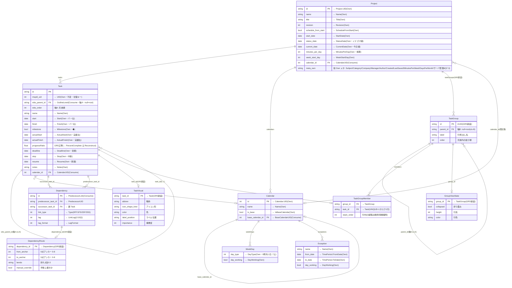

# GRS ネイティブ構成 ERD ＋ 責務

- 日付: 2026-07-25
- 位置づけ: **GRS としての構成**を示す文書。`grs-mspdi-field-ledger-ja.md`（＝MSPDI 全要素の**取捨選択**）の結果を受け、**Carry / Drop を除外**し、**Own / Consume / Reconstruct** と **GRS 追加要素**だけで GRS のネイティブ・データ構造を ERD＋責務で確定する。
- 対の文書:
  - `grs-mspdi-field-ledger-ja.md` = **取捨選択**（MSPDI をどう仕分けるか）
  - **本書** = **GRS 構成**（仕分けの結果、GRS が実際に持つ構造）
- 設計判断・根拠: `grs-data-model-ja.md`（§2 の 2 軸・§7 の詳細確定）。本書はその ERD 正準ビュー。
- 主言語 ja。識別子・列名は英語 ASCII。

> ⚠️ **Carry / Drop は本 ERD に出さない**（意図的除外）。ただし Carry は「捨てた」のではなく、往復のため**別途 passthrough ストアで温存**する（詳細は `grs-mspdi-field-ledger-ja.md` §7・§8B）。Drop=0。

## 構成

§1 本書の説明 → §2 GRS 概要 → §3 MSPDI から受け継ぐ範囲 → §4 GRS 構成の原則 → §5 GRS ネイティブ ERD → §6 ERD 要素の責務 → §7 要素別フィールド詳細 → §8 Appendix

---

## 1. 本書の説明

`grs-mspdi-field-ledger-ja.md` は MSPDI の全要素を **Own / Consume / Reconstruct / Carry / Drop** に仕分けた（取捨選択）。本書はその**入力**を受け:

```
ledger の Own/Consume/Reconstruct  ─┐
                                    ├─▶ 本書 = GRS ネイティブ構成（ERD＋責務）
GRS 追加要素（マルチバー等）        ─┘

（Carry / Drop は除外 … Carry は別 passthrough ストアへ・Drop=0）
```

- **Own** → GRS が同形で持つ**列**（ERD 本体）。
- **Consume** → GRS が**別構造**で持つ（`OutlineLevel`→WBS 木、`PredecessorLink`→`Dependency` 等・ERD 本体）。
- **Reconstruct** → **保存しない**。export で他 Own から算出（§8A 一覧）。
- **GRS 追加** → MSPDI に対応が無い GRS 固有（マルチバー行・視覚・依存線経路）。

本書は Adapter の「GRS 側の受け皿」を確定する設計資料である。

---

## 2. GRS 概要

- **GRS（gr-scheduler）**: 単一 `.html` の WYSIWYG 日程表ツール。成果物は JSON（主）/ MSPDI XML / SVG。
- **コア価値**: マルチバー（1 行に複数タスク横並べ）＋整列＋ズーム連動 LOD＋依存線自動配線。
- **ネイティブモデルは 2 軸**:
  - **軸A: WBS 構造ツリー** = `Task.wbs_parent_id`（MSPDI `OutlineLevel` 対応・**export する**）。
  - **軸B: マルチバー視覚層** = `TaskGroup`（行の器・≤Lv5）＋ `TaskGroupMember`（**GRS 専用・非 export**）。
- **JSON = GRS メモリの無変換直列化**（正規形）。MSPDI 交換は Adapter が担う。

---

## 3. MSPDI から受け継ぐ範囲（Carry/Drop 除外後）

ledger の 8 ネイティブテーブルから、**Own/Consume/Reconstruct のみ**を抽出:

| MSPDI 由来 | 受け継ぐ要素（Own/Consume/Reconstruct） | 除外（Carry・別ストア） |
|---|---|---|
| Task | UID/Name/Start/Finish/Milestone/ActualStart/ActualFinish/Deadline/Notes/Stop/Resume（Own）、OutlineLevel/CalendarUID/PredecessorLink（Consume）、ID/OutlineNumber/Summary/Duration/PercentComplete（Reconstruct） | 制約/工数/コスト/EVM/CPM派生/平準化/サブPJ/enterprise/補助/子要素、ActualDuration/RemainingDuration |
| PredecessorLink | PredecessorUID/Type/LinkLag/LagFormat（Consume） | CrossProject/CrossProjectName |
| Project | 識別/文書/期間/換算/サーバ管理（Own）、CalendarUID（Consume）、FinishDate（Reconstruct） | 通貨/既定/計算/Move/EV/会計/時刻（37） |
| Calendar/WeekDay/Exception | UID/Name/IsBaseCalendar/BaseCalendarUID/DayType/DayWorking/例外日（Own/Consume） | WorkingTime/WorkWeek/繰返し詳細 |
| Resource / Assignment | UID（Own）のみ | **丸ごと Carry**（本 ERD に構造として現れない） |

- **Resource / Assignment は GRS ネイティブに構造化しない**（丸ごと Carry）ため、本 ERD の一級エンティティにしない。往復のため UID キーで passthrough 温存する（ledger §7.5/§7.6）。任意で `Name`/`Initials` を読取専用の担当ラベルに流用可。

---

## 4. GRS 構成の原則

1. **Own は列**: 同形で GRS の列に持つ（`Task.UID`→`mspdi_uid` 等、名は GRS 側規約）。
2. **Consume は構造**: 意味を解釈して GRS 構造へ写す。
   - `OutlineLevel`＋順序 → `Task.wbs_parent_id` / `wbs_order`（**軸A・唯一の真実**）。
   - `PredecessorLink` → `Dependency`（task↔task エッジ）。
   - `CalendarUID` → `Task.calendar_id` / `Project.calendar_id`（ネイティブ暦参照）。
3. **Reconstruct は非保存**: 正規 JSON に持たない（ドリフト防止）。export でその場算出（§8A）。
4. **GRS 追加はマルチバー・視覚・経路**: MSPDI に対応が無い軸B・視覚・依存線幾何。**すべて非 export**。
5. **Carry は本 ERD 外**: passthrough ストアで温存（往復専用・GRS は解釈しない）。
6. **依存の向き**: GRS 追加（TaskGroup/TaskVisual/Dependency の視覚）→ Task。逆流させない（Task 無汚染）。

---

## 5. GRS ネイティブ ERD（MSPDI 由来 ＋ GRS 追加）

MSPDI 由来（Own/Consume）に GRS 追加（マルチバー・視覚・依存線経路）を重ねた **GRS の実構造**。各列に MSPDI 由来を注記（`← 元要素`）。GRS 追加は「GRS新設」。



> **凡例**: `← 元要素` = MSPDI 由来（Own/Consume）。注記なし＝GRS 新設。グローバル `viewState`（zoom / scroll 等の単一状態）は本 ERD では省略（`GroupViewState` / `DependencyRoute` に分解して表示）。

---

## 6. ERD 要素の責務

| エンティティ | 由来 | 責務（一言） |
|---|---|---|
| **Project** | MSPDI-Own | ルート。文書メタ＋期間/換算＋全コレクション＋既定暦参照を保持する 1 個の器。 |
| **Task** | MSPDI-Own 継承 | 日程要素（スパン/◆マイルストーン）の本体。予定・実績・中断の日付、WBS 親（軸A）、暦参照を持つ。MSPDI Task を無汚染で継承。 |
| **Dependency** | MSPDI-Consume（PredecessorLink） | タスク間依存エッジ（先行/後続/種別 FF-SS/ラグ）。自動配線の**論理**（幾何は DependencyRoute）。 |
| **Calendar** | MSPDI-Own | 稼働/非稼働暦。稼働日粒度の描画・期間換算の基盤。派生暦を自己参照。 |
| **WeekDay** | MSPDI-Own | 曜日ごとの稼働可否（週末グレー表示の元）。弱エンティティ（親＋位置で識別）。 |
| **Exception** | MSPDI-Own | 祝日・特別日（祝日グレー表示の元）。弱エンティティ。 |
| **TaskGroup** | GRS 新設 | **マルチバー行の器**＋見出し階層（≤Lv5）。「1 行に複数タスク」を実現。GRS 専用・**非 export**。 |
| **TaskGroupMember** | GRS 新設 | どの Task がどの行に載るか＋縦積み順。**1 タスクは高々 1 行**（task_id UNIQUE）。 |
| **TaskVisual** | GRS 新設 | GRS 固有の視覚属性（略称/アイコン形/色/ラベル位置/重要度）。Task 汚染を避けて分離。非 export。 |
| **DependencyRoute** | GRS 新設 | 依存線の**描画経路**（9 点アンカー・折れ点 0-3・手動上書き）。自動配線＝コアドメインの視覚結果。非 export。 |
| **GroupViewState** | GRS 新設 | 行の表示状態（折り畳み/行高/色）。データと分離しマージで引きずらない。非 export。 |

---

## 7. 要素別フィールド詳細（由来と責務）

**由来**: `Own`（MSPDI 同形）/ `Consume`（MSPDI を構造化）/ `GRS`（新設）。

### 7.1 Task

| 列 | 由来 | 責務 |
|---|---|---|
| `id` | GRS | GRS 内部識別（UUID）。 |
| `mspdi_uid` | Own(←UID) | 往復識別キー（不変）。iQUAVIS の UID 照合に使う。 |
| `wbs_parent_id` | Consume(←OutlineLevel＋順序) | WBS 親（軸A・null=root・≤Lv5）。明示的 WBS 編集で伝播。 |
| `wbs_order` | Consume | 兄弟内の順序（OutlineNumber の順序成分）。 |
| `name` | Own(←Name) | タスク名（バーのラベル）。 |
| `start` / `finish` | Own(←Start/Finish) | 予定開始/完了（バーの左右端）。 |
| `milestone` | Own(←Milestone) | ◆マイルストーン表示フラグ。 |
| `actualStart` / `actualFinish` | Own(←ActualStart/ActualFinish) | 実績開始/完了（実績バー・イナズマ線の元）。 |
| `progressRatio` | GRS 正準 | 進捗率（0..1）。export で `PercentComplete`(×100) を Reconstruct。 |
| `deadline` | Own(←Deadline) | 期限マーカー。 |
| `stop` / `resume` | Own(←Stop/Resume) | 中断/再開（中断バーの割れ目・単一区間）。 |
| `notes` | Own(←Notes) | 注記。 |
| `calendar_id` | Consume(←CalendarUID) | タスク暦参照（稼働日粒度描画）。 |

### 7.2 Dependency（← PredecessorLink）

| 列 | 由来 | 責務 |
|---|---|---|
| `id` | GRS | 依存エッジ識別。 |
| `predecessor_task_id` | Consume(←PredecessorUID) | 先行タスク端点。 |
| `successor_task_id` | Consume(←親 Task) | 後続タスク端点（MSPDI では後続 Task が Link を内包）。 |
| `link_type` | Consume(←Type) | 依存種別 0=FF/1=FS/2=SF/3=SS。 |
| `lag` | Consume(←LinkLag) | リード/ラグ（1/10 分・負=リード）。 |
| `lag_format` | Consume(←LagFormat) | ラグの表示単位。 |

### 7.3 Project

| 列 | 由来 | 責務 |
|---|---|---|
| `id` | Own(←UID) | プロジェクト識別（GUID）。 |
| `name` `title` `subject` `category` `company` `manager` `author` | Own | 文書メタ（ヘッダ表示・透かし）。 |
| `revision` `created` `last_saved` | Own | 版・来歴。 |
| `schedule_from_start` | Own | 前方/後方計算の向き。 |
| `start_date` `status_date` `current_date` | Own | 全体開始 / 予実基準日（イナズマ線）/ 今日線。 |
| `minutes_per_day` `minutes_per_week` `days_per_month` `week_start_day` | Own | 期間換算・週開始（Duration 解釈に必須）。 |
| `calendar_id` | Consume(←CalendarUID) | 既定カレンダー参照。 |
| サーバ管理 4（`server_url` `externally_edited` `actuals_in_sync` `admin_project`） | Own(暫定) | 将来サーバ連携用に保持。 |

> `finish_date` は保存しない（全 Task 最遅から Reconstruct・§8A）。

### 7.4 Calendar / WeekDay / Exception

| 列 | 由来 | 責務 |
|---|---|---|
| `Calendar.id` | Own(←UID) | 暦識別（参照先）。 |
| `Calendar.name` | Own | 暦名。 |
| `Calendar.is_base` | Own(←IsBaseCalendar) | 基準暦か。 |
| `Calendar.base_calendar_id` | Consume(←BaseCalendarUID) | 派生元参照（自己）。 |
| `WeekDay.day_type` | Own(←DayType) | 曜日（0=例外,1=日..7=土）。 |
| `WeekDay.day_working` | Own(←DayWorking) | その曜日が稼働か（週末グレー）。 |
| `Exception.name` | Own | 祝日名。 |
| `Exception.from_date` / `to_date` | Own(←TimePeriod) | 例外日の期間。 |
| `Exception.day_working` | Own | 例外日が稼働か（祝日グレー）。 |

### 7.5 GRS 追加（マルチバー・視覚・経路）

| 列 | エンティティ | 責務 |
|---|---|---|
| `id` `parent_id` `label` `order` | TaskGroup | 行の器の識別・階層（≤Lv5）・名称・並び。 |
| `group_id` `task_id` `stack_order` | TaskGroupMember | 行への所属（1タスク1行）＋時間重複時の縦積み順。 |
| `task_id` `abbrev` `icon_shape_kind` `color` `label_position` `importance` | TaskVisual | Task ごとの視覚属性（Task 本体を汚さず分離）。 |
| `dependency_id` `from_anchor` `to_anchor` `bends` `manual_override` | DependencyRoute | 依存線の描画経路（9点アンカー・折れ点・手動上書き）。 |
| `group_id` `collapsed` `height` `color` | GroupViewState | 行の表示状態（折畳/高さ/色）。 |

---

## 8. Appendix

### A. Reconstruct（保存しない・export で算出）

正規 JSON に持たず、MSPDI export 時に他 Own/構造から焼き込む（自己完結スナップショットの思想）。

| MSPDI 出力 | 算出元 | タイミング |
|---|---|---|
| `Task.ID` | `wbs_order`＋深さ優先順 | export |
| `Task.OutlineLevel` | `wbs_parent` 木の深さ | export |
| `Task.OutlineNumber` | `wbs_parent` 木のパス | export |
| `Task.Summary` | 子の有無 | export |
| `Task.Duration` | `finish − start`＋暦 | export |
| `Task.PercentComplete` | `progressRatio × 100` | export |
| `Project.FinishDate` | 全 Task 最遅のロールアップ | export |

> `ActualDuration` / `RemainingDuration` は **Reconstruct にしない**（進行中タスクで `ActualFinish` 空のため単純再計算が破綻）。ledger H-2 により **Carry**（本 ERD 外）。

### B. MSPDI → GRS 写像（要約）

| MSPDI | GRS | 種別 |
|---|---|---|
| `Task.UID` | `Task.mspdi_uid` | Own |
| `Task.Start/Finish/Milestone/ActualStart/ActualFinish/Deadline/Notes/Stop/Resume` | 同名 GRS 列 | Own |
| `Task.PercentComplete` | `Task.progressRatio`（÷100） | Own(逆に Reconstruct で戻す) |
| `Task.OutlineLevel`＋順序 | `Task.wbs_parent_id` / `wbs_order` | Consume（軸A） |
| `Task.CalendarUID` | `Task.calendar_id` | Consume |
| `PredecessorLink` | `Dependency` | Consume |
| `Project.CalendarUID` | `Project.calendar_id` | Consume |
| `Calendar/WeekDay/Exception` | 同名 GRS 暦 | Own/Consume |
| （MSPDI に無し） | `TaskGroup` / `TaskGroupMember` / `TaskVisual` / `DependencyRoute` / `GroupViewState` | GRS 新設・非 export |

### C. 本 ERD から除外したもの（Carry / Drop）

- **Carry**: GRS が解釈しない MSPDI 要素（Task の制約/工数/コスト/EVM/CPM派生/平準化/enterprise/子要素、Resource/Assignment 丸ごと、Calendar の勤務時刻/繰返し詳細、Project の 37 メタ、`ActualDuration`/`RemainingDuration` 等）。**別 passthrough ストアで温存**し export で書き戻す（往復無損失）。本 ERD には構造として出さない。詳細は `grs-mspdi-field-ledger-ja.md` §7。
- **Drop**: なし（Drop=0）。

### D. ベースライン（変更前予定グレー）

インラインに持たない。**別ファイル baseline**（ScheduleDocument スナップショット・読取専用・id 突合でグレー下敷き・P6 式）。本 ERD の一級エンティティにしない（`grs-data-model-ja.md` §4.8）。

### E. 参照

- 取捨選択（MSPDI 全要素の仕分け）: `grs-mspdi-field-ledger-ja.md`
- 設計判断・2軸・往復規約: `grs-data-model-ja.md` §2/§6/§7
- MSPDI 事実・ERD: `../vendor/mspdi-tables.md`, `../vendor/mspdi-declutter-erd-ja.md`, `../vendor/mspdi-core-tree.md`
- 正本: `../vendor/mspdi/mspdi_pj12.xsd`
