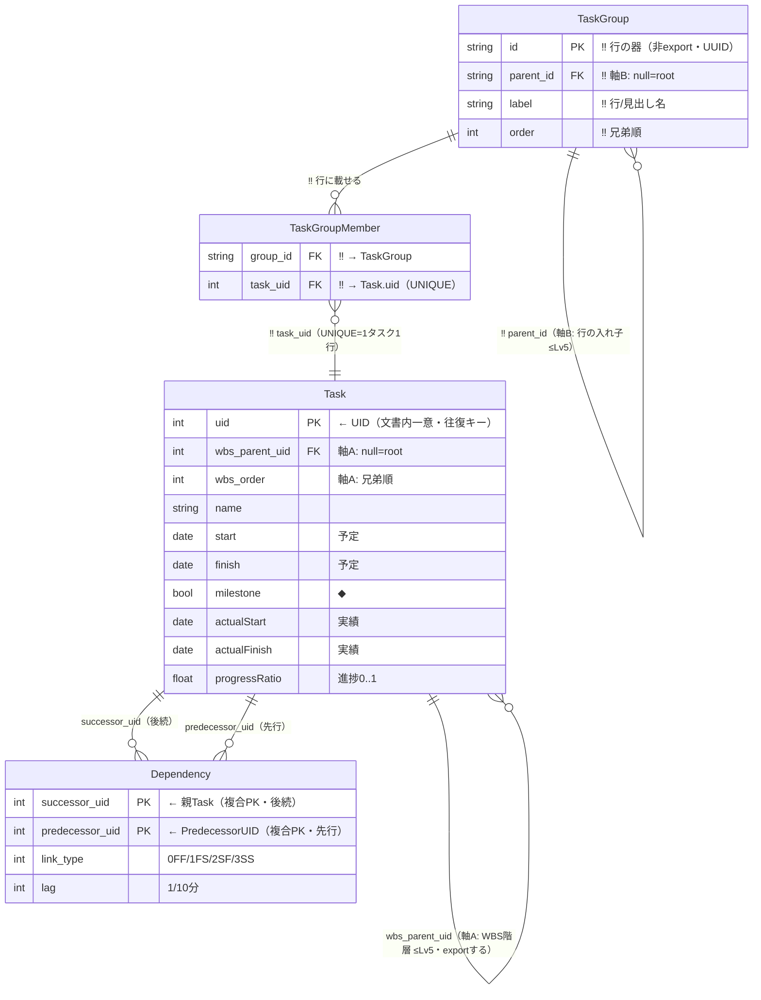
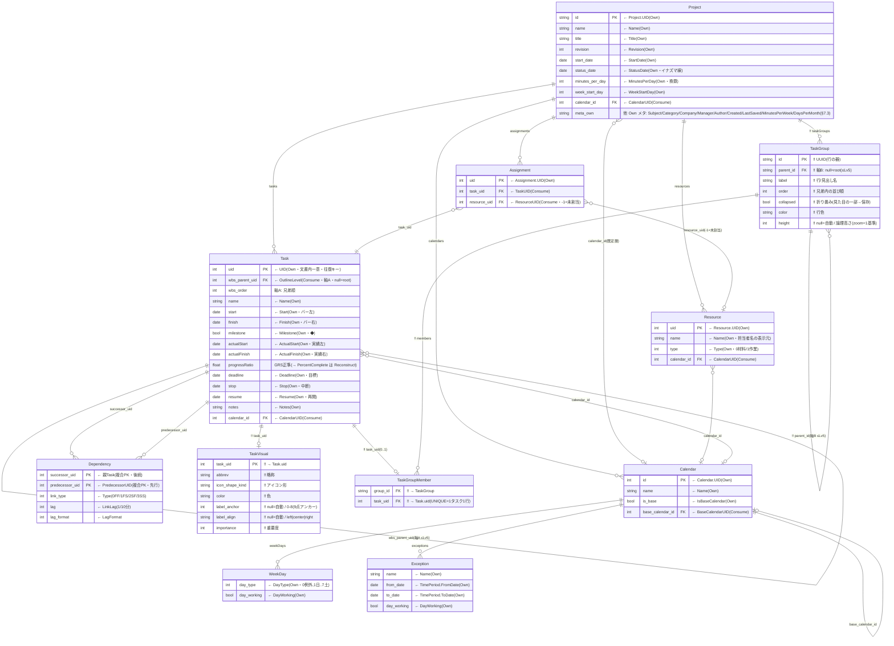

# GRS ネイティブ構成 ERD ＋ 責務

- 日付: 2026-07-25
- 位置づけ: **GRS としての構成**を示す文書。`grs-mspdi-field-ledger-ja.md`（＝MSPDI 全要素の**取捨選択**）の結果を受け、**Carry / Drop を除外**し、**Own / Consume / Reconstruct** と **GRS 追加要素**だけで GRS のネイティブ・データ構造を ERD＋責務で確定する。
- 対の文書:
  - `grs-mspdi-field-ledger-ja.md` = **取捨選択**（MSPDI をどう仕分けるか）
  - **本書** = **GRS 構成**（仕分けの結果、GRS が実際に持つ構造）
- 設計判断・根拠: `grs-data-model-ja.md`（§2 の 2 軸・§7 の詳細確定）。本書はその ERD 正準ビュー。
- 主言語 ja。識別子・列名は英語 ASCII。

> ⚠️ **Carry / Drop は本 ERD に出さない**（意図的除外）。ただし Carry は「捨てた」のではなく、往復のため**別途 passthrough ストアで温存**する（詳細は `grs-mspdi-field-ledger-ja.md` §7・§8B）。Drop=0。

## 構成

§1 本書の説明 → §2 GRS 概要 → §3 MSPDI から受け継ぐ範囲 → §4 GRS 構成の原則 → §5 GRS ネイティブ ERD（**5.0 何が本質か / 5.1 コア ERD〈4〉/ 5.2 全体 ERD〈11〉/ 5.3 識別子 / 5.4 マージ規約 / 5.5 資源の軽量ネイティブ化**）→ §6 ERD 要素の責務 → §7 要素別フィールド詳細 → §8 Appendix

---

## 1. 本書の説明

`grs-mspdi-field-ledger-ja.md` は MSPDI の全要素を **Own / Consume / Reconstruct / Carry / Drop** に仕分けた（取捨選択）。本書はその**入力**を受け:

```
ledger の Own/Consume/Reconstruct  ─┐
                                    ├─▶ 本書 = GRS ネイティブ構成（ERD＋責務）
GRS 追加要素（マルチバー等）        ─┘

（Carry / Drop は除外 … Carry は別 passthrough ストアへ・Drop=0）
```

- **Own** → GRS が同形で持つ**列**（ERD 本体）。
- **Consume** → GRS が**別構造**で持つ（`OutlineLevel`→WBS 木、`PredecessorLink`→`Dependency` 等・ERD 本体）。
- **Reconstruct** → **保存しない**。export で他 Own から算出（§8A 一覧）。
- **GRS 追加** → MSPDI に対応が無い GRS 固有（マルチバー行・視覚属性）。

本書は Adapter の「GRS 側の受け皿」を確定する設計資料である。

---

## 2. GRS 概要

- **GRS（gr-scheduler）**: 単一 `.html` の WYSIWYG 日程表ツール。成果物は JSON（主）/ MSPDI XML / SVG。
- **コア価値**: マルチバー（1 行に複数タスク横並べ）＋整列＋ズーム連動 LOD＋**依存線の全自動配線**（手動調整なし・§5.6）。
- **ネイティブモデルは 2 軸**:
  - **軸A: WBS 構造ツリー** = `Task.wbs_parent_uid`（MSPDI `OutlineLevel` 対応・**export する**）。
  - **軸B: マルチバー視覚層** = `TaskGroup`（行の器・≤Lv5）＋ `TaskGroupMember`（**GRS 専用・非 export**）。
- **JSON = GRS メモリの無変換直列化**（正規形）。MSPDI 交換は Adapter が担う。

---

## 3. MSPDI から受け継ぐ範囲（Carry/Drop 除外後）

ledger の 8 ネイティブテーブルから、**Own/Consume/Reconstruct のみ**を抽出:

| MSPDI 由来                 | 受け継ぐ要素（Own/Consume/Reconstruct）                                                                                                                                                                           | 除外（Carry・別ストア）                                                                             |
| -------------------------- | ----------------------------------------------------------------------------------------------------------------------------------------------------------------------------------------------------------------- | --------------------------------------------------------------------------------------------------- |
| Task                       | UID/Name/Start/Finish/Milestone/ActualStart/ActualFinish/Deadline/Notes/Stop/Resume（Own）、OutlineLevel/CalendarUID/PredecessorLink（Consume）、ID/OutlineNumber/Summary/Duration/PercentComplete（Reconstruct） | 制約/工数/コスト/EVM/CPM派生/平準化/サブPJ/enterprise/補助/子要素、ActualDuration/RemainingDuration |
| PredecessorLink            | PredecessorUID/Type/LinkLag/LagFormat（Consume）                                                                                                                                                                  | CrossProject/CrossProjectName                                                                       |
| Project                    | 識別/文書/期間/換算（Own）、CalendarUID（Consume）、FinishDate（Reconstruct）                                                                                                                                     | 通貨/既定/計算/Move/EV/会計/時刻（37）＋**ScheduleFromStart/CurrentDate/サーバ管理4**（§5.6 で降格） |
| Calendar/WeekDay/Exception | UID/Name/IsBaseCalendar/BaseCalendarUID/DayType/DayWorking/例外日（Own/Consume）                                                                                                                                  | WorkingTime/WorkWeek/繰返し詳細                                                                     |
| Resource                   | `UID`/`Name`/`Type`（Own）、`CalendarUID`（Consume）                                                                                                                                                              | 他全列（工数/コスト/EVM/enterprise/子要素）                                                         |
| Assignment                 | `UID`（Own）、`TaskUID`/`ResourceUID`（Consume）                                                                                                                                                                  | 他全列（`Units`/工数/コスト/EVM/201予約枠/子要素）                                                  |

- **Resource / Assignment は「軽量ネイティブ」**（§5.5）。**担当者名をバーに表示する**ため、`Resource.Name`/`Type` と `Assignment` の 2 参照だけを理解し、**残りは全て Carry** で温存する。資源管理（工数・コスト・平準化）は引き続き非対象。

---

## 4. GRS 構成の原則

1. **Own は列**: 同形で GRS の列に持つ（`Task.UID`→`Task.uid` 等、名は GRS 側規約）。**MSPDI 由来テーブルに GRS 代理キーを足さない**（§5.3）。
2. **Consume は構造**: 意味を解釈して GRS 構造へ写す。
   - `OutlineLevel`＋順序 → `Task.wbs_parent_uid` / `wbs_order`（**軸A・唯一の真実**）。
   - `PredecessorLink` → `Dependency`（task↔task エッジ）。
   - `CalendarUID` → `Task.calendar_id` / `Project.calendar_id`（ネイティブ暦参照）。
3. **Reconstruct は非保存**: 正規 JSON に持たない（ドリフト防止）。export でその場算出（§8A）。
4. **GRS 追加はマルチバーと視覚**: MSPDI に対応が無い軸B・視覚属性。**すべて非 export**。
5. **Carry は本 ERD 外**: passthrough ストアで温存（往復専用・GRS は解釈しない）。
6. **依存の向き**: GRS 追加（TaskGroup/TaskVisual）→ Task。逆流させない（Task 無汚染）。
7. **自動算出できるものは保存しない**（§5.6）: 自動配線の経路・LOD の見え方など、エンジンが毎回決めるものはデータに持たない。
8. **見た目に影響するものは全て保存・共有する**（§5.7）: GRS の JSON を渡せば GRS 同士で**完全に同じ見た目**が再現される。

---

## 5. GRS ネイティブ ERD

全 11 エンティティを一度に見ると読み取りづらいため、**§5.1 コア（4）**と**§5.2 全体（11）**の 2 段で示す。§5.1 がモデルの本質、§5.2 が実装の全体像。

### 5.0 何が本質か（レイヤ分け）

判定基準: **それが無いと GRS のデータモデルが成立しないか**。

| 層             | エンティティ                                        | 本質? | 理由                                                                                                            |
| -------------- | --------------------------------------------------- | :---: | --------------------------------------------------------------------------------------------------------------- |
| **コア**       | `Task`                                              | **◎** | 日程要素の本体。**軸A（WBS）は `wbs_parent_uid` の自己参照で Task 内に閉じる**ため、階層に別テーブルは要らない。 |
| **コア**       | `TaskGroup` / `TaskGroupMember`                     | **◎** | **軸B（マルチバー）＝製品最大の差別化**。この 2 つが無いと「1 行に複数タスク」が表現できない。                  |
| **コア**       | `Dependency`                                        | **◎** | 依存線＝コアドメイン（自動配線）。Task 間の関係で、軸A/軸B のどちらとも独立。                                   |
| ルートメタ     | `Project`                                           |   ○   | 1 個の器（文書メタ・期間・換算）。構造の理解には寄与しない。                                                    |
| 暦クラスタ     | `Calendar` / `WeekDay` / `Exception`                |   ○   | 稼働日・祝日のグレー表示と期間換算。**外しても日程の構造は成立**（描画が退化するだけ）。                        |
| 資源（軽量）   | `Resource` / `Assignment`                           |   ○   | **担当者名の表示**のみを担う軽量層（§5.5）。外すと担当者が出ないだけで日程の構造は成立。                        |
| 視覚           | `TaskVisual`                                        |   △   | MSPDI 由来の `Task` を汚さないために分離した**非 export の視覚列**。Task に 0..1 でぶら下がるだけ。              |

→ **コア 4 つ（Task / TaskGroup / TaskGroupMember / Dependency）が本質**。残り 7 は「器・暦・資源・見た目」で、**外してもモデルは壊れない**。

### 5.1 コア ERD（本質 4 エンティティ）

2 軸とコアドメインだけを描いた最小形。**このデータ構造が GRS の本質**。

> **凡例**: **‼️ = MSPDI に対応が無い GRS 新設**（テーブル/カラム）。`Consume`（`OutlineLevel`→`wbs_parent_uid` 等、MSPDI を構造化しただけ）は元要素があるので ‼️ を付けない。
> **‼️ テーブル**: `TaskGroup` / `TaskGroupMember`（Mermaid はエンティティ名に絵文字を置けないため、**全カラムとリレーション線ラベルに ‼️** を付して表す）。



**この 4 つで表現できること**:

- **識別** = `Task.uid`（= MSPDI UID）**一本**。代理キーを持たない（§5.3）
- **軸A: WBS 階層** = `Task.wbs_parent_uid` の自己参照（iQUAVIS へ export・明示編集でのみ伝播）
- **軸B: マルチバー** = `TaskGroup` に `TaskGroupMember` で複数 Task を載せる（GRS 専用・非 export・WBS 不変）
- **依存** = `Dependency`（先行/後続・種別・ラグ）
- **予定/実績/マイルストーン** = Task の日付列

### 5.2 全体 ERD（コア＋ルートメタ＋暦＋視覚）

MSPDI 由来（Own/Consume）に GRS 追加（マルチバー・視覚・依存線経路）を重ねた **GRS の実構造**。各列に MSPDI 由来を注記（`← 元要素`）。GRS 追加は「GRS新設」。

> **凡例**: **‼️ = MSPDI に対応が無い GRS 新設**（テーブル/カラム）。`← 元要素` = MSPDI 由来（Own/Consume）。
> **‼️ テーブル（3）**: `TaskGroup` / `TaskGroupMember` / `TaskVisual`（Mermaid の制約上、**全カラムとリレーション線ラベルに ‼️**）。



> `← 元要素` = MSPDI 由来（Own/Consume）。**‼️** = GRS 新設（MSPDI に対応なし）。文書全体の設定（`stack_direction` / `zoom`）は単一オブジェクト `documentSettings` のため本 ERD では省略（§5.6/§5.7）。行ごとの書式は `TaskGroup` が直接持つ。

### 5.3 識別子の方針（代理キーを持たない）

**原則: MSPDI の UID をそのまま GRS の PK に使う。GRS 独自の代理キー（UUID 等）を追加しない。**

| エンティティ | PK | 代理キー |
|---|---|:--:|
| `Task` | `uid`（= MSPDI `Task.UID`） | 無し |
| `Project` | `id`（= `Project.UID`） | 無し |
| `Calendar` | `id`（= `Calendar.UID`） | 無し |
| `Resource` | `uid`（= `Resource.UID`） | 無し |
| `Assignment` | `uid`（= `Assignment.UID`） | 無し |
| `Dependency` | **複合** (`successor_uid`, `predecessor_uid`) | 無し（MSPDI に UID が無い＝自然キー） |
| `WeekDay` / `Exception` | 親＋位置（弱エンティティ） | 無し |
| `TaskGroup` ‼️ | `id`（UUID） | — GRS 新設テーブルのため独自 ID が必要 |

**なぜ代理キーが不要か**: マージ時の UID 衝突は**取込時の 3 択（§5.4）で解消**されるため、文書内で UID は常に一意。したがって複合キー（`source_id`+`uid`）も UUID も要らない。

**新規作成タスクの UID**: GRS で新規作成した Task には `max(uid)+1` を採番（MSPDI と同じ整数空間）。

### 5.4 マージ規約（複数 MSPDI の取込）

MVP スコープ。2 つ目以降の MSPDI を取り込む際、衝突時にユーザーへ選択させる。

**衝突の判定（C-1 確定）**: 取込側 `Project.UID` と既存の出自を比較する。

| 出自 | 意味 | UID 一致の解釈 | **既定の選択** |
|---|---|---|---|
| **同一マスタ**（`Project.UID` 一致） | 同じ iQUAVIS マスタの再取込 | 本当に同一タスク | **1. 上書き** |
| **別マスタ**（`Project.UID` 不一致） | 無関係な別日程 | たまたま番号が同じ**別タスク** | **2. 別 UID** |

> 別マスタで「上書き」を選ぶと**無関係なタスクを破壊**するため、その組合せは警告を出す。

**選択の粒度（C-2 確定）**: **取込 1 回につき 1 度だけ**問い、その選択を**衝突全件へ一括適用**する（数百件を個別に問わない）。衝突一覧の提示と個別上書きは任意機能。

**タスク衝突時（同一タスクが来た場合）**

| 選択 | 動作 | UID | 元ソースへの往復 |
|---|---|---|---|
| 1. 上書き | 既存タスクを取込側の内容で置換 | 既存 UID を維持 | ○ 保たれる |
| 2. 別 UID でインポート | 別タスクとして追加 | **新規採番**（`max+1`） | **✗ 諦める（C-3 確定）** |
| 3. キャンセル | MSPDI 読込を中止（何も変更しない） | — | — |

> **C-3 確定**: 選択 2 で UID を振り直したタスクは、**元ソース（iQUAVIS 等）への往復を諦める**。元 UID は保全しない（`source_uid` 列を持たない）。振り直し後の export は「新しいタスク」として出る。UI で**この旨を明示して選択させる**こと。

**プロジェクト基本情報の衝突時**

| 選択 | 動作 |
|---|---|
| 1. 上書き | 取込側の Project メタで置換 |
| 2. 既存を保持 | 既存 Project メタを維持（タスクのみ取込） |
| 3. キャンセル | MSPDI 読込を中止 |

**暦・資源の重複（C-5 確定）**: ダイアログは上記 2 つのみ（増やさない）。取込側の重複は自動処理する。

| 対象 | 重複時の扱い |
|---|---|
| `Calendar` | **内容一致（名前＋稼働曜日＋祝日が同じ）なら自動統合**。不一致なら再採番＋名前に接尾辞。 |
| `Resource` | **同名なら自動統合**（担当者が二重に出ないため）。 |

**UID 参照は自動追従（C-4 確定）**: §5.5 の不変条件により、UID を振り直しても全参照が構造的に追従する。**UID 再マップ表は不要**（当初案を廃止）。

### 5.5 資源の軽量ネイティブ化と「Carry に参照を残さない」不変条件

**目的**: **担当者名をバーに表示する**。そのために `Resource` / `Assignment` を**軽量ネイティブ**として持つ（資源管理＝工数・コスト・平準化は引き続き非対象）。

理解するのは **7 列だけ**。残りは全て Carry で温存する。

| エンティティ | 理解する列 | 分類 |
|---|---|---|
| `Resource` | `uid` / `name`（表示元）/ `type`（0材料/1作業） | Own |
| `Resource` | `calendar_id` | Consume |
| `Assignment` | `uid` | Own |
| `Assignment` | `task_uid` / `resource_uid` | Consume |

**表示の経路**: `Task` →（`Assignment.task_uid`）→ `Assignment` →（`resource_uid`）→ `Resource.name` をバーに表示。`type=1`（作業）のみを担当者として扱い、材料資源は除外する。MVP は**読取専用表示**（GRS での割当編集は将来）。

**不変条件（重要）**: MSPDI の UID 参照フィールドは全 7 つ。本節の格上げにより**その全てが Consume（構造化）**になった。

| UID 参照 | 分類 |
|---|---|
| `Task.PredecessorLink.PredecessorUID` / `Task.CalendarUID` / `Project.CalendarUID` / `Calendar.BaseCalendarUID` | Consume |
| `Assignment.TaskUID` / `Assignment.ResourceUID` / `Resource.CalendarUID` | Consume（本節で格上げ） |

→ **Carry の中に UID 参照は 1 つも残らない**（Carry ＝ 参照を持たない不透明な値の塊）。
→ **UID を振り直しても全参照が自動追従**するため、C-4/C-5 で検討した「UID 再マップ表」は**不要**。passthrough の実装も単純化する。

### 5.6 「自動算出できるものは保存しない」原則と無駄の監査

**原則**: エンジンが毎回決められるもの（自動配線の経路・派生値）は**データとして持たない**。保存すると「保存値 vs 再計算結果」のドリフトが生まれ、実装もマージも複雑になる。§4 の `Reconstruct は非保存` を視覚層にも適用する。

**依存線の経路は保存しない（確定）**: 依存線は**全て自動配線**（9 点アンカー・折れ点 0-3・重なり最小化）で、**ユーザーは手操作しない**。したがって経路は毎回エンジンが算出すれば足り、**`DependencyRoute` テーブルは廃止**した（当初案を削除）。`Dependency` が持つのは論理（先行/後続・種別・ラグ）のみ。

**監査結果（全エンティティ・全列）**

| 対象 | 判定 | 措置 |
|---|:--:|---|
| `DependencyRoute` 全体 | **無駄** | **削除**（全自動配線のため保存不要） |
| `Project.ScheduleFromStart` | **無駄** | **Own → Carry**。GRS はスケジューラを持たず前方/後方計算をしない＝意味を使わない |
| `Project.CurrentDate` | **無駄** | **Own → Carry**。「今日線」は**実行時のシステム日付**で描く。保存すると保存時点で凍結する |
| サーバ管理4（`MicrosoftProjectServerURL` `ProjectExternallyEdited` `ActualsInSync` `AdminProject`） | **無駄** | **Own(暫定) → Carry**。MVP にサーバ連携が無く GRS は解釈しない。将来必要になった時に格上げ |
| `Task.calendar_id` / `Resource.calendar_id` | 構造上必要 | 保持。GRS は既定暦で描画し**個別暦は現状未使用**だが、**Carry に UID 参照を残さない**不変条件（§5.5）のため Consume で保持 |
| `Dependency.lag_format` | 構造上必要 | 保持。ラグの表示単位は GRS 非表示だが、忠実な書き戻しのため Consume で保持 |
| `TaskGroupMember.stack_order` | **無駄** | **削除**。縦積みは**全自動**（開始日順＋全体オプションの向き）。人は個別に入れ替えない → 毎回算出 |
| `TaskVisual.label_anchor` / `label_align` | 保持（疎） | **原則自動配置。人が動かした時だけ値を持つ**（`null`=自動）。9点アンカー＋左/中央/右詰め |
| `TaskGroup.height` | 保持（疎） | **原則自動。所定フォーマットに合わせて人が指定した時だけ値を持つ**（`null`=自動）。→ 疎な上書きパターン |
| `TaskVisual.abbrev` / `color` / `icon_shape_kind` / `importance` | 妥当 | いずれもユーザーの意思（略称・色・形・重要度）で算出不能。保持 |
| `stack_direction`（文書設定） | 妥当 | ユーザーの選択（上/下）。**文書に 1 個**で行ごとに持たない＝冗長なし |
| `TaskGroup.collapsed` / `color` | 妥当 | ユーザー操作・書式の意思。**見た目の一部なので保存し共有で再現**（§5.7）。保持 |
| `TaskGroup.order` / `Task.wbs_order` | 妥当 | 並び順はユーザーの意思。算出不能。保持 |
| `GroupViewState` 全体 | **無駄** | **削除**。`TaskGroup` は元から GRS 独自で「MSPDI 核を汚さないための分離」が不要 → 書式 3 列を `TaskGroup` に畳み込み（§5.7） |

**疎な上書きパターン（確定）**: 「原則自動・人が触る場合あり」の列は、**全件保存せず `null`=自動 / 値あり=人の上書き**とする。既定は常にエンジンが算出し、上書きは例外として少数だけ保存される。該当: `TaskVisual.label_anchor`/`label_align`、`TaskGroup.height`。

> **注**: `DependencyRoute` はこのパターンにも該当しない（**人が一切触らない**ため、上書きの余地がなく全削除）。

**全体オプション（文書レベル・1 個）**: 縦積みの向き。

| 設定 | 値 | 既定 | 置き場所 | 責務 |
|---|---|---|---|---|
| `stack_direction` | `up` / `down` | **`up`（上に積む）** | **文書設定**（保存・共有される・§5.7） | 行内で時間が重なるバーを上下どちらに積むか。**文書全体で 1 つ**（行ごと・バーごとには持たない） |

> **文書設定に置く理由**: JSON を共有した相手にも**同じ見た目が再現される**必要があるため（§5.7）。ズーム（縦/横）も同じ理由で文書設定に置く。

**縦積み順の算出規則（決定的・確定）**

```
1. start 昇順（開始が早いバーが先）
2. 同着なら finish 降順（長いバーが先）
3. なお同着なら uid 昇順（uid は必ず一意 → 完全に決定的）
→ 得られた順序を stack_direction（up/down）の向きに積む
```

> **決定的であることが必須**: 順序が実行ごとに変われば描画が揺れ、SVG 出力の再現性も失われる。`uid` 昇順の最終タイブレークで**必ず一意に定まる**。

**疎な上書きの表現（確定）**

| 列 | 値 | 意味 |
|---|---|---|
| `TaskVisual.label_anchor` | `null` / `0-8` | ラベルの**9 点アンカー**（バー上の 3×3）。`null`=自動配置 |
| `TaskVisual.label_align` | `null` / `left`・`center`・`right` | ラベルの**左詰め/中央ぞろえ/右詰め**。`null`=自動 |
| `TaskGroup.height` | `null` / 論理高さ | `null`=自動。値は**ズーム=1 基準の論理高さ**で保存し、**ズームに比例**して伸縮する（相対関係が保たれる） |

> **ピクセル座標で保存しない理由**: GRS は**縦横独立ズーム**のため、絶対座標だとズームで位置がずれる。ラベルは離散アンカー＋整列、行高は論理値（ズーム比例）とすることでズームに追従する。

### 5.7 JSON = 見た目の完全再現（確定）

**原則: GRS の JSON を渡せば、GRS 同士なら完全に同じ見た目が再現されること。**

したがって「**見た目に影響するものは全て文書データとして保存・共有する**」。一時的な UI 状態として切り離してよいのは、見た目を構成しない操作中の状態（選択・ホバー・Undo 履歴）だけ。

| 種別 | 例 | 保存 | 共有で再現 |
|---|---|:--:|:--:|
| **文書データ（見た目を決める）** | `TaskVisual`（略称/色/アイコン/ラベル位置/重要度）、`TaskGroup`（**折畳/色/行高**含む）、`TaskGroupMember` | ○ | ○ |
| **文書設定（全体書式）** | `stack_direction`、`zoom`（縦/横） | ○ | ○ |
| **一時 UI 状態（見た目ではない）** | 選択・ホバー・Undo/Redo 履歴 | ✗ | — |

> MSPDI は**描画データを一切持たない**（Bar Styles・色・行高・折畳・ズームは全てファイル外）。したがって上記は**全て GRS 独自**で、**export では落ちる**。「同じ見た目の再現」は **GRS の JSON でのみ**成立する。

**`GroupViewState` を廃止し `TaskGroup` に畳み込み（確定）**

当初は「表示状態をデータから分離」（旧 §4.3）していたが、本原則により行の書式（折畳/色/行高）は**共有される文書データ**になった。かつ `TaskGroup` は**元から GRS 独自**で、`TaskVisual` のような「MSPDI 核を汚さないための分離」が**不要**。よって別テーブルにする理由が消え、**3 列を `TaskGroup` に畳み込んだ**（12 → 11 エンティティ）。

**マージ時の扱い**: 取り込む側（既存文書）の書式・設定を**維持**する（取込ファイルの見た目設定は無視）。→ §5.4 の「プロジェクト基本情報＝既存を保持」と同じ考え方。

---

## 6. ERD 要素の責務

| エンティティ           |     層     | 由来                             | 責務（一言）                                                                                                               |
| ---------------------- | :--------: | -------------------------------- | -------------------------------------------------------------------------------------------------------------------------- |
| **Task**               |  **コア**  | MSPDI-Own 継承                   | 日程要素（スパン/◆マイルストーン）の本体。予定・実績・中断の日付、WBS 親（軸A）、暦参照を持つ。MSPDI Task を無汚染で継承。 |
| **TaskGroup** ‼️       |  **コア**  | GRS 新設                         | **マルチバー行の器**＋見出し階層（≤Lv5）＋**行の書式**（折畳/色/行高）。GRS 専用・**非 export**・保存され共有で再現。       |
| **TaskGroupMember** ‼️ |  **コア**  | GRS 新設                         | どの Task がどの行に載るか。**1 タスクは高々 1 行**（task_uid UNIQUE）。**縦積み順は持たない**（自動算出・§5.6）。         |
| **Dependency**         |  **コア**  | MSPDI-Consume（PredecessorLink） | タスク間依存エッジ（先行/後続/種別 FF-SS/ラグ）。**線の幾何は保存しない**（毎回自動配線で算出・§5.6）。          |
| **Project**            | ルートメタ | MSPDI-Own                        | ルート。文書メタ＋期間/換算＋全コレクション＋既定暦参照を保持する 1 個の器。                                               |
| **Calendar**           |     暦     | MSPDI-Own                        | 稼働/非稼働暦。稼働日粒度の描画・期間換算の基盤。派生暦を自己参照。                                                        |
| **WeekDay**            |     暦     | MSPDI-Own                        | 曜日ごとの稼働可否（週末グレー表示の元）。弱エンティティ（親＋位置で識別）。                                               |
| **Exception**          |     暦     | MSPDI-Own                        | 祝日・特別日（祝日グレー表示の元）。弱エンティティ。                                                                       |
| **Resource**           | 資源(軽量) | MSPDI-Own（4列のみ）             | 人/設備等。**担当者名の表示元**（`name`）。工数・コスト・平準化は持たない（Carry）。→ §5.5                                 |
| **Assignment**         | 資源(軽量) | MSPDI-Consume（3列のみ）         | Task×Resource の割当リンク。**どのバーに誰が付くか**だけを表す。割当率・工数・コストは持たない（Carry）。→ §5.5            |
| **TaskVisual** ‼️      |    視覚    | GRS 新設                         | GRS 固有の視覚属性（略称/アイコン形/色/ラベル位置/重要度）。Task 汚染を避けて分離。非 export。                             |

> **層**: コア（4）＝これが無いとモデルが成立しない（§5.0）。ルートメタ／暦／資源／視覚（7）＝外しても構造は壊れない付随層。
> **‼️**（5 テーブル）= MSPDI に対応が無い GRS 新設。**すべて非 export**（export 時に落とす）。MSPDI 由来テーブルには **GRS 独自の代理キーを一切追加しない**（UID をそのまま PK に使う・§5.3）。

---

## 7. 要素別フィールド詳細（由来と責務）

**由来**: `Own`（MSPDI 同形）/ `Consume`（MSPDI を構造化）/ `GRS`（新設）。

### 7.1 Task

| 列                             | 由来                           | 責務                                                               |
| ------------------------------ | ------------------------------ | ------------------------------------------------------------------ |
| `uid` **PK**                   | Own(←UID)                      | **識別子**。代理キーを持たない（§5.3）。往復キーとして不変保持し iQUAVIS の UID 照合に使う。文書内一意（衝突は取込時に解消・§5.4）。新規作成時は `max(uid)+1`。 |
| `wbs_parent_uid`               | Consume(←OutlineLevel＋順序)   | WBS 親（軸A・null=root・≤Lv5）。明示的 WBS 編集で伝播。            |
| `wbs_order`                    | Consume                        | 兄弟内の順序（OutlineNumber の順序成分）。                         |
| `name`                         | Own(←Name)                     | タスク名（バーのラベル）。                                         |
| `start` / `finish`             | Own(←Start/Finish)             | 予定開始/完了（バーの左右端）。                                    |
| `milestone`                    | Own(←Milestone)                | ◆マイルストーン表示フラグ。                                        |
| `actualStart` / `actualFinish` | Own(←ActualStart/ActualFinish) | 実績開始/完了（実績バー・イナズマ線の元）。                        |
| `progressRatio`                | GRS 正準                       | 進捗率（0..1）。export で `PercentComplete`(×100) を Reconstruct。 |
| `deadline`                     | Own(←Deadline)                 | 期限マーカー。                                                     |
| `stop` / `resume`              | Own(←Stop/Resume)              | 中断/再開（中断バーの割れ目・単一区間）。                          |
| `notes`                        | Own(←Notes)                    | 注記。                                                             |
| `calendar_id`                  | Consume(←CalendarUID)          | タスク暦参照（稼働日粒度描画）。                                   |

### 7.2 Dependency（← PredecessorLink）

| 列                    | 由来                     | 責務                                                   |
| --------------------- | ------------------------ | ------------------------------------------------------ |
| `successor_uid` **PK** | Consume(←親 Task)       | 後続タスク端点（MSPDI では後続 Task が Link を内包）。**複合 PK の一部**（代理キーなし・§5.3）。 |
| `predecessor_uid` **PK** | Consume(←PredecessorUID) | 先行タスク端点。**複合 PK の一部**。                 |
| `link_type`           | Consume(←Type)           | 依存種別 0=FF/1=FS/2=SF/3=SS。                         |
| `lag`                 | Consume(←LinkLag)        | リード/ラグ（1/10 分・負=リード）。                    |
| `lag_format`          | Consume(←LagFormat)      | ラグの表示単位。                                       |

### 7.3 Project

| 列                                                                                 | 由来                  | 責務                                          |
| ---------------------------------------------------------------------------------- | --------------------- | --------------------------------------------- |
| `id`                                                                               | Own(←UID)             | プロジェクト識別（GUID）。                    |
| `name` `title` `subject` `category` `company` `manager` `author`                   | Own                   | 文書メタ（ヘッダ表示・透かし）。              |
| `revision` `created` `last_saved`                                                  | Own                   | 版・来歴。                                    |
| `start_date` `status_date`                                                         | Own                   | 全体開始 / 予実基準日（イナズマ線）。         |
| `minutes_per_day` `minutes_per_week` `days_per_month` `week_start_day`             | Own                   | 期間換算・週開始（Duration 解釈に必須）。     |
| `calendar_id`                                                                      | Consume(←CalendarUID) | 既定カレンダー参照。                          |

> `finish_date` は保存しない（全 Task 最遅から Reconstruct・§8A）。
> **§5.6 で Carry へ降格**: `ScheduleFromStart`（GRS はスケジューラを持たない）、`CurrentDate`（今日線は実行時のシステム日付で描く）、サーバ管理4（MVP に連携なし）。

### 7.4 Calendar / WeekDay / Exception

| 列                                | 由来                      | 責務                             |
| --------------------------------- | ------------------------- | -------------------------------- |
| `Calendar.id`                     | Own(←UID)                 | 暦識別（参照先）。               |
| `Calendar.name`                   | Own                       | 暦名。                           |
| `Calendar.is_base`                | Own(←IsBaseCalendar)      | 基準暦か。                       |
| `Calendar.base_calendar_id`       | Consume(←BaseCalendarUID) | 派生元参照（自己）。             |
| `WeekDay.day_type`                | Own(←DayType)             | 曜日（0=例外,1=日..7=土）。      |
| `WeekDay.day_working`             | Own(←DayWorking)          | その曜日が稼働か（週末グレー）。 |
| `Exception.name`                  | Own                       | 祝日名。                         |
| `Exception.from_date` / `to_date` | Own(←TimePeriod)          | 例外日の期間。                   |
| `Exception.day_working`           | Own                       | 例外日が稼働か（祝日グレー）。   |

### 7.5 Resource / Assignment（軽量ネイティブ・→ §5.5）

理解するのは 7 列のみ。**他は全て Carry**（工数/コスト/EVM/割当率/201予約枠/子要素）。

| 列 | 由来 | 責務 |
|---|---|---|
| `Resource.uid` **PK** | Own(←UID) | 資源識別（割当の参照先）。 |
| `Resource.name` | Own(←Name) | **担当者名**。バーへの表示元。 |
| `Resource.type` | Own(←Type) | 0=材料 / 1=作業。**担当者として表示するのは 1 のみ**（材料を除外）。 |
| `Resource.calendar_id` | Consume(←CalendarUID) | 個人暦参照（Carry に参照を残さないため構造化・§5.5）。 |
| `Assignment.uid` **PK** | Own(←UID) | 割当識別。 |
| `Assignment.task_uid` | Consume(←TaskUID) | どのタスクへの割当か。 |
| `Assignment.resource_uid` | Consume(←ResourceUID) | 誰の割当か（-1=未割当）。 |

> MVP は**読取専用表示**（GRS 側での割当の追加・変更は将来）。割当率 `Units` は Carry のため表示しない。

### 7.6 GRS 追加（マルチバー・視覚・経路）

| 列                                                                         | エンティティ    | 責務                                                  |
| -------------------------------------------------------------------------- | --------------- | ----------------------------------------------------- |
| `group_id` `task_uid`                                                      | TaskGroupMember | 行への所属（1タスク1行）。**縦積み順は持たない**（自動算出・§5.6） |
| `task_uid` `abbrev` `icon_shape_kind` `color` `label_anchor` `label_align` `importance` | TaskVisual | Task ごとの視覚属性（Task 本体を汚さず分離）。ラベル位置は `null`=自動の疎な上書き。 |
| `id` `parent_id` `label` `order` `collapsed` `color` `height`               | TaskGroup       | 行の器・階層・並び＋**行の書式**（`height` は `null`=自動の疎な上書き・論理高さ）。 |

---

## 8. Appendix

### A. Reconstruct（保存しない・export で算出）

正規 JSON に持たず、MSPDI export 時に他 Own/構造から焼き込む（自己完結スナップショットの思想）。

| MSPDI 出力             | 算出元                     | タイミング |
| ---------------------- | -------------------------- | ---------- |
| `Task.ID`              | `wbs_order`＋深さ優先順    | export     |
| `Task.OutlineLevel`    | `wbs_parent` 木の深さ      | export     |
| `Task.OutlineNumber`   | `wbs_parent` 木のパス      | export     |
| `Task.Summary`         | 子の有無                   | export     |
| `Task.Duration`        | `finish − start`＋暦       | export     |
| `Task.PercentComplete` | `progressRatio × 100`      | export     |
| `Project.FinishDate`   | 全 Task 最遅のロールアップ | export     |

> `ActualDuration` / `RemainingDuration` は **Reconstruct にしない**（進行中タスクで `ActualFinish` 空のため単純再計算が破綻）。ledger H-2 により **Carry**（本 ERD 外）。

### B. MSPDI → GRS 写像（要約）

| MSPDI                                                                             | GRS                                                                                   | 種別                         |
| --------------------------------------------------------------------------------- | ------------------------------------------------------------------------------------- | ---------------------------- |
| `Task.UID`                                                                        | `Task.uid`（**PK・代理キーなし**）                                                    | Own                          |
| `Task.Start/Finish/Milestone/ActualStart/ActualFinish/Deadline/Notes/Stop/Resume` | 同名 GRS 列                                                                           | Own                          |
| `Task.PercentComplete`                                                            | `Task.progressRatio`（÷100）                                                          | Own(逆に Reconstruct で戻す) |
| `Task.OutlineLevel`＋順序                                                         | `Task.wbs_parent_uid` / `wbs_order`                                                   | Consume（軸A）               |
| `Task.CalendarUID`                                                                | `Task.calendar_id`                                                                    | Consume                      |
| `PredecessorLink`                                                                 | `Dependency`                                                                          | Consume                      |
| `Project.CalendarUID`                                                             | `Project.calendar_id`                                                                 | Consume                      |
| `Calendar/WeekDay/Exception`                                                      | 同名 GRS 暦                                                                           | Own/Consume                  |
| `Resource.UID/Name/Type`                                                          | `Resource.uid/name/type`（担当者表示）                                                | Own                          |
| `Resource.CalendarUID`                                                            | `Resource.calendar_id`                                                                | Consume                      |
| `Assignment.UID`                                                                  | `Assignment.uid`                                                                      | Own                          |
| `Assignment.TaskUID/ResourceUID`                                                  | `Assignment.task_uid/resource_uid`                                                    | Consume                      |
| （MSPDI に無し）                                                                  | `TaskGroup`（行の書式含む）/ `TaskGroupMember` / `TaskVisual` / `documentSettings`     | GRS 新設・非 export          |

### C. マージの詳細判断（§5.4 の根拠）

| # | 論点 | 決定 | 内容 |
|---|---|:--:|---|
| C-1 | 「同一タスク」の判定 | **確定** | 取込側 `Project.UID` で既定を変える（同一マスタ→「上書き」／別マスタ→「別UID」）。別マスタ×上書きは警告。→ §5.4 |
| C-2 | 選択の粒度 | **確定** | 取込 1 回につき 1 度問い、衝突全件へ一括適用。→ §5.4 |
| C-3 | 選択2（別UID）の往復 | **確定** | **元ソースへの往復を諦める**（`source_uid` を持たない）。UI で明示。→ §5.4 |
| C-4 | Carry 側参照の波及 | **確定** | **「担当者名をバーに表示する」要求を採用**したため `Assignment.TaskUID`/`ResourceUID`（＋`Resource.CalendarUID`）を **Consume へ格上げ**。結果、**UID 参照が全て Consume** になり **UID 再マップ表は不要**（当初の案A を廃止）。→ §5.5 |
| C-5 | Calendar/Resource の UID 衝突 | **確定** | `Calendar` は**内容一致なら自動統合**（不一致は再採番＋接尾辞）、`Resource` は**同名なら自動統合**。ダイアログは増やさない。→ §5.4 |

#### 経緯: なぜ「UID 再マップ表」を廃止したか

当初、Carry 内の UID 参照（`Assignment.TaskUID` 等 3 つ）が UID 振り直しで壊れる問題に対し、「旧UID→新UID の再マップ表で該当フィールドを書き換える」案A を検討した。

しかし**担当者名の表示**という機能要求により `Assignment` の 2 参照を Consume 化する必要が生じ、ついでに `Resource.CalendarUID` も格上げした結果、**MSPDI の UID 参照 7 つが全て Consume** になった。

→ **Carry に参照が 1 つも残らない**ため、参照は構造的に自動追従し、**再マップという仕組み自体が不要**になった（テーブルは 2 つ増えるが、機構は 1 つ減る）。

### D. 本 ERD から除外したもの（Carry / Drop）

- **Carry**: GRS が解釈しない MSPDI 要素（Task の制約/工数/コスト/EVM/CPM派生/平準化/enterprise/子要素、**Resource/Assignment の §5.5 の 7 列を除く全て**、Calendar の勤務時刻/繰返し詳細、Project の 37 メタ、`ActualDuration`/`RemainingDuration` 等）。**別 passthrough ストアで温存**し export で書き戻す（往復無損失）。本 ERD には構造として出さない。詳細は `grs-mspdi-field-ledger-ja.md` §7。
- **Carry の不変条件**: **UID 参照を含まない**（全 7 参照は Consume・§5.5）。したがって UID 振り直し時も Carry を書き換える必要がない。
- **Drop**: なし（Drop=0）。

### E. ベースライン（変更前予定グレー）

インラインに持たない。**別ファイル baseline**（ScheduleDocument スナップショット・読取専用・id 突合でグレー下敷き・P6 式）。本 ERD の一級エンティティにしない（`grs-data-model-ja.md` §4.8）。

### F. 参照

- 取捨選択（MSPDI 全要素の仕分け）: `grs-mspdi-field-ledger-ja.md`
- 設計判断・2軸・往復規約: `grs-data-model-ja.md` §2/§6/§7
- MSPDI 事実・ERD: `../vendor/mspdi-tables.md`, `../vendor/mspdi-declutter-erd-ja.md`, `../vendor/mspdi-core-tree.md`
- 正本: `../vendor/mspdi/mspdi_pj12.xsd`
