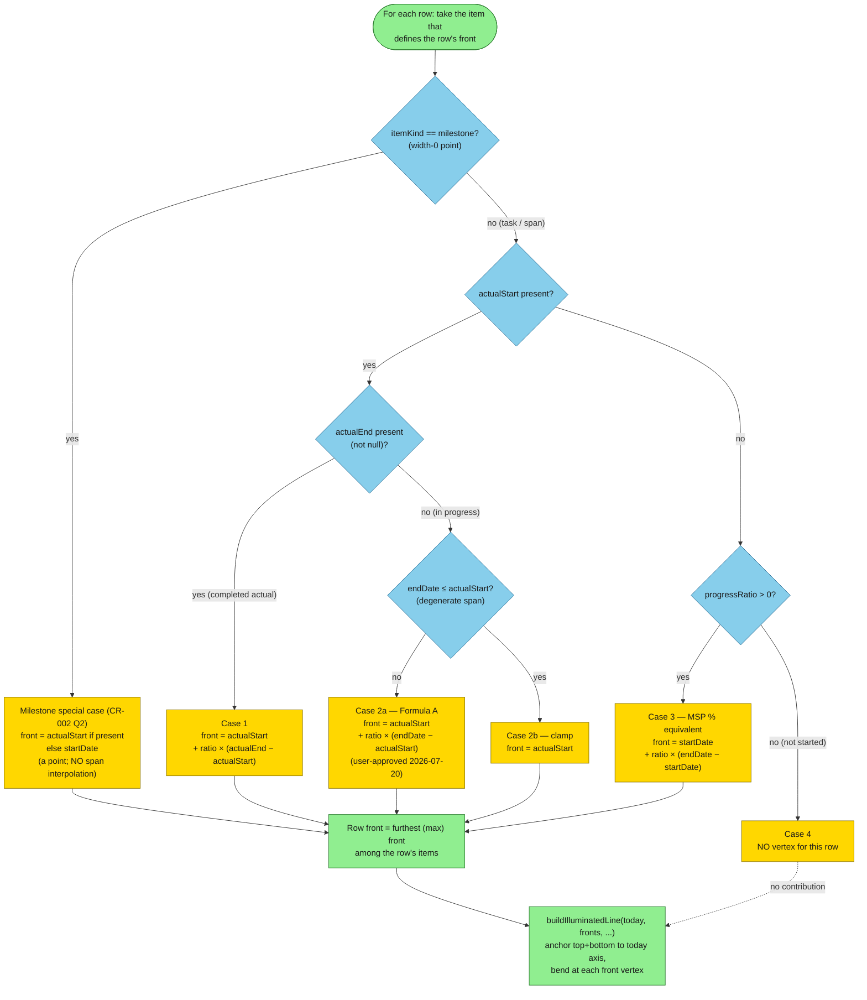

# Progress Line (イナズマ線) Front Computation — Decision Tree

The per-row progress-line **front** date computation implementing the 4-case
MECE rule from CR-001 §2 / PLAN-L2-001. This is a computation branch (not an
interaction), so it is drawn as a `flowchart` decision tree. The resulting
per-row front dates are then fed to `buildIlluminatedLine`
(`src/domain/usecase/progress-line-builder.ts`), which anchors the polyline to
today's vertical axis and routes it through each row's front vertex.

> Source basis: the ALGORITHM below is the **CR-001/CR-002 target (actual-date
> fields)** (4-case task rule using `actualStart`/`actualEnd`, plus the CR-002
> milestone special case). The current
> `src/adapters/render/layers/progress-today-layer.ts` `computeRowProgressFronts`
> implements only the legacy precursor (`front = startDate + ratio*(endDate-startDate)`
> over items with the current `planActualKind === 'actual'` discriminator), i.e.
> case (3) applied to a separate actual item. In the target, the discriminator
> becomes the presence of `actualStart`/`actualEnd` on the single item, per the
> tree below.

## Per-row front-date decision tree (CR-001/CR-002 target)



## Notes

- `ratio` = `progressRatio ?? 0` (absent treated as 0). In case 4 (`ratio === 0`
  and no `actualStart`) the row yields no vertex, so an untouched row leaves a gap
  the zig-zag skips.
- Cases 1–4 are the **task/span** rule, MECE over the predicates `{actualStart present}` ×
  `{actualEnd present}` × `{endDate ≤ actualStart}` × `{ratio > 0}`: exactly one leaf
  applies to any spanning item.
- **Milestone special case (CR-002 Q2 / PLAN-L2-001)**: a milestone is a width-0 point,
  so it has no span to interpolate. Its front degenerates to a single point —
  `actualStart` if present, else `startDate` — and the 4-case task branch is not
  evaluated for it.
- A front behind today's axis (delayed) sits to the PAST side (smaller worldX); a
  front ahead sits to the FUTURE side; on-time sits on the axis — this displacement is
  what makes the polyline zig-zag reveal bottlenecks (`buildIlluminatedLine` doc).
- Line visibility gate (renderer, not the algorithm): the progress line is skipped when
  `planActualDisplay === 'plan-only'` or `progressLineVisible === false`.

Flagged ambiguity (not guessed): CR-001 §2 defines the front formulas but not which
item "defines the row's front" when several items on one row qualify. The existing
renderer resolves this by taking the **furthest (max) front** per row
(`frontDay > current` wins in `computeRowProgressFronts`); the `Merge` node above keeps
that rule. If the CR-001/CR-002 target intends a different tie-break (e.g. per-item
vertices), that is a spec decision to confirm, not assumed here.
```
