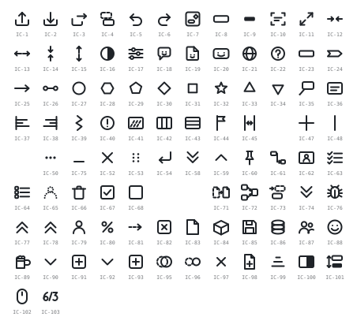

# 用語辞書 — 確定名の全数

**UID**: DOC-TBL-GLOSSARY
**Version**: 0.1

**本書が用語の正である。** 本書と食い違う名前を他所で見たら、本書が勝つ。
本書は `01-04-requirements.md` の Chapter 1.8 から参照される。

由来は前プロジェクトの命名確定版（`previous-project-result/03-ui-naming/ui-parts-ja.md` §2-1）である。

記法の規則と、単独で使ってはならない曖昧な日本語は **`01-04-requirements.md` の 1.9 表記規約**が持つ。ここには置かない。

> ⚠️ **数値（既定値・範囲）は本書に無い。** 本書が持つのは**名前**である。
> 値は `tbl-settings.md`（`DOC-TBL-SETTINGS`）が持つ。**名前と値を 2 か所で管理しない。**

## 1. データの語

**Type**: SECTION

**表 T-101 — データの語**

| 行 ID | 確定名（英） | 日本語 |
| --- | --- | --- |
| N-1 | `Task` | タスク。`milestone` が真のときマイルストーンである。⚠️ **描画の形は `TaskVisual.shapeKind` が別に持つ。混同しない**（往復の規則は表 T-016 の `PR-18`） |
| N-2 | `TaskGroup` | タスクグループ |
| N-3 | `TaskGroupMember` | タスクグループメンバー |
| N-4 | `stackOrder` | 積み順。**人が指定できるかどうかは表 T-014 の `ST-6` が定める** |
| N-4a | `Item` | **アイテム**。**当たり判定と選択の対象となるものの総称。** 全数は表 T-023c の `SL-1` が持つ。⚠️ **`Task` の別名ではない** —— 外延が広いので 1.9 の命名の規約（同じものを 2 つの語で呼ばない）には当たらない。**`Task` 1 つを指すときは「タスク」と書く** |
| N-5 | `CommentBox` / `commentBoxes` | コメントボックス 1 つ分の型と、文書が持つその配列の鍵。UI パーツ名は `Comment Boxes`（`U-14`） |
| N-6 | `HighlightBox` / `highlightBoxes` | ハイライトボックス 1 つ分の型と、文書が持つその配列の鍵。UI パーツ名は `Highlight Boxes`（`U-15`） |
| N-7 | `carry` / `carryElements` | 取り込んだ交換形式の項目を、解釈せずにそのまま持ち回るための入れ物 |
| N-8 | `Project` | プロジェクト。文書が表す 1 件 |
| N-9 | `Calendar` | 暦 |
| N-10 | `Resource` | 担当者。⚠️ **「資源」という日本語は、範囲の記述（表 T-002 の `SO-8` / `SO-9`）と外部通信（表 T-003 の `CN-6`）では別の意味である** |
| N-11 | `Assignment` | 割当。どの担当者がどのタスクに就くか |
| N-12 | `Dependency` | 依存。⚠️ **画面に描く線は `Dependency Lines`（`U-16`）であり、別の語である** |
| N-13 | `TaskVisual` | タスクの見せ方。形・色・名前の置き方 |
| N-14 | `TaskOrigin` | 取り込み元の記録 |

## 2. プロパティ

**Type**: SECTION

**表 T-102 — プロパティ**

| 行 ID | 確定名（英） | 日本語 |
| --- | --- | --- |
| P-1 | `name` | 名称 |
| P-2 | `notes` | 備考 |
| P-3 | `start` / `finish` | 開始日 / 終了日 |
| P-4 | `actualStart` / `actualFinish` | 実績開始日 / 実績終了日 |
| P-5 | `actualDuration` | 実績期間 |
| P-6 | `resume` | 再開予定日 |
| P-7 | `resumeValid` | 再開可否 |
| P-8 | `percentComplete` | 完了率 |
| P-9 | `deadline` | 期限 |
| P-10 | `shapeKind` | タスク形状（5 値。`'milestone'` のときだけ `milestoneGlyph` を見る） |
| P-11 | `'rectangle'` | 矩形（`===`）。**ASCII 表記の正は本表である** |
| P-12 | `'chevron'` | 矢羽根（`>===>`）。直訳ではない。例外は表 T-105 |
| P-13 | `'arrow'` | 矢印（`--->`） |
| P-14 | `'endpointSpan'` | 端点スパン（`*----*`）。「端点」と略さない |
| P-15 | `'milestone'` | マイルストーン（◇ ほか） |
| P-16 | `milestoneGlyph` | マイルストーン形状（〇 六角形 五角形 ◇ □ ☆ △ ▽） |
| P-17 | `actualPlacement` | 実績の置き方（`'inside'` = 内側 / `'below'` = 下 / `'atActualDate'` = 実績日）。`shapeKind` から導出する |
| P-18 | `strokeColor` / `fillColor` / `lineWeight` | 線色 / 塗り色 / 線の太さ |
| P-19 | `'transparent'` | 透明。`strokeColor` / `fillColor` / `TaskGroup.color` が取りうる値。`null`（選んでいない）とは別物である |
| P-20 | `nameAnchor` / `nameAlign` | 名称アンカー / 名称の揃え |
| P-21 | `fadeInDays` / `fadeOutDays` | フェードイン日数 / フェードアウト日数 |
| P-22 | `wbsParentUid` | WBS の親（深さは導出する） |
| P-23 | `linkType` | 依存の種別（4 値は表 T-018 が持つ） |

## 3. UI パーツ

**Type**: SECTION

**表 T-103 — UI パーツ**

| 行 ID | 確定名（英） | 日本語 |
| --- | --- | --- |
| U-1 | `Rows` | 行 |
| U-2 | `Task Bars` | タスクバー（**総称**）。`Plan Bar` と `Actual Bar` をまとめて指す。言い分ける規則は表 T-006b の `A-14` が持つ |
| U-3 | `Plan Bar` | 予定バー |
| U-4 | `Actual Bar` | 実績バー |
| U-5 | `Progress Marker` | 進捗マーカー |
| U-6 | `Resume Icon` | 再開アイコン |
| U-7 | `Name Label` | 名称ラベル |
| U-8 | `Assignee Label` | 担当ラベル |
| U-9 | `Progress Line` | イナズマ線。直訳ではない。例外は表 T-105 |
| U-10 | `Cursors` | カーソル |
| U-11 | `Status Line` | 基準日線。直訳ではない。例外は表 T-105。`Project.statusDate` の位置に引く縦線（`FR-046`）。⚠️ **「本日線」と呼んではならない（MUST NOT）** —— 本日以外を指せる |
| U-12 | `Dual Cursor` | デュアルカーソル |
| U-13 | `Guide Cursor` | ガイドカーソル |
| U-14 | `Comment Boxes` | コメントボックス。⚠️ **「コメント」と略さない（MUST NOT）** —— 本文だけを指すのか器を指すのかが読めなくなる。本文は「コメントボックスの本文」と書く |
| U-15 | `Highlight Boxes` | ハイライトボックス。**「囲み枠」と呼んではならない（MUST NOT）** |
| U-15a | `Annotations` | **注記**。コメントボックスとハイライトボックスをまとめて指す上位語 |
| U-16 | `Dependency Lines` | 依存線 |
| U-17 | `Date Grid Lines` | 日付罫線 |
| U-18 | `Group Grid Lines` | グループ罫線 |
| U-19 | `Time Ruler` | タイムルーラー |
| U-20 | `Watermark` | 透かし |
| U-21 | `Scrollbars` | スクロールバー |
| U-22 | `Row Title Panel` | 行見出しパネル |
| U-23 | `Row Title Tree` | 行見出しツリー。**`Row Title Panel` の中身**（パネルが画面領域、ツリーがその中の木の表示）。⚠️ **操作の入口を指すときは「行見出しパネル」と書くこと（MUST）** —— 入口を 2 つの語で呼ぶと `FR-029` に触れる（確定 2026-08-13） |
| U-24 | `Panel Divider` | パネル境界 |
| U-25 | `Properties Panel` | プロパティパネル |
| U-26 | `Command Palette` | コマンドパレット |
| U-27 | `Document Title` | 文書名。MSPDI の `Project/Title` に対応する。⚠️ **「表題」「題名」と呼んではならない（MUST NOT）** —— 同じ値を指す |
| U-28 | `Autosave Status` | 自動保存の状態 |
| U-29 | `Hidden Group Tab` | 非表示グループタブ |
| U-30 | `Help Modal` / `AI Export Modal` | ヘルプ / AI 出力 |
| U-31 | `App Header` | （画面に出ない構造名。日本語を当てない） |
| U-32 | `Schedule Canvas` | （同上） |
| U-33 | `Canvas Overlays` | （同上） |
| U-34 | `Palette Groups` / `Palette Commands` | （同上） |
| U-35 | `Header Commands` / `Branding` | （同上） |
| U-36 | `Agent API` | **`Agent API`**（日英とも同じ語を使い、訳語を当てない） |
| U-37 | `WatermarkUnlockPassword` | **透かし解除パスワード**。**「合言葉」と呼んではならない（MUST NOT）** —— 何のための語かが伝わらない。既定値と SHA-256 は `tbl-settings.md` の表 T-207 が持つ |
| U-38 | `ArmedShape` | **構え**。直訳ではない。例外は表 T-105。パレットで選んでいて「次に引いたら作られる / 結ばれるもの」。全数は表 T-023b が持つ。**「選択」と呼んではならない（MUST NOT）** —— 選択（`Selection`）は既にある対象を選ぶことであり、別の状態である |
| U-39 | `Selection` | **選択**。既にある対象を選ぶこと、およびその集合。描画領域の規則は表 T-023c、行の規則は `FR-085` が持つ |
| U-40 | `Marquee` | **範囲選択**。直訳ではない。例外は表 T-105。何にも当たらない場所からドラッグして矩形で選ぶこと |
| U-41 | `Percent Complete Label` | 完了率ラベル |
| U-42 | `Pointer` | ポインタ。マウスが指す点 |
| U-43 | `Grab Region` / `Grab Point` | 掴み領域 / 掴み点（全数と優先順位は表 T-023d が持つ） |
| U-44 | `Dialogue Field` | 対話欄 |
| U-45 | `GoodRelax Scheduler` | 本ソフトウェアの名称。略称は `GRS`。日本語に訳さない |
| U-46 | `Pinned Row` | ピン止めした行。縦にスクロールしても画面に残る |
| U-47 | `Row Expander` | 行の折り畳みの操作子。開く側と閉じる側の 2 つで 1 組 |
| U-48 | `Row Pin` | ピン止めの操作子。置き方は `FR-098` |
| U-49 | `Resource Roster` | 名簿。文書が持つ担当者の一覧。出し方と消し方は `FR-099` |
| U-50 | `Row Area` | （画面に出ない構造名。日本語を当てない）。**`Schedule Canvas` から `Time Ruler` の帯と余白を除いた、`Rows` が並ぶ領域。**左右は `Row Title Panel` と `Properties Panel` の内側 |
| U-52 | `Actual Operation Dummy` | 実績操作のダミー。**未着手のタスクに薄く出す掴みシロ。**文書のデータとしては存在しない（`FR-043`） |
| U-51 | `ScreenState` | （画面に出ない構造名。日本語を当てない）。文書に保存しない画面の値をまとめて持つ型の名。⚠️ **「画面の状態」と呼んではならない（MUST NOT）** —— その日本語は `tbl-settings.md` の表 T-203 と、本書の表 T-104 の `K-67` 〜 `K-72` / `K-110` / `K-111` が既に使っており、あちらは文書に保存する値である |
| U-53 | `Tooltip` | ツールチップ。何かに添えて出す説明。出す場面は `FR-092` の `EZ-2` ／ `FR-085` ／ `FR-037` が、振る舞いは表 T-028 の `IN-3` が持つ。⚠️ **重ねて開く面ではない**（表 T-028 の `IN-4`） |
| U-54 | `Export Chooser` | 書き出しの形式を選ぶ面。開く規則は `FR-096`、鍵は表 T-036 の `SK-12` が持つ |
| U-55 | `Confirmation` | 続けてよいかを問う面。問い方は表 T-037 の `NT-7`、2 択の入口は表 T-109 の `IC-69` / `IC-70` が持つ。⚠️ **通知（`Notice`）ではない** —— 通知は答えを求めない |
| U-56 | `Open Chooser` | 読んだ内容の扱い方を選ぶ面。選ばせる規則は 表 T-024a の `OP-3`、3 つの入口は表 T-109 の `IC-71` 〜 `IC-73` が持つ。⚠️ **`Confirmation` ではない** —— あちらは 2 択であり、表 T-037 の `NT-7` がそう定めている。⭐ **`Export Chooser`（`U-54`）の対である** |
| U-57 | `Notification Area` | 通知が立つ場所。作法は表 T-037 が、運ぶ理由は表 T-233 が持つ。⚠️ **`Confirmation` ではない** —— 通知は答えを求めない。⛔ **`Esc` の第 1 階層で閉じる「面」ではない**（`S-99g`） —— 重ねて開くものではなく、`NT-4` が起動時の用件を 1 枚に集約させるのもここである。⚠️ **値の型は `Notice` のままである** —— 本行が名づけるのは場所であって、立つものではない |

> **呼び名は `Agent API` とする。日本語でも `Agent API` と書く。**
> **「機械向けの口」「口」と呼んではならない（MUST NOT）。**
>
> **`AI API` を採らない理由**: 英語では「**AI を提供する API**」と読まれる（OpenAI API などと同型）。これは AI が叩く側の API なので向きが逆であり、**Chapter 2.4（表 T-009 の `XO-4`）「本ソフトウェアは AI 推論の実行系を持たない」と矛盾する。** `agent` は叩く側を名指しする語なので誤読が起きない。**同じ理由で再提案しないこと。**
>
> **公開する識別子は `grSchedulerAgentApi` とする。**
> `globalThis` に載る名前なので、**他のツールが公開する同種の API と衝突しないよう製品名の接頭辞を残す。**
> 概念とインターフェースの呼び名が `Agent API`、実際に公開する識別子が `grSchedulerAgentApi` であり、
> **面が違うだけで食い違いではない**（記法は表 T-006a）。

## 4. 設定値のキー

**Type**: SECTION

`documentSettings` が持つ設定値の**名前**の正はここである。**値（既定値・下限・上限・範囲の理由）は `tbl-settings.md`（`DOC-TBL-SETTINGS`）が持つ。**
⛔ を付けたものは文書に保存しない（読む人の環境である）。名前としては本書に載せる。

**表 T-104 — 設定値のキー**

| 行 ID | 群 | 確定名（英） | 日本語 |
| --- | --- | --- | --- |
| K-1 | タイムルーラー | `pxPerDayAt1x` | 1 日の幅（`zoomX` = 1） |
| K-2 | タイムルーラー | `rulerHeight` | 目盛の帯の高さ |
| K-3 | タイムルーラー | `rulerFont` | 目盛の文字 |
| K-112 | タイムルーラー | `rulerLabelGap` | 目盛ラベルどうしの隙間（横） |
| K-113 | タイムルーラー | `rulerLabelPad` | 罫線と目盛ラベルの余白（縦） |
| K-4 | 縦の寸法 | `basePlanHeight` | 予定の縦幅（`zoomY` = 1） |
| K-5 | 縦の寸法 | `actualOfPlan` | 実績 ÷ 予定 |
| K-6 | 縦の寸法 | `actualMin` | 実績の縦幅の下限 |
| K-7 | 縦の寸法 | `fontOfActual` | フォント ÷ 実績 |
| K-8 | 縦の寸法 | `fontMin` | 最小フォント |
| K-9 | 縦の寸法 | `thinFontScale` | 細線のフォント倍率 |
| K-10 | 縦の寸法 | `actualGap` | 予定から実績までの間隔（下に置くとき） |
| K-11 | 縦の寸法 | `stackGap` | 積み順の段の間隔 |
| K-12 | 縦の寸法 | `rowGap` | 行の間隔 |
| K-13 | 形状の縦幅 | `shapeHeightOf.rectangle` | 矩形 |
| K-14 | 形状の縦幅 | `shapeHeightOf.chevron` | 矢羽根 |
| K-15 | 形状の縦幅 | `shapeHeightOf.arrow` | 矢印 |
| K-16 | 形状の縦幅 | `shapeHeightOf.endpointSpan` | 端点スパン |
| K-17 | 形状の縦幅 | `shapeHeightOf.milestone` | マイルストーン |
| K-18 | 依存線 | `dependencyWidth` | 依存線の太さ |
| K-19 | 依存線 | `dependencyArrowLength` | 矢印の三角形の長さ |
| K-20 | 依存線 | `dependencyRunOfArrow` | 入口の走り ÷ 三角形 |
| K-22 | 進捗マーカー | `markerSize` | マーカー径 |
| K-23 | 進捗マーカー | `markerGap` | 実績の右端からの隙間 |
| K-24 | 進捗マーカー | `markerStroke` | 円の線の太さ |
| K-25 | 進捗マーカー | `resumeScaleInvalid` | 再開日未定のときの縮小率 |
| K-26 | 進捗マーカー | `resumeArmOfMarker` | 再開アイコンの腕の長さ ÷ マーカー |
| K-27 | 進捗マーカー | `resumeHeadOfMarker` | 再開アイコンの矢じり ÷ マーカー |
| K-28 | 進捗マーカー | `resumeDashOn` | 再開アイコンへ繋ぐ破線の実部 |
| K-29 | 進捗マーカー | `resumeDashOff` | 再開アイコンへ繋ぐ破線の空部 |
| K-30 | ラベル | `labelCoef` | 幅の概算係数 |
| K-31 | ラベル | `labelPad` | 形状の内側の余白 |
| K-32 | ラベル | `labelGap` | 形状の外へ出すときの隙間 |
| K-33 | ラベル | `labelBaseline` | ベースライン補正 |
| K-34 | ラベル | `labelHaloOfFont` | 縁取りの太さ ÷ フォント |
| K-35 | ラベル | `truncateUnits` | 打ち切り幅（半角換算） |
| K-36 | ラベル | `rowTitleFont` | 行名の文字 |
| K-37 | ラベル | `rowTitleIndent` | 行名の `TaskGroup` の深さ 1 段ぶんのインデント |
| K-38 | ラベル | `rowTitleTopScale` | `TaskGroup` 深さ 1 の行名の倍率 |
| K-39 | 形状の細部 | `planStroke` | 予定の輪郭線 |
| K-40 | 形状の細部 | `thinStrokeOfPlan` | 細線の太さ ÷ その形状の予定の縦幅 |
| K-41 | 形状の細部 | `thinStrokeMin` | 細線の太さの下限 |
| K-42 | 形状の細部 | `thinStrokeMax` | 細線の太さの上限 |
| K-43 | 形状の細部 | `chevronNotchOfHeight` | 矢羽根の切り欠き ÷ 高さ |
| K-44 | 形状の細部 | `chevronNotchOfWidth` | 矢羽根の切り欠き ÷ 幅 |
| K-45 | 形状の細部 | `arrowHeadOfStroke` | 矢印の矢じり ÷ 線の太さ |
| K-46 | 形状の細部 | `arrowHeadOfSpan` | 矢印の矢じり ÷ 全長（上限） |
| K-47 | 形状の細部 | `spanDotOfStroke` | 端点スパンの点の半径 ÷ 線の太さ |
| K-48 | 形状の細部 | `starInnerOfOuter` | ☆ の内接半径 ÷ 外接半径 |
| K-49 | 形状の細部 | `minShapeWidth` | ゼロ期間でも残す最小幅 |
| K-50 | イナズマ線 | `progressLineWidth` | イナズマ線の太さ |
| K-51 | イナズマ線 | `progressLineOverhang` | 上下へのはみ出し |
| K-52 | LOD | `rulerTierPxPerDayMonth` | 目盛が「年」から「年 ＋ 月」に変わる px/day |
| K-53 | LOD | `rulerTierPxPerDayWeek` | 目盛が「年 ＋ 月」から「年 ＋ 月 ＋ 週」に変わる px/day |
| K-54 | LOD | `rulerTierPxPerDayDay` | 目盛が「年 ＋ 月 ＋ 週」から「年 ＋ 月 ＋ 日 ＋ 曜日」に変わる px/day |
| K-55 | LOD | `taskLevelOfDetailReadablePx` | この幅を割った WBS の深さは描かない |
| K-56 | LOD | `groupLevelOfDetailBase` | グループ LOD の初項 |
| K-57 | LOD | `groupLevelOfDetailRatio` | グループ LOD の公比 |
| K-58 | LOD | `stackSafetyCap` | 積み順の安全弁 |
| K-59 | テーマ | `themePreference` | 明暗テーマ（**ダークモード**はこの値の `'dark'` を指す通称） |
| K-60 | テーマ | `themeHue` | テーマの色相 |
| K-61 | テーマ | `themeMonochrome` | モノクロにするか |
| K-62 | ズーム | `zoomStep` ⛔ | 1 ノッチの倍率 |
| K-63 | ズーム | `zoomMin` ⛔ | 下限 |
| K-64 | ズーム | `zoomMax` ⛔ | 上限 |
| K-65 | ズーム | `canvasPadding` | キャンバスの余白 |
| K-67 | 画面の状態 | `zoomX` | 横のズーム倍率 |
| K-68 | 画面の状態 | `zoomY` | 縦のズーム倍率 |
| K-69 | 画面の状態 | `scrollDate` | 表示の左端が指す日付 |
| K-70 | 画面の状態 | `scrollGroupId` | 表示の上端が指す行 |
| K-71 | 画面の状態 | `rowTitlePanelWidth` | `Row Title Panel` の幅 |
| K-72 | 画面の状態 | `propertyPanelWidth` | `Properties Panel` の幅 |
| K-110 | 画面の状態 | `pinnedGroupIds` | ピン止めの対象 |
| K-111 | 画面の状態 | `pinnedRowMax` | ピン止めの件数の上限 |
| K-73 | 表示の切り替え | `stackDirection` | 積む向き |
| K-74 | 表示の切り替え | `planActualDisplay` | 予実の表示 |
| K-75 | 表示の切り替え | `assigneeVisible` | 担当ラベル |
| K-76 | 表示の切り替え | `percentCompleteVisible` | 完了率ラベル |
| K-77 | 表示の切り替え | `dependencyVisible` | 依存線 |
| K-78 | 表示の切り替え | `progressMarkerVisible` | 進捗マーカー |
| K-79 | 表示の切り替え | `progressLineVisible` | イナズマ線 |
| K-80 | 表示の切り替え | `dualCursor` | デュアルカーソル |
| K-81 | 表示の切り替え | `guideCursorMode` | ガイドカーソル |
| K-82 | 表示の切り替え | `dateGridLinesVisible` | 日付罫線（日付ごとの縦線） |
| K-83 | 表示の切り替え | `groupGridLinesVisible` | グループ罫線（`TaskGroup` 境界の横線） |
| K-84 | 表示の切り替え | `baselineVisible` | 変更前の予定を重ねるか |
| K-85 | 表示の切り替え | `fontScale` | 文字サイズ |
| K-86 | 表示の切り替え | `importSeq` | 取込の連番 |
| K-87 | 出力 | `exportCanvas` | SVG / PNG の出力サイズ |
| K-88 | 出力 | `exportPngScale` | PNG の倍率 |
| K-91 | 予実の補助線 | `planActualGuideWeight` | 補助線の太さ |
| K-92 | 予実の補助線 | `planActualGuidePattern` | 補助線の破線の刻み |
| K-93 | 予実の補助線 | `planActualGuideColor` | 補助線の色 |
| K-94 | フェード | `fadeHandleHalfPx` | フェード掴み点の半辺 |
| K-95 | フェード | `fadeHandleStrokePx` | フェード掴み点の枠線 |
| K-96 | 保存と上限 | `autosaveIdleMs` | 自動保存の操作の切れ目 |
| K-97 | 保存と上限 | `importMaxBytes` | 取り込むファイルの上限 |
| K-98 | 保存と上限 | `importMaxItems` | 取り込む `Task` の件数の上限 |
| K-99 | 保存と上限 | `importMaxDepth` | WBS のネストの深さの上限 |
| K-100 | 画面の寸法 | `appHeaderMaxHeight` | `App Header` の高さの上限 |
| K-101 | 透かし | `watermarkOpacity` | 透かしの濃さ |
| K-102 | 構造の上限 | `maxGroupDepth` | `TaskGroup` の深さの上限 |
| K-103 | 保存と上限 | `importMinDate` / `importMaxDate` | 受け入れる日付の範囲 |
| K-104 | 依存線 | `dependencyLagDefault` | 依存を作ったときに置くラグ |
| K-105 | 文字サイズ | `fontScaleSizes.S` / `fontScaleSizes.M` / `fontScaleSizes.L` | 文字サイズの段（S / M / L）の px |
| K-106 | 画面の寸法 | `iconHintDelayMs` | アイコンの説明を出すまでの待ち時間 |
| K-107 | 予実 | `actualInitialDuration` | 掴んだときの実績期間 |
| K-108 | 予実 | `milestoneActualDuration` | マイルストーンの実績期間 |
| K-109 | 予実 | `dummyOpacity` | ダミーの濃さ |
| K-90 | 保存しないもの（別枠） | `language` ⛔ | 表示言語（`ja` / `en`）。置き場と規則は表 T-206 の `S-99` |

**キーに関する規約:**

- **`palette` を設定値の名前に使わないこと（MUST NOT）。** `Command Palette` / `Palette Groups` / `Palette Commands` が既にあり、同じ語が別のものを指すことになる。
- **スクロール位置の名前は `scrollDate` と `scrollGroupId` とし、`scrollX` / `scrollY` にしない。** px で持たない規則と理由は `FR-080` が持つ。
- **時間軸のしきい値は 1 つの配列にせず、境目ごとに別のキーとして名づける。** キーは表 T-205 の `S-83` 〜 `S-85`。まとめない規則と理由は `FR-017` が持つ。
- 基準日の名前は `Project.statusDate`。設定値ではないという規則と理由は `FR-046` が持つ。

## 4a. 価値のことば

**Type**: SECTION

**表 T-106 — 価値のことば**

| 行 ID | ことば | 意味 |
| --- | --- | --- |
| VK-1 | **ぬるサク** | 目標 `GL-003` が述べる状態を指すことば |
| VK-2 | **すぐわか** | 目標 `GL-006` が述べる状態を指すことば |
| VK-3 | **ペライチ** | 目標 `GL-001` / `GL-002` が述べる状態を指すことば |

## 5. 直訳しない語

**Type**: SECTION

日本語ラベルは英語の確定名の直訳とする。意訳・別語・語順の反転を禁止する（MUST NOT）。
**例外は表 T-105 の 5 件だけである。増やすときは必ず本表に追記すること（MUST）。**
「なんとなく違う」を許すと規則が崩れる。

**表 T-105 — 直訳しない語（例外）**

| 行 ID | 英語 | 日本語 | 例外にする理由 |
| --- | --- | --- | --- |
| X-1 | `Progress Line` | イナズマ線 | 日本の日程管理で定着した語である。「進捗線」に変えると日本の利用者に通じなくなり、目標 `GL-006`（マニュアルを読まずに使える）に反する |
| X-2 | `chevron` | 矢羽根 | 図形名としての直訳は「山形」だが、要望の入力が「矢羽根」を使っており、日程表の文脈で意味が通る。英語側は世界共通の図形名 `chevron` を使う（コードは英語で書くため） |
| X-3 | `ArmedShape` | 構え | **英語は「構えている形状」というものを指し、日本語は「構えている」という状態を指す。** 直訳の「構えた形状」は画面の語として長く、`Selection` との対比が読めない |
| X-4 | `Marquee` | 範囲選択 | **`Marquee` は選ぶための矩形そのものを指し、「範囲選択」は操作を指す。** 直訳の「マーキー」は日程表の文脈で通じない |
| X-5 | `Status Line` | 基準日線 | **直訳の「状態線」では意味が取れない。**「基準線」は表 T-006b の `A-9` が変更前の予定の訳語として予約しているので使えない |

## 6. `Agent API` のメンバ

**Type**: SECTION

**`Agent API` は 1 つの面に 18 のメンバをフラットに並べる。** 用途別に分けない理由は Chapter 5.2 が持つ（`R2.5`）。
**引数・戻り値は `src/` の公開エントリが持ち、境界値は Chapter 6.1 が持つ。本表は名前と、何を担うかだけを持つ。**

**表 T-107 — `Agent API` のメンバ**

| 行 ID | 群 | 確定名 | 品詞と純粋性 | 何を担うか | 正 |
| --- | --- | --- | --- | --- | --- |
| AM-1 | 版 | `agentApiVersion` | プロパティ・`semi-pure-a` | `Agent API` の版。呼ぶ側が最初に読む | 表 T-035 の `AG-1` |
| AM-2 | 版 | `schemaVersion` | プロパティ・`semi-pure-a` | この版の `GRS` が読み書きする文書の形式の版。いま開いている文書が持つ値は `AM-3` で読む | 表 T-052 の `DR-4` |
| AM-3 | 読む | `readDocument` | 動詞＋目的語・`semi-pure-b` | 文書ぜんたいの凍結された複製。ルートの 3 群すべてを含む | 表 T-035 の `AG-4` ／ 表 T-052 の `DR-1` |
| AM-4 | 読む | `readStamp` | 動詞＋目的語・`semi-pure-b` | 文書の刻印。楽観ロックの照合に用いる | 表 T-035 の `AG-2` ／ `FR-063` |
| AM-5 | 読む | `readSelection` | 動詞＋目的語・`semi-pure-b` | いま選ばれている対象。選んだ順序を保つ | 表 T-023c の `SL-1` / `SL-7b` |
| AM-6 | 読む | `readDialogueMessages` | 動詞＋目的語・`semi-pure-b` | 人が確定した発話。文書には保存されない | 表 T-035 の `AG-11` ／ `FR-066` |
| AM-7 | 書く | `applyCommands` | 動詞＋目的語・`non-pure` | 一括の書き込み。原子的に適用し、受理したか否かを値で返す | `FR-028` ／ 表 T-035 の `AG-3` / `AG-9a` |
| AM-8 | 書く | `importDocument` | 動詞＋目的語・`non-pure` | 取り込みと合流 | `FR-087` / `FR-022` ／ 表 T-032a |
| AM-9 | 履歴 | `undoEdit` | 動詞＋目的語・`non-pure` | 履歴を戻す | `FR-031` ／ 表 T-035 の `AG-10` |
| AM-10 | 履歴 | `redoEdit` | 動詞＋目的語・`non-pure` | 履歴を進める | `FR-031` |
| AM-11 | 出す | `exportJson` | 動詞＋目的語・`semi-pure-b` | `GRS JSON` を値で返す | 表 T-024 の `IO-2` ／ `FR-024` ／ 表 T-035 の `AG-7` |
| AM-12 | 出す | `exportMspdi` | 動詞＋目的語・`semi-pure-b` | 交換形式を値で返す | 表 T-024 の `IO-1` ／ `FR-021` |
| AM-13 | 出す | `exportSvg` | 動詞＋目的語・`semi-pure-b` | 画面を縮めた絵を値で返す | 表 T-024 の `IO-3` ／ `FR-080` |
| AM-14 | 出す | `exportPng` | 動詞＋目的語・`semi-pure-b` | 画像を値で返す。失敗も値で返す | 表 T-024 の `IO-4` ／ `FR-025` ／ 表 T-035 の `AG-8` |
| AM-15 | 出す | `exportEmbeddedHtml` | 動詞＋目的語・`semi-pure-b` | 本体と文書を合わせた 1 つの `.html` を値で返す | 表 T-024 の `IO-7` ／ `FR-067` |
| AM-16 | 見せる | `focusTask` | 動詞＋目的語・`non-pure` | 指定したタスクが見える位置へ表示を寄せる | `FR-055` ／ 表 T-203 の `S-77` / `S-78` |
| AM-17 | 待つ | `watchChanges` | 動詞＋目的語・`non-pure` | 自分以外が確定した変更と発話を待つ | 表 T-035 の `AG-6` / `AG-11` |
| AM-18 | 話す | `postDialogueMessage` | 動詞＋目的語・`non-pure` | AI が確定した発話を対話欄へ置く | `FR-066` ／ 表 T-035 の `AG-11` |

⚠️ **見せ方の群を読む面も、書く面も置かない。** 見せ方の群は文書の一部であり（表 T-052 の `DR-1` / `DR-3`）、
**読むのは `AM-3`、書くのは `AM-7` である。** 別の面を立てると、同じものへの道が 2 本になる（1.9）。

⚠️ **クリップボードと `localStorage` は本表に無い。** 理由は表 T-024 の `IO-5` / `IO-6` の用途にある ——
**前者は保存と復旧、後者は他のアプリへ画像を渡す経路であり、どちらも値で受け取る相手を持たない。**

## 7. `DocumentCommand` の全数

**Type**: SECTION

**本表は `applyDocumentChange` が受け取る命令の全数である**（表 T-064 の `PI-8`）。
**引数・戻り値は `src/` の公開エントリが持ち、境界値は Chapter 6.1 が持つ。従う規則は「正」の列が指す要求が持つ。本表は名前と、何を担うかだけを持つ。**

⚠️ **`組` の欄が ⭐ の行は、複数の列にまたがる MUST を 1 つの命令へ畳んだものである。** 畳むのは**その MUST の持ち主を作るため**であり、`AG-9a` が拒むときに何を指しているかがこれで決まる。⚠️ **原子性のためではない** —— 束の単位で原子的に適用することは 表 T-035 の `AG-3` が既に定めている。

**表 T-108 — `DocumentCommand` の全数**

| 行 ID | 群 | 確定名 | 組 | 何を担うか | 正 |
| --- | --- | --- | --- | --- | --- |
| CM-1 | `Project` | `setProjectTitle` | — | 文書名を変える | `FR-035` |
| CM-2 | `Project` | `setProjectProfile` | — | 基本情報を直す | `FR-074` |
| CM-3 | `Project` | `setStatusDate` | — | 基準日を置く・動かす | `FR-046` |
| CM-4 | `Project` | `clearStatusDate` | — | 基準日を消す | `FR-046` |
| CM-5 | `Project` | `setThemeHue` | — | テーマの色相を変える | `FR-041` |
| CM-6 | `Task` | `createTask` | ⭐ | タスクを作る | `FR-001` |
| CM-7 | `Task` | `deleteTask` | — | タスクを消す | `FR-032` |
| CM-8 | `Task` | `pasteTaskSubtree` | ⭐ | 部分木を複製する | `FR-033` |
| CM-9 | `Task` | `setTaskName` | — | 名称を変える | `FR-091` |
| CM-10 | `Task` | `setTaskNotes` | — | 備考を置く | `FR-006` |
| CM-11 | `Task` | `setTaskPlanDates` | ⭐ | 予定の開始・終了を置く | `FR-012` |
| CM-12 | `Task` | `setTaskDeadline` | — | 期限を置く | `FR-006` |
| CM-13 | `Task` | `setTaskPlanActualState` | ⭐ | 予実の 5 列を置く | `FR-010` |
| CM-14 | `Task` | `beginTaskActual` | ⭐ | 実績を置き始める | `FR-043` |
| CM-15 | `Task` | `cycleTaskPlanActualState` | ⭐ | 予実の状態を巡らせる | `FR-013` |
| CM-16 | `Task` | `setTaskFadeInDays` | — | フェードイン日数を置く | `FR-075` |
| CM-17 | `Task` | `setTaskFadeOutDays` | — | フェードアウト日数を置く | `FR-075` |
| CM-18 | `Task` | `setTaskWbsParent` | — | WBS の親を移す | `FR-005` |
| CM-19 | `Task` | `moveTaskToTaskGroup` | — | 別の行へ載せ替える | `FR-005` |
| CM-20 | `TaskVisual` | `setTaskVisualShapeKind` | — | タスク形状を変える | `FR-083` |
| CM-21 | `TaskVisual` | `setTaskVisualMilestoneGlyph` | — | マイルストーン形状を変える | `FR-078` |
| CM-22 | `TaskVisual` | `setTaskVisualColors` | ⭐ | 線色と塗り色を置く | `FR-007` |
| CM-23 | `TaskVisual` | `resetTaskVisualColors` | ⭐ | 色をテーマ追随へ戻す | `FR-007` |
| CM-24 | `TaskVisual` | `setTaskVisualLineWeight` | — | 線の太さを置く | `FR-007` |
| CM-25 | `TaskVisual` | `setTaskVisualNamePlacement` | ⭐ | 名称ラベルの位置を置く | `FR-002` |
| CM-26 | `TaskGroup` | `createTaskGroup` | ⭐ | 行を作る | `FR-085` |
| CM-27 | `TaskGroup` | `deleteTaskGroup` | — | 行を消す | `FR-032` |
| CM-28 | `TaskGroup` | `pasteTaskGroupSubtree` | ⭐ | 行の部分木を複製する | `FR-033` |
| CM-29 | `TaskGroup` | `setTaskGroupLabel` | — | 行の名前を変える | `FR-085` |
| CM-30 | `TaskGroup` | `setTaskGroupColor` | — | 行の色を置く | `FR-042` |
| CM-31 | `TaskGroup` | `resetTaskGroupColor` | — | 行の色をテーマ追随へ戻す | `FR-007` |
| CM-32 | `TaskGroup` | `setTaskGroupHeight` | — | 行の高さを置く | `FR-042` |
| CM-33 | `TaskGroup` | `setTaskGroupCollapsed` | — | 行を畳む・開く | `FR-004` |
| CM-34 | `TaskGroup` | `setTaskGroupHidden` | — | 行を隠す・戻す | `FR-004` |
| CM-35 | `TaskGroup` | `reorderTaskGroupSiblings` | ⭐ | 兄弟の並びを変える | `FR-005` |
| CM-36 | `Dependency` | `createDependency` | ⭐ | 依存線を引く | `FR-009` |
| CM-37 | `Dependency` | `deleteDependency` | — | 依存線を消す | `FR-032` |
| CM-38 | `Dependency` | `setDependencyLag` | ⭐ | ラグを変える | `FR-009` |
| CM-39 | `Calendar` | `setCalendar` | ⭐ | 暦と週の始まりを直す | `FR-088` |
| CM-40 | `Resource` | `createResource` | — | 担当者を足す | `FR-008` |
| CM-41 | `Resource` | `setResourceName` | — | 担当者の名前を変える | `FR-008` |
| CM-42 | `Resource` | `deleteResource` | — | 選んだ担当者を消す | `FR-099` |
| CM-43 | `Resource` | `deleteUnreferencedResources` | — | 未参照をまとめて消す | `FR-099` |
| CM-44 | `Assignment` | `createAssignment` | — | 担当者を就ける | `FR-008` |
| CM-45 | `Assignment` | `unassignResource` | — | 割当を解く | `FR-008` |
| CM-46 | `CommentBox` | `createCommentBox` | — | コメントボックスを置く | `FR-019` |
| CM-47 | `CommentBox` | `deleteCommentBox` | — | コメントボックスを消す | `FR-032` |
| CM-48 | `CommentBox` | `setCommentBoxText` | — | 本文を書く | `FR-097` |
| CM-49 | `CommentBox` | `setCommentBoxLeaderShapeKind` | — | 引出し線の形を選ぶ | `FR-019` |
| CM-50 | `CommentBox` | `setCommentBoxAnchor` | — | 留め先を変える | `FR-016` |
| CM-51 | `CommentBox` | `setCommentBoxBodyOffsetPx` | — | 本文のずれを変える | `FR-016` |
| CM-52 | `HighlightBox` | `createHighlightBox` | — | ハイライトボックスを置く | `FR-019` |
| CM-53 | `HighlightBox` | `deleteHighlightBox` | — | ハイライトボックスを消す | `FR-032` |
| CM-54 | `HighlightBox` | `setHighlightBoxRange` | — | 囲む範囲を変える | `FR-016` |
| CM-55 | `HighlightBox` | `setHighlightBoxStrokeColor` | — | 枠の色を置く | `FR-019` |
| CM-56 | 見せ方の群 | `setStackDirection` | — | 積む向きを選ぶ | `FR-003` |
| CM-57 | 見せ方の群 | `setPlanActualDisplay` | — | 予実の表示を選ぶ | `FR-049` |
| CM-58 | 見せ方の群 | `setElementVisible` | — | 要素の表示を切り替える | `FR-049` |
| CM-59 | 見せ方の群 | `setGuideCursorMode` | — | ガイドカーソルを選ぶ | `FR-048` |
| CM-60 | 見せ方の群 | `setDualCursor` | ⭐ | 2 本のカーソルを置く | `FR-082` |
| CM-61 | 見せ方の群 | `clearDualCursor` | — | 2 本のカーソルを解く | `FR-082` |
| CM-62 | 見せ方の群 | `setFontScale` | ⭐ | 文字サイズの段を変える | `FR-039` |
| CM-63 | 見せ方の群 | `setThemePreference` | — | 明暗テーマを選ぶ | `FR-039` |
| CM-64 | 見せ方の群 | `setThemeMonochrome` | — | モノクロを選ぶ | `FR-041` |
| CM-65 | 見せ方の群 | `setZoom` | ⭐ | 表示倍率を変える | `FR-016` |
| CM-66 | 見せ方の群 | `setScrollPosition` | — | 表示位置を変える | `FR-051` |
| CM-67 | 見せ方の群 | `setPanelWidths` | ⭐ | パネル幅を変える | `FR-052` |
| CM-68 | 見せ方の群 | `pinTaskGroup` | — | 行をピン止めする | `FR-098` |
| CM-69 | 見せ方の群 | `unpinTaskGroup` | — | ピン止めを外す | `FR-098` |
| CM-70 | 見せ方の群 | `setExportPngScale` | — | PNG の倍率を選ぶ | `FR-025` |
| CM-71 | 見せ方の群 | `fitScheduleToScreen` | ⭐ | 全体が収まる倍率と表示位置を置く | `FR-055` |
| CM-72 | `TaskGroup` | `expandAllTaskGroups` | ⭐ | 畳んだ行をすべて開く | `FR-055`（表 T-051 の `HF-8`）|

⚠️ **`群` は対象の確定名（表 T-058 のエンティティ）と、どのエンティティにも属さない見せ方の群である。**

## 8. アイコンの名簿

**Type**: SECTION

**本表はアイコンの全数である**（`FR-029`）。**73 行ある。**
⭐ **図形は 図 F-019 が正であり、本表は図形を語で説明しない**（1.9）—— 語で書き取らない理由は `FR-029` が持つ。**繋ぎ目は行 ID `IC-nn` だけである** —— 図では各図形の下に刷り、本表では第 1 列に立つ。
**`面` の欄は 表 T-103 の確定名である。** 新しい面の名を作らない。
⚠️ **本表は英名の欄を持たない** —— 持つと 73 個の確定名を新たに作ることになる。**表 T-012 の `SH-5` が既に書いている表記だけを使う。** ⭐ **`milestoneGlyph` の 8 つの綴りは CR-172（版 0.53）が決めており、`_source/erd.json` が持つ** —— 本表に写さない。
⚠️ **`図形` の欄を持たないのも同じ理由である。** ⭐ **図形を持たない行は無い** —— 全 73 行が 図 F-019 に図形を持つ。**新しく起こした図形を実物と見比べて選び直す義務は 表 T-026 の `RC-13` が持つ。**

**表 T-109 — アイコンの全数**

| 行 ID | 面 | 群 | 何の入口か | 正 |
| --- | --- | --- | --- | --- |
| IC-1 | `App Header` | 文書 | 文書を開く | `FR-087`（表 T-024a の `OP-2`）|
| IC-2 | `App Header` | 文書 | 開いたファイルへ上書き保存する | `FR-060` |
| IC-3 | `App Header` | 文書 | 書き出す形式を選ぶ | `FR-096`（表 T-036 の `SK-12`）|
| IC-4 | `App Header` | 文書 | 変更前の予定の重ねを出す・しまう（`S-69`）。⚠️ **ファイルを読む入口ではない** —— 読む入口は `IC-1` 1 つであり、重ねを選ぶのは 表 T-024a の `OP-3` の第 3 の選択肢である（同 `OP-9`）| `FR-049`（`FR-015`）|
| IC-5 | `App Header` | 履歴 | 編集を取り消す | `FR-031` |
| IC-6 | `App Header` | 履歴 | 取り消した編集をやり直す | `FR-031` |
| IC-7 | `App Header` | 表示 | コマンドパレットを出す・しまう（`S-99e`）| `FR-053` |
| IC-8 | `App Header` | 表示 | 予定を出す・しまう（`S-59` の 3 値のうち）| `FR-049` |
| IC-9 | `App Header` | 表示 | 実績を出す・しまう（同上）| `FR-049` |
| IC-10 | `App Header` | 表示 | 全体を 1 画面に収める | `FR-055` |
| IC-11 | `App Header` | 表示 | 全画面表示に入り、同じ入口で出る（`S-99f`）| `FR-071` |
| IC-12 | `App Header` | 表示 | 時間軸を縮小する（`S-75`）| `FR-018` |
| IC-13 | `App Header` | 表示 | 時間軸を拡大する（`S-75`）| `FR-018` |
| IC-14 | `App Header` | 表示 | 行軸を縮小する（`S-76`）| `FR-018` |
| IC-15 | `App Header` | 表示 | 行軸を拡大する（`S-76`）| `FR-018` |
| IC-16 | `App Header` | 表示 | 明暗テーマを選ぶ（`S-72`）| `FR-039` |
| IC-17 | `App Header` | 表示 | 文書の描画設定をプロパティパネルに出す | `FR-072` |
| IC-18 | `App Header` | AI | AI との対話欄を出す・しまう | `FR-066` |
| IC-19 | `App Header` | AI | AI へ渡す文書を画面で確かめて写す | `FR-068` |
| IC-20 | `App Header` | AI | `Agent API` を有効にする・無効にする | `FR-065` |
| IC-21 | `App Header` | 補助 | 表示言語を選ぶ（`S-99`）。⚠️ **入口を 2 か所に置く唯一の例外である**（`FR-029`）| `FR-038` |
| IC-22 | `App Header` | 補助 | ヘルプを開く | `FR-036` |
| IC-23 | `Command Palette` | 置く | 矩形を構える（表 T-012 の `SH-1`）| `FR-083` |
| IC-24 | `Command Palette` | 置く | 矢羽根を構える（`SH-2`）| `FR-083` |
| IC-25 | `Command Palette` | 置く | 矢印を構える（`SH-3`）| `FR-083` |
| IC-26 | `Command Palette` | 置く | 端点スパンを構える（`SH-4`）| `FR-083` |
| IC-27 | `Command Palette` | 置く | マイルストーンを 〇 で構える（表 T-012 の `SH-5`）| `FR-078` |
| IC-28 | `Command Palette` | 置く | 同・六角形 | `FR-078` |
| IC-29 | `Command Palette` | 置く | 同・五角形 | `FR-078` |
| IC-30 | `Command Palette` | 置く | 同・◇ | `FR-078` |
| IC-31 | `Command Palette` | 置く | 同・□ | `FR-078` |
| IC-32 | `Command Palette` | 置く | 同・☆（内外比は `S-48`）| `FR-078` |
| IC-33 | `Command Palette` | 置く | 同・△ | `FR-078` |
| IC-34 | `Command Palette` | 置く | 同・▽ | `FR-078` |
| IC-35 | `Command Palette` | 置く | コメントボックスを構える（表 T-023b の `AR-5`）| `FR-019` |
| IC-36 | `Command Palette` | 置く | ハイライトボックスを構える（`AR-6`）| `FR-019` |
| IC-37 | `Command Palette` | 揃える | 選んだものを開始日で揃える | `FR-034` |
| IC-38 | `Command Palette` | 揃える | 選んだものを終了日で揃える | `FR-034` |
| IC-39 | `Command Palette` | 表示 | イナズマ線を出す・しまう（`S-64`）| `FR-049`（`FR-014`）|
| IC-40 | `Command Palette` | 表示 | 進捗マーカーを出す・しまう（`S-63`）| `FR-049`（`FR-013`）|
| IC-41 | `Command Palette` | 表示 | 透かしをしまう（解除パスワードを求める）| `FR-020` |
| IC-42 | `Command Palette` | 表示 | 日付罫線を出す・しまう（`S-67`）| `FR-049`（`FR-089`）|
| IC-43 | `Command Palette` | 表示 | グループ罫線を出す・しまう（`S-68`）| `FR-049`（`FR-042`）|
| IC-44 | `Command Palette` | カーソル | 基準日を置く・動かす・消す。⚠️ **「本日線」と呼んではならない**（表 T-103 の `U-11`）| `FR-046` |
| IC-45 | `Command Palette` | カーソル | デュアルカーソルの 2 本を置く（`S-65`）| `FR-082` |
| IC-46 | `Command Palette` | カーソル | ガイドカーソルを `'none'` にする（`S-66`。4 値排他）| `FR-048` |
| IC-47 | `Command Palette` | カーソル | 同・`'crosshair'` | `FR-048` |
| IC-48 | `Command Palette` | カーソル | 同・`'single-vertical'` | `FR-048` |
| IC-49 | `Command Palette` | カーソル | 同・`'double-vertical'` | `FR-048` |
| IC-50 | `Command Palette` | 置く | マイルストーンの図形の一覧を開く | `FR-078` |
| IC-51 | `Command Palette` | 置く | 同・畳む | `FR-078` |
| IC-52 | `Help Modal` / `AI Export Modal` / `Resource Roster` / `Export Chooser` / `Open Chooser` | — | 開いている面を閉じる | 表 T-028 の `IN-4` |
| IC-53 | `Command Palette` | — | 掴んで動かせることを示す。**ボタンではない** | `FR-053` |
| IC-54 | `Command Palette` | 構え | いま構えている図形を示す。**ボタンではない** | 表 T-023b |
| IC-55 | `Autosave Status` | — | 保存済みであることを示す。**ボタンではない** | `FR-061` |
| IC-56 | `Autosave Status` | — | 保存中であることを示す。**ボタンではない。回さない** | `FR-061` |
| IC-57 | `Autosave Status` | — | 保存に失敗したことを示す。**ボタンではない**（通知は 表 T-037 の `NT-3a`）| `FR-061` |
| IC-58 | `Row Title Panel` | — | 行の配下を 1 段開く | 表 T-051 の `HF-2` |
| IC-59 | `Row Title Panel` | — | 行の配下をすべて閉じる | 表 T-051 の `HF-3` |
| IC-60 | `Row Title Panel` | — | 行をピン止めし、同じ入口で外す | `FR-098` |
| IC-61 | `Command Palette` | 置く | 依存線を構える（表 T-023b の `AR-4`）| `FR-009` |
| IC-62 | `Command Palette` | 表示 | 担当者の名簿を出す | `FR-099` |
| IC-63 | `Resource Roster` | — | 一覧のすべてを選ぶ | `FR-099` |
| IC-64 | `Resource Roster` | — | 一覧の選択をすべて解く | `FR-099` |
| IC-65 | `Resource Roster` | — | どの割当からも参照されていない担当者を選ぶ | `FR-099`（表 T-108 の `CM-43`）|
| IC-66 | `Resource Roster` | — | 選んだ担当者を消す | `FR-099`（表 T-108 の `CM-42`）|
| IC-67 | `Resource Roster` | — | 選ばれていることを示し、同じ入口で解く | `FR-099` |
| IC-68 | `Resource Roster` | — | 選ばれていないことを示し、同じ入口で選ぶ | `FR-099` |
| IC-69 | `Confirmation` | — | 問いに「続ける」と答える | 表 T-037 の `NT-7` |
| IC-70 | `Confirmation` | — | 問いに「取りやめる」と答える | 表 T-037 の `NT-7` |
| IC-71 | `Open Chooser` | — | 読んだ内容で現在の文書を置き換える | 表 T-024a の `OP-3` |
| IC-72 | `Open Chooser` | — | 読んだ内容を現在の文書へ合流させる | 表 T-024a の `OP-3` |
| IC-73 | `Open Chooser` | — | 読んだ内容を変更前の予定として重ねる | 表 T-024a の `OP-3` |

**図 F-019 — アイコンの図形**

⭐ **本図は本仕様書が持つ原稿であり、生成物ではない** —— `source/build.py` が読むのは `components.json` と `overview.json` だけで、本図に触れない。**5.2 と 6.2 が生成物へ課す禁止は、本図に掛からない。**
⭐ **図形は本プロジェクトが起こしたものであり、第三者の素材ではない** —— 8 つのマイルストーンの図形は 1 つの外接円に内接し、☆ の内外比は `tbl-settings.md` の `S-48` である。**本プロジェクトの設定値と一致する図形が第三者の素材であることはない。** これが 表 T-003 の `CN-7` に対する判断の根拠である。**差し替えの禁止そのものは `FR-029` が持つ。**

