# 状態機械 — 状態・出来事・遷移

**UID**: DOC-TBL-STATE-MACHINES
**Version**: 0.1

> ⛔ 本書は生成物である。  
> 手で直さない —— 直しても次の `npm run gen` で消える。
> **状態機械の唯一の正は `_source/state-machines.json` である。**  
> 本書はそれを `_source/state_machines_json_to_md.py` が印字したものである。
> **作り直す**: `npm run gen` ／ **ズレを検出する**: `npm run gen:check`。

本書は、保存しない状態の状態機械（`05-07-design.md` の 5.6 の ADR-002）を、領域ごとに印字したものである。  
原稿が持つもの・持たないものは `05-07-design.md` の 表 T-250 が、状態機械の形は 表 T-249 が持つ。  
キーの読み方は `05-07-design.md` の 5.5 が持つ。

## 画面の値（`screen`）

**表 T-280 — 画面の値の状態**

| 行 ID | キー | 親 | 初期 | 運ぶ値 | 根拠 |
| --- | --- | --- | --- | --- | --- |
| SM-0 | `screen` | — | ○ | `language` ／ `rememberedActuals` | `CP-36` ・ `S-99` ・ `PV-4` |
| SM-1 | `screen.armed.none` | `screen` | ○ | — | `AR-1` |
| SM-2 | `screen.armed.taskShape` | `screen` | — | `shapeKind`（`SH-1` ・ `SH-2` ・ `SH-3` ・ `SH-4`） | `AR-2` ・ `IC-23` ・ `IC-24` ・ `IC-25` ・ `IC-26` |
| SM-3 | `screen.armed.milestoneShape` | `screen` | — | `glyph`（`SH-5`） | `AR-3` ・ `IC-27` |
| SM-4 | `screen.armed.dependency` | `screen` | — | — | `AR-4` ・ `IC-61` |
| SM-5 | `screen.armed.commentBox` | `screen` | — | — | `AR-5` ・ `IC-35` |
| SM-6 | `screen.armed.highlightBox` | `screen` | — | — | `AR-6` ・ `IC-36` |
| SM-7 | `screen.palette.shown` | `screen` | ○ | — | `S-99e` |
| SM-8 | `screen.palette.shown.expanded` | `screen.palette.shown` | ○ | — | `S-200` ・ `FR-053` |
| SM-9 | `screen.palette.shown.minimised` | `screen.palette.shown` | — | — | `S-200` ・ `IC-75` |
| SM-10 | `screen.palette.hidden` | `screen` | — | — | `S-99e` |
| SM-11 | `screen.milestoneList.closed` | `screen` | ○ | — | `S-142` ・ `FR-053` |
| SM-12 | `screen.milestoneList.open` | `screen` | — | — | `S-142` ・ `IC-50` |
| SM-13 | `screen.fullScreen.normal` | `screen` | ○ | — | `S-99f` |
| SM-14 | `screen.fullScreen.full` | `screen` | — | — | `S-99f` ・ `FR-071` |
| SM-15 | `screen.surface.none` | `screen` | ○ | — | `S-99g` |
| SM-16 | `screen.surface.open` | `screen` | — | `surfaceName`（`U-30` ・ `U-49` ・ `U-54` ・ `U-56` ・ `U-60` ・ `U-61` ・ `U-62`） | `S-99g` ・ `IC-52` |
| SM-17 | `screen.watermark.shown` | `screen` | ○ | — | `S-144` |
| SM-18 | `screen.watermark.hidden` | `screen` | — | — | `WM-8` |
| SM-19 | `screen.properties.none` | `screen` | ○ | — | `S-99h` |
| SM-20 | `screen.properties.selection` | `screen` | — | `subject`（選択と行の集合） | `S-99h` ・ `IR-2` ・ `FR-072` |
| SM-21 | `screen.properties.documentSettings` | `screen` | — | `returnSubject`（同じ入口をもう一度押したときに戻す選択物。無いこともある） | `S-99h` ・ `FR-072` ・ `IC-17` |
| SM-22 | `screen.dialogueField.shown` | `screen` | ○ | — | `S-99i` |
| SM-23 | `screen.dialogueField.hidden` | `screen` | — | — | `S-99i` ・ `FR-066` |
| SM-24 | `screen.levelZero.unfolded` | `screen` | ○ | — | `S-211` |
| SM-25 | `screen.levelZero.folded` | `screen` | — | — | `HR-2` ・ `S-211` |
| SM-26 | `screen.dualCursor.off` | `screen` | ○ | — | `DC-1` |
| SM-27 | `screen.dualCursor.on` | `screen` | — | — | `DC-1` ・ `PTD-2` |
| SM-28 | `screen.dualCursor.on.date1Following` | `screen.dualCursor.on` | ○ | — | `DC-1` |
| SM-29 | `screen.dualCursor.on.date2Following` | `screen.dualCursor.on` | — | — | `DC-2` ・ `DC-8` |
| SM-30 | `screen.scaleMessage.none` | `screen` | ○ | — | `SE-1` |
| SM-31 | `screen.scaleMessage.shown` | `screen` | — | `percent` ／ `end`（`max` ・ `min` ・ なし） | `SE-2` ・ `ZE-5` ・ `S-244` |
| SM-32 | `screen.tooltip.allowed` | `screen` | ○ | — | `IN-3` |
| SM-33 | `screen.tooltip.dismissed` | `screen` | — | — | `IN-3` ・ `IN-4` |

**表 T-281 — 画面の値の出来事**

| 行 ID | キー | どこから来るか | 運ぶ値 |
| --- | --- | --- | --- |
| EV-1 | `paletteToggled` | 入力: `IC-7` ・ `SK-14` | — |
| EV-2 | `paletteMinimiseToggled` | 入力: `IC-75` | — |
| EV-3 | `milestoneListToggled` | 入力: `IC-50` | — |
| EV-4 | `fullScreenEntryPressed` | 入力: `IC-11` ・ `SK-15` | — |
| EV-5 | `fullScreenChanged` | 副作用の結果（ブラウザの `fullscreenchange`）: `FR-071` | `isFullScreen` |
| EV-6 | `surfaceEntryPressed` | 入力: `IC-22` ・ `SK-13` ・ `IC-19` ・ `IC-62` ・ `IC-2` ・ `SK-12` | `surfaceName` |
| EV-7 | `surfaceRaisedByFlow` | 副作用の結果（ファイルの領域が面を立てる）: `OP-3` ・ `U-56` ・ `U-61` ・ `U-62` | `surfaceName` |
| EV-8 | `surfaceCloseAsked` | 入力: `IC-52` | `target`（閉じる対象。面かパネルか） |
| EV-9 | `escapePressed` | 入力（`Esc`）: `IN-4` | `rung`（消費する `IN-4` の段の語。呼び手が詰める） |
| EV-10 | `armEntryPressed` | 入力: `IC-23` ・ `IC-24` ・ `IC-25` ・ `IC-26` ・ `IC-27` ・ `IC-61` ・ `IC-35` ・ `IC-36` ・ `FR-016` | `armKind` ／ `shapeKind` ／ `glyph` |
| EV-11 | `watermarkEntryPressed` | 入力: `IC-41` ・ `WM-10` | — |
| EV-12 | `watermarkUnlockAnswered` | 入力（`U-60` の答え）: `U-60` ・ `WM-6` ・ `WM-7` | `isProceeding` |
| EV-13 | `watermarkUnlockMatched` | 副作用の結果（照合）: `WM-6` ・ `WM-8` | — |
| EV-14 | `watermarkUnlockMismatched` | 副作用の結果（照合）: `WM-8` | — |
| EV-15 | `settingsEntryPressed` | 入力: `IC-17` ・ `FR-072` | — |
| EV-16 | `propertiesOfChoiceAsked` | 入力（パネルを出すことを要求が名指した押下。員数は各要求が持つ）: `FR-072` | `subject` |
| EV-17 | `selectionMoved` | ほかの領域の結果（選択）: `FR-072` | `subject`（空もありうる） |
| EV-18 | `createdNameSettled` | 入力（作った直後の名前の `Enter`）: `FR-091` | — |
| EV-19 | `settleKeyPressed` | 入力（`SK-19` の 2 段目）: `SK-19` ・ `FR-070` | `noSurfaceNoConfirmation` ／ `noUnsettledEntry` |
| EV-20 | `dialogueFieldEntryPressed` | 入力: `IC-18` ・ `FR-066` | `agentApiEnabled` |
| EV-21 | `foldAllPressed` | 入力（`HF-12` の操作子）: `HF-12` ・ `HR-2` | — |
| EV-22 | `levelZeroOpened` | 入力: `HF-16` ・ `HF-10` ・ `HF-17` ・ `S-211` | — |
| EV-23 | `dualCursorEntryPressed` | 入力: `IC-45` ・ `DC-1` ・ `DC-4` | `date`（置く日付） ／ `hasDaysToPlace` |
| EV-24 | `dualCursorPlaced` | 入力（`Row Area` のクリック）: `DC-2` ・ `PTD-2` | `date`（置く日付） |
| EV-25 | `displayScaleStepped` | 入力: `IC-104` ・ `IC-105` ・ `SK-22` ・ `SK-23` ・ `SK-17` ・ `SE-1` | `percent` ／ `end` |
| EV-26 | `rowZoomEndReached` | 副作用の結果（行の軸のズームが端に当たった）: `ZE-5` | `percent` ／ `end` |
| EV-27 | `scaleMessageTimeElapsed` | 時間: `S-244` ・ `SE-3` | — |
| EV-28 | `displayLanguageChosen` | 入力: `IC-21` ・ `FR-038` | `language` |
| EV-29 | `progressMarkerPressed` | 入力（進捗マーカーの押下）: `GA-18` ・ `FR-107` ・ `PV-4` | `taskUid` ／ `rememberedActual`（覚える実績） |
| EV-30 | `pointerRestElapsed` | 時間: `EZ-2` | — |

**表 T-282 — 画面の値の遷移**

| 行 ID | 元 | 出来事 | ガード | 先 | 副作用 | 根拠 |
| --- | --- | --- | --- | --- | --- | --- |
| TN-1 | `screen.palette.shown` | `paletteToggled`（`EV-1`） | — | `screen.palette.hidden` | — | `S-99e` ・ `IC-7` |
| TN-2 | `screen.palette.hidden` | `paletteToggled`（`EV-1`） | — | `screen.palette.shown` | — | `S-99e` ・ `IC-7` ・ `FR-053` |
| TN-3 | `screen.palette.shown.expanded` | `paletteMinimiseToggled`（`EV-2`） | — | `screen.palette.shown.minimised` | — | `FR-053` |
| TN-4 | `screen.palette.shown.minimised` | `paletteMinimiseToggled`（`EV-2`） | — | `screen.palette.shown.expanded` | — | `FR-053` ・ `IC-75` |
| TN-5 | `screen.milestoneList.closed` | `milestoneListToggled`（`EV-3`） | — | `screen.milestoneList.open` | — | `FR-053` |
| TN-6 | `screen.milestoneList.open` | `milestoneListToggled`（`EV-3`） | — | `screen.milestoneList.closed` | — | `FR-053` |
| TN-7 | `screen.fullScreen.normal` ／ `screen.fullScreen.full` | `fullScreenEntryPressed`（`EV-4`） | — | 自己 | `askBrowserForFullScreen` | `FR-071` ・ `S-99f` |
| TN-8 | `screen.fullScreen.normal` | `fullScreenChanged`（`EV-5`） | `isFullScreen` | `screen.fullScreen.full` | — | `FR-071` |
| TN-9 | `screen.fullScreen.full` | `fullScreenChanged`（`EV-5`） | not `isFullScreen` | `screen.fullScreen.normal` | — | `FR-071` |
| TN-10 | `screen.surface.none` | `surfaceEntryPressed`（`EV-6`） | — | `screen.surface.open` | — | `S-99g` |
| TN-11 | `screen.surface.none` | `surfaceRaisedByFlow`（`EV-7`） | — | `screen.surface.open` | — | `OP-3` ・ `U-61` ・ `U-62` |
| TN-12 | `screen.surface.open` | `surfaceCloseAsked`（`EV-8`） | `isSurfaceTarget` | `screen.surface.none` | `tellFlowSurfaceClosed` | `IC-52` |
| TN-13 | `screen.surface.open` | `escapePressed`（`EV-9`） | `rungIsSurface` | `screen.surface.none` | `tellFlowSurfaceClosed` | `IN-4` ・ `WM-9` |
| TN-14 | `screen.armed.none` | `armEntryPressed`（`EV-10`） | — | `screen.armed.{armKind}` | — | `FR-016` ・ `AR-2` ・ `AR-3` ・ `AR-4` ・ `AR-5` ・ `AR-6` |
| TN-15 | `screen.armed.taskShape` ／ `screen.armed.milestoneShape` ／ `screen.armed.dependency` ／ `screen.armed.commentBox` ／ `screen.armed.highlightBox` | `armEntryPressed`（`EV-10`） | `isSameArm` | `screen.armed.none` | — | `FR-016` ・ `SP-4` |
| TN-16 | `screen.armed.taskShape` ／ `screen.armed.milestoneShape` ／ `screen.armed.dependency` ／ `screen.armed.commentBox` ／ `screen.armed.highlightBox` | `armEntryPressed`（`EV-10`） | not `isSameArm` | `screen.armed.{armKind}` | — | `FR-016` |
| TN-17 | `screen.armed.taskShape` ／ `screen.armed.milestoneShape` ／ `screen.armed.dependency` ／ `screen.armed.commentBox` ／ `screen.armed.highlightBox` | `escapePressed`（`EV-9`） | `rungIsArmed` | `screen.armed.none` | — | `FR-016` ・ `IN-4` |
| TN-18 | `screen.armed.taskShape` ／ `screen.armed.milestoneShape` ／ `screen.armed.dependency` ／ `screen.armed.commentBox` ／ `screen.armed.highlightBox` | `dualCursorEntryPressed`（`EV-23`） | `entersDualCursor` | `screen.armed.none` | — | `FR-016` |
| TN-19 | `screen.watermark.shown` & `screen.surface.none` | `watermarkEntryPressed`（`EV-11`） | — | `screen.surface.open`（`surfaceName` は `U-60`） | — | `WM-6` ・ `WM-10` |
| TN-20 | `screen.watermark.hidden` | `watermarkEntryPressed`（`EV-11`） | — | `screen.watermark.shown` | — | `WM-10` ・ `IC-41` |
| TN-21 | `screen.surface.open` | `watermarkUnlockAnswered`（`EV-12`） | `isWatermarkUnlockSurface` & `isProceeding` | 自己 | `matchWatermarkUnlock` | `WM-6` |
| TN-22 | `screen.surface.open` | `watermarkUnlockAnswered`（`EV-12`） | `isWatermarkUnlockSurface` & not `isProceeding` | `screen.surface.none` | — | `WM-9` |
| TN-23 | `screen.watermark.shown` & `screen.surface.open` | `watermarkUnlockMatched`（`EV-13`） | `isWatermarkUnlockSurface` | `screen.watermark.hidden` & `screen.surface.none` | — | `WM-8` |
| TN-24 | `screen.surface.open` | `watermarkUnlockMismatched`（`EV-14`） | `isWatermarkUnlockSurface` | 自己（面を閉じない） | `raiseNotice`（`RS-41`） | `WM-8` ・ `RS-41` |
| TN-25 | `screen.properties.none` | `settingsEntryPressed`（`EV-15`） | — | `screen.properties.documentSettings` | — | `FR-072` |
| TN-26 | `screen.properties.selection` | `settingsEntryPressed`（`EV-15`） | — | `screen.properties.documentSettings`（`subject` を `returnSubject` に移す） | — | `FR-072` ・ `IC-17` |
| TN-27 | `screen.properties.documentSettings` | `settingsEntryPressed`（`EV-15`） | — | `screen.properties.selection`（`returnSubject` を `subject` に戻す） | — | `FR-072` |
| TN-28 | `screen.properties.none` ／ `screen.properties.documentSettings` | `propertiesOfChoiceAsked`（`EV-16`） | — | `screen.properties.selection` | — | `FR-072` |
| TN-29 | `screen.properties.selection` | `propertiesOfChoiceAsked`（`EV-16`） | — | 自己（`subject` を書き換える） | — | `FR-072` |
| TN-30 | `screen.properties.selection` | `selectionMoved`（`EV-17`） | `hasChoice` | 自己（`subject` を書き換える） | — | `FR-072` |
| TN-31 | `screen.properties.selection` ／ `screen.properties.documentSettings` | `surfaceCloseAsked`（`EV-8`） | `isPanelTarget` | `screen.properties.none` | — | `IC-52` ・ `FR-072` |
| TN-32 | `screen.properties.selection` ／ `screen.properties.documentSettings` | `escapePressed`（`EV-9`） | `rungIsSurface` & `isPanelTopmost` | `screen.properties.none` | — | `IN-4` ・ `FR-070` |
| TN-33 | `screen.properties.none` ／ `screen.properties.selection` ／ `screen.properties.documentSettings` | `createdNameSettled`（`EV-18`） | — | `screen.properties.none` | `clearSelection` | `FR-091` |
| TN-34 | `screen.properties.selection` ／ `screen.properties.documentSettings` | `settleKeyPressed`（`EV-19`） | `noSurfaceNoConfirmation` & `noUnsettledEntry` | `screen.properties.none` | — | `SK-19` ・ `FR-070` |
| TN-35 | `screen.dialogueField.shown` | `dialogueFieldEntryPressed`（`EV-20`） | `agentApiEnabled` | `screen.dialogueField.hidden` | — | `S-99i` ・ `IC-18` |
| TN-36 | `screen.dialogueField.hidden` | `dialogueFieldEntryPressed`（`EV-20`） | `agentApiEnabled` | `screen.dialogueField.shown` | — | `S-99i` ・ `IC-18` |
| TN-37 | `screen.dialogueField.shown` ／ `screen.dialogueField.hidden` | `dialogueFieldEntryPressed`（`EV-20`） | not `agentApiEnabled` | 自己 | `raiseNotice`（`RS-35`） | `FR-066` ・ `RS-35` |
| TN-38 | `screen.levelZero.unfolded` | `foldAllPressed`（`EV-21`） | — | `screen.levelZero.folded` | `writeFoldAll` | `HR-2` ・ `HF-12` |
| TN-39 | `screen.levelZero.folded` | `levelZeroOpened`（`EV-22`） | — | `screen.levelZero.unfolded` | `writeOpenLevel` | `HF-16` ・ `HF-10` ・ `HF-17` ・ `S-211` |
| TN-40 | `screen.dualCursor.off` | `dualCursorEntryPressed`（`EV-23`） | `hasDaysToPlace` | `screen.dualCursor.on` | `writePlaceDualCursor` | `DC-1` |
| TN-41 | `screen.dualCursor.on.date1Following` | `dualCursorPlaced`（`EV-24`） | — | `screen.dualCursor.on.date2Following` | `writeFixDate1` | `DC-2` ・ `DC-6` |
| TN-42 | `screen.dualCursor.on.date2Following` | `dualCursorPlaced`（`EV-24`） | — | `screen.dualCursor.on.date1Following` | `writeFixDate2` | `DC-2` ・ `DC-6` |
| TN-43 | `screen.dualCursor.on` | `dualCursorEntryPressed`（`EV-23`） | — | `screen.dualCursor.off` | `writeClearDualCursor` | `DC-4` |
| TN-44 | `screen.dualCursor.on` | `escapePressed`（`EV-9`） | `rungIsDualCursor` | `screen.dualCursor.off` | `writeClearDualCursor` | `DC-7` ・ `IN-4` |
| TN-45 | `screen.scaleMessage.none` | `displayScaleStepped`（`EV-25`） | — | `screen.scaleMessage.shown` | `startScaleMessageTimer` | `SE-1` ・ `SE-2` |
| TN-46 | `screen.scaleMessage.none` | `rowZoomEndReached`（`EV-26`） | — | `screen.scaleMessage.shown` | `startScaleMessageTimer` | `ZE-5` ・ `SE-2` |
| TN-47 | `screen.scaleMessage.shown` | `displayScaleStepped`（`EV-25`） | — | 自己（中身を書き換える） | `restartScaleMessageTimer` | `SE-4` |
| TN-48 | `screen.scaleMessage.shown` | `rowZoomEndReached`（`EV-26`） | — | 自己（中身を書き換える） | `restartScaleMessageTimer` | `SE-4` ・ `ZE-5` |
| TN-49 | `screen.scaleMessage.shown` | `scaleMessageTimeElapsed`（`EV-27`） | — | `screen.scaleMessage.none` | — | `SE-3` |
| TN-50 | `screen` | `displayLanguageChosen`（`EV-28`） | — | 自己（`language` を書き換える） | `storeLanguage` | `S-99` ・ `FR-038` |
| TN-51 | `screen` | `progressMarkerPressed`（`EV-29`） | — | 自己（`rememberedActuals` を書き換える） | `writeProgressStep` | `FR-107` ・ `PV-4` |
| TN-52 | `screen.tooltip.allowed` | `escapePressed`（`EV-9`） | `rungIsTooltip` | `screen.tooltip.dismissed` | — | `IN-3` ・ `IN-4` |
| TN-53 | `screen.tooltip.dismissed` | `pointerRestElapsed`（`EV-30`） | — | `screen.tooltip.allowed` | — | `IN-3` ・ `EZ-2` |

**図 F-026 — 画面の値の状態遷移**

軸ごとに 1 つの図に分けて示す。軸どうしは直交する。  
矢印のラベルは遷移の行 ID だけであり、出来事・ガード・副作用は 表 T-282 が持つ。  
⚠️ 図は畳んである —— 同じ遷移が 3 つ以上の兄弟の種類のどの 2 つの間も結ぶか、それらのどれからも同じ 1 つの種類へ出るか、同じ 1 つの種類から入るときは、兄弟を 1 つの箱に囲み、その遷移を箱から 1 本だけ描く（どの 2 つの間も結ぶ遷移は、箱の注に行 ID を書く）。  
⭐ 遷移の全数は 表 T-282 が持つ。

根（`screen`）が元の遷移 `TN-50` ・ `TN-51` は図に描かず、表 T-282 だけが持つ。

### F-026 の軸 `armed`

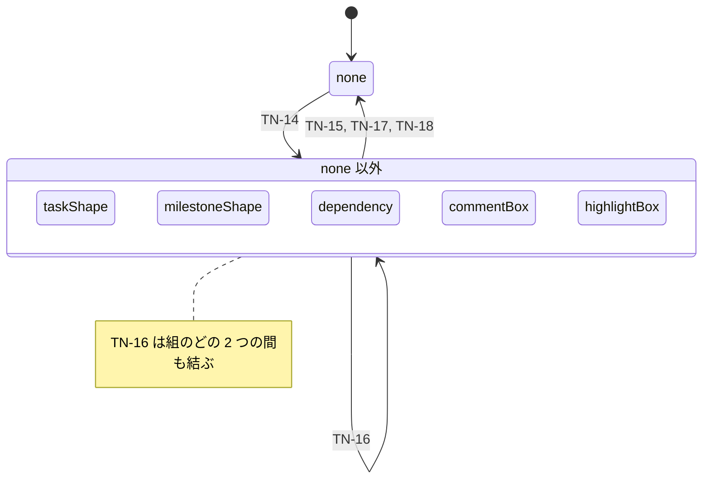

### F-026 の軸 `palette`

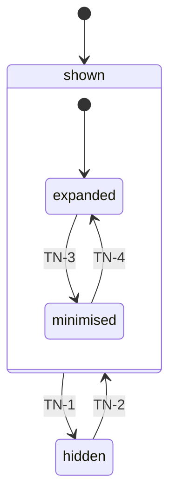

### F-026 の軸 `milestoneList`

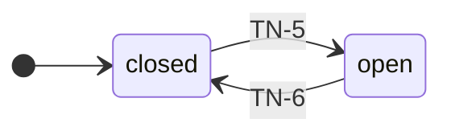

### F-026 の軸 `fullScreen`

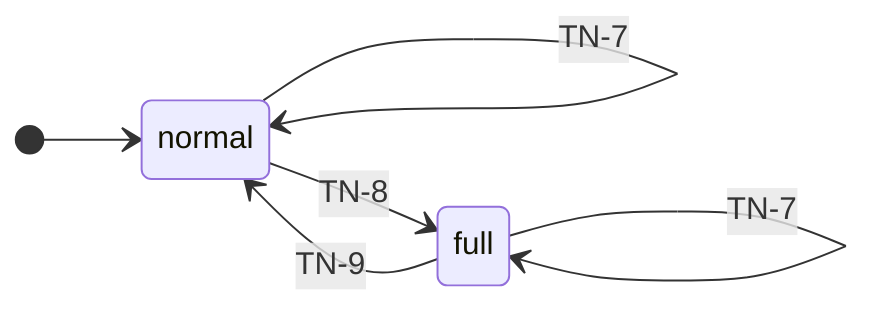

### F-026 の軸 `surface`

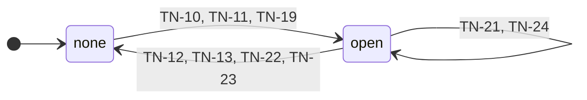

### F-026 の軸 `watermark`

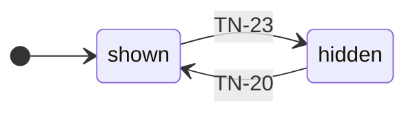

### F-026 の軸 `properties`

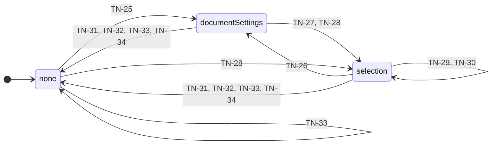

### F-026 の軸 `dialogueField`

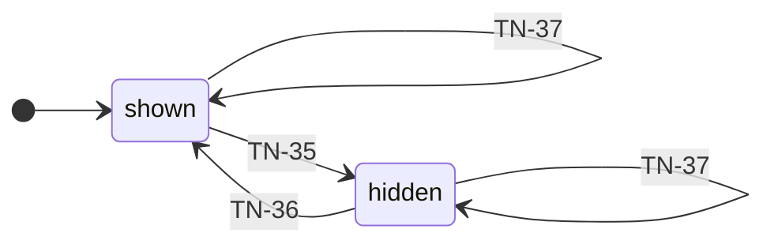

### F-026 の軸 `levelZero`

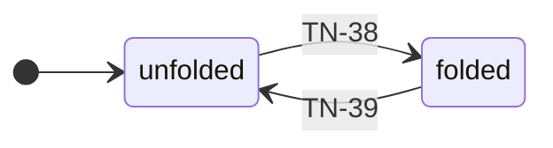

### F-026 の軸 `dualCursor`

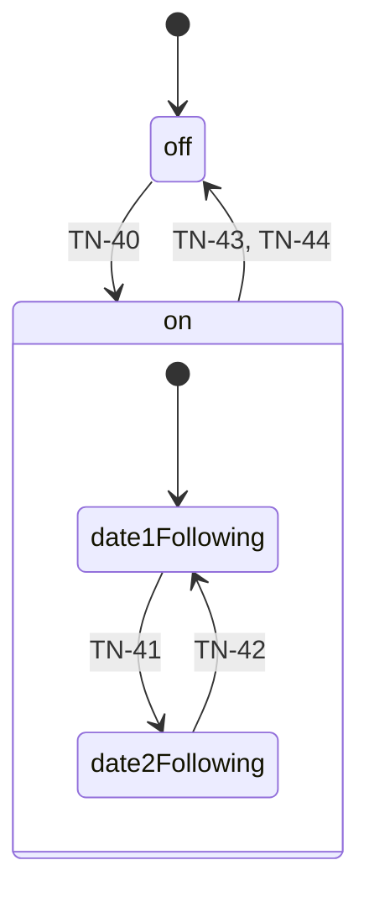

### F-026 の軸 `scaleMessage`

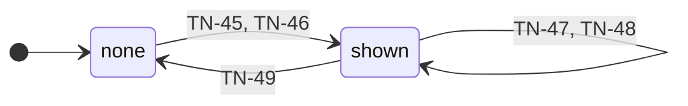

### F-026 の軸 `tooltip`

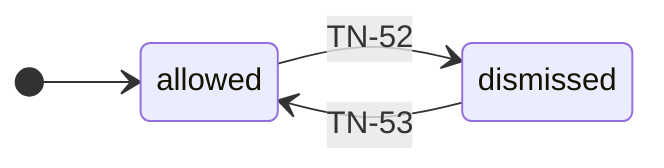

## 通知（`notices`）

**表 T-286 — 通知の状態**

| 行 ID | キー | 親 | 初期 | 運ぶ値 | 根拠 |
| --- | --- | --- | --- | --- | --- |
| SM-34 | `notices` | — | ○ | — | `FR-076` |
| SM-35 | `notices.onScreen.none` | `notices` | ○ | — | `NT-8` ・ `IN-4` |
| SM-36 | `notices.onScreen.standing` | `notices` | — | `standing`（出ている通知の列。古い順。1 つは理由と件数） | `FR-076` ・ `NT-3` ・ `NT-8` ・ `IN-4` ・ `SK-19` ・ `IR-3` |
| SM-37 | `notices.delivery.idle` | `notices` | ○ | — | `WS-7` |
| SM-38 | `notices.delivery.delivering` | `notices` | — | — | `WS-2` ・ `RS-9` ・ `CA-3` |

**表 T-287 — 通知の出来事**

| 行 ID | キー | どこから来るか | 運ぶ値 |
| --- | --- | --- | --- |
| EV-31 | `noticeRaised` | 副作用の結果（副作用 `raiseNotice` の実行。ほかの領域の遷移とシェルの流れが返す）: `FR-076` ・ `NT-3` | `reason`（表 T-233 の `RS-` の行、または 表 T-220 の行） ／ `affectedCount`（無いこともある） |
| EV-32 | `newestNoticeDismissAsked` | 入力（`Esc`（`IN-4` の第 1 段）／ `Enter`（`SK-19` の第 1 段）。段は呼び手が決め、同じ入力のほかの何よりも先に進める）: `NT-8` ・ `IN-4` ・ `SK-19` | — |
| EV-33 | `noticeDismissPressed` | 入力（1 つの通知の `OK` の入口を押して離した）: `NT-8` | `reason`（押された通知の理由。`NT-3` の束ねで 1 つの理由に 1 枚なので、理由が通知を 1 つに決める） |
| EV-34 | `documentReplaced` | 副作用の結果（`WS-6` の差し替えが済み、`WS-7` の配りが始まる）: `WS-6` ・ `WS-7` | — |
| EV-35 | `changeDelivered` | 副作用の結果（`WS-7` の配りが終わった）: `WS-7` ・ `AG-6` | `silentWatchers`（答えを返さなかった配り先の数） |

**表 T-288 — 通知の遷移**

| 行 ID | 元 | 出来事 | ガード | 先 | 副作用 | 根拠 |
| --- | --- | --- | --- | --- | --- | --- |
| TN-54 | `notices.onScreen.none` | `noticeRaised`（`EV-31`） | — | `notices.onScreen.standing`（1 枚） | — | `FR-076` ・ `NT-8` |
| TN-55 | `notices.onScreen.standing` | `noticeRaised`（`EV-31`） | `isSameReasonStanding` | 自己（その 1 枚の件数を増やし、いちばん新しい位置へ動かす） | — | `NT-3` |
| TN-56 | `notices.onScreen.standing` | `noticeRaised`（`EV-31`） | not `isSameReasonStanding` | 自己（いちばん新しいものとして足す。枚数に上限を置かない） | — | `NT-3` ・ `NT-8` |
| TN-57 | `notices.onScreen.standing` | `newestNoticeDismissAsked`（`EV-32`） | `isOnlyOneStanding` | `notices.onScreen.none` | — | `NT-8` |
| TN-58 | `notices.onScreen.standing` | `newestNoticeDismissAsked`（`EV-32`） | not `isOnlyOneStanding` | 自己（いちばん新しいものを除く） | — | `NT-8` |
| TN-59 | `notices.onScreen.standing` | `noticeDismissPressed`（`EV-33`） | `leavesNone` | `notices.onScreen.none` | — | `NT-8` |
| TN-60 | `notices.onScreen.standing` | `noticeDismissPressed`（`EV-33`） | `leavesSome` | 自己（押されたものを除く） | — | `NT-8` |
| TN-61 | `notices.delivery.idle` | `documentReplaced`（`EV-34`） | — | `notices.delivery.delivering` | — | `WS-2` ・ `WS-7` |
| TN-62 | `notices.delivery.delivering` | `changeDelivered`（`EV-35`） | not `hasSilentWatcher` | `notices.delivery.idle` | — | `WS-7` |
| TN-63 | `notices.delivery.delivering` | `changeDelivered`（`EV-35`） | `hasSilentWatcher` | `notices.delivery.idle` | `raiseNotice`（`RS-23`） | `RS-23` ・ `AG-6` |

**図 F-029 — 通知の状態遷移**

軸ごとに 1 つの図に分けて示す。軸どうしは直交する。  
矢印のラベルは遷移の行 ID だけであり、出来事・ガード・副作用は 表 T-288 が持つ。  
⚠️ 図は畳んである —— 同じ遷移が 3 つ以上の兄弟の種類のどの 2 つの間も結ぶか、それらのどれからも同じ 1 つの種類へ出るか、同じ 1 つの種類から入るときは、兄弟を 1 つの箱に囲み、その遷移を箱から 1 本だけ描く（どの 2 つの間も結ぶ遷移は、箱の注に行 ID を書く）。  
⭐ 遷移の全数は 表 T-288 が持つ。

### F-029 の軸 `onScreen`

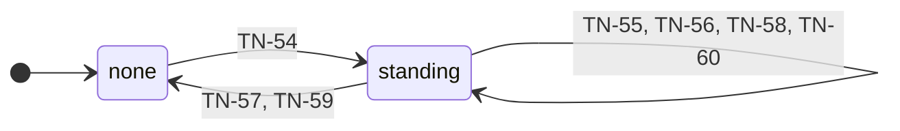

### F-029 の軸 `delivery`

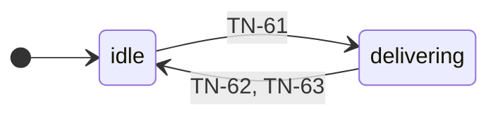
