# 状態機械 — 出来事・状態・状態遷移表

**UID**: DOC-TBL-STATE-MACHINES
**Version**: 0.2

> ⛔ 本書は生成物である。  
> 手で直さない —— 直しても次の `npm run gen` で消える。
> **状態機械の唯一の正は `_source/state-machines.json` である。**  
> 本書はそれを `_source/state_machines_json_to_md.py` が印字したものである。
> **作り直す**: `npm run gen` ／ **ズレを検出する**: `npm run gen:check`。

本書は、保存しない状態の状態機械（`05-07-design.md` の 5.6 の ADR-002）を、領域ごと・状態機械ごとに印字したものである。  
原稿が持つもの・持たないものは `05-07-design.md` の 表 T-250 が、状態機械の形は 表 T-249 が持つ。  
名前の読み方は `05-07-design.md` の 5.5 が持つ。

## 画面の値（`screen`）

**表 T-280 — 画面の値の状態機械**

本表は、出来事の定義・根の値・状態機械ごとの状態遷移表と状態の一覧からなる。  
状態遷移表の行はその状態機械を動かす出来事、列はその状態機械の葉の状態、升は「→ 次の状態 [ガード] / 副作用」である。  
升の「—」は変化なし（同じ参照）を表す。  
ガードの付いた枝がすべての場合を覆わない升には「それ以外 → —」を添え、どの場合に何が起きるかを升ごとに言い切る。  
親の状態に置いた升は、その子のすべての列に同じ升を刷り、「親 … の升」と書き添える。

### 画面の値の出来事

| 出来事 | どこから来るか | 運ぶ値 | 動かすもの |
| --- | --- | --- | --- |
| `screen/paletteToggled` | 入力: `IC-7` ・ `SK-14` | — | `paletteDisplayStateMachine` |
| `screen/paletteMinimiseToggled` | 入力: `IC-75` | — | `paletteDisplayStateMachine` |
| `screen/milestoneListToggled` | 入力: `IC-50` | — | `milestoneListDisplayStateMachine` |
| `screen/fullScreenEntryPressed` | 入力: `IC-11` ・ `SK-15` | — | `fullScreenModeStateMachine` |
| `screen/fullScreenChanged` | 副作用の結果（ブラウザの `fullscreenchange`）: `FR-071` | `isFullScreen` | `fullScreenModeStateMachine` |
| `screen/surfaceEntryPressed` | 入力: `IC-22` ・ `SK-13` ・ `IC-19` ・ `IC-62` ・ `IC-2` ・ `SK-12` | `surfaceName` | `openSurfaceStateMachine` |
| `screen/surfaceRaisedByFlow` | 副作用の結果（ファイルの領域が面を立てる）: `OP-3` ・ `U-56` ・ `U-61` ・ `U-62` | `surfaceName` | `openSurfaceStateMachine` |
| `screen/flowSurfaceAnswered` | 入力（`U-56` ・ `U-61` の答えの入口。呼び手は同じ入力から領域 `fileFlow` の答えの出来事も作る）: `IC-71` ・ `IC-72` ・ `IC-73` ・ `IC-95` ・ `IC-96` ・ `IC-97` ・ `OP-3` ・ `FR-022` | `surfaceName` | `openSurfaceStateMachine` |
| `screen/surfaceCloseAsked` | 入力: `IC-52` | `target`（閉じる対象。面かパネルか） | `openSurfaceStateMachine` ・ `propertiesPanelContentStateMachine` |
| `screen/escapePressed` | 入力（`Esc`）: `IN-4` | `rung`（消費する `IN-4` の段の語。呼び手が詰める） | `armModeStateMachine` ・ `openSurfaceStateMachine` ・ `propertiesPanelContentStateMachine` ・ `dualCursorModeStateMachine` ・ `tooltipDisplayStateMachine` |
| `screen/armEntryPressed` | 入力: `IC-23` ・ `IC-24` ・ `IC-25` ・ `IC-26` ・ `IC-27` ・ `IC-61` ・ `IC-35` ・ `IC-36` ・ `FR-016` | `armKind` ／ `shapeKind` ／ `glyph` | `armModeStateMachine` |
| `screen/watermarkEntryPressed` | 入力: `IC-41` ・ `WM-10` | — | `openSurfaceStateMachine` ・ `watermarkDisplayStateMachine` |
| `screen/watermarkUnlockAnswered` | 入力（`U-60` の答え）: `U-60` ・ `WM-6` ・ `WM-7` | `isProceeding` | `openSurfaceStateMachine` |
| `screen/watermarkUnlockMatched` | 副作用の結果（照合）: `WM-6` ・ `WM-8` | — | `openSurfaceStateMachine` ・ `watermarkDisplayStateMachine` |
| `screen/watermarkUnlockMismatched` | 副作用の結果（照合）: `WM-8` | — | `openSurfaceStateMachine` |
| `screen/settingsEntryPressed` | 入力: `IC-17` ・ `FR-072` | — | `propertiesPanelContentStateMachine` |
| `screen/propertiesOfChoiceAsked` | 入力（パネルを出すことを要求が名指した押下。員数は各要求が持つ）: `FR-072` | `subject` | `propertiesPanelContentStateMachine` |
| `screen/selectionMoved` | ほかの領域の結果（選択）: `FR-072` | `subject`（空もありうる） | `propertiesPanelContentStateMachine` |
| `screen/createdNameSettled` | 入力（作った直後の名前の `Enter`）: `FR-091` | — | `propertiesPanelContentStateMachine` |
| `screen/settleKeyPressed` | 入力（`SK-19` の 2 段目）: `SK-19` ・ `FR-070` | `hasNoSurfaceOrConfirmation` ／ `hasNoUnsettledEntry` | `propertiesPanelContentStateMachine` |
| `screen/dialogueFieldEntryPressed` | 入力: `IC-18` ・ `FR-066` | `isAgentApiEnabled` | `dialogueFieldDisplayStateMachine` |
| `screen/foldAllPressed` | 入力（`HF-12` の操作子）: `HF-12` ・ `HR-2` | — | `levelZeroFoldStateMachine` |
| `screen/levelZeroOpened` | 入力: `HF-16` ・ `HF-10` ・ `HF-17` ・ `S-211` | — | `levelZeroFoldStateMachine` |
| `screen/dualCursorEntryPressed` | 入力: `IC-45` ・ `DC-1` ・ `DC-4` | `date`（置く日付） ／ `hasDaysToPlace` | `armModeStateMachine` ・ `dualCursorModeStateMachine` |
| `screen/dualCursorPlaced` | 入力（`Row Area` のクリック）: `DC-2` ・ `PTD-2` | `date`（置く日付） | `dualCursorModeStateMachine` |
| `screen/displayScaleStepped` | 入力: `IC-104` ・ `IC-105` ・ `SK-22` ・ `SK-23` ・ `SK-17` ・ `SE-1` | `percent` ／ `end` | `scaleMessageDisplayStateMachine` |
| `screen/rowZoomEndReached` | 副作用の結果（行の軸のズームが端に当たった）: `ZE-5` | `percent` ／ `end` | `scaleMessageDisplayStateMachine` |
| `screen/scaleMessageTimeElapsed` | 時間: `S-244` ・ `SE-3` | — | `scaleMessageDisplayStateMachine` |
| `screen/displayLanguageChosen` | 入力: `IC-21` ・ `FR-038` | `language` | 根 |
| `screen/progressMarkerPressed` | 入力（進捗マーカーの押下）: `GA-18` ・ `FR-107` ・ `PV-4` | `taskUid` ／ `rememberedActual`（覚える実績） | 根 |
| `screen/pointerRestElapsed` | 時間: `EZ-2` | — | `tooltipDisplayStateMachine` |

### 根 `screen` の値

運ぶ値: `language` ／ `rememberedActuals`。  
根拠: `CP-36` ・ `S-99` ・ `PV-4`。

| 出来事 | `screen` |
| --- | --- |
| `screen/displayLanguageChosen` | → 自己 / `storeLanguage`（`language` を書き換える） |
| `screen/progressMarkerPressed` | → 自己 / `writeProgressStep`（`rememberedActuals` を書き換える） |

**図 F-026 — 画面の値の状態遷移**

状態機械ごとに 1 つの図に分け、その状態機械の節に置く。状態機械どうしは直交する。  
矢印のラベルは出来事のキーだけであり、ガード・副作用は同じ節の状態遷移表が持つ。  
⚠️ 図は畳んである —— 同じ出来事・ガード・先・副作用の升が 3 つ以上の兄弟の種類のどの 2 つの間も結ぶか、それらのどれからも同じ 1 つの種類へ出るか、同じ 1 つの種類から入るときは、兄弟を 1 つの箱に囲み、その遷移を箱から 1 本だけ描く（どの 2 つの間も結ぶ遷移は、箱の注に出来事のキーを書く）。  
⭐ 遷移の全数は 表 T-280 の状態遷移表が持つ。

### 状態機械 `armModeStateMachine`

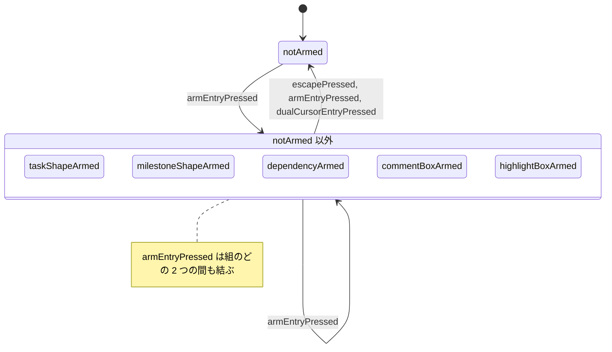

| 出来事 | `notArmed` | `taskShapeArmed` | `milestoneShapeArmed` | `dependencyArmed` | `commentBoxArmed` | `highlightBoxArmed` |
| --- | --- | --- | --- | --- | --- | --- |
| `screen/escapePressed` | — | → `notArmed` [`isRungArmed`]<br>それ以外 → — | → `notArmed` [`isRungArmed`]<br>それ以外 → — | → `notArmed` [`isRungArmed`]<br>それ以外 → — | → `notArmed` [`isRungArmed`]<br>それ以外 → — | → `notArmed` [`isRungArmed`]<br>それ以外 → — |
| `screen/armEntryPressed` | → `{armKind}` | → `notArmed` [`isSameArm`]<br>→ `{armKind}` [not `isSameArm`] | → `notArmed` [`isSameArm`]<br>→ `{armKind}` [not `isSameArm`] | → `notArmed` [`isSameArm`]<br>→ `{armKind}` [not `isSameArm`] | → `notArmed` [`isSameArm`]<br>→ `{armKind}` [not `isSameArm`] | → `notArmed` [`isSameArm`]<br>→ `{armKind}` [not `isSameArm`] |
| `screen/dualCursorEntryPressed` | — | → `notArmed` [`canEnterDualCursor`]<br>それ以外 → — | → `notArmed` [`canEnterDualCursor`]<br>それ以外 → — | → `notArmed` [`canEnterDualCursor`]<br>それ以外 → — | → `notArmed` [`canEnterDualCursor`]<br>それ以外 → — | → `notArmed` [`canEnterDualCursor`]<br>それ以外 → — |

- `armModeStateMachine.notArmed` —— 初期。根拠 `AR-1`
- `armModeStateMachine.taskShapeArmed` —— 運ぶ値 `shapeKind`（`SH-1` ・ `SH-2` ・ `SH-3` ・ `SH-4`）。根拠 `AR-2` ・ `IC-23` ・ `IC-24` ・ `IC-25` ・ `IC-26`
- `armModeStateMachine.milestoneShapeArmed` —— 運ぶ値 `glyph`（`SH-5`）。根拠 `AR-3` ・ `IC-27`
- `armModeStateMachine.dependencyArmed` —— 根拠 `AR-4` ・ `IC-61`
- `armModeStateMachine.commentBoxArmed` —— 根拠 `AR-5` ・ `IC-35`
- `armModeStateMachine.highlightBoxArmed` —— 根拠 `AR-6` ・ `IC-36`

表に無い出来事は `armModeStateMachine` を変えない（同じ参照）。

### 状態機械 `paletteDisplayStateMachine`

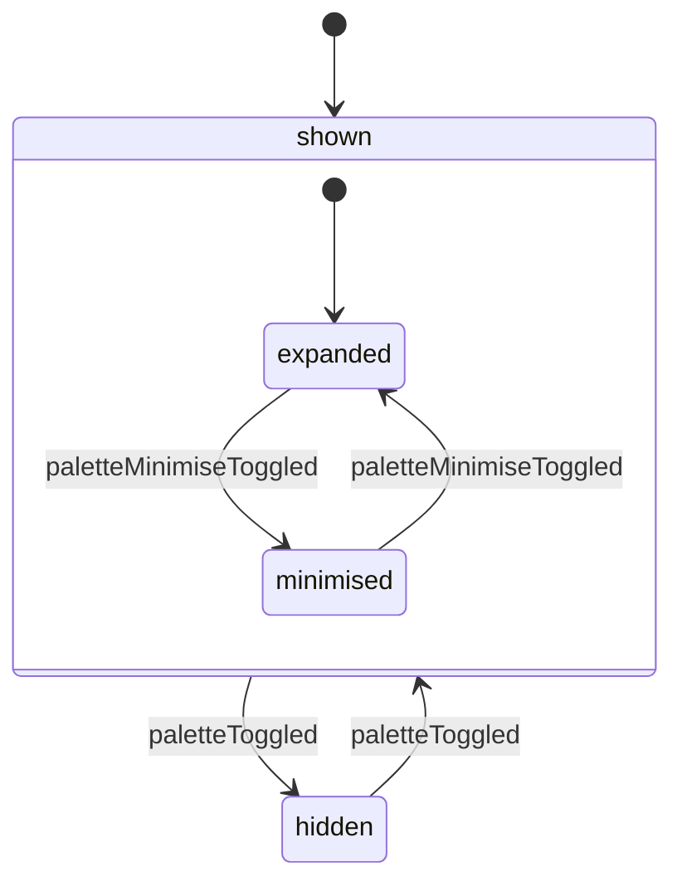

| 出来事 | `shown.expanded` | `shown.minimised` | `hidden` |
| --- | --- | --- | --- |
| `screen/paletteToggled` | → `hidden`（親 `shown` の升） | → `hidden`（親 `shown` の升） | → `shown` |
| `screen/paletteMinimiseToggled` | → `shown.minimised` | → `shown.expanded` | — |

- `paletteDisplayStateMachine.shown` —— 初期。根拠 `S-99e`
- `paletteDisplayStateMachine.shown.expanded` —— 初期。親 `paletteDisplayStateMachine.shown`。根拠 `S-200` ・ `FR-053`
- `paletteDisplayStateMachine.shown.minimised` —— 親 `paletteDisplayStateMachine.shown`。根拠 `S-200` ・ `IC-75`
- `paletteDisplayStateMachine.hidden` —— 根拠 `S-99e`

表に無い出来事は `paletteDisplayStateMachine` を変えない（同じ参照）。

### 状態機械 `milestoneListDisplayStateMachine`

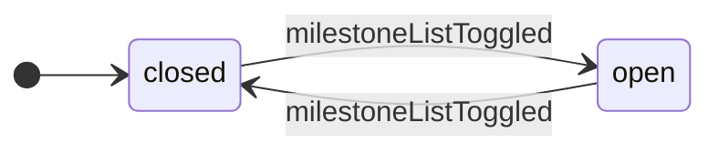

| 出来事 | `closed` | `open` |
| --- | --- | --- |
| `screen/milestoneListToggled` | → `open` | → `closed` |

- `milestoneListDisplayStateMachine.closed` —— 初期。根拠 `S-142` ・ `FR-053`
- `milestoneListDisplayStateMachine.open` —— 根拠 `S-142` ・ `IC-50`

表に無い出来事は `milestoneListDisplayStateMachine` を変えない（同じ参照）。

### 状態機械 `fullScreenModeStateMachine`

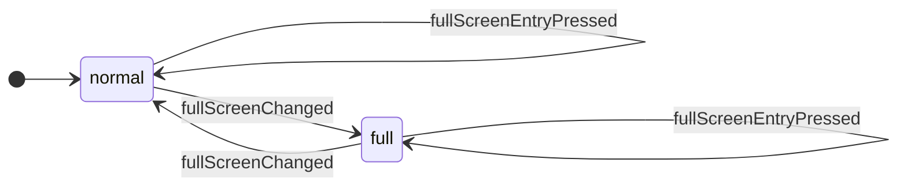

| 出来事 | `normal` | `full` |
| --- | --- | --- |
| `screen/fullScreenEntryPressed` | → 自己 / `askBrowserForFullScreen` | → 自己 / `askBrowserForFullScreen` |
| `screen/fullScreenChanged` | → `full` [`isFullScreen`]<br>それ以外 → — | → `normal` [not `isFullScreen`]<br>それ以外 → — |

- `fullScreenModeStateMachine.normal` —— 初期。根拠 `S-99f`
- `fullScreenModeStateMachine.full` —— 根拠 `S-99f` ・ `FR-071`

表に無い出来事は `fullScreenModeStateMachine` を変えない（同じ参照）。

### 状態機械 `openSurfaceStateMachine`

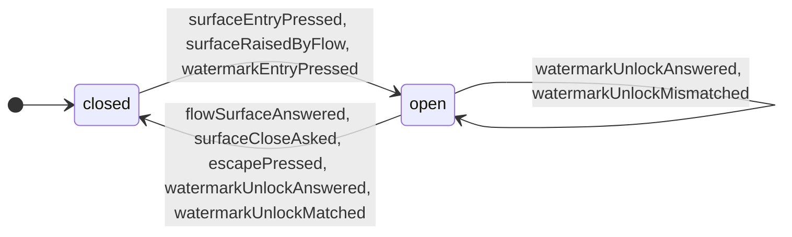

| 出来事 | `closed` | `open` |
| --- | --- | --- |
| `screen/surfaceEntryPressed` | → `open` | — |
| `screen/surfaceRaisedByFlow` | → `open` | — |
| `screen/flowSurfaceAnswered` | — | → `closed`（`tellFlowSurfaceClosed` を返さない —— 答えた後に「閉じた」が戻らない） |
| `screen/surfaceCloseAsked` | — | → `closed` [`isSurfaceTarget`] / `tellFlowSurfaceClosed`<br>それ以外 → — |
| `screen/escapePressed` | — | → `closed` [`isRungSurface`] / `tellFlowSurfaceClosed`<br>それ以外 → — |
| `screen/watermarkEntryPressed` | → `open` [`watermarkDisplayStateMachine.shown` にいる]（`surfaceName` は `U-60`）<br>それ以外 → — | — |
| `screen/watermarkUnlockAnswered` | — | → 自己 [`isWatermarkUnlockSurface` & `isProceeding`] / `matchWatermarkUnlock`<br>→ `closed` [`isWatermarkUnlockSurface` & not `isProceeding`]<br>それ以外 → — |
| `screen/watermarkUnlockMatched` | — | → `closed` [`watermarkDisplayStateMachine.shown` にいる & `isWatermarkUnlockSurface`]<br>それ以外 → — |
| `screen/watermarkUnlockMismatched` | — | → 自己 [`isWatermarkUnlockSurface`] / `raiseNotice`（`RS-41`）（面を閉じない）<br>それ以外 → — |

- `openSurfaceStateMachine.closed` —— 初期。根拠 `S-99g`
- `openSurfaceStateMachine.open` —— 運ぶ値 `surfaceName`（`U-30` ・ `U-49` ・ `U-54` ・ `U-56` ・ `U-60` ・ `U-61` ・ `U-62`）。根拠 `S-99g` ・ `IC-52`

表に無い出来事は `openSurfaceStateMachine` を変えない（同じ参照）。

### 状態機械 `watermarkDisplayStateMachine`

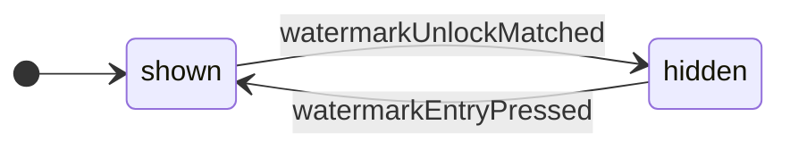

| 出来事 | `shown` | `hidden` |
| --- | --- | --- |
| `screen/watermarkEntryPressed` | — | → `shown` |
| `screen/watermarkUnlockMatched` | → `hidden` [`openSurfaceStateMachine.open` にいる & `isWatermarkUnlockSurface`]<br>それ以外 → — | — |

- `watermarkDisplayStateMachine.shown` —— 初期。根拠 `S-144`
- `watermarkDisplayStateMachine.hidden` —— 根拠 `WM-8`

表に無い出来事は `watermarkDisplayStateMachine` を変えない（同じ参照）。

### 状態機械 `propertiesPanelContentStateMachine`

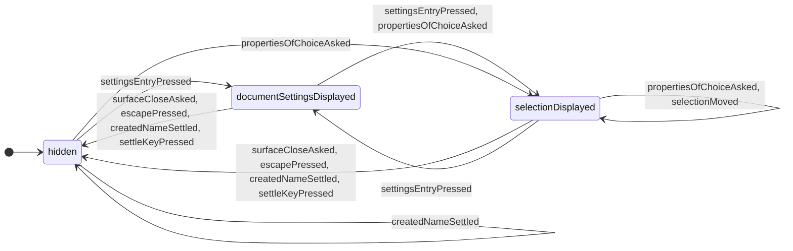

| 出来事 | `hidden` | `selectionDisplayed` | `documentSettingsDisplayed` |
| --- | --- | --- | --- |
| `screen/surfaceCloseAsked` | — | → `hidden` [`isPanelTarget`]<br>それ以外 → — | → `hidden` [`isPanelTarget`]<br>それ以外 → — |
| `screen/escapePressed` | — | → `hidden` [`isRungSurface` & `isPanelTopmost`]<br>それ以外 → — | → `hidden` [`isRungSurface` & `isPanelTopmost`]<br>それ以外 → — |
| `screen/settingsEntryPressed` | → `documentSettingsDisplayed` | → `documentSettingsDisplayed`（`subject` を `returnSubject` に移す） | → `selectionDisplayed`（`returnSubject` を `subject` に戻す） |
| `screen/propertiesOfChoiceAsked` | → `selectionDisplayed` | → 自己（`subject` を書き換える） | → `selectionDisplayed` |
| `screen/selectionMoved` | — | → 自己 [`hasChoice`]（`subject` を書き換える）<br>それ以外 → — | — |
| `screen/createdNameSettled` | → 自己 / `clearSelection` | → `hidden` / `clearSelection` | → `hidden` / `clearSelection` |
| `screen/settleKeyPressed` | — | → `hidden` [`hasNoSurfaceOrConfirmation` & `hasNoUnsettledEntry`]<br>それ以外 → — | → `hidden` [`hasNoSurfaceOrConfirmation` & `hasNoUnsettledEntry`]<br>それ以外 → — |

- `propertiesPanelContentStateMachine.hidden` —— 初期。根拠 `S-99h`
- `propertiesPanelContentStateMachine.selectionDisplayed` —— 運ぶ値 `subject`（選択と行の集合）。根拠 `S-99h` ・ `IR-2` ・ `FR-072`
- `propertiesPanelContentStateMachine.documentSettingsDisplayed` —— 運ぶ値 `returnSubject`（同じ入口をもう一度押したときに戻す選択物。無いこともある）。根拠 `S-99h` ・ `FR-072` ・ `IC-17`

表に無い出来事は `propertiesPanelContentStateMachine` を変えない（同じ参照）。

### 状態機械 `dialogueFieldDisplayStateMachine`

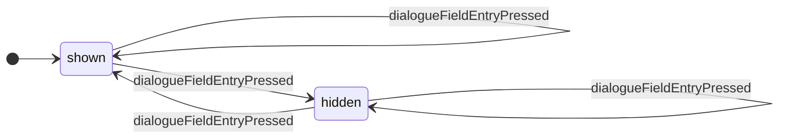

| 出来事 | `shown` | `hidden` |
| --- | --- | --- |
| `screen/dialogueFieldEntryPressed` | → `hidden` [`isAgentApiEnabled`]<br>→ 自己 [not `isAgentApiEnabled`] / `raiseNotice`（`RS-35`） | → `shown` [`isAgentApiEnabled`]<br>→ 自己 [not `isAgentApiEnabled`] / `raiseNotice`（`RS-35`） |

- `dialogueFieldDisplayStateMachine.shown` —— 初期。根拠 `S-99i`
- `dialogueFieldDisplayStateMachine.hidden` —— 根拠 `S-99i` ・ `FR-066`

表に無い出来事は `dialogueFieldDisplayStateMachine` を変えない（同じ参照）。

### 状態機械 `levelZeroFoldStateMachine`

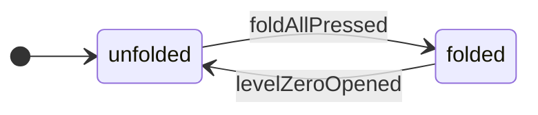

| 出来事 | `unfolded` | `folded` |
| --- | --- | --- |
| `screen/foldAllPressed` | → `folded` / `writeFoldAll` | — |
| `screen/levelZeroOpened` | — | → `unfolded` / `writeOpenLevel` |

- `levelZeroFoldStateMachine.unfolded` —— 初期。根拠 `S-211`
- `levelZeroFoldStateMachine.folded` —— 根拠 `HR-2` ・ `S-211`

表に無い出来事は `levelZeroFoldStateMachine` を変えない（同じ参照）。

### 状態機械 `dualCursorModeStateMachine`

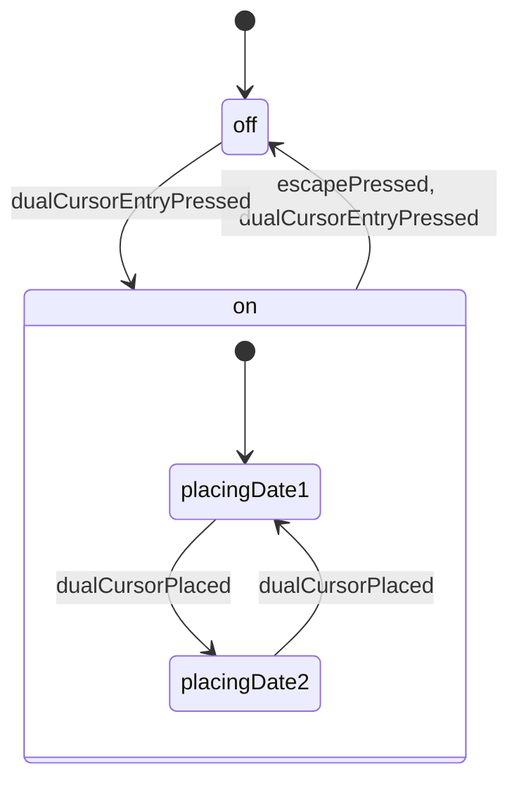

| 出来事 | `off` | `on.placingDate1` | `on.placingDate2` |
| --- | --- | --- | --- |
| `screen/escapePressed` | — | → `off` [`isRungDualCursor`] / `writeClearDualCursor`<br>それ以外 → —（親 `on` の升） | → `off` [`isRungDualCursor`] / `writeClearDualCursor`<br>それ以外 → —（親 `on` の升） |
| `screen/dualCursorEntryPressed` | → `on` [`hasDaysToPlace`] / `writePlaceDualCursor`<br>それ以外 → — | → `off` / `writeClearDualCursor`（親 `on` の升） | → `off` / `writeClearDualCursor`（親 `on` の升） |
| `screen/dualCursorPlaced` | — | → `on.placingDate2` / `writeFixDate1` | → `on.placingDate1` / `writeFixDate2` |

- `dualCursorModeStateMachine.off` —— 初期。根拠 `DC-1`
- `dualCursorModeStateMachine.on` —— 根拠 `DC-1` ・ `PTD-2`
- `dualCursorModeStateMachine.on.placingDate1` —— 初期。親 `dualCursorModeStateMachine.on`。根拠 `DC-1`
- `dualCursorModeStateMachine.on.placingDate2` —— 親 `dualCursorModeStateMachine.on`。根拠 `DC-2` ・ `DC-8`

表に無い出来事は `dualCursorModeStateMachine` を変えない（同じ参照）。

### 状態機械 `scaleMessageDisplayStateMachine`

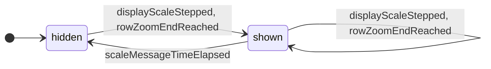

| 出来事 | `hidden` | `shown` |
| --- | --- | --- |
| `screen/displayScaleStepped` | → `shown` / `startScaleMessageTimer` | → 自己 / `restartScaleMessageTimer`（中身を書き換える） |
| `screen/rowZoomEndReached` | → `shown` / `startScaleMessageTimer` | → 自己 / `restartScaleMessageTimer`（中身を書き換える） |
| `screen/scaleMessageTimeElapsed` | — | → `hidden` |

- `scaleMessageDisplayStateMachine.hidden` —— 初期。根拠 `SE-1`
- `scaleMessageDisplayStateMachine.shown` —— 運ぶ値 `percent` ／ `end`（`max` ・ `min` ・ なし）。根拠 `SE-2` ・ `ZE-5` ・ `S-244`

表に無い出来事は `scaleMessageDisplayStateMachine` を変えない（同じ参照）。

### 状態機械 `tooltipDisplayStateMachine`

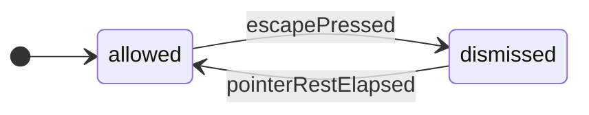

| 出来事 | `allowed` | `dismissed` |
| --- | --- | --- |
| `screen/escapePressed` | → `dismissed` [`isRungTooltip`]<br>それ以外 → — | — |
| `screen/pointerRestElapsed` | — | → `allowed` |

- `tooltipDisplayStateMachine.allowed` —— 初期。根拠 `IN-3`
- `tooltipDisplayStateMachine.dismissed` —— 根拠 `IN-3` ・ `IN-4`

表に無い出来事は `tooltipDisplayStateMachine` を変えない（同じ参照）。

## 通知（`notices`）

**表 T-286 — 通知の状態機械**

本表は、出来事の定義・根の値・状態機械ごとの状態遷移表と状態の一覧からなる。  
状態遷移表の行はその状態機械を動かす出来事、列はその状態機械の葉の状態、升は「→ 次の状態 [ガード] / 副作用」である。  
升の「—」は変化なし（同じ参照）を表す。  
ガードの付いた枝がすべての場合を覆わない升には「それ以外 → —」を添え、どの場合に何が起きるかを升ごとに言い切る。  
親の状態に置いた升は、その子のすべての列に同じ升を刷り、「親 … の升」と書き添える。

### 通知の出来事

| 出来事 | どこから来るか | 運ぶ値 | 動かすもの |
| --- | --- | --- | --- |
| `notices/noticeRaised` | 副作用の結果（副作用 `raiseNotice` の実行。ほかの領域の遷移とシェルの流れが返す）: `FR-076` ・ `NT-3` | `reason`（表 T-233 の `RS-` の行、または 表 T-220 の行） ／ `affectedCount`（無いこともある） | `noticeDisplayStateMachine` |
| `notices/newestNoticeDismissAsked` | 入力（`Esc`（`IN-4` の第 1 段）／ `Enter`（`SK-19` の第 1 段）。段は呼び手が決め、同じ入力のほかの何よりも先に進める）: `NT-8` ・ `IN-4` ・ `SK-19` | — | `noticeDisplayStateMachine` |
| `notices/noticeDismissPressed` | 入力（1 つの通知の `OK` の入口を押して離した）: `NT-8` | `reason`（押された通知の理由。`NT-3` の束ねで 1 つの理由に 1 枚なので、理由が通知を 1 つに決める） | `noticeDisplayStateMachine` |
| `notices/documentReplaced` | 副作用の結果（`WS-6` の差し替えが済み、`WS-7` の配りが始まる）: `WS-6` ・ `WS-7` | — | `changeDeliveryStateMachine` |
| `notices/changeDelivered` | 副作用の結果（`WS-7` の配りが終わった）: `WS-7` ・ `AG-6` | `silentWatchers`（答えを返さなかった配り先の数） | `changeDeliveryStateMachine` |

### 根 `notices` の値

運ぶ値: —。  
根拠: `FR-076`。

根の運ぶ値だけを書き換える出来事は無い。

**図 F-029 — 通知の状態遷移**

状態機械ごとに 1 つの図に分け、その状態機械の節に置く。状態機械どうしは直交する。  
矢印のラベルは出来事のキーだけであり、ガード・副作用は同じ節の状態遷移表が持つ。  
⚠️ 図は畳んである —— 同じ出来事・ガード・先・副作用の升が 3 つ以上の兄弟の種類のどの 2 つの間も結ぶか、それらのどれからも同じ 1 つの種類へ出るか、同じ 1 つの種類から入るときは、兄弟を 1 つの箱に囲み、その遷移を箱から 1 本だけ描く（どの 2 つの間も結ぶ遷移は、箱の注に出来事のキーを書く）。  
⭐ 遷移の全数は 表 T-286 の状態遷移表が持つ。

### 状態機械 `noticeDisplayStateMachine`

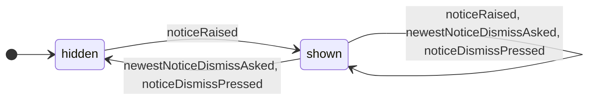

| 出来事 | `hidden` | `shown` |
| --- | --- | --- |
| `notices/noticeRaised` | → `shown`（1 枚） | → 自己 [`isSameReasonStanding`]（その 1 枚の件数を増やし、いちばん新しい位置へ動かす）<br>→ 自己 [not `isSameReasonStanding`]（いちばん新しいものとして足す。枚数に上限を置かない） |
| `notices/newestNoticeDismissAsked` | — | → `hidden` [`isOnlyOneStanding`]<br>→ 自己 [not `isOnlyOneStanding`]（いちばん新しいものを除く） |
| `notices/noticeDismissPressed` | — | → `hidden` [`isLeavingNone`]<br>→ 自己 [`isLeavingSome`]（押されたものを除く）<br>それ以外 → — |

- `noticeDisplayStateMachine.hidden` —— 初期。根拠 `NT-8` ・ `IN-4`
- `noticeDisplayStateMachine.shown` —— 運ぶ値 `standing`（出ている通知の列。古い順。1 つは理由と件数）。根拠 `FR-076` ・ `NT-3` ・ `NT-8` ・ `IN-4` ・ `SK-19` ・ `IR-3`

表に無い出来事は `noticeDisplayStateMachine` を変えない（同じ参照）。

### 状態機械 `changeDeliveryStateMachine`

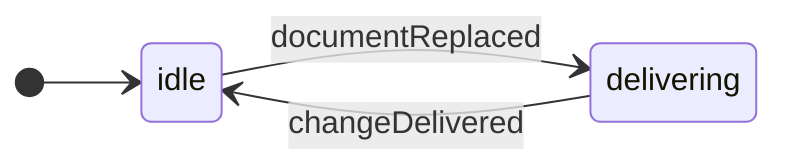

| 出来事 | `idle` | `delivering` |
| --- | --- | --- |
| `notices/documentReplaced` | → `delivering` | — |
| `notices/changeDelivered` | — | → `idle` [not `hasSilentWatcher`]<br>→ `idle` [`hasSilentWatcher`] / `raiseNotice`（`RS-23`） |

- `changeDeliveryStateMachine.idle` —— 初期。根拠 `WS-7`
- `changeDeliveryStateMachine.delivering` —— 根拠 `WS-2` ・ `RS-9` ・ `CA-3`

表に無い出来事は `changeDeliveryStateMachine` を変えない（同じ参照）。

## 身振り（`gesture`）

**表 T-289 — 身振りの状態機械**

本表は、出来事の定義・根の値・状態機械ごとの状態遷移表と状態の一覧からなる。  
状態遷移表の行はその状態機械を動かす出来事、列はその状態機械の葉の状態、升は「→ 次の状態 [ガード] / 副作用」である。  
升の「—」は変化なし（同じ参照）を表す。  
ガードの付いた枝がすべての場合を覆わない升には「それ以外 → —」を添え、どの場合に何が起きるかを升ごとに言い切る。  
親の状態に置いた升は、その子のすべての列に同じ升を刷り、「親 … の升」と書き添える。

### 身振りの出来事

| 出来事 | どこから来るか | 運ぶ値 | 動かすもの |
| --- | --- | --- | --- |
| `gesture/pointerPressed` | 入力（ポインタを押した。入力の源は、身振りを持つあいだ次の押下を報告しない）: `CS-2` ・ `IN-1` | `pressRow`（`PTD-1` ・ `PTD-2` ・ `PTD-3` ・ `PTD-4` ・ `PTD-4a` ・ `PTD-5`。押下の行。呼び手が構えと `Dual Cursor` から詰める） ／ `pressedOn`（押したもの —— 当たった掴みか、画面の場所（入口・掴み帯・パネルの境界・行の掴み代・つまみ）。座標は運ばない） | `pointerPressStateMachine` ・ `rowGrabStateMachine` |
| `gesture/pointerReleased` | 入力（押していたボタンを離した）: `IN-1` ・ `CS-2` | — | `pointerPressStateMachine` ・ `rowGrabStateMachine` |
| `gesture/pressInterrupted` | 入力（`Esc`（`IN-4` の進行中のドラッグの段。段は呼び手が決める）／ 離す前にポインタが失われた（`IN-1a`））: `IN-1` ・ `IN-1a` ・ `IN-4` | — | `pointerPressStateMachine` ・ `rowGrabStateMachine` |
| `gesture/rowGrabAxisSettled` | 入力（行を掴んだまま、押した点から初めて閾値を超えて動いた。どちらの向きが先かは呼び手が判じる）: `HF-15` ・ `S-208` | `axis`（`HF-15`。`position`（上下）か `depth`（左右）） | `rowGrabStateMachine` |
| `gesture/entryRepeatTimeElapsed` | 時間（`startEntryRepeat` の待ち（`S-172`）か、`repeatHeldEntry` の待ち（`S-173`）が明けた）: `FR-018` ・ `S-172` ・ `S-173` | — | `pointerPressStateMachine` |

### 根 `gesture` の値

運ぶ値: —。  
根拠: `CS-2`。

根の運ぶ値だけを書き換える出来事は無い。

**図 F-035 — 身振りの状態遷移**

状態機械ごとに 1 つの図に分け、その状態機械の節に置く。状態機械どうしは直交する。  
矢印のラベルは出来事のキーだけであり、ガード・副作用は同じ節の状態遷移表が持つ。  
⚠️ 図は畳んである —— 同じ出来事・ガード・先・副作用の升が 3 つ以上の兄弟の種類のどの 2 つの間も結ぶか、それらのどれからも同じ 1 つの種類へ出るか、同じ 1 つの種類から入るときは、兄弟を 1 つの箱に囲み、その遷移を箱から 1 本だけ描く（どの 2 つの間も結ぶ遷移は、箱の注に出来事のキーを書く）。  
⭐ 遷移の全数は 表 T-289 の状態遷移表が持つ。

### 状態機械 `pointerPressStateMachine`

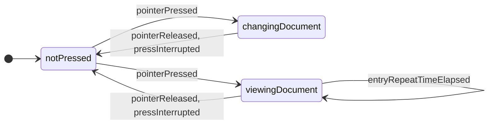

| 出来事 | `notPressed` | `changingDocument` | `viewingDocument` |
| --- | --- | --- | --- |
| `gesture/pointerPressed` | → `changingDocument` [`isDocumentChangingPress`]<br>→ `viewingDocument` [not `isDocumentChangingPress` & `isOnRepeatingEntry`] / `startEntryRepeat`（前の待ちを捨てて張り直す）<br>→ `viewingDocument` [not `isDocumentChangingPress` & not `isOnRepeatingEntry`] | — | — |
| `gesture/pointerReleased` | — | → `notPressed` | → `notPressed` |
| `gesture/pressInterrupted` | — | → `notPressed` [`isOnPaletteBand`] / `restorePaletteCorner`（パレットを押した時点の角へ戻す）<br>→ `notPressed` [not `isOnPaletteBand`] | → `notPressed` [`isOnPaletteBand`] / `restorePaletteCorner`（パレットを押した時点の角へ戻す）<br>→ `notPressed` [not `isOnPaletteBand`] |
| `gesture/entryRepeatTimeElapsed` | — | — | → 自己 [`isOnRepeatingEntry`] / `repeatHeldEntry`（入口の命令をもう 1 度実行し、`S-173` の待ちを張る）<br>それ以外 → — |

- `pointerPressStateMachine.notPressed` —— 初期。根拠 `IN-1` ・ `AG-9`
- `pointerPressStateMachine.changingDocument` —— 運ぶ値 `pressRow`（押した時点の押下の行） ／ `pressedOn`（押したもの）。根拠 `AG-9` ・ `WS-2` ・ `CS-2` ・ `IN-4` ・ `UN-4`
- `pointerPressStateMachine.viewingDocument` —— 運ぶ値 `pressRow`（押した時点の押下の行） ／ `pressedOn`（押したもの）。根拠 `AG-9` ・ `UN-8` ・ `UN-9` ・ `IN-4` ・ `FR-018`

表に無い出来事は `pointerPressStateMachine` を変えない（同じ参照）。

### 状態機械 `rowGrabStateMachine`

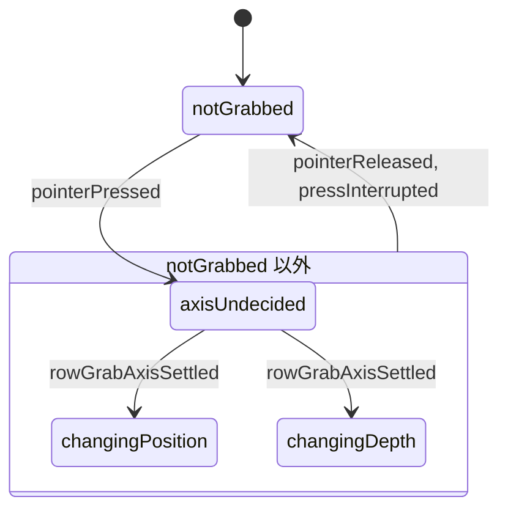

| 出来事 | `notGrabbed` | `axisUndecided` | `changingPosition` | `changingDepth` |
| --- | --- | --- | --- | --- |
| `gesture/pointerPressed` | → `axisUndecided` [`isRowGrabStrip`]<br>それ以外 → — | — | — | — |
| `gesture/pointerReleased` | — | → `notGrabbed` | → `notGrabbed` | → `notGrabbed` |
| `gesture/pressInterrupted` | — | → `notGrabbed` | → `notGrabbed` | → `notGrabbed` |
| `gesture/rowGrabAxisSettled` | — | → `changingPosition` [`isPositionAxis`]<br>→ `changingDepth` [not `isPositionAxis`] | — | — |

- `rowGrabStateMachine.notGrabbed` —— 初期。根拠 `HF-15`
- `rowGrabStateMachine.axisUndecided` —— 根拠 `HF-15` ・ `GR-20` ・ `S-208`
- `rowGrabStateMachine.changingPosition` —— 根拠 `HF-15`
- `rowGrabStateMachine.changingDepth` —— 根拠 `HF-15`

表に無い出来事は `rowGrabStateMachine` を変えない（同じ参照）。

## ファイル操作と問い（`fileFlow`）

**表 T-290 — ファイル操作と問いの状態機械**

本表は、出来事の定義・根の値・状態機械ごとの状態遷移表と状態の一覧からなる。  
状態遷移表の行はその状態機械を動かす出来事、列はその状態機械の葉の状態、升は「→ 次の状態 [ガード] / 副作用」である。  
升の「—」は変化なし（同じ参照）を表す。  
ガードの付いた枝がすべての場合を覆わない升には「それ以外 → —」を添え、どの場合に何が起きるかを升ごとに言い切る。  
親の状態に置いた升は、その子のすべての列に同じ升を刷り、「親 … の升」と書き添える。

### ファイル操作と問いの出来事

| 出来事 | どこから来るか | 運ぶ値 | 動かすもの |
| --- | --- | --- | --- |
| `fileFlow/documentOpenAsked` | 入力（開く入口・`Ctrl` ＋ `O`、ファイルを落とした、`Ctrl` ＋ `R`）: `IC-1` ・ `SK-10` ・ `OP-2` ・ `CHN-1` ・ `SK-21` ・ `OP-13` | `openRoute`（`OP-2` ・ `OP-13`。`chooser`（開く入口・`Ctrl` ＋ `O`）／ `drop`（ファイルを落とした）／ `reopen`（`Ctrl` ＋ `R`）） | `fileOperationStateMachine` |
| `fileFlow/agentDocumentHanded` | 入力（`Agent API` が文書を渡した（`openRoute` は `handed`））: `AM-8` ・ `FR-022` | — | `fileOperationStateMachine` |
| `fileFlow/documentFileWriteAsked` | 入力（`Ctrl` ＋ `S`、書き出しの形式を選んだ）: `SK-11` ・ `FR-060` ・ `SK-12` ・ `FR-096` ・ `U-54` | `writeForm`（`FR-060` ・ `FR-096`。保存（`Ctrl` ＋ `S`）か、`U-54` で選んだ書き出しの形式） | `fileOperationStateMachine` |
| `fileFlow/openChoiceAnswered` | 入力（`U-56` の 3 つの入口）: `IC-71` ・ `IC-72` ・ `IC-73` ・ `OP-3` | `openChoice`（`OP-3`。置き換え ／ 合流 ／ 重ね） ／ `question`（`QN-5`。置き換えを選んだときに立てる問い。挙げる名前は操作を始めた時点の文書（`CS-4`）。呼び手が詰める） | `fileOperationStateMachine` ・ `confirmationStateMachine` |
| `fileFlow/mergeMappingAnswered` | 入力（`U-61` の 3 つの入口）: `IC-95` ・ `IC-96` ・ `IC-97` ・ `FR-022` | `mergeMapping`（`MM-1` ・ `MM-2` ・ `MM-4`） | `fileOperationStateMachine` |
| `fileFlow/confirmationAnswered` | 入力（`Yes` / `No`、`y` / `n`、`Esc`）: `NT-7` ・ `IN-4` | `isProceeding`（`NT-7`。`Esc`（`IN-4` の段 `confirmation`）は偽。段は呼び手が決める） | `fileOperationStateMachine` ・ `confirmationStateMachine` |
| `fileFlow/changeQuestionRaised` | 入力（確認を要る書き込みの束（行の削除・WBS の子孫を持つ `Task` の削除）、担当者の削除）: `FR-032` ・ `FR-099` ・ `QN-1` ・ `QN-2` ・ `QN-3` ・ `IC-66` | `question`（`QN-1` ・ `QN-2` ・ `QN-3`） ／ `owedAction`（「続ける」で行う書き込みの束） | `confirmationStateMachine` |
| `fileFlow/newDocumentEntryPressed` | 入力（新しく始める入口）: `IC-98` ・ `FR-095` | `hasStartupTemplate`（`FR-095`。始める元の文書が在るか。呼び手が詰める） ／ `question`（`QN-5`。いまの文書を捨てる問い。呼び手が詰める） | `confirmationStateMachine` |
| `fileFlow/flowSurfaceClosed` | ほかの領域の結果（画面の値の副作用 `tellFlowSurfaceClosed`。人が `×` か `Esc` で面を閉じた）: `IC-52` ・ `IN-4` | `surfaceName`（`U-56` ・ `U-61` ・ `U-62`） | 根 ・ `fileOperationStateMachine` |
| `fileFlow/documentFileRead` | 副作用の結果（`readDocumentFile` が読み、形式を判じ、検証を通した）: `OP-5` ・ `OP-12` ・ `FR-023` | `question`（`QN-5`。読み直すときに立てる問い。挙げる名前は操作を始めた時点の文書（`CS-4`）。副作用の実行が詰める） | `fileOperationStateMachine` ・ `confirmationStateMachine` |
| `fileFlow/documentOpenFailed` | 副作用の結果（読めない・選ばなかった・検証が拒んだ・読み直す相手が無い・着地を拒まれた（告げるのは副作用の中身））: `OP-5` ・ `OP-13` ・ `FR-023` | — | `fileOperationStateMachine` |
| `fileFlow/mergeMappingAsked` | 副作用の結果（`importIncomingDocument` が対応付けを問うことになった）: `FR-022` ・ `U-61` ・ `FR-073` | `mergeCandidates`（`U-61`） ／ `unreadColumns`（`FR-073`） | `fileOperationStateMachine` |
| `fileFlow/documentOpenLanded` | 副作用の結果（取り込みが着地した）: `RD-3` ・ `RD-4` ・ `FR-023` ・ `FR-101` | `droppedTaskNames`（`RS-50`） ／ `openedFileName`（`FR-101`。無いこともある） | 根 ・ `fileOperationStateMachine` |
| `fileFlow/overwriteQuestionRaised` | 副作用の結果（`writeDocumentFile` の途中で、同じとみなせない相手を見つけた）: `DI-4` ・ `QN-4` | `question`（`QN-4`） | `confirmationStateMachine` |
| `fileFlow/documentFileSaved` | 副作用の結果（保存が書けた）: `FR-060` ・ `FR-101` | `openedFileName`（`FR-101`。無いこともある） | 根 ・ `fileOperationStateMachine` |
| `fileFlow/documentFileWriteEnded` | 副作用の結果（書き出しが終わった、または保存・書き出しが書けなかった（告げるのは副作用の中身））: `FR-096` ・ `CS-4` | — | `fileOperationStateMachine` |

### 根 `fileFlow` の値

運ぶ値: `openedFileName`（`U-58` ・ `FR-101`） ／ `droppedTaskNames`（`U-62` ・ `RS-50`）。  
根拠: `OP-8` ・ `CS-4`。

| 出来事 | `fileFlow` |
| --- | --- |
| `fileFlow/documentFileSaved` | → 自己（`openedFileName` を書き換える（名が運ばれたときだけ）） |
| `fileFlow/documentOpenLanded` | → 自己 [`hasDroppedTasks`] / `raiseFlowSurface`（`U-62`）（`droppedTaskNames` と `openedFileName` を書き換える（名は運ばれたときだけ））<br>→ 自己 [not `hasDroppedTasks`]（`openedFileName` を書き換える（名が運ばれたときだけ）） |
| `fileFlow/flowSurfaceClosed` | → 自己 [`isImportReportSurface`]（`droppedTaskNames` を空にする）<br>それ以外 → — |

**図 F-036 — ファイル操作と問いの状態遷移**

状態機械ごとに 1 つの図に分け、その状態機械の節に置く。状態機械どうしは直交する。  
矢印のラベルは出来事のキーだけであり、ガード・副作用は同じ節の状態遷移表が持つ。  
⚠️ 図は畳んである —— 同じ出来事・ガード・先・副作用の升が 3 つ以上の兄弟の種類のどの 2 つの間も結ぶか、それらのどれからも同じ 1 つの種類へ出るか、同じ 1 つの種類から入るときは、兄弟を 1 つの箱に囲み、その遷移を箱から 1 本だけ描く（どの 2 つの間も結ぶ遷移は、箱の注に出来事のキーを書く）。  
⭐ 遷移の全数は 表 T-290 の状態遷移表が持つ。

### 状態機械 `fileOperationStateMachine`

```mermaid
stateDiagram-v2
    direction LR
    [*] --> fileOperationStateMachine_idle
    fileOperationStateMachine_idle : idle
    fileOperationStateMachine_readingDocumentFile : readingDocumentFile
    fileOperationStateMachine_awaitingOpenChoice : awaitingOpenChoice
    fileOperationStateMachine_awaitingDiscardAnswer : awaitingDiscardAnswer
    fileOperationStateMachine_importingDocument : importingDocument
    fileOperationStateMachine_awaitingMergeMapping : awaitingMergeMapping
    fileOperationStateMachine_writingDocumentFile : writingDocumentFile
    fileOperationStateMachine_idle --> fileOperationStateMachine_readingDocumentFile : documentOpenAsked, agentDocumentHanded
    fileOperationStateMachine_idle --> fileOperationStateMachine_idle : documentOpenAsked, documentFileWriteAsked
    fileOperationStateMachine_readingDocumentFile --> fileOperationStateMachine_readingDocumentFile : documentOpenAsked, documentFileWriteAsked
    fileOperationStateMachine_awaitingOpenChoice --> fileOperationStateMachine_awaitingOpenChoice : documentOpenAsked, documentFileWriteAsked
    fileOperationStateMachine_awaitingDiscardAnswer --> fileOperationStateMachine_awaitingDiscardAnswer : documentOpenAsked, documentFileWriteAsked
    fileOperationStateMachine_importingDocument --> fileOperationStateMachine_importingDocument : documentOpenAsked, documentFileWriteAsked
    fileOperationStateMachine_awaitingMergeMapping --> fileOperationStateMachine_awaitingMergeMapping : documentOpenAsked, documentFileWriteAsked
    fileOperationStateMachine_writingDocumentFile --> fileOperationStateMachine_writingDocumentFile : documentOpenAsked, documentFileWriteAsked, confirmationAnswered
    fileOperationStateMachine_idle --> fileOperationStateMachine_writingDocumentFile : documentFileWriteAsked
    fileOperationStateMachine_readingDocumentFile --> fileOperationStateMachine_awaitingDiscardAnswer : documentFileRead
    fileOperationStateMachine_readingDocumentFile --> fileOperationStateMachine_awaitingOpenChoice : documentFileRead
    fileOperationStateMachine_readingDocumentFile --> fileOperationStateMachine_idle : documentOpenFailed
    fileOperationStateMachine_importingDocument --> fileOperationStateMachine_idle : documentOpenFailed, documentOpenLanded
    fileOperationStateMachine_awaitingOpenChoice --> fileOperationStateMachine_awaitingDiscardAnswer : openChoiceAnswered
    fileOperationStateMachine_awaitingOpenChoice --> fileOperationStateMachine_importingDocument : openChoiceAnswered
    fileOperationStateMachine_awaitingDiscardAnswer --> fileOperationStateMachine_importingDocument : confirmationAnswered
    fileOperationStateMachine_awaitingDiscardAnswer --> fileOperationStateMachine_idle : confirmationAnswered
    fileOperationStateMachine_importingDocument --> fileOperationStateMachine_awaitingMergeMapping : mergeMappingAsked
    fileOperationStateMachine_awaitingMergeMapping --> fileOperationStateMachine_idle : mergeMappingAnswered, flowSurfaceClosed
    fileOperationStateMachine_awaitingMergeMapping --> fileOperationStateMachine_importingDocument : mergeMappingAnswered
    fileOperationStateMachine_awaitingOpenChoice --> fileOperationStateMachine_idle : flowSurfaceClosed
    fileOperationStateMachine_writingDocumentFile --> fileOperationStateMachine_idle : documentFileSaved, documentFileWriteEnded
```

| 出来事 | `idle` | `readingDocumentFile` | `awaitingOpenChoice` | `awaitingDiscardAnswer` | `importingDocument` | `awaitingMergeMapping` | `writingDocumentFile` |
| --- | --- | --- | --- | --- | --- | --- | --- |
| `fileFlow/documentOpenAsked` | → `readingDocumentFile` [`confirmationStateMachine.notAsked` にいる] / `readDocumentFile`<br>→ 自己 [`confirmationStateMachine.questionAsked` にいる] / `raiseNotice`（`RS-27`） | → 自己 / `raiseNotice`（`RS-27`） | → 自己 / `raiseNotice`（`RS-27`） | → 自己 / `raiseNotice`（`RS-27`） | → 自己 / `raiseNotice`（`RS-27`） | → 自己 / `raiseNotice`（`RS-27`） | → 自己 / `raiseNotice`（`RS-27`） |
| `fileFlow/agentDocumentHanded` | → `readingDocumentFile` [`confirmationStateMachine.notAsked` にいる] / `readDocumentFile`（`openRoute` は `handed`）<br>それ以外 → — | — | — | — | — | — | — |
| `fileFlow/documentFileWriteAsked` | → `writingDocumentFile` [`confirmationStateMachine.notAsked` にいる] / `writeDocumentFile`<br>→ 自己 [`confirmationStateMachine.questionAsked` にいる] / `raiseNotice`（`RS-27`） | → 自己 / `raiseNotice`（`RS-27`） | → 自己 / `raiseNotice`（`RS-27`） | → 自己 / `raiseNotice`（`RS-27`） | → 自己 / `raiseNotice`（`RS-27`） | → 自己 / `raiseNotice`（`RS-27`） | → 自己 / `raiseNotice`（`RS-27`） |
| `fileFlow/documentFileRead` | — | → `awaitingDiscardAnswer` [`isReopenRoute`]<br>→ `awaitingOpenChoice` [not `isReopenRoute`] / `raiseFlowSurface`（`U-56`） | — | — | — | — | — |
| `fileFlow/documentOpenFailed` | — | → `idle` | — | — | → `idle` | — | — |
| `fileFlow/openChoiceAnswered` | — | — | → `awaitingDiscardAnswer` [`isReplaceChoice`]<br>→ `importingDocument` [not `isReplaceChoice`] / `importIncomingDocument` | — | — | — | — |
| `fileFlow/confirmationAnswered` | — | — | — | → `importingDocument` [`isProceeding`] / `importIncomingDocument`<br>→ `idle` [not `isProceeding`] / `discardIncomingDocument` | — | — | → 自己 [`isOverwriteQuestion`] / `answerOverwriteQuestion`<br>それ以外 → — |
| `fileFlow/mergeMappingAsked` | — | — | — | — | → `awaitingMergeMapping` / `raiseFlowSurface`（`U-61`） | — | — |
| `fileFlow/mergeMappingAnswered` | — | — | — | — | — | → `idle` [`isImportCancelled`] / `discardIncomingDocument`<br>→ `importingDocument` [not `isImportCancelled`] / `importIncomingDocument` | — |
| `fileFlow/flowSurfaceClosed` | — | — | → `idle` [`isOpenChooserSurface`] / `discardIncomingDocument`<br>それ以外 → — | — | — | → `idle` [`isDifferenceReviewSurface`] / `discardIncomingDocument`<br>それ以外 → — | — |
| `fileFlow/documentOpenLanded` | — | — | — | — | → `idle` | — | — |
| `fileFlow/documentFileSaved` | — | — | — | — | — | — | → `idle` |
| `fileFlow/documentFileWriteEnded` | — | — | — | — | — | — | → `idle` |

- `fileOperationStateMachine.idle` —— 初期。根拠 `OP-8` ・ `CS-4`
- `fileOperationStateMachine.readingDocumentFile` —— 運ぶ値 `openRoute`（`OP-2` ・ `OP-13`）。根拠 `OP-2` ・ `OP-5` ・ `OP-8` ・ `OP-12` ・ `OP-13` ・ `CS-4`
- `fileOperationStateMachine.awaitingOpenChoice` —— 根拠 `OP-3` ・ `U-56` ・ `OP-5` ・ `CS-4`
- `fileOperationStateMachine.awaitingDiscardAnswer` —— 根拠 `OP-4` ・ `QN-5` ・ `OP-13`
- `fileOperationStateMachine.importingDocument` —— 根拠 `RD-3` ・ `RD-4` ・ `OP-9` ・ `FR-022`
- `fileOperationStateMachine.awaitingMergeMapping` —— 運ぶ値 `mergeCandidates`（`U-61`） ／ `unreadColumns`（`FR-073`）。根拠 `FR-022` ・ `U-61` ・ `FR-073`
- `fileOperationStateMachine.writingDocumentFile` —— 根拠 `FR-060` ・ `FR-096` ・ `DI-4` ・ `CS-4`

表に無い出来事は `fileOperationStateMachine` を変えない（同じ参照）。

### 状態機械 `confirmationStateMachine`

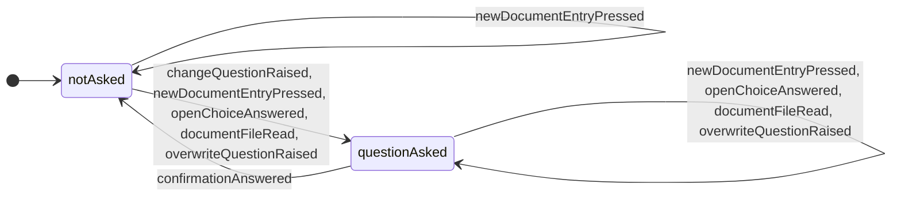

| 出来事 | `notAsked` | `questionAsked` |
| --- | --- | --- |
| `fileFlow/changeQuestionRaised` | → `questionAsked` | — |
| `fileFlow/newDocumentEntryPressed` | → `questionAsked` [`hasStartupTemplate`]<br>→ 自己 [not `hasStartupTemplate`] / `raiseNotice`（`RS-27`） | → 自己 / `raiseNotice`（`RS-27`） |
| `fileFlow/openChoiceAnswered` | → `questionAsked` [`isReplaceChoice` & `fileOperationStateMachine.awaitingOpenChoice` にいる]<br>それ以外 → — | → 自己 [`isReplaceChoice` & `fileOperationStateMachine.awaitingOpenChoice` にいる]<br>それ以外 → — |
| `fileFlow/documentFileRead` | → `questionAsked` [`isReopenRoute` & `fileOperationStateMachine.readingDocumentFile` にいる]<br>それ以外 → — | → 自己 [`isReopenRoute` & `fileOperationStateMachine.readingDocumentFile` にいる]<br>それ以外 → — |
| `fileFlow/overwriteQuestionRaised` | → `questionAsked` | → 自己 |
| `fileFlow/confirmationAnswered` | — | → `notAsked` [`isProceeding` & not `isFileOperationQuestion`] / `carryOutOwedAction`<br>→ `notAsked` [`isProceeding` & `isFileOperationQuestion`]<br>→ `notAsked` [not `isProceeding`] |

- `confirmationStateMachine.notAsked` —— 初期。根拠 `NT-7` ・ `U-55`
- `confirmationStateMachine.questionAsked` —— 運ぶ値 `question`（`QN-1` ・ `QN-2` ・ `QN-3` ・ `QN-4` ・ `QN-5`） ／ `owedAction`（「続ける」で行う書き込みの束か、新しく始めること。ファイル操作の問いでは無い）。根拠 `NT-7` ・ `U-55` ・ `QN-1` ・ `QN-2` ・ `QN-3` ・ `QN-4` ・ `QN-5`

表に無い出来事は `confirmationStateMachine` を変えない（同じ参照）。

## 名前付けと入力欄（`fieldEntry`）

**表 T-292 — 名前付けと入力欄の状態機械**

本表は、出来事の定義・根の値・状態機械ごとの状態遷移表と状態の一覧からなる。  
状態遷移表の行はその状態機械を動かす出来事、列はその状態機械の葉の状態、升は「→ 次の状態 [ガード] / 副作用」である。  
升の「—」は変化なし（同じ参照）を表す。  
ガードの付いた枝がすべての場合を覆わない升には「それ以外 → —」を添え、どの場合に何が起きるかを升ごとに言い切る。  
親の状態に置いた升は、その子のすべての列に同じ升を刷り、「親 … の升」と書き添える。

### 名前付けと入力欄の出来事

| 出来事 | どこから来るか | 運ぶ値 | 動かすもの |
| --- | --- | --- | --- |
| `fieldEntry/fieldFocusAsked` | 入力（欄に焦点を置くことを要求が名指した押下（名称・行名・担当・注記の本文・文書名））: `MK-13` ・ `FR-035` ・ `FR-097` | `fieldRow`（`PR-1` ・ `AT-53` ・ `PR-16` ・ `PR-21` ・ `U-27`） | `fieldEditStateMachine` |
| `fieldEntry/creationLanded` | 副作用の結果（作る書き込みが着地し、作ったものが文書に在る）: `TC-9` ・ `FR-091` ・ `HF-14` ・ `HF-17` | `created`（作ったタスクの UID か、足した行の ID） | 根 ・ `createdTaskNamingStateMachine` ・ `fieldEditStateMachine` |
| `fieldEntry/fieldFocusWithdrawn` | 入力（`Esc`、欄の外の押し、パネルを閉じたこと、人が焦点を別の所へ動かしたこと。呼び手が決める）: `IN-5a` ・ `IN-5b` ・ `IN-4` | — | `fieldEditStateMachine` |
| `fieldEntry/fieldEditBegan` | 入力（宿主が知らせる: 文字入力の欄で編集が始まった（焦点が入った）。人の押下・キーで入っても、求めた焦点が入っても同じ）: `IF-9` ・ `IN-5b` ・ `AG-9` | `fieldRow`（`IF-9` ・ `PR-1` ・ `AT-53` ・ `PR-16` ・ `PR-21` ・ `U-27` ・ `U-60`。編集が始まった欄が名乗る行 ID） | `fieldEditStateMachine` |
| `fieldEntry/fieldEditEnded` | 入力（宿主が知らせる: その欄の編集が終わった（確定・取り消し・欄が消えた —— どれでも））: `IF-9` ・ `SK-19` ・ `IN-4` ・ `IN-6` | `fieldRow`（`IF-9` ・ `PR-1` ・ `AT-53` ・ `PR-16` ・ `PR-21` ・ `U-27` ・ `U-60`。編集が終わった欄が名乗る行 ID） | `fieldEditStateMachine` |
| `fieldEntry/choiceMoved` | ほかの領域の結果（選択。作ったものを選んだ変化は `creationLanded` が運ぶので送らない）: `FR-091` ・ `FR-072` | — | `createdTaskNamingStateMachine` |

### 根 `fieldEntry` の値

運ぶ値: —。  
根拠: `FR-091` ・ `IN-5b`。

| 出来事 | `fieldEntry` |
| --- | --- |
| `fieldEntry/creationLanded` | → 自己 [not `isCreatedTask`] / `bringCreatedRowIntoSight`（足した行が描かれていないときだけ送る。描かれているかはシェルが次のレイアウトで判じる）<br>それ以外 → — |

**図 F-038 — 名前付けと入力欄の状態遷移**

状態機械ごとに 1 つの図に分け、その状態機械の節に置く。状態機械どうしは直交する。  
矢印のラベルは出来事のキーだけであり、ガード・副作用は同じ節の状態遷移表が持つ。  
⚠️ 図は畳んである —— 同じ出来事・ガード・先・副作用の升が 3 つ以上の兄弟の種類のどの 2 つの間も結ぶか、それらのどれからも同じ 1 つの種類へ出るか、同じ 1 つの種類から入るときは、兄弟を 1 つの箱に囲み、その遷移を箱から 1 本だけ描く（どの 2 つの間も結ぶ遷移は、箱の注に出来事のキーを書く）。  
⭐ 遷移の全数は 表 T-292 の状態遷移表が持つ。

### 状態機械 `createdTaskNamingStateMachine`

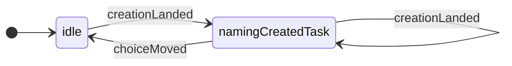

| 出来事 | `idle` | `namingCreatedTask` |
| --- | --- | --- |
| `fieldEntry/creationLanded` | → `namingCreatedTask` [`isCreatedTask`]<br>それ以外 → — | → 自己 [`isCreatedTask`]（`createdTaskUid` を書き換える）<br>それ以外 → — |
| `fieldEntry/choiceMoved` | — | → `idle` |

- `createdTaskNamingStateMachine.idle` —— 初期。根拠 `FR-091` ・ `FR-072`
- `createdTaskNamingStateMachine.namingCreatedTask` —— 運ぶ値 `createdTaskUid`（`TC-9`）。根拠 `FR-091` ・ `TC-9` ・ `FR-001`

表に無い出来事は `createdTaskNamingStateMachine` を変えない（同じ参照）。

### 状態機械 `fieldEditStateMachine`

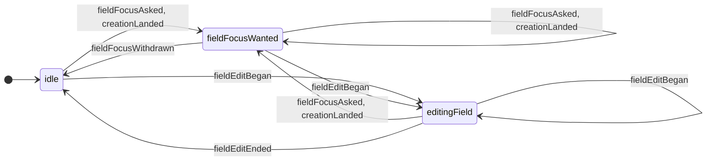

| 出来事 | `idle` | `fieldFocusWanted` | `editingField` |
| --- | --- | --- | --- |
| `fieldEntry/fieldFocusAsked` | → `fieldFocusWanted` | → 自己（`fieldRow` を書き換える） | → `fieldFocusWanted` [not `isEditedField`]（求めた欄が編集中の欄なら求めは既に満ちている）<br>それ以外 → — |
| `fieldEntry/creationLanded` | → `fieldFocusWanted`（`fieldRow` はタスクなら `PR-1`、行なら `AT-53`） | → 自己（`fieldRow` を書き換える） | → `fieldFocusWanted`（`fieldRow` はタスクなら `PR-1`、行なら `AT-53`） |
| `fieldEntry/fieldEditBegan` | → `editingField` | → `editingField`（求めた欄なら焦点が入った。別の欄なら人が焦点を動かした —— どちらも求めは終わる） | → 自己（`fieldRow` を書き換える（編集する欄が替わった）） |
| `fieldEntry/fieldEditEnded` | — | — | → `idle` [`isEditedField`]<br>それ以外 → — |
| `fieldEntry/fieldFocusWithdrawn` | — | → `idle` | — |

- `fieldEditStateMachine.idle` —— 初期。根拠 `IN-5a` ・ `IN-5b` ・ `AG-9`
- `fieldEditStateMachine.fieldFocusWanted` —— 運ぶ値 `fieldRow`（`PR-1` ・ `AT-53` ・ `PR-16` ・ `PR-21` ・ `U-27`）。根拠 `IN-5a` ・ `IN-5b` ・ `MK-13` ・ `HF-14` ・ `FR-091` ・ `FR-035`
- `fieldEditStateMachine.editingField` —— 運ぶ値 `fieldRow`（`IF-9` ・ `PR-1` ・ `AT-53` ・ `PR-16` ・ `PR-21` ・ `U-27` ・ `U-60`）。根拠 `AG-9` ・ `IN-5a` ・ `IN-4` ・ `IN-6` ・ `SK-19` ・ `IF-9`

表に無い出来事は `fieldEditStateMachine` を変えない（同じ参照）。

## 選択（`selection`）

**表 T-293 — 選択の状態機械**

本表は、出来事の定義・根の値・状態機械ごとの状態遷移表と状態の一覧からなる。  
状態遷移表の行はその状態機械を動かす出来事、列はその状態機械の葉の状態、升は「→ 次の状態 [ガード] / 副作用」である。  
升の「—」は変化なし（同じ参照）を表す。  
ガードの付いた枝がすべての場合を覆わない升には「それ以外 → —」を添え、どの場合に何が起きるかを升ごとに言い切る。  
親の状態に置いた升は、その子のすべての列に同じ升を刷り、「親 … の升」と書き添える。

### 選択の出来事

| 出来事 | どこから来るか | 運ぶ値 | 動かすもの |
| --- | --- | --- | --- |
| `selection/objectsPicked` | 入力（対象を選ぶ押下・範囲・`Shift` での増減・全選択・端のドラッグで絞ること。新しい選択は呼び手（入力の翻訳係）が組み、値が変わったときだけ送る）: `SL-2` ・ `SL-3` ・ `SL-4` ・ `SK-2` ・ `SL-7a` | `pickedObjects`（`SL-1` ・ `SL-7b`） | `selectionStateMachine` |
| `selection/emptyAreaClicked` | 入力（何にも当たらない場所での素の左クリック（構えなし））: `MK-11` ・ `SL-6` | — | `selectionStateMachine` |
| `selection/selectionEscapePressed` | 入力（`Esc`。画面の値の `escapePressed` と同じ押下から呼び手が作る）: `IN-4` | `rung`（消費する `IN-4` の段の語。呼び手が詰める） | `selectionStateMachine` |
| `selection/selectionSettleKeyPressed` | 入力（`Enter`。通知も確定していないその場の編集も無く、プロパティパネルも出していないときだけ呼び手が送る）: `SK-19` | — | `selectionStateMachine` |
| `selection/selectionCleared` | 副作用の結果（画面の値の副作用 `clearSelection` の結果）: `FR-091` | — | `selectionStateMachine` |
| `selection/selectionPruned` | 副作用の結果（書き込みが着地し、文書に無くなった対象を刈った。表示の切り替えでの刈りは書かない）: `FR-081` ・ `UN-9` | `remainingObjects` | `selectionStateMachine` |
| `selection/createdTaskSelected` | 副作用の結果（作る書き込みが着地し、作ったタスクが文書に在る）: `FR-001` ・ `FR-091` ・ `TC-9` | `createdTaskUid`（`TC-9`） | `selectionStateMachine` |
| `selection/rowsPicked` | 入力（行見出しパネルで行を選ぶ・増減する）: `FR-085` ・ `FR-042` | `chosenRows` | 根 |
| `selection/createdRowSelected` | 副作用の結果（行を足す書き込みが着地し、足した行が文書に在る）: `HF-14` | `createdGroupId` | 根 |
| `selection/resourcesPicked` | 入力（担当者の一覧で選ぶ・すべて選ぶ・すべて解く・増減する）: `FR-099` ・ `AS-6` | `chosenResources` | 根 |
| `selection/copyTaken` | 入力（写せる選び方のときだけ呼び手が送る。写せないときは `RS-27` で断り、出来事を作らない）: `SK-4` ・ `FR-033` | `copiedForPaste` | 根 |

### 根 `selection` の値

運ぶ値: `chosenRows`（`FR-085`） ／ `chosenResources`（`FR-099` ・ `AS-6`） ／ `copiedForPaste`（`FR-033`。無いこともある）。  
根拠: `FR-081` ・ `FR-085` ・ `FR-099` ・ `FR-033` ・ `UN-9`。

| 出来事 | `selection` |
| --- | --- |
| `selection/rowsPicked` | → 自己（`chosenRows` を書き換える） |
| `selection/createdRowSelected` | → 自己（`chosenRows` を作った行 1 つにする） |
| `selection/resourcesPicked` | → 自己（`chosenResources` を書き換える） |
| `selection/copyTaken` | → 自己（`copiedForPaste` を書き換える） |

**図 F-039 — 選択の状態遷移**

状態機械ごとに 1 つの図に分け、その状態機械の節に置く。状態機械どうしは直交する。  
矢印のラベルは出来事のキーだけであり、ガード・副作用は同じ節の状態遷移表が持つ。  
⚠️ 図は畳んである —— 同じ出来事・ガード・先・副作用の升が 3 つ以上の兄弟の種類のどの 2 つの間も結ぶか、それらのどれからも同じ 1 つの種類へ出るか、同じ 1 つの種類から入るときは、兄弟を 1 つの箱に囲み、その遷移を箱から 1 本だけ描く（どの 2 つの間も結ぶ遷移は、箱の注に出来事のキーを書く）。  
⭐ 遷移の全数は 表 T-293 の状態遷移表が持つ。

### 状態機械 `selectionStateMachine`

```mermaid
stateDiagram-v2
    direction LR
    [*] --> selectionStateMachine_nothingSelected
    selectionStateMachine_nothingSelected : nothingSelected
    selectionStateMachine_objectsSelected : objectsSelected
    selectionStateMachine_nothingSelected --> selectionStateMachine_objectsSelected : objectsPicked, createdTaskSelected
    selectionStateMachine_objectsSelected --> selectionStateMachine_objectsSelected : objectsPicked, selectionPruned, createdTaskSelected
    selectionStateMachine_objectsSelected --> selectionStateMachine_nothingSelected : objectsPicked, emptyAreaClicked, selectionEscapePressed, selectionSettleKeyPressed, selectionCleared, selectionPruned
```

| 出来事 | `nothingSelected` | `objectsSelected` |
| --- | --- | --- |
| `selection/objectsPicked` | → `objectsSelected` [`hasPickedObjects`]<br>それ以外 → — | → 自己 [`hasPickedObjects`]（`selectedObjects` を書き換える）<br>→ `nothingSelected` [not `hasPickedObjects`] |
| `selection/emptyAreaClicked` | — | → `nothingSelected` |
| `selection/selectionEscapePressed` | — | → `nothingSelected` [`isRungSelection`]<br>それ以外 → — |
| `selection/selectionSettleKeyPressed` | — | → `nothingSelected` |
| `selection/selectionCleared` | — | → `nothingSelected` |
| `selection/selectionPruned` | — | → 自己 [`hasRemainingObjects`]（`selectedObjects` を書き換える）<br>→ `nothingSelected` [not `hasRemainingObjects`] |
| `selection/createdTaskSelected` | → `objectsSelected`（`selectedObjects` は作ったタスク 1 つ） | → 自己（`selectedObjects` を作ったタスク 1 つに置き換える） |

- `selectionStateMachine.nothingSelected` —— 初期。根拠 `SP-1` ・ `MK-11` ・ `SL-6`
- `selectionStateMachine.objectsSelected` —— 運ぶ値 `selectedObjects`（`SL-1` ・ `SL-7b`）。根拠 `SP-2` ・ `SP-3` ・ `SL-1` ・ `IN-4`

表に無い出来事は `selectionStateMachine` を変えない（同じ参照）。
