# 状態機械 — 出来事・状態・状態遷移表

**UID**: DOC-TBL-STATE-MACHINES
**Version**: 0.2

> ⛔ 本書は生成物である。  
> 手で直さない —— 直しても次の `npm run gen` で消える。
> **状態機械の唯一の正は `_source/state-machines.json` である。**  
> 本書はそれを `_source/state_machines_json_to_md.py` が印字したものである。
> **作り直す**: `npm run gen` ／ **ズレを検出する**: `npm run gen:check`。

本書は、保存しない状態の状態機械（`05-07-design.md` の 5.6 の ADR-002）を、領域ごと・状態機械ごとに印字したものである。  
原稿が持つもの・持たないものは `05-07-design.md` の 表 T-250 が、状態機械の形は 表 T-249 が持つ。  
名前の読み方は `05-07-design.md` の 5.5 が持つ。

## 画面の値（`screen`）

**表 T-280 — 画面の値の状態機械**

本表は、出来事の定義・根の値・状態機械ごとの状態遷移表と状態の一覧からなる。  
状態遷移表の行はその状態機械を動かす出来事、列はその状態機械の葉の状態、升は「→ 次の状態 [ガード] / 副作用」である。  
升の「—」は変化なし（同じ参照）を表す。  
ガードの付いた枝がすべての場合を覆わない升には「それ以外 → —」を添え、どの場合に何が起きるかを升ごとに言い切る。  
親の状態に置いた升は、その子のすべての列に同じ升を刷り、「親 … の升」と書き添える。

### 画面の値の出来事

| 出来事 | どこから来るか | 運ぶ値 | 動かすもの |
| --- | --- | --- | --- |
| `screen/paletteToggled` | 入力: `IC-7` ・ `SK-14` | — | `paletteDisplayStateMachine` |
| `screen/paletteMinimiseToggled` | 入力: `IC-75` | — | `paletteDisplayStateMachine` |
| `screen/milestoneListToggled` | 入力: `IC-50` | — | `milestoneListDisplayStateMachine` |
| `screen/fullScreenEntryPressed` | 入力: `IC-11` ・ `SK-15` | — | `fullScreenModeStateMachine` |
| `screen/fullScreenChanged` | 副作用の結果（ブラウザの `fullscreenchange`）: `FR-071` | `isFullScreen` | `fullScreenModeStateMachine` |
| `screen/surfaceEntryPressed` | 入力: `IC-22` ・ `SK-13` ・ `IC-19` ・ `IC-62` ・ `IC-2` ・ `SK-12` | `surfaceName` | `openSurfaceStateMachine` |
| `screen/surfaceRaisedByFlow` | 副作用の結果（ファイルの領域が面を立てる）: `OP-3` ・ `U-56` ・ `U-61` ・ `U-62` | `surfaceName` | `openSurfaceStateMachine` |
| `screen/surfaceCloseAsked` | 入力: `IC-52` | `target`（閉じる対象。面かパネルか） | `openSurfaceStateMachine` ・ `propertiesPanelContentStateMachine` |
| `screen/escapePressed` | 入力（`Esc`）: `IN-4` | `rung`（消費する `IN-4` の段の語。呼び手が詰める） | `armModeStateMachine` ・ `openSurfaceStateMachine` ・ `propertiesPanelContentStateMachine` ・ `dualCursorModeStateMachine` ・ `tooltipDisplayStateMachine` |
| `screen/armEntryPressed` | 入力: `IC-23` ・ `IC-24` ・ `IC-25` ・ `IC-26` ・ `IC-27` ・ `IC-61` ・ `IC-35` ・ `IC-36` ・ `FR-016` | `armKind` ／ `shapeKind` ／ `glyph` | `armModeStateMachine` |
| `screen/watermarkEntryPressed` | 入力: `IC-41` ・ `WM-10` | — | `openSurfaceStateMachine` ・ `watermarkDisplayStateMachine` |
| `screen/watermarkUnlockAnswered` | 入力（`U-60` の答え）: `U-60` ・ `WM-6` ・ `WM-7` | `isProceeding` | `openSurfaceStateMachine` |
| `screen/watermarkUnlockMatched` | 副作用の結果（照合）: `WM-6` ・ `WM-8` | — | `openSurfaceStateMachine` ・ `watermarkDisplayStateMachine` |
| `screen/watermarkUnlockMismatched` | 副作用の結果（照合）: `WM-8` | — | `openSurfaceStateMachine` |
| `screen/settingsEntryPressed` | 入力: `IC-17` ・ `FR-072` | — | `propertiesPanelContentStateMachine` |
| `screen/propertiesOfChoiceAsked` | 入力（パネルを出すことを要求が名指した押下。員数は各要求が持つ）: `FR-072` | `subject` | `propertiesPanelContentStateMachine` |
| `screen/selectionMoved` | ほかの領域の結果（選択）: `FR-072` | `subject`（空もありうる） | `propertiesPanelContentStateMachine` |
| `screen/createdNameSettled` | 入力（作った直後の名前の `Enter`）: `FR-091` | — | `propertiesPanelContentStateMachine` |
| `screen/settleKeyPressed` | 入力（`SK-19` の 2 段目）: `SK-19` ・ `FR-070` | `hasNoSurfaceOrConfirmation` ／ `hasNoUnsettledEntry` | `propertiesPanelContentStateMachine` |
| `screen/dialogueFieldEntryPressed` | 入力: `IC-18` ・ `FR-066` | `isAgentApiEnabled` | `dialogueFieldDisplayStateMachine` |
| `screen/foldAllPressed` | 入力（`HF-12` の操作子）: `HF-12` ・ `HR-2` | — | `levelZeroFoldStateMachine` |
| `screen/levelZeroOpened` | 入力: `HF-16` ・ `HF-10` ・ `HF-17` ・ `S-211` | — | `levelZeroFoldStateMachine` |
| `screen/dualCursorEntryPressed` | 入力: `IC-45` ・ `DC-1` ・ `DC-4` | `date`（置く日付） ／ `hasDaysToPlace` | `armModeStateMachine` ・ `dualCursorModeStateMachine` |
| `screen/dualCursorPlaced` | 入力（`Row Area` のクリック）: `DC-2` ・ `PTD-2` | `date`（置く日付） | `dualCursorModeStateMachine` |
| `screen/displayScaleStepped` | 入力: `IC-104` ・ `IC-105` ・ `SK-22` ・ `SK-23` ・ `SK-17` ・ `SE-1` | `percent` ／ `end` | `scaleMessageDisplayStateMachine` |
| `screen/rowZoomEndReached` | 副作用の結果（行の軸のズームが端に当たった）: `ZE-5` | `percent` ／ `end` | `scaleMessageDisplayStateMachine` |
| `screen/scaleMessageTimeElapsed` | 時間: `S-244` ・ `SE-3` | — | `scaleMessageDisplayStateMachine` |
| `screen/displayLanguageChosen` | 入力: `IC-21` ・ `FR-038` | `language` | 根 |
| `screen/progressMarkerPressed` | 入力（進捗マーカーの押下）: `GA-18` ・ `FR-107` ・ `PV-4` | `taskUid` ／ `rememberedActual`（覚える実績） | 根 |
| `screen/pointerRestElapsed` | 時間: `EZ-2` | — | `tooltipDisplayStateMachine` |

### 根 `screen` の値

運ぶ値: `language` ／ `rememberedActuals`。  
根拠: `CP-36` ・ `S-99` ・ `PV-4`。

| 出来事 | `screen` |
| --- | --- |
| `screen/displayLanguageChosen` | → 自己 / `storeLanguage`（`language` を書き換える） |
| `screen/progressMarkerPressed` | → 自己 / `writeProgressStep`（`rememberedActuals` を書き換える） |

**図 F-026 — 画面の値の状態遷移**

状態機械ごとに 1 つの図に分け、その状態機械の節に置く。状態機械どうしは直交する。  
矢印のラベルは出来事のキーだけであり、ガード・副作用は同じ節の状態遷移表が持つ。  
⚠️ 図は畳んである —— 同じ出来事・ガード・先・副作用の升が 3 つ以上の兄弟の種類のどの 2 つの間も結ぶか、それらのどれからも同じ 1 つの種類へ出るか、同じ 1 つの種類から入るときは、兄弟を 1 つの箱に囲み、その遷移を箱から 1 本だけ描く（どの 2 つの間も結ぶ遷移は、箱の注に出来事のキーを書く）。  
⭐ 遷移の全数は 表 T-280 の状態遷移表が持つ。

### 状態機械 `armModeStateMachine`

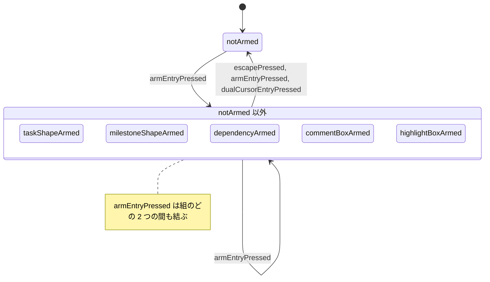

| 出来事 | `notArmed` | `taskShapeArmed` | `milestoneShapeArmed` | `dependencyArmed` | `commentBoxArmed` | `highlightBoxArmed` |
| --- | --- | --- | --- | --- | --- | --- |
| `screen/escapePressed` | — | → `notArmed` [`isRungArmed`] それ以外 → — | → `notArmed` [`isRungArmed`] それ以外 → — | → `notArmed` [`isRungArmed`] それ以外 → — | → `notArmed` [`isRungArmed`] それ以外 → — | → `notArmed` [`isRungArmed`] それ以外 → — |
| `screen/armEntryPressed` | → `{armKind}` | → `notArmed` [`isSameArm`] → `{armKind}` [not `isSameArm`] | → `notArmed` [`isSameArm`] → `{armKind}` [not `isSameArm`] | → `notArmed` [`isSameArm`] → `{armKind}` [not `isSameArm`] | → `notArmed` [`isSameArm`] → `{armKind}` [not `isSameArm`] | → `notArmed` [`isSameArm`] → `{armKind}` [not `isSameArm`] |
| `screen/dualCursorEntryPressed` | — | → `notArmed` [`canEnterDualCursor`] それ以外 → — | → `notArmed` [`canEnterDualCursor`] それ以外 → — | → `notArmed` [`canEnterDualCursor`] それ以外 → — | → `notArmed` [`canEnterDualCursor`] それ以外 → — | → `notArmed` [`canEnterDualCursor`] それ以外 → — |

- `armModeStateMachine.notArmed` —— 初期。根拠 `AR-1`
- `armModeStateMachine.taskShapeArmed` —— 運ぶ値 `shapeKind`（`SH-1` ・ `SH-2` ・ `SH-3` ・ `SH-4`）。根拠 `AR-2` ・ `IC-23` ・ `IC-24` ・ `IC-25` ・ `IC-26`
- `armModeStateMachine.milestoneShapeArmed` —— 運ぶ値 `glyph`（`SH-5`）。根拠 `AR-3` ・ `IC-27`
- `armModeStateMachine.dependencyArmed` —— 根拠 `AR-4` ・ `IC-61`
- `armModeStateMachine.commentBoxArmed` —— 根拠 `AR-5` ・ `IC-35`
- `armModeStateMachine.highlightBoxArmed` —— 根拠 `AR-6` ・ `IC-36`

表に無い出来事は `armModeStateMachine` を変えない（同じ参照）。

### 状態機械 `paletteDisplayStateMachine`

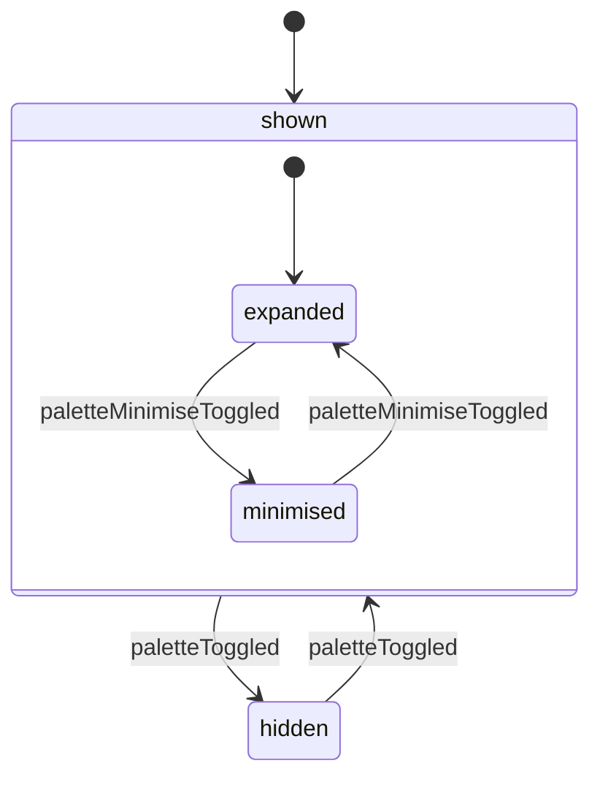

| 出来事 | `shown.expanded` | `shown.minimised` | `hidden` |
| --- | --- | --- | --- |
| `screen/paletteToggled` | → `hidden`（親 `shown` の升） | → `hidden`（親 `shown` の升） | → `shown` |
| `screen/paletteMinimiseToggled` | → `shown.minimised` | → `shown.expanded` | — |

- `paletteDisplayStateMachine.shown` —— 初期。根拠 `S-99e`
- `paletteDisplayStateMachine.shown.expanded` —— 初期。親 `paletteDisplayStateMachine.shown`。根拠 `S-200` ・ `FR-053`
- `paletteDisplayStateMachine.shown.minimised` —— 親 `paletteDisplayStateMachine.shown`。根拠 `S-200` ・ `IC-75`
- `paletteDisplayStateMachine.hidden` —— 根拠 `S-99e`

表に無い出来事は `paletteDisplayStateMachine` を変えない（同じ参照）。

### 状態機械 `milestoneListDisplayStateMachine`

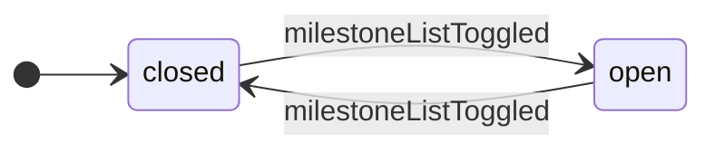

| 出来事 | `closed` | `open` |
| --- | --- | --- |
| `screen/milestoneListToggled` | → `open` | → `closed` |

- `milestoneListDisplayStateMachine.closed` —— 初期。根拠 `S-142` ・ `FR-053`
- `milestoneListDisplayStateMachine.open` —— 根拠 `S-142` ・ `IC-50`

表に無い出来事は `milestoneListDisplayStateMachine` を変えない（同じ参照）。

### 状態機械 `fullScreenModeStateMachine`

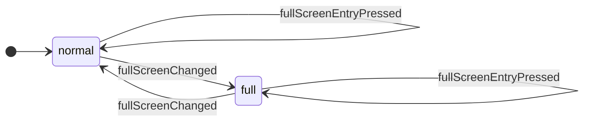

| 出来事 | `normal` | `full` |
| --- | --- | --- |
| `screen/fullScreenEntryPressed` | → 自己 / `askBrowserForFullScreen` | → 自己 / `askBrowserForFullScreen` |
| `screen/fullScreenChanged` | → `full` [`isFullScreen`] それ以外 → — | → `normal` [not `isFullScreen`] それ以外 → — |

- `fullScreenModeStateMachine.normal` —— 初期。根拠 `S-99f`
- `fullScreenModeStateMachine.full` —— 根拠 `S-99f` ・ `FR-071`

表に無い出来事は `fullScreenModeStateMachine` を変えない（同じ参照）。

### 状態機械 `openSurfaceStateMachine`

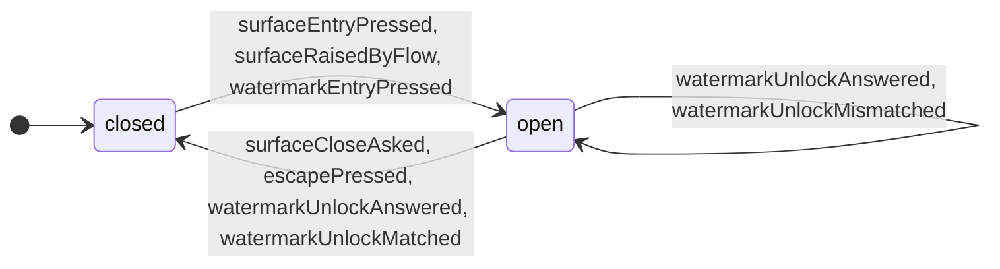

| 出来事 | `closed` | `open` |
| --- | --- | --- |
| `screen/surfaceEntryPressed` | → `open` | — |
| `screen/surfaceRaisedByFlow` | → `open` | — |
| `screen/surfaceCloseAsked` | — | → `closed` [`isSurfaceTarget`] / `tellFlowSurfaceClosed` それ以外 → — |
| `screen/escapePressed` | — | → `closed` [`isRungSurface`] / `tellFlowSurfaceClosed` それ以外 → — |
| `screen/watermarkEntryPressed` | → `open` [`watermarkDisplayStateMachine.shown` にいる]（`surfaceName` は `U-60`） それ以外 → — | — |
| `screen/watermarkUnlockAnswered` | — | → 自己 [`isWatermarkUnlockSurface` & `isProceeding`] / `matchWatermarkUnlock` → `closed` [`isWatermarkUnlockSurface` & not `isProceeding`] それ以外 → — |
| `screen/watermarkUnlockMatched` | — | → `closed` [`watermarkDisplayStateMachine.shown` にいる & `isWatermarkUnlockSurface`] それ以外 → — |
| `screen/watermarkUnlockMismatched` | — | → 自己 [`isWatermarkUnlockSurface`] / `raiseNotice`（`RS-41`）（面を閉じない） それ以外 → — |

- `openSurfaceStateMachine.closed` —— 初期。根拠 `S-99g`
- `openSurfaceStateMachine.open` —— 運ぶ値 `surfaceName`（`U-30` ・ `U-49` ・ `U-54` ・ `U-56` ・ `U-60` ・ `U-61` ・ `U-62`）。根拠 `S-99g` ・ `IC-52`

表に無い出来事は `openSurfaceStateMachine` を変えない（同じ参照）。

### 状態機械 `watermarkDisplayStateMachine`

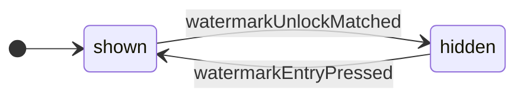

| 出来事 | `shown` | `hidden` |
| --- | --- | --- |
| `screen/watermarkEntryPressed` | — | → `shown` |
| `screen/watermarkUnlockMatched` | → `hidden` [`openSurfaceStateMachine.open` にいる & `isWatermarkUnlockSurface`] それ以外 → — | — |

- `watermarkDisplayStateMachine.shown` —— 初期。根拠 `S-144`
- `watermarkDisplayStateMachine.hidden` —— 根拠 `WM-8`

表に無い出来事は `watermarkDisplayStateMachine` を変えない（同じ参照）。

### 状態機械 `propertiesPanelContentStateMachine`

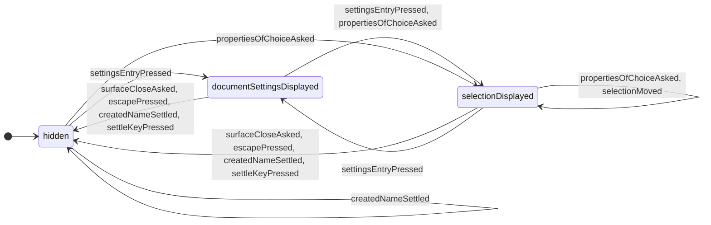

| 出来事 | `hidden` | `selectionDisplayed` | `documentSettingsDisplayed` |
| --- | --- | --- | --- |
| `screen/surfaceCloseAsked` | — | → `hidden` [`isPanelTarget`] それ以外 → — | → `hidden` [`isPanelTarget`] それ以外 → — |
| `screen/escapePressed` | — | → `hidden` [`isRungSurface` & `isPanelTopmost`] それ以外 → — | → `hidden` [`isRungSurface` & `isPanelTopmost`] それ以外 → — |
| `screen/settingsEntryPressed` | → `documentSettingsDisplayed` | → `documentSettingsDisplayed`（`subject` を `returnSubject` に移す） | → `selectionDisplayed`（`returnSubject` を `subject` に戻す） |
| `screen/propertiesOfChoiceAsked` | → `selectionDisplayed` | → 自己（`subject` を書き換える） | → `selectionDisplayed` |
| `screen/selectionMoved` | — | → 自己 [`hasChoice`]（`subject` を書き換える） それ以外 → — | — |
| `screen/createdNameSettled` | → 自己 / `clearSelection` | → `hidden` / `clearSelection` | → `hidden` / `clearSelection` |
| `screen/settleKeyPressed` | — | → `hidden` [`hasNoSurfaceOrConfirmation` & `hasNoUnsettledEntry`] それ以外 → — | → `hidden` [`hasNoSurfaceOrConfirmation` & `hasNoUnsettledEntry`] それ以外 → — |

- `propertiesPanelContentStateMachine.hidden` —— 初期。根拠 `S-99h`
- `propertiesPanelContentStateMachine.selectionDisplayed` —— 運ぶ値 `subject`（選択と行の集合）。根拠 `S-99h` ・ `IR-2` ・ `FR-072`
- `propertiesPanelContentStateMachine.documentSettingsDisplayed` —— 運ぶ値 `returnSubject`（同じ入口をもう一度押したときに戻す選択物。無いこともある）。根拠 `S-99h` ・ `FR-072` ・ `IC-17`

表に無い出来事は `propertiesPanelContentStateMachine` を変えない（同じ参照）。

### 状態機械 `dialogueFieldDisplayStateMachine`

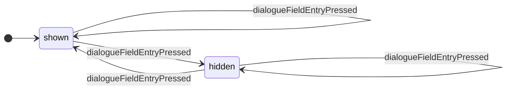

| 出来事 | `shown` | `hidden` |
| --- | --- | --- |
| `screen/dialogueFieldEntryPressed` | → `hidden` [`isAgentApiEnabled`] → 自己 [not `isAgentApiEnabled`] / `raiseNotice`（`RS-35`） | → `shown` [`isAgentApiEnabled`] → 自己 [not `isAgentApiEnabled`] / `raiseNotice`（`RS-35`） |

- `dialogueFieldDisplayStateMachine.shown` —— 初期。根拠 `S-99i`
- `dialogueFieldDisplayStateMachine.hidden` —— 根拠 `S-99i` ・ `FR-066`

表に無い出来事は `dialogueFieldDisplayStateMachine` を変えない（同じ参照）。

### 状態機械 `levelZeroFoldStateMachine`

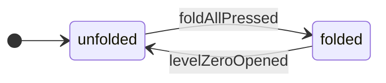

| 出来事 | `unfolded` | `folded` |
| --- | --- | --- |
| `screen/foldAllPressed` | → `folded` / `writeFoldAll` | — |
| `screen/levelZeroOpened` | — | → `unfolded` / `writeOpenLevel` |

- `levelZeroFoldStateMachine.unfolded` —— 初期。根拠 `S-211`
- `levelZeroFoldStateMachine.folded` —— 根拠 `HR-2` ・ `S-211`

表に無い出来事は `levelZeroFoldStateMachine` を変えない（同じ参照）。

### 状態機械 `dualCursorModeStateMachine`

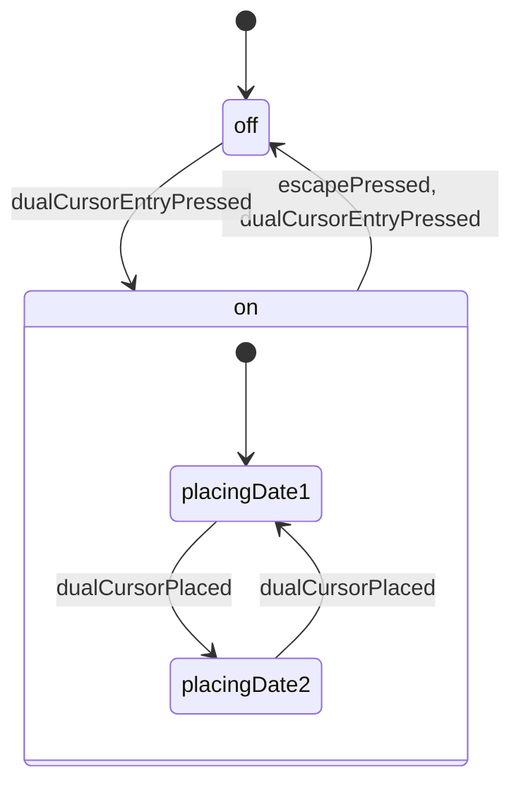

| 出来事 | `off` | `on.placingDate1` | `on.placingDate2` |
| --- | --- | --- | --- |
| `screen/escapePressed` | — | → `off` [`isRungDualCursor`] / `writeClearDualCursor` それ以外 → —（親 `on` の升） | → `off` [`isRungDualCursor`] / `writeClearDualCursor` それ以外 → —（親 `on` の升） |
| `screen/dualCursorEntryPressed` | → `on` [`hasDaysToPlace`] / `writePlaceDualCursor` それ以外 → — | → `off` / `writeClearDualCursor`（親 `on` の升） | → `off` / `writeClearDualCursor`（親 `on` の升） |
| `screen/dualCursorPlaced` | — | → `on.placingDate2` / `writeFixDate1` | → `on.placingDate1` / `writeFixDate2` |

- `dualCursorModeStateMachine.off` —— 初期。根拠 `DC-1`
- `dualCursorModeStateMachine.on` —— 根拠 `DC-1` ・ `PTD-2`
- `dualCursorModeStateMachine.on.placingDate1` —— 初期。親 `dualCursorModeStateMachine.on`。根拠 `DC-1`
- `dualCursorModeStateMachine.on.placingDate2` —— 親 `dualCursorModeStateMachine.on`。根拠 `DC-2` ・ `DC-8`

表に無い出来事は `dualCursorModeStateMachine` を変えない（同じ参照）。

### 状態機械 `scaleMessageDisplayStateMachine`

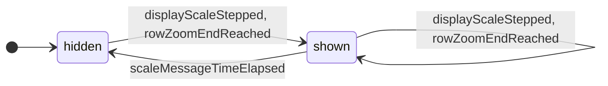

| 出来事 | `hidden` | `shown` |
| --- | --- | --- |
| `screen/displayScaleStepped` | → `shown` / `startScaleMessageTimer` | → 自己 / `restartScaleMessageTimer`（中身を書き換える） |
| `screen/rowZoomEndReached` | → `shown` / `startScaleMessageTimer` | → 自己 / `restartScaleMessageTimer`（中身を書き換える） |
| `screen/scaleMessageTimeElapsed` | — | → `hidden` |

- `scaleMessageDisplayStateMachine.hidden` —— 初期。根拠 `SE-1`
- `scaleMessageDisplayStateMachine.shown` —— 運ぶ値 `percent` ／ `end`（`max` ・ `min` ・ なし）。根拠 `SE-2` ・ `ZE-5` ・ `S-244`

表に無い出来事は `scaleMessageDisplayStateMachine` を変えない（同じ参照）。

### 状態機械 `tooltipDisplayStateMachine`

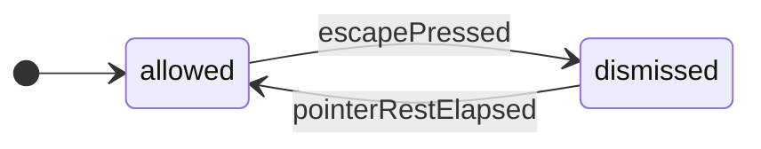

| 出来事 | `allowed` | `dismissed` |
| --- | --- | --- |
| `screen/escapePressed` | → `dismissed` [`isRungTooltip`] それ以外 → — | — |
| `screen/pointerRestElapsed` | — | → `allowed` |

- `tooltipDisplayStateMachine.allowed` —— 初期。根拠 `IN-3`
- `tooltipDisplayStateMachine.dismissed` —— 根拠 `IN-3` ・ `IN-4`

表に無い出来事は `tooltipDisplayStateMachine` を変えない（同じ参照）。

## 通知（`notices`）

**表 T-286 — 通知の状態機械**

本表は、出来事の定義・根の値・状態機械ごとの状態遷移表と状態の一覧からなる。  
状態遷移表の行はその状態機械を動かす出来事、列はその状態機械の葉の状態、升は「→ 次の状態 [ガード] / 副作用」である。  
升の「—」は変化なし（同じ参照）を表す。  
ガードの付いた枝がすべての場合を覆わない升には「それ以外 → —」を添え、どの場合に何が起きるかを升ごとに言い切る。  
親の状態に置いた升は、その子のすべての列に同じ升を刷り、「親 … の升」と書き添える。

### 通知の出来事

| 出来事 | どこから来るか | 運ぶ値 | 動かすもの |
| --- | --- | --- | --- |
| `notices/noticeRaised` | 副作用の結果（副作用 `raiseNotice` の実行。ほかの領域の遷移とシェルの流れが返す）: `FR-076` ・ `NT-3` | `reason`（表 T-233 の `RS-` の行、または 表 T-220 の行） ／ `affectedCount`（無いこともある） | `noticeDisplayStateMachine` |
| `notices/newestNoticeDismissAsked` | 入力（`Esc`（`IN-4` の第 1 段）／ `Enter`（`SK-19` の第 1 段）。段は呼び手が決め、同じ入力のほかの何よりも先に進める）: `NT-8` ・ `IN-4` ・ `SK-19` | — | `noticeDisplayStateMachine` |
| `notices/noticeDismissPressed` | 入力（1 つの通知の `OK` の入口を押して離した）: `NT-8` | `reason`（押された通知の理由。`NT-3` の束ねで 1 つの理由に 1 枚なので、理由が通知を 1 つに決める） | `noticeDisplayStateMachine` |
| `notices/documentReplaced` | 副作用の結果（`WS-6` の差し替えが済み、`WS-7` の配りが始まる）: `WS-6` ・ `WS-7` | — | `changeDeliveryStateMachine` |
| `notices/changeDelivered` | 副作用の結果（`WS-7` の配りが終わった）: `WS-7` ・ `AG-6` | `silentWatchers`（答えを返さなかった配り先の数） | `changeDeliveryStateMachine` |

### 根 `notices` の値

運ぶ値: —。  
根拠: `FR-076`。

根の運ぶ値だけを書き換える出来事は無い。

**図 F-029 — 通知の状態遷移**

状態機械ごとに 1 つの図に分け、その状態機械の節に置く。状態機械どうしは直交する。  
矢印のラベルは出来事のキーだけであり、ガード・副作用は同じ節の状態遷移表が持つ。  
⚠️ 図は畳んである —— 同じ出来事・ガード・先・副作用の升が 3 つ以上の兄弟の種類のどの 2 つの間も結ぶか、それらのどれからも同じ 1 つの種類へ出るか、同じ 1 つの種類から入るときは、兄弟を 1 つの箱に囲み、その遷移を箱から 1 本だけ描く（どの 2 つの間も結ぶ遷移は、箱の注に出来事のキーを書く）。  
⭐ 遷移の全数は 表 T-286 の状態遷移表が持つ。

### 状態機械 `noticeDisplayStateMachine`

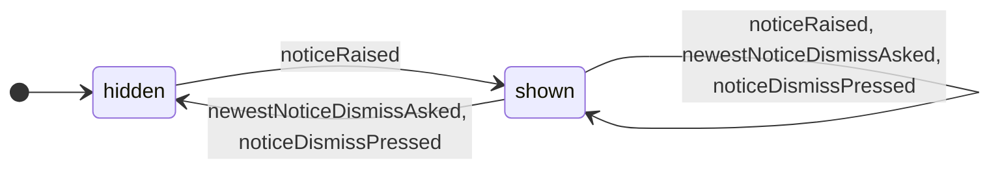

| 出来事 | `hidden` | `shown` |
| --- | --- | --- |
| `notices/noticeRaised` | → `shown`（1 枚） | → 自己 [`isSameReasonStanding`]（その 1 枚の件数を増やし、いちばん新しい位置へ動かす） → 自己 [not `isSameReasonStanding`]（いちばん新しいものとして足す。枚数に上限を置かない） |
| `notices/newestNoticeDismissAsked` | — | → `hidden` [`isOnlyOneStanding`] → 自己 [not `isOnlyOneStanding`]（いちばん新しいものを除く） |
| `notices/noticeDismissPressed` | — | → `hidden` [`isLeavingNone`] → 自己 [`isLeavingSome`]（押されたものを除く） それ以外 → — |

- `noticeDisplayStateMachine.hidden` —— 初期。根拠 `NT-8` ・ `IN-4`
- `noticeDisplayStateMachine.shown` —— 運ぶ値 `standing`（出ている通知の列。古い順。1 つは理由と件数）。根拠 `FR-076` ・ `NT-3` ・ `NT-8` ・ `IN-4` ・ `SK-19` ・ `IR-3`

表に無い出来事は `noticeDisplayStateMachine` を変えない（同じ参照）。

### 状態機械 `changeDeliveryStateMachine`

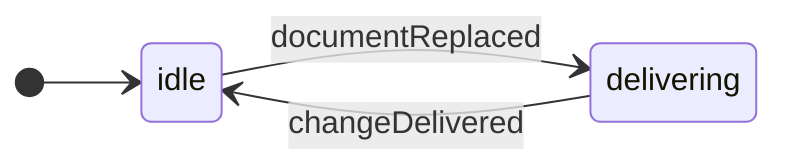

| 出来事 | `idle` | `delivering` |
| --- | --- | --- |
| `notices/documentReplaced` | → `delivering` | — |
| `notices/changeDelivered` | — | → `idle` [not `hasSilentWatcher`] → `idle` [`hasSilentWatcher`] / `raiseNotice`（`RS-23`） |

- `changeDeliveryStateMachine.idle` —— 初期。根拠 `WS-7`
- `changeDeliveryStateMachine.delivering` —— 根拠 `WS-2` ・ `RS-9` ・ `CA-3`

表に無い出来事は `changeDeliveryStateMachine` を変えない（同じ参照）。
